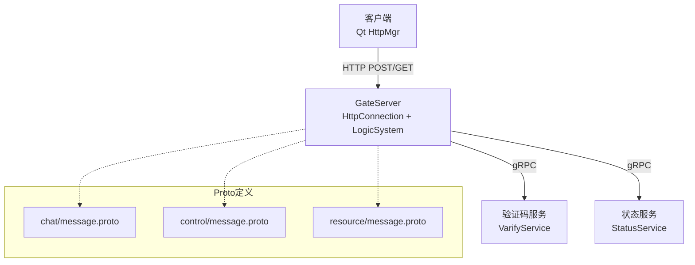
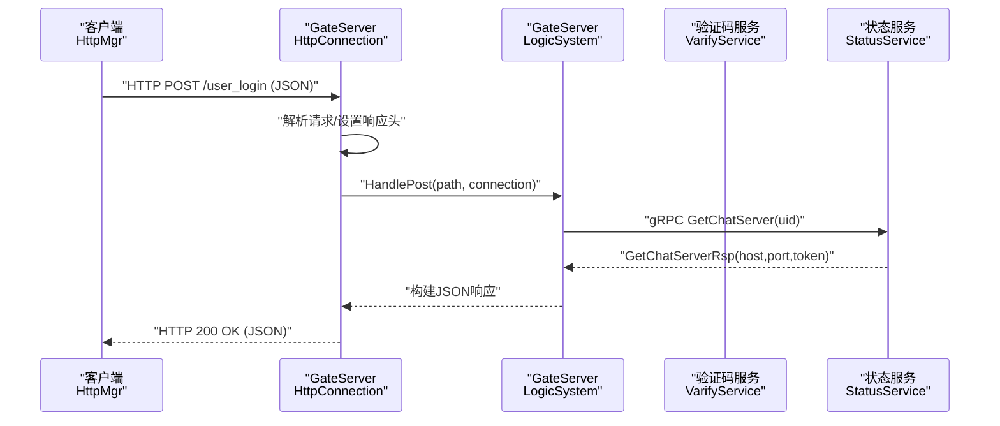
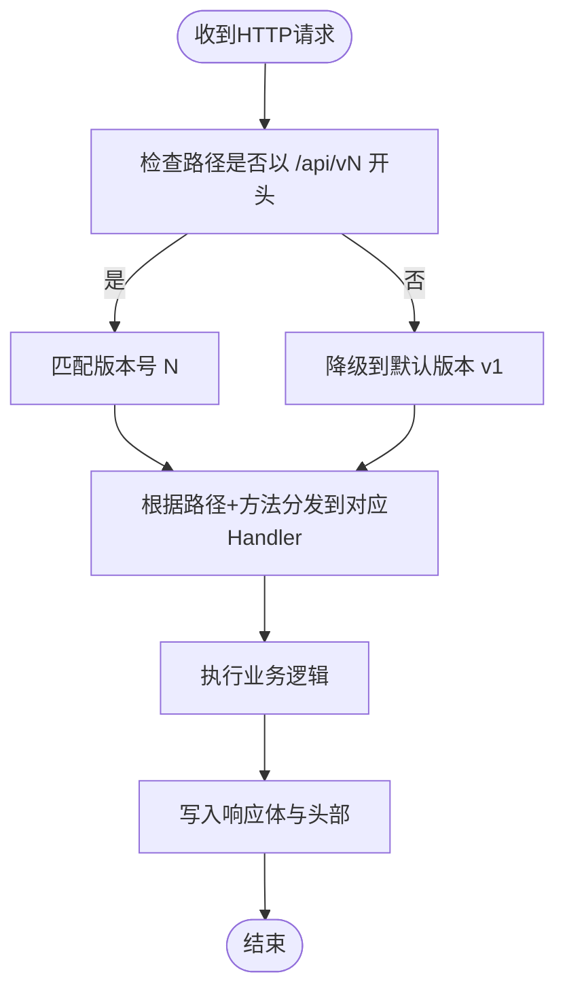
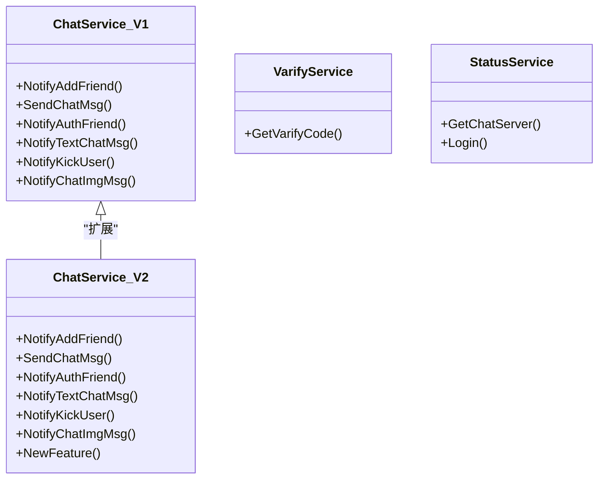
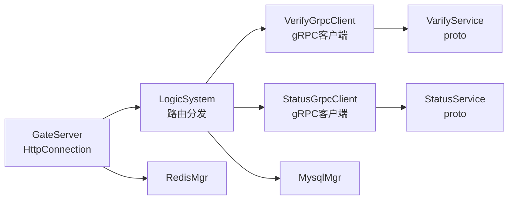

# API版本管理

<cite>
**本文引用的文件**   
- [HttpConnection.h](file://server/GateServer/include/HttpConnection.h)
- [HttpConnection.cpp](file://server/GateServer/src/HttpConnection.cpp)
- [LogicSystem.h](file://server/GateServer/include/LogicSystem.h)
- [LogicSystem.cpp](file://server/GateServer/src/LogicSystem.cpp)
- [VerifyGrpcClient.h](file://server/GateServer/include/VerifyGrpcClient.h)
- [VerifyGrpcClient.cpp](file://server/GateServer/src/VerifyGrpcClient.cpp)
- [StatusGrpcClient.h](file://server/GateServer/include/StatusGrpcClient.h)
- [StatusGrpcClient.cpp](file://server/GateServer/src/StatusGrpcClient.cpp)
- [message.proto（chat）](file://server/proto/chat/message.proto)
- [message.proto（control）](file://server/proto/control/message.proto)
- [message.proto（resource）](file://server/proto/resource/message.proto)
- [httpmgr.h](file://client/llfcchat/include/httpmgr.h)
- [httpmgr.cpp](file://client/llfcchat/src/httpmgr.cpp)
</cite>

## 目录
1. [简介](#简介)
2. [项目结构](#项目结构)
3. [核心组件](#核心组件)
4. [架构总览](#架构总览)
5. [详细组件分析](#详细组件分析)
6. [依赖关系分析](#依赖关系分析)
7. [性能考量](#性能考量)
8. [故障排查指南](#故障排查指南)
9. [结论](#结论)
10. [附录：版本迁移与兼容性测试方案](#附录版本迁移与兼容性测试方案)

## 简介
本文件面向LLFCChat项目的API版本管理，覆盖HTTP API与gRPC服务的版本策略、兼容性与演进路径。当前代码库中GateServer作为HTTP网关，负责接收客户端请求并路由到业务处理逻辑；同时通过gRPC调用验证码服务与状态服务。proto定义分布在多个包下，尚未显式引入版本化前缀或头字段。本文基于现有实现，给出可落地的版本化设计建议、向后兼容策略、灰度发布与回滚方案，以及完整的迁移与测试流程。

## 项目结构
- GateServer：HTTP网关与业务路由中心，使用Boost.Beast处理HTTP请求，内部维护GET/POST路由表，并通过gRPC客户端调用后端服务。
- gRPC客户端：VerifyGrpcClient与StatusGrpcClient分别封装验证码服务与状态服务的连接池与调用。
- Proto定义：chat/control/resource三个包的message.proto定义了跨服务通信的接口与消息结构。
- 客户端：Qt HTTP管理器用于发起HTTP POST请求，设置JSON内容类型并分发响应信号。

图表来源
- [HttpConnection.cpp:132-194](file://server/GateServer/src/HttpConnection.cpp#L132-L194)
- [LogicSystem.cpp:36-406](file://server/GateServer/src/LogicSystem.cpp#L36-L406)
- [VerifyGrpcClient.h:80-110](file://server/GateServer/include/VerifyGrpcClient.h#L80-L110)
- [StatusGrpcClient.h:81-94](file://server/GateServer/include/StatusGrpcClient.h#L81-L94)
- [message.proto（chat）:1-167](file://server/proto/chat/message.proto#L1-L167)
- [message.proto（control）:1-143](file://server/proto/control/message.proto#L1-L143)
- [message.proto（resource）:1-169](file://server/proto/resource/message.proto#L1-L169)

章节来源
- [HttpConnection.h:1-36](file://server/GateServer/include/HttpConnection.h#L1-L36)
- [HttpConnection.cpp:1-225](file://server/GateServer/src/HttpConnection.cpp#L1-L225)
- [LogicSystem.h:1-24](file://server/GateServer/include/LogicSystem.h#L1-L24)
- [LogicSystem.cpp:1-477](file://server/GateServer/src/LogicSystem.cpp#L1-L477)
- [VerifyGrpcClient.h:1-113](file://server/GateServer/include/VerifyGrpcClient.h#L1-L113)
- [VerifyGrpcClient.cpp:1-9](file://server/GateServer/src/VerifyGrpcClient.cpp#L1-L9)
- [StatusGrpcClient.h:1-98](file://server/GateServer/include/StatusGrpcClient.h#L1-L98)
- [StatusGrpcClient.cpp:1-53](file://server/GateServer/src/StatusGrpcClient.cpp#L1-L53)
- [message.proto（chat）:1-167](file://server/proto/chat/message.proto#L1-L167)
- [message.proto（control）:1-143](file://server/proto/control/message.proto#L1-L143)
- [message.proto（resource）:1-169](file://server/proto/resource/message.proto#L1-L169)
- [httpmgr.h:1-34](file://client/llfcchat/include/httpmgr.h#L1-L34)
- [httpmgr.cpp:1-62](file://client/llfcchat/src/httpmgr.cpp#L1-L62)

## 核心组件
- HTTP网关层（GateServer）
  - HttpConnection：解析HTTP请求、设置响应头、统一错误返回与超时控制。
  - LogicSystem：注册并分发GET/POST路由，串联业务处理与外部gRPC调用。
- gRPC客户端层
  - VerifyGrpcClient：验证码服务调用，含连接池与错误码映射。
  - StatusGrpcClient：状态服务调用，含连接池与错误码映射。
- Proto契约层
  - chat/control/resource三个包的message.proto定义服务与消息结构。
- 客户端HTTP层
  - HttpMgr：封装QNetworkAccessManager，发送JSON POST请求并分发完成信号。

章节来源
- [HttpConnection.cpp:132-194](file://server/GateServer/src/HttpConnection.cpp#L132-L194)
- [LogicSystem.cpp:36-406](file://server/GateServer/src/LogicSystem.cpp#L36-L406)
- [VerifyGrpcClient.h:80-110](file://server/GateServer/include/VerifyGrpcClient.h#L80-L110)
- [StatusGrpcClient.h:81-94](file://server/GateServer/include/StatusGrpcClient.h#L81-L94)
- [message.proto（chat）:1-167](file://server/proto/chat/message.proto#L1-L167)
- [message.proto（control）:1-143](file://server/proto/control/message.proto#L1-L143)
- [message.proto（resource）:1-169](file://server/proto/resource/message.proto#L1-L169)
- [httpmgr.cpp:8-38](file://client/llfcchat/src/httpmgr.cpp#L8-L38)

## 架构总览
下图展示从客户端HTTP请求到GateServer路由分发，再到gRPC调用的整体流程。该流程为后续引入版本控制提供了清晰的扩展点。

图表来源
- [HttpConnection.cpp:132-194](file://server/GateServer/src/HttpConnection.cpp#L132-L194)
- [LogicSystem.cpp:338-405](file://server/GateServer/src/LogicSystem.cpp#L338-L405)
- [StatusGrpcClient.cpp:3-21](file://server/GateServer/src/StatusGrpcClient.cpp#L3-L21)

## 详细组件分析

### HTTP API版本路由设计（URL路径版本化）
- 现状
  - GateServer在构造时注册了若干路由（如/user_register、/user_login等），未包含版本前缀。
  - 请求处理流程由HttpConnection统一转发至LogicSystem进行路由匹配。
- 建议
  - 采用URL路径版本化：将现有路由迁移至/api/v1/*，新增功能使用/api/v2/*。
  - 在GateServer启动时动态加载版本路由表，支持多版本并存。
  - 对旧版本提供兼容路由（如重定向或代理到新版本）。
- 实施要点
  - 在LogicSystem中增加版本前缀识别与路由分发。
  - 在HttpConnection中保留通用错误处理与响应头设置。
  - 在客户端HttpMgr中按版本拼接URL。

章节来源
- [LogicSystem.cpp:36-406](file://server/GateServer/src/LogicSystem.cpp#L36-L406)
- [HttpConnection.cpp:132-194](file://server/GateServer/src/HttpConnection.cpp#L132-L194)

### HTTP请求头版本控制（可选增强）
- 现状
  - 客户端设置Content-Type为application/json，未包含版本相关头。
- 建议
  - 引入X-API-Version头（如v1、v2）与Accept-Version头，便于服务端协商与日志追踪。
  - 当路径未指定版本时，优先读取X-API-Version决定路由。
  - 服务端对不支持的版本返回明确的错误码与提示信息。

章节来源
- [httpmgr.cpp:13-15](file://client/llfcchat/src/httpmgr.cpp#L13-L15)

### gRPC服务版本兼容性处理（proto版本管理与向后兼容）
- 现状
  - proto文件位于server/proto/{chat,control,resource}/message.proto，未显式包含版本信息。
  - 各包proto存在差异（例如TextChatData字段不同、ChatService接口差异）。
- 建议
  - 版本化策略
    - 在service与message命名中加入版本后缀（如V1/V2），或在package名前加版本标识。
    - 保持字段编号稳定，新增字段必须为可选（proto3默认行为），避免破坏兼容。
  - 向后兼容
    - 废弃字段标记为deprecated（proto3不强制但约定良好实践）。
    - 新增字段需保证旧客户端忽略未知字段仍能正常工作。
  - 废弃接口处理
    - 保留旧版service一段时间，逐步迁移客户端。
    - 通过网关层做协议适配与字段映射。
- 实施要点
  - 在GateServer的gRPC客户端中增加版本选择与重试策略。
  - 在LogicSystem中根据请求版本选择对应的Stub与消息类型。

图表来源
- [message.proto（chat）:158-166](file://server/proto/chat/message.proto#L158-L166)
- [message.proto（control）:135-142](file://server/proto/control/message.proto#L135-L142)
- [message.proto（resource）:157-165](file://server/proto/resource/message.proto#L157-L165)

章节来源
- [message.proto（chat）:1-167](file://server/proto/chat/message.proto#L1-L167)
- [message.proto（control）:1-143](file://server/proto/control/message.proto#L1-L143)
- [message.proto（resource）:1-169](file://server/proto/resource/message.proto#L1-L169)

### 客户端版本检测与服务端版本协商
- 现状
  - 客户端HttpMgr仅设置JSON内容类型，无版本协商逻辑。
- 建议
  - 客户端在请求头携带X-API-Version，并在首次连接时获取服务端支持的版本列表。
  - 服务端在响应头返回Supported-Versions，供客户端缓存与降级策略使用。
  - 若客户端版本不被支持，返回明确错误码与提示，引导升级。

章节来源
- [httpmgr.cpp:13-15](file://client/llfcchat/src/httpmgr.cpp#L13-L15)
- [HttpConnection.cpp:132-194](file://server/GateServer/src/HttpConnection.cpp#L132-L194)

### 灰度发布与流量切分
- 建议
  - 在GateServer中实现基于用户ID、IP段或Header的灰度规则，将部分流量导向新版本路由。
  - 结合配置中心动态下发灰度比例与规则，支持热更新。
  - 对关键指标（错误率、延迟）监控，自动回滚异常流量。

章节来源
- [LogicSystem.cpp:36-406](file://server/GateServer/src/LogicSystem.cpp#L36-L406)

## 依赖关系分析
- GateServer依赖
  - Boost.Beast用于HTTP处理。
  - gRPC客户端库用于调用验证码与状态服务。
  - Redis与MySQL用于验证码缓存与用户数据持久化。
- 客户端依赖
  - Qt网络模块（QNetworkAccessManager）用于HTTP请求。

图表来源
- [HttpConnection.cpp:132-194](file://server/GateServer/src/HttpConnection.cpp#L132-L194)
- [LogicSystem.cpp:36-406](file://server/GateServer/src/LogicSystem.cpp#L36-L406)
- [VerifyGrpcClient.h:80-110](file://server/GateServer/include/VerifyGrpcClient.h#L80-L110)
- [StatusGrpcClient.h:81-94](file://server/GateServer/include/StatusGrpcClient.h#L81-L94)
- [message.proto（chat）:1-167](file://server/proto/chat/message.proto#L1-L167)
- [message.proto（control）:1-143](file://server/proto/control/message.proto#L1-L143)
- [message.proto（resource）:1-169](file://server/proto/resource/message.proto#L1-L169)

章节来源
- [HttpConnection.cpp:1-225](file://server/GateServer/src/HttpConnection.cpp#L1-L225)
- [LogicSystem.cpp:1-477](file://server/GateServer/src/LogicSystem.cpp#L1-L477)
- [VerifyGrpcClient.h:1-113](file://server/GateServer/include/VerifyGrpcClient.h#L1-L113)
- [StatusGrpcClient.h:1-98](file://server/GateServer/include/StatusGrpcClient.h#L1-L98)
- [message.proto（chat）:1-167](file://server/proto/chat/message.proto#L1-L167)
- [message.proto（control）:1-143](file://server/proto/control/message.proto#L1-L143)
- [message.proto（resource）:1-169](file://server/proto/resource/message.proto#L1-L169)

## 性能考量
- HTTP网关
  - 短连接模式已启用，减少长连接资源占用。
  - 超时控制通过定时器实现，避免僵尸连接。
- gRPC客户端
  - 连接池复用Channel与Stub，降低握手开销。
  - 错误码映射集中处理，减少分支判断。
- 建议
  - 引入响应缓存（针对只读接口）。
  - 对热点接口启用限流与熔断。
  - 优化JSON序列化/反序列化为更快库（如simdjson）。

[本节为通用指导，无需特定文件引用]

## 故障排查指南
- HTTP层面
  - 检查请求路径是否匹配已注册路由，未匹配返回404。
  - 确认Content-Type与JSON格式正确。
- gRPC层面
  - 检查服务地址与端口配置是否正确。
  - 关注错误码映射，区分网络错误与服务错误。
- 版本问题
  - 确认客户端与服务端版本一致或兼容。
  - 查看响应头中的Supported-Versions与实际使用的版本。

章节来源
- [HttpConnection.cpp:132-194](file://server/GateServer/src/HttpConnection.cpp#L132-L194)
- [LogicSystem.cpp:448-477](file://server/GateServer/src/LogicSystem.cpp#L448-L477)
- [VerifyGrpcClient.h:87-104](file://server/GateServer/include/VerifyGrpcClient.h#L87-L104)
- [StatusGrpcClient.cpp:3-21](file://server/GateServer/src/StatusGrpcClient.cpp#L3-L21)

## 结论
当前GateServer与gRPC客户端已具备稳定的HTTP/gRPC处理能力，但未显式引入版本化机制。通过在URL路径与请求头中引入版本控制、在proto中实施向后兼容策略、在网关层实现灰度与协商能力，可实现平滑的API演进与高可用发布。建议优先落地URL路径版本化与请求头协商，再逐步完善proto版本管理与灰度发布。

[本节为总结性内容，无需特定文件引用]

## 附录：版本迁移与兼容性测试方案

### 版本迁移指南
- 步骤
  - 在GateServer中增加版本路由表，将现有路由迁移至/api/v1/*。
  - 在客户端HttpMgr中按版本拼接URL，并添加X-API-Version头。
  - 在LogicSystem中实现版本识别与路由分发。
  - 对proto新增字段与接口，确保旧客户端忽略未知字段。
  - 逐步开放新路由，配合灰度策略观察指标。
- 回滚策略
  - 快速切换路由表指向旧版本实现。
  - 关闭灰度流量，恢复全量旧版本。
  - 记录回滚原因与影响范围，复盘改进。

章节来源
- [LogicSystem.cpp:36-406](file://server/GateServer/src/LogicSystem.cpp#L36-L406)
- [httpmgr.cpp:8-38](file://client/llfcchat/src/httpmgr.cpp#L8-L38)
- [message.proto（chat）:1-167](file://server/proto/chat/message.proto#L1-L167)

### 兼容性测试方案
- 单元测试
  - 验证路由匹配与版本识别逻辑。
  - 验证proto字段兼容（新增字段忽略、废弃字段处理）。
- 集成测试
  - 模拟客户端不同版本请求，验证服务端响应与错误码。
  - 验证gRPC客户端连接池与错误码映射。
- 回归测试
  - 覆盖核心接口（登录、注册、验证码、聊天消息）。
  - 验证灰度流量切分与回滚流程。

章节来源
- [LogicSystem.cpp:36-406](file://server/GateServer/src/LogicSystem.cpp#L36-L406)
- [VerifyGrpcClient.h:80-110](file://server/GateServer/include/VerifyGrpcClient.h#L80-L110)
- [StatusGrpcClient.cpp:3-21](file://server/GateServer/src/StatusGrpcClient.cpp#L3-L21)
- [message.proto（chat）:1-167](file://server/proto/chat/message.proto#L1-L167)
- [message.proto（control）:1-143](file://server/proto/control/message.proto#L1-L143)
- [message.proto（resource）:1-169](file://server/proto/resource/message.proto#L1-L169)