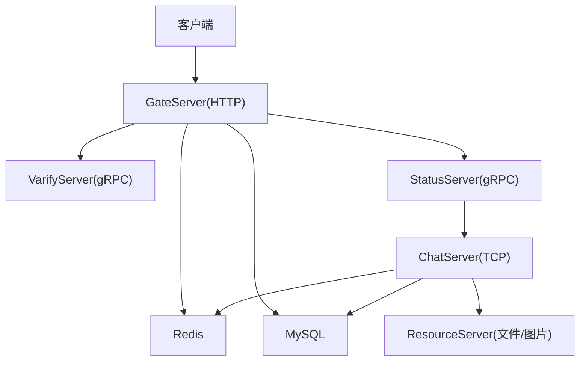
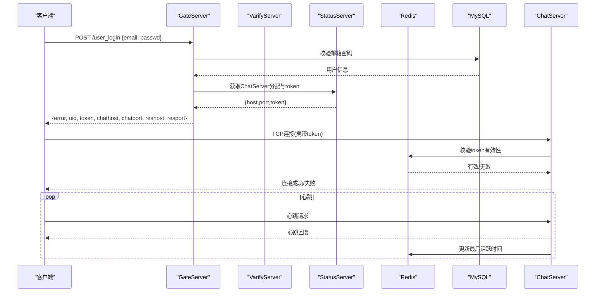
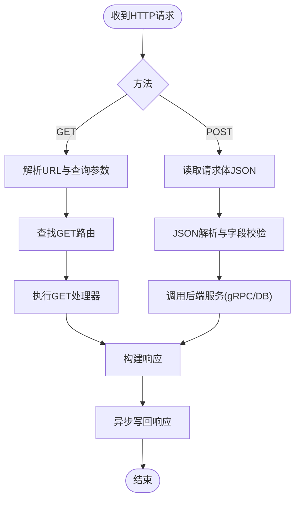
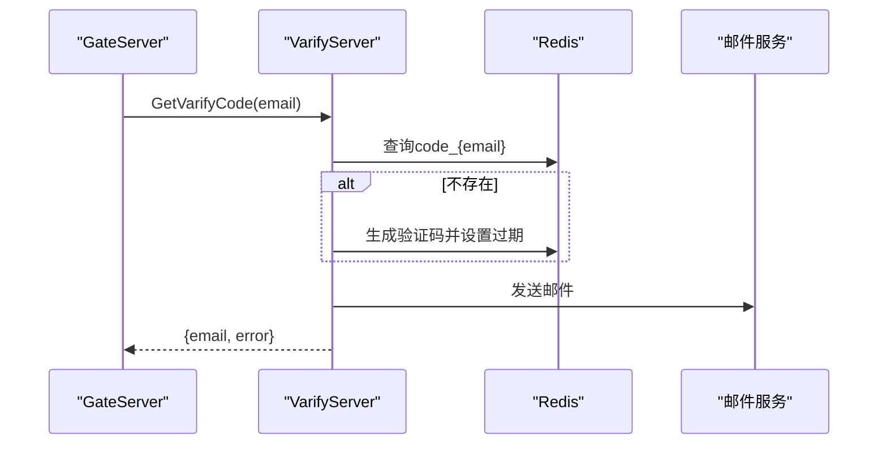
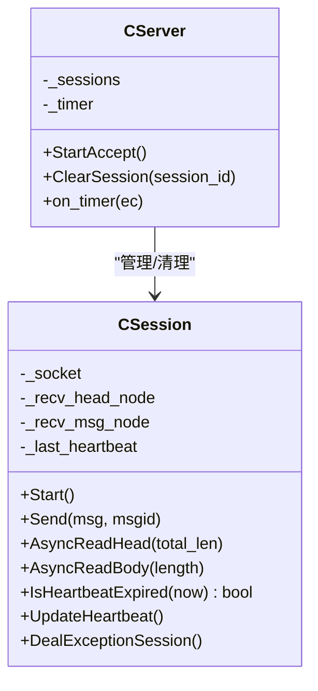
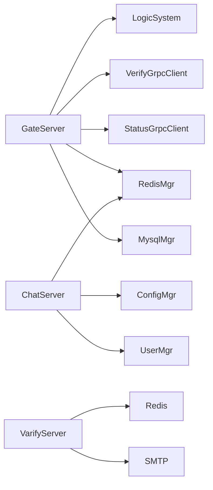

# API访问控制

<cite>
**本文引用的文件**   
- [README.md](file://README.md)
- [HttpConnection.cpp](file://server/GateServer/src/HttpConnection.cpp)
- [HttpConnection.h](file://server/GateServer/include/HttpConnection.h)
- [LogicSystem.cpp](file://server/GateServer/src/LogicSystem.cpp)
- [const.h（Gate）](file://server/GateServer/include/const.h)
- [CSession.cpp](file://server/ChatServer/src/CSession.cpp)
- [CSession.h](file://server/ChatServer/include/CSession.h)
- [CServer.cpp](file://server/ChatServer/src/CServer.cpp)
- [const.h（Chat）](file://server/ChatServer/include/const.h)
- [server.js（VarifyServer）](file://server/VarifyServer/server.js)
- [const.js（VarifyServer）](file://server/VarifyServer/const.js)
</cite>

## 目录
1. [简介](#简介)
2. [项目结构](#项目结构)
3. [核心组件](#核心组件)
4. [架构总览](#架构总览)
5. [详细组件分析](#详细组件分析)
6. [依赖关系分析](#依赖关系分析)
7. [性能考量](#性能考量)
8. [故障排查指南](#故障排查指南)
9. [结论](#结论)
10. [附录：API安全配置与错误处理模式](#附录api安全配置与错误处理模式)

## 简介
本文件面向LLFCChat项目的API访问控制，聚焦以下方面：
- 接口鉴权机制：JWT令牌验证、签名校验、请求来源认证等策略现状与建议
- 参数验证框架：输入数据校验、类型检查、长度限制、格式验证等防护机制
- 频率限制与防刷：IP限流、用户限流、接口调用次数限制等并发控制方案
- API版本管理与兼容性：版本路由、废弃接口处理、向后兼容策略
- 完整的安全配置示例与错误处理模式，以及常见攻击防护与安全最佳实践

说明：当前代码库在HTTP网关层未实现JWT或签名校验；验证码通过gRPC服务与Redis缓存配合完成；TCP会话采用服务端分配的token进行连接认证。后续建议按本文“建议”章节逐步补齐。

## 项目结构
本项目由多个微服务组成：
- GateServer：HTTP网关，负责路由分发、参数解析、业务编排
- ChatServer：长连接聊天服务，维护会话、心跳、消息收发
- StatusServer：状态服务，负责分配ChatServer并生成连接token
- ResourceServer：资源服务，用于文件传输与图片上传下载
- VarifyServer：验证码服务，基于gRPC提供验证码发送能力，使用Redis缓存验证码

图表来源 
- [HttpConnection.cpp:132-194](file://server/GateServer/src/HttpConnection.cpp#L132-L194)
- [LogicSystem.cpp:36-406](file://server/GateServer/src/LogicSystem.cpp#L36-L406)
- [CServer.cpp:8-38](file://server/ChatServer/src/CServer.cpp#L8-L38)
- [server.js（VarifyServer）:66-76](file://server/VarifyServer/server.js#L66-L76)

章节来源
- [README.md:1-112](file://README.md#L1-L112)

## 核心组件
- HTTP网关（GateServer）
  - HttpConnection：接收HTTP请求，解析GET查询参数，设置响应头（含CORS），统一返回404/200
  - LogicSystem：注册路由与处理器，解析JSON，调用后端gRPC与数据库，构造响应
- 验证码服务（VarifyServer）
  - server.js：gRPC服务实现，生成验证码、发送邮件、写入Redis缓存
  - const.js：错误码与验证码前缀常量
- 聊天服务（ChatServer）
  - CSession：TCP会话管理，读写粘包处理、心跳检测、异常清理、分布式锁清理Redis
  - CServer：会话生命周期管理、定时器扫描过期会话、统计在线数
  - const.h：错误码、消息ID、Redis键前缀、锁相关常量

章节来源
- [HttpConnection.cpp:1-225](file://server/GateServer/src/HttpConnection.cpp#L1-L225)
- [HttpConnection.h:1-36](file://server/GateServer/include/HttpConnection.h#L1-L36)
- [LogicSystem.cpp:1-477](file://server/GateServer/src/LogicSystem.cpp#L1-L477)
- [server.js（VarifyServer）:1-76](file://server/VarifyServer/server.js#L1-L76)
- [const.js（VarifyServer）:1-10](file://server/VarifyServer/const.js#L1-L10)
- [CSession.cpp:1-338](file://server/ChatServer/src/CSession.cpp#L1-L338)
- [CSession.h:1-86](file://server/ChatServer/include/CSession.h#L1-L86)
- [CServer.cpp:1-133](file://server/ChatServer/src/CServer.cpp#L1-L133)
- [const.h（Chat）:1-104](file://server/ChatServer/include/const.h#L1-L104)

## 架构总览
下图展示从HTTP登录到TCP连接的端到端流程，包含鉴权、令牌发放、会话建立与心跳。

图表来源 
- [LogicSystem.cpp:326-406](file://server/GateServer/src/LogicSystem.cpp#L326-L406)
- [CSession.cpp:288-338](file://server/ChatServer/src/CSession.cpp#L288-L338)
- [CServer.cpp:75-118](file://server/ChatServer/src/CServer.cpp#L75-L118)
- [server.js（VarifyServer）:15-64](file://server/VarifyServer/server.js#L15-L64)

## 详细组件分析

### GateServer：HTTP网关与路由分发
- 请求入口与响应
  - 读取HTTP请求，设置短连接与CORS允许所有来源（生产应限制具体来源）
  - GET请求预解析URL与查询参数，POST请求直接交由LogicSystem处理
  - 未匹配路由返回404，成功返回200并设置Server头
- 路由与业务编排
  - 注册GET/POST路由，解析JSON，校验必要字段
  - 调用VarifyServer（验证码）、StatusServer（分配ChatServer与token）、MySQL（用户数据）
  - 统一错误码与JSON响应体

图表来源 
- [HttpConnection.cpp:132-194](file://server/GateServer/src/HttpConnection.cpp#L132-L194)
- [LogicSystem.cpp:36-406](file://server/GateServer/src/LogicSystem.cpp#L36-L406)

章节来源
- [HttpConnection.cpp:1-225](file://server/GateServer/src/HttpConnection.cpp#L1-L225)
- [LogicSystem.cpp:1-477](file://server/GateServer/src/LogicSystem.cpp#L1-L477)

### VarifyServer：验证码服务
- gRPC接口GetVarifyCode
  - 从Redis读取或生成验证码（UUID截取），设置过期时间
  - 通过SMTP发送邮件，返回错误码与邮箱
- 错误码与常量
  - code_prefix用于Redis键前缀
  - Errors定义Success/RedisErr/Exception

图表来源 
- [server.js（VarifyServer）:15-64](file://server/VarifyServer/server.js#L15-L64)
- [const.js（VarifyServer）:1-10](file://server/VarifyServer/const.js#L1-L10)

章节来源
- [server.js（VarifyServer）:1-76](file://server/VarifyServer/server.js#L1-L76)
- [const.js（VarifyServer）:1-10](file://server/VarifyServer/const.js#L1-L10)

### ChatServer：TCP会话与心跳
- 会话生命周期
  - 接收头部与数据体，校验msg_id与msg_len范围，防止非法报文
  - 心跳超时判定与清理，分布式锁保护Redis清理逻辑
- 异常清理
  - 清理用户session、IP记录、token等Redis键，避免僵尸会话

图表来源 
- [CSession.h:28-86](file://server/ChatServer/include/CSession.h#L28-L86)
- [CSession.cpp:133-194](file://server/ChatServer/src/CSession.cpp#L133-L194)
- [CServer.cpp:75-118](file://server/ChatServer/src/CServer.cpp#L75-L118)

章节来源
- [CSession.cpp:1-338](file://server/ChatServer/src/CSession.cpp#L1-L338)
- [CSession.h:1-86](file://server/ChatServer/include/CSession.h#L1-L86)
- [CServer.cpp:1-133](file://server/ChatServer/src/CServer.cpp#L1-L133)
- [const.h（Chat）:1-104](file://server/ChatServer/include/const.h#L1-L104)

## 依赖关系分析
- GateServer依赖
  - LogicSystem：路由与业务编排
  - VerifyGrpcClient：调用VarifyServer
  - StatusGrpcClient：调用StatusServer
  - RedisMgr：验证码缓存与登录计数
  - MysqlMgr：用户数据持久化
- ChatServer依赖
  - RedisMgr：会话、IP、Token、分布式锁
  - ConfigMgr：服务器配置
  - UserMgr：用户会话映射
- VarifyServer依赖
  - Redis：验证码缓存
  - SMTP：邮件发送

图表来源 
- [LogicSystem.cpp:22-28](file://server/GateServer/src/LogicSystem.cpp#L22-L28)
- [CSession.cpp:9-11](file://server/ChatServer/src/CSession.cpp#L9-L11)
- [server.js（VarifyServer）:1-8](file://server/VarifyServer/server.js#L1-L8)

章节来源
- [LogicSystem.cpp:1-477](file://server/GateServer/src/LogicSystem.cpp#L1-L477)
- [CSession.cpp:1-338](file://server/ChatServer/src/CSession.cpp#L1-L338)
- [server.js（VarifyServer）:1-76](file://server/VarifyServer/server.js#L1-L76)

## 性能考量
- HTTP网关
  - 短连接减少资源占用，但增加握手开销；可考虑按需启用Keep-Alive
  - CORS设置为“*”在生产环境需收紧为可信域名
- 验证码服务
  - Redis缓存降低重复发送压力，注意过期时间与幂等性
- 聊天服务
  - 心跳定时器周期60s，平衡中间设备NAT回收与服务器负载
  - 发送队列上限MAX_SENDQUE防止内存膨胀
  - 分布式锁保证清理操作的原子性，避免竞态

[本节为通用指导，不直接分析具体文件]

## 故障排查指南
- JSON解析失败
  - 现象：错误码Error_Json
  - 排查：确认请求体是否为合法JSON，字段名是否一致
- 验证码过期或错误
  - 现象：错误码VarifyExpired/VarifyCodeErr
  - 排查：检查Redis中验证码是否存在且未过期，比对输入值
- RPC调用失败
  - 现象：错误码RPCFailed
  - 排查：检查VarifyServer/StatusServer可用性、网络连通性
- 登录失败
  - 现象：错误码PasswdInvalid
  - 排查：核对邮箱与密码是否正确，数据库连接是否正常
- 会话异常
  - 现象：心跳超时、连接关闭
  - 排查：查看CSession心跳阈值、Redis键清理逻辑、分布式锁释放情况

章节来源
- [const.h（Gate）:32-45](file://server/GateServer/include/const.h#L32-L45)
- [const.h（Chat）:5-20](file://server/ChatServer/include/const.h#L5-L20)
- [CSession.cpp:288-338](file://server/ChatServer/src/CSession.cpp#L288-L338)

## 结论
当前LLFCChat的API访问控制以验证码+Token为主：
- HTTP层未实现JWT与签名校验，建议引入JWT签发与验签、请求签名（HMAC）与来源白名单
- 验证码流程完善，结合Redis实现防重放与过期控制
- TCP层通过Token认证与会话管理，具备心跳与异常清理能力
- 建议在网关层补充频率限制、IP/用户限流、请求大小限制、敏感字段脱敏与审计日志

[本节为总结，不直接分析具体文件]

## 附录：API安全配置与错误处理模式

### 接口鉴权机制（现状与建议）
- 现状
  - 登录成功后由StatusServer分配ChatServer并返回token，客户端用该token建立TCP连接
  - 验证码通过VarifyServer生成并缓存至Redis，GateServer在注册/重置密码时校验
- 建议
  - JWT：登录成功后签发JWT，包含uid、exp、scope；网关层验签与时效校验
  - 签名校验：对关键接口请求体与参数计算HMAC，服务端校验签名防篡改
  - 来源认证：CORS限制可信域名，必要时加入Referer与Origin校验

章节来源
- [LogicSystem.cpp:326-406](file://server/GateServer/src/LogicSystem.cpp#L326-L406)
- [CSession.cpp:304-338](file://server/ChatServer/src/CSession.cpp#L304-L338)

### 参数验证框架（现状与建议）
- 现状
  - GateServer解析JSON并校验必要字段（如email、passwd、varifycode）
  - ChatServer校验msg_id与msg_len范围，防止非法报文
- 建议
  - 统一参数校验层：类型检查、长度限制、正则格式验证、枚举白名单
  - 输入过滤：XSS/SQL注入防护，拒绝危险字符与超长字段
  - 响应规范化：统一错误码与消息结构，便于前端处理

章节来源
- [LogicSystem.cpp:60-105](file://server/GateServer/src/LogicSystem.cpp#L60-L105)
- [CSession.cpp:163-188](file://server/ChatServer/src/CSession.cpp#L163-L188)

### 频率限制与防刷策略（建议）
- IP限流：基于Redis计数器，限制单位时间内同一IP的请求次数
- 用户限流：基于uid限制敏感接口（登录、验证码、重置密码）调用频率
- 接口限流：针对高负载接口设置全局QPS阈值与突发限制
- 防重放：验证码一次性使用，请求附带nonce与timestamp，服务端校验去重与时差

[本节为通用指导，不直接分析具体文件]

### API版本管理与兼容性（建议）
- 版本路由：在URL路径中加入版本号（如/v1/user_login），便于平滑升级
- 废弃接口：保留旧版本一段时间，返回Deprecation提示，引导迁移
- 向后兼容：新增字段可选，默认值兼容旧客户端；错误码演进保持向下兼容

[本节为通用指导，不直接分析具体文件]

### 安全配置示例（建议）
- 网关层
  - 限制Content-Type为application/json
  - 限制请求体大小（如≤1MB）
  - 开启HTTPS与TLS证书校验
  - 严格CORS白名单
- 验证码服务
  - Redis键加盐与随机前缀，防止预测
  - 邮件模板脱敏，避免泄露敏感信息
- 聊天服务
  - Token有效期与刷新机制
  - 心跳间隔与超时阈值可调
  - 分布式锁超时与重试策略合理配置

[本节为通用指导，不直接分析具体文件]

### 错误处理模式（建议）
- 统一错误码：沿用现有ErrorCodes，扩展新场景
- 结构化响应：{error, message, data}，便于前端统一处理
- 日志与审计：记录关键操作（登录、注册、重置密码、验证码发送）与异常堆栈

章节来源
- [const.h（Gate）:32-45](file://server/GateServer/include/const.h#L32-L45)
- [const.h（Chat）:5-20](file://server/ChatServer/include/const.h#L5-L20)