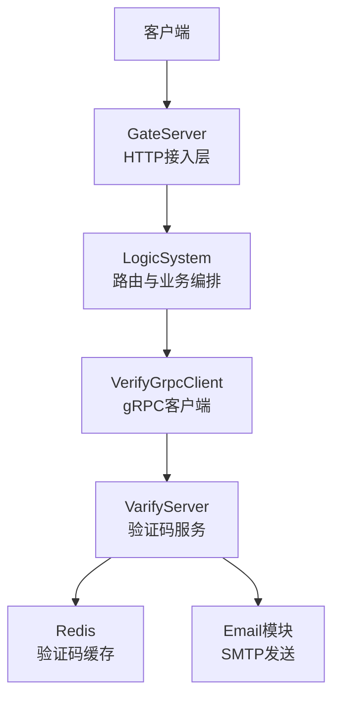
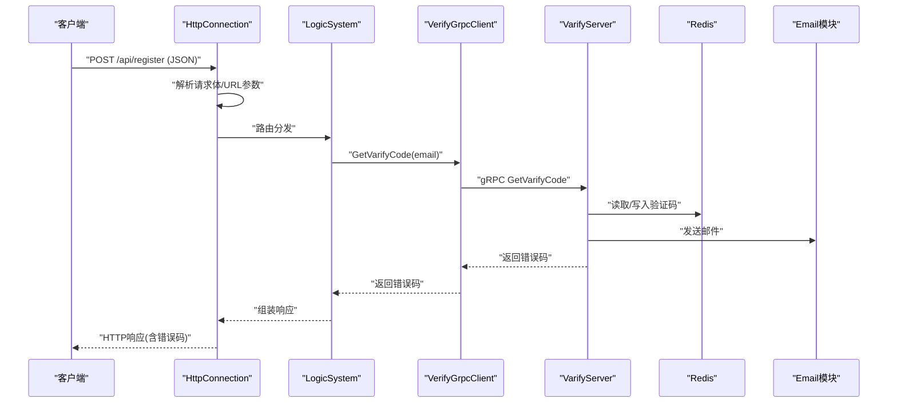
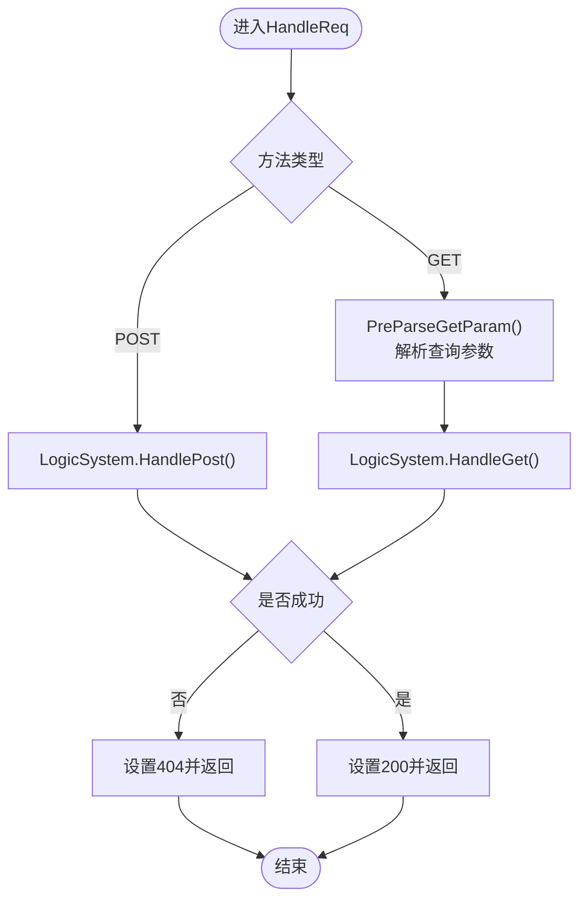
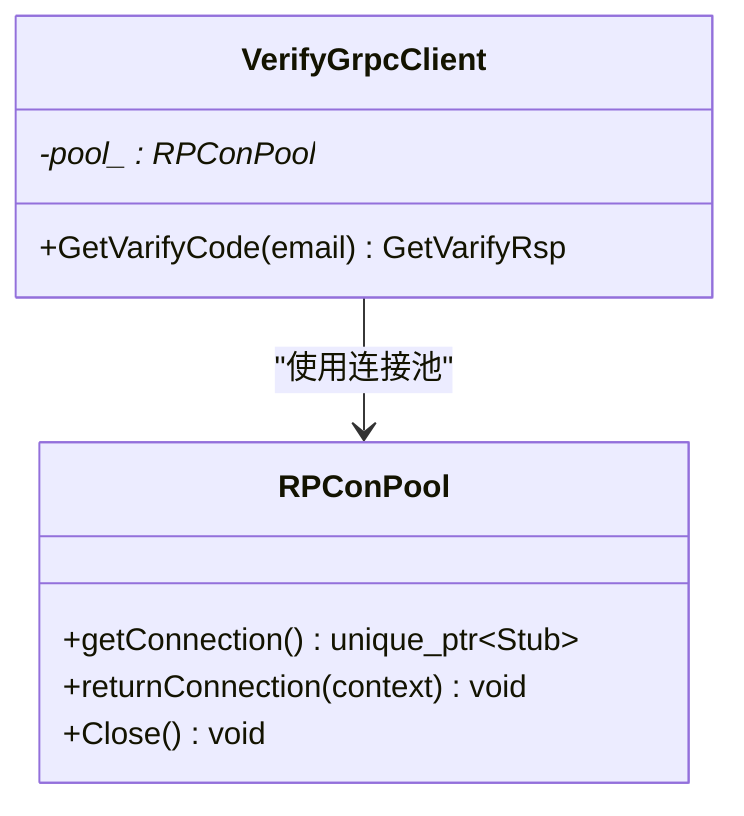
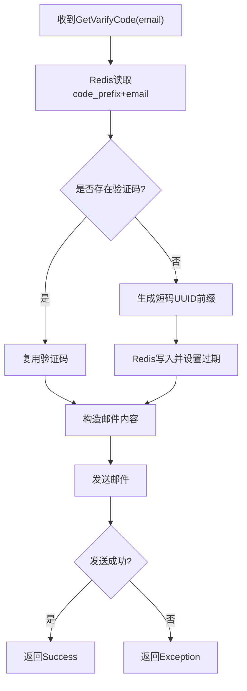
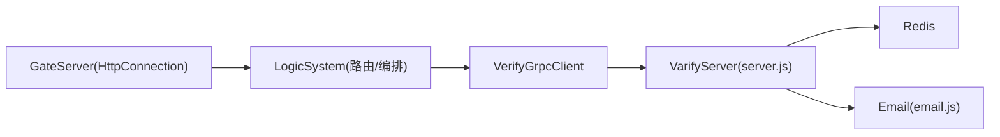

# 参数验证框架

<cite>
**本文引用的文件**   
- [server/GateServer/include/HttpConnection.h](file://server/GateServer/include/HttpConnection.h)
- [server/GateServer/src/HttpConnection.cpp](file://server/GateServer/src/HttpConnection.cpp)
- [server/GateServer/include/VerifyGrpcClient.h](file://server/GateServer/include/VerifyGrpcClient.h)
- [server/GateServer/src/VerifyGrpcClient.cpp](file://server/GateServer/src/VerifyGrpcClient.cpp)
- [server/VarifyServer/server.js](file://server/VarifyServer/server.js)
- [server/VarifyServer/email.js](file://server/VarifyServer/email.js)
- [server/VarifyServer/const.js](file://server/VarifyServer/const.js)
</cite>

## 目录
1. [简介](#简介)
2. [项目结构](#项目结构)
3. [核心组件](#核心组件)
4. [架构总览](#架构总览)
5. [详细组件分析](#详细组件分析)
6. [依赖关系分析](#依赖关系分析)
7. [性能考量](#性能考量)
8. [故障排查指南](#故障排查指南)
9. [结论](#结论)
10. [附录：错误码与响应规范](#附录错误码与响应规范)

## 简介
本文件面向LLFCChat项目的“参数验证框架”，聚焦于HTTP请求体（JSON）的解析与校验、验证码流程、邮箱格式校验、密码强度检查、SQL注入与XSS防护、输入清洗以及统一的错误码与响应格式。文档基于GateServer的HTTP接入层、VerifyGrpcClient的gRPC客户端，以及VarifyServer的验证码服务进行系统化说明，并提供可操作的调试建议与最佳实践。

## 项目结构
- GateServer负责HTTP接入、路由分发与基础参数预处理（如GET查询参数解析）。
- VerifyGrpcClient封装对VarifyServer的gRPC调用，用于获取验证码。
- VarifyServer提供验证码生成、Redis缓存与邮件发送能力。

**图示来源** 
- [server/GateServer/src/HttpConnection.cpp:133-194](file://server/GateServer/src/HttpConnection.cpp#L133-L194)
- [server/GateServer/include/VerifyGrpcClient.h:80-110](file://server/GateServer/include/VerifyGrpcClient.h#L80-L110)
- [server/VarifyServer/server.js:15-64](file://server/VarifyServer/server.js#L15-L64)

**章节来源**
- [server/GateServer/src/HttpConnection.cpp:133-194](file://server/GateServer/src/HttpConnection.cpp#L133-L194)
- [server/GateServer/include/VerifyGrpcClient.h:80-110](file://server/GateServer/include/VerifyGrpcClient.h#L80-L110)
- [server/VarifyServer/server.js:15-64](file://server/VarifyServer/server.js#L15-L64)

## 核心组件
- HttpConnection：处理HTTP请求生命周期，解析GET参数，统一设置CORS与响应头，并委派给LogicSystem处理具体路由。
- VerifyGrpcClient：维护gRPC连接池，调用VarifyServer的GetVarifyCode接口，返回统一错误码。
- VarifyServer：根据邮箱生成或复用验证码，写入Redis并发送邮件；定义错误码常量。

**章节来源**
- [server/GateServer/include/HttpConnection.h:1-36](file://server/GateServer/include/HttpConnection.h#L1-L36)
- [server/GateServer/src/HttpConnection.cpp:96-130](file://server/GateServer/src/HttpConnection.cpp#L96-L130)
- [server/GateServer/include/VerifyGrpcClient.h:80-110](file://server/GateServer/include/VerifyGrpcClient.h#L80-L110)
- [server/VarifyServer/server.js:15-64](file://server/VarifyServer/server.js#L15-L64)
- [server/VarifyServer/const.js:1-10](file://server/VarifyServer/const.js#L1-L10)

## 架构总览
下图展示了从HTTP请求到验证码下发的完整链路，包括参数预处理、gRPC调用、Redis存取与邮件发送。

**图示来源** 
- [server/GateServer/src/HttpConnection.cpp:133-194](file://server/GateServer/src/HttpConnection.cpp#L133-L194)
- [server/GateServer/include/VerifyGrpcClient.h:87-104](file://server/GateServer/include/VerifyGrpcClient.h#L87-L104)
- [server/VarifyServer/server.js:15-64](file://server/VarifyServer/server.js#L15-L64)

## 详细组件分析

### HTTP接入与参数预处理（HttpConnection）
- GET参数解析：从URI中分离路径与查询串，按&和=拆分键值对，并进行URL解码后存入映射表。
- POST请求：由LogicSystem接管，后续可在该层增加JSON Body解析与校验入口。
- 响应统一：设置CORS、Content-Type、Server等头部，失败时返回404与提示文本。

**图示来源** 
- [server/GateServer/src/HttpConnection.cpp:133-194](file://server/GateServer/src/HttpConnection.cpp#L133-L194)
- [server/GateServer/src/HttpConnection.cpp:96-130](file://server/GateServer/src/HttpConnection.cpp#L96-L130)

**章节来源**
- [server/GateServer/include/HttpConnection.h:1-36](file://server/GateServer/include/HttpConnection.h#L1-L36)
- [server/GateServer/src/HttpConnection.cpp:96-130](file://server/GateServer/src/HttpConnection.cpp#L96-L130)
- [server/GateServer/src/HttpConnection.cpp:133-194](file://server/GateServer/src/HttpConnection.cpp#L133-L194)

### gRPC验证码客户端（VerifyGrpcClient）
- 连接池管理：创建固定数量的gRPC通道，支持获取与归还连接。
- 调用封装：构造请求、发起调用、处理状态码，失败时回填统一错误码。
- 配置加载：从ConfigMgr读取VarifyServer的Host与Port。

**图示来源** 
- [server/GateServer/include/VerifyGrpcClient.h:18-78](file://server/GateServer/include/VerifyGrpcClient.h#L18-L78)
- [server/GateServer/include/VerifyGrpcClient.h:80-110](file://server/GateServer/include/VerifyGrpcClient.h#L80-L110)
- [server/GateServer/src/VerifyGrpcClient.cpp:4-9](file://server/GateServer/src/VerifyGrpcClient.cpp#L4-L9)

**章节来源**
- [server/GateServer/include/VerifyGrpcClient.h:18-110](file://server/GateServer/include/VerifyGrpcClient.h#L18-L110)
- [server/GateServer/src/VerifyGrpcClient.cpp:4-9](file://server/GateServer/src/VerifyGrpcClient.cpp#L4-L9)

### 验证码服务（VarifyServer）
- 验证码策略：优先从Redis读取已有验证码，不存在则生成短码并设置过期时间。
- 邮件发送：通过nodemailer配置SMTP，发送包含验证码的邮件。
- 错误码：定义Success、RedisErr、Exception等统一错误码。

**图示来源** 
- [server/VarifyServer/server.js:15-64](file://server/VarifyServer/server.js#L15-L64)
- [server/VarifyServer/email.js:22-35](file://server/VarifyServer/email.js#L22-L35)
- [server/VarifyServer/const.js:1-10](file://server/VarifyServer/const.js#L1-L10)

**章节来源**
- [server/VarifyServer/server.js:15-64](file://server/VarifyServer/server.js#L15-L64)
- [server/VarifyServer/email.js:22-35](file://server/VarifyServer/email.js#L22-L35)
- [server/VarifyServer/const.js:1-10](file://server/VarifyServer/const.js#L1-L10)

## 依赖关系分析
- GateServer依赖LogicSystem进行路由与业务编排（当前未展示源码），并通过VerifyGrpcClient访问VarifyServer。
- VarifyServer依赖Redis与Email模块。
- 错误码在VarifyServer侧定义，并在gRPC客户端处进行统一回填。

**图示来源** 
- [server/GateServer/src/HttpConnection.cpp:133-194](file://server/GateServer/src/HttpConnection.cpp#L133-L194)
- [server/GateServer/include/VerifyGrpcClient.h:80-110](file://server/GateServer/include/VerifyGrpcClient.h#L80-L110)
- [server/VarifyServer/server.js:15-64](file://server/VarifyServer/server.js#L15-L64)

**章节来源**
- [server/GateServer/src/HttpConnection.cpp:133-194](file://server/GateServer/src/HttpConnection.cpp#L133-L194)
- [server/GateServer/include/VerifyGrpcClient.h:80-110](file://server/GateServer/include/VerifyGrpcClient.h#L80-L110)
- [server/VarifyServer/server.js:15-64](file://server/VarifyServer/server.js#L15-L64)

## 性能考量
- HTTP层：异步读写与超时控制（deadline）避免资源占用过长。
- gRPC连接池：复用连接减少握手开销，提升并发吞吐。
- Redis缓存：验证码短时缓存降低重复计算与邮件发送压力。
- 建议：为JSON解析与校验引入流式解析与快速失败机制，限制请求体大小，避免大对象阻塞。

[本节为通用指导，不直接分析具体文件]

## 故障排查指南
- HTTP 404：当路由未命中时返回404，检查LogicSystem的路由注册是否正确。
- gRPC调用失败：VerifyGrpcClient在状态非ok时回填错误码，检查VarifyServer可达性与端口配置。
- 验证码异常：查看VarifyServer日志，确认Redis连通性、邮件SMTP配置与授权码有效性。
- 常见错误码：Success、RedisErr、Exception，结合日志定位具体环节。

**章节来源**
- [server/GateServer/src/HttpConnection.cpp:148-158](file://server/GateServer/src/HttpConnection.cpp#L148-L158)
- [server/GateServer/include/VerifyGrpcClient.h:95-104](file://server/GateServer/include/VerifyGrpcClient.h#L95-L104)
- [server/VarifyServer/server.js:56-62](file://server/VarifyServer/server.js#L56-L62)
- [server/VarifyServer/const.js:3-7](file://server/VarifyServer/const.js#L3-L7)

## 结论
本项目已具备HTTP接入、gRPC验证码服务与Redis/Email集成的基础能力。下一步应在GateServer的LogicSystem层完善JSON请求体的解析与校验（必填字段、类型、长度、格式）、安全校验（SQL注入、XSS、输入清洗）与统一错误码响应，形成完整的参数验证框架。

[本节为总结，不直接分析具体文件]

## 附录：错误码与响应规范

### 统一错误码定义
- Success：操作成功
- RedisErr：Redis操作失败
- Exception：系统异常
- RPCFailed：gRPC调用失败（在客户端回填）

**章节来源**
- [server/VarifyServer/const.js:3-7](file://server/VarifyServer/const.js#L3-L7)
- [server/GateServer/include/VerifyGrpcClient.h:101-103](file://server/GateServer/include/VerifyGrpcClient.h#L101-L103)

### JSON请求体校验规则（建议）
- 必填字段检查：用户名、邮箱、密码、验证码等关键域必须存在且非空。
- 数据类型验证：字符串、数字、布尔等类型严格匹配。
- 长度限制：用户名、昵称、头像URL等设定最小/最大长度。
- 格式校验：邮箱格式正则、密码强度（长度、字符类别组合）、验证码长度与字符集。
- 输入清洗：去除首尾空白、转义特殊字符、过滤HTML标签与脚本片段。

[本节为通用规范建议，不直接分析具体文件]

### 安全验证措施（建议）
- SQL注入防护：使用参数化查询与ORM，禁止拼接用户输入至SQL语句。
- XSS防护：输出编码、禁用危险HTML标签、启用CSP策略。
- 输入数据清洗：白名单校验、长度截断、非法字符过滤。
- CORS与安全头：生产环境限制允许的源，设置合适的Content-Type与Cache-Control。

[本节为通用安全建议，不直接分析具体文件]

### 响应格式规范（建议）
- 成功响应：包含业务数据与状态码Success。
- 失败响应：包含错误码与可读消息，便于前端提示与调试。
- 统一包装：所有接口返回一致的JSON结构，便于前端统一处理。

[本节为通用规范建议，不直接分析具体文件]