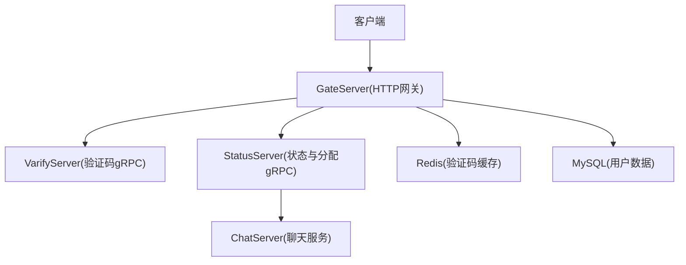
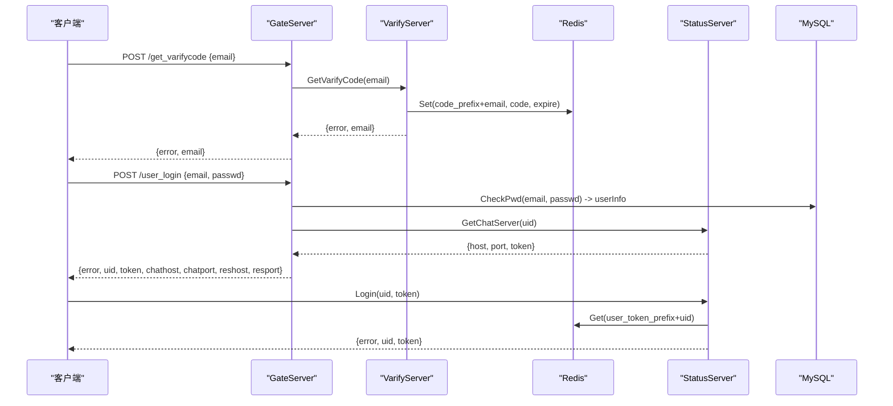
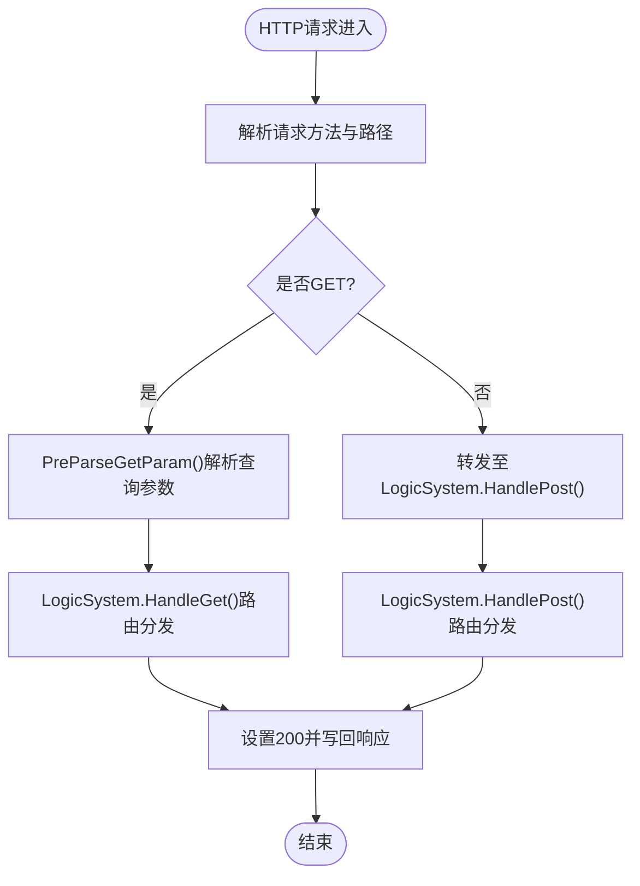
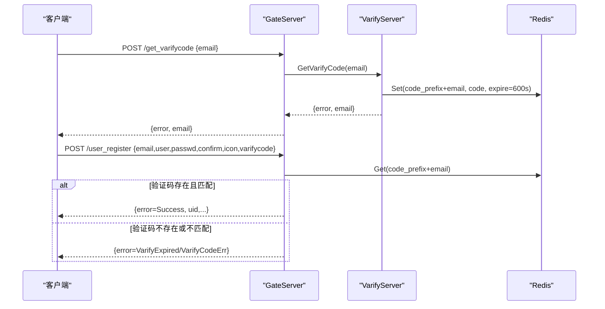
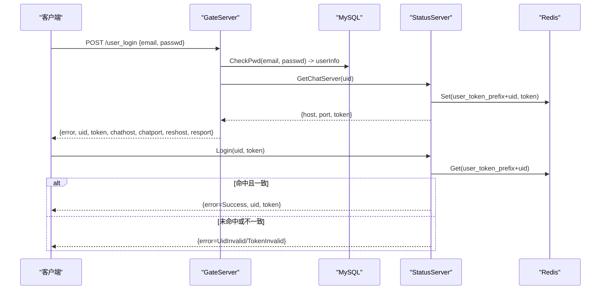
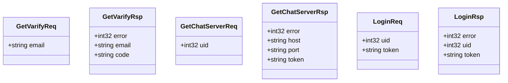
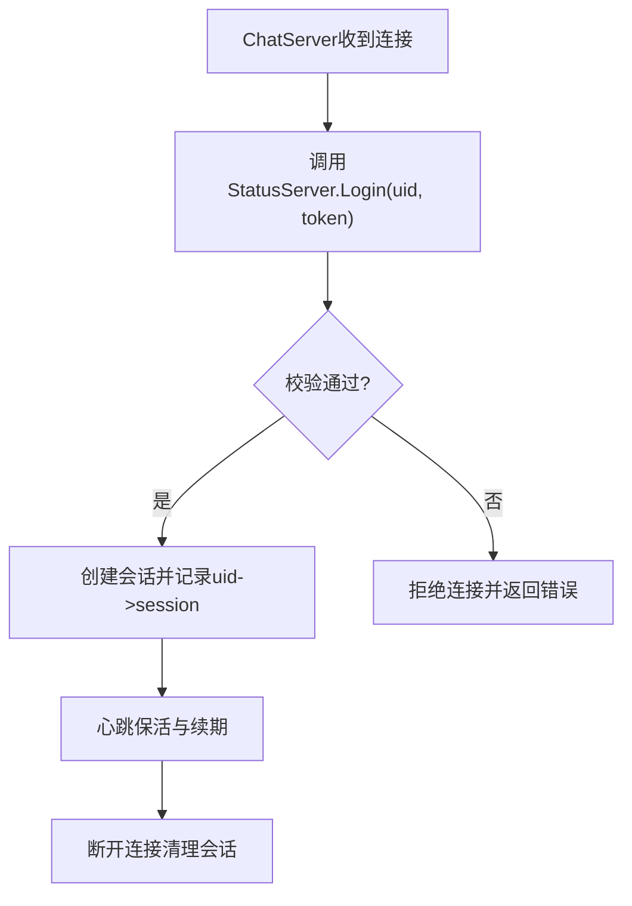
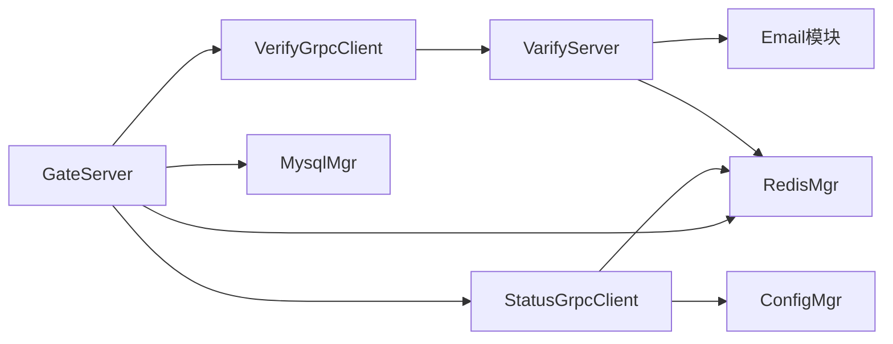

# 接口鉴权机制

<cite>
**本文引用的文件**   
- [HttpConnection.h](file://server/GateServer/include/HttpConnection.h)
- [HttpConnection.cpp](file://server/GateServer/src/HttpConnection.cpp)
- [LogicSystem.h](file://server/GateServer/include/LogicSystem.h)
- [LogicSystem.cpp](file://server/GateServer/src/LogicSystem.cpp)
- [VerifyGrpcClient.h](file://server/GateServer/include/VerifyGrpcClient.h)
- [VerifyGrpcClient.cpp](file://server/GateServer/src/VerifyGrpcClient.cpp)
- [StatusGrpcClient.h](file://server/GateServer/include/StatusGrpcClient.h)
- [StatusGrpcClient.cpp](file://server/GateServer/src/StatusGrpcClient.cpp)
- [StatusServiceImpl.h](file://server/StatusServer/include/StatusServiceImpl.h)
- [StatusServiceImpl.cpp](file://server/StatusServer/src/StatusServiceImpl.cpp)
- [message.proto（控制面）](file://server/proto/control/message.proto)
- [message.proto（聊天面）](file://server/proto/chat/message.proto)
- [VarifyServer server.js](file://server/VarifyServer/server.js)
</cite>

## 目录
1. [简介](#简介)
2. [项目结构](#项目结构)
3. [核心组件](#核心组件)
4. [架构总览](#架构总览)
5. [详细组件分析](#详细组件分析)
6. [依赖关系分析](#依赖关系分析)
7. [性能考虑](#性能考虑)
8. [故障排查指南](#故障排查指南)
9. [结论](#结论)
10. [附录：错误码与字段说明](#附录错误码与字段说明)

## 简介
本文件面向LLFCChat项目的接口鉴权机制，覆盖以下关键内容：
- HTTP接口的认证流程：用户登录、邮箱验证码获取与校验、Redis缓存验证等。
- gRPC服务间认证：StatusServer分配ChatServer并生成token；ChatServer侧的会话管理与token校验。
- JWT令牌的使用方式、有效期管理与刷新机制（设计建议）。
- 完整的认证流程图与错误处理模式。
- 常见攻击防护策略：暴力破解防护、会话劫持防护等。

## 项目结构
GateServer作为HTTP网关，负责接收客户端请求、路由分发、调用验证码服务与状态服务，并通过Redis进行验证码缓存管理。StatusServer负责为登录用户分配ChatServer并签发连接token。VarifyServer提供验证码生成与邮件发送能力。

图表来源
- [HttpConnection.cpp:133-194](file://server/GateServer/src/HttpConnection.cpp#L133-L194)
- [LogicSystem.cpp:107-151](file://server/GateServer/src/LogicSystem.cpp#L107-L151)
- [LogicSystem.cpp:326-405](file://server/GateServer/src/LogicSystem.cpp#L326-L405)
- [StatusServiceImpl.cpp:17-27](file://server/StatusServer/src/StatusServiceImpl.cpp#L17-L27)
- [StatusGrpcClient.cpp:3-21](file://server/GateServer/src/StatusGrpcClient.cpp#L3-L21)
- [VerifyGrpcClient.cpp:4-9](file://server/GateServer/src/VerifyGrpcClient.cpp#L4-L9)

章节来源
- [HttpConnection.h:1-36](file://server/GateServer/include/HttpConnection.h#L1-L36)
- [HttpConnection.cpp:1-225](file://server/GateServer/src/HttpConnection.cpp#L1-L225)
- [LogicSystem.h:1-24](file://server/GateServer/include/LogicSystem.h#L1-L24)
- [LogicSystem.cpp:1-477](file://server/GateServer/src/LogicSystem.cpp#L1-L477)

## 核心组件
- HTTP网关与路由：HttpConnection负责解析HTTP请求，LogicSystem负责按URL注册与分发GET/POST处理器。
- 验证码服务：VerifyGrpcClient通过gRPC调用VarifyServer，完成验证码生成、Redis缓存与邮件发送。
- 状态服务：StatusGrpcClient通过gRPC调用StatusServer，完成ChatServer分配与token签发。
- 存储层：Redis用于验证码与token缓存；MySQL用于用户信息持久化。

章节来源
- [HttpConnection.cpp:133-194](file://server/GateServer/src/HttpConnection.cpp#L133-L194)
- [LogicSystem.cpp:36-406](file://server/GateServer/src/LogicSystem.cpp#L36-L406)
- [VerifyGrpcClient.h:18-113](file://server/GateServer/include/VerifyGrpcClient.h#L18-L113)
- [StatusGrpcClient.h:19-98](file://server/GateServer/include/StatusGrpcClient.h#L19-L98)

## 架构总览
下图展示从HTTP登录到gRPC认证的整体流程，包括验证码获取、Redis校验、StatusServer分配与token签发。

图表来源
- [LogicSystem.cpp:107-151](file://server/GateServer/src/LogicSystem.cpp#L107-L151)
- [LogicSystem.cpp:326-405](file://server/GateServer/src/LogicSystem.cpp#L326-L405)
- [StatusServiceImpl.cpp:17-27](file://server/StatusServer/src/StatusServiceImpl.cpp#L17-L27)
- [StatusGrpcClient.cpp:3-21](file://server/GateServer/src/StatusGrpcClient.cpp#L3-L21)
- [VerifyGrpcClient.h:87-104](file://server/GateServer/include/VerifyGrpcClient.h#L87-L104)
- [VarifyServer server.js:15-64](file://server/VarifyServer/server.js#L15-L64)

## 详细组件分析

### HTTP网关与路由（GateServer）
- HttpConnection负责读取HTTP请求、设置响应头、超时控制与异步写入响应。
- LogicSystem在构造时注册所有路由处理器（GET/POST），HandleGet/HandlePost根据路径分发给对应handler。
- 登录与验证码相关接口均在LogicSystem中实现，包含JSON解析、参数校验、Redis校验、gRPC调用与错误码返回。

图表来源
- [HttpConnection.cpp:133-194](file://server/GateServer/src/HttpConnection.cpp#L133-L194)
- [LogicSystem.cpp:448-477](file://server/GateServer/src/LogicSystem.cpp#L448-L477)

章节来源
- [HttpConnection.h:1-36](file://server/GateServer/include/HttpConnection.h#L1-L36)
- [HttpConnection.cpp:1-225](file://server/GateServer/src/HttpConnection.cpp#L1-L225)
- [LogicSystem.h:1-24](file://server/GateServer/include/LogicSystem.h#L1-L24)
- [LogicSystem.cpp:1-477](file://server/GateServer/src/LogicSystem.cpp#L1-L477)

### 验证码获取与校验（GateServer + VarifyServer + Redis）
- GateServer的/user_register与/reset_pwd接口在提交前需先调用/get_varifycode获取验证码。
- GateServer通过VerifyGrpcClient调用VarifyServer的GetVarifyCode，后者生成验证码并写入Redis（带过期时间），同时发送邮件。
- 注册与重置密码时，GateServer从Redis读取验证码并比对，防止过期或错误。

图表来源
- [LogicSystem.cpp:107-151](file://server/GateServer/src/LogicSystem.cpp#L107-L151)
- [LogicSystem.cpp:152-239](file://server/GateServer/src/LogicSystem.cpp#L152-L239)
- [VerifyGrpcClient.h:87-104](file://server/GateServer/include/VerifyGrpcClient.h#L87-L104)
- [VarifyServer server.js:15-64](file://server/VarifyServer/server.js#L15-L64)

章节来源
- [LogicSystem.cpp:107-151](file://server/GateServer/src/LogicSystem.cpp#L107-L151)
- [LogicSystem.cpp:152-239](file://server/GateServer/src/LogicSystem.cpp#L152-L239)
- [VerifyGrpcClient.h:18-113](file://server/GateServer/include/VerifyGrpcClient.h#L18-L113)
- [VarifyServer server.js:1-76](file://server/VarifyServer/server.js#L1-76)

### 用户登录与Token签发（GateServer + StatusServer + Redis + MySQL）
- GateServer在/user_login中校验邮箱密码（MySQL），随后调用StatusServer的GetChatServer为用户分配ChatServer并生成token。
- StatusServer将uid与token绑定写入Redis（USERTOKENPREFIX+uid），并返回host/port/token给GateServer。
- 客户端后续连接ChatServer时需携带uid与token，由StatusServer的Login接口进行二次校验。

图表来源
- [LogicSystem.cpp:326-405](file://server/GateServer/src/LogicSystem.cpp#L326-L405)
- [StatusServiceImpl.cpp:17-27](file://server/StatusServer/src/StatusServiceImpl.cpp#L17-L27)
- [StatusGrpcClient.cpp:3-21](file://server/GateServer/src/StatusGrpcClient.cpp#L3-L21)
- [StatusServiceImpl.cpp:94-116](file://server/StatusServer/src/StatusServiceImpl.cpp#L94-L116)

章节来源
- [LogicSystem.cpp:326-405](file://server/GateServer/src/LogicSystem.cpp#L326-L405)
- [StatusGrpcClient.h:19-98](file://server/GateServer/include/StatusGrpcClient.h#L19-L98)
- [StatusGrpcClient.cpp:1-53](file://server/GateServer/src/StatusGrpcClient.cpp#L1-L53)
- [StatusServiceImpl.h:1-52](file://server/StatusServer/include/StatusServiceImpl.h#L1-L52)
- [StatusServiceImpl.cpp:1-125](file://server/StatusServer/src/StatusServiceImpl.cpp#L1-L125)

### gRPC协议与消息定义
- 控制面与服务面均定义了验证码、状态分配、登录、聊天消息等消息类型。
- 关键字段：GetChatServerRsp包含host/port/token；LoginReq/LoginRsp用于token校验。

图表来源
- [message.proto（控制面）:5-44](file://server/proto/control/message.proto#L5-L44)
- [message.proto（聊天面）:5-44](file://server/proto/chat/message.proto#L5-L44)

章节来源
- [message.proto（控制面）:1-143](file://server/proto/control/message.proto#L1-L143)
- [message.proto（聊天面）:1-167](file://server/proto/chat/message.proto#L1-L167)

### 会话管理与Token校验（ChatServer侧）
- ChatServer在建立TCP连接后，应使用StatusGrpcClient.Login(uid, token)向StatusServer发起校验。
- StatusServer从Redis中读取uid对应的token并比对，成功则允许会话建立，失败则拒绝连接。
- 建议在ChatServer中维护会话表（uid->session），并在心跳或定时任务中清理过期会话。

[此图为概念性会话管理流程，不直接映射具体代码文件]

## 依赖关系分析
- GateServer依赖：
  - VerifyGrpcClient：调用VarifyServer获取验证码。
  - StatusGrpcClient：调用StatusServer分配ChatServer与token校验。
  - RedisMgr：验证码与token缓存。
  - MysqlMgr：用户信息校验与更新。
- StatusServer依赖：
  - RedisMgr：保存uid-token映射。
  - ConfigMgr：加载ChatServer列表。
- VarifyServer依赖：
  - Redis：验证码缓存（带过期时间）。
  - Email模块：发送邮件。

图表来源
- [LogicSystem.cpp:22-28](file://server/GateServer/src/LogicSystem.cpp#L22-L28)
- [VerifyGrpcClient.cpp:4-9](file://server/GateServer/src/VerifyGrpcClient.cpp#L4-L9)
- [StatusGrpcClient.cpp:46-53](file://server/GateServer/src/StatusGrpcClient.cpp#L46-L53)
- [StatusServiceImpl.cpp:29-55](file://server/StatusServer/src/StatusServiceImpl.cpp#L29-L55)
- [VarifyServer server.js:1-76](file://server/VarifyServer/server.js#L1-76)

章节来源
- [LogicSystem.cpp:1-477](file://server/GateServer/src/LogicSystem.cpp#L1-L477)
- [VerifyGrpcClient.h:18-113](file://server/GateServer/include/VerifyGrpcClient.h#L18-L113)
- [StatusGrpcClient.h:19-98](file://server/GateServer/include/StatusGrpcClient.h#L19-L98)
- [StatusServiceImpl.cpp:1-125](file://server/StatusServer/src/StatusServiceImpl.cpp#L1-L125)
- [VarifyServer server.js:1-76](file://server/VarifyServer/server.js#L1-76)

## 性能考虑
- gRPC连接池：VerifyGrpcClient与StatusGrpcClient内部实现了连接池，减少握手开销，提高并发吞吐。
- Redis缓存：验证码与token采用短TTL缓存，降低数据库压力与重复计算。
- 异步IO：GateServer基于Boost.Asio异步读写，提升I/O效率。
- 负载均衡：StatusServer当前选择首个可用ChatServer，可扩展为最少连接数或加权轮询。

[本节为通用性能建议，不直接分析具体文件]

## 故障排查指南
- JSON解析失败：检查请求体格式与Content-Type，确认字段名与大小写。
- 验证码过期或错误：确认/varifycode是否正确，检查Redis中是否存在对应key及过期时间。
- gRPC调用失败：检查目标服务地址与端口配置，确认服务运行状态与网络连通性。
- Token无效：确认客户端传递的uid与token是否与StatusServer中Redis记录一致。
- 登录失败：核对邮箱与密码是否正确，检查MySQL查询逻辑与错误码返回。

章节来源
- [LogicSystem.cpp:60-105](file://server/GateServer/src/LogicSystem.cpp#L60-L105)
- [LogicSystem.cpp:107-151](file://server/GateServer/src/LogicSystem.cpp#L107-L151)
- [LogicSystem.cpp:152-239](file://server/GateServer/src/LogicSystem.cpp#L152-L239)
- [LogicSystem.cpp:326-405](file://server/GateServer/src/LogicSystem.cpp#L326-L405)
- [StatusServiceImpl.cpp:94-116](file://server/StatusServer/src/StatusServiceImpl.cpp#L94-L116)

## 结论
LLFCChat的鉴权体系以GateServer为核心，结合VarifyServer与StatusServer完成验证码发放、用户认证与会话授权。通过Redis缓存与gRPC通信，系统具备高内聚、低耦合与易扩展的特点。建议在生产环境中引入JWT令牌、完善速率限制与审计日志，进一步提升安全性与可观测性。

[本节为总结性内容，不直接分析具体文件]

## 附录：错误码与字段说明
- 错误码（示例）：
  - Success：操作成功
  - Error_Json：JSON解析失败
  - PasswdErr：两次密码不一致
  - VarifyExpired：验证码已过期
  - VarifyCodeErr：验证码错误
  - UserExist：用户或邮箱已存在
  - EmailNotMatch：用户名与邮箱不匹配
  - PasswdUpFailed：密码更新失败
  - RPCFailed：gRPC调用失败
  - UidInvalid：用户ID无效
  - TokenInvalid：令牌无效
- 关键字段：
  - GetChatServerRsp：error、host、port、token
  - LoginReq/LoginRsp：uid、token、error
  - Redis键：
    - 验证码：CODEPREFIX + email
    - 用户令牌：USERTOKENPREFIX + uid

章节来源
- [LogicSystem.cpp:60-105](file://server/GateServer/src/LogicSystem.cpp#L60-L105)
- [LogicSystem.cpp:107-151](file://server/GateServer/src/LogicSystem.cpp#L107-L151)
- [LogicSystem.cpp:152-239](file://server/GateServer/src/LogicSystem.cpp#L152-L239)
- [LogicSystem.cpp:241-324](file://server/GateServer/src/LogicSystem.cpp#L241-L324)
- [LogicSystem.cpp:326-405](file://server/GateServer/src/LogicSystem.cpp#L326-L405)
- [StatusServiceImpl.cpp:94-116](file://server/StatusServer/src/StatusServiceImpl.cpp#L94-L116)
- [message.proto（控制面）:19-39](file://server/proto/control/message.proto#L19-L39)
- [message.proto（聊天面）:19-39](file://server/proto/chat/message.proto#L19-L39)