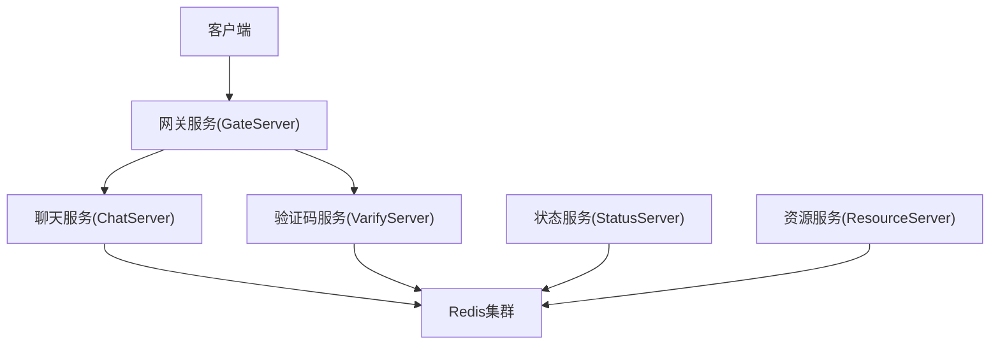
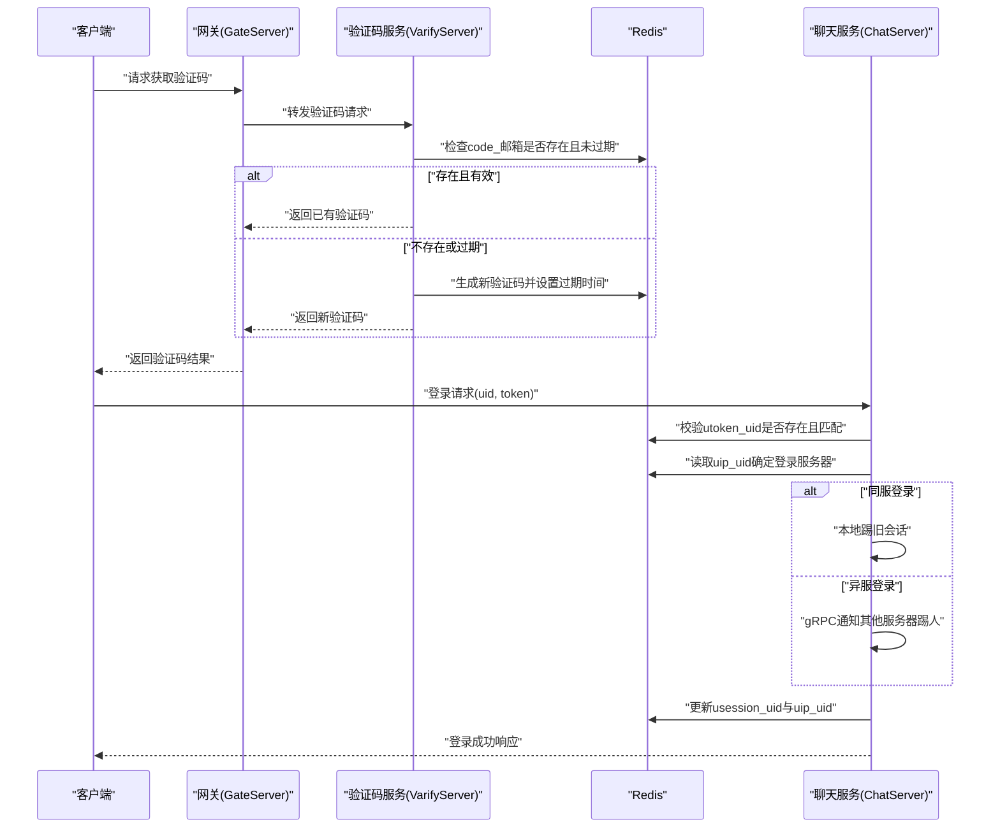
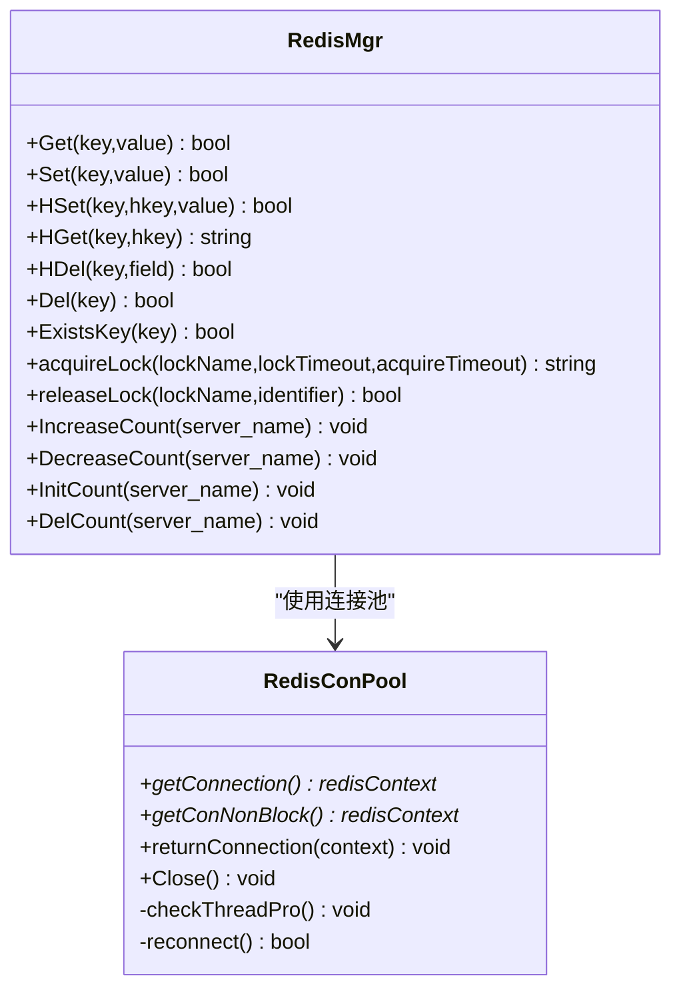
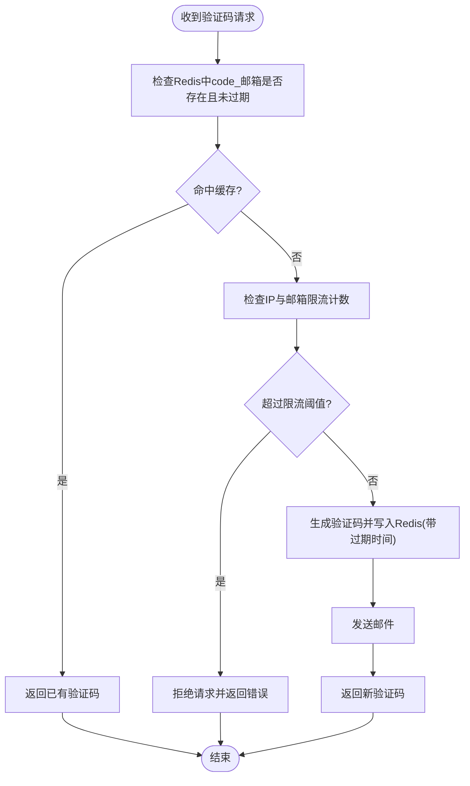
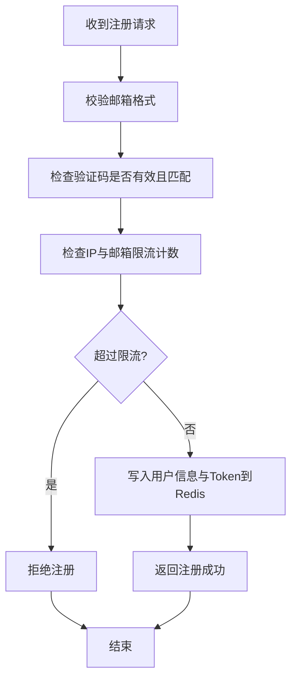
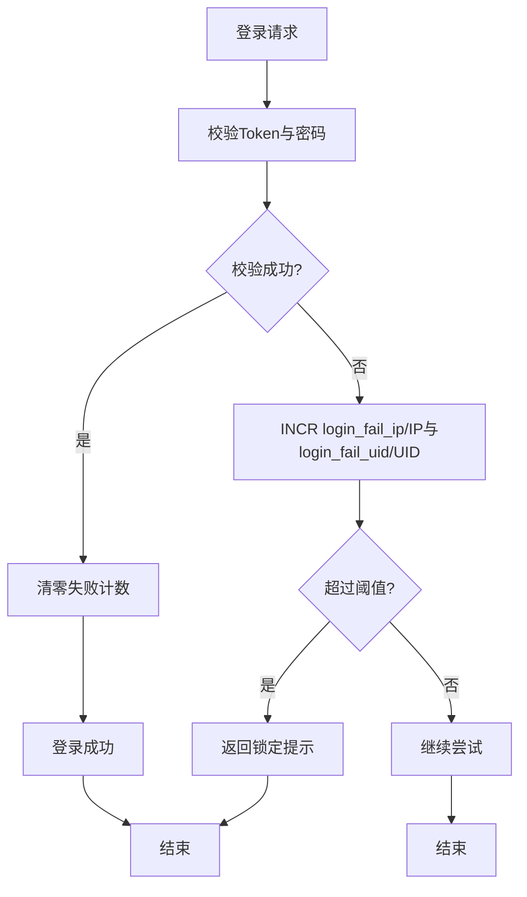
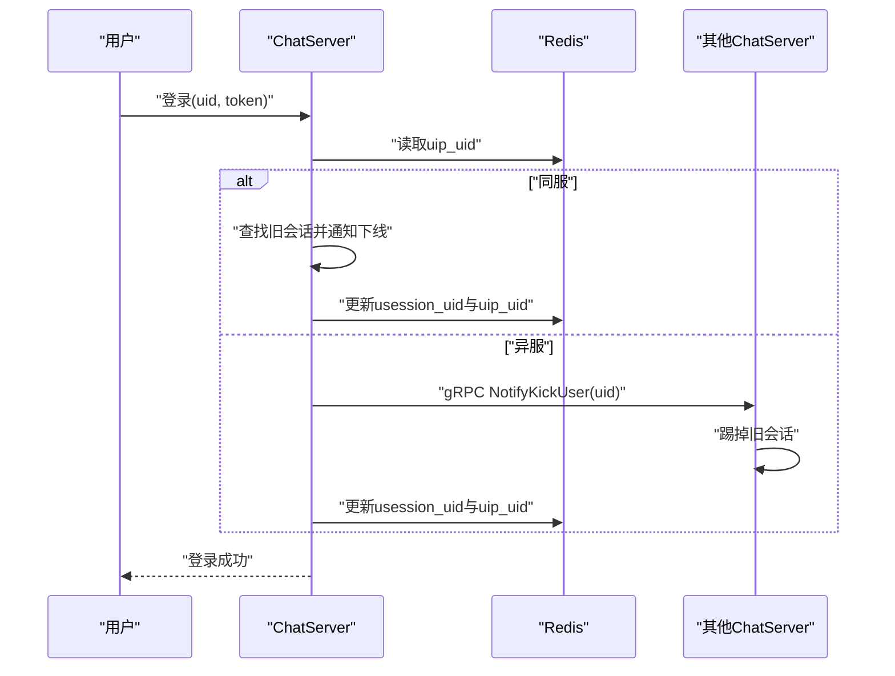
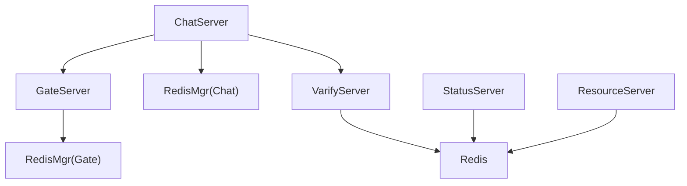

# 频率限制与防刷

<cite>
**本文引用的文件**   
- [RedisMgr.h](file://server/ChatServer/include/RedisMgr.h)
- [RedisMgr.cpp](file://server/ChatServer/src/RedisMgr.cpp)
- [const.h](file://server/ChatServer/include/const.h)
- [LogicSystem.cpp](file://server/ChatServer/src/LogicSystem.cpp)
- [CSession.cpp](file://server/ChatServer/src/CSession.cpp)
- [CServer.cpp](file://server/ChatServer/src/CServer.cpp)
- [RedisMgr.h](file://server/GateServer/include/RedisMgr.h)
- [const.h](file://server/GateServer/include/const.h)
- [server.js](file://server/VarifyServer/server.js)
- [day10-多服务验证码派发功能调试.md](file://开发文档/day10-多服务验证码派发功能调试.md)
- [day32分布式锁设计思路.md](file://开发文档/day32分布式锁设计思路.md)
- [day35心跳逻辑.md](file://开发文档/day35心跳逻辑.md)
- [day34多服程踢人逻辑.md](file://开发文档/day34多服程踢人逻辑.md)
</cite>

## 目录
1. [引言](#引言)
2. [项目结构](#项目结构)
3. [核心组件](#核心组件)
4. [架构总览](#架构总览)
5. [详细组件分析](#详细组件分析)
6. [依赖关系分析](#依赖关系分析)
7. [性能考虑](#性能考虑)
8. [故障排查指南](#故障排查指南)
9. [结论](#结论)
10. [附录：限流配置与监控告警建议](#附录限流配置与监控告警建议)

## 引言
本文件面向LLFCChat项目的频率限制与防刷策略，聚焦基于Redis的并发控制与安全防护。内容涵盖：
- IP地址限流、用户账号限流、接口调用次数限制等通用限流方案
- 验证码发送频率限制、注册接口防刷、登录失败次数限制等安全机制
- 滑动窗口与固定窗口算法在限流中的应用
- 完整的限流配置示例与监控告警策略
- DDoS防护与高并发场景下的性能优化建议

## 项目结构
本项目采用多服务架构（GateServer、ChatServer、ResourceServer、StatusServer、VarifyServer），各服务通过gRPC或HTTP交互，并使用统一的Redis连接池与分布式锁能力进行状态共享与并发控制。限流与防刷主要依赖以下能力：
- Redis键值存储与过期策略（用于计数、缓存验证码、会话信息）
- 分布式锁（acquireLock/releaseLock）保证跨进程/跨节点的原子性
- 连接池与自动保活（PING检测与重连）保障Redis可用性

[本图为概念性架构图，不直接映射具体源码文件]

## 核心组件
- Redis连接池与管理器（RedisConPool/RedisMgr）
  - 提供Get/Set/HSet/HDel/Del/ExistsKey等基础操作
  - 提供分布式锁acquireLock/releaseLock
  - 提供登录数量统计IncreaseCount/DecreaseCount/InitCount/DelCount
- 常量定义（const.h）
  - 定义各类前缀键如USERIPPREFIX、USERTOKENPREFIX、IPCOUNTPREFIX、LOGIN_COUNT、LOCK_PREFIX、USER_SESSION_PREFIX等
  - 定义分布式锁超时参数LOCK_TIME_OUT、ACQUIRE_TIME_OUT
- 业务逻辑（LogicSystem、CSession、CServer）
  - 登录流程中读写用户IP、会话ID、Token校验
  - 异常会话清理、心跳检测与踢人逻辑
  - 使用分布式锁保护关键临界区

**章节来源**
- [RedisMgr.h:267-305](file://server/ChatServer/include/RedisMgr.h#L267-L305)
- [RedisMgr.cpp:404-461](file://server/ChatServer/src/RedisMgr.cpp#L404-L461)
- [const.h:81-94](file://server/ChatServer/include/const.h#L81-L94)
- [LogicSystem.cpp:211-254](file://server/ChatServer/src/LogicSystem.cpp#L211-L254)
- [CSession.cpp:397-460](file://server/ChatServer/src/CSession.cpp#L397-L460)
- [CServer.cpp:41-92](file://server/ChatServer/src/CServer.cpp#L41-L92)

## 架构总览
下图展示验证码发送与复用、登录校验与踢人的整体流程，体现Redis在限流与防刷中的角色。

**图表来源**
- [server.js:39-75](file://server/VarifyServer/server.js#L39-L75)
- [day10-多服务验证码派发功能调试.md:182-194](file://开发文档/day10-多服务验证码派发功能调试.md#L182-L194)
- [LogicSystem.cpp:211-254](file://server/ChatServer/src/LogicSystem.cpp#L211-L254)
- [CServer.cpp:41-92](file://server/ChatServer/src/CServer.cpp#L41-L92)

## 详细组件分析

### 基于Redis的通用限流组件
- 连接池与保活
  - 周期性PING检测连接健康，失败时记录fail_count并尝试重连
  - 非阻塞取连接getConNonBlock与条件变量等待getConnection
- 分布式锁
  - acquireLock使用SET key value NX EX lockTimeout实现原子加锁
  - releaseLock释放对应identifier的锁
  - 支持acquireTimeout避免无限等待
- 计数与统计
  - IncreaseCount/DecreaseCount对LOGIN_COUNT哈希字段增减，配合分布式锁LOCK_COUNT保证一致性
  - InitCount/DelCount用于服务启停时的初始化与清理

**图表来源**
- [RedisMgr.h:9-108](file://server/ChatServer/include/RedisMgr.h#L9-L108)
- [RedisMgr.h:267-305](file://server/ChatServer/include/RedisMgr.h#L267-L305)

**章节来源**
- [RedisMgr.h:9-108](file://server/ChatServer/include/RedisMgr.h#L9-L108)
- [RedisMgr.h:267-305](file://server/ChatServer/include/RedisMgr.h#L267-L305)
- [RedisMgr.cpp:404-461](file://server/ChatServer/src/RedisMgr.cpp#L404-L461)

### 验证码发送频率限制
- 现有机制
  - VarifyServer在Redis中以“code_邮箱”为键缓存验证码，并在一定时间内复用，避免重复发送邮件
  - 文档说明“10分钟之内多次请求会复用缓存”，体现固定窗口式限流
- 建议增强
  - 增加IP维度限流：以“ipcount_”前缀结合IP作为键，限制单位时间内的请求次数
  - 增加邮箱维度限流：以“email_rate_limit_邮箱”为键，限制单位时间内的发送次数
  - 使用滑动窗口：以ZSET记录最近N次请求的时间戳，按时间范围计数

**图表来源**
- [server.js:39-75](file://server/VarifyServer/server.js#L39-L75)
- [day10-多服务验证码派发功能调试.md:182-194](file://开发文档/day10-多服务验证码派发功能调试.md#L182-L194)
- [const.h:63-66](file://server/GateServer/include/const.h#L63-L66)

**章节来源**
- [server.js:39-75](file://server/VarifyServer/server.js#L39-L75)
- [day10-多服务验证码派发功能调试.md:182-194](file://开发文档/day10-多服务验证码派发功能调试.md#L182-L194)
- [const.h:63-66](file://server/GateServer/include/const.h#L63-L66)

### 注册接口防刷
- 风险点
  - 频繁注册导致邮箱滥用、数据库压力增大
- 防护策略
  - 基于IP与邮箱的限流：单位时间内同一IP或邮箱仅允许有限次注册尝试
  - 验证码有效性校验：确保注册请求携带有效的验证码，且验证码与邮箱匹配
  - 幂等与去重：同一邮箱短时间内不允许重复注册
- 实现要点
  - 使用Redis计数器（如“register_ip_”、“register_email_”）配合过期时间
  - 使用分布式锁防止并发写冲突

[本图为概念流程图，不直接映射具体源码文件]

### 登录失败次数限制
- 目标
  - 防止暴力破解密码
- 策略
  - 以“login_fail_ip_”和“login_fail_uid_”为键记录失败次数，设置过期时间
  - 达到阈值后暂时锁定该IP或UID一段时间
  - 成功后清零计数
- 实现
  - 使用Redis INCR/EXPIRE或Lua脚本保证原子性

[本图为概念流程图，不直接映射具体源码文件]

### 会话管理与踢人逻辑（防异地登录）
- 关键点
  - 登录时检查uip_uid确定当前登录服务器
  - 若同服则本地踢旧会话；若异服则通过gRPC通知对方服务器踢人
  - 使用分布式锁保护会话清理与状态更新
- 代码路径
  - LogicSystem::LoginHandler中处理登录与踢人逻辑
  - CSession::DealExceptionSession与CServer心跳定时任务中清理异常会话

**图表来源**
- [LogicSystem.cpp:211-254](file://server/ChatServer/src/LogicSystem.cpp#L211-L254)
- [day34多服程踢人逻辑.md:126-269](file://开发文档/day34多服程踢人逻辑.md#L126-L269)

**章节来源**
- [LogicSystem.cpp:211-254](file://server/ChatServer/src/LogicSystem.cpp#L211-L254)
- [CSession.cpp:397-460](file://server/ChatServer/src/CSession.cpp#L397-L460)
- [CServer.cpp:41-92](file://server/ChatServer/src/CServer.cpp#L41-L92)
- [day34多服程踢人逻辑.md:126-269](file://开发文档/day34多服程踢人逻辑.md#L126-L269)

## 依赖关系分析
- 组件耦合
  - 各服务均依赖RedisMgr进行状态共享与分布式锁
  - ChatServer与GateServer通过gRPC协作完成踢人与验证码分发
- 外部依赖
  - hiredis库用于Redis通信
  - gRPC用于服务间通信
- 潜在循环依赖
  - 通过明确职责边界（Gate负责路由、Chat负责会话、Verify负责验证码）避免循环依赖

**图表来源**
- [RedisMgr.h:267-305](file://server/GateServer/include/RedisMgr.h#L267-L305)
- [RedisMgr.h:267-305](file://server/ChatServer/include/RedisMgr.h#L267-L305)

**章节来源**
- [RedisMgr.h:267-305](file://server/GateServer/include/RedisMgr.h#L267-L305)
- [RedisMgr.h:267-305](file://server/ChatServer/include/RedisMgr.h#L267-L305)

## 性能考虑
- Redis连接池
  - 合理设置poolSize，避免过多连接造成内存与上下文切换开销
  - 启用PING保活与自动重连，降低连接失效影响
- 分布式锁
  - 缩短锁持有时间，避免热点竞争
  - 使用tryLock+退避重试，减少阻塞
- 限流算法选择
  - 固定窗口：简单高效，适合验证码缓存与短周期限流
  - 滑动窗口：更平滑，适合高频接口限流，但需更多内存与计算
- 高并发优化
  - 批量操作与Lua脚本减少网络往返
  - 热点键分片与本地缓存（短期）缓解Redis压力

[本节为通用指导，不直接分析具体文件]

## 故障排查指南
- Redis连接问题
  - 检查连接池PING检测结果与fail_count计数
  - 查看AUTH认证日志与重连逻辑
- 分布式锁异常
  - 确认acquireTimeout与lockTimeout设置是否合理
  - 检查是否存在死锁或锁未释放情况
- 验证码与限流
  - 核查Redis中code_、ipcount_等键的过期时间与计数
  - 验证VarifyServer邮件发送与缓存复用逻辑

**章节来源**
- [RedisMgr.h:137-206](file://server/ChatServer/include/RedisMgr.h#L137-L206)
- [day32分布式锁设计思路.md:95-130](file://开发文档/day32分布式锁设计思路.md#L95-L130)
- [day35心跳逻辑.md:41-92](file://开发文档/day35心跳逻辑.md#L41-L92)

## 结论
LLFCChat已具备基于Redis的分布式锁与连接池基础设施，为限流与防刷提供了坚实基础。建议在验证码、注册、登录等关键路径引入IP与账号维度的限流策略，并结合滑动窗口与固定窗口算法实现精细化控制。同时完善监控告警与故障自愈机制，提升系统在DDoS攻击与高并发场景下的稳定性与可用性。

[本节为总结性内容，不直接分析具体文件]

## 附录：限流配置与监控告警建议
- 限流键命名规范
  - 验证码：code_邮箱、verify_ip_、verify_email_
  - 注册：register_ip_、register_email_
  - 登录失败：login_fail_ip_、login_fail_uid_
  - 会话：usession_uid、uip_uid、utoken_uid
- 阈值建议
  - 验证码：单IP每分钟不超过5次，单邮箱每10分钟不超过3次
  - 注册：单IP每小时不超过10次，单邮箱每天不超过3次
  - 登录失败：单IP每分钟不超过5次，单UID每分钟不超过3次
- 监控指标
  - Redis命中率、连接池大小、PING失败率
  - 各限流键的计数与过期分布
  - 接口QPS、延迟、错误码分布
- 告警策略
  - Redis连接失败率超过阈值触发告警
  - 限流键计数突增触发告警（疑似攻击）
  - 验证码发送失败率升高触发告警

[本节为通用建议，不直接分析具体文件]