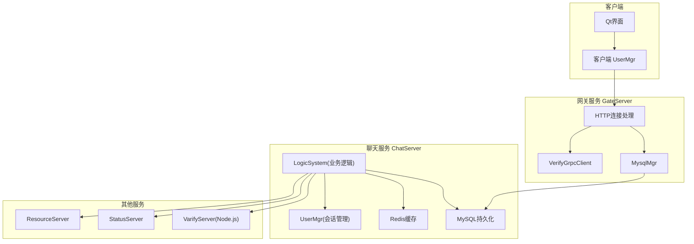
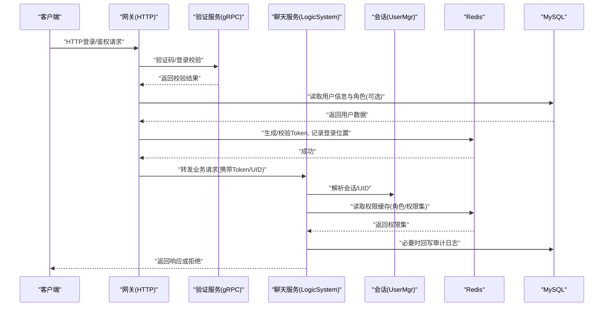
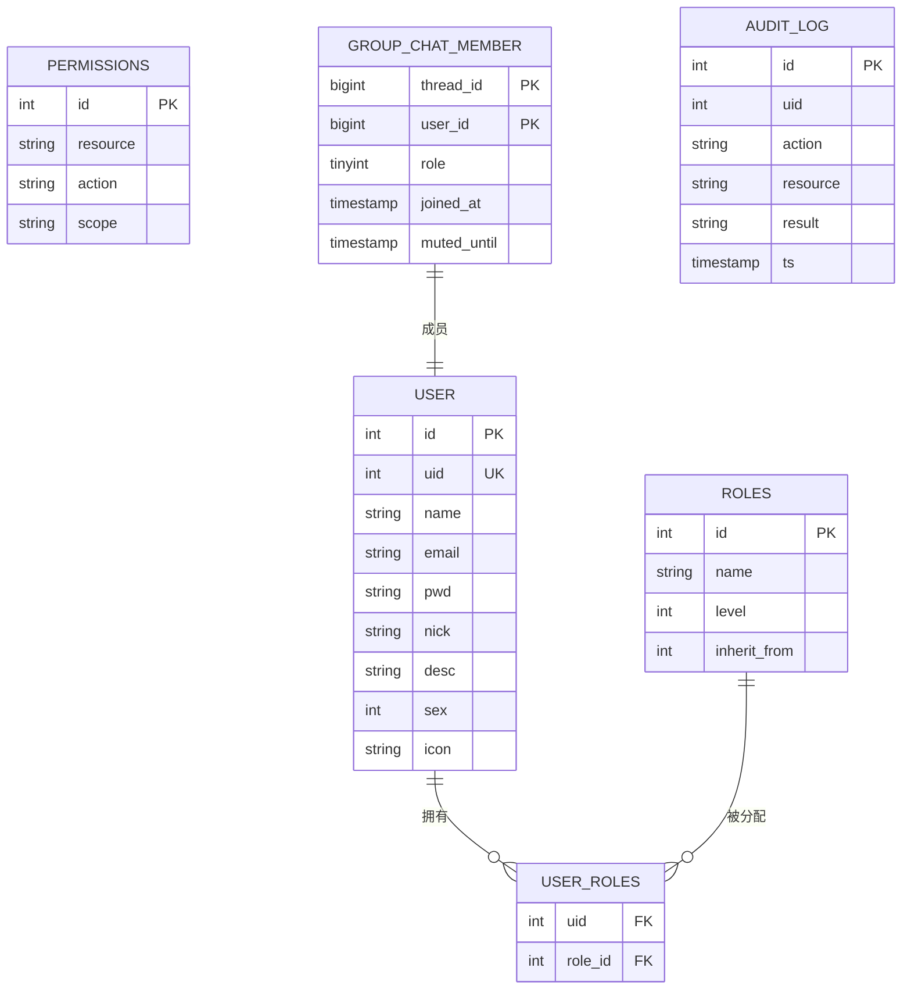
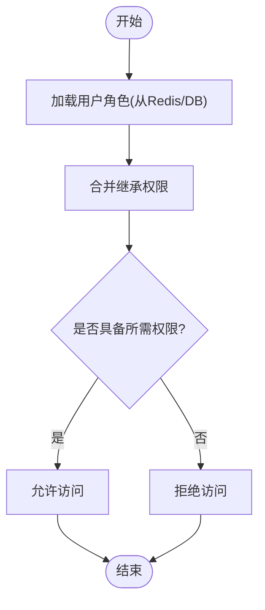
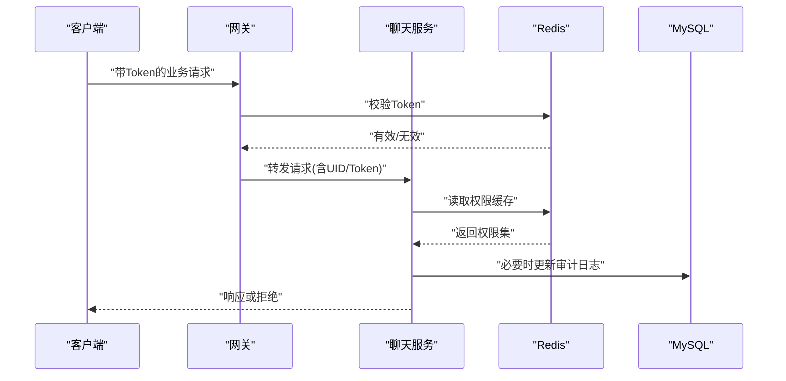
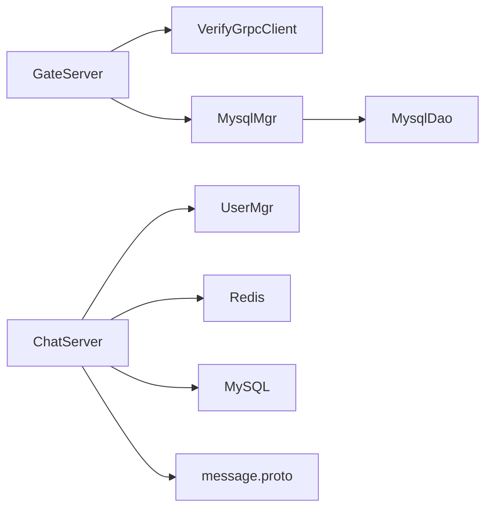

# RBAC角色权限系统

<cite>
**本文引用的文件**   
- [server/ChatServer/include/UserMgr.h](file://server/ChatServer/include/UserMgr.h)
- [client/llfcchat/include/usermgr.h](file://client/llfcchat/include/usermgr.h)
- [server/ChatServer/include/data.h](file://server/ChatServer/include/data.h)
- [client/llfcchat/include/userdata.h](file://client/llfcchat/include/userdata.h)
- [sql备份/llfc.sql](file://sql备份/llfc.sql)
- [server/GateServer/src/MysqlMgr.cpp](file://server/GateServer/src/MysqlMgr.cpp)
- [server/GateServer/include/MysqlDao.h](file://server/GateServer/include/MysqlDao.h)
- [server/GateServer/include/HttpConnection.h](file://server/GateServer/include/HttpConnection.h)
- [server/GateServer/src/VerifyGrpcClient.cpp](file://server/GateServer/src/VerifyGrpcClient.cpp)
- [server/proto/chat/message.proto](file://server/proto/chat/message.proto)
- [开发文档/day29-好友认证和聊天通信.md](file://开发文档/day29-好友认证和聊天通信.md)
- [开发文档/day37-聊天信息存储方案.md](file://开发文档/day37-聊天信息存储方案.md)
- [开发文档/day33单服程踢人逻辑.md](file://开发文档/day33单服程踢人逻辑.md)
- [开发文档/day09-redis服务搭建.md](file://开发文档/day09-redis服务搭建.md)
</cite>

## 目录
1. [引言](#引言)
2. [项目结构](#项目结构)
3. [核心组件](#核心组件)
4. [架构总览](#架构总览)
5. [详细组件分析](#详细组件分析)
6. [依赖关系分析](#依赖关系分析)
7. [性能考虑](#性能考虑)
8. [故障排查指南](#故障排查指南)
9. [结论](#结论)
10. [附录](#附录)

## 引言
本文件为LLFCChat项目的RBAC（基于角色的访问控制）角色权限系统设计文档。当前仓库已具备用户、会话、登录校验、分布式锁与Redis缓存等基础能力，但尚未实现完整的RBAC模型。本文在现有代码基础上，提出一套可扩展的RBAC设计：定义角色与权限、角色继承、动态授权、批量管理、请求拦截与鉴权决策、审计与缓存优化，并给出与现有模块的集成路径与示例说明。

## 项目结构
- 客户端（Qt/C++）：负责UI交互、消息收发、本地数据管理与状态维护。
- 网关服务（GateServer）：HTTP入口、验证码与登录流程协调、RPC调用封装。
- 聊天服务（ChatServer）：业务主逻辑、会话管理、消息路由、跨服通知。
- 资源服务（ResourceServer）：文件上传下载等。
- 状态服务（StatusServer）：状态查询与发现。
- 验证服务（VarifyServer）：验证码发放与校验（Node.js）。
- 数据库与缓存：MySQL持久化、Redis用于会话、令牌、分布式锁与热点数据缓存。

**图表来源** 
- [server/GateServer/include/HttpConnection.h:1-36](file://server/GateServer/include/HttpConnection.h#L1-L36)
- [server/GateServer/src/VerifyGrpcClient.cpp:1-9](file://server/GateServer/src/VerifyGrpcClient.cpp#L1-L9)
- [server/GateServer/src/MysqlMgr.cpp:1-30](file://server/GateServer/src/MysqlMgr.cpp#L1-L30)
- [server/ChatServer/include/UserMgr.h:1-22](file://server/ChatServer/include/UserMgr.h#L1-L22)
- [client/llfcchat/include/usermgr.h:1-116](file://client/llfcchat/include/usermgr.h#L1-L116)

**章节来源**
- [server/GateServer/include/HttpConnection.h:1-36](file://server/GateServer/include/HttpConnection.h#L1-L36)
- [server/GateServer/src/VerifyGrpcClient.cpp:1-9](file://server/GateServer/src/VerifyGrpcClient.cpp#L1-L9)
- [server/GateServer/src/MysqlMgr.cpp:1-30](file://server/GateServer/src/MysqlMgr.cpp#L1-L30)
- [server/ChatServer/include/UserMgr.h:1-22](file://server/ChatServer/include/UserMgr.h#L1-L22)
- [client/llfcchat/include/usermgr.h:1-116](file://client/llfcchat/include/usermgr.h#L1-L116)

## 核心组件
- 用户与会话管理
  - 服务端UserMgr：维护uid到CSession的映射，支持设置、获取、移除会话，用于在线踢人、消息推送等。
  - 客户端UserMgr：维护当前用户信息、Token、好友列表、申请列表、聊天线程数据、文件传输状态等。
- 数据模型
  - data.h中的UserInfo、ApplyInfo、ChatThreadInfo、ChatMessage等用于服务器端数据结构。
  - userdata.h中对应客户端的数据结构与消息类型。
- 数据库与DAO
  - MysqlMgr与MysqlDao提供注册、密码校验、事务等操作；当前SQL脚本包含群成员role字段（普通成员/管理员/创建者），可作为RBAC扩展的基础。
- 网络与协议
  - proto/chat/message.proto定义了聊天与认证相关的gRPC接口，可用于跨服通知与鉴权联动。
- 缓存与分布式锁
  - Redis用于令牌、会话位置、分布式锁等；分布式锁已在多处使用，可支撑并发安全的权限变更与审计写入。

**章节来源**
- [server/ChatServer/include/UserMgr.h:1-22](file://server/ChatServer/include/UserMgr.h#L1-L22)
- [client/llfcchat/include/usermgr.h:1-116](file://client/llfcchat/include/usermgr.h#L1-L116)
- [server/ChatServer/include/data.h:1-65](file://server/ChatServer/include/data.h#L1-L65)
- [client/llfcchat/include/userdata.h:1-288](file://client/llfcchat/include/userdata.h#L1-L288)
- [server/GateServer/src/MysqlMgr.cpp:1-30](file://server/GateServer/src/MysqlMgr.cpp#L1-L30)
- [server/GateServer/include/MysqlDao.h:1-238](file://server/GateServer/include/MysqlDao.h#L1-L238)
- [server/proto/chat/message.proto:95-166](file://server/proto/chat/message.proto#L95-L166)
- [sql备份/llfc.sql:380-391](file://sql备份/llfc.sql#L380-L391)

## 架构总览
下图展示RBAC在LLFCChat中的整体集成点：网关层进行统一鉴权拦截，聊天服务内部按角色与权限做细粒度控制，Redis承担权限缓存与分布式锁，MySQL承载持久化。

**图表来源** 
- [server/GateServer/include/HttpConnection.h:1-36](file://server/GateServer/include/HttpConnection.h#L1-L36)
- [server/GateServer/src/VerifyGrpcClient.cpp:1-9](file://server/GateServer/src/VerifyGrpcClient.cpp#L1-L9)
- [server/ChatServer/include/UserMgr.h:1-22](file://server/ChatServer/include/UserMgr.h#L1-L22)
- [server/proto/chat/message.proto:95-166](file://server/proto/chat/message.proto#L95-L166)
- [开发文档/day33单服程踢人逻辑.md:241-383](file://开发文档/day33单服程踢人逻辑.md#L241-L383)
- [开发文档/day09-redis服务搭建.md:433-535](file://开发文档/day09-redis服务搭建.md#L433-L535)

## 详细组件分析

### 角色与权限模型设计
- 角色分类
  - 普通用户：默认角色，具备基础聊天、好友管理等权限。
  - 管理员：具备群组管理、禁言、踢人、查看日志等权限。
  - 创建者：群组创建者，拥有群组内最高权限（如解散群组、转让角色）。
- 权限级别划分
  - 资源级：群组、私聊会话、文件资源。
  - 操作级：读、写、管理、审计。
  - 维度：用户维、群组维、全局维。
- 角色继承关系
  - 创建者 > 管理员 > 普通用户。
  - 支持多角色叠加，取并集权限。
- 数据模型建议
  - 用户表user：已有uid、name、email等字段，可扩展role字段（当前SQL中group_chat_member有role字段，可借鉴）。
  - 角色表roles：id、name、level、inherit_from。
  - 权限表permissions：id、resource、action、scope。
  - 用户角色关联user_roles：uid、role_id。
  - 群组角色group_roles：thread_id、uid、role（已有）。
  - 审计日志audit_log：uid、action、resource、result、ts。

**图表来源** 
- [sql备份/llfc.sql:380-391](file://sql备份/llfc.sql#L380-L391)
- [sql备份/llfc.sql:464-481](file://sql备份/llfc.sql#L464-L481)

**章节来源**
- [sql备份/llfc.sql:380-391](file://sql备份/llfc.sql#L380-L391)
- [sql备份/llfc.sql:464-481](file://sql备份/llfc.sql#L464-L481)

### 权限分配机制
- 角色与权限映射
  - 通过user_roles与roles.permissions建立映射，支持继承合并。
- 动态权限授予
  - 管理员可为用户临时授予权限（如限时禁言解除、临时管理员），写入Redis并定时清理。
- 批量权限管理
  - 提供批量导入/导出接口，结合分布式锁保证一致性。
- 实现要点
  - 权限计算在服务端集中进行，避免客户端篡改。
  - 使用Redis缓存角色与权限集合，键策略如“role:{uid}”、“perm:{uid}:{resource}:{action}”。

**图表来源** 
- [server/ChatServer/include/UserMgr.h:1-22](file://server/ChatServer/include/UserMgr.h#L1-L22)
- [server/GateServer/include/MysqlDao.h:1-238](file://server/GateServer/include/MysqlDao.h#L1-L238)

**章节来源**
- [server/ChatServer/include/UserMgr.h:1-22](file://server/ChatServer/include/UserMgr.h#L1-L22)
- [server/GateServer/include/MysqlDao.h:1-238](file://server/GateServer/include/MysqlDao.h#L1-L238)

### 权限验证流程
- 请求拦截
  - 网关层对HTTP请求进行鉴权拦截，校验Token有效性及权限范围。
- 权限检查
  - 聊天服务根据资源与动作判断权限，优先查Redis缓存，未命中则回源DB。
- 访问决策
  - 若具备权限则放行，否则拒绝并记录审计日志。
- 关键步骤
  - 登录时生成Token并写入Redis，记录用户所在服务器IP。
  - 会话绑定uid，支持踢人与离线通知。

**图表来源** 
- [server/GateServer/include/HttpConnection.h:1-36](file://server/GateServer/include/HttpConnection.h#L1-L36)
- [server/ChatServer/include/UserMgr.h:1-22](file://server/ChatServer/include/UserMgr.h#L1-L22)
- [开发文档/day33单服程踢人逻辑.md:241-383](file://开发文档/day33单服程踢人逻辑.md#L241-L383)
- [开发文档/day09-redis服务搭建.md:433-535](file://开发文档/day09-redis服务搭建.md#L433-L535)

**章节来源**
- [server/GateServer/include/HttpConnection.h:1-36](file://server/GateServer/include/HttpConnection.h#L1-L36)
- [server/ChatServer/include/UserMgr.h:1-22](file://server/ChatServer/include/UserMgr.h#L1-L22)
- [开发文档/day33单服程踢人逻辑.md:241-383](file://开发文档/day33单服程踢人逻辑.md#L241-L383)
- [开发文档/day09-redis服务搭建.md:433-535](file://开发文档/day09-redis服务搭建.md#L433-L535)

### 代码集成示例（路径引用）
- 登录与Token校验
  - 参考登录处理器中对Redis Token校验与用户IP记录的逻辑。
  - 路径：[开发文档/day33单服程踢人逻辑.md:241-383](file://开发文档/day33单服程踢人逻辑.md#L241-L383)
- 会话管理与踢人
  - 通过UserMgr::SetUserSession/GetSession实现会话绑定与查找。
  - 路径：[server/ChatServer/include/UserMgr.h:1-22](file://server/ChatServer/include/UserMgr.h#L1-L22)
- 权限缓存与分布式锁
  - 使用Redis进行权限缓存与加锁，确保并发安全。
  - 路径：[开发文档/day09-redis服务搭建.md:433-535](file://开发文档/day09-redis服务搭建.md#L433-L535)
- 跨服通知与认证
  - 通过proto定义的gRPC接口进行跨服通知，可在鉴权流程中扩展。
  - 路径：[server/proto/chat/message.proto:95-166](file://server/proto/chat/message.proto#L95-L166)

**章节来源**
- [开发文档/day33单服程踢人逻辑.md:241-383](file://开发文档/day33单服程踢人逻辑.md#L241-L383)
- [server/ChatServer/include/UserMgr.h:1-22](file://server/ChatServer/include/UserMgr.h#L1-L22)
- [开发文档/day09-redis服务搭建.md:433-535](file://开发文档/day09-redis服务搭建.md#L433-L535)
- [server/proto/chat/message.proto:95-166](file://server/proto/chat/message.proto#L95-L166)

### 高级特性说明
- 权限配置管理
  - 提供后台接口修改角色与权限映射，变更后失效相关缓存键。
- 角色变更审计
  - 所有角色与权限变更写入audit_log表，支持追溯与告警。
- 权限缓存优化
  - 使用Redis哈希或集合存储用户权限集，设置合理TTL，热点数据常驻。
  - 采用事件驱动刷新：当权限变更时发布事件，订阅者清理缓存。

**章节来源**
- [sql备份/llfc.sql:380-391](file://sql备份/llfc.sql#L380-L391)
- [server/GateServer/include/MysqlDao.h:1-238](file://server/GateServer/include/MysqlDao.h#L1-L238)
- [开发文档/day09-redis服务搭建.md:433-535](file://开发文档/day09-redis服务搭建.md#L433-L535)

## 依赖关系分析
- 组件耦合
  - 网关层依赖验证服务与MySQL，聊天服务依赖UserMgr、Redis、MySQL。
- 直接依赖
  - MysqlMgr依赖MysqlDao；VerifyGrpcClient依赖配置与gRPC通道池。
- 间接依赖
  - 权限缓存依赖Redis；审计日志依赖MySQL。
- 外部集成
  - gRPC用于跨服通知；Redis用于缓存与锁；MySQL用于持久化。

**图表来源** 
- [server/GateServer/src/VerifyGrpcClient.cpp:1-9](file://server/GateServer/src/VerifyGrpcClient.cpp#L1-L9)
- [server/GateServer/src/MysqlMgr.cpp:1-30](file://server/GateServer/src/MysqlMgr.cpp#L1-L30)
- [server/GateServer/include/MysqlDao.h:1-238](file://server/GateServer/include/MysqlDao.h#L1-L238)
- [server/ChatServer/include/UserMgr.h:1-22](file://server/ChatServer/include/UserMgr.h#L1-L22)
- [server/proto/chat/message.proto:95-166](file://server/proto/chat/message.proto#L95-L166)

**章节来源**
- [server/GateServer/src/VerifyGrpcClient.cpp:1-9](file://server/GateServer/src/VerifyGrpcClient.cpp#L1-L9)
- [server/GateServer/src/MysqlMgr.cpp:1-30](file://server/GateServer/src/MysqlMgr.cpp#L1-L30)
- [server/GateServer/include/MysqlDao.h:1-238](file://server/GateServer/include/MysqlDao.h#L1-L238)
- [server/ChatServer/include/UserMgr.h:1-22](file://server/ChatServer/include/UserMgr.h#L1-L22)
- [server/proto/chat/message.proto:95-166](file://server/proto/chat/message.proto#L95-L166)

## 性能考虑
- 缓存命中率：将高频权限查询放入Redis，减少DB压力。
- 分布式锁：权限变更与审计写入时使用锁避免竞态。
- 异步处理：通知与审计日志可异步落盘，降低主链路延迟。
- 连接池：MySQL与gRPC连接池复用，提升吞吐。

## 故障排查指南
- 登录失败
  - 检查Redis中Token是否存在且匹配；确认用户IP记录是否正确。
  - 参考：[开发文档/day33单服程踢人逻辑.md:241-383](file://开发文档/day33单服程踢人逻辑.md#L241-L383)
- 权限拒绝
  - 检查Redis权限缓存是否过期或错误；核对角色继承与权限映射。
  - 参考：[开发文档/day09-redis服务搭建.md:433-535](file://开发文档/day09-redis服务搭建.md#L433-L535)
- 跨服通知失败
  - 检查gRPC通道池与目标服务器地址；确认会话存在。
  - 参考：[server/proto/chat/message.proto:95-166](file://server/proto/chat/message.proto#L95-L166)

**章节来源**
- [开发文档/day33单服程踢人逻辑.md:241-383](file://开发文档/day33单服程踢人逻辑.md#L241-L383)
- [开发文档/day09-redis服务搭建.md:433-535](file://开发文档/day09-redis服务搭建.md#L433-L535)
- [server/proto/chat/message.proto:95-166](file://server/proto/chat/message.proto#L95-L166)

## 结论
LLFCChat已具备实现RBAC的基础设施：用户与会话管理、Redis缓存、分布式锁、gRPC跨服通信与MySQL持久化。通过引入角色与权限模型、权限缓存与审计、以及网关层统一鉴权拦截，可在不破坏现有架构的前提下完成RBAC落地。建议优先实现权限缓存与审计，再逐步完善角色继承与动态授权。

## 附录
- 相关数据与消息结构
  - 服务器端数据结构：[server/ChatServer/include/data.h:1-65](file://server/ChatServer/include/data.h#L1-L65)
  - 客户端数据结构：[client/llfcchat/include/userdata.h:1-288](file://client/llfcchat/include/userdata.h#L1-L288)
- 群成员角色字段
  - [sql备份/llfc.sql:380-391](file://sql备份/llfc.sql#L380-L391)