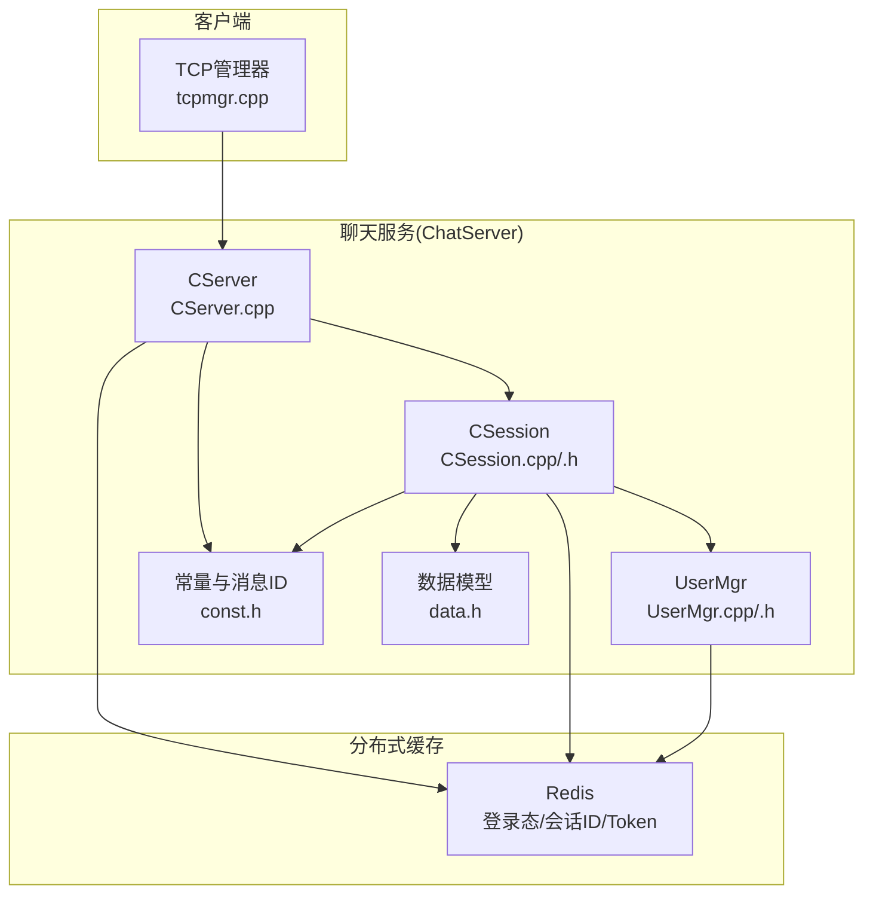
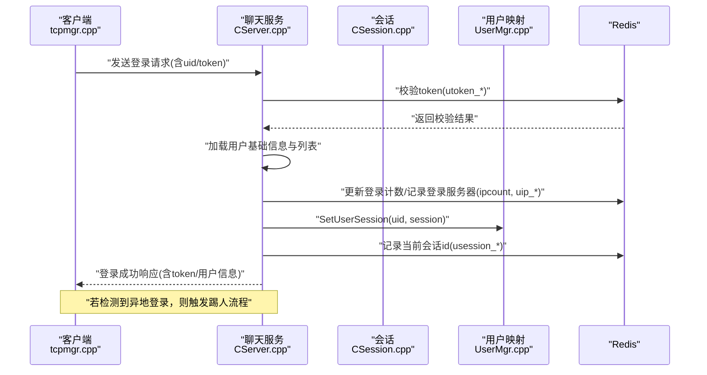
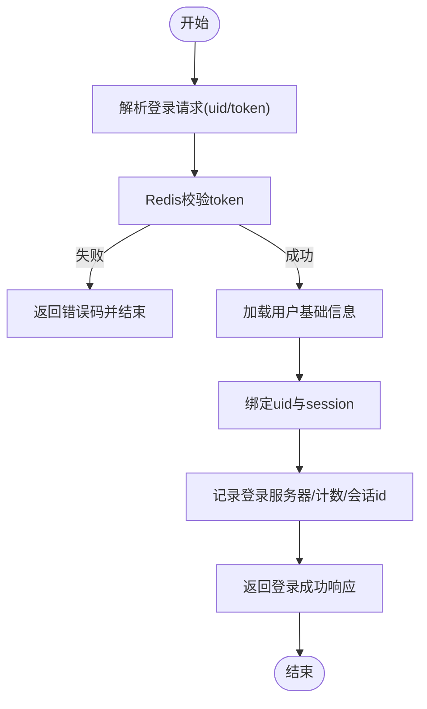
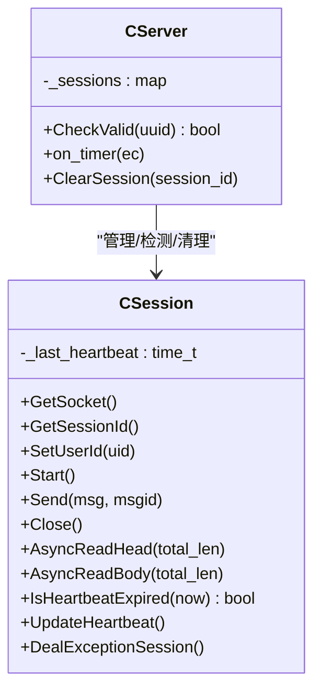
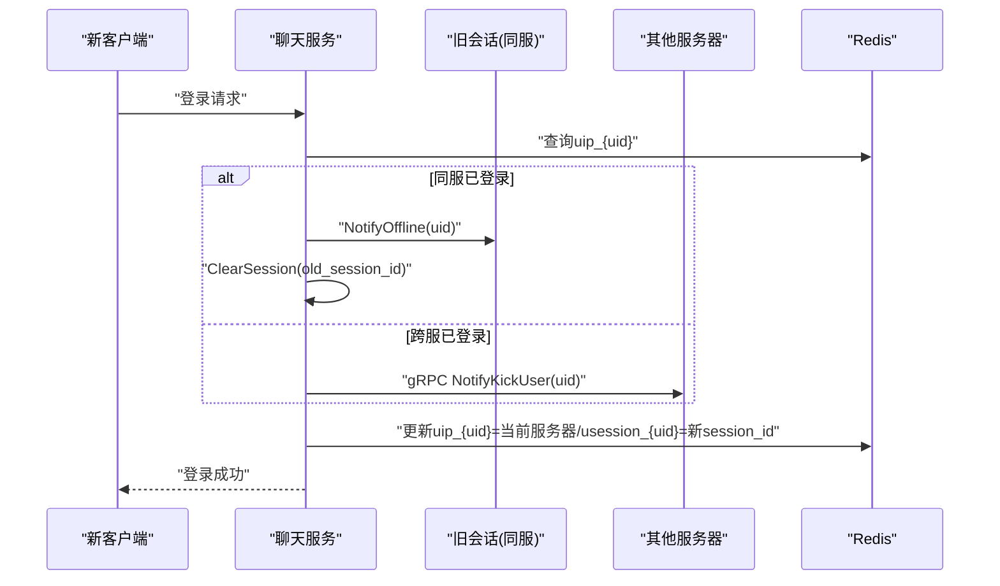
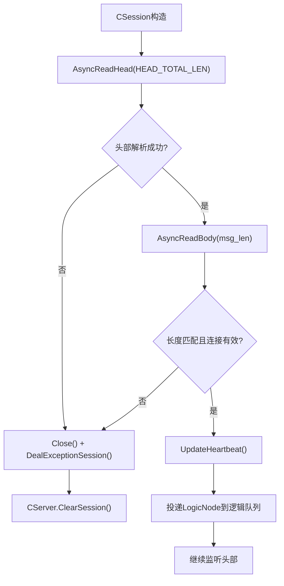
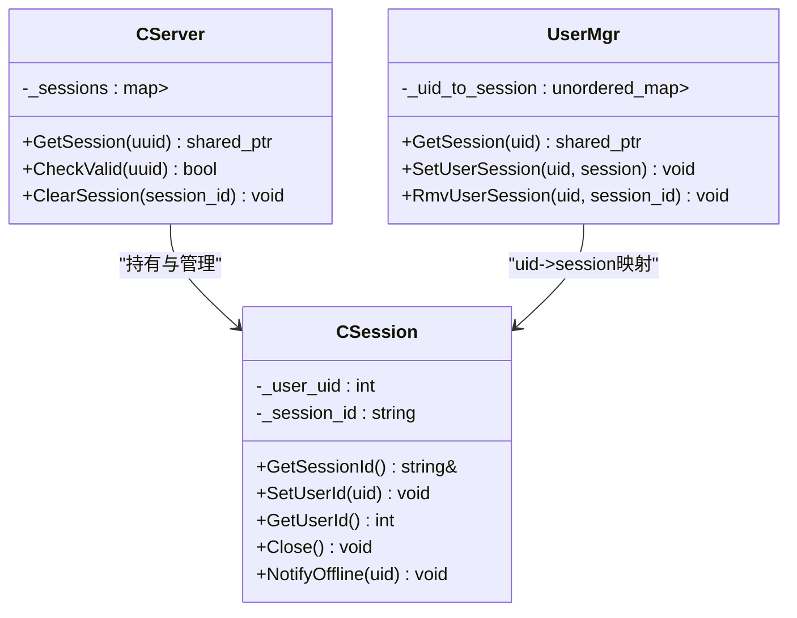
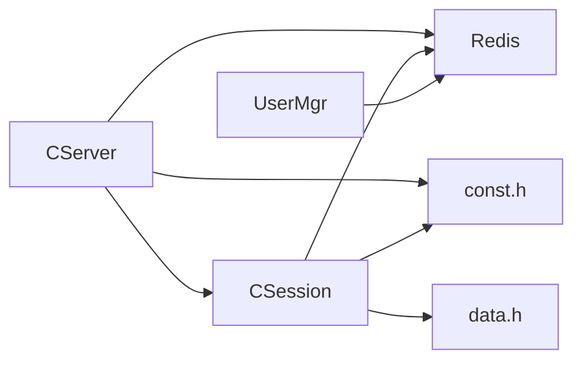

# 会话访问控制

<cite>
**本文引用的文件**   
- [CSession.h](file://server/ChatServer/include/CSession.h)
- [CSession.cpp](file://server/ChatServer/src/CSession.cpp)
- [CServer.cpp](file://server/ChatServer/src/CServer.cpp)
- [UserMgr.h](file://server/ChatServer/include/UserMgr.h)
- [UserMgr.cpp](file://server/ChatServer/src/UserMgr.cpp)
- [const.h](file://server/ChatServer/include/const.h)
- [data.h](file://server/ChatServer/include/data.h)
- [day35心跳逻辑.md](file://开发文档/day35心跳逻辑.md)
- [day34多服程踢人逻辑.md](file://开发文档/day34多服程踢人逻辑.md)
- [day27-分布式服务设计.md](file://开发文档/day27-分布式服务设计.md)
- [tcpmgr.cpp](file://client/llfcchat/src/tcpmgr.cpp)
</cite>

## 目录
1. [引言](#引言)
2. [项目结构](#项目结构)
3. [核心组件](#核心组件)
4. [架构总览](#架构总览)
5. [详细组件分析](#详细组件分析)
6. [依赖关系分析](#依赖关系分析)
7. [性能考量](#性能考量)
8. [故障排查指南](#故障排查指南)
9. [结论](#结论)
10. [附录](#附录)

## 引言
本文件面向LLFCChat项目的“会话访问控制”主题，系统性阐述用户级访问控制、在线状态与心跳机制、踢人与强制下线策略、会话生命周期管理以及安全配置与异常处理模式。内容基于服务端ChatServer与会话实现、分布式登录与踢人流程、客户端登录回调等源码与开发文档进行归纳与可视化说明，帮助读者快速理解并落地相关能力。

## 项目结构
围绕会话访问控制的关键代码集中在ChatServer的会话层（CSession）、服务器层（CServer）、用户会话映射（UserMgr）以及常量定义（const.h），并结合Redis分布式键值存储完成跨进程/跨机器的会话与登录态管理。客户端通过TCP连接接收登录响应与离线通知，驱动界面切换与后续业务。

**图示来源** 
- [CServer.cpp:75-100](file://server/ChatServer/src/CServer.cpp#L75-L100)
- [CSession.cpp:133-194](file://server/ChatServer/src/CSession.cpp#L133-L194)
- [UserMgr.cpp:10-44](file://server/ChatServer/src/UserMgr.cpp#L10-L44)
- [const.h:49-89](file://server/ChatServer/include/const.h#L49-L89)

**章节来源**
- [CServer.cpp:75-100](file://server/ChatServer/src/CServer.cpp#L75-L100)
- [CSession.cpp:133-194](file://server/ChatServer/src/CSession.cpp#L133-L194)
- [UserMgr.cpp:10-44](file://server/ChatServer/src/UserMgr.cpp#L10-L44)
- [const.h:49-89](file://server/ChatServer/include/const.h#L49-L89)

## 核心组件
- CSession：封装单个TCP连接的读写、心跳维护、异常清理、离线通知与图片下载通知等。
- CServer：维护所有活跃会话集合、定时心跳检测、会话有效性校验、会话清理。
- UserMgr：维护uid到session的映射，支持设置、获取与按session_id精确移除。
- const.h：错误码、消息ID、Redis键前缀、锁参数等全局常量。
- data.h：用户信息、申请信息、聊天线程与消息等数据结构。

**章节来源**
- [CSession.h:28-76](file://server/ChatServer/include/CSession.h#L28-L76)
- [CSession.cpp:13-44](file://server/ChatServer/src/CSession.cpp#L13-L44)
- [CServer.cpp:55-73](file://server/ChatServer/src/CServer.cpp#L55-L73)
- [UserMgr.h:8-20](file://server/ChatServer/include/UserMgr.h#L8-L20)
- [const.h:5-20](file://server/ChatServer/include/const.h#L5-L20)
- [data.h:4-15](file://server/ChatServer/include/data.h#L4-L15)

## 架构总览
下图展示一次典型登录与会话建立过程中的关键交互：客户端发送登录请求，服务端验证token、加载用户信息、绑定uid与session、记录登录位置与计数，并在需要时触发跨服踢人；随后进入心跳保活与过期回收流程。

**图示来源** 
- [day27-分布式服务设计.md:365-444](file://开发文档/day27-分布式服务设计.md#L365-L444)
- [day34多服程踢人逻辑.md:126-270](file://开发文档/day34多服程踢人逻辑.md#L126-L270)
- [const.h:81-89](file://server/ChatServer/include/const.h#L81-L89)

## 详细组件分析

### 用户状态验证与登录流程
- Token校验：从Redis中读取utoken_{uid}并与请求token比对，失败返回相应错误码。
- 用户信息加载：根据ubaseinfo_{uid}获取基础信息，必要时从数据库补充。
- 会话绑定：将session与uid绑定，记录登录服务器名与当前会话id，便于后续踢人与统计。
- 客户端侧：解析登录响应，保存用户信息与token，切换到聊天主界面。

**图示来源** 
- [day27-分布式服务设计.md:365-444](file://开发文档/day27-分布式服务设计.md#L365-L444)
- [day34多服程踢人逻辑.md:126-270](file://开发文档/day34多服程踢人逻辑.md#L126-L270)
- [tcpmgr.cpp:207-234](file://client/llfcchat/src/tcpmgr.cpp#L207-L234)

**章节来源**
- [day27-分布式服务设计.md:365-444](file://开发文档/day27-分布式服务设计.md#L365-L444)
- [day34多服程踢人逻辑.md:126-270](file://开发文档/day34多服程踢人逻辑.md#L126-L270)
- [tcpmgr.cpp:207-234](file://client/llfcchat/src/tcpmgr.cpp#L207-L234)

### 在线状态与心跳机制
- 心跳更新：每次收到有效数据后更新_last_heartbeat时间戳。
- 心跳检测：定时器周期性遍历会话，计算now - _last_heartbeat，超过阈值判定为过期。
- 过期处理：关闭socket，收集过期会话，统一调用DealExceptionSession进行分布式清理。

**图示来源** 
- [CSession.cpp:288-302](file://server/ChatServer/src/CSession.cpp#L288-L302)
- [CServer.cpp:75-100](file://server/ChatServer/src/CServer.cpp#L75-L100)

**章节来源**
- [CSession.cpp:288-302](file://server/ChatServer/src/CSession.cpp#L288-L302)
- [CServer.cpp:75-100](file://server/ChatServer/src/CServer.cpp#L75-L100)
- [day35心跳逻辑.md:28-444](file://开发文档/day35心跳逻辑.md#L28-L444)

### 踢人机制（主动/超时/强制下线）
- 主动踢人（同服）：新登录发现旧session在同一服务器，直接通知旧session离线并清理其会话。
- 跨服踢人：旧session在其他服务器，通过gRPC通知目标服务器执行踢人。
- 超时踢人：心跳过期导致连接断开，进入异常清理流程，删除Redis中的会话与登录信息。

**图示来源** 
- [day34多服程踢人逻辑.md:126-270](file://开发文档/day34多服程踢人逻辑.md#L126-L270)
- [CSession.cpp:253-264](file://server/ChatServer/src/CSession.cpp#L253-L264)
- [const.h:81-89](file://server/ChatServer/include/const.h#L81-L89)

**章节来源**
- [day34多服程踢人逻辑.md:126-270](file://开发文档/day34多服程踢人逻辑.md#L126-L270)
- [CSession.cpp:253-264](file://server/ChatServer/src/CSession.cpp#L253-L264)

### 会话生命周期管理（创建/扩展/销毁）
- 创建：CSession构造生成唯一session_id，初始化接收缓冲与心跳时间戳，启动异步读头。
- 扩展：持续异步读取头部与体，组装消息节点投递至LogicSystem处理；写队列串行化输出。
- 销毁：网络错误或心跳过期触发Close与DealExceptionSession，清理Redis中的会话与登录态，并从CServer会话表移除。

**图示来源** 
- [CSession.cpp:133-194](file://server/ChatServer/src/CSession.cpp#L133-L194)
- [CSession.cpp:90-131](file://server/ChatServer/src/CSession.cpp#L90-L131)
- [CServer.cpp:47-53](file://server/ChatServer/src/CServer.cpp#L47-L53)

**章节来源**
- [CSession.cpp:133-194](file://server/ChatServer/src/CSession.cpp#L133-L194)
- [CSession.cpp:90-131](file://server/ChatServer/src/CSession.cpp#L90-L131)
- [CServer.cpp:47-53](file://server/ChatServer/src/CServer.cpp#L47-L53)

### 类关系图（会话与用户映射）

**图示来源** 
- [CServer.cpp:55-73](file://server/ChatServer/src/CServer.cpp#L55-L73)
- [CSession.h:28-76](file://server/ChatServer/include/CSession.h#L28-L76)
- [UserMgr.h:8-20](file://server/ChatServer/include/UserMgr.h#L8-L20)

**章节来源**
- [CServer.cpp:55-73](file://server/ChatServer/src/CServer.cpp#L55-L73)
- [CSession.h:28-76](file://server/ChatServer/include/CSession.h#L28-L76)
- [UserMgr.h:8-20](file://server/ChatServer/include/UserMgr.h#L8-L20)

## 依赖关系分析
- 组件耦合：CServer集中管理会话集合与定时任务；CSession负责单连接IO与心跳；UserMgr提供uid到session的快速查找。三者通过const.h定义的键前缀与错误码协同工作。
- 外部依赖：Redis用于分布式锁、登录态、会话ID与登录计数；Mysql用于持久化用户信息（在登录流程中按需加载）。
- 潜在循环：无直接循环依赖，CServer与CSession通过指针与接口协作，UserMgr仅维护映射。

**图示来源** 
- [CServer.cpp:75-100](file://server/ChatServer/src/CServer.cpp#L75-L100)
- [CSession.cpp:304-336](file://server/ChatServer/src/CSession.cpp#L304-L336)
- [UserMgr.cpp:10-44](file://server/ChatServer/src/UserMgr.cpp#L10-L44)
- [const.h:81-89](file://server/ChatServer/include/const.h#L81-L89)

**章节来源**
- [CServer.cpp:75-100](file://server/ChatServer/src/CServer.cpp#L75-L100)
- [CSession.cpp:304-336](file://server/ChatServer/src/CSession.cpp#L304-L336)
- [UserMgr.cpp:10-44](file://server/ChatServer/src/UserMgr.cpp#L10-L44)
- [const.h:81-89](file://server/ChatServer/include/const.h#L81-L89)

## 性能考量
- 心跳阈值：示例中采用较短阈值（如20s）便于演示，生产建议设置为合理值（如60s）以平衡实时性与资源消耗。
- 并发写入：CSession使用互斥锁保护发送队列，避免并发写冲突；队列长度限制防止内存膨胀。
- 批量清理：定时器收集过期会话后再统一处理，减少锁竞争与重复操作。
- 分布式锁：踢人与异常清理使用Redis分布式锁，确保同一uid的清理顺序一致，避免竞态。

[本节为通用指导，不直接分析具体文件]

## 故障排查指南
- 登录失败：检查Redis中utoken_{uid}是否存在且与请求一致；确认错误码（TokenInvalid/UidInvalid）。
- 连接频繁断开：检查客户端是否定期发送心跳或业务消息以更新_last_heartbeat；查看服务器定时器是否正常运行。
- 踢人不生效：核对usession_{uid}与当前session_id是否一致；确认分布式锁获取与释放是否正常；检查跨服gRPC通知是否可达。
- 会话泄漏：确认CServer::ClearSession是否在异常路径被调用；检查UserMgr::RmvUserSession是否正确按session_id移除。

**章节来源**
- [CSession.cpp:304-336](file://server/ChatServer/src/CSession.cpp#L304-L336)
- [CServer.cpp:47-53](file://server/ChatServer/src/CServer.cpp#L47-L53)
- [const.h:5-20](file://server/ChatServer/include/const.h#L5-L20)

## 结论
LLFCChat的会话访问控制以CSession为核心，结合CServer的定时心跳检测与UserMgr的uid映射，配合Redis分布式键值完成跨进程/跨机的登录态与会话一致性管理。通过严格的token校验、心跳保活、踢人与异常清理机制，实现了健壮的在线状态管理与安全的会话生命周期控制。生产环境应合理配置心跳阈值、队列上限与分布式锁参数，并完善监控与日志以便快速定位问题。

[本节为总结性内容，不直接分析具体文件]

## 附录
- 安全配置建议
  - Token有效期与刷新：设置合理的过期时间，客户端重连时携带最新token。
  - 并发会话控制：通过usession_{uid}与uip_{uid}限制同一用户同时在线的设备数与服务器位置。
  - 会话劫持防护：严格校验token与服务端绑定的session_id，异常路径立即清理。
  - 异常恢复：对网络错误与解析错误进行幂等清理，确保Redis状态与内存一致。

[本节为概念性内容，不直接分析具体文件]