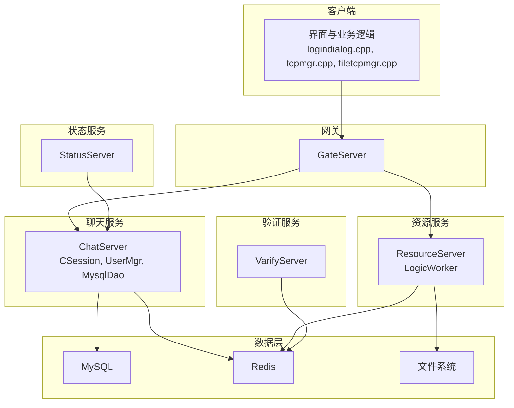
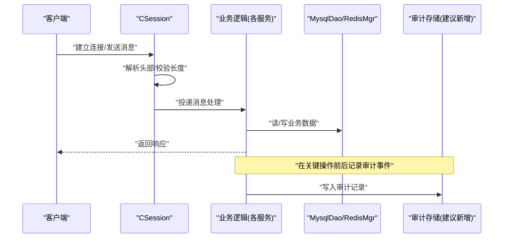
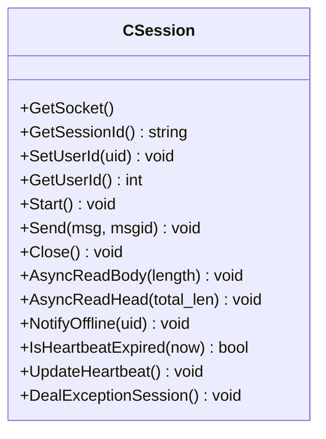
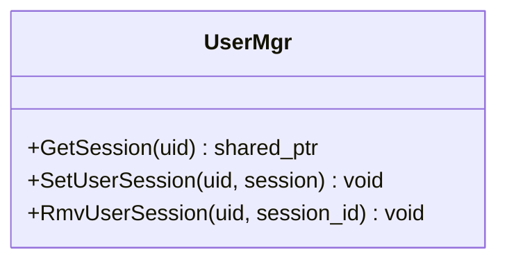
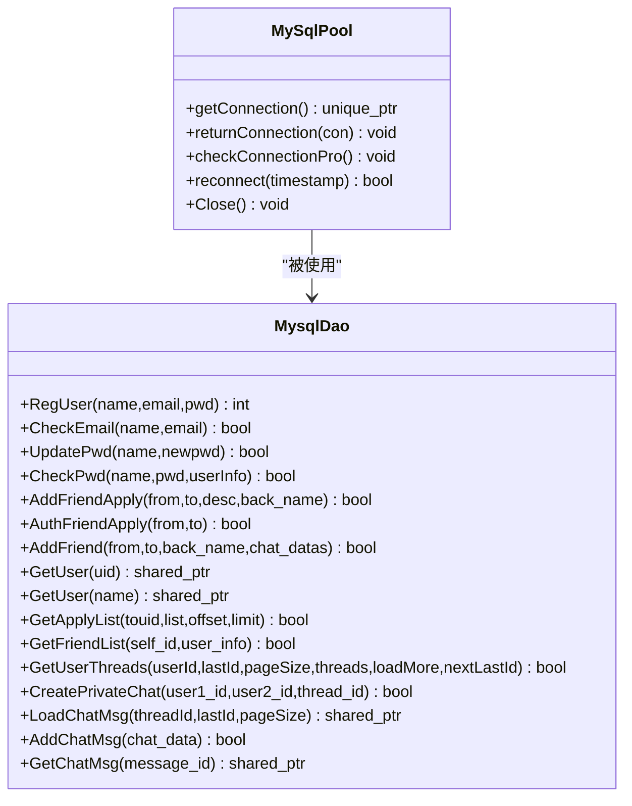
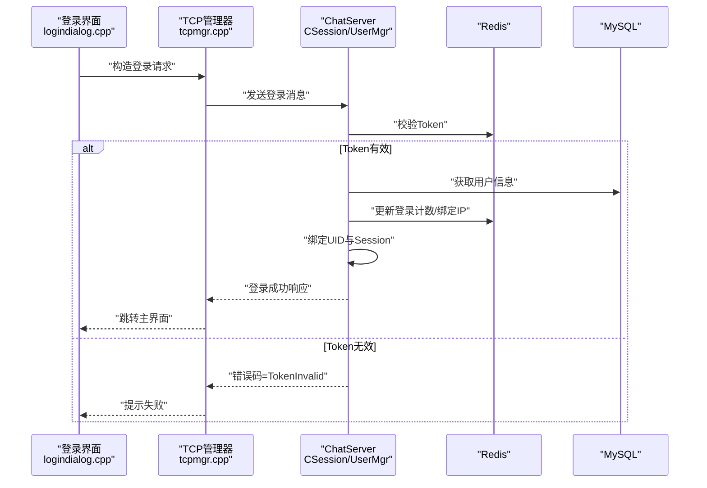
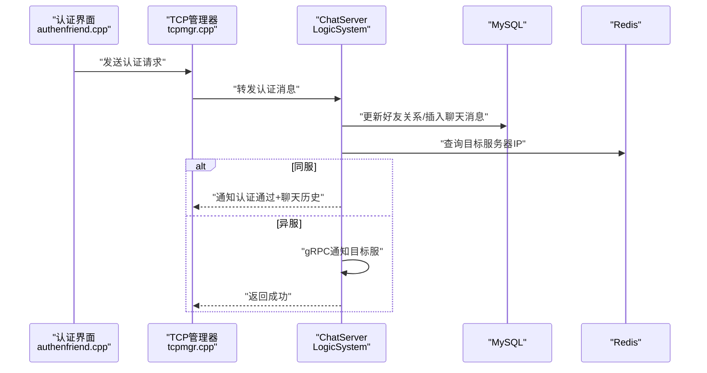
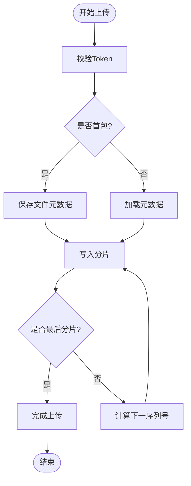
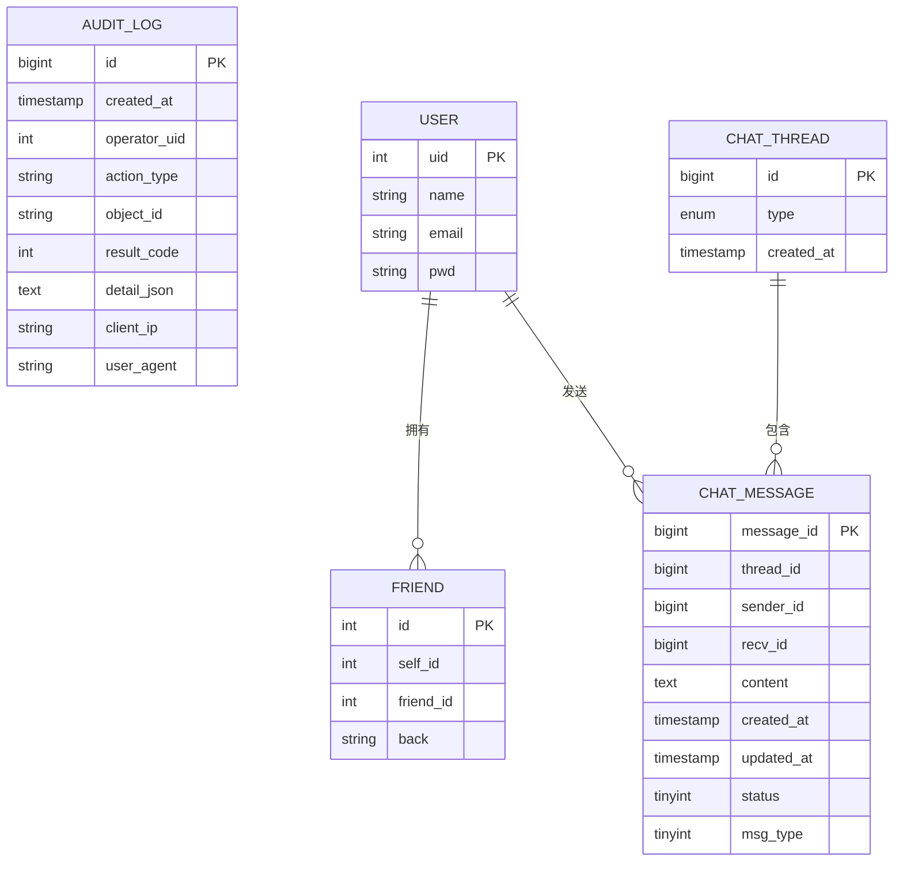
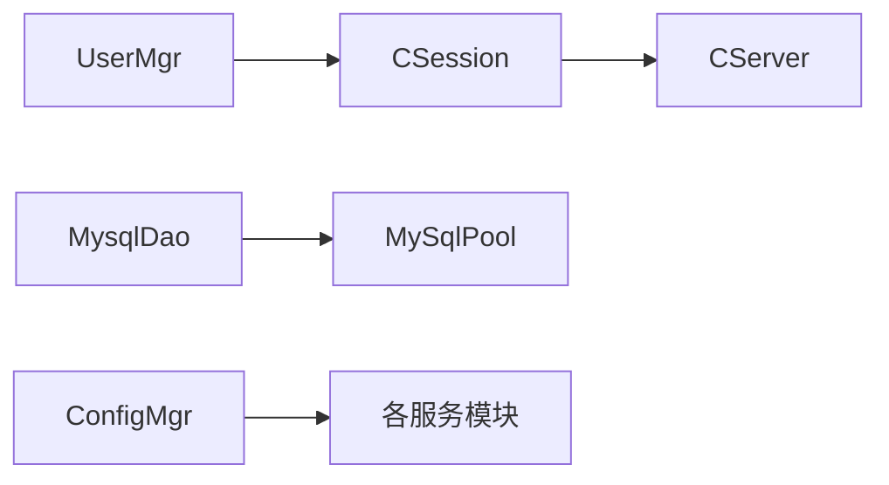

# 权限审计与日志

<cite>
**本文引用的文件**   
- [MysqlDao.h](file://server/ChatServer/include/MysqlDao.h)
- [UserMgr.h](file://server/ChatServer/include/UserMgr.h)
- [CSession.h](file://server/ChatServer/include/CSession.h)
- [const.h](file://server/ChatServer/include/const.h)
- [data.h](file://server/ChatServer/include/data.h)
- [ConfigMgr.h](file://server/ChatServer/include/ConfigMgr.h)
- [ConfigMgr.cpp](file://server/ChatServer/src/ConfigMgr.cpp)
- [UserMgr.cpp](file://server/ChatServer/src/UserMgr.cpp)
- [LogicWorker.cpp](file://server/ResourceServer/src/LogicWorker.cpp)
- [tcpmgr.cpp](file://client/llfcchat/src/tcpmgr.cpp)
- [filetcpmgr.cpp](file://client/llfcchat/src/filetcpmgr.cpp)
- [logindialog.cpp](file://client/llfcchat/src/logindialog.cpp)
- [authenfriend.cpp](file://client/llfcchat/src/authenfriend.cpp)
- [llfc.sql](file://sql备份/llfc.sql)
</cite>

## 目录
1. [简介](#简介)
2. [项目结构](#项目结构)
3. [核心组件](#核心组件)
4. [架构总览](#架构总览)
5. [详细组件分析](#详细组件分析)
6. [依赖关系分析](#依赖关系分析)
7. [性能考虑](#性能考虑)
8. [故障排查指南](#故障排查指南)
9. [结论](#结论)
10. [附录](#附录)

## 简介
本文件面向LLFCChat项目的权限审计与日志记录，目标是：
- 建立覆盖登录、认证、好友申请、聊天消息、文件传输等关键操作的访问审计机制
- 明确日志分类（访问日志、错误日志、安全日志）与存储策略
- 提供权限变更追踪（角色/权限/配置修改）的可追溯性方案
- 给出审计数据分析思路（访问模式、异常检测、告警）
- 提供审计配置示例与查询接口建议（脱敏、轮转、性能优化）

说明：当前代码库中未实现统一的审计与日志模块。本文基于现有会话、用户管理、数据库与配置组件，提出可落地的审计与日志设计方案，并标注对应源码位置以便后续集成。

## 项目结构
- 客户端（Qt/C++）：负责UI交互、网络通信、本地缓存与文件传输
- 服务端（多服务）：GateServer、ChatServer、ResourceServer、StatusServer、VarifyServer
- 数据层：MySQL持久化、Redis缓存、文件系统
- 配置：INI配置文件加载与管理

[本图为概念性结构图，不直接映射具体源码文件]

## 核心组件
- CSession：会话抽象，承载连接、心跳、读写、离线通知等能力，是审计的“入口”
- UserMgr：用户会话映射管理，用于踢人、在线状态维护，是审计的“主体”
- MysqlDao：数据库访问封装，包含连接池、健康检查、重连；适合承载审计写入
- const.h：错误码、消息ID、键前缀等常量定义，便于统一审计事件类型
- data.h：用户信息、聊天线程、消息等数据结构，为审计内容建模
- ConfigMgr：INI配置读取，支持运行时路径与开关控制

**章节来源**
- [CSession.h:1-86](file://server/ChatServer/include/CSession.h#L1-L86)
- [UserMgr.h:1-22](file://server/ChatServer/include/UserMgr.h#L1-L22)
- [MysqlDao.h:1-270](file://server/ChatServer/include/MysqlDao.h#L1-L270)
- [const.h:1-104](file://server/ChatServer/include/const.h#L1-L104)
- [data.h:1-65](file://server/ChatServer/include/data.h#L1-L65)
- [ConfigMgr.h:1-84](file://server/ChatServer/include/ConfigMgr.h#L1-L84)

## 架构总览
审计与日志的总体流程：
- 接入层：CSession接收请求，解析头部与消息体，投递到逻辑处理
- 业务层：根据MSG_IDS路由到具体处理器（登录、认证、聊天、文件等）
- 数据层：通过MysqlDao/RedisMgr进行持久化或缓存操作
- 审计层：在关键节点采集审计事件（谁、何时、何地、做了什么、结果如何），写入审计表或日志系统

[本图为概念性流程图，不直接映射具体源码文件]

## 详细组件分析

### 会话与会话生命周期（CSession）
- 职责：异步读写、心跳维护、异常处理、离线通知
- 审计切入点：
  - 连接建立/断开：记录IP、端口、SessionId、时间戳
  - 心跳过期/异常关闭：记录原因、持续时间
  - 绑定用户UID：记录UID与SessionId映射
- 风险点：粘包处理、长度校验失败需记录错误日志

**图表来源**
- [CSession.h:1-86](file://server/ChatServer/include/CSession.h#L1-L86)

**章节来源**
- [CSession.h:1-86](file://server/ChatServer/include/CSession.h#L1-L86)

### 用户会话管理（UserMgr）
- 职责：uid到session的映射、删除会话（踢人）、并发保护
- 审计切入点：
  - SetUserSession/RmvUserSession：记录操作者、目标uid、动作、结果
  - 跨服踢人：记录分布式锁获取/释放、冲突情况

**图表来源**
- [UserMgr.h:1-22](file://server/ChatServer/include/UserMgr.h#L1-L22)
- [UserMgr.cpp:1-49](file://server/ChatServer/src/UserMgr.cpp#L1-L49)

**章节来源**
- [UserMgr.h:1-22](file://server/ChatServer/include/UserMgr.h#L1-L22)
- [UserMgr.cpp:1-49](file://server/ChatServer/src/UserMgr.cpp#L1-L49)

### 数据库访问与连接池（MysqlDao）
- 职责：连接池管理、健康检查、自动重连、SQL封装
- 审计切入点：
  - 连接创建/销毁：记录池大小、失败次数
  - SQL执行：记录耗时、影响行数、错误码
  - 事务边界：记录开始/提交/回滚

**图表来源**
- [MysqlDao.h:1-270](file://server/ChatServer/include/MysqlDao.h#L1-L270)

**章节来源**
- [MysqlDao.h:1-270](file://server/ChatServer/include/MysqlDao.h#L1-L270)

### 常量与错误码（const.h）
- 作用：统一错误码、消息ID、Redis键前缀、锁参数等
- 审计用途：将错误码映射为可读的审计事件类型；用键前缀区分不同域的数据

**章节来源**
- [const.h:1-104](file://server/ChatServer/include/const.h#L1-L104)

### 数据模型（data.h）
- 作用：UserInfo、ApplyInfo、ChatThreadInfo、ChatMessage、PageResult等
- 审计用途：作为审计记录的字段来源，确保内容与业务一致

**章节来源**
- [data.h:1-65](file://server/ChatServer/include/data.h#L1-L65)

### 配置管理（ConfigMgr）
- 作用：读取INI配置，提供GetValue接口，初始化路径
- 审计用途：通过配置项控制审计开关、采样率、输出路径、轮转策略

**章节来源**
- [ConfigMgr.h:1-84](file://server/ChatServer/include/ConfigMgr.h#L1-L84)
- [ConfigMgr.cpp:1-30](file://server/ChatServer/src/ConfigMgr.cpp#L1-L30)

### 登录与认证流程（客户端与服务端）
- 客户端：logindialog发起登录请求，tcpmgr处理错误与响应
- 服务端：ChatServer校验Token、更新登录计数、绑定Session与UID
- 审计切入点：登录成功/失败、Token失效、异地登录、踢人

**图表来源**
- [logindialog.cpp:140-188](file://client/llfcchat/src/logindialog.cpp#L140-L188)
- [tcpmgr.cpp:63-729](file://client/llfcchat/src/tcpmgr.cpp#L63-L729)
- [const.h:1-104](file://server/ChatServer/include/const.h#L1-L104)

**章节来源**
- [logindialog.cpp:140-188](file://client/llfcchat/src/logindialog.cpp#L140-L188)
- [tcpmgr.cpp:63-729](file://client/llfcchat/src/tcpmgr.cpp#L63-L729)
- [const.h:1-104](file://server/ChatServer/include/const.h#L1-L104)

### 好友认证与聊天消息（客户端与服务端）
- 客户端：authenfriend发起认证请求，tcpmgr处理响应
- 服务端：LogicSystem处理认证、添加好友、同步聊天历史
- 审计切入点：认证请求/结果、好友关系变更、聊天消息收发

**图表来源**
- [authenfriend.cpp:407-442](file://client/llfcchat/src/authenfriend.cpp#L407-L442)
- [tcpmgr.cpp:63-729](file://client/llfcchat/src/tcpmgr.cpp#L63-L729)

**章节来源**
- [authenfriend.cpp:407-442](file://client/llfcchat/src/authenfriend.cpp#L407-L442)
- [tcpmgr.cpp:63-729](file://client/llfcchat/src/tcpmgr.cpp#L63-L729)

### 文件上传与下载（ResourceServer与客户端）
- ResourceServer：LogicWorker处理分片上传、断点续传、文件元数据管理
- 客户端：filetcpmgr处理进度、重试、完成回调
- 审计切入点：上传开始/结束、分片校验、失败重试、下载完成

**图表来源**
- [LogicWorker.cpp:101-139](file://server/ResourceServer/src/LogicWorker.cpp#L101-L139)
- [filetcpmgr.cpp:399-805](file://client/llfcchat/src/filetcpmgr.cpp#L399-L805)

**章节来源**
- [LogicWorker.cpp:101-139](file://server/ResourceServer/src/LogicWorker.cpp#L101-L139)
- [filetcpmgr.cpp:399-805](file://client/llfcchat/src/filetcpmgr.cpp#L399-L805)

### 数据库表结构与审计扩展
- 现有表：chat_message、chat_thread、friend等
- 建议新增审计表：audit_log（操作时间、操作者UID、操作类型、对象ID、结果、详情JSON、IP、UA等）

[本图为概念性ER图，不直接映射具体源码文件]

**章节来源**
- [llfc.sql:1-200](file://sql备份/llfc.sql#L1-L200)

## 依赖关系分析
- CSession依赖Boost.Asio进行网络IO，依赖CServer进行会话管理
- UserMgr依赖CSession，维护uid到session的映射
- MysqlDao依赖MySqlPool，管理连接池与健康检查
- 配置由ConfigMgr统一读取，供各模块使用

**图表来源**
- [CSession.h:1-86](file://server/ChatServer/include/CSession.h#L1-L86)
- [UserMgr.h:1-22](file://server/ChatServer/include/UserMgr.h#L1-L22)
- [MysqlDao.h:1-270](file://server/ChatServer/include/MysqlDao.h#L1-L270)
- [ConfigMgr.h:1-84](file://server/ChatServer/include/ConfigMgr.h#L1-L84)

**章节来源**
- [CSession.h:1-86](file://server/ChatServer/include/CSession.h#L1-L86)
- [UserMgr.h:1-22](file://server/ChatServer/include/UserMgr.h#L1-L22)
- [MysqlDao.h:1-270](file://server/ChatServer/include/MysqlDao.h#L1-L270)
- [ConfigMgr.h:1-84](file://server/ChatServer/include/ConfigMgr.h#L1-L84)

## 性能考虑
- 审计写入采用异步队列与批量提交，避免阻塞主流程
- 高吞吐场景下启用采样策略（如仅记录错误与关键操作）
- 使用索引优化审计查询（按时间、UID、操作类型）
- 日志轮转与压缩，降低磁盘占用
- 敏感字段脱敏（密码、Token、邮箱等）

[本节为通用指导，不直接分析具体文件]

## 故障排查指南
- 连接异常：检查CSession的AsyncReadBody错误分支，关注错误码与关闭逻辑
- 粘包问题：参考开发文档中的粘包处理最佳实践，确保buffer与stream状态正确
- 数据库连接：观察MysqlPool的健康检查与重连日志，确认连接池大小与超时设置
- 登录失败：核对Token校验、Redis键前缀、错误码映射

**章节来源**
- [CSession.h:1-86](file://server/ChatServer/include/CSession.h#L1-L86)
- [MysqlDao.h:1-270](file://server/ChatServer/include/MysqlDao.h#L1-L270)
- [const.h:1-104](file://server/ChatServer/include/const.h#L1-L104)

## 结论
当前代码库已具备会话、用户管理、数据库与配置等基础能力，但尚未实现统一的审计与日志模块。建议在以下关键点集成审计：
- 会话生命周期（连接、心跳、断开）
- 登录与认证（成功/失败、Token失效、异地登录）
- 好友关系变更（申请、认证、删除）
- 聊天消息（发送、接收、状态变化）
- 文件传输（上传/下载、分片、失败重试）
通过异步写入、采样策略、脱敏与轮转，可在不影响性能的前提下实现完整的审计与日志体系。

[本节为总结性内容，不直接分析具体文件]

## 附录

### 审计事件分类与样例
- 访问日志：连接建立、消息收发、页面访问
- 错误日志：网络异常、解析失败、数据库错误
- 安全日志：登录失败、Token失效、越权访问、配置修改

### 审计配置示例（INI）
- audit_enabled=true/false
- audit_sample_rate=0.1~1.0
- audit_output_path=/var/log/audit
- audit_rotate_size_mb=100
- audit_rotate_keep_days=30
- audit_mask_fields=password,token,email

### 审计查询接口建议
- 按时间范围查询：GET /api/audit?start=&end=
- 按UID查询：GET /api/audit?uid=&action=
- 按错误码查询：GET /api/audit?code=
- 导出CSV：GET /api/audit/export?format=csv

[本节为通用建议，不直接分析具体文件]