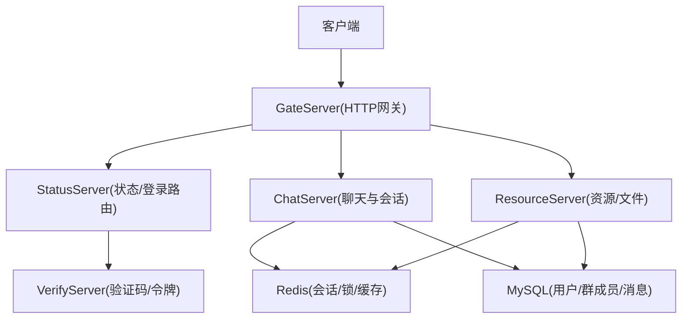
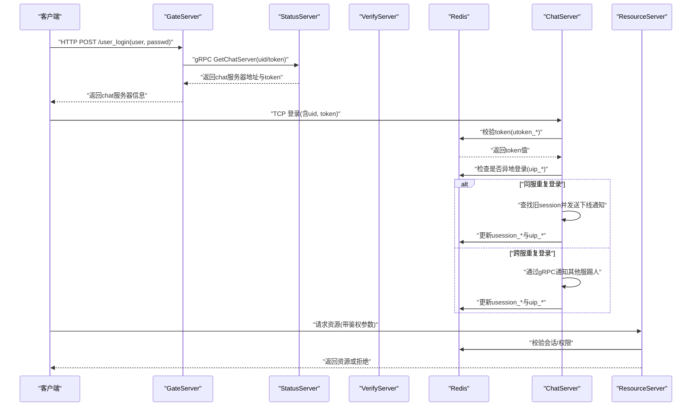
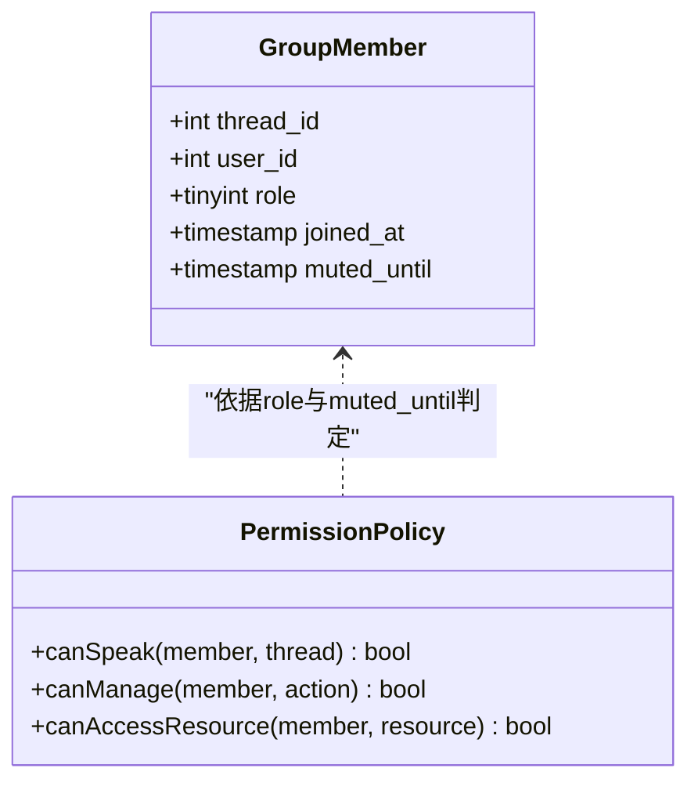
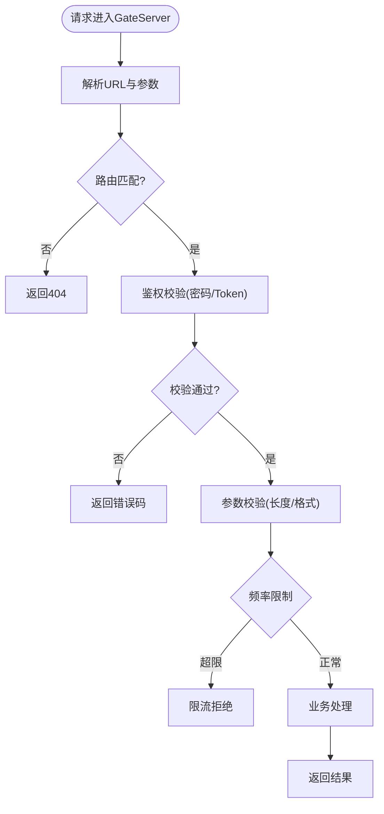
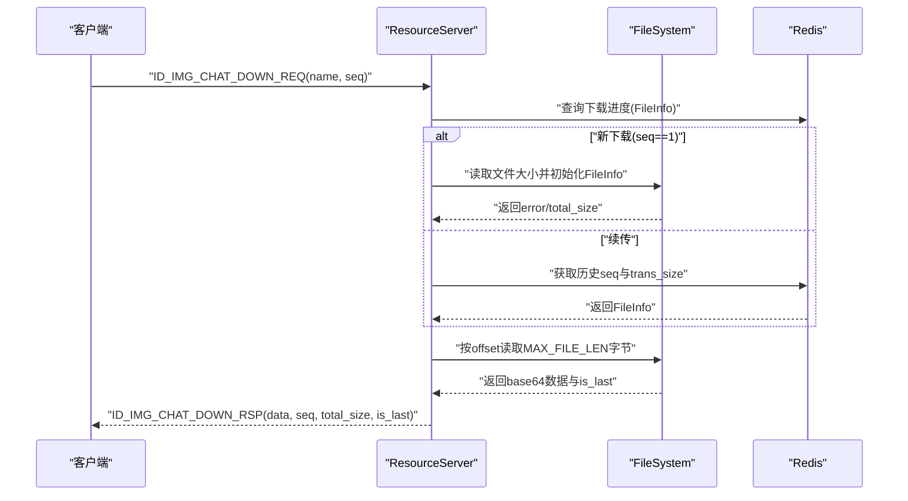
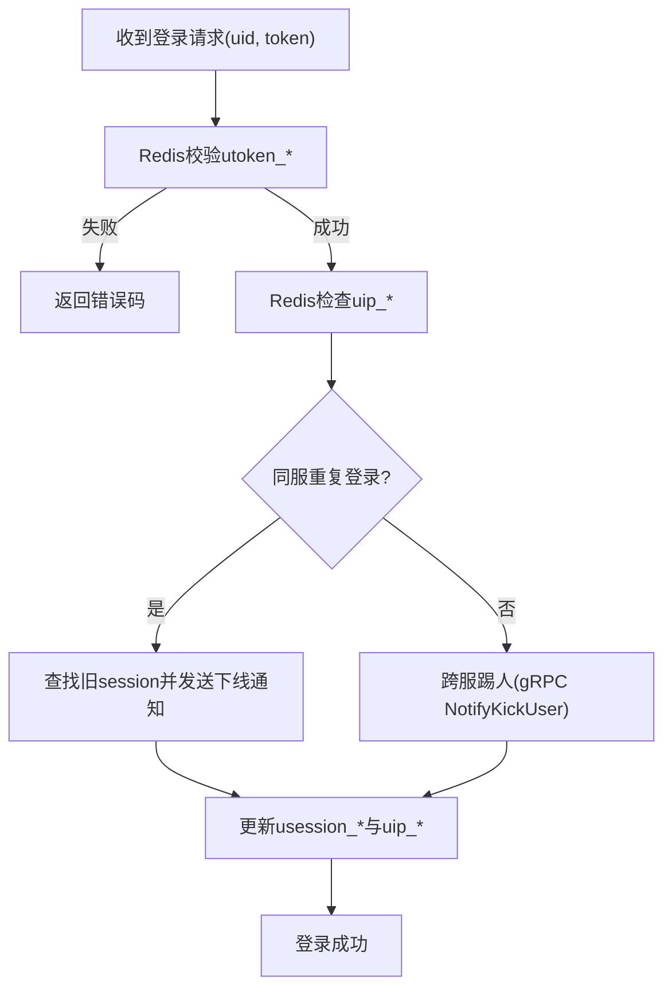
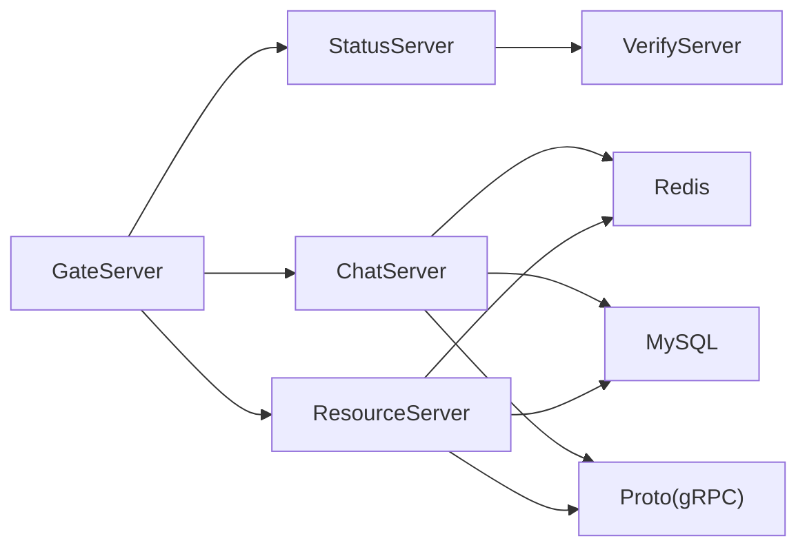

# 访问控制机制

<cite>
**本文引用的文件**   
- [server/GateServer/include/HttpConnection.h](file://server/GateServer/include/HttpConnection.h)
- [server/GateServer/src/HttpConnection.cpp](file://server/GateServer/src/HttpConnection.cpp)
- [server/ChatServer/include/CSession.h](file://server/ChatServer/include/CSession.h)
- [server/ChatServer/src/CSession.cpp](file://server/ChatServer/src/CSession.cpp)
- [server/ChatServer/include/UserMgr.h](file://server/ChatServer/include/UserMgr.h)
- [server/ChatServer/src/UserMgr.cpp](file://server/ChatServer/src/UserMgr.cpp)
- [server/ResourceServer/include/UserMgr.h](file://server/ResourceServer/include/UserMgr.h)
- [server/ResourceServer/src/UserMgr.cpp](file://server/ResourceServer/src/UserMgr.cpp)
- [server/ResourceServer/include/const.h](file://server/ResourceServer/include/const.h)
- [server/proto/chat/message.proto](file://server/proto/chat/message.proto)
- [server/proto/control/message.proto](file://server/proto/control/message.proto)
- [server/proto/resource/message.proto](file://server/proto/resource/message.proto)
- [server/VarifyServer/message.proto](file://server/VarifyServer/message.proto)
- [开发文档/day33单服程踢人逻辑.md](file://开发文档/day33单服程踢人逻辑.md)
- [开发文档/day29-好友认证和聊天通信.md](file://开发文档/day29-好友认证和聊天通信.md)
- [开发文档/day41-通知客户端异步下载聊天图片.md](file://开发文档/day41-通知客户端异步下载聊天图片.md)
- [sql备份/llfc.sql](file://sql备份/llfc.sql)
</cite>

## 目录
1. [简介](#简介)
2. [项目结构](#项目结构)
3. [核心组件](#核心组件)
4. [架构总览](#架构总览)
5. [详细组件分析](#详细组件分析)
6. [依赖关系分析](#依赖关系分析)
7. [性能考虑](#性能考虑)
8. [故障排查指南](#故障排查指南)
9. [结论](#结论)
10. [附录](#附录)

## 简介
本文件面向 LLFCChat 项目的访问控制机制，围绕 RBAC 角色权限、API 网关鉴权与限流、资源细粒度访问控制、会话级权限控制（在线状态、踢人）、以及审计日志等维度进行系统化说明。内容基于仓库中现有实现与开发文档，结合协议定义与数据库结构，给出可落地的策略设计与最佳实践建议。

## 项目结构
LLFCChat 采用多服务架构：GateServer 作为 HTTP 网关，ChatServer 负责即时消息与会话管理，ResourceServer 提供文件与图片等资源访问能力，StatusServer/VerifyServer 提供状态与验证码等辅助能力。各服务通过 gRPC 与 Redis/MySQL 协作完成鉴权、会话与资源访问控制。

**图示来源** 
- [server/GateServer/src/HttpConnection.cpp:132-194](file://server/GateServer/src/HttpConnection.cpp#L132-L194)
- [server/ChatServer/src/CSession.cpp:133-194](file://server/ChatServer/src/CSession.cpp#L133-L194)
- [server/ResourceServer/include/const.h:97-116](file://server/ResourceServer/include/const.h#L97-L116)
- [server/proto/chat/message.proto:158-166](file://server/proto/chat/message.proto#L158-L166)

**章节来源**
- [server/GateServer/src/HttpConnection.cpp:132-194](file://server/GateServer/src/HttpConnection.cpp#L132-L194)
- [server/ChatServer/src/CSession.cpp:133-194](file://server/ChatServer/src/CSession.cpp#L133-L194)
- [server/ResourceServer/include/const.h:97-116](file://server/ResourceServer/include/const.h#L97-L116)
- [server/proto/chat/message.proto:158-166](file://server/proto/chat/message.proto#L158-L166)

## 核心组件
- 网关鉴权与路由：GateServer 的 HttpConnection 解析请求并转发至 LogicSystem，统一处理 GET/POST 路由与响应。
- 会话与心跳：ChatServer 的 CSession 维护连接生命周期、心跳检测、异常清理与离线通知。
- 用户会话映射：UserMgr 在 ChatServer/ResourceServer 中维护 uid 到 session 的映射，支持踢人与跨服一致性。
- 分布式锁与键空间：Redis 用于分布式锁、用户 IP 绑定、Token 存储、会话 ID 绑定等。
- 协议与 RPC：proto 定义了聊天、控制、资源等接口，包括踢人、文本/图片消息、认证通知等。
- 数据模型：SQL 中包含群成员表 group_chat_member，具备 role 字段（普通成员/管理员/创建者）与 muted_until 禁言时间。

**章节来源**
- [server/GateServer/include/HttpConnection.h:1-36](file://server/GateServer/include/HttpConnection.h#L1-L36)
- [server/ChatServer/include/CSession.h:1-86](file://server/ChatServer/include/CSession.h#L1-L86)
- [server/ChatServer/include/UserMgr.h:1-22](file://server/ChatServer/include/UserMgr.h#L1-L22)
- [server/ResourceServer/include/UserMgr.h:1-22](file://server/ResourceServer/include/UserMgr.h#L1-L22)
- [server/ResourceServer/include/const.h:97-116](file://server/ResourceServer/include/const.h#L97-L116)
- [server/proto/chat/message.proto:158-166](file://server/proto/chat/message.proto#L158-L166)
- [sql备份/llfc.sql:386-409](file://sql备份/llfc.sql#L386-L409)

## 架构总览
下图展示从客户端登录到进入聊天室的核心鉴权与访问控制流程，涵盖 Token 校验、会话绑定、踢人保护与资源访问授权。

**图示来源** 
- [server/GateServer/src/HttpConnection.cpp:132-194](file://server/GateServer/src/HttpConnection.cpp#L132-L194)
- [server/VarifyServer/message.proto:1-44](file://server/VarifyServer/message.proto#L1-L44)
- [server/ChatServer/src/CSession.cpp:253-336](file://server/ChatServer/src/CSession.cpp#L253-L336)
- [server/ResourceServer/include/const.h:97-116](file://server/ResourceServer/include/const.h#L97-L116)

## 详细组件分析

### RBAC 角色权限模型
- 角色定义：群成员表 group_chat_member 包含 role 字段，取值 0=普通成员、1=管理员、2=创建者；muted_until 表示禁言截止时间。
- 权限分配：在加入群聊时写入 member 记录，role 由创建者或管理员授予；禁言通过设置 muted_until 生效。
- 继承关系：创建者拥有最高权限，管理员次之，普通成员最低；管理员可执行创建者的部分管理操作（如踢人、禁言）。
- 权限校验点：
  - 群内发言：需 thread_id 存在且 user_id 为成员；若 muted_until 未过期则禁止发言。
  - 管理操作：仅允许 role>=管理员 的用户执行（踢人、禁言、修改成员角色等）。
  - 资源访问：群内图片/文件下载需验证 thread_id 与 user_id 的归属关系。

**图示来源** 
- [sql备份/llfc.sql:386-409](file://sql备份/llfc.sql#L386-L409)

**章节来源**
- [sql备份/llfc.sql:386-409](file://sql备份/llfc.sql#L386-L409)

### API 访问控制（网关鉴权、参数验证、频率限制）
- 网关入口：GateServer 的 HttpConnection 统一解析 GET/POST，调用 LogicSystem 路由处理。
- 鉴权策略：
  - 登录接口：GateServer 先校验密码，再调用 StatusServer 获取 chat 服务器与 token，返回客户端。
  - Token 校验：ChatServer 登录时从 Redis 读取 utoken_* 校验 token 有效性。
- 参数验证：
  - 客户端侧对用户名、邮箱、密码长度与字符集进行正则校验。
  - 服务端侧对 msg_id/msg_len 合法性进行检查，防止非法包导致内存越界。
- 频率限制：
  - 当前代码未实现显式限流器，建议在 GateServer 层引入基于 Redis 的滑动窗口计数器，按 IP/UID 维度限制请求速率。
  - 针对验证码、重置密码等敏感接口应加强限流与验证码校验。

**图示来源** 
- [server/GateServer/src/HttpConnection.cpp:132-194](file://server/GateServer/src/HttpConnection.cpp#L132-L194)
- [开发文档/day14-登录功能.md:1-58](file://开发文档/day14-登录功能.md#L1-L58)
- [server/ChatServer/src/CSession.cpp:133-194](file://server/ChatServer/src/CSession.cpp#L133-L194)

**章节来源**
- [server/GateServer/src/HttpConnection.cpp:132-194](file://server/GateServer/src/HttpConnection.cpp#L132-L194)
- [server/ChatServer/src/CSession.cpp:133-194](file://server/ChatServer/src/CSession.cpp#L133-L194)
- [开发文档/day14-登录功能.md:1-58](file://开发文档/day14-登录功能.md#L1-L58)

### 资源访问控制（文件、聊天室成员、消息发送）
- 文件访问：
  - ResourceServer 提供下载/上传接口，客户端携带文件名与序列号 seq，服务端校验文件存在性与权限。
  - 断点续传：Redis 保存下载进度（name -> FileInfo），确保 seq 一致性与偏移量正确。
- 聊天室成员控制：
  - 通过 group_chat_member 表维护成员与角色，发言前校验 thread_id 与 user_id 的归属。
  - 禁言：若 muted_until 未过期，禁止发送消息。
- 消息发送权限：
  - 文本消息：校验 fromuid/touid/thread_id 合法性，必要时检查双方是否为好友或群成员。
  - 图片消息：NotifyChatImgReq 包含 message_id、file_name、total_size、thread_id，接收端根据权限决定是否接受。

**图示来源** 
- [开发文档/day41-通知客户端异步下载聊天图片.md:571-709](file://开发文档/day41-通知客户端异步下载聊天图片.md#L571-L709)
- [server/proto/resource/message.proto:138-165](file://server/proto/resource/message.proto#L138-L165)

**章节来源**
- [server/proto/resource/message.proto:138-165](file://server/proto/resource/message.proto#L138-L165)
- [开发文档/day41-通知客户端异步下载聊天图片.md:571-709](file://开发文档/day41-通知客户端异步下载聊天图片.md#L571-L709)

### 会话访问控制（用户状态、在线检查、踢人机制）
- 用户状态验证：
  - ChatServer 登录时校验 Redis 中的 utoken_*，失败返回错误码。
  - 使用 uip_* 记录用户当前登录的服务器名，避免重复登录冲突。
- 在线状态检查：
  - CSession 维护 _last_heartbeat，超过阈值视为心跳过期，触发异常清理。
- 踢人机制：
  - 同服重复登录：查找旧 session，发送 ID_NOTIFY_OFF_LINE_REQ 通知客户端下线并关闭连接。
  - 跨服重复登录：通过 gRPC NotifyKickUser 通知目标服务器踢出旧连接。
  - 分布式锁：以 lock_* 键加锁，确保踢人操作的原子性。

**图示来源** 
- [开发文档/day33单服程踢人逻辑.md:241-383](file://开发文档/day33单服程踢人逻辑.md#L241-L383)
- [server/proto/control/message.proto:126-142](file://server/proto/control/message.proto#L126-L142)
- [server/ChatServer/src/CSession.cpp:304-336](file://server/ChatServer/src/CSession.cpp#L304-L336)

**章节来源**
- [开发文档/day33单服程踢人逻辑.md:241-383](file://开发文档/day33单服程踢人逻辑.md#L241-L383)
- [server/proto/control/message.proto:126-142](file://server/proto/control/message.proto#L126-L142)
- [server/ChatServer/src/CSession.cpp:304-336](file://server/ChatServer/src/CSession.cpp#L304-L336)

### 权限配置示例与代码实现要点
- 角色与权限配置：
  - 在 group_chat_member 表中插入成员记录，设置 role 与 muted_until。
  - 管理员/创建者可调用管理接口修改成员角色或禁言。
- 网关鉴权配置：
  - GateServer 路由 /user_login 与 /reset_pwd 等接口需开启参数校验与验证码校验。
  - 建议增加基于 Redis 的限流规则（如 per-minute 计数）。
- 会话与资源访问：
  - ChatServer 登录流程必须校验 token 与 ip 绑定。
  - ResourceServer 下载接口需校验 name 与 seq 的一致性，并持久化进度到 Redis。

**章节来源**
- [sql备份/llfc.sql:386-409](file://sql备份/llfc.sql#L386-L409)
- [server/GateServer/src/HttpConnection.cpp:132-194](file://server/GateServer/src/HttpConnection.cpp#L132-L194)
- [server/ChatServer/src/CSession.cpp:304-336](file://server/ChatServer/src/CSession.cpp#L304-L336)
- [server/proto/resource/message.proto:138-165](file://server/proto/resource/message.proto#L138-L165)

### 权限审计与日志记录
- 关键事件日志：
  - 登录成功/失败、踢人操作、资源下载/上传、禁言/解禁等。
  - 建议在 LogicSystem 与 FileWorker 中输出结构化日志（JSON），包含 uid、action、result、timestamp。
- 审计存储：
  - 将审计日志写入独立表 audit_log，便于后续分析与合规审查。
- 监控告警：
  - 对高频失败登录、异常踢人、大文件下载等进行监控与告警。

[本节为通用指导，不直接分析具体文件]

## 依赖关系分析
- GateServer 依赖 StatusServer 获取聊天服务器信息与 token。
- ChatServer 依赖 Redis 进行 Token/IP/Session 管理与分布式锁。
- ResourceServer 依赖 Redis 与文件系统实现断点续传与权限校验。
- 所有服务通过 proto 定义的 gRPC 接口进行跨服务通信。

**图示来源** 
- [server/proto/chat/message.proto:158-166](file://server/proto/chat/message.proto#L158-L166)
- [server/proto/control/message.proto:126-142](file://server/proto/control/message.proto#L126-L142)
- [server/proto/resource/message.proto:138-165](file://server/proto/resource/message.proto#L138-L165)

**章节来源**
- [server/proto/chat/message.proto:158-166](file://server/proto/chat/message.proto#L158-L166)
- [server/proto/control/message.proto:126-142](file://server/proto/control/message.proto#L126-L142)
- [server/proto/resource/message.proto:138-165](file://server/proto/resource/message.proto#L138-L165)

## 性能考虑
- 会话队列与心跳：
  - CSession 发送队列上限 MAX_SENDQUE，避免内存溢出。
  - 心跳超时阈值 20s，及时清理僵尸连接。
- 分布式锁：
  - 使用 Redis SET NX EX 实现锁，Lua 脚本保证原子解锁。
- 文件传输：
  - 分块大小 MAX_FILE_LEN，减少单次 IO 压力；Redis 持久化进度，支持断点续传。
- 限流建议：
  - 在 GateServer 引入 Redis 计数器，按 IP/UID 维度限制请求频率。

**章节来源**
- [server/ChatServer/src/CSession.cpp:46-78](file://server/ChatServer/src/CSession.cpp#L46-L78)
- [server/ChatServer/src/CSession.cpp:288-302](file://server/ChatServer/src/CSession.cpp#L288-L302)
- [server/ResourceServer/include/const.h:113-116](file://server/ResourceServer/include/const.h#L113-L116)

## 故障排查指南
- 登录失败：
  - 检查 Redis 中 utoken_* 是否存在且匹配。
  - 确认 uip_* 指向的服务器是否正确。
- 踢人无效：
  - 检查分布式锁 lock_* 是否被正确释放。
  - 确认 NotifyKickUser 是否成功调用目标服务器。
- 资源下载失败：
  - 检查 Redis 中 FileInfo 的 seq 与 trans_size 是否一致。
  - 确认文件路径与权限是否正确。

**章节来源**
- [server/ChatServer/src/CSession.cpp:304-336](file://server/ChatServer/src/CSession.cpp#L304-L336)
- [server/proto/control/message.proto:126-142](file://server/proto/control/message.proto#L126-L142)
- [开发文档/day41-通知客户端异步下载聊天图片.md:571-709](file://开发文档/day41-通知客户端异步下载聊天图片.md#L571-L709)

## 结论
LLFCChat 的访问控制机制以网关鉴权、会话管理、RBAC 角色与资源权限为核心，结合 Redis 分布式锁与 gRPC 跨服务通信，实现了较为完整的身份认证、会话安全与资源访问控制。未来可在网关层增强限流与审计日志，进一步提升系统的安全性与可观测性。

## 附录
- 相关协议与服务接口请参考 proto 文件与开发文档。
- 数据库表结构与样例数据请参考 sql 备份文件。