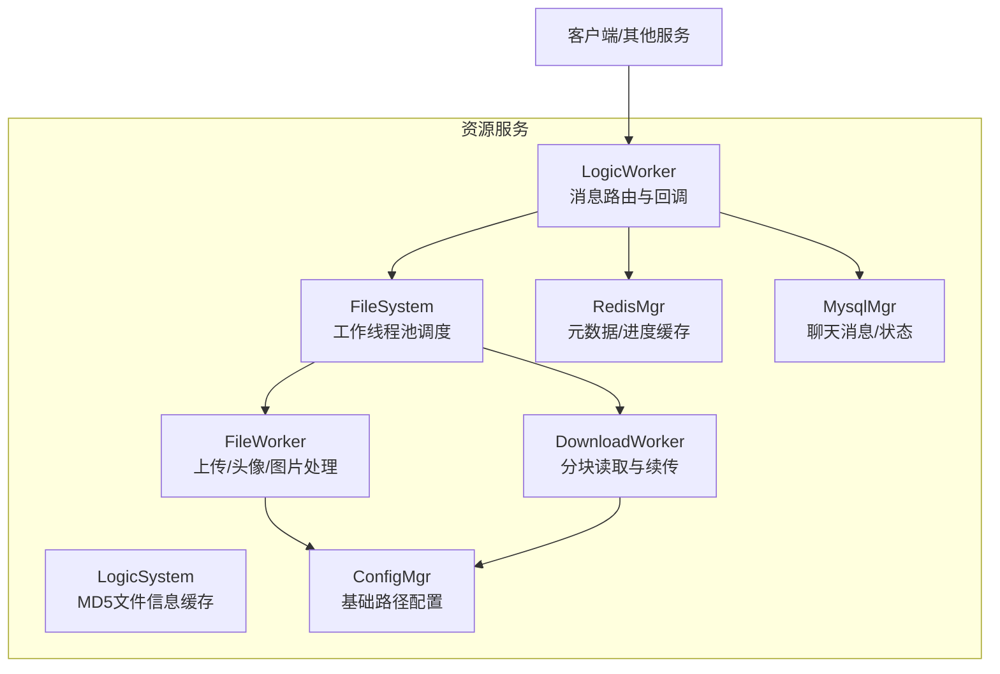
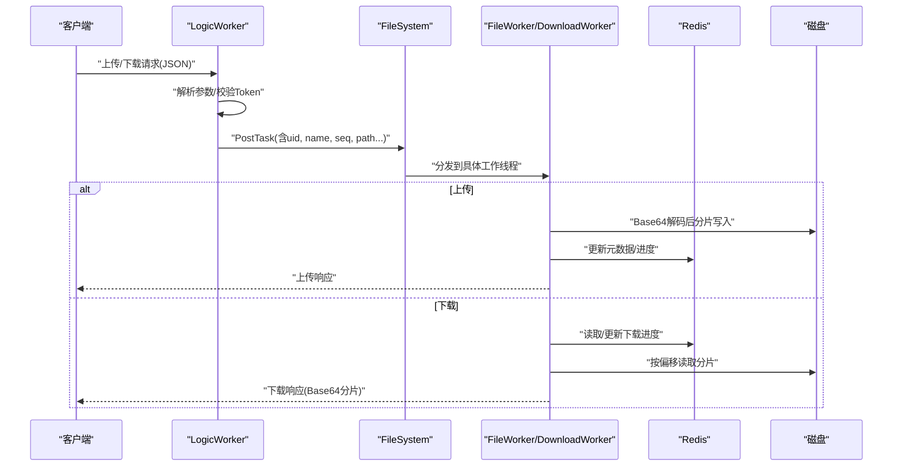
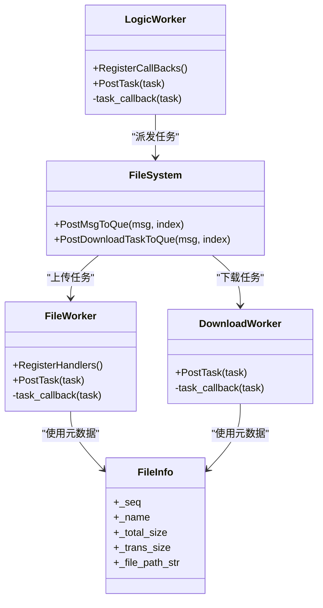
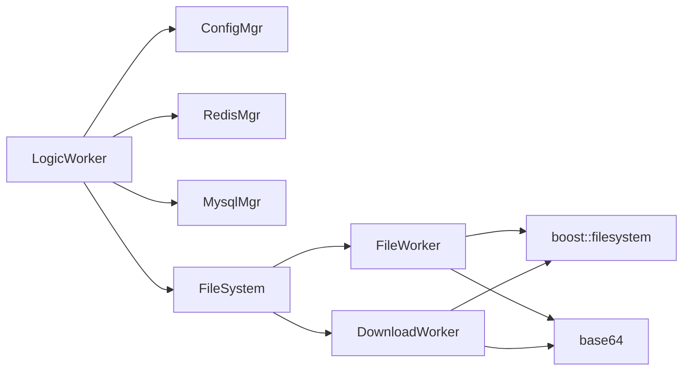

# 文件访问控制

<cite>
**本文引用的文件**   
- [FileSystem.h](file://server/ResourceServer/include/FileSystem.h)
- [FileSystem.cpp](file://server/ResourceServer/src/FileSystem.cpp)
- [FileWorker.h](file://server/ResourceServer/include/FileWorker.h)
- [FileWorker.cpp](file://server/ResourceServer/src/FileWorker.cpp)
- [FileInfo.h](file://server/ResourceServer/include/FileInfo.h)
- [LogicSystem.h](file://server/ResourceServer/include/LogicSystem.h)
- [LogicSystem.cpp](file://server/ResourceServer/src/LogicSystem.cpp)
- [LogicWorker.h](file://server/ResourceServer/include/LogicWorker.h)
- [LogicWorker.cpp](file://server/ResourceServer/src/LogicWorker.cpp)
- [const.h](file://server/ResourceServer/include/const.h)
</cite>

## 目录
1. [简介](#简介)
2. [项目结构](#项目结构)
3. [核心组件](#核心组件)
4. [架构总览](#架构总览)
5. [详细组件分析](#详细组件分析)
6. [依赖关系分析](#依赖关系分析)
7. [性能考量](#性能考量)
8. [故障排查指南](#故障排查指南)
9. [结论](#结论)
10. [附录](#附录)

## 简介
本文件访问控制文档聚焦于LLFCChat的资源服务器（ResourceServer）中文件上传、下载与同步的权限验证、存储路径控制、大小与类型校验、细粒度操作权限以及异常处理与日志记录策略。文档基于代码实现进行说明，涵盖用户身份认证、文件所有者检查、跨用户访问限制、目录隔离、路径遍历防护、断点续传、错误码与恢复机制等关键安全能力。

## 项目结构
资源服务器的文件访问相关逻辑主要分布在以下模块：
- 逻辑路由与回调注册：LogicWorker、LogicSystem
- 文件工作线程与队列：FileWorker、DownloadWorker
- 文件系统调度器：FileSystem
- 数据模型与常量：FileInfo、const.h
- 配置与持久化：ConfigMgr、RedisMgr、MysqlMgr（在逻辑层调用）

图表来源
- [LogicWorker.cpp:78-372](file://server/ResourceServer/src/LogicWorker.cpp#L78-L372)
- [FileSystem.cpp:19-28](file://server/ResourceServer/src/FileSystem.cpp#L19-L28)
- [FileWorker.cpp:49-458](file://server/ResourceServer/src/FileWorker.cpp#L49-L458)
- [FileWorker.cpp:518-663](file://server/ResourceServer/src/FileWorker.cpp#L518-L663)
- [LogicSystem.cpp:26-39](file://server/ResourceServer/src/LogicSystem.cpp#L26-L39)

章节来源
- [FileSystem.h:1-21](file://server/ResourceServer/include/FileSystem.h#L1-L21)
- [FileSystem.cpp:1-29](file://server/ResourceServer/src/FileSystem.cpp#L1-L29)
- [FileWorker.h:1-90](file://server/ResourceServer/include/FileWorker.h#L1-L90)
- [FileWorker.cpp:1-663](file://server/ResourceServer/src/FileWorker.cpp#L1-L663)
- [FileInfo.h:1-26](file://server/ResourceServer/include/FileInfo.h#L1-L26)
- [LogicSystem.h:1-34](file://server/ResourceServer/include/LogicSystem.h#L1-L34)
- [LogicSystem.cpp:1-46](file://server/ResourceServer/src/LogicSystem.cpp#L1-L46)
- [LogicWorker.h:1-38](file://server/ResourceServer/include/LogicWorker.h#L1-L38)
- [LogicWorker.cpp:1-765](file://server/ResourceServer/src/LogicWorker.cpp#L1-L765)
- [const.h:1-117](file://server/ResourceServer/include/const.h#L1-L117)

## 核心组件
- LogicWorker：负责解析请求、鉴权校验（Token）、构造目标路径、选择工作线程、将任务投递到文件系统或下载队列，并返回响应。
- FileWorker：处理上传类任务（普通文件、头像、聊天图片、信息同步、续传），包括Base64解码、目录创建、分片写入、状态更新与通知。
- DownloadWorker：处理下载类任务，支持断点续传，按序列号从指定偏移读取分片，维护Redis中的下载进度。
- FileSystem：单例调度器，维护上传与下载两类工作线程池，按哈希分发任务。
- FileInfo：描述文件元数据（名称、总大小、已传输大小、路径）。
- const.h：定义错误码、消息ID、最大分片大小、前缀常量等。

章节来源
- [LogicWorker.cpp:78-372](file://server/ResourceServer/src/LogicWorker.cpp#L78-L372)
- [FileWorker.cpp:49-458](file://server/ResourceServer/src/FileWorker.cpp#L49-L458)
- [FileWorker.cpp:518-663](file://server/ResourceServer/src/FileWorker.cpp#L518-L663)
- [FileSystem.cpp:19-28](file://server/ResourceServer/src/FileSystem.cpp#L19-L28)
- [FileInfo.h:1-26](file://server/ResourceServer/include/FileInfo.h#L1-L26)
- [const.h:1-117](file://server/ResourceServer/include/const.h#L1-L117)

## 架构总览
资源服务器采用“逻辑路由 + 工作线程池”的分层架构：
- 接入层（LogicWorker）：统一解析JSON、鉴权、参数校验、路径构造、任务派发。
- 执行层（FileWorker/DownloadWorker）：异步处理IO密集型任务，保证并发与吞吐。
- 调度层（FileSystem）：维护多实例工作线程，按文件名哈希均衡负载。
- 存储层（磁盘 + Redis + MySQL）：文件落盘、元数据与进度缓存、聊天消息与状态持久化。

图表来源
- [LogicWorker.cpp:78-372](file://server/ResourceServer/src/LogicWorker.cpp#L78-L372)
- [FileWorker.cpp:49-458](file://server/ResourceServer/src/FileWorker.cpp#L49-L458)
- [FileWorker.cpp:518-663](file://server/ResourceServer/src/FileWorker.cpp#L518-L663)
- [FileSystem.cpp:19-28](file://server/ResourceServer/src/FileSystem.cpp#L19-L28)

## 详细组件分析

### 身份认证与访问控制
- Token校验：在首次包（seq==1）时，从Redis获取对应uid的token并与请求token比对，失败则返回UidInvalid或TokenInvalid。
- 会话绑定：通过uid与token绑定当前会话，防止未登录或越权访问。
- 跨用户限制：所有文件路径均基于uid构建（如{base}/{uid}/{name}），天然实现用户隔离；下载路径强制使用sender_id或uid，避免跨用户读取。

章节来源
- [LogicWorker.cpp:234-254](file://server/ResourceServer/src/LogicWorker.cpp#L234-L254)
- [LogicWorker.cpp:339-359](file://server/ResourceServer/src/LogicWorker.cpp#L339-L359)
- [LogicWorker.cpp:720-741](file://server/ResourceServer/src/LogicWorker.cpp#L720-L741)
- [const.h:97-101](file://server/ResourceServer/include/const.h#L97-L101)

### 存储路径控制与目录隔离
- 用户隔离：路径由ConfigMgr的基础输出路径 + uid目录 + 文件名组成，确保不同用户文件互不可见。
- 目录权限：写入前检查目录存在性，不存在则尝试创建；创建失败返回CreateFilePathFailed。
- 路径遍历防护：仅使用filename作为最终文件名，不拼接任意上层路径；路径构造严格遵循{base}/{uid}/{name}模式。

章节来源
- [LogicWorker.cpp:90-95](file://server/ResourceServer/src/LogicWorker.cpp#L90-L95)
- [LogicWorker.cpp:215-216](file://server/ResourceServer/src/LogicWorker.cpp#L215-L216)
- [LogicWorker.cpp:325-326](file://server/ResourceServer/src/LogicWorker.cpp#L325-L326)
- [FileWorker.cpp:59-74](file://server/ResourceServer/src/FileWorker.cpp#L59-L74)
- [FileWorker.cpp:123-138](file://server/ResourceServer/src/FileWorker.cpp#L123-L138)
- [FileWorker.cpp:207-222](file://server/ResourceServer/src/FileWorker.cpp#L207-L222)
- [FileWorker.cpp:294-309](file://server/ResourceServer/src/FileWorker.cpp#L294-L309)
- [FileWorker.cpp:380-395](file://server/ResourceServer/src/FileWorker.cpp#L380-L395)

### 文件大小限制与类型验证
- 分片大小：MAX_FILE_LEN定义了单次读取/写入的最大字节数，用于断点续传与网络传输分片。
- 类型白名单：当前实现未对扩展名或MIME做白名单校验；建议在上层增加类型校验与恶意内容检测（如病毒扫描、格式合法性检查）。
- 大小限制：未在代码中设置全局最大文件大小阈值；建议在业务层根据场景限制单个文件上限。

章节来源
- [const.h:114](file://server/ResourceServer/include/const.h#L114)
- [FileWorker.cpp:616-617](file://server/ResourceServer/src/FileWorker.cpp#L616-L617)

### 文件操作权限控制
- 上传权限：需有效uid与token，且具备写权限；写入失败返回FileWritePermissionFailed。
- 下载权限：需有效uid与token，且具备读权限；文件不存在返回FileNotExists，读取失败返回FileReadPermissionFailed。
- 删除/修改权限：当前实现未提供删除接口；修改可通过覆盖同名文件实现，但缺乏显式权限校验，建议补充。

章节来源
- [FileWorker.cpp:89-102](file://server/ResourceServer/src/FileWorker.cpp#L89-L102)
- [FileWorker.cpp:153-166](file://server/ResourceServer/src/FileWorker.cpp#L153-L166)
- [FileWorker.cpp:237-250](file://server/ResourceServer/src/FileWorker.cpp#L237-L250)
- [FileWorker.cpp:324-337](file://server/ResourceServer/src/FileWorker.cpp#L324-L337)
- [FileWorker.cpp:410-423](file://server/ResourceServer/src/FileWorker.cpp#L410-L423)
- [FileWorker.cpp:540-553](file://server/ResourceServer/src/FileWorker.cpp#L540-L553)

### 断点续传与进度管理
- 上传续传：通过seq与trans_size维护进度，首个包初始化元数据，后续包更新进度；失败可重试。
- 下载续传：Redis保存total_size、trans_size、seq；下载端携带seq请求分片，服务端计算offset并读取；完成时清理进度。
- 一致性校验：下载续传会校验seq是否匹配，不匹配返回FileSeqInvalid；偏移量越界返回FileOffsetInvalid。

章节来源
- [FileWorker.cpp:557-600](file://server/ResourceServer/src/FileWorker.cpp#L557-L600)
- [FileWorker.cpp:602-656](file://server/ResourceServer/src/FileWorker.cpp#L602-L656)
- [const.h:23-25](file://server/ResourceServer/include/const.h#L23-L25)

### 聊天图片与消息联动
- 上传完成后更新数据库上传状态，并通过Redis查询接收者在线IP，经gRPC通知ChatServer推送消息。
- 下载信息同步：根据message_id查询聊天消息，定位发送者uid与文件名，返回总大小等信息供客户端发起下载。

章节来源
- [FileWorker.cpp:255-277](file://server/ResourceServer/src/FileWorker.cpp#L255-L277)
- [FileWorker.cpp:342-363](file://server/ResourceServer/src/FileWorker.cpp#L342-L363)
- [FileWorker.cpp:428-446](file://server/ResourceServer/src/FileWorker.cpp#L428-L446)
- [LogicWorker.cpp:649-682](file://server/ResourceServer/src/LogicWorker.cpp#L649-L682)

### 错误码与异常处理
- 常见错误码：Json解析错误、RPC失败、验证码过期/错误、用户存在/密码错误、Token无效、文件不存在/读写失败、Redis读写失败、偏移/序列无效等。
- 异常恢复：上传失败可重发分片；下载失败可基于Redis进度继续；Redis过期导致续传失败时需回退全量或重新建立进度。

章节来源
- [const.h:5-29](file://server/ResourceServer/include/const.h#L5-L29)
- [FileWorker.cpp:69-74](file://server/ResourceServer/src/FileWorker.cpp#L69-L74)
- [FileWorker.cpp:540-553](file://server/ResourceServer/src/FileWorker.cpp#L540-L553)
- [FileWorker.cpp:577-594](file://server/ResourceServer/src/FileWorker.cpp#L577-L594)

### 类与职责关系图

图表来源
- [LogicWorker.h:1-38](file://server/ResourceServer/include/LogicWorker.h#L1-L38)
- [FileSystem.h:1-21](file://server/ResourceServer/include/FileSystem.h#L1-L21)
- [FileWorker.h:1-90](file://server/ResourceServer/include/FileWorker.h#L1-L90)
- [FileInfo.h:1-26](file://server/ResourceServer/include/FileInfo.h#L1-L26)

## 依赖关系分析
- LogicWorker依赖：
  - ConfigMgr：获取基础文件输出路径
  - RedisMgr：Token校验、文件元数据与进度缓存
  - MysqlMgr：聊天消息查询与状态更新
  - FileSystem：任务分发
- FileWorker/DownloadWorker依赖：
  - boost::filesystem：路径与文件操作
  - base64：编解码
  - RedisMgr/MysqlMgr：元数据与状态
- 常量与错误码集中定义于const.h，便于统一管理与扩展。

图表来源
- [LogicWorker.cpp:78-372](file://server/ResourceServer/src/LogicWorker.cpp#L78-L372)
- [FileWorker.cpp:49-458](file://server/ResourceServer/src/FileWorker.cpp#L49-L458)
- [FileWorker.cpp:518-663](file://server/ResourceServer/src/FileWorker.cpp#L518-L663)
- [const.h:1-117](file://server/ResourceServer/include/const.h#L1-L117)

章节来源
- [LogicWorker.cpp:1-765](file://server/ResourceServer/src/LogicWorker.cpp#L1-L765)
- [FileWorker.cpp:1-663](file://server/ResourceServer/src/FileWorker.cpp#L1-L663)
- [FileSystem.cpp:1-29](file://server/ResourceServer/src/FileSystem.cpp#L1-L29)
- [const.h:1-117](file://server/ResourceServer/include/const.h#L1-L117)

## 性能考量
- 并发模型：上传与下载分别使用独立的工作线程池，降低阻塞风险。
- 负载均衡：按文件名哈希选择工作线程，提升热点文件的局部性与稳定性。
- I/O优化：分片读写减少内存占用，Base64编解码在worker内完成，避免主线程阻塞。
- 缓存策略：Redis用于元数据与进度缓存，降低磁盘与DB压力。
- 建议：
  - 调整FILE_WORKER_COUNT与DOWN_LOAD_WORKER_COUNT以匹配CPU核数与I/O能力
  - 监控Redis命中率与超时策略，避免频繁重建进度
  - 引入异步日志与指标上报，便于容量规划与瓶颈定位

[本节为通用指导，无需引用具体文件]

## 故障排查指南
- 常见问题与定位：
  - 上传失败（写权限不足）：检查目录创建与文件句柄打开结果，确认系统权限与路径正确性
  - 下载失败（文件不存在/读取失败）：核对文件路径与uid隔离是否正确，检查Redis进度是否存在
  - 续传失败（序列号/偏移无效）：校验客户端seq与服务端Redis记录的一致性，必要时重置进度
  - Token无效：确认登录流程是否正确生成并缓存token，检查键名前缀与过期时间
- 日志与恢复：
  - 关键路径打印错误信息与错误码，便于快速定位
  - 下载失败时可基于Redis进度重试；上传失败可重发分片
  - 建议完善结构化日志（包含uid、name、seq、error_code、timestamp）

章节来源
- [FileWorker.cpp:69-74](file://server/ResourceServer/src/FileWorker.cpp#L69-L74)
- [FileWorker.cpp:540-553](file://server/ResourceServer/src/FileWorker.cpp#L540-L553)
- [FileWorker.cpp:577-594](file://server/ResourceServer/src/FileWorker.cpp#L577-L594)
- [const.h:5-29](file://server/ResourceServer/include/const.h#L5-L29)

## 结论
资源服务器的文件访问控制在当前实现中已具备：
- 基于Token的身份认证与会话绑定
- 基于uid的用户隔离存储与路径构造
- 分片上传/下载与Redis驱动的断点续传
- 明确的错误码体系与部分异常恢复能力
建议进一步增强：
- 文件类型白名单与恶意内容检测
- 统一的文件大小上限策略
- 删除/修改操作的细粒度权限控制
- 更完善的审计日志与监控告警

[本节为总结性内容，无需引用具体文件]

## 附录
- 配置项参考（来自常量定义）：
  - MAX_FILE_LEN：单次分片最大字节数
  - FILE_WORKER_COUNT/DOWN_LOAD_WORKER_COUNT：工作线程数量
  - USERIPPREFIX/USERTOKENPREFIX/USER_BASE_INFO：Redis键前缀
  - ErrorCodes：错误码枚举
- 典型流程参考：
  - 上传流程：LogicWorker解析→Redis元数据→FileSystem分发→FileWorker写入→状态更新→通知
  - 下载流程：LogicWorker鉴权→FileSystem分发→DownloadWorker读取→Base64编码→返回分片

章节来源
- [const.h:1-117](file://server/ResourceServer/include/const.h#L1-L117)
- [LogicWorker.cpp:78-372](file://server/ResourceServer/src/LogicWorker.cpp#L78-L372)
- [FileWorker.cpp:49-458](file://server/ResourceServer/src/FileWorker.cpp#L49-L458)
- [FileWorker.cpp:518-663](file://server/ResourceServer/src/FileWorker.cpp#L518-L663)