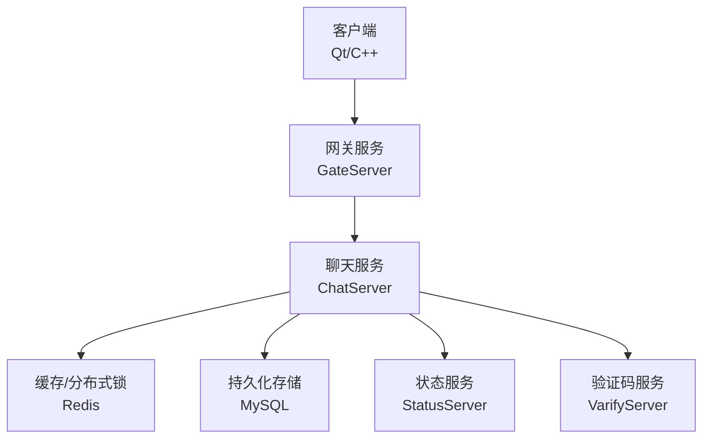
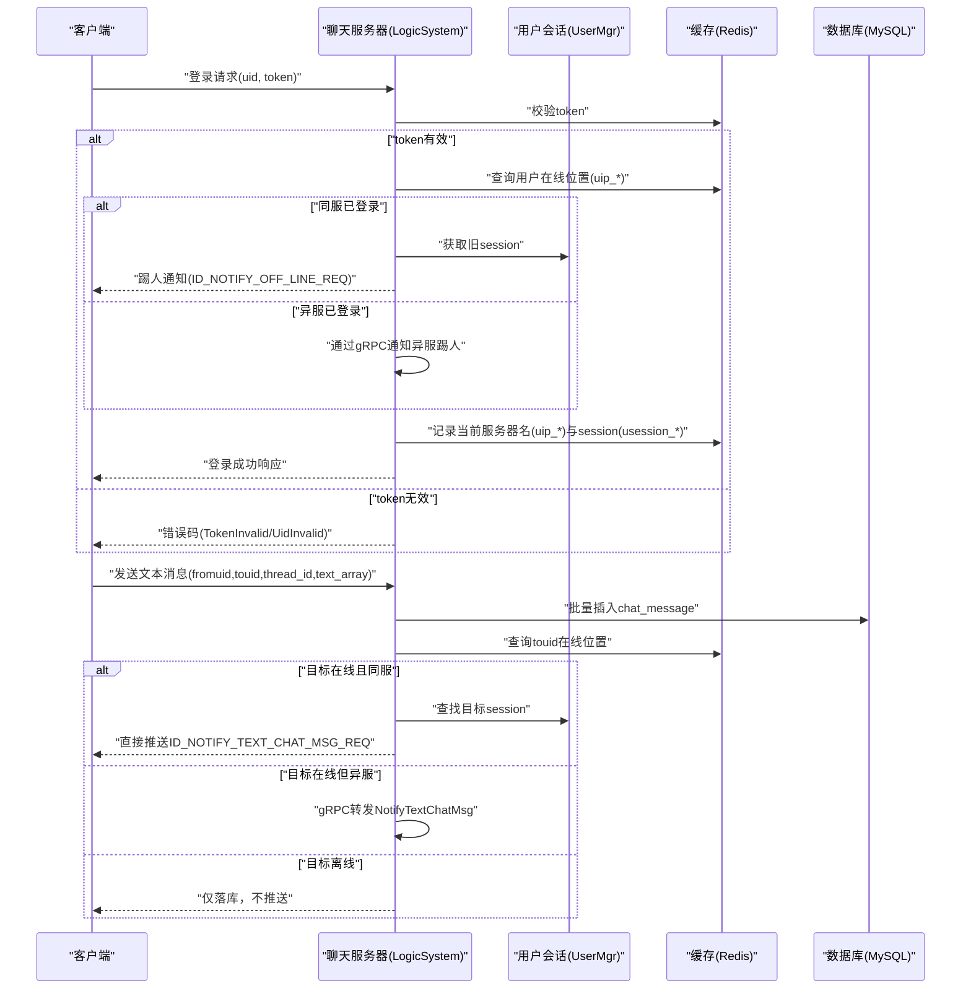
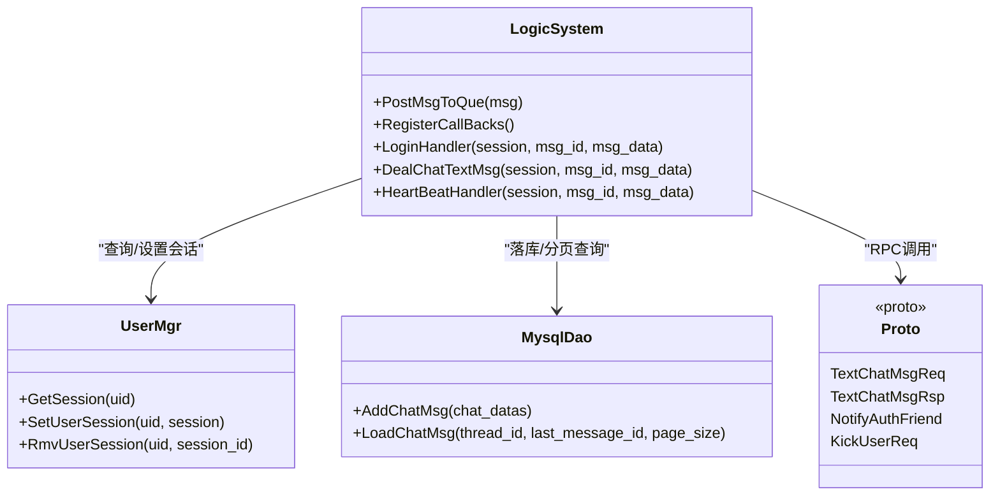

# 消息访问控制

<cite>
**本文引用的文件**   
- [LogicSystem.h](file://server/ChatServer/include/LogicSystem.h)
- [LogicSystem.cpp](file://server/ChatServer/src/LogicSystem.cpp)
- [UserMgr.h](file://server/ChatServer/include/UserMgr.h)
- [UserMgr.cpp](file://server/ChatServer/src/UserMgr.cpp)
- [const.h](file://server/ChatServer/include/const.h)
- [data.h](file://server/ChatServer/include/data.h)
- [message.proto](file://server/proto/chat/message.proto)
- [MysqlDao.cpp](file://server/ChatServer/src/MysqlDao.cpp)
- [tcpmgr.cpp](file://client/llfcchat/src/tcpmgr.cpp)
- [logindialog.cpp](file://client/llfcchat/src/logindialog.cpp)
- [day35心跳逻辑.md](file://开发文档/day35心跳逻辑.md)
- [day37-聊天信息存储方案.md](file://开发文档/day37-聊天信息存储方案.md)
</cite>

## 目录
1. [简介](#简介)
2. [项目结构](#项目结构)
3. [核心组件](#核心组件)
4. [架构总览](#架构总览)
5. [详细组件分析](#详细组件分析)
6. [依赖关系分析](#依赖关系分析)
7. [性能考量](#性能考量)
8. [故障排查指南](#故障排查指南)
9. [结论](#结论)
10. [附录](#附录)

## 简介
本文件面向LLFCChat项目的“消息访问控制”主题，系统性阐述发送权限、接收权限、内容安全、历史数据访问以及审计与异常处理等关键机制。基于现有代码实现，重点覆盖：
- 私聊权限验证（好友关系校验）
- 群聊成员检查（当前未实现，预留扩展点）
- 系统消息广播（当前未实现，预留扩展点）
- 在线状态检查与消息路由（Redis+内存会话映射）
- 黑名单过滤（当前未实现，预留扩展点）
- 敏感词过滤与内容审核（当前未实现，预留扩展点）
- 加密传输（当前未实现，预留扩展点）
- 聊天记录分页查询与时间范围限制（游标分页）
- 完整的安全消息传递流程与异常处理策略（含踢人、心跳、分布式锁）

## 项目结构
本项目采用多服务架构：客户端（Qt/C++）、聊天服务器（ChatServer）、网关（GateServer）、资源服务器（ResourceServer）、状态服务器（StatusServer）、验证码服务（VarifyServer）。消息访问控制主要涉及ChatServer的会话管理、业务逻辑分发、数据库与缓存交互，以及与客户端的协议定义。

[无图表来源，因为该图为概念性架构图]

## 核心组件
- 会话与用户管理
  - UserMgr：维护uid到CSession的映射，支持设置、获取、删除会话，用于在线状态判断与消息路由。
- 业务逻辑与消息路由
  - LogicSystem：注册并分发各类消息处理器（登录、搜索、好友申请、认证、文本消息、心跳、线程加载、私聊创建、消息加载、图片消息等），内部使用队列与条件变量进行异步处理。
- 常量与错误码
  - const.h：定义错误码、消息ID、Redis键前缀、分布式锁参数、消息状态等。
- 数据结构
  - data.h：定义UserInfo、ApplyInfo、ChatThreadInfo、ChatMessage、PageResult、ChatMsgType等。
- 协议定义
  - message.proto：定义聊天相关RPC接口与消息体，如TextChatMsgReq/Rsp、NotifyAuthFriend等。
- 数据访问层
  - MysqlDao：提供好友申请、好友建立、聊天消息插入、分页查询等SQL操作。
- 客户端网络模块
  - tcpmgr.cpp：解析服务器返回的JSON，构造本地消息对象并触发UI更新。
  - logindialog.cpp：登录界面输入校验与发起TCP连接。

**章节来源**
- [LogicSystem.h:1-61](file://server/ChatServer/include/LogicSystem.h#L1-L61)
- [LogicSystem.cpp:1-115](file://server/ChatServer/src/LogicSystem.cpp#L1-L115)
- [UserMgr.h:1-22](file://server/ChatServer/include/UserMgr.h#L1-L22)
- [UserMgr.cpp:1-50](file://server/ChatServer/src/UserMgr.cpp#L1-L50)
- [const.h:1-104](file://server/ChatServer/include/const.h#L1-L104)
- [data.h:1-65](file://server/ChatServer/include/data.h#L1-L65)
- [message.proto:95-166](file://server/proto/chat/message.proto#L95-L166)
- [MysqlDao.cpp:1-200](file://server/ChatServer/src/MysqlDao.cpp#L1-L200)
- [tcpmgr.cpp:335-367](file://client/llfcchat/src/tcpmgr.cpp#L335-L367)
- [logindialog.cpp:96-188](file://client/llfcchat/src/logindialog.cpp#L96-L188)

## 架构总览
下图展示消息从客户端到服务器的处理路径，包括登录鉴权、消息路由、在线检测、跨服通知与落库。

**图表来源**
- [LogicSystem.cpp:116-254](file://server/ChatServer/src/LogicSystem.cpp#L116-L254)
- [LogicSystem.cpp:480-576](file://server/ChatServer/src/LogicSystem.cpp#L480-L576)
- [UserMgr.cpp:10-44](file://server/ChatServer/src/UserMgr.cpp#L10-L44)
- [const.h:49-79](file://server/ChatServer/include/const.h#L49-L79)
- [message.proto:107-127](file://server/proto/chat/message.proto#L107-L127)

## 详细组件分析

### 发送权限控制
- 私聊权限验证
  - 文本消息处理中，服务器会先落库再根据目标在线情况推送。实际的好友关系校验在“好友认证通过后创建私聊线程”的流程中进行，确保只有成为好友的用户才能建立私聊线程并互发消息。
  - 参考实现路径：
    - 文本消息处理：[LogicSystem.cpp:480-576](file://server/ChatServer/src/LogicSystem.cpp#L480-L576)
    - 好友认证与私聊线程创建：[day37-聊天信息存储方案.md:1785-1900](file://开发文档/day37-聊天信息存储方案.md#L1785-L1900)
- 群聊成员检查
  - 当前代码未实现群聊功能，可在ChatMessage.msg_type与ChatThreadInfo.type字段基础上扩展群聊类型与成员表，并在消息处理前增加成员校验。
- 系统消息广播
  - 当前未实现系统广播。可新增系统消息类型与广播路由逻辑，按用户标签或全量推送。

**章节来源**
- [LogicSystem.cpp:480-576](file://server/ChatServer/src/LogicSystem.cpp#L480-L576)
- [data.h:33-51](file://server/ChatServer/include/data.h#L33-L51)
- [day37-聊天信息存储方案.md:1785-1900](file://开发文档/day37-聊天信息存储方案.md#L1785-L1900)

### 接收权限管理
- 在线状态检查与消息路由
  - 服务器通过Redis键uip_*记录用户所在服务器名称，usession_*记录会话ID；UserMgr维护uid到session的内存映射。消息推送时先查Redis定位目标，若同服则直接推送，否则通过gRPC转发。
  - 参考实现路径：
    - 在线位置查询与推送分支：[LogicSystem.cpp:537-576](file://server/ChatServer/src/LogicSystem.cpp#L537-L576)
    - 用户会话管理：[UserMgr.cpp:10-44](file://server/ChatServer/src/UserMgr.cpp#L10-L44)
    - 键前缀定义：[const.h:81-88](file://server/ChatServer/include/const.h#L81-L88)
- 黑名单过滤
  - 当前未实现。可在消息入队前增加黑名单检查，命中则拒绝并记录审计日志。
- 消息路由控制
  - 当前为点对点路由。可扩展为按群组、频道或角色路由。

**章节来源**
- [LogicSystem.cpp:537-576](file://server/ChatServer/src/LogicSystem.cpp#L537-L576)
- [UserMgr.cpp:10-44](file://server/ChatServer/src/UserMgr.cpp#L10-L44)
- [const.h:81-88](file://server/ChatServer/include/const.h#L81-L88)

### 消息内容安全控制
- 敏感词过滤与内容审核
  - 当前未在消息处理链路中集成敏感词过滤或内容审核。建议在DealChatTextMsg中增加内容清洗与审核回调，失败则拒绝并返回错误码。
- 消息加密传输
  - 当前未启用端到端加密。建议在上层接入TLS或应用层加解密，保证传输安全。
- 输入校验
  - 客户端对邮箱、密码等进行正则校验，减少非法输入进入服务端。
  - 参考实现路径：
    - 客户端输入校验：[logindialog.cpp:131-166](file://client/llfcchat/src/logindialog.cpp#L131-L166)

**章节来源**
- [LogicSystem.cpp:480-514](file://server/ChatServer/src/LogicSystem.cpp#L480-L514)
- [logindialog.cpp:131-166](file://client/llfcchat/src/logindialog.cpp#L131-L166)

### 消息历史访问权限
- 聊天记录查询权限
  - 通过LoadChatMsg接口按thread_id与last_message_id游标分页查询，避免全量拉取，提升性能。
  - 参考实现路径：
    - 分页查询SQL与结果封装：[MysqlDao.cpp:883-925](file://server/ChatServer/src/MysqlDao.cpp#L883-L925)
    - 分页查询函数：[day37-聊天信息存储方案.md:2714-2778](file://开发文档/day37-聊天信息存储方案.md#L2714-L2778)
- 时间范围限制
  - 当前未实现时间范围过滤。可在SQL中增加created_at范围条件，结合前端时间选择器实现。
- 分页访问控制
  - 使用next_cursor（最后一条message_id）作为游标，load_more标志指示是否还有更多数据。

**章节来源**
- [MysqlDao.cpp:883-925](file://server/ChatServer/src/MysqlDao.cpp#L883-L925)
- [day37-聊天信息存储方案.md:2714-2778](file://开发文档/day37-聊天信息存储方案.md#L2714-L2778)

### 完整安全消息传递流程与异常处理
- 登录与踢人
  - 登录时校验token，若同服已有会话则踢人；异服则通过gRPC通知踢人。
  - 参考实现路径：
    - 登录处理与踢人逻辑：[LogicSystem.cpp:116-254](file://server/ChatServer/src/LogicSystem.cpp#L116-L254)
    - gRPC踢人接口：[message.proto:129-136](file://server/proto/chat/message.proto#L129-L136)
- 心跳与过期检测
  - 客户端定时发送心跳，服务器定期扫描会话，超过阈值关闭连接并清理Redis中的会话与IP映射。
  - 参考实现路径：
    - 心跳处理：[LogicSystem.cpp:578-587](file://server/ChatServer/src/LogicSystem.cpp#L578-L587)
    - 心跳过期判断与清理：[day35心跳逻辑.md:418-444](file://开发文档/day35心跳逻辑.md#L418-L444)
- 分布式锁与会话一致性
  - 登录与清理会话时使用Redis分布式锁，防止并发冲突。
  - 参考实现路径：
    - 分布式锁常量：[const.h:91-94](file://server/ChatServer/include/const.h#L91-L94)
    - 读取失败时的锁与清理：[day33单服程踢人逻辑.md:397-460](file://开发文档/day33单服程踢人逻辑.md#L397-L460)
- 错误码与审计日志
  - 统一错误码定义，便于客户端识别与提示；建议在关键路径输出审计日志（登录、消息收发、踢人、异常）。
  - 参考实现路径：
    - 错误码定义：[const.h:5-20](file://server/ChatServer/include/const.h#L5-L20)

**章节来源**
- [LogicSystem.cpp:116-254](file://server/ChatServer/src/LogicSystem.cpp#L116-L254)
- [message.proto:129-136](file://server/proto/chat/message.proto#L129-L136)
- [LogicSystem.cpp:578-587](file://server/ChatServer/src/LogicSystem.cpp#L578-L587)
- [day35心跳逻辑.md:418-444](file://开发文档/day35心跳逻辑.md#L418-L444)
- [const.h:91-94](file://server/ChatServer/include/const.h#L91-L94)
- [day33单服程踢人逻辑.md:397-460](file://开发文档/day33单服程踢人逻辑.md#L397-L460)
- [const.h:5-20](file://server/ChatServer/include/const.h#L5-L20)

## 依赖关系分析
- 组件耦合与内聚
  - LogicSystem高内聚于消息处理，依赖UserMgr、RedisMgr、MysqlMgr、ChatGrpcClient等。
  - UserMgr低耦合，仅维护会话映射。
- 外部依赖
  - Redis：在线位置、分布式锁、缓存用户基础信息。
  - MySQL：持久化好友关系、聊天消息、线程信息。
  - gRPC：跨服务通知（踢人、认证通过、文本消息）。
- 潜在循环依赖
  - 当前未发现循环依赖。注意后续扩展时保持单向依赖。

**图表来源**
- [LogicSystem.h:1-61](file://server/ChatServer/include/LogicSystem.h#L1-L61)
- [UserMgr.h:1-22](file://server/ChatServer/include/UserMgr.h#L1-L22)
- [MysqlDao.cpp:883-925](file://server/ChatServer/src/MysqlDao.cpp#L883-L925)
- [message.proto:107-166](file://server/proto/chat/message.proto#L107-L166)

**章节来源**
- [LogicSystem.cpp:1-115](file://server/ChatServer/src/LogicSystem.cpp#L1-L115)
- [UserMgr.cpp:1-50](file://server/ChatServer/src/UserMgr.cpp#L1-L50)
- [MysqlDao.cpp:883-925](file://server/ChatServer/src/MysqlDao.cpp#L883-L925)
- [message.proto:107-166](file://server/proto/chat/message.proto#L107-L166)

## 性能考量
- 消息落库与推送分离：先落库后推送，避免丢失；推送失败不影响落库。
- 游标分页：使用message_id作为游标，避免OFFSET带来的性能问题。
- Redis缓存：用户基础信息与在线位置缓存，降低DB压力。
- 心跳与超时：及时清理无效会话，释放资源。
- 建议优化：
  - 引入消息去重（unique_id）与幂等处理。
  - 批量写入与异步落库（如消息队列）。
  - 敏感词过滤与内容审核异步化，避免阻塞主链路。

[本节为通用指导，无需来源]

## 故障排查指南
- 登录失败
  - 检查token是否正确、Redis中是否存在对应键。
  - 参考路径：[LogicSystem.cpp:116-145](file://server/ChatServer/src/LogicSystem.cpp#L116-L145)
- 消息未送达
  - 检查目标在线状态（Redis uip_*）、会话是否存在（UserMgr）、跨服gRPC是否成功。
  - 参考路径：[LogicSystem.cpp:537-576](file://server/ChatServer/src/LogicSystem.cpp#L537-L576)
- 心跳超时被踢
  - 检查客户端心跳间隔与服务器阈值配置。
  - 参考路径：[day35心跳逻辑.md:418-444](file://开发文档/day35心跳逻辑.md#L418-L444)
- 分页加载异常
  - 检查last_message_id与page_size参数，确认SQL执行与结果集处理。
  - 参考路径：[MysqlDao.cpp:883-925](file://server/ChatServer/src/MysqlDao.cpp#L883-L925)

**章节来源**
- [LogicSystem.cpp:116-145](file://server/ChatServer/src/LogicSystem.cpp#L116-L145)
- [LogicSystem.cpp:537-576](file://server/ChatServer/src/LogicSystem.cpp#L537-L576)
- [day35心跳逻辑.md:418-444](file://开发文档/day35心跳逻辑.md#L418-L444)
- [MysqlDao.cpp:883-925](file://server/ChatServer/src/MysqlDao.cpp#L883-L925)

## 结论
当前LLFCChat的消息访问控制以私聊为主，具备完善的在线状态检查、跨服路由与落库能力，并通过分布式锁与心跳机制保障会话一致性。尚未实现的功能包括群聊成员检查、系统消息广播、黑名单过滤、敏感词过滤、内容审核与加密传输。建议在现有架构上逐步扩展这些能力，以提升安全性与用户体验。

[本节为总结，无需来源]

## 附录
- 协议与数据结构
  - 文本消息请求/响应：[message.proto:107-127](file://server/proto/chat/message.proto#L107-L127)
  - 聊天消息结构：[data.h:41-51](file://server/ChatServer/include/data.h#L41-L51)
- 客户端消息处理
  - 认证通过后的消息组装与UI更新：[tcpmgr.cpp:335-367](file://client/llfcchat/src/tcpmgr.cpp#L335-L367)

**章节来源**
- [message.proto:107-127](file://server/proto/chat/message.proto#L107-L127)
- [data.h:41-51](file://server/ChatServer/include/data.h#L41-L51)
- [tcpmgr.cpp:335-367](file://client/llfcchat/src/tcpmgr.cpp#L335-L367)