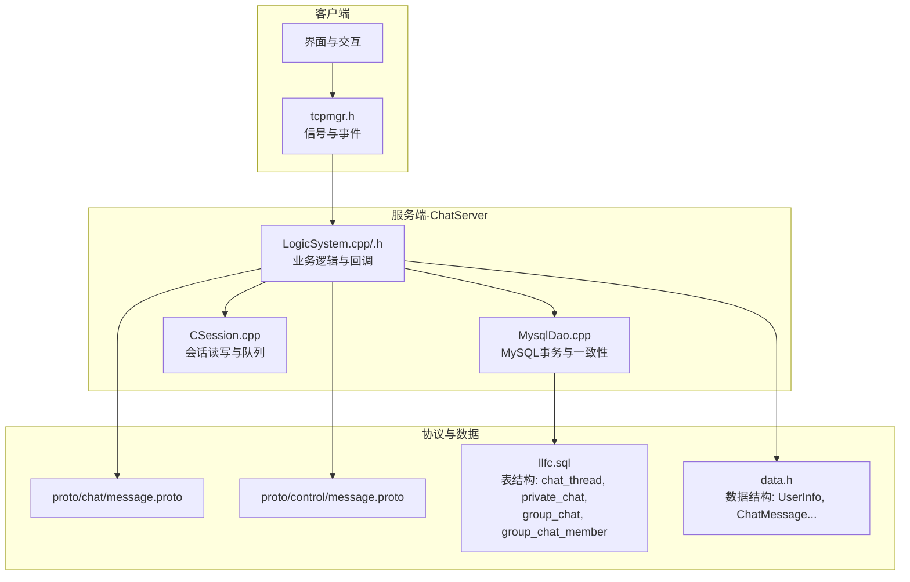
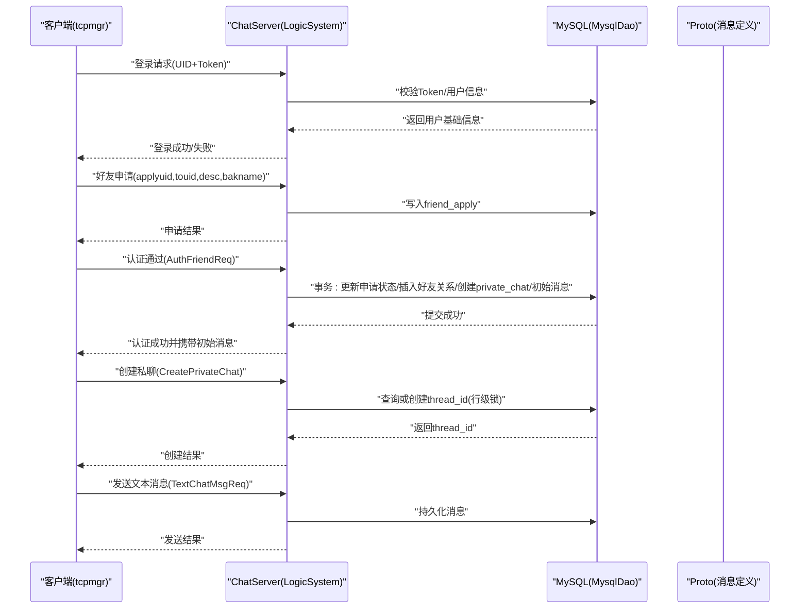
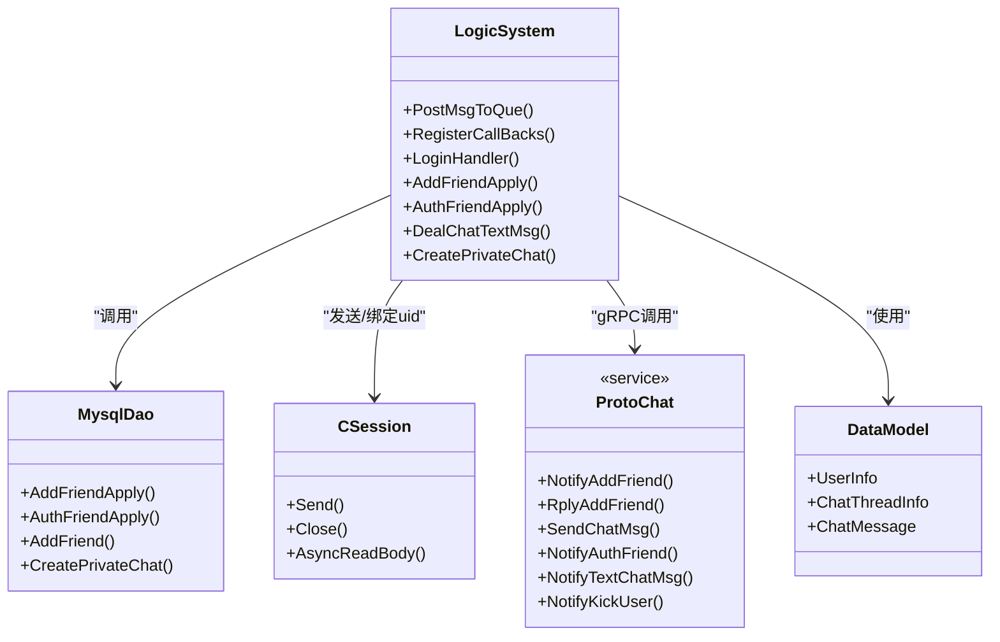
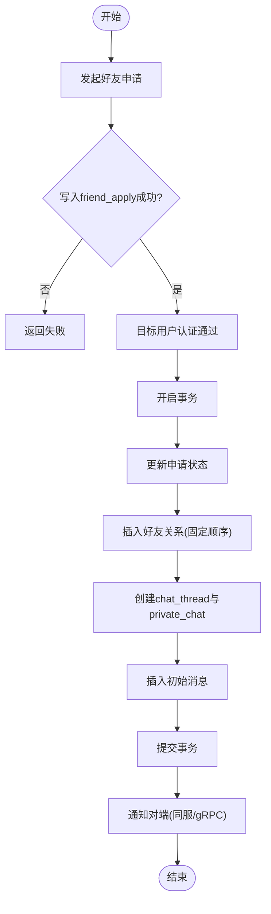

# 聊天室访问控制

<cite>
**本文引用的文件**   
- [LogicSystem.cpp](file://server/ChatServer/src/LogicSystem.cpp)
- [LogicSystem.h](file://server/ChatServer/include/LogicSystem.h)
- [MysqlDao.cpp](file://server/ChatServer/src/MysqlDao.cpp)
- [data.h](file://server/ChatServer/include/data.h)
- [message.proto（chat）](file://server/proto/chat/message.proto)
- [message.proto（control）](file://server/proto/control/message.proto)
- [llfc.sql](file://sql备份/llfc.sql)
- [CSession.cpp（ChatServer）](file://server/ChatServer/src/CSession.cpp)
- [tcpmgr.h](file://client/llfcchat/include/tcpmgr.h)
- [day29-好友认证和聊天通信.md](file://开发文档/day29-好友认证和聊天通信.md)
- [day37-聊天信息存储方案.md](file://开发文档/day37-聊天信息存储方案.md)
</cite>

## 目录
1. [简介](#简介)
2. [项目结构](#项目结构)
3. [核心组件](#核心组件)
4. [架构总览](#架构总览)
5. [详细组件分析](#详细组件分析)
6. [依赖关系分析](#依赖关系分析)
7. [性能考虑](#性能考虑)
8. [故障排查指南](#故障排查指南)
9. [结论](#结论)
10. [附录](#附录)

## 简介
本文件面向 LLFCChat 项目的“聊天室访问控制”主题，系统性梳理并说明以下能力与策略：
- 房间加入权限验证：好友关系检查、邀请码验证、管理员审批等加入条件控制。
- 消息发送权限管理：成员状态验证、禁言状态检查、消息频率限制等发送控制机制。
- 成员管理权限：添加成员、移除成员、角色分配、权限设置等管理操作控制。
- 聊天室类型差异：私聊、群聊、临时会话等不同场景的权限策略。
- 权限配置示例与继承规则：成员状态同步与权限变更通知机制。

本项目当前已实现私聊的完整链路（申请-认证-建线程-发消息），群聊表结构与字段已就绪，但群聊相关逻辑在代码中尚未完全落地；本文基于现有代码与数据库结构进行严谨分析与扩展建议。

## 项目结构
围绕聊天室访问控制，关键代码分布在服务端 ChatServer 的逻辑层、数据访问层、协议定义以及客户端的消息分发头文件中。

图表来源
- [LogicSystem.cpp:83-114](file://server/ChatServer/src/LogicSystem.cpp#L83-L114)
- [MysqlDao.cpp:247-504](file://server/ChatServer/src/MysqlDao.cpp#L247-L504)
- [CSession.cpp（ChatServer）:54-100](file://server/ChatServer/src/CSession.cpp#L54-L100)
- [message.proto（chat）:95-166](file://server/proto/chat/message.proto#L95-L166)
- [message.proto（control）:86-142](file://server/proto/control/message.proto#L86-L142)
- [llfc.sql:380-433](file://sql备份/llfc.sql#L380-L433)
- [data.h:32-65](file://server/ChatServer/include/data.h#L32-L65)

章节来源
- [LogicSystem.cpp:83-114](file://server/ChatServer/src/LogicSystem.cpp#L83-L114)
- [MysqlDao.cpp:247-504](file://server/ChatServer/src/MysqlDao.cpp#L247-L504)
- [llfc.sql:380-433](file://sql备份/llfc.sql#L380-L433)

## 核心组件
- 逻辑系统 LogicSystem：注册消息回调、处理登录、好友申请/认证、文本消息收发、心跳、创建私聊会话、加载历史消息等。
- 数据访问 MysqlDao：封装 MySQL 事务、并发安全（行锁、固定插入顺序避免死锁）、私聊线程创建与好友关系建立。
- 会话 CSession：网络读写的异步封装、发送队列与异常处理。
- 协议 message.proto：定义聊天与控制面消息结构与服务接口。
- 数据结构 data.h：用户信息、申请信息、聊天线程与消息结构体。
- 客户端 tcpmgr.h：定义客户端侧的信号与事件，用于对接服务器响应。

章节来源
- [LogicSystem.h:16-59](file://server/ChatServer/include/LogicSystem.h#L16-L59)
- [LogicSystem.cpp:83-114](file://server/ChatServer/src/LogicSystem.cpp#L83-L114)
- [MysqlDao.cpp:247-504](file://server/ChatServer/src/MysqlDao.cpp#L247-L504)
- [data.h:32-65](file://server/ChatServer/include/data.h#L32-L65)
- [message.proto（chat）:95-166](file://server/proto/chat/message.proto#L95-L166)
- [tcpmgr.h:68-89](file://client/llfcchat/include/tcpmgr.h#L68-L89)

## 架构总览
下图展示从客户端到服务端的聊天室访问控制主流程，包括登录鉴权、好友申请与认证、私聊线程创建与消息收发。

图表来源
- [LogicSystem.cpp:116-254](file://server/ChatServer/src/LogicSystem.cpp#L116-L254)
- [LogicSystem.cpp:281-358](file://server/ChatServer/src/LogicSystem.cpp#L281-L358)
- [LogicSystem.cpp:360-478](file://server/ChatServer/src/LogicSystem.cpp#L360-L478)
- [LogicSystem.cpp:848-874](file://server/ChatServer/src/LogicSystem.cpp#L848-L874)
- [LogicSystem.cpp:480-576](file://server/ChatServer/src/LogicSystem.cpp#L480-L576)
- [MysqlDao.cpp:247-504](file://server/ChatServer/src/MysqlDao.cpp#L247-L504)
- [message.proto（chat）:95-166](file://server/proto/chat/message.proto#L95-L166)

## 详细组件分析

### 房间加入权限验证
- 私聊加入
  - 前提：双方为“好友”关系。认证通过后，服务器在事务中建立 friend 双向记录并创建 private_chat 关联 thread_id。
  - 线程创建：CreatePrivateChat 使用行级锁确保并发安全，若已存在则直接返回 thread_id，否则新建并返回。
  - 权限判定：仅当用户在 private_chat 中存在对应记录时，方可参与该私聊会话。
- 群聊加入
  - 表结构已就绪：group_chat_member 包含 role（普通成员/管理员/创建者）与 muted_until（禁言截止时间）。
  - 当前代码未实现群聊加入逻辑，建议后续在 LogicSystem 增加 JoinGroupChat 处理器，校验 role 与 muted_until，并维护加入/离开事件。
- 邀请码验证
  - 当前代码未发现邀请码相关字段与逻辑。可在 group_chat 或独立表中扩展 invite_code 与有效期，并在加入流程中校验。
- 管理员审批
  - 好友申请采用 friend_apply 表，状态位 status 表示是否已通过。认证通过即视为“管理员/目标用户”审批完成。
  - 群聊可沿用类似思路：在 group_chat_member 中维护 role，由管理员或创建者审批加入。

章节来源
- [LogicSystem.cpp:281-358](file://server/ChatServer/src/LogicSystem.cpp#L281-L358)
- [LogicSystem.cpp:360-478](file://server/ChatServer/src/LogicSystem.cpp#L360-L478)
- [LogicSystem.cpp:848-874](file://server/ChatServer/src/LogicSystem.cpp#L848-L874)
- [MysqlDao.cpp:247-504](file://server/ChatServer/src/MysqlDao.cpp#L247-L504)
- [llfc.sql:380-433](file://sql备份/llfc.sql#L380-L433)

### 消息发送权限管理
- 成员状态验证
  - 私聊：发送前需确认 thread_id 对应的 private_chat 中包含发送者与接收者。
  - 群聊：需校验 group_chat_member 中是否存在该用户且未被踢出。
- 禁言状态检查
  - 群聊支持 muted_until 字段，发送前需判断当前时间是否超过截止时间。
- 消息频率限制
  - 当前代码未实现限流。建议在 Redis 中按 user_id + thread_id 维度维护滑动窗口计数，超限拒绝发送。
- 发送流程
  - 客户端发送 TextChatMsgReq，服务器持久化后返回 ID_TEXT_CHAT_MSG_RSP，并通过 gRPC 通知对端（同服直发，跨服走 NotifyTextChatMsg）。

章节来源
- [LogicSystem.cpp:480-576](file://server/ChatServer/src/LogicSystem.cpp#L480-L576)
- [message.proto（chat）:107-127](file://server/proto/chat/message.proto#L107-L127)
- [llfc.sql:380-404](file://sql备份/llfc.sql#L380-L404)

### 成员管理权限
- 添加成员
  - 私聊：认证通过后自动建立 private_chat 关联。
  - 群聊：需新增 AddGroupMember 处理器，校验发起者 role（管理员/创建者），写入 group_chat_member。
- 移除成员
  - 私聊：无显式移除，可通过删除好友关系间接退出。
  - 群聊：需新增 RemoveGroupMember 处理器，校验发起者 role，删除 group_chat_member 记录并广播。
- 角色分配与权限设置
  - 群聊 member.role 支持 0/1/2，需在 UpdateMemberRole 处理器中校验发起者权限（仅创建者可修改管理员及以上）。
- 踢人
  - 协议已定义 KickUserReq/Rsp，服务器可实现跨服踢人通知。

章节来源
- [message.proto（control）:126-142](file://server/proto/control/message.proto#L126-L142)
- [llfc.sql:380-404](file://sql备份/llfc.sql#L380-L404)

### 聊天室类型差异与权限策略
- 私聊
  - 基于 private_chat 表，thread_id 唯一确定会话，权限由好友关系决定。
- 群聊
  - 基于 group_chat 与 group_chat_member，权限由 role 与 muted_until 决定。
- 临时会话
  - 当前未实现，可扩展为短生命周期 thread，结合邀请码与过期策略。

章节来源
- [llfc.sql:380-433](file://sql备份/llfc.sql#L380-L433)
- [data.h:32-38](file://server/ChatServer/include/data.h#L32-L38)

### 权限配置示例与继承规则
- 权限配置建议
  - 私聊：默认允许双方互发消息；禁止非好友进入。
  - 群聊：role=0 普通成员可发言；role=1 管理员可管理成员与禁言；role=2 创建者拥有最高权限。
  - 禁言：muted_until 为空表示不禁言；不为空时需比较当前时间与截止时间。
- 继承规则
  - 群聊成员权限不继承父群；子群需重新加入并赋予角色。
  - 私聊权限随好友关系变化而即时生效。
- 成员状态同步与通知
  - 服务器通过 gRPC 或本地 session 推送状态变更（如加入/离开、禁言、角色变更）。
  - 客户端通过 tcpmgr.h 中的信号处理 UI 更新。

章节来源
- [tcpmgr.h:68-89](file://client/llfcchat/include/tcpmgr.h#L68-L89)
- [message.proto（chat）:158-166](file://server/proto/chat/message.proto#L158-L166)

## 依赖关系分析
- 模块耦合
  - LogicSystem 依赖 MysqlDao（数据一致性）、Redis（在线状态与分布式锁）、gRPC（跨服通知）。
  - CSession 负责网络 I/O，LogicSystem 通过 session 绑定 uid 并路由消息。
- 外部依赖
  - MySQL：事务与行锁保证并发安全。
  - Redis：Token 校验、在线状态、分布式锁。
  - Protobuf：统一消息契约。

图表来源
- [LogicSystem.cpp:83-114](file://server/ChatServer/src/LogicSystem.cpp#L83-L114)
- [MysqlDao.cpp:247-504](file://server/ChatServer/src/MysqlDao.cpp#L247-L504)
- [CSession.cpp（ChatServer）:54-100](file://server/ChatServer/src/CSession.cpp#L54-L100)
- [message.proto（chat）:158-166](file://server/proto/chat/message.proto#L158-L166)
- [data.h:32-65](file://server/ChatServer/include/data.h#L32-L65)

章节来源
- [LogicSystem.cpp:83-114](file://server/ChatServer/src/LogicSystem.cpp#L83-L114)
- [MysqlDao.cpp:247-504](file://server/ChatServer/src/MysqlDao.cpp#L247-L504)
- [CSession.cpp（ChatServer）:54-100](file://server/ChatServer/src/CSession.cpp#L54-L100)
- [message.proto（chat）:158-166](file://server/proto/chat/message.proto#L158-L166)
- [data.h:32-65](file://server/ChatServer/include/data.h#L32-L65)

## 性能考虑
- 数据库事务与锁
  - 好友认证与私聊创建使用事务与行级锁，避免并发冲突与死锁（固定插入顺序）。
- 网络 I/O
  - CSession 使用异步写队列，防止阻塞；队列满时丢弃或背压。
- 缓存与状态
  - Redis 缓存用户基础信息与 Token，减少 DB 压力；在线状态快速定位目标服务器。
- 限流与防抖
  - 建议引入 Redis 滑动窗口限流，保护消息通道与后端资源。

[本节为通用指导，无需特定文件引用]

## 故障排查指南
- 登录失败
  - 检查 Redis 中 Token 是否正确，UID 是否有效。
- 好友申请失败
  - 检查 friend_apply 写入是否成功，跨服通知是否到达。
- 认证失败
  - 检查事务回滚原因（死锁、约束冲突），查看日志错误码。
- 消息发送失败
  - 检查 thread_id 有效性、接收方在线状态、gRPC 通知是否成功。
- 踢人失败
  - 检查跨服 gRPC 调用与目标服务器 KickUser 处理。

章节来源
- [LogicSystem.cpp:116-254](file://server/ChatServer/src/LogicSystem.cpp#L116-L254)
- [LogicSystem.cpp:281-358](file://server/ChatServer/src/LogicSystem.cpp#L281-L358)
- [LogicSystem.cpp:360-478](file://server/ChatServer/src/LogicSystem.cpp#L360-L478)
- [LogicSystem.cpp:480-576](file://server/ChatServer/src/LogicSystem.cpp#L480-L576)
- [CSession.cpp（ChatServer）:54-100](file://server/ChatServer/src/CSession.cpp#L54-L100)

## 结论
LLFCChat 当前已实现私聊的完整访问控制链路，包括好友申请、认证、线程创建与消息收发，具备高并发与一致性的保障。群聊权限模型已在数据库层面就绪，后续应在 LogicSystem 中补齐加入、管理、禁言与通知逻辑，并结合 Redis 实现限流与状态同步，以完善全场景的聊天室访问控制体系。

[本节为总结性内容，无需特定文件引用]

## 附录
- 关键流程图（认证与建线程）

图表来源
- [LogicSystem.cpp:281-358](file://server/ChatServer/src/LogicSystem.cpp#L281-L358)
- [LogicSystem.cpp:360-478](file://server/ChatServer/src/LogicSystem.cpp#L360-L478)
- [MysqlDao.cpp:247-504](file://server/ChatServer/src/MysqlDao.cpp#L247-L504)

章节来源
- [day29-好友认证和聊天通信.md:141-266](file://开发文档/day29-好友认证和聊天通信.md#L141-L266)
- [day37-聊天信息存储方案.md:1081-1280](file://开发文档/day37-聊天信息存储方案.md#L1081-L1280)