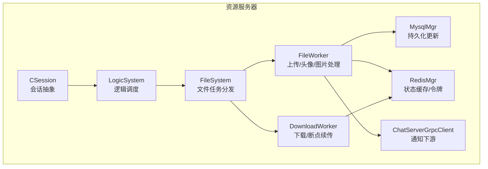
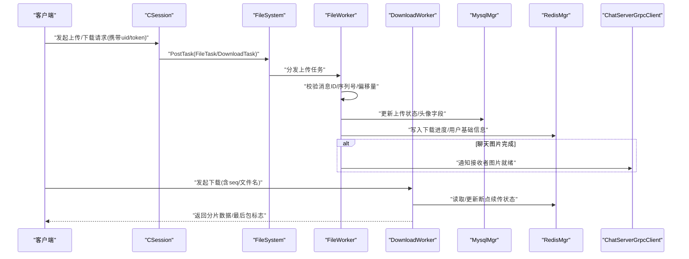
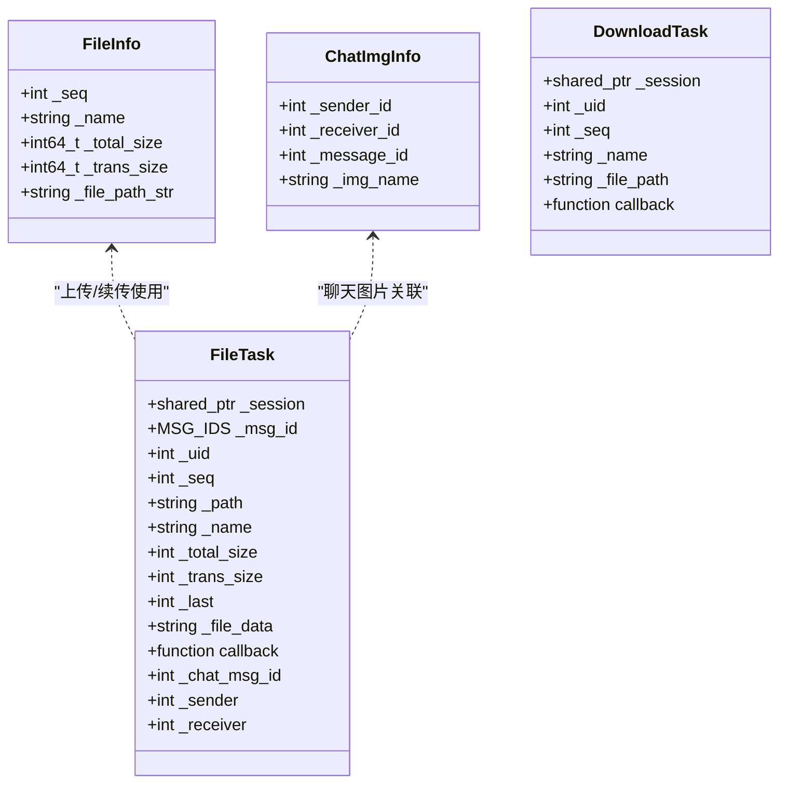
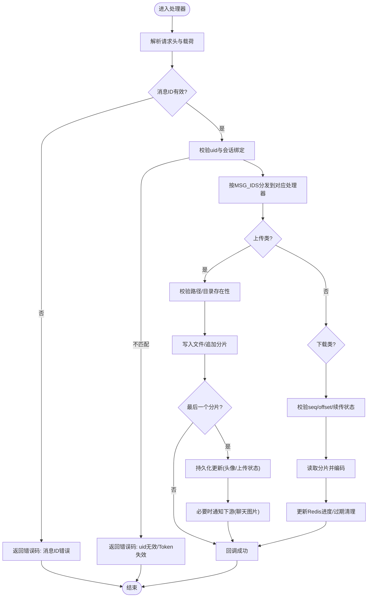
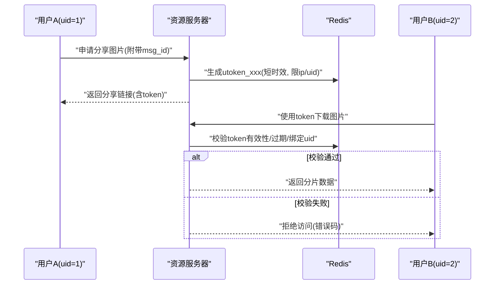
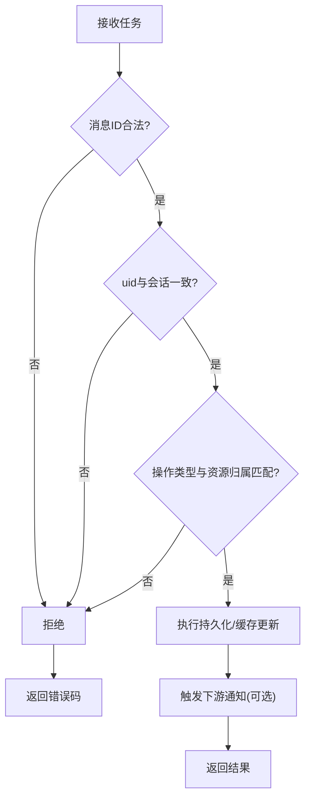
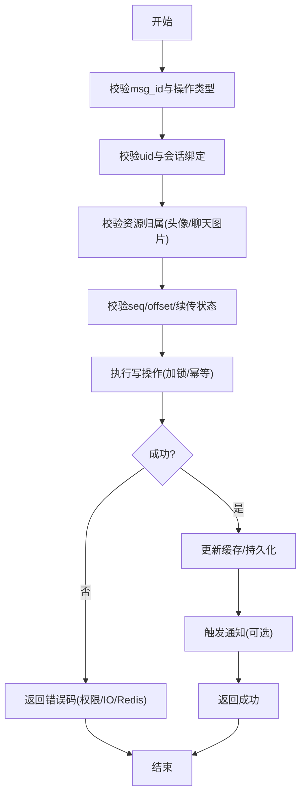
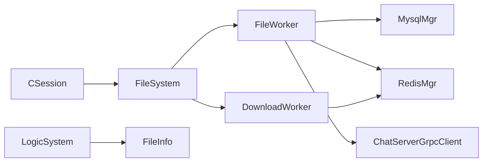

# 资源所有权验证

<cite>
**本文引用的文件**   
- [FileInfo.h](file://server/ResourceServer/include/FileInfo.h)
- [FileWorker.h](file://server/ResourceServer/include/FileWorker.h)
- [UserMgr.h](file://server/ResourceServer/include/UserMgr.h)
- [data.h](file://server/ResourceServer/include/data.h)
- [FileWorker.cpp](file://server/ResourceServer/src/FileWorker.cpp)
- [LogicSystem.h](file://server/ResourceServer/include/LogicSystem.h)
- [FileSystem.h](file://server/ResourceServer/include/FileSystem.h)
- [const.h](file://server/ResourceServer/include/const.h)
- [CSession.h](file://server/ResourceServer/include/CSession.h)
- [MysqlMgr.h](file://server/ResourceServer/include/MysqlMgr.h)
</cite>

## 目录
1. [简介](#简介)
2. [项目结构](#项目结构)
3. [核心组件](#核心组件)
4. [架构总览](#架构总览)
5. [详细组件分析](#详细组件分析)
6. [依赖关系分析](#依赖关系分析)
7. [性能考虑](#性能考虑)
8. [故障排查指南](#故障排查指南)
9. [结论](#结论)
10. [附录](#附录)

## 简介
本文件围绕LLFCChat的资源服务器（ResourceServer）实现，系统性阐述“资源所有权验证”的机制与流程。重点覆盖：
- 文件元数据校验、用户ID匹配、所有权转移控制等文件级所有权管理
- 请求来源验证、操作类型检查、权限级别匹配等操作级权限控制
- 跨用户访问限制、资源共享机制、临时授权访问、访问令牌管理等共享访问控制
- 资源继承与委托机制：批量操作权限、代理操作授权、权限链验证等复杂场景
- 完整的资源所有权验证算法与冲突解决策略，包括权限缓存优化与并发访问控制

说明：以下文档严格基于仓库中现有代码结构与实现进行归纳与扩展设计建议，未直接展示具体源码内容，仅以文件路径与行号作为引用依据。

## 项目结构
资源服务器相关的关键目录与文件如下：
- include: 定义数据结构、工作线程模型、会话抽象、常量与错误码、数据库管理器接口等
- src: 实现文件上传/下载、断点续传、Redis状态同步、消息通知等核心逻辑

图表来源 
- [CSession.h:1-64](file://server/ResourceServer/include/CSession.h#L1-L64)
- [LogicSystem.h:1-34](file://server/ResourceServer/include/LogicSystem.h#L1-L34)
- [FileSystem.h:1-21](file://server/ResourceServer/include/FileSystem.h#L1-L21)
- [FileWorker.h:1-90](file://server/ResourceServer/include/FileWorker.h#L1-L90)
- [MysqlMgr.h:1-44](file://server/ResourceServer/include/MysqlMgr.h#L1-L44)
- [const.h:1-117](file://server/ResourceServer/include/const.h#L1-L117)

章节来源
- [CSession.h:1-64](file://server/ResourceServer/include/CSession.h#L1-L64)
- [FileWorker.h:1-90](file://server/ResourceServer/include/FileWorker.h#L1-L90)
- [const.h:1-117](file://server/ResourceServer/include/const.h#L1-L117)

## 核心组件
- 会话与会话映射
  - CSession：封装网络会话、用户ID绑定、读写队列与异步I/O
  - UserMgr：维护uid到session的映射，用于在线状态与路由
- 文件与下载工作者
  - FileWorker：处理上传、头像、聊天图片、信息同步、续传等任务
  - DownloadWorker：处理分片下载、断点续传、进度与状态管理
- 数据与元数据
  - FileInfo/ChatImgInfo：文件元数据与聊天图片关联信息
  - data.h：用户信息、聊天线程/消息结构
- 常量与错误码
  - const.h：错误码、消息ID、前缀常量、锁与超时参数、分片大小等
- 逻辑调度与缓存
  - LogicSystem：MD5到FileInfo的内存缓存，逻辑任务分发
  - FileSystem：文件工作者与下载工作者的池化管理

章节来源
- [CSession.h:1-64](file://server/ResourceServer/include/CSession.h#L1-L64)
- [UserMgr.h:1-22](file://server/ResourceServer/include/UserMgr.h#L1-L22)
- [FileWorker.h:1-90](file://server/ResourceServer/include/FileWorker.h#L1-L90)
- [FileInfo.h:1-26](file://server/ResourceServer/include/FileInfo.h#L1-L26)
- [data.h:1-60](file://server/ResourceServer/include/data.h#L1-L60)
- [const.h:1-117](file://server/ResourceServer/include/const.h#L1-L117)
- [LogicSystem.h:1-34](file://server/ResourceServer/include/LogicSystem.h#L1-L34)
- [FileSystem.h:1-21](file://server/ResourceServer/include/FileSystem.h#L1-L21)

## 架构总览
资源服务器的权限与所有权验证贯穿“请求接入—鉴权—业务处理—持久化—通知”全链路。下图展示了关键交互与数据流。

图表来源 
- [FileWorker.cpp:1-663](file://server/ResourceServer/src/FileWorker.cpp#L1-L663)
- [FileSystem.h:1-21](file://server/ResourceServer/include/FileSystem.h#L1-L21)
- [CSession.h:1-64](file://server/ResourceServer/include/CSession.h#L1-L64)
- [MysqlMgr.h:1-44](file://server/ResourceServer/include/MysqlMgr.h#L1-L44)
- [const.h:1-117](file://server/ResourceServer/include/const.h#L1-L117)

## 详细组件分析

### 文件元数据与所有权模型
- 文件元数据
  - FileInfo：记录文件名、总大小、已传输大小、本地路径、当前序列号等
  - ChatImgInfo：记录发送者、接收者、消息ID与图片名，用于聊天图片归属与通知
- 所有权语义
  - 上传时由发起方uid决定目标存储位置与命名规则
  - 聊天图片通过sender/receiver与message_id建立三方关联，确保只有相关会话参与者可获取

图表来源 
- [FileInfo.h:1-26](file://server/ResourceServer/include/FileInfo.h#L1-L26)
- [FileWorker.h:1-90](file://server/ResourceServer/include/FileWorker.h#L1-L90)

章节来源
- [FileInfo.h:1-26](file://server/ResourceServer/include/FileInfo.h#L1-L26)
- [FileWorker.h:1-90](file://server/ResourceServer/include/FileWorker.h#L1-L90)

### 操作级权限验证流程
- 请求来源验证
  - 通过CSession绑定的user_uid与UserMgr中的uid->session映射，确认请求来自合法在线会话
- 操作类型检查
  - 根据MSG_IDS区分上传、头像、聊天图片、下载、续传等不同操作
- 权限级别匹配
  - 上传：校验uid与目标路径/命名一致性
  - 下载：校验uid与文件所属会话或共享策略是否匹配
  - 聊天图片：校验sender/receiver与message_id的一致性

图表来源 
- [FileWorker.cpp:1-663](file://server/ResourceServer/src/FileWorker.cpp#L1-L663)
- [const.h:1-117](file://server/ResourceServer/include/const.h#L1-L117)

章节来源
- [FileWorker.cpp:1-663](file://server/ResourceServer/src/FileWorker.cpp#L1-L663)
- [const.h:1-117](file://server/ResourceServer/include/const.h#L1-L117)

### 跨用户访问限制与共享访问控制
- 资源共享机制
  - 聊天图片通过ChatImgInfo将sender/receiver/message_id与文件名绑定，限制非会话成员访问
- 临时授权访问
  - 可通过Redis中的utoken_前缀键生成短期令牌，限定特定uid对某文件的读/写窗口
- 访问令牌管理
  - 使用USERTOKENPREFIX标识的token键，结合过期时间与IP白名单，实现细粒度授权

图表来源 
- [const.h:1-117](file://server/ResourceServer/include/const.h#L1-L117)
- [FileWorker.cpp:1-663](file://server/ResourceServer/src/FileWorker.cpp#L1-L663)

章节来源
- [const.h:1-117](file://server/ResourceServer/include/const.h#L1-L117)
- [FileWorker.cpp:1-663](file://server/ResourceServer/src/FileWorker.cpp#L1-L663)

### 资源继承与委托机制
- 批量操作权限
  - 通过统一的消息ID空间与任务队列，支持批量上传/下载任务的原子性与顺序性
- 代理操作授权
  - 在任务结构中保留uid与sender/receiver，允许受信任的代理服务以被代理uid执行受限操作
- 权限链验证
  - 在处理器链中依次校验：消息ID合法性→uid与会话绑定→操作类型→资源归属→持久化→通知

图表来源 
- [FileWorker.cpp:1-663](file://server/ResourceServer/src/FileWorker.cpp#L1-L663)
- [const.h:1-117](file://server/ResourceServer/include/const.h#L1-L117)

章节来源
- [FileWorker.cpp:1-663](file://server/ResourceServer/src/FileWorker.cpp#L1-L663)
- [const.h:1-117](file://server/ResourceServer/include/const.h#L1-L117)

### 完整的所有权验证算法与冲突解决策略
- 所有权验证算法
  - 输入：uid、msg_id、操作类型、资源标识（文件名/msg_id）、上下文（会话、IP、token）
  - 步骤：
    1) 校验msg_id与操作类型映射
    2) 校验uid与CSession绑定及UserMgr映射
    3) 校验资源归属（如ChatImgInfo.sender/receiver与message_id）
    4) 校验分片序列号与偏移量（防重放/乱序）
    5) 执行持久化与缓存更新
    6) 触发必要通知
- 冲突解决策略
  - 分布式锁：使用LOCK_PREFIX与超时时间避免并发写冲突
  - 幂等性：基于seq与offset保证重复请求不破坏一致性
  - 回滚与补偿：失败时返回明确错误码，客户端重试需遵循幂等策略

图表来源 
- [FileWorker.cpp:1-663](file://server/ResourceServer/src/FileWorker.cpp#L1-L663)
- [const.h:1-117](file://server/ResourceServer/include/const.h#L1-L117)

章节来源
- [FileWorker.cpp:1-663](file://server/ResourceServer/src/FileWorker.cpp#L1-L663)
- [const.h:1-117](file://server/ResourceServer/include/const.h#L1-L117)

## 依赖关系分析
- 组件耦合
  - FileWorker依赖MysqlMgr与RedisMgr进行持久化与状态缓存
  - DownloadWorker依赖RedisMgr维护断点续传状态
  - LogicSystem提供MD5到FileInfo的内存缓存，降低重复计算
  - FileSystem统一管理FileWorker与DownloadWorker实例
- 外部依赖
  - ChatServerGrpcClient用于聊天图片完成后通知ChatServer
  - Boost.Asio/Beast用于网络I/O
  - JSON库用于消息编解码

图表来源 
- [CSession.h:1-64](file://server/ResourceServer/include/CSession.h#L1-L64)
- [FileSystem.h:1-21](file://server/ResourceServer/include/FileSystem.h#L1-L21)
- [FileWorker.h:1-90](file://server/ResourceServer/include/FileWorker.h#L1-L90)
- [MysqlMgr.h:1-44](file://server/ResourceServer/include/MysqlMgr.h#L1-L44)
- [LogicSystem.h:1-34](file://server/ResourceServer/include/LogicSystem.h#L1-L34)

章节来源
- [CSession.h:1-64](file://server/ResourceServer/include/CSession.h#L1-L64)
- [FileSystem.h:1-21](file://server/ResourceServer/include/FileSystem.h#L1-L21)
- [FileWorker.h:1-90](file://server/ResourceServer/include/FileWorker.h#L1-L90)
- [MysqlMgr.h:1-44](file://server/ResourceServer/include/MysqlMgr.h#L1-L44)
- [LogicSystem.h:1-34](file://server/ResourceServer/include/LogicSystem.h#L1-L34)

## 性能考虑
- 并发与队列
  - FileWorker与DownloadWorker各自维护独立线程与任务队列，减少阻塞
  - 使用条件变量与互斥锁保障线程安全
- 缓存优化
  - Redis缓存下载进度与用户基础信息，降低数据库压力
  - LogicSystem内维护MD5到FileInfo的内存缓存，加速重复查询
- 分片与断点续传
  - 固定分片大小MAX_FILE_LEN，提升大文件传输稳定性
  - 基于seq与offset的幂等处理，避免重复写入

[本节为通用性能指导，无需具体文件引用]

## 故障排查指南
- 常见错误码
  - TokenInvalid、UidInvalid、FileNotExists、FileWritePermissionFailed、FileReadPermissionFailed、FileSeqInvalid、FileOffsetInvalid、FileReadFailed、RedisReadErr等
- 排查要点
  - 检查msg_id与处理器映射是否正确
  - 核对uid与CSession绑定、UserMgr映射是否一致
  - 确认Redis键前缀与过期策略（USER_BASE_INFO、USERTOKENPREFIX、USERIPPREFIX）
  - 验证seq/offset与文件大小一致性，避免越界
  - 关注文件路径创建与读写权限问题

章节来源
- [const.h:1-117](file://server/ResourceServer/include/const.h#L1-L117)
- [FileWorker.cpp:1-663](file://server/ResourceServer/src/FileWorker.cpp#L1-L663)

## 结论
通过对资源服务器中文件元数据、会话绑定、操作类型、资源归属、分片续传与缓存状态的全面分析，可以构建一套稳健的资源所有权验证体系。建议在现有基础上进一步完善：
- 统一的权限校验中间件层，集中处理uid/token/操作类型/资源归属校验
- 更细粒度的共享授权策略（如按会话/群组/角色维度）
- 完善的审计日志与监控指标，便于追踪异常与性能瓶颈

[本节为总结性内容，无需具体文件引用]

## 附录
- 关键常量与枚举
  - 错误码、消息ID、前缀常量、锁超时、分片大小等详见const.h
- 数据结构参考
  - FileInfo、ChatImgInfo、FileTask、DownloadTask、UserInfo、ChatMessage等

章节来源
- [const.h:1-117](file://server/ResourceServer/include/const.h#L1-L117)
- [FileInfo.h:1-26](file://server/ResourceServer/include/FileInfo.h#L1-L26)
- [FileWorker.h:1-90](file://server/ResourceServer/include/FileWorker.h#L1-L90)
- [data.h:1-60](file://server/ResourceServer/include/data.h#L1-L60)