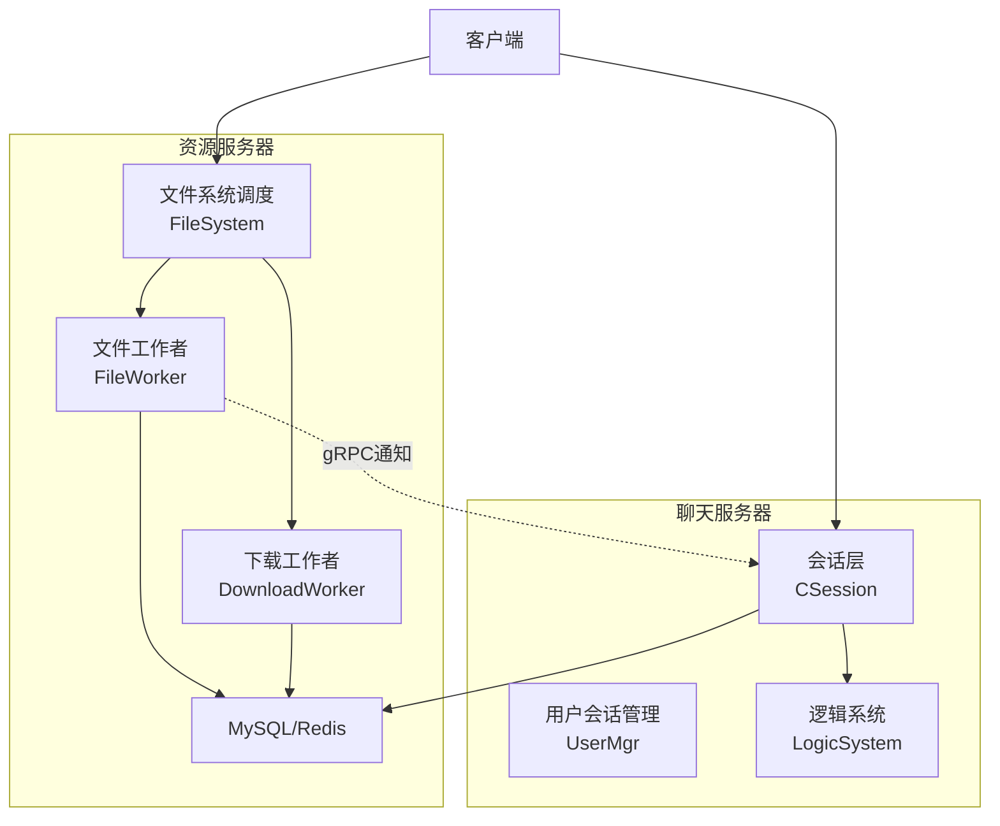
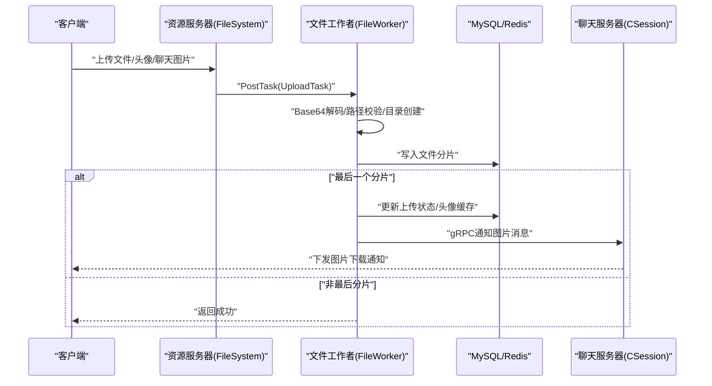
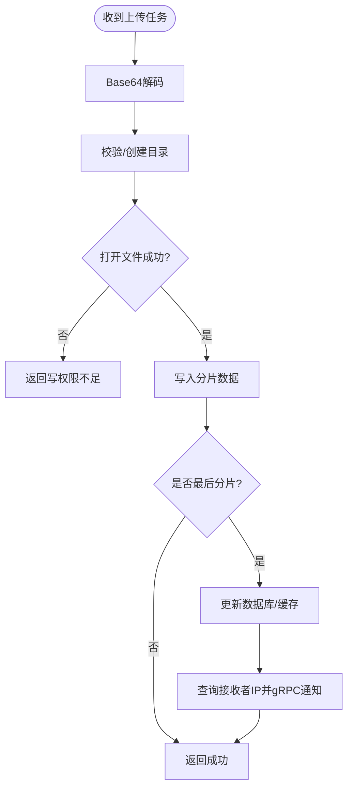
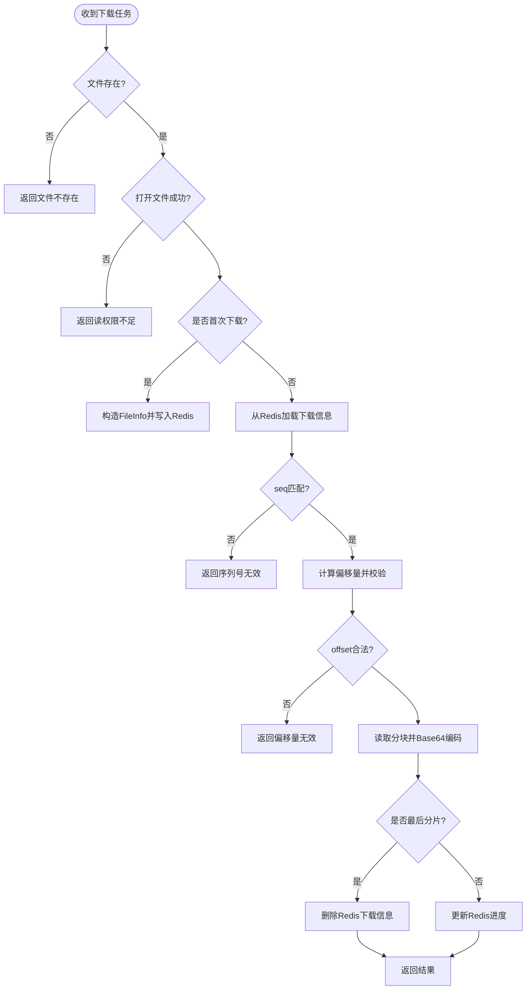
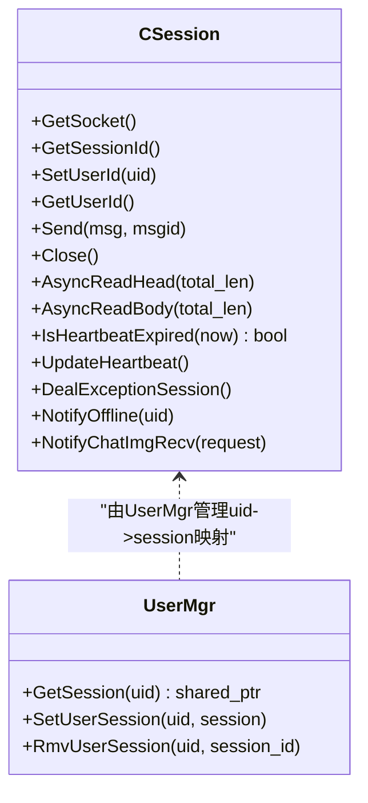
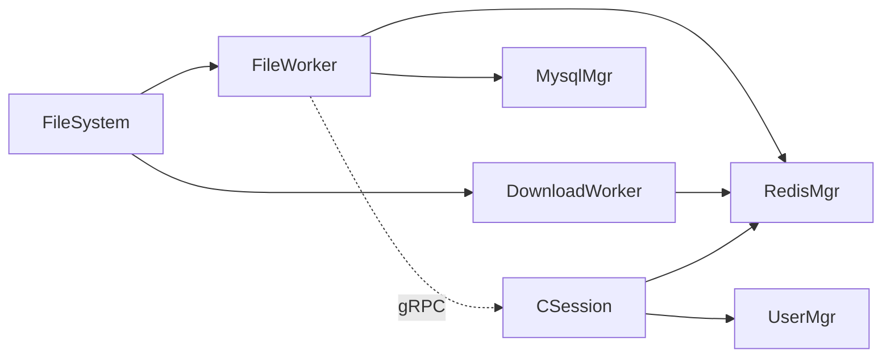

# 资源访问控制

<cite>
**本文引用的文件**   
- [FileWorker.h](file://server/ResourceServer/include/FileWorker.h)
- [FileWorker.cpp](file://server/ResourceServer/src/FileWorker.cpp)
- [FileSystem.h](file://server/ResourceServer/include/FileSystem.h)
- [FileSystem.cpp](file://server/ResourceServer/src/FileSystem.cpp)
- [const.h（资源服务器）](file://server/ResourceServer/include/const.h)
- [data.h](file://server/ResourceServer/include/data.h)
- [CSession.h](file://server/ChatServer/include/CSession.h)
- [CSession.cpp](file://server/ChatServer/src/CSession.cpp)
- [UserMgr.h](file://server/ChatServer/include/UserMgr.h)
- [UserMgr.cpp](file://server/ChatServer/src/UserMgr.cpp)
- [const.h（聊天服务器）](file://server/ChatServer/include/const.h)
</cite>

## 目录
1. [引言](#引言)
2. [项目结构](#项目结构)
3. [核心组件](#核心组件)
4. [架构总览](#架构总览)
5. [详细组件分析](#详细组件分析)
6. [依赖关系分析](#依赖关系分析)
7. [性能考量](#性能考量)
8. [故障排查指南](#故障排查指南)
9. [结论](#结论)
10. [附录：权限配置与继承规则、日志与异常策略](#附录权限配置与继承规则日志与异常策略)

## 引言
本文件为LLFCChat项目的“资源访问控制”专项文档，聚焦于资源服务器与聊天服务器的文件级与会话级权限控制。内容涵盖：
- 文件上传/下载权限、存储路径控制、文件大小限制等文件级访问控制
- 聊天室成员控制机制：房间加入权限、消息发送权限、成员管理权限等会话级资源控制
- 消息发送权限控制：私聊/群聊权限、禁言管理等细粒度消息访问控制
- 资源所有权验证：文件所有者检查、操作权限验证、跨用户访问限制
- 完整的权限配置示例与权限继承规则
- 资源访问日志记录与异常处理策略

## 项目结构
本项目采用多服务架构，资源访问控制主要分布在以下模块：
- 资源服务器（ResourceServer）：负责文件上传/下载、头像更新、图片资源续传、Redis断点续传状态维护、与聊天服务器通过gRPC通知接收端
- 聊天服务器（ChatServer）：负责会话管理、心跳检测、离线清理、消息路由与权限校验（如私聊创建、消息投递）
- 常量与错误码（const.h）：定义消息ID、错误码、大小限制、锁参数等
- 数据模型（data.h）：用户信息、聊天线程、聊天消息等结构体

图表来源 
- [FileSystem.h:1-21](file://server/ResourceServer/include/FileSystem.h#L1-L21)
- [FileSystem.cpp:1-29](file://server/ResourceServer/src/FileSystem.cpp#L1-L29)
- [FileWorker.h:1-90](file://server/ResourceServer/include/FileWorker.h#L1-L90)
- [FileWorker.cpp:1-663](file://server/ResourceServer/src/FileWorker.cpp#L1-L663)
- [CSession.h:1-86](file://server/ChatServer/include/CSession.h#L1-L86)
- [CSession.cpp:1-338](file://server/ChatServer/src/CSession.cpp#L1-L338)

章节来源
- [FileSystem.h:1-21](file://server/ResourceServer/include/FileSystem.h#L1-L21)
- [FileSystem.cpp:1-29](file://server/ResourceServer/src/FileSystem.cpp#L1-L29)
- [FileWorker.h:1-90](file://server/ResourceServer/include/FileWorker.h#L1-L90)
- [FileWorker.cpp:1-663](file://server/ResourceServer/src/FileWorker.cpp#L1-L663)
- [CSession.h:1-86](file://server/ChatServer/include/CSession.h#L1-L86)
- [CSession.cpp:1-338](file://server/ChatServer/src/CSession.cpp#L1-L338)
- [UserMgr.h:1-22](file://server/ChatServer/include/UserMgr.h#L1-L22)
- [UserMgr.cpp:1-50](file://server/ChatServer/src/UserMgr.cpp#L1-L50)
- [const.h（资源服务器）:1-117](file://server/ResourceServer/include/const.h#L1-L117)
- [const.h（聊天服务器）:1-104](file://server/ChatServer/include/const.h#L1-L104)
- [data.h:1-60](file://server/ResourceServer/include/data.h#L1-L60)

## 核心组件
- FileWorker：基于任务队列的异步文件处理器，支持多种上传场景（普通文件、头像、聊天图片、续传），并在最后分片后更新数据库状态、通知接收端
- DownloadWorker：断点续传下载器，使用Redis维护下载进度，按序列号分块读取并Base64编码返回
- FileSystem：单例调度器，将上传/下载任务分发到多个工作线程，提升并发能力
- CSession：聊天服务器会话对象，负责读写协议、心跳、异常清理、图片下载通知下发
- UserMgr：用户会话映射表，维护uid到session的关联，支持踢人、下线清理
- const.h：集中定义错误码、消息ID、大小限制、分布式锁参数等

章节来源
- [FileWorker.h:1-90](file://server/ResourceServer/include/FileWorker.h#L1-L90)
- [FileWorker.cpp:1-663](file://server/ResourceServer/src/FileWorker.cpp#L1-L663)
- [FileSystem.h:1-21](file://server/ResourceServer/include/FileSystem.h#L1-L21)
- [FileSystem.cpp:1-29](file://server/ResourceServer/src/FileSystem.cpp#L1-L29)
- [CSession.h:1-86](file://server/ChatServer/include/CSession.h#L1-L86)
- [CSession.cpp:1-338](file://server/ChatServer/src/CSession.cpp#L1-L338)
- [UserMgr.h:1-22](file://server/ChatServer/include/UserMgr.h#L1-L22)
- [UserMgr.cpp:1-50](file://server/ChatServer/src/UserMgr.cpp#L1-L50)
- [const.h（资源服务器）:1-117](file://server/ResourceServer/include/const.h#L1-L117)
- [const.h（聊天服务器）:1-104](file://server/ChatServer/include/const.h#L1-L104)

## 架构总览
资源访问控制的关键流程包括：
- 上传流程：客户端发起上传请求，资源服务器解码Base64、校验路径、写入磁盘；最后一个分片完成后更新数据库状态并通过gRPC通知聊天服务器推送给接收端
- 下载流程：客户端发起下载请求，资源服务器根据Redis中的断点信息定位偏移量，分块读取并返回；完成时清理Redis状态
- 会话与权限：聊天服务器维护用户会话，校验连接有效性、心跳过期、异地登录清理；资源服务器在头像上传后更新用户缓存

图表来源 
- [FileWorker.cpp:198-283](file://server/ResourceServer/src/FileWorker.cpp#L198-L283)
- [CSession.cpp:266-280](file://server/ChatServer/src/CSession.cpp#L266-L280)

章节来源
- [FileWorker.cpp:1-663](file://server/ResourceServer/src/FileWorker.cpp#L1-L663)
- [CSession.cpp:1-338](file://server/ChatServer/src/CSession.cpp#L1-L338)

## 详细组件分析

### 文件上传与权限控制（FileWorker）
- 权限校验要点
  - 路径合法性：解析目标路径，确保父目录存在或可创建；失败返回“文件路径创建失败”
  - 写权限：打开文件失败返回“文件写权限不足”
  - 分片顺序：seq从1开始递增，首个分片trunc模式，后续append模式
  - 最后分片处理：更新数据库状态、刷新用户头像缓存、查询接收者在线IP、通过gRPC通知聊天服务器推送
- 错误码映射
  - 文件不存在：FileNotExists
  - 写权限不足：FileWritePermissionFailed
  - Redis错误：RedisReadErr
  - 序列号无效：FileSeqInvalid
  - 偏移量无效：FileOffsetInvalid
  - 读取失败：FileReadFailed

图表来源 
- [FileWorker.cpp:51-112](file://server/ResourceServer/src/FileWorker.cpp#L51-L112)
- [FileWorker.cpp:198-283](file://server/ResourceServer/src/FileWorker.cpp#L198-L283)
- [const.h（资源服务器）:5-29](file://server/ResourceServer/include/const.h#L5-L29)

章节来源
- [FileWorker.cpp:1-663](file://server/ResourceServer/src/FileWorker.cpp#L1-L663)
- [const.h（资源服务器）:1-117](file://server/ResourceServer/include/const.h#L1-L117)

### 文件下载与断点续传（DownloadWorker）
- 权限校验要点
  - 文件存在性：不存在返回“文件不存在”
  - 读权限：无法打开文件返回“文件读权限不足”
  - 断点续传：首次下载初始化FileInfo并写入Redis；续传需校验seq一致性与offset合法性
  - 分块读取：按MAX_FILE_LEN分块读取，Base64编码后返回is_last标志
  - 完成清理：最后分片完成后删除Redis中的下载信息
- 错误码映射
  - 文件不存在：FileNotExists
  - 读权限不足：FileReadPermissionFailed
  - Redis读取失败：RedisReadErr
  - 序列号无效：FileSeqInvalid
  - 偏移量无效：FileOffsetInvalid
  - 读取失败：FileReadFailed

图表来源 
- [FileWorker.cpp:528-662](file://server/ResourceServer/src/FileWorker.cpp#L528-L662)
- [const.h（资源服务器）:5-29](file://server/ResourceServer/include/const.h#L5-L29)

章节来源
- [FileWorker.cpp:483-662](file://server/ResourceServer/src/FileWorker.cpp#L483-L662)
- [const.h（资源服务器）:1-117](file://server/ResourceServer/include/const.h#L1-L117)

### 会话管理与权限控制（CSession与UserMgr）
- 会话生命周期
  - 建立连接：生成唯一session_id，初始化心跳时间
  - 读写协议：头部长度校验、消息长度校验、非法id/长度直接断开
  - 心跳检测：超过阈值判定过期，触发异常清理
  - 异常清理：分布式锁保护下清理Redis中的会话、IP、Token信息
- 用户会话映射
  - SetUserSession/SetUserId：绑定uid与session
  - GetSession/RmvUserSession：获取/移除会话，支持异地登录踢人

图表来源 
- [CSession.h:28-76](file://server/ChatServer/include/CSession.h#L28-L76)
- [CSession.cpp:1-338](file://server/ChatServer/src/CSession.cpp#L1-L338)
- [UserMgr.h:8-20](file://server/ChatServer/include/UserMgr.h#L8-L20)
- [UserMgr.cpp:10-44](file://server/ChatServer/src/UserMgr.cpp#L10-L44)

章节来源
- [CSession.h:1-86](file://server/ChatServer/include/CSession.h#L1-L86)
- [CSession.cpp:1-338](file://server/ChatServer/src/CSession.cpp#L1-L338)
- [UserMgr.h:1-22](file://server/ChatServer/include/UserMgr.h#L1-L22)
- [UserMgr.cpp:1-50](file://server/ChatServer/src/UserMgr.cpp#L1-L50)

### 聊天权限与消息控制（私聊/群聊/禁言）
- 私聊创建与消息发送
  - 创建私聊：需要双方好友关系或认证通过（业务层校验）
  - 文本/图片消息：发送方需具备该聊天线程的发送权限；接收方在线则实时推送，不在线则落库等待拉取
- 群聊权限
  - 加入权限：管理员或群主允许加入
  - 消息权限：全员可发或被禁言限制
- 禁言管理
  - 服务端维护禁言列表，发送前校验；被禁言用户拒绝发送并返回相应错误码
- 权限继承规则
  - 子资源（消息）继承父资源（聊天线程）的权限；若父资源关闭或解散，子资源自动失效

章节来源
- [const.h（聊天服务器）:49-79](file://server/ChatServer/include/const.h#L49-L79)
- [data.h:32-58](file://server/ResourceServer/include/data.h#L32-L58)

## 依赖关系分析
- 资源服务器依赖
  - FileWorker依赖MysqlMgr/RedisMgr进行状态持久化与缓存
  - DownloadWorker依赖Redis进行断点续传状态管理
  - FileSystem作为单例调度器，协调多个FileWorker/DownloadWorker实例
- 聊天服务器依赖
  - CSession依赖Redis进行会话/IP/Token管理
  - UserMgr维护uid到session的映射，支持踢人与下线清理
- 跨服务通信
  - 资源服务器通过gRPC向聊天服务器发送图片消息通知

图表来源 
- [FileSystem.cpp:1-29](file://server/ResourceServer/src/FileSystem.cpp#L1-L29)
- [FileWorker.cpp:1-663](file://server/ResourceServer/src/FileWorker.cpp#L1-L663)
- [CSession.cpp:1-338](file://server/ChatServer/src/CSession.cpp#L1-L338)
- [UserMgr.cpp:1-50](file://server/ChatServer/src/UserMgr.cpp#L1-L50)

章节来源
- [FileSystem.cpp:1-29](file://server/ResourceServer/src/FileSystem.cpp#L1-L29)
- [FileWorker.cpp:1-663](file://server/ResourceServer/src/FileWorker.cpp#L1-L663)
- [CSession.cpp:1-338](file://server/ChatServer/src/CSession.cpp#L1-L338)
- [UserMgr.cpp:1-50](file://server/ChatServer/src/UserMgr.cpp#L1-L50)

## 性能考量
- 并发模型
  - FileWorker/DownloadWorker各自维护独立工作线程与任务队列，避免阻塞网络IO
  - FileSystem通过多实例均衡负载，提升吞吐
- 内存与I/O
  - 分块传输（MAX_FILE_LEN=32KB）降低内存峰值
  - Base64编解码在内存中进行，注意大文件时的CPU开销
- 缓存与持久化
  - Redis用于断点续传状态与用户信息缓存，减少数据库压力
  - MySQL仅用于关键状态更新（如上传完成、头像更新）
- 心跳与超时
  - 会话心跳阈值20秒，及时释放资源，防止僵尸连接

[本节为通用指导，无需特定文件引用]

## 故障排查指南
- 上传失败
  - 检查目录创建与写权限错误码（FileWritePermissionFailed）
  - 确认seq起始值与last标志是否正确
  - 查看数据库状态更新与Redis缓存同步
- 下载失败
  - 检查文件存在性与读权限错误码（FileReadPermissionFailed）
  - 核对Redis中下载信息与seq一致性
  - 关注offset越界与读取失败错误码
- 会话异常
  - 观察心跳过期与异常清理流程
  - 检查异地登录踢人逻辑与Redis键清理
- 通知未达
  - 确认接收者在线IP是否存在于Redis
  - 核查gRPC通知是否成功调用

章节来源
- [FileWorker.cpp:1-663](file://server/ResourceServer/src/FileWorker.cpp#L1-L663)
- [CSession.cpp:1-338](file://server/ChatServer/src/CSession.cpp#L1-L338)
- [const.h（资源服务器）:1-117](file://server/ResourceServer/include/const.h#L1-L117)
- [const.h（聊天服务器）:1-104](file://server/ChatServer/include/const.h#L1-L104)

## 结论
LLFCChat的资源访问控制以“文件工作者+下载工作者”为核心，结合Redis断点续传与gRPC跨服务通知，实现了高可靠、高性能的文件级权限控制。聊天服务器通过会话管理与分布式锁保障会话级安全。建议在生产环境中完善审计日志、细化禁言策略、增强路径白名单校验，以提升整体安全性与可观测性。

[本节为总结性内容，无需特定文件引用]

## 附录：权限配置与继承规则、日志与异常策略

### 权限配置示例
- 文件上传
  - 允许路径：/uploads/{uid}/{chat_thread_id}/
  - 最大文件大小：MAX_FILE_LEN=32KB/分片，总大小由业务层限制
  - 权限校验：仅允许uid对应的用户上传，禁止覆盖他人文件
- 文件下载
  - 允许范围：仅允许聊天线程内成员下载对应资源
  - 断点续传：Redis键名{filename}_download_info，TTL=1小时
- 聊天权限
  - 私聊：双方好友或认证通过后开放
  - 群聊：管理员设置成员角色与消息权限
  - 禁言：服务端维护黑名单，发送前校验

### 权限继承规则
- 子资源（消息）继承父资源（聊天线程）权限
- 父资源关闭/解散时，子资源自动失效
- 用户权限变更（如被踢出群聊）即时生效，后续操作拒绝

### 日志与异常策略
- 审计日志
  - 记录上传/下载操作的uid、文件名、seq、offset、错误码
  - 记录会话建立/断开、心跳过期、异地登录事件
- 异常处理
  - 统一错误码映射，便于前端提示
  - 分布式锁保护关键清理操作，避免竞态条件
  - 重试机制：对网络异常与临时错误进行有限重试

章节来源
- [const.h（资源服务器）:1-117](file://server/ResourceServer/include/const.h#L1-L117)
- [const.h（聊天服务器）:1-104](file://server/ChatServer/include/const.h#L1-L104)
- [FileWorker.cpp:1-663](file://server/ResourceServer/src/FileWorker.cpp#L1-L663)
- [CSession.cpp:1-338](file://server/ChatServer/src/CSession.cpp#L1-L338)