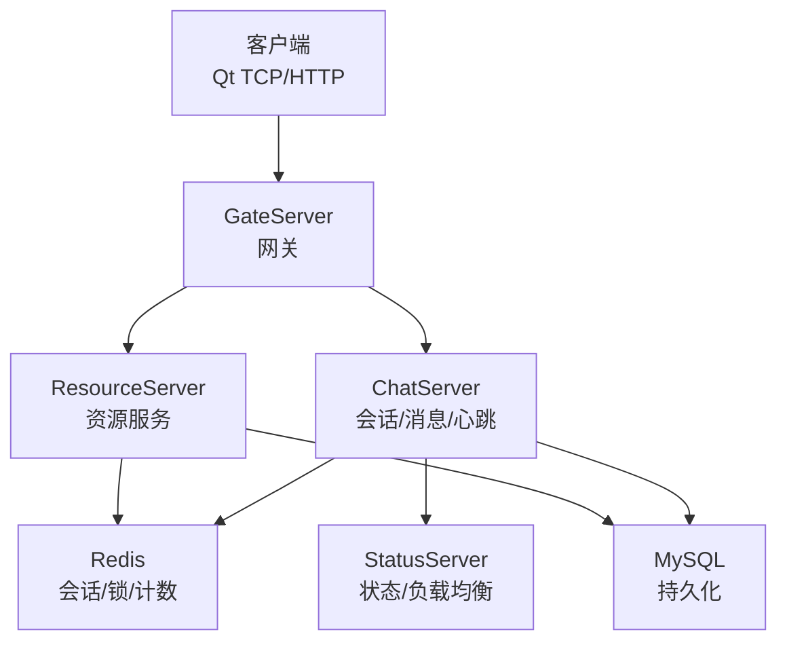
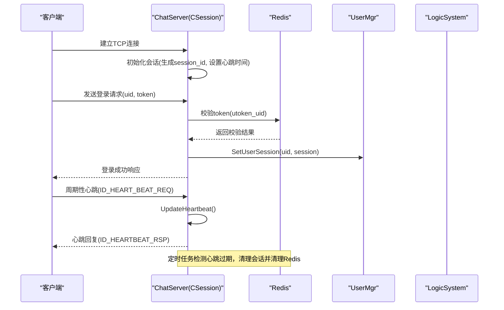
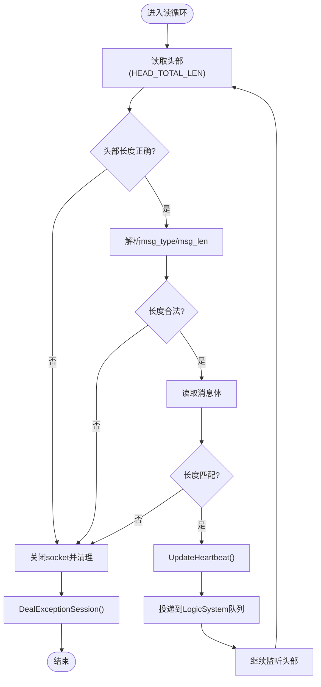
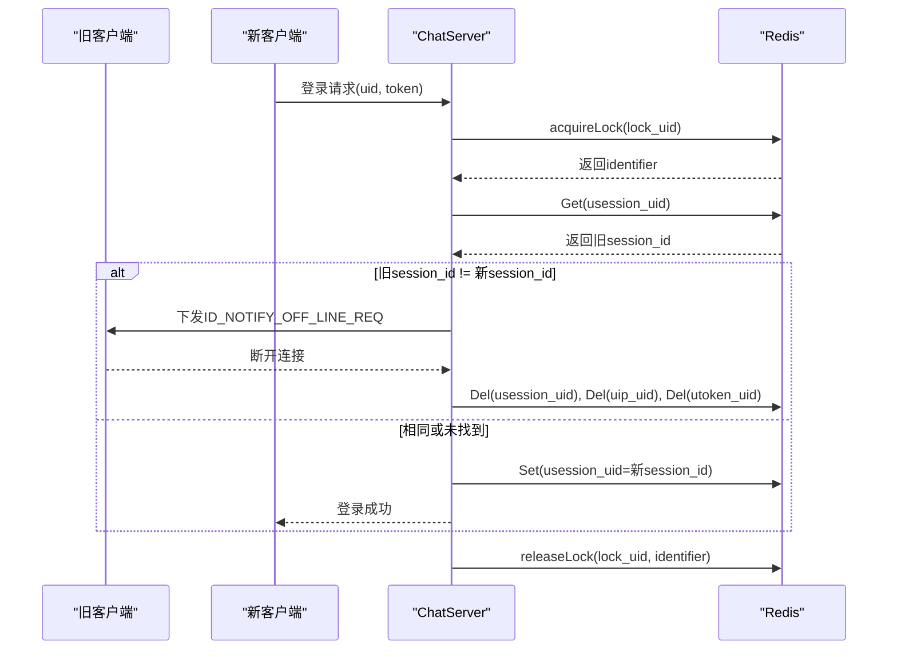
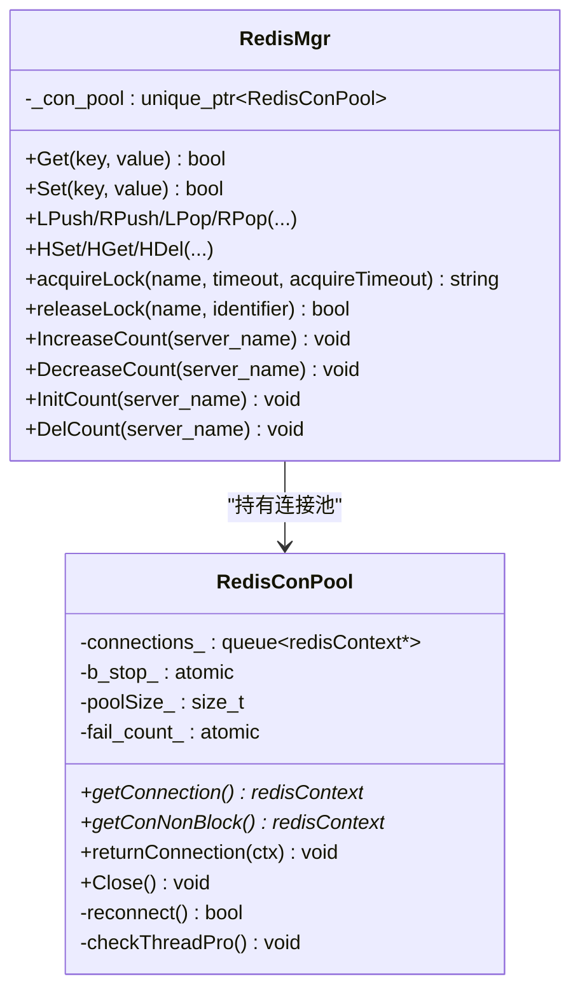
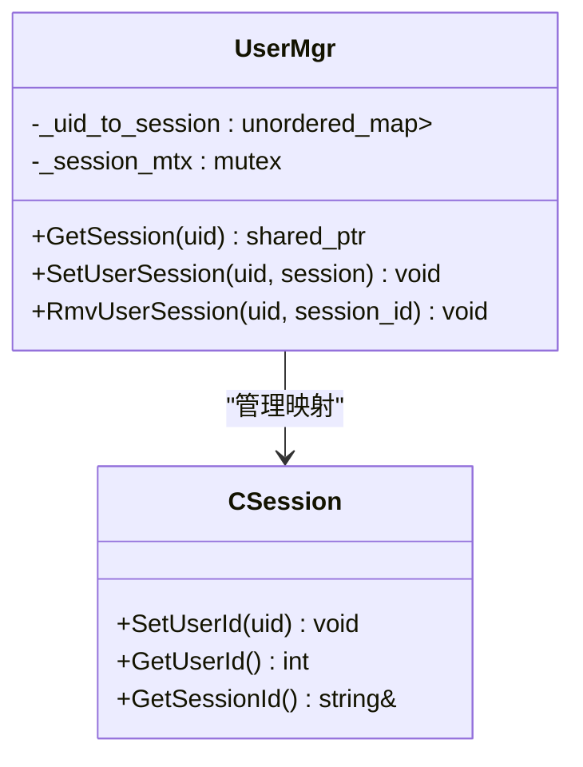
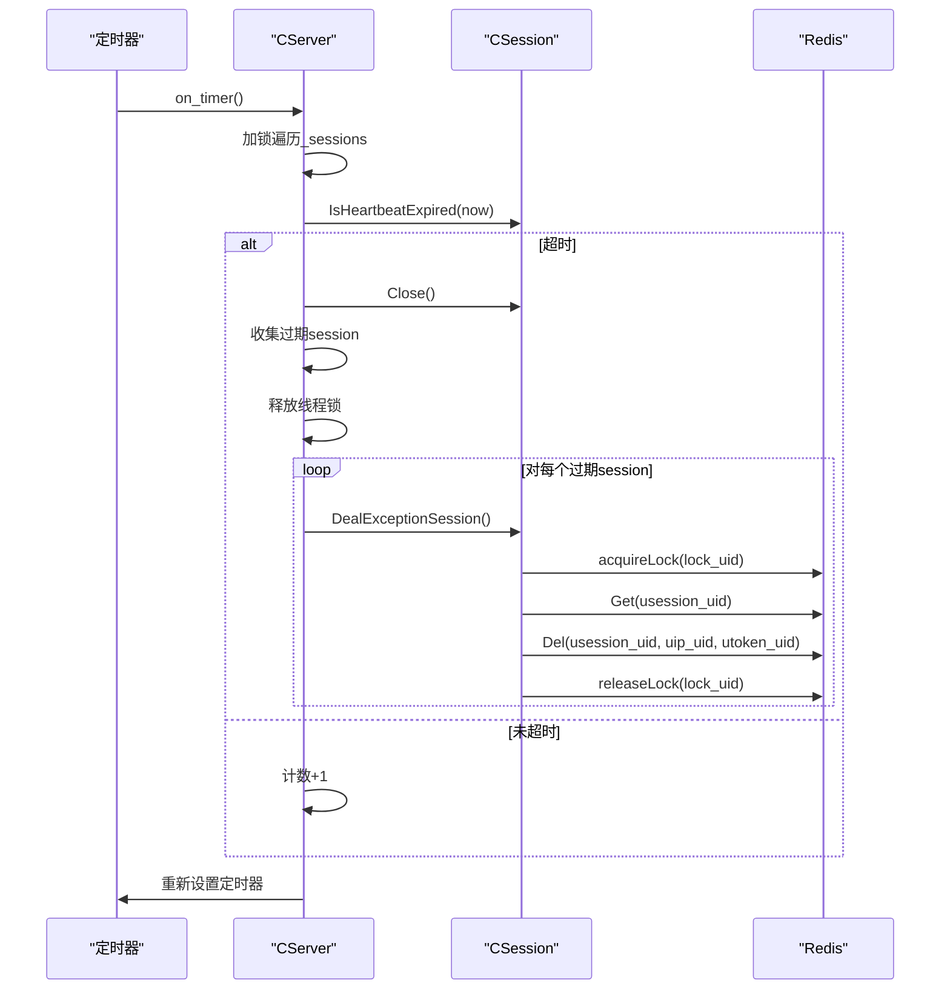
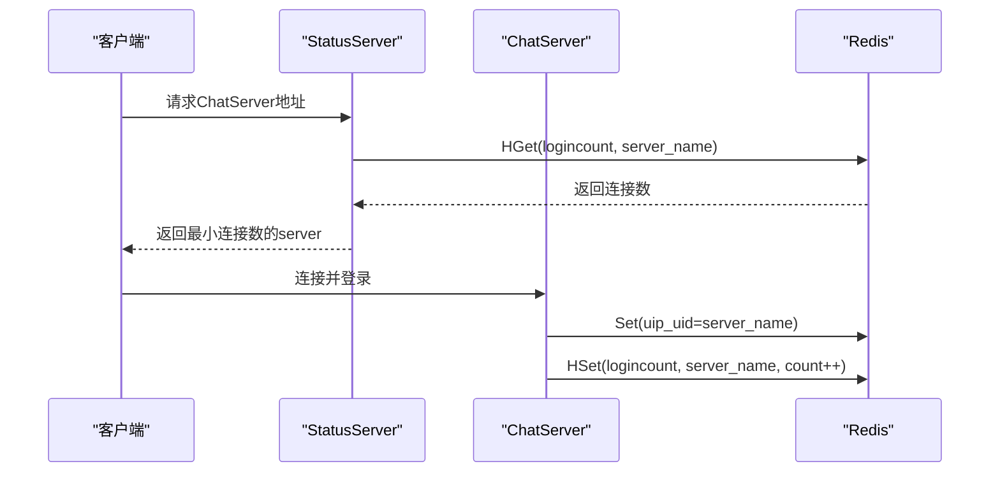
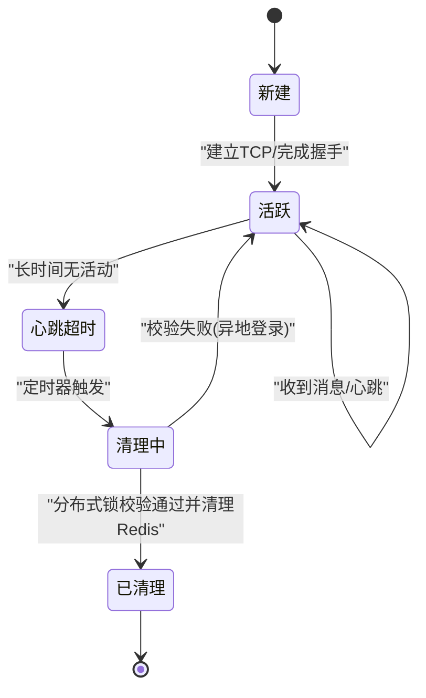
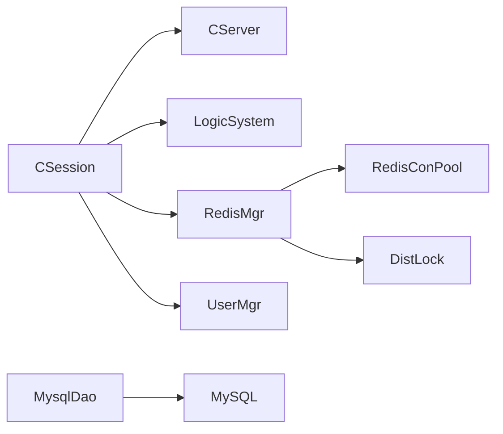

# 会话管理机制

<cite>
**本文引用的文件**   
- [CSession.h](file://server/ChatServer/include/CSession.h)
- [CSession.cpp](file://server/ChatServer/src/CSession.cpp)
- [RedisMgr.h](file://server/ChatServer/include/RedisMgr.h)
- [RedisMgr.cpp](file://server/ChatServer/src/RedisMgr.cpp)
- [UserMgr.h](file://server/ChatServer/include/UserMgr.h)
- [UserMgr.cpp](file://server/ChatServer/src/UserMgr.cpp)
- [LogicSystem.h](file://server/ChatServer/include/LogicSystem.h)
- [const.h](file://server/ChatServer/include/const.h)
- [MysqlDao.h](file://server/ChatServer/include/MysqlDao.h)
- [MysqlDao.h（ResourceServer）](file://server/ResourceServer/include/MysqlDao.h)
- [day35心跳逻辑.md](file://开发文档/day35心跳逻辑.md)
- [day27-分布式服务设计.md](file://开发文档/day27-分布式服务设计.md)
- [day37-聊天信息存储方案.md](file://开发文档/day37-聊天信息存储方案.md)
- [mainwindow.cpp](file://client/llfcchat/src/mainwindow.cpp)
</cite>

## 目录
1. [引言](#引言)
2. [项目结构](#项目结构)
3. [核心组件](#核心组件)
4. [架构总览](#架构总览)
5. [详细组件分析](#详细组件分析)
6. [依赖关系分析](#依赖关系分析)
7. [性能考量](#性能考量)
8. [故障排查指南](#故障排查指南)
9. [结论](#结论)
10. [附录](#附录)

## 引言
本技术文档围绕 LLFCChat 的会话管理机制展开，重点覆盖：
- 用户会话生命周期管理（建立、活跃、心跳、异常清理、销毁）
- 多设备登录控制与异地踢人策略
- Redis 中的会话数据结构设计、键值命名规范与过期策略
- 连接池管理（Redis 连接池、MySQL 连接池）、心跳检测机制与断线重连
- 会话迁移、负载均衡支持与故障恢复策略
- 会话状态转换图与分布式一致性保证方案

## 项目结构
LLFCChat 采用多服务架构：
- ChatServer：负责长连接会话、消息路由、心跳与在线状态维护
- StatusServer：提供状态查询与负载均衡决策
- ResourceServer：资源上传下载等
- GateServer：网关入口
- VarifyServer：验证码派发（Node.js）
- 客户端（Qt C++）：TCP/HTTP 通信、UI 交互

**图示来源** 
- [CSession.h](file://server/ChatServer/include/CSession.h)
- [RedisMgr.h](file://server/ChatServer/include/RedisMgr.h)
- [MysqlDao.h](file://server/ChatServer/include/MysqlDao.h)

**章节来源**
- [README.md](file://README.md)

## 核心组件
- CSession：封装单个 TCP 会话，处理读写、心跳、异常清理、离线通知
- RedisMgr：Redis 连接池、原子操作封装、分布式锁获取/释放、计数统计
- UserMgr：进程内 uid -> session 映射，用于踢人、定向推送
- LogicSystem：消息分发与业务回调注册（登录、心跳、聊天等）
- const：全局常量、消息类型、Redis Key 前缀、错误码
- MysqlDao：MySQL 连接池、健康检查与自动重连

**章节来源**
- [CSession.h](file://server/ChatServer/include/CSession.h)
- [CSession.cpp](file://server/ChatServer/src/CSession.cpp)
- [RedisMgr.h](file://server/ChatServer/include/RedisMgr.h)
- [RedisMgr.cpp](file://server/ChatServer/src/RedisMgr.cpp)
- [UserMgr.h](file://server/ChatServer/include/UserMgr.h)
- [UserMgr.cpp](file://server/ChatServer/src/UserMgr.cpp)
- [LogicSystem.h](file://server/ChatServer/include/LogicSystem.h)
- [const.h](file://server/ChatServer/include/const.h)
- [MysqlDao.h](file://server/ChatServer/include/MysqlDao.h)

## 架构总览
会话管理的关键路径：
- 客户端通过 TCP 连接到 ChatServer，建立 CSession
- 登录流程校验 Token，绑定 uid 到 session，并写入 Redis 记录当前会话所在服务器
- 心跳维持连接活性；定时任务扫描超时会话并清理
- 异地登录时，通过分布式锁与 Redis 会话标识比对实现“踢人”
- 负载决策由 StatusServer 基于 Redis 中各服务器的连接数进行

**图示来源** 
- [CSession.cpp](file://server/ChatServer/src/CSession.cpp)
- [RedisMgr.cpp](file://server/ChatServer/src/RedisMgr.cpp)
- [UserMgr.cpp](file://server/ChatServer/src/UserMgr.cpp)
- [LogicSystem.h](file://server/ChatServer/include/LogicSystem.h)
- [day35心跳逻辑.md](file://开发文档/day35心跳逻辑.md)

## 详细组件分析

### 会话生命周期与心跳机制
- 会话建立：CSession 构造时生成唯一 session_id，初始化接收缓冲与最后心跳时间
- 读循环：AsyncReadHead 解析头部（msg_type、msg_len），随后 AsyncReadBody 读取完整消息体
- 心跳更新：每次收到数据调用 UpdateHeartbeat，记录最近一次活动时间
- 心跳过期：IsHeartbeatExpired 比较当前时间与 _last_heartbeat，超过阈值判定为过期
- 异常清理：DealExceptionSession 使用分布式锁保护，校验 Redis 中的 usession_uid 是否仍指向当前 session_id，若一致则清理 Redis 中的会话、IP、Token 等信息，并移除本地 session

**图示来源** 
- [CSession.cpp](file://server/ChatServer/src/CSession.cpp)

**章节来源**
- [CSession.h](file://server/ChatServer/include/CSession.h)
- [CSession.cpp](file://server/ChatServer/src/CSession.cpp)
- [day35心跳逻辑.md](file://开发文档/day35心跳逻辑.md)

### 多设备登录控制与异地踢人
- 登录时，将 uid 对应的 session_id 写入 Redis 的 USER_SESSION_PREFIX + uid_str
- 新登录时，先尝试获取分布式锁 LOCK_PREFIX + uid_str，确保同一用户登录操作的原子性
- 若 Redis 中已存在旧 session_id，且与新 session_id 不一致，则视为异地登录
- 旧端在收到通知或心跳超时后断开连接；新端完成登录后，旧端的 DealExceptionSession 会清理 Redis 中的会话、IP、Token 信息

**图示来源** 
- [CSession.cpp](file://server/ChatServer/src/CSession.cpp)
- [RedisMgr.cpp](file://server/ChatServer/src/RedisMgr.cpp)
- [day35心跳逻辑.md](file://开发文档/day35心跳逻辑.md)

**章节来源**
- [CSession.cpp](file://server/ChatServer/src/CSession.cpp)
- [RedisMgr.cpp](file://server/ChatServer/src/RedisMgr.cpp)
- [day35心跳逻辑.md](file://开发文档/day35心跳逻辑.md)

### Redis 会话数据结构与键值命名
- 键名前缀定义于 const.h：
  - USERIPPREFIX: "uip_"
  - USERTOKENPREFIX: "utoken_"
  - USER_BASE_INFO: "ubaseinfo_"
  - LOGIN_COUNT: "logincount"
  - NAME_INFO: "nameinfo_"
  - LOCK_PREFIX: "lock_"
  - USER_SESSION_PREFIX: "usession_"
  - LOCK_COUNT: "lockcount"
- 典型键值：
  - utoken_{uid}: 存储用户 token，用于登录校验
  - uip_{uid}: 存储用户当前登录的服务器名称
  - usession_{uid}: 存储用户当前会话的 session_id
  - logincount: Hash，字段为服务器名，值为该服务器在线连接数
- 过期策略：
  - Token 与 Session 通常随登录态有效期或登出清理
  - 心跳超时触发清理，避免僵尸会话长期占用

**章节来源**
- [const.h](file://server/ChatServer/include/const.h)
- [RedisMgr.cpp](file://server/ChatServer/src/RedisMgr.cpp)
- [day27-分布式服务设计.md](file://开发文档/day27-分布式服务设计.md)

### 连接池管理与健康检查
- Redis 连接池（RedisConPool）：
  - 初始化固定数量连接，支持 AUTH
  - 后台线程定期 PING 检测连接健康，失败则重建连接
  - getConnection/getConNonBlock 提供阻塞与非阻塞取连接
  - returnConnection 归还连接，条件变量唤醒等待者
- MySQL 连接池（MysqlDao）：
  - 周期检查连接活跃度，执行 SELECT 1 探测
  - 失败连接标记并重建，保持池容量稳定
  - 支持并发安全访问与通知等待线程

**图示来源** 
- [RedisMgr.h](file://server/ChatServer/include/RedisMgr.h)
- [RedisMgr.cpp](file://server/ChatServer/src/RedisMgr.cpp)

**章节来源**
- [RedisMgr.h](file://server/ChatServer/include/RedisMgr.h)
- [RedisMgr.cpp](file://server/ChatServer/src/RedisMgr.cpp)
- [MysqlDao.h](file://server/ChatServer/include/MysqlDao.h)
- [MysqlDao.h（ResourceServer）](file://server/ResourceServer/include/MysqlDao.h)

### 用户连接池与会话映射
- UserMgr 维护 uid -> session 的进程内映射，用于快速定位在线会话
- SetUserSession 设置映射；RmvUserSession 删除映射时需校验 session_id 一致性，防止误删其他设备的会话
- 结合 Redis 的 usession_uid，可实现跨进程/跨机器的会话一致性判断

**图示来源** 
- [UserMgr.h](file://server/ChatServer/include/UserMgr.h)
- [UserMgr.cpp](file://server/ChatServer/src/UserMgr.cpp)
- [CSession.h](file://server/ChatServer/include/CSession.h)

**章节来源**
- [UserMgr.h](file://server/ChatServer/include/UserMgr.h)
- [UserMgr.cpp](file://server/ChatServer/src/UserMgr.cpp)
- [CSession.h](file://server/ChatServer/include/CSession.h)

### 心跳检测与定时器
- 服务器侧定时器周期性遍历所有 session，调用 IsHeartbeatExpired 判断是否超时
- 超时会话 Close() 并收集待清理列表，释放线程锁后再逐个调用 DealExceptionSession
- 心跳请求/响应消息类型：ID_HEART_BEAT_REQ、ID_HEARTBEAT_RSP
- 客户端侧定时发送心跳包，服务端收到后更新 _last_heartbeat

**图示来源** 
- [day35心跳逻辑.md](file://开发文档/day35心跳逻辑.md)
- [CSession.cpp](file://server/ChatServer/src/CSession.cpp)
- [RedisMgr.cpp](file://server/ChatServer/src/RedisMgr.cpp)

**章节来源**
- [day35心跳逻辑.md](file://开发文档/day35心跳逻辑.md)
- [CSession.cpp](file://server/ChatServer/src/CSession.cpp)

### 会话迁移与负载均衡
- StatusServer 根据 Redis 中 logincount 的各服务器连接数选择负载最小的 ChatServer
- 登录成功后，ChatServer 将自身 server_name 写入 uip_{uid}，便于后续路由与踢人
- 当某服务器下线或过载，StatusServer 可动态调整分配策略

**图示来源** 
- [day27-分布式服务设计.md](file://开发文档/day27-分布式服务设计.md)
- [RedisMgr.cpp](file://server/ChatServer/src/RedisMgr.cpp)

**章节来源**
- [day27-分布式服务设计.md](file://开发文档/day27-分布式服务设计.md)
- [RedisMgr.cpp](file://server/ChatServer/src/RedisMgr.cpp)

### 会话状态转换图

**图示来源** 
- [CSession.cpp](file://server/ChatServer/src/CSession.cpp)
- [day35心跳逻辑.md](file://开发文档/day35心跳逻辑.md)

## 依赖关系分析
- CSession 依赖：
  - CServer（会话管理、有效性检查）
  - LogicSystem（消息分发）
  - RedisMgr（分布式锁、会话/Token/IP 存取）
  - UserMgr（uid 到 session 映射）
- RedisMgr 依赖：
  - RedisConPool（连接池、健康检查）
  - DistLock（分布式锁实现）
- MysqlDao 依赖：
  - MySQL 驱动、连接池、健康检查与重连

**图示来源** 
- [CSession.h](file://server/ChatServer/include/CSession.h)
- [RedisMgr.h](file://server/ChatServer/include/RedisMgr.h)
- [MysqlDao.h](file://server/ChatServer/include/MysqlDao.h)

**章节来源**
- [CSession.h](file://server/ChatServer/include/CSession.h)
- [RedisMgr.h](file://server/ChatServer/include/RedisMgr.h)
- [MysqlDao.h](file://server/ChatServer/include/MysqlDao.h)

## 性能考量
- 异步 I/O：Boost.Asio 非阻塞读写，减少线程阻塞
- 发送队列：CSession 内部 _send_que 限流（MAX_SENDQUE），避免内存暴涨
- 心跳阈值：建议 60s，示例代码为 20s 便于演示
- 连接池复用：Redis/MySQL 连接池降低频繁创建/销毁开销
- 批量清理：定时器收集过期 session，释放线程锁后统一清理，避免死锁与锁竞争
- 负载统计：心跳结束后批量更新 logincount，减少分布式锁频率

[本节为通用指导，不直接分析具体文件]

## 故障排查指南
- 连接异常：
  - 检查 AsyncReadHead/AsyncReadBody 的错误分支，确认 socket 关闭与 DealExceptionSession 是否执行
  - 查看 Redis 连接池健康检查日志，确认 PING 是否成功
- 心跳超时：
  - 确认客户端是否定时发送 ID_HEART_BEAT_REQ
  - 检查服务器定时器 on_timer 是否正常运行
- 异地登录冲突：
  - 核对 Redis 中 usession_uid 与当前 session_id 是否一致
  - 检查分布式锁 acquire/release 是否正确配对
- 数据库连接问题：
  - 查看 MysqlDao 的健康检查与重连日志，确认连接池大小与重试次数

**章节来源**
- [CSession.cpp](file://server/ChatServer/src/CSession.cpp)
- [RedisMgr.cpp](file://server/ChatServer/src/RedisMgr.cpp)
- [MysqlDao.h](file://server/ChatServer/include/MysqlDao.h)
- [day35心跳逻辑.md](file://开发文档/day35心跳逻辑.md)

## 结论
LLFCChat 的会话管理机制以 CSession 为核心，结合 Redis 分布式锁与会话状态、UserMgr 进程内映射、以及定时器心跳检测，实现了高可靠的多设备登录控制与在线状态同步。通过连接池与健康检查、批量清理与负载统计，系统在分布式环境下具备较好的可扩展性与稳定性。

[本节为总结，不直接分析具体文件]

## 附录
- 会话迁移与一致性：
  - 通过 uip_{uid} 与 usession_{uid} 双重校验，确保会话迁移时的幂等与一致性
  - 心跳超时作为最终一致性保障，清理僵尸会话
- 客户端断线提示：
  - 客户端在收到 ID_NOTIFY_OFF_LINE_REQ 或心跳超时后弹出提示并回退登录界面

**章节来源**
- [day37-聊天信息存储方案.md](file://开发文档/day37-聊天信息存储方案.md)
- [mainwindow.cpp](file://client/llfcchat/src/mainwindow.cpp)