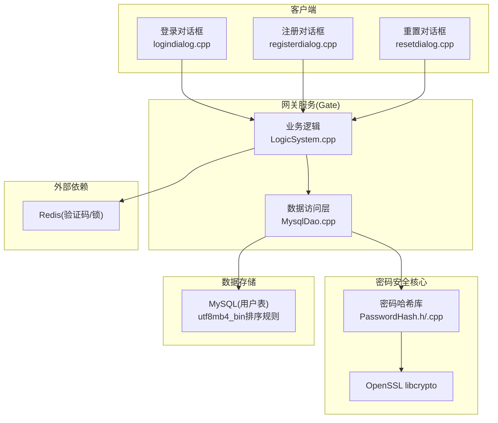
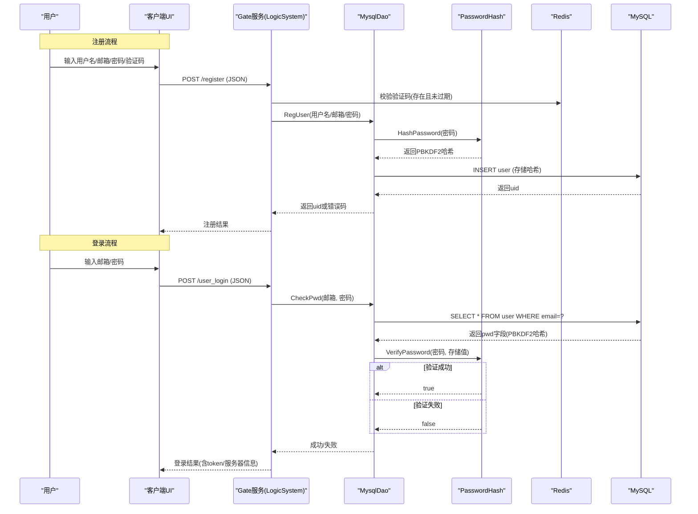
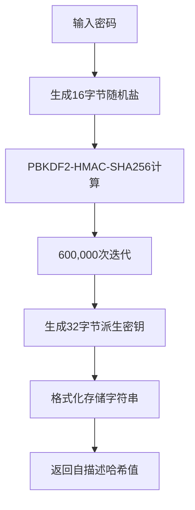
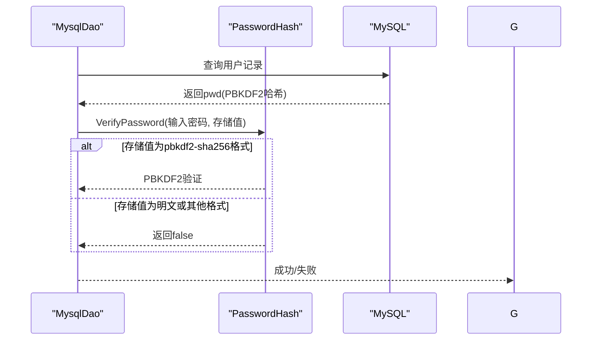
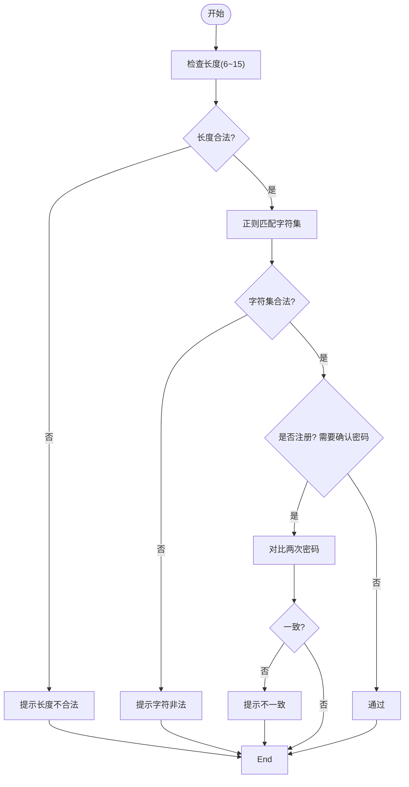
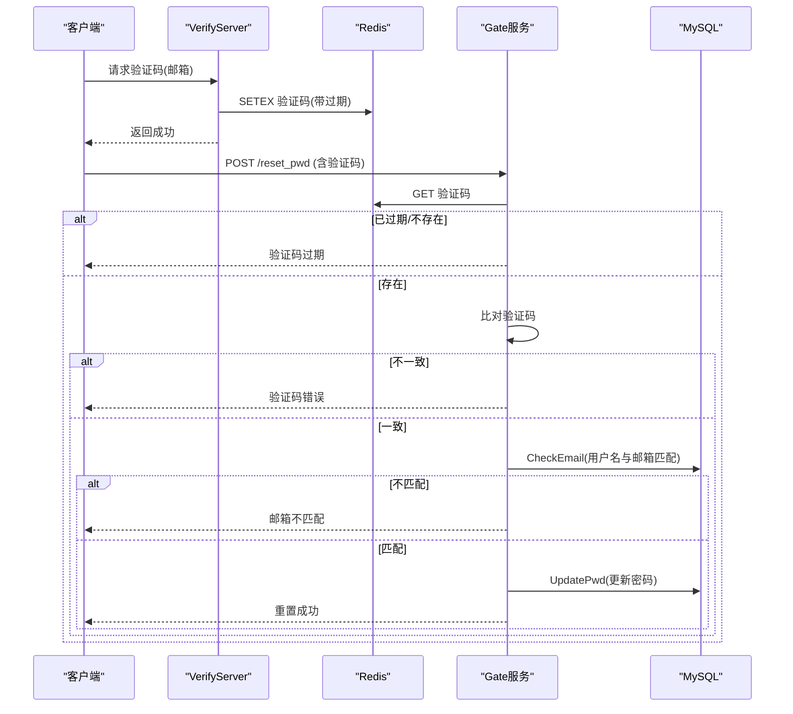
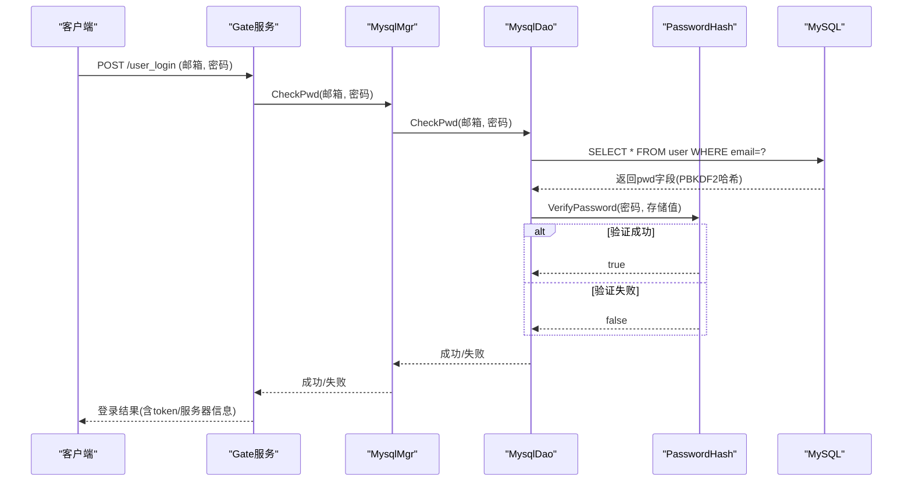
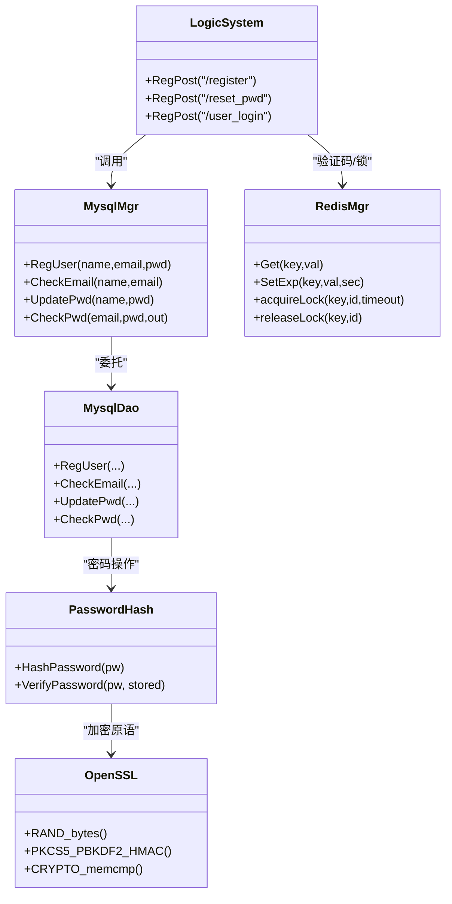
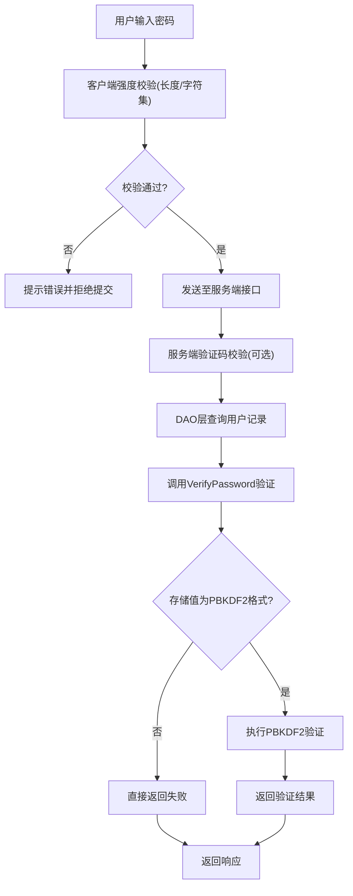

# 密码安全策略

<cite>
**本文引用的文件**   
- [PasswordHash.h](file://server/common/include/PasswordHash.h)
- [PasswordHash.cpp](file://server/common/src/PasswordHash.cpp)
- [password_hash_tests.cpp](file://tests/password_hash_tests.cpp)
- [MysqlDao.cpp](file://server/GateServer/src/MysqlDao.cpp)
- [MysqlDao.cpp](file://server/ChatServer/src/MysqlDao.cpp)
- [MysqlDao.cpp](file://server/ResourceServer/src/MysqlDao.cpp)
- [logindialog.cpp](file://client/llfcchat/src/logindialog.cpp)
- [registerdialog.cpp](file://client/llfcchat/src/registerdialog.cpp)
- [resetdialog.cpp](file://client/llfcchat/src/resetdialog.cpp)
- [LogicSystem.cpp](file://server/GateServer/src/LogicSystem.cpp)
- [MysqlMgr.h](file://server/ChatServer/include/MysqlMgr.h)
- [MysqlMgr.cpp](file://server/ChatServer/src/MysqlMgr.cpp)
- [day13-重置界面.md](file://开发文档/day13-重置界面.md)
- [day14-登录功能.md](file://开发文档/day14-登录功能.md)
- [day10-多服务验证码派发功能调试.md](file://开发文档/day10-多服务验证码派发功能调试.md)
- [day32分布式锁设计思路.md](file://开发文档/day32分布式锁设计思路.md)
- [day35心跳逻辑.md](file://开发文档/day35心跳逻辑.md)
- [20260804_pwd_pbkdf2.sql](file://sql备份/20260804_pwd_pbkdf2.sql)
</cite>

## 更新摘要
**所做更改**   
- 删除了PBKDF2密码的渐进式迁移框架（legacy明文兼容 + rehash-on-login），改为硬切换模式
- VerifyPassword现在只接受pbkdf2-sha256格式，非该格式一律校验失败
- 删除了ShouldRehash函数和ConstantTimeEquals辅助函数
- 移除了所有服务中的rehash-on-login逻辑
- 简化了密码验证流程，提高了安全性

## 目录
1. [引言](#引言)
2. [项目结构](#项目结构)
3. [核心组件](#核心组件)
4. [架构总览](#架构总览)
5. [详细组件分析](#详细组件分析)
6. [依赖关系分析](#依赖关系分析)
7. [性能与安全考量](#性能与安全考量)
8. [故障排查指南](#故障排查指南)
9. [结论](#结论)
10. [附录：流程图与最佳实践](#附录流程图与最佳实践)

## 引言
本文件面向LLFCChat的密码安全策略，系统梳理密码强度校验、验证码流程、密码重置链路、以及基于PBKDF2-HMAC-SHA256的现代化密码存储与验证实现。经过最新的硬切换升级，系统已完全摒弃遗留明文兼容机制，采用严格的PBKDF2哈希验证，确保所有用户密码均以安全形式存储和验证。

## 项目结构
与密码安全相关的关键路径包括：
- 客户端输入与前端校验：登录、注册、重置界面的密码规则检查与提示
- 服务端HTTP接口：注册、重置密码、登录三大接口的处理流程
- 数据访问层：MySQL DAO对用户的增删改查与密码比对
- 验证码与临时令牌：Redis缓存验证码、过期控制与分布式锁
- **已更新**：PBKDF2-HMAC-SHA256密码哈希库，提供严格的安全密码存储和验证功能

**图示来源** 
- [PasswordHash.h:1-28](file://server/common/include/PasswordHash.h#L1-L28)
- [PasswordHash.cpp:1-128](file://server/common/src/PasswordHash.cpp#L1-L128)
- [MysqlDao.cpp:270-274](file://server/GateServer/src/MysqlDao.cpp#L270-L274)

**章节来源**
- [logindialog.cpp:143-166](file://client/llfcchat/src/logindialog.cpp#L143-L166)
- [registerdialog.cpp:181-248](file://client/llfcchat/src/registerdialog.cpp#L181-L248)
- [resetdialog.cpp:116-161](file://client/llfcchat/src/resetdialog.cpp#L116-L161)
- [LogicSystem.cpp:200-399](file://server/GateServer/src/LogicSystem.cpp#L200-L399)
- [MysqlMgr.h:8-26](file://server/ChatServer/include/MysqlMgr.h#L8-L26)
- [MysqlMgr.cpp:8-26](file://server/ChatServer/src/MysqlMgr.cpp#L8-L26)
- [MysqlDao.cpp:19-167](file://server/ChatServer/src/MysqlDao.cpp#L19-L167)

## 核心组件
- **PBKDF2-HMAC-SHA256密码哈希库**
  - 使用OpenSSL libcrypto实现标准PBKDF2算法
  - 600,000次迭代（OWASP推荐值）
  - 16字节随机盐值生成
  - 32字节派生密钥输出
  - 自描述存储格式：`pbkdf2-sha256$i=<iter>$<salt_hex>$<dk_hex>`
- **硬切换验证机制**
  - VerifyPassword仅接受pbkdf2-sha256格式
  - 明文或畸形值一律返回false
  - 移除了ShouldRehash函数和ConstantTimeEquals辅助函数
- **客户端密码强度校验**
  - 长度限制：6~15位
  - 字符集限制：字母、数字及特殊字符
  - 确认密码一致性校验（注册）
- **验证码与临时令牌**
  - 验证码生成与发送（邮件）
  - Redis存储验证码并设置过期时间
  - 重置流程中验证码校验与邮箱匹配校验

**章节来源**
- [PasswordHash.h:15-25](file://server/common/include/PasswordHash.h#L15-L25)
- [PasswordHash.cpp:117-125](file://server/common/src/PasswordHash.cpp#L117-L125)
- [MysqlDao.cpp:270-274](file://server/GateServer/src/MysqlDao.cpp#L270-L274)
- [logindialog.cpp:143-166](file://client/llfcchat/src/logindialog.cpp#L143-L166)
- [registerdialog.cpp:181-248](file://client/llfcchat/src/registerdialog.cpp#L181-L248)
- [resetdialog.cpp:116-161](file://client/llfcchat/src/resetdialog.cpp#L116-L161)

## 架构总览
下图展示注册、重置、登录三个关键流程的数据流与控制流，体现客户端校验、Gate服务逻辑、Redis验证码、MySQL持久化之间的交互，以及PBKDF2密码哈希的集成点。注意：已移除rehash-on-login逻辑，所有密码验证均为硬切换模式。

**图示来源** 
- [LogicSystem.cpp:200-399](file://server/GateServer/src/LogicSystem.cpp#L200-L399)
- [MysqlDao.cpp:270-274](file://server/GateServer/src/MysqlDao.cpp#L270-L274)
- [PasswordHash.cpp:117-125](file://server/common/src/PasswordHash.cpp#L117-L125)

## 详细组件分析

### PBKDF2-HMAC-SHA256密码哈希实现
**已更新** 实现了严格的PBKDF2-HMAC-SHA256密码哈希解决方案，移除了所有遗留兼容性

- **算法参数配置**
  - 迭代次数：600,000次（符合OWASP推荐标准）
  - 盐值长度：16字节随机数
  - 密钥长度：32字节（256位）
  - 哈希算法：HMAC-SHA256
- **存储格式设计**
  - 自描述格式：`pbkdf2-sha256$i=<iter>$<salt_hex>$<dk_hex>`
  - 不支持未来工作因子升级而不破坏现有哈希
  - 十六进制编码便于存储和传输
- **安全特性**
  - OpenSSL底层实现确保硬件加速支持
  - 异常安全的API设计，避免抛出异常
  - 硬切换模式，拒绝所有非PBKDF2格式

**图示来源** 
- [PasswordHash.cpp:97-115](file://server/common/src/PasswordHash.cpp#L97-L115)
- [PasswordHash.cpp:84-93](file://server/common/src/PasswordHash.cpp#L84-L93)

**章节来源**
- [PasswordHash.h:15-25](file://server/common/include/PasswordHash.h#L15-L25)
- [PasswordHash.cpp:97-115](file://server/common/src/PasswordHash.cpp#L97-L115)
- [password_hash_tests.cpp:29-48](file://tests/password_hash_tests.cpp#L29-L48)

### 硬切换验证机制
**已更新** 实现了严格的密码验证，移除了所有遗留兼容性

- **严格格式验证**
  - VerifyPassword仅接受pbkdf2-sha256格式
  - 明文或畸形值一律返回false
  - 移除了ConstantTimeEquals辅助函数
- **简化的验证流程**
  - ParseHash失败后直接返回false
  - 不再支持明文比较
  - 移除了ShouldRehash函数
- **统一的安全策略**
  - 所有用户必须使用PBKDF2哈希
  - 存量明文用户需通过重置流程更新
  - 同一连接内执行UPDATE避免重复连接获取

**图示来源** 
- [PasswordHash.cpp:117-125](file://server/common/src/PasswordHash.cpp#L117-L125)
- [MysqlDao.cpp:270-274](file://server/GateServer/src/MysqlDao.cpp#L270-L274)

**章节来源**
- [PasswordHash.cpp:117-125](file://server/common/src/PasswordHash.cpp#L117-L125)
- [MysqlDao.cpp:270-274](file://server/GateServer/src/MysqlDao.cpp#L270-L274)

### 数据库存储与迁移
**已更新** 数据库层完全支持PBKDF2哈希存储，移除了迁移逻辑

- **存储格式要求**
  - 所有用户必须存储PBKDF2哈希
  - 不再支持明文存储
  - 数据库排序规则为utf8mb4_bin防止大小写敏感问题
- **注册流程优化**
  - 用户注册时立即进行PBKDF2哈希
  - 事务性插入确保数据一致性
  - 自增ID回填为用户UID
- **密码更新安全**
  - UpdatePwd方法同样使用PBKDF2哈希
  - 错误处理和连接池管理完善
  - 日志记录便于问题追踪

**章节来源**
- [MysqlDao.cpp:115-130](file://server/GateServer/src/MysqlDao.cpp#L115-L130)
- [MysqlDao.cpp:205-239](file://server/GateServer/src/MysqlDao.cpp#L205-L239)
- [20260804_pwd_pbkdf2.sql:1-15](file://sql备份/20260804_pwd_pbkdf2.sql#L1-L15)

### 客户端密码强度校验
- 登录对话框
  - 长度校验：6~15位
  - 正则校验：仅允许字母、数字与部分特殊字符
- 注册对话框
  - 长度与正则校验同登录
  - 新增"确认密码"一致性校验
- 重置对话框
  - 长度与正则校验同登录
  - 邮箱格式校验与验证码非空校验

**图示来源** 
- [logindialog.cpp:143-166](file://client/llfcchat/src/logindialog.cpp#L143-L166)
- [registerdialog.cpp:181-248](file://client/llfcchat/src/registerdialog.cpp#L181-L248)
- [resetdialog.cpp:116-161](file://client/llfcchat/src/resetdialog.cpp#L116-L161)

**章节来源**
- [logindialog.cpp:143-166](file://client/llfcchat/src/logindialog.cpp#L143-L166)
- [registerdialog.cpp:181-248](file://client/llfcchat/src/registerdialog.cpp#L181-L248)
- [resetdialog.cpp:116-161](file://client/llfcchat/src/resetdialog.cpp#L116-L161)

### 验证码与临时令牌
- 验证码生成与发送
  - VerifyServer根据邮箱生成短验证码，写入Redis并设置过期时间（例如600秒）
  - 通过邮件发送给用户
- 重置流程中的验证码校验
  - Gate服务从Redis读取验证码，校验是否存在与是否过期
  - 比对用户输入的验证码与服务端存储值
  - 进一步校验用户名与邮箱匹配，防止恶意重置他人密码
- 分布式锁与会话管理
  - 使用Redis分布式锁避免并发冲突
  - 心跳与过期判断保证会话生命周期可控

**图示来源** 
- [day10-多服务验证码派发功能调试.md:128-180](file://开发文档/day10-多服务验证码派发功能调试.md#L128-L180)
- [LogicSystem.cpp:235-316](file://server/GateServer/src/LogicSystem.cpp#L235-L316)
- [MysqlDao.cpp:168-203](file://server/GateServer/src/MysqlDao.cpp#L168-L203)

**章节来源**
- [day10-多服务验证码派发功能调试.md:128-180](file://开发文档/day10-多服务验证码派发功能调试.md#L128-L180)
- [LogicSystem.cpp:235-316](file://server/GateServer/src/LogicSystem.cpp#L235-L316)
- [MysqlDao.cpp:168-203](file://server/GateServer/src/MysqlDao.cpp#L168-L203)

### 登录与密码比对
**已更新** 登录流程集成了PBKDF2密码验证，移除了自动迁移逻辑

- 登录接口
  - Gate服务解析请求体，提取邮箱与密码
  - 调用MysqlMgr.CheckPwd进行用户名/邮箱与密码比对
  - 成功后返回用户信息与Token，供后续TCP连接认证
- 密码比对实现现状
  - DAO层查询用户记录后使用VerifyPassword进行验证
  - 仅支持PBKDF2哈希格式的统一验证接口
  - 移除了rehash-on-login迁移逻辑

**图示来源** 
- [LogicSystem.cpp:318-395](file://server/GateServer/src/LogicSystem.cpp#L318-L395)
- [MysqlMgr.cpp:24-26](file://server/ChatServer/src/MysqlMgr.cpp#L24-L26)
- [MysqlDao.cpp:270-274](file://server/GateServer/src/MysqlDao.cpp#L270-L274)
- [PasswordHash.cpp:117-125](file://server/common/src/PasswordHash.cpp#L117-L125)

**章节来源**
- [LogicSystem.cpp:318-395](file://server/GateServer/src/LogicSystem.cpp#L318-L395)
- [MysqlMgr.cpp:24-26](file://server/ChatServer/src/MysqlMgr.cpp#L24-L26)
- [MysqlDao.cpp:270-274](file://server/GateServer/src/MysqlDao.cpp#L270-L274)

## 依赖关系分析
- Gate服务依赖MysqlMgr与Redis
  - MysqlMgr封装DAO层操作，DAO负责具体SQL执行
  - Redis用于验证码与分布式锁、会话状态
- **已更新** PasswordHash库依赖
  - 所有密码操作都通过PasswordHash库进行
  - 依赖OpenSSL libcrypto进行底层加密操作
  - 移除了ShouldRehash和ConstantTimeEquals函数
- 客户端依赖HTTP与TCP通信
  - HTTP用于注册、重置、登录
  - TCP用于聊天消息与实时通信

**图示来源** 
- [LogicSystem.cpp:200-399](file://server/GateServer/src/LogicSystem.cpp#L200-L399)
- [MysqlMgr.h:8-26](file://server/ChatServer/include/MysqlMgr.h#L8-L26)
- [MysqlMgr.cpp:8-26](file://server/ChatServer/src/MysqlMgr.cpp#L8-L26)
- [MysqlDao.h:236-267](file://server/ChatServer/include/MysqlDao.h#L236-L267)
- [MysqlDao.cpp:19-167](file://server/ChatServer/src/MysqlDao.cpp#L19-L167)
- [PasswordHash.h:1-28](file://server/common/include/PasswordHash.h#L1-L28)

**章节来源**
- [LogicSystem.cpp:200-399](file://server/GateServer/src/LogicSystem.cpp#L200-L399)
- [MysqlMgr.h:8-26](file://server/ChatServer/include/MysqlMgr.h#L8-L26)
- [MysqlMgr.cpp:8-26](file://server/ChatServer/src/MysqlMgr.cpp#L8-L26)
- [MysqlDao.h:236-267](file://server/ChatServer/include/MysqlDao.h#L236-L267)
- [MysqlDao.cpp:19-167](file://server/ChatServer/src/MysqlDao.cpp#L19-L167)

## 性能与安全考量
**已更新** 全面评估了PBKDF2实现的性能和安全特性

- **性能优化**
  - MySQL连接池与存活检测降低连接开销
  - Redis高吞吐支撑验证码与锁的快速读写
  - PBKDF2哈希计算约需1秒（600,000次迭代）
  - 移除了rehash-on-login逻辑，减少不必要的数据库更新
- **安全增强**
  - PBKDF2-HMAC-SHA256提供抗暴力破解能力
  - 硬切换模式确保所有密码均为安全哈希
  - 随机盐值确保相同密码产生不同哈希
  - 验证码有效期与邮箱匹配校验有效降低重置滥用
  - 分布式锁避免并发写冲突，但需配合幂等性设计
- **兼容性考虑**
  - 移除了向后兼容明文存储的用户
  - 存量用户需通过重置流程更新密码
  - 数据库排序规则升级防止大小写敏感问题

## 故障排查指南
- **密码哈希相关问题**
  - 检查PasswordHash库是否正确链接OpenSSL
  - 验证PBKDF2迭代参数和工作因子配置
  - 检查哈希格式是否符合自描述规范
  - 确认所有用户密码均为PBKDF2格式
- **验证码相关问题**
  - 检查Redis键是否存在与是否过期
  - 核对验证码生成与发送流程
- **登录失败**
  - 检查DAO层密码比对逻辑与数据库记录
  - 确认请求参数与字段名一致
  - 确认用户密码是否为PBKDF2格式
- **重置失败**
  - 校验验证码是否正确
  - 校验用户名与邮箱是否匹配
  - 检查UpdatePwd执行结果与异常日志

**章节来源**
- [day10-多服务验证码派发功能调试.md:128-180](file://开发文档/day10-多服务验证码派发功能调试.md#L128-L180)
- [LogicSystem.cpp:235-316](file://server/GateServer/src/LogicSystem.cpp#L235-L316)
- [MysqlDao.cpp:168-203](file://server/GateServer/src/MysqlDao.cpp#L168-L203)
- [MysqlDao.cpp:270-274](file://server/GateServer/src/MysqlDao.cpp#L270-L274)

## 结论
LLFCChat已成功完成从明文存储到PBKDF2-HMAC-SHA256加盐哈希的全面迁移，并通过硬切换模式彻底移除了遗留兼容性。新的密码安全体系提供了强大的抗暴力破解能力、彩虹表防护和时序攻击防御。系统现在具备了企业级的密码安全管理能力，能够有效抵御现代密码学攻击手段。所有用户密码均以安全形式存储和验证，确保了系统的整体安全性。

## 附录：流程图与最佳实践

### 完整密码处理流程图
**已更新** 包含了PBKDF2哈希和硬切换模式的完整流程

[该图为概念性流程图，不映射具体源码文件]

### 安全最佳实践清单
**已更新** 基于PBKDF2实现的最新安全建议

- **密码存储**
  - ✅ 使用PBKDF2-HMAC-SHA256并随机盐（已实现）
  - ✅ 600,000次迭代（符合OWASP标准）
  - ✅ 硬切换模式，拒绝明文存储（已实现）
  - ✅ 禁止明文存储与日志打印敏感信息（已实现）
- **传输安全**
  - 全链路HTTPS/TLS，禁用明文HTTP
- **验证码与令牌**
  - 验证码短时效、一次性使用；令牌签名与短期有效期
- **复杂度与弱口令**
  - 扩展正则规则，增加大小写、数字、特殊字符比例要求
  - 内置常见弱口令黑名单检测
- **审计与监控**
  - 记录登录与重置尝试次数，触发风控阈值告警
- **定期更新**
  - 提供强制更新策略与历史密码不可复用机制
- **迁移策略**
  - ✅ 硬切换模式确保所有密码均为PBKDF2格式（已实现）
  - ❌ 移除了向后兼容明文存储（已废弃）

[本节为通用指导，不直接分析具体文件]

### PBKDF2测试用例覆盖
**已更新** 全面的单元测试确保密码哈希功能的正确性

测试覆盖了以下场景：
- 基本哈希生成和验证
- 相同密码产生不同哈希（盐值随机性）
- 明文和哈希值的统一验证
- 边界情况和错误处理
- 二进制密码支持
- 迭代次数变化检测
- 硬切换模式下的格式验证

**章节来源**
- [password_hash_tests.cpp:25-64](file://tests/password_hash_tests.cpp#L25-L64)