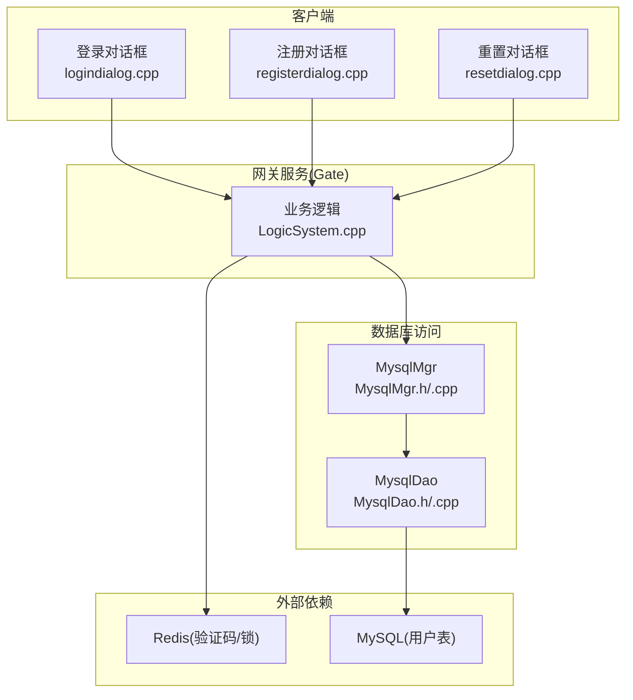
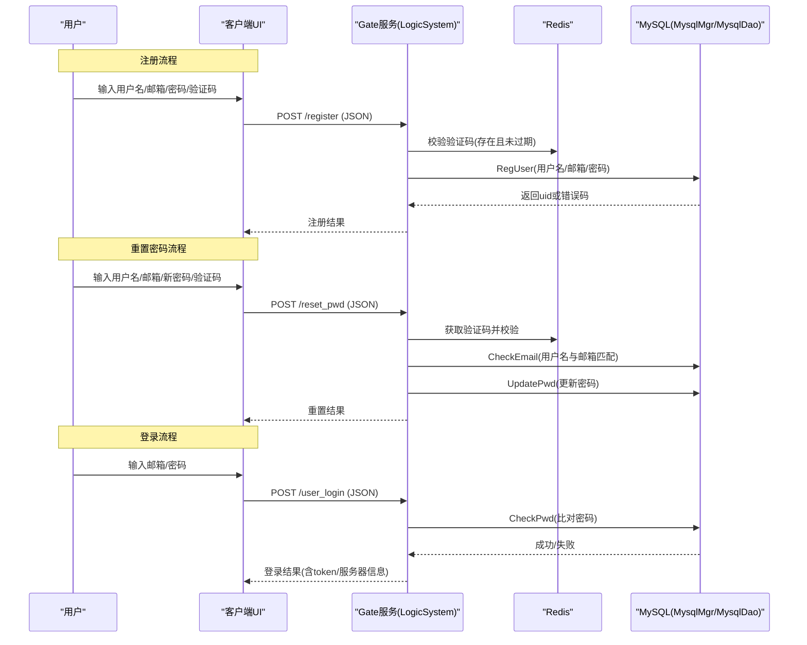
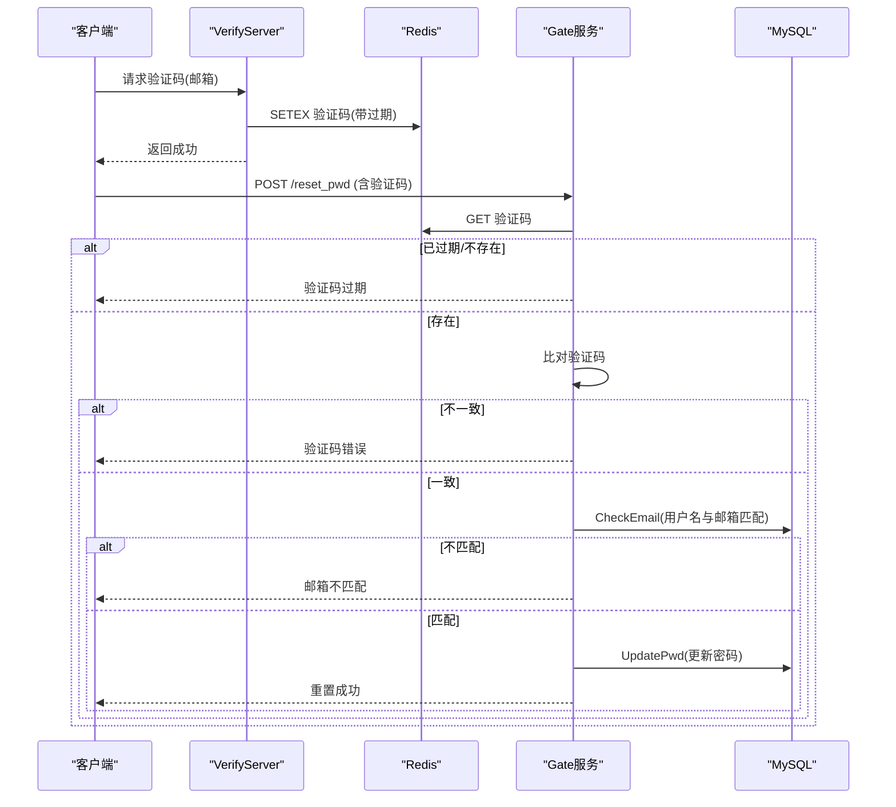
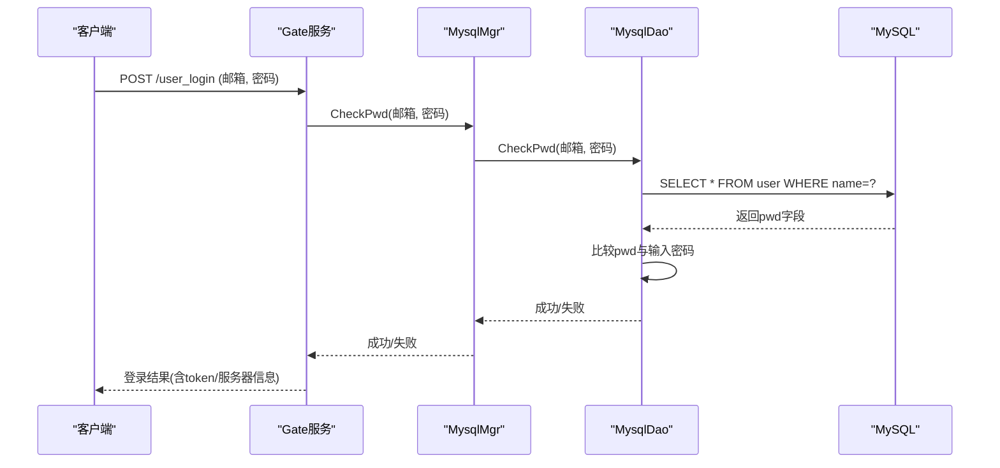
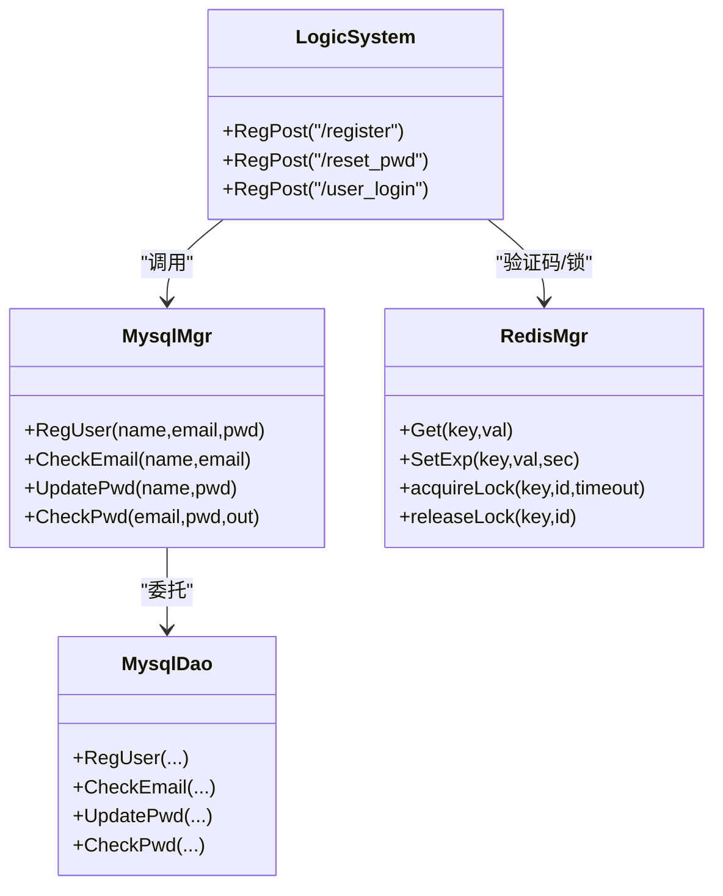
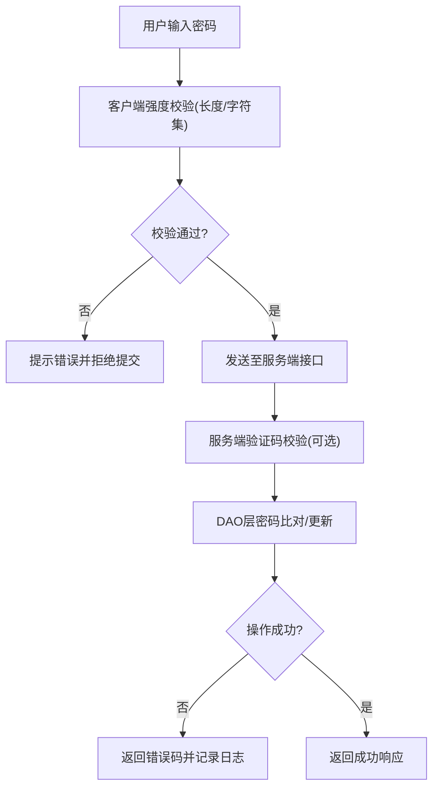

# 密码安全策略

<cite>
**本文引用的文件**   
- [logindialog.cpp](file://client/llfcchat/src/logindialog.cpp)
- [registerdialog.cpp](file://client/llfcchat/src/registerdialog.cpp)
- [resetdialog.cpp](file://client/llfcchat/src/resetdialog.cpp)
- [LogicSystem.cpp](file://server/GateServer/src/LogicSystem.cpp)
- [MysqlDao.h](file://server/ChatServer/include/MysqlDao.h)
- [MysqlDao.cpp](file://server/ChatServer/src/MysqlDao.cpp)
- [MysqlMgr.h](file://server/ChatServer/include/MysqlMgr.h)
- [MysqlMgr.cpp](file://server/ChatServer/src/MysqlMgr.cpp)
- [day13-重置界面.md](file://开发文档/day13-重置界面.md)
- [day14-登录功能.md](file://开发文档/day14-登录功能.md)
- [day10-多服务验证码派发功能调试.md](file://开发文档/day10-多服务验证码派发功能调试.md)
- [day32分布式锁设计思路.md](file://开发文档/day32分布式锁设计思路.md)
- [day35心跳逻辑.md](file://开发文档/day35心跳逻辑.md)
</cite>

## 目录
1. [引言](#引言)
2. [项目结构](#项目结构)
3. [核心组件](#核心组件)
4. [架构总览](#架构总览)
5. [详细组件分析](#详细组件分析)
6. [依赖关系分析](#依赖关系分析)
7. [性能与安全考量](#性能与安全考量)
8. [故障排查指南](#故障排查指南)
9. [结论](#结论)
10. [附录：流程图与最佳实践](#附录流程图与最佳实践)

## 引言
本文件面向LLFCChat的密码安全策略，系统梳理密码强度校验、验证码流程、密码重置链路、以及存储与验证实现现状。基于仓库代码与开发文档，明确当前实现的安全能力与不足，并给出可落地的改进建议（如引入加盐哈希、彩虹表防护、定期更新策略等），帮助读者在不改动现有业务语义的前提下提升整体安全性。

## 项目结构
与密码安全相关的关键路径包括：
- 客户端输入与前端校验：登录、注册、重置界面的密码规则检查与提示
- 服务端HTTP接口：注册、重置密码、登录三大接口的处理流程
- 数据访问层：MySQL DAO/MGR对用户的增删改查与密码比对
- 验证码与临时令牌：Redis缓存验证码、过期控制与分布式锁

**图示来源** 
- [logindialog.cpp](file://client/llfcchat/src/logindialog.cpp)
- [registerdialog.cpp](file://client/llfcchat/src/registerdialog.cpp)
- [resetdialog.cpp](file://client/llfcchat/src/resetdialog.cpp)
- [LogicSystem.cpp](file://server/GateServer/src/LogicSystem.cpp)
- [MysqlMgr.h](file://server/ChatServer/include/MysqlMgr.h)
- [MysqlMgr.cpp](file://server/ChatServer/src/MysqlMgr.cpp)
- [MysqlDao.h](file://server/ChatServer/include/MysqlDao.h)
- [MysqlDao.cpp](file://server/ChatServer/src/MysqlDao.cpp)

**章节来源**
- [logindialog.cpp:143-166](file://client/llfcchat/src/logindialog.cpp#L143-L166)
- [registerdialog.cpp:181-248](file://client/llfcchat/src/registerdialog.cpp#L181-L248)
- [resetdialog.cpp:116-161](file://client/llfcchat/src/resetdialog.cpp#L116-L161)
- [LogicSystem.cpp:200-399](file://server/GateServer/src/LogicSystem.cpp#L200-L399)
- [MysqlMgr.h:8-26](file://server/ChatServer/include/MysqlMgr.h#L8-L26)
- [MysqlMgr.cpp:8-26](file://server/ChatServer/src/MysqlMgr.cpp#L8-L26)
- [MysqlDao.h:236-267](file://server/ChatServer/include/MysqlDao.h#L236-L267)
- [MysqlDao.cpp:19-167](file://server/ChatServer/src/MysqlDao.cpp#L19-L167)

## 核心组件
- 客户端密码强度校验
  - 长度限制：6~15位
  - 字符集限制：字母、数字及少量特殊字符
  - 确认密码一致性校验（注册）
- 验证码与临时令牌
  - 验证码生成与发送（邮件）
  - Redis存储验证码并设置过期时间
  - 重置流程中验证码校验与邮箱匹配校验
- 登录与密码比对
  - 登录接口调用DAO层进行用户名/邮箱与密码比对
  - 返回会话令牌用于后续TCP连接认证
- 密码存储现状
  - 当前代码在多处直接比较明文或原始字符串
  - 未实现加盐哈希与安全的密码存储机制

**章节来源**
- [logindialog.cpp:143-166](file://client/llfcchat/src/logindialog.cpp#L143-L166)
- [registerdialog.cpp:181-248](file://client/llfcchat/src/registerdialog.cpp#L181-L248)
- [resetdialog.cpp:116-161](file://client/llfcchat/src/resetdialog.cpp#L116-L161)
- [LogicSystem.cpp:318-395](file://server/GateServer/src/LogicSystem.cpp#L318-L395)
- [MysqlDao.cpp:125-167](file://server/ChatServer/src/MysqlDao.cpp#L125-L167)

## 架构总览
下图展示注册、重置、登录三个关键流程的数据流与控制流，体现客户端校验、Gate服务逻辑、Redis验证码、MySQL持久化之间的交互。

**图示来源** 
- [LogicSystem.cpp:200-399](file://server/GateServer/src/LogicSystem.cpp#L200-L399)
- [MysqlMgr.h:8-26](file://server/ChatServer/include/MysqlMgr.h#L8-L26)
- [MysqlMgr.cpp:8-26](file://server/ChatServer/src/MysqlMgr.cpp#L8-L26)
- [MysqlDao.cpp:19-167](file://server/ChatServer/src/MysqlDao.cpp#L19-L167)
- [day10-多服务验证码派发功能调试.md:128-180](file://开发文档/day10-多服务验证码派发功能调试.md#L128-L180)

## 详细组件分析

### 客户端密码强度校验
- 登录对话框
  - 长度校验：6~15位
  - 正则校验：仅允许字母、数字与部分特殊字符
- 注册对话框
  - 长度与正则校验同登录
  - 新增“确认密码”一致性校验
- 重置对话框
  - 长度与正则校验同登录
  - 邮箱格式校验与验证码非空校验

**图示来源** 
- [logindialog.cpp:143-166](file://client/llfcchat/src/logindialog.cpp#L143-L166)
- [registerdialog.cpp:181-248](file://client/llfcchat/src/registerdialog.cpp#L181-L248)
- [resetdialog.cpp:116-161](file://client/llfcchat/src/resetdialog.cpp#L116-L161)

**章节来源**
- [logindialog.cpp:143-166](file://client/llfcchat/src/logindialog.cpp#L143-L166)
- [registerdialog.cpp:181-248](file://client/llfcchat/src/registerdialog.cpp#L181-L248)
- [resetdialog.cpp:116-161](file://client/llfcchat/src/resetdialog.cpp#L116-L161)

### 验证码与临时令牌
- 验证码生成与发送
  - VerifyServer根据邮箱生成短验证码，写入Redis并设置过期时间（例如600秒）
  - 通过邮件发送给用户
- 重置流程中的验证码校验
  - Gate服务从Redis读取验证码，校验是否存在与是否过期
  - 比对用户输入的验证码与服务端存储值
  - 进一步校验用户名与邮箱匹配，防止恶意重置他人密码
- 分布式锁与会话管理
  - 使用Redis分布式锁避免并发冲突
  - 心跳与过期判断保证会话生命周期可控

**图示来源** 
- [day10-多服务验证码派发功能调试.md:128-180](file://开发文档/day10-多服务验证码派发功能调试.md#L128-L180)
- [LogicSystem.cpp:235-316](file://server/GateServer/src/LogicSystem.cpp#L235-L316)
- [MysqlDao.cpp:96-124](file://server/ChatServer/src/MysqlDao.cpp#L96-L124)

**章节来源**
- [day10-多服务验证码派发功能调试.md:128-180](file://开发文档/day10-多服务验证码派发功能调试.md#L128-L180)
- [LogicSystem.cpp:235-316](file://server/GateServer/src/LogicSystem.cpp#L235-L316)
- [MysqlDao.cpp:96-124](file://server/ChatServer/src/MysqlDao.cpp#L96-L124)

### 登录与密码比对
- 登录接口
  - Gate服务解析请求体，提取邮箱与密码
  - 调用MysqlMgr.CheckPwd进行用户名/邮箱与密码比对
  - 成功后返回用户信息与Token，供后续TCP连接认证
- 密码比对实现现状
  - DAO层查询用户记录后直接比较原始密码字符串
  - 未使用任何哈希或加盐机制

**图示来源** 
- [LogicSystem.cpp:318-395](file://server/GateServer/src/LogicSystem.cpp#L318-L395)
- [MysqlMgr.cpp:24-26](file://server/ChatServer/src/MysqlMgr.cpp#L24-L26)
- [MysqlDao.cpp:125-167](file://server/ChatServer/src/MysqlDao.cpp#L125-L167)

**章节来源**
- [LogicSystem.cpp:318-395](file://server/GateServer/src/LogicSystem.cpp#L318-L395)
- [MysqlMgr.cpp:24-26](file://server/ChatServer/src/MysqlMgr.cpp#L24-L26)
- [MysqlDao.cpp:125-167](file://server/ChatServer/src/MysqlDao.cpp#L125-L167)

### 密码存储机制现状与风险
- 现状
  - 注册时直接保存原始密码到数据库
  - 登录与重置均基于原始密码比较或更新
- 风险
  - 明文存储导致数据库泄露即全盘失守
  - 易受彩虹表攻击与批量破解
  - 无法支持密码历史与强制更新策略

**章节来源**
- [MysqlDao.cpp:19-57](file://server/ChatServer/src/MysqlDao.cpp#L19-L57)
- [MysqlDao.cpp:96-124](file://server/ChatServer/src/MysqlDao.cpp#L96-L124)
- [MysqlDao.cpp:125-167](file://server/ChatServer/src/MysqlDao.cpp#L125-L167)

## 依赖关系分析
- Gate服务依赖MysqlMgr与Redis
  - MysqlMgr封装DAO层操作，DAO负责具体SQL执行
  - Redis用于验证码与分布式锁、会话状态
- 客户端依赖HTTP与TCP通信
  - HTTP用于注册、重置、登录
  - TCP用于聊天消息与实时通信

**图示来源** 
- [LogicSystem.cpp:200-399](file://server/GateServer/src/LogicSystem.cpp#L200-L399)
- [MysqlMgr.h:8-26](file://server/ChatServer/include/MysqlMgr.h#L8-L26)
- [MysqlMgr.cpp:8-26](file://server/ChatServer/src/MysqlMgr.cpp#L8-L26)
- [MysqlDao.h:236-267](file://server/ChatServer/include/MysqlDao.h#L236-L267)
- [MysqlDao.cpp:19-167](file://server/ChatServer/src/MysqlDao.cpp#L19-L167)

**章节来源**
- [LogicSystem.cpp:200-399](file://server/GateServer/src/LogicSystem.cpp#L200-L399)
- [MysqlMgr.h:8-26](file://server/ChatServer/include/MysqlMgr.h#L8-L26)
- [MysqlMgr.cpp:8-26](file://server/ChatServer/src/MysqlMgr.cpp#L8-L26)
- [MysqlDao.h:236-267](file://server/ChatServer/include/MysqlDao.h#L236-L267)
- [MysqlDao.cpp:19-167](file://server/ChatServer/src/MysqlDao.cpp#L19-L167)

## 性能与安全考量
- 性能
  - MySQL连接池与存活检测降低连接开销
  - Redis高吞吐支撑验证码与锁的快速读写
- 安全
  - 当前缺少密码哈希与加盐，存在严重安全风险
  - 验证码有效期与邮箱匹配校验有效降低重置滥用
  - 分布式锁避免并发写冲突，但需配合幂等性设计

[本节为通用指导，不直接分析具体文件]

## 故障排查指南
- 验证码相关问题
  - 检查Redis键是否存在与是否过期
  - 核对验证码生成与发送流程
- 登录失败
  - 检查DAO层密码比对逻辑与数据库记录
  - 确认请求参数与字段名一致
- 重置失败
  - 校验验证码是否正确
  - 校验用户名与邮箱是否匹配
  - 检查UpdatePwd执行结果与异常日志

**章节来源**
- [day10-多服务验证码派发功能调试.md:128-180](file://开发文档/day10-多服务验证码派发功能调试.md#L128-L180)
- [LogicSystem.cpp:235-316](file://server/GateServer/src/LogicSystem.cpp#L235-L316)
- [MysqlDao.cpp:96-124](file://server/ChatServer/src/MysqlDao.cpp#L96-L124)
- [MysqlDao.cpp:125-167](file://server/ChatServer/src/MysqlDao.cpp#L125-L167)

## 结论
当前LLFCChat在密码强度校验、验证码流程与登录/重置接口方面具备基础能力，但密码存储仍为明文，存在重大安全隐患。建议尽快引入加盐哈希（如Argon2id）、彩虹表防护、密码历史与定期更新策略，并对传输层启用TLS加密，以全面提升系统安全性。

[本节为总结性内容，不直接分析具体文件]

## 附录：流程图与最佳实践

### 完整密码处理流程图

[该图为概念性流程图，不映射具体源码文件]

### 安全最佳实践清单
- 密码存储
  - 使用强哈希算法（Argon2id/BCrypt/PBKDF2）并随机盐
  - 禁止明文存储与日志打印敏感信息
- 传输安全
  - 全链路HTTPS/TLS，禁用明文HTTP
- 验证码与令牌
  - 验证码短时效、一次性使用；令牌签名与短期有效期
- 复杂度与弱口令
  - 扩展正则规则，增加大小写、数字、特殊字符比例要求
  - 内置常见弱口令黑名单检测
- 审计与监控
  - 记录登录与重置尝试次数，触发风控阈值告警
- 定期更新
  - 提供强制更新策略与历史密码不可复用机制

[本节为通用指导，不直接分析具体文件]