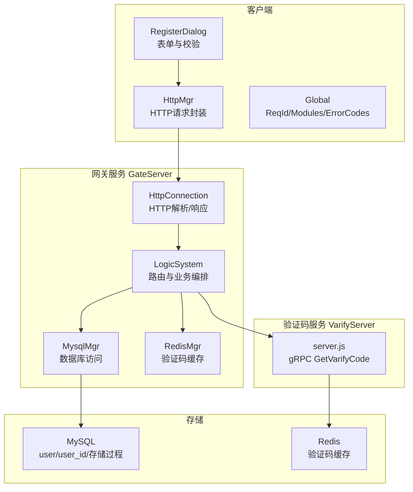
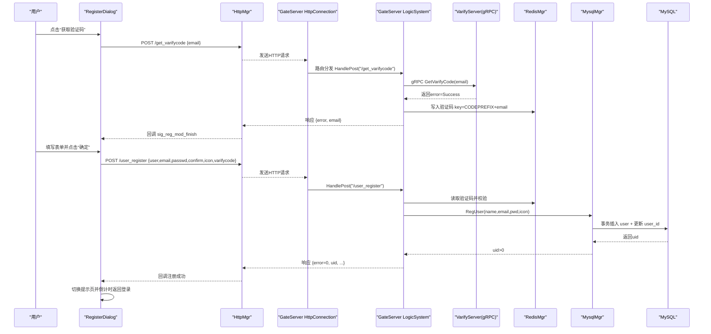
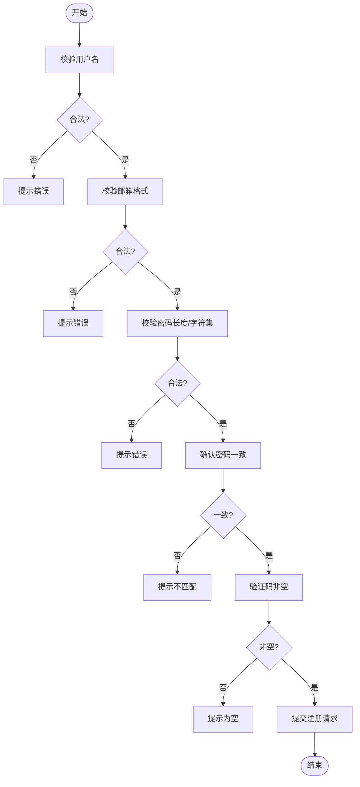
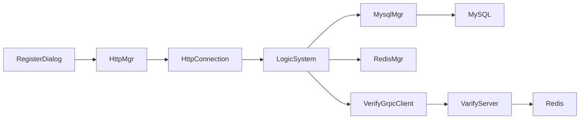
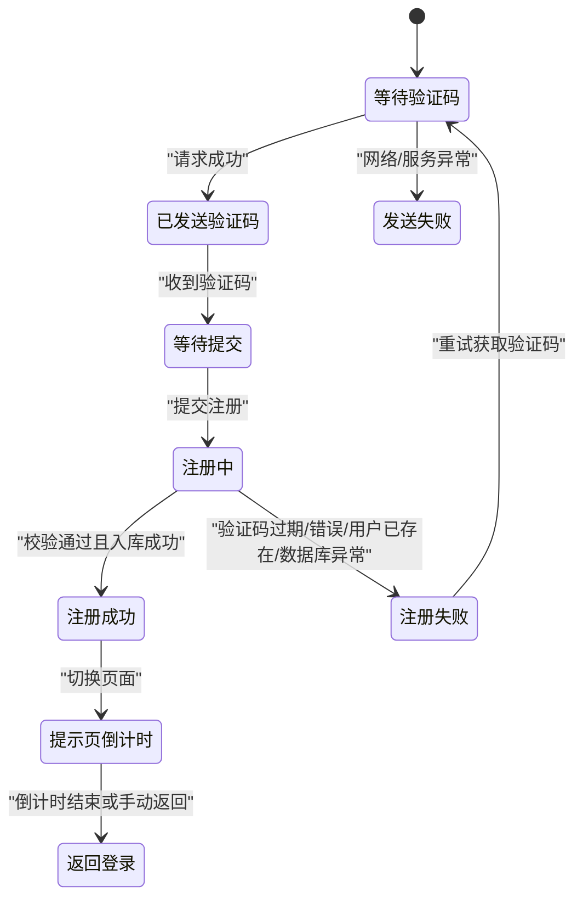

# 用户注册流程

<cite>
**本文引用的文件**   
- [registerdialog.cpp](file://client/llfcchat/src/registerdialog.cpp)
- [registerdialog.h](file://client/llfcchat/include/registerdialog.h)
- [httpmgr.h](file://client/llfcchat/include/httpmgr.h)
- [httpmgr.cpp](file://client/llfcchat/src/httpmgr.cpp)
- [global.h](file://client/llfcchat/include/global.h)
- [HttpConnection.cpp](file://server/GateServer/src/HttpConnection.cpp)
- [HttpConnection.h](file://server/GateServer/include/HttpConnection.h)
- [LogicSystem.cpp](file://server/GateServer/src/LogicSystem.cpp)
- [MysqlMgr.h](file://server/GateServer/include/MysqlMgr.h)
- [MysqlMgr.cpp](file://server/GateServer/src/MysqlMgr.cpp)
- [const.h（GateServer）](file://server/GateServer/include/const.h)
- [server.js（VarifyServer）](file://server/VarifyServer/server.js)
- [llfc3.sql](file://sql备份/llfc3.sql)
</cite>

## 目录
1. [简介](#简介)
2. [项目结构](#项目结构)
3. [核心组件](#核心组件)
4. [架构总览](#架构总览)
5. [详细组件分析](#详细组件分析)
6. [依赖关系分析](#依赖关系分析)
7. [性能考虑](#性能考虑)
8. [故障排查指南](#故障排查指南)
9. [结论](#结论)
10. [附录：API与数据模型](#附录api与数据模型)

## 简介
本文件面向LLFCChat的用户注册流程，覆盖客户端表单验证、邮箱验证码获取与校验、密码加密处理、HTTP API设计与错误码、用户表结构与完整性约束、注册成功后的初始化操作与缓存同步机制，以及状态图与异常处理策略。读者可据此理解从前端输入到后端持久化的完整链路。

## 项目结构
注册功能涉及客户端（Qt/C++）、网关服务（C++）、验证码服务（Node.js/gRPC）、MySQL与Redis等组件。关键路径如下：
- 客户端：注册对话框、HTTP管理器、全局常量与枚举
- 网关服务：HTTP连接处理、路由分发、业务逻辑编排、数据库与缓存访问
- 验证码服务：gRPC接口实现、邮件发送、验证码生成与缓存
- 数据库：用户表结构与注册存储过程

图表来源
- [registerdialog.cpp:1-375](file://client/llfcchat/src/registerdialog.cpp#L1-L375)
- [httpmgr.cpp:1-62](file://client/llfcchat/src/httpmgr.cpp#L1-L62)
- [HttpConnection.cpp:1-225](file://server/GateServer/src/HttpConnection.cpp#L1-L225)
- [LogicSystem.cpp:1-467](file://server/GateServer/src/LogicSystem.cpp#L1-L467)
- [server.js:39-75](file://server/VarifyServer/server.js#L39-L75)
- [llfc3.sql:218-417](file://sql备份/llfc3.sql#L218-L417)

章节来源
- [registerdialog.cpp:1-375](file://client/llfcchat/src/registerdialog.cpp#L1-L375)
- [httpmgr.cpp:1-62](file://client/llfcchat/src/httpmgr.cpp#L1-L62)
- [HttpConnection.cpp:1-225](file://server/GateServer/src/HttpConnection.cpp#L1-L225)
- [LogicSystem.cpp:1-467](file://server/GateServer/src/LogicSystem.cpp#L1-L467)
- [server.js:39-75](file://server/VarifyServer/server.js#L39-L75)
- [llfc3.sql:218-417](file://sql备份/llfc3.sql#L218-L417)

## 核心组件
- 客户端注册对话框：负责表单输入、实时校验、验证码获取、注册提交、结果提示与页面跳转
- HTTP管理器：统一发起POST请求、错误处理、按模块分发回调信号
- 网关HTTP连接：解析HTTP请求、路由分发、统一响应格式
- 网关逻辑系统：注册接口实现，包含参数校验、验证码校验、数据库写入、响应构建
- 验证码服务：gRPC接口返回验证码并写入Redis
- 数据库管理：注册事务、唯一性约束、ID自增分配
- Redis缓存：验证码的生成、过期控制与一致性校验

章节来源
- [registerdialog.h:1-55](file://client/llfcchat/include/registerdialog.h#L1-L55)
- [httpmgr.h:1-34](file://client/llfcchat/include/httpmgr.h#L1-L34)
- [HttpConnection.h:1-36](file://server/GateServer/include/HttpConnection.h#L1-L36)
- [LogicSystem.cpp:148-233](file://server/GateServer/src/LogicSystem.cpp#L148-L233)
- [MysqlMgr.h:1-20](file://server/GateServer/include/MysqlMgr.h#L1-L20)
- [server.js:39-75](file://server/VarifyServer/server.js#L39-L75)
- [llfc3.sql:338-417](file://sql备份/llfc3.sql#L338-L417)

## 架构总览
注册流程时序如下：

图表来源
- [registerdialog.cpp:98-111](file://client/llfcchat/src/registerdialog.cpp#L98-L111)
- [registerdialog.cpp:318-362](file://client/llfcchat/src/registerdialog.cpp#L318-L362)
- [httpmgr.cpp:8-38](file://client/llfcchat/src/httpmgr.cpp#L8-L38)
- [HttpConnection.cpp:132-194](file://server/GateServer/src/HttpConnection.cpp#L132-L194)
- [LogicSystem.cpp:105-147](file://server/GateServer/src/LogicSystem.cpp#L105-L147)
- [LogicSystem.cpp:148-233](file://server/GateServer/src/LogicSystem.cpp#L148-L233)
- [server.js:39-75](file://server/VarifyServer/server.js#L39-L75)
- [llfc3.sql:338-417](file://sql备份/llfc3.sql#L338-L417)

## 详细组件分析

### 客户端注册对话框（RegisterDialog）
- 输入校验
  - 用户名非空、邮箱正则匹配、密码长度与字符集限制、确认密码一致、验证码非空
  - 使用QRegularExpression进行格式校验，并通过TipErr统一管理错误提示
- 验证码获取
  - 点击“获取验证码”后调用HttpMgr发送POST /get_varifycode
  - 成功后显示提示，并在UI上禁用重复发送（通过定时器或按钮状态）
- 注册提交
  - 组装JSON字段：user、email、passwd、confirm、icon、varifycode
  - 密码与确认密码在客户端进行xorString简单混淆后再发送
  - 随机头像选择并设置默认昵称
- 结果处理
  - 根据ReqId分发回调，注册成功时切换到提示页并启动倒计时返回登录

图表来源
- [registerdialog.cpp:142-214](file://client/llfcchat/src/registerdialog.cpp#L142-L214)
- [registerdialog.cpp:318-362](file://client/llfcchat/src/registerdialog.cpp#L318-L362)

章节来源
- [registerdialog.cpp:142-214](file://client/llfcchat/src/registerdialog.cpp#L142-L214)
- [registerdialog.cpp:318-362](file://client/llfcchat/src/registerdialog.cpp#L318-L362)

### HTTP管理器（HttpMgr）
- 统一POST请求封装，设置Content-Type为application/json
- 异步处理网络错误与响应，按Modules分发sig_reg_mod_finish/sig_reset_mod_finish/sig_login_mod_finish
- 注册模块完成回调由RegisterDialog订阅处理

章节来源
- [httpmgr.h:1-34](file://client/llfcchat/include/httpmgr.h#L1-L34)
- [httpmgr.cpp:8-62](file://client/llfcchat/src/httpmgr.cpp#L8-L62)

### 网关HTTP连接（HttpConnection）
- 解析GET/POST请求，提取URL与查询参数
- 将请求转发至LogicSystem进行路由分发
- 未找到路由时返回404；成功则设置200并写回响应体

章节来源
- [HttpConnection.cpp:96-194](file://server/GateServer/src/HttpConnection.cpp#L96-L194)
- [HttpConnection.h:1-36](file://server/GateServer/include/HttpConnection.h#L1-L36)

### 网关逻辑系统（LogicSystem）
- 注册接口 /user_register
  - 解析JSON，校验两次密码一致
  - 从Redis读取验证码并校验是否过期与正确
  - 调用MysqlMgr.RegUser进行事务注册，检查用户名/邮箱唯一性
  - 成功返回uid及用户信息；失败返回对应错误码
- 验证码接口 /get_varifycode
  - 通过gRPC调用VarifyServer发送验证码邮件
  - 将验证码写入Redis（key=CODEPREFIX+email），返回error与email

章节来源
- [LogicSystem.cpp:105-147](file://server/GateServer/src/LogicSystem.cpp#L105-L147)
- [LogicSystem.cpp:148-233](file://server/GateServer/src/LogicSystem.cpp#L148-L233)

### 验证码服务（VarifyServer）
- gRPC接口GetVarifyCode
  - 生成随机验证码，通过SMTP发送邮件
  - 将验证码存入Redis（有效期短，用于注册校验）
  - 返回统一错误码与邮箱

章节来源
- [server.js:39-75](file://server/VarifyServer/server.js#L39-L75)

### 数据库与事务（MysqlMgr/存储过程）
- 注册事务
  - 检查用户名与邮箱唯一性
  - 更新user_id表自增ID，插入user记录
  - 异常回滚并返回错误码；成功返回新uid
- 表结构
  - user表：uid、name、email、pwd、nick、desc、sex、icon等字段，uid与email唯一索引

章节来源
- [MysqlMgr.h:1-20](file://server/GateServer/include/MysqlMgr.h#L1-L20)
- [MysqlMgr.cpp:1-33](file://server/GateServer/src/MysqlMgr.cpp#L1-L33)
- [llfc3.sql:218-241](file://sql备份/llfc3.sql#L218-L241)
- [llfc3.sql:338-417](file://sql备份/llfc3.sql#L338-L417)

## 依赖关系分析
- 客户端依赖：
  - RegisterDialog依赖HttpMgr进行网络通信，依赖Global中的ReqId/Modules/ErrorCodes
- 网关依赖：
  - HttpConnection依赖LogicSystem进行路由分发
  - LogicSystem依赖VerifyGrpcClient、RedisMgr、MysqlMgr、StatusGrpcClient
- 验证码服务依赖：
  - gRPC框架、邮件库、Redis

图表来源
- [registerdialog.cpp:1-375](file://client/llfcchat/src/registerdialog.cpp#L1-L375)
- [httpmgr.cpp:1-62](file://client/llfcchat/src/httpmgr.cpp#L1-L62)
- [HttpConnection.cpp:1-225](file://server/GateServer/src/HttpConnection.cpp#L1-L225)
- [LogicSystem.cpp:1-467](file://server/GateServer/src/LogicSystem.cpp#L1-L467)

章节来源
- [registerdialog.cpp:1-375](file://client/llfcchat/src/registerdialog.cpp#L1-L375)
- [httpmgr.cpp:1-62](file://client/llfcchat/src/httpmgr.cpp#L1-L62)
- [HttpConnection.cpp:1-225](file://server/GateServer/src/HttpConnection.cpp#L1-L225)
- [LogicSystem.cpp:1-467](file://server/GateServer/src/LogicSystem.cpp#L1-L467)

## 性能考虑
- 验证码缓存：Redis提供低延迟存取，避免重复邮件发送与数据库压力
- 事务与唯一性：MySQL事务保证注册原子性，唯一索引防止并发冲突
- 网络层：HTTP短连接减少资源占用；异步IO提升吞吐
- 客户端校验：前置校验降低无效请求到达服务端概率

[本节为通用指导，无需引用具体文件]

## 故障排查指南
- 网络错误
  - 客户端检测QNetworkReply错误，返回ERR_NETWORK，提示“网络请求错误”
- JSON解析错误
  - 服务端解析失败返回Error_Json，客户端提示“json解析错误”
- 验证码问题
  - 过期或未发送：返回VarifyExpired
  - 输入错误：返回VarifyCodeErr
- 用户已存在
  - 用户名或邮箱重复：返回UserExist
- 密码不一致
  - 客户端与服务端均校验，返回PasswdErr
- 数据库异常
  - 存储过程异常回滚，返回错误码（如-1），需检查连接与SQL

章节来源
- [registerdialog.cpp:113-139](file://client/llfcchat/src/registerdialog.cpp#L113-L139)
- [LogicSystem.cpp:148-233](file://server/GateServer/src/LogicSystem.cpp#L148-L233)
- [llfc3.sql:338-417](file://sql备份/llfc3.sql#L338-L417)

## 结论
注册流程通过客户端严格校验、网关统一路由与校验、验证码服务安全下发、Redis缓存保障时效性与一致性、MySQL事务确保数据完整性，形成闭环。建议在生产环境增强密码加密（如bcrypt）、增加限流与防刷策略、完善日志与监控。

[本节为总结，无需引用具体文件]

## 附录：API与数据模型

### HTTP API定义（注册相关）
- GET /get_test
  - 用途：测试GET参数解析
  - 请求：无
  - 响应：text/plain，回显参数键值对
- POST /get_varifycode
  - 请求体：{"email": "xxx@xxx.com"}
  - 响应体：{"error": 0, "email": "xxx@xxx.com"}
  - 行为：调用VarifyServer发送邮件，验证码写入Redis
- POST /user_register
  - 请求体：{"user":"...", "email":"...", "passwd":"...", "confirm":"...", "icon":"...", "varifycode":"..."}
  - 响应体：{"error": 0, "uid": 123, "email":"...", "user":"...", "passwd":"...", "confirm":"...", "icon":"...", "varifycode":"..."}
  - 行为：校验验证码、唯一性、事务注册，返回uid
- POST /reset_pwd
  - 请求体：{"email":"...", "user":"...", "passwd":"...", "varifycode":"..."}
  - 响应体：{"error": 0, "email":"...", "user":"...", "passwd":"...", "varifycode":"..."}
  - 行为：验证码校验、邮箱匹配、更新密码
- POST /user_login
  - 请求体：{"email":"...", "passwd":"..."}
  - 响应体：{"error":0, "email":"...", "uid":123, "token":"...", "chathost":"...", "chatport":"...", "reshost":"...", "resport":"..."}
  - 行为：密码校验、分配ChatServer、返回连接信息

章节来源
- [LogicSystem.cpp:36-103](file://server/GateServer/src/LogicSystem.cpp#L36-L103)
- [LogicSystem.cpp:105-147](file://server/GateServer/src/LogicSystem.cpp#L105-L147)
- [LogicSystem.cpp:148-233](file://server/GateServer/src/LogicSystem.cpp#L148-L233)
- [LogicSystem.cpp:235-316](file://server/GateServer/src/LogicSystem.cpp#L235-L316)
- [LogicSystem.cpp:318-395](file://server/GateServer/src/LogicSystem.cpp#L318-L395)

### 错误码定义（GateServer）
- Success = 0
- Error_Json = 1001
- RPCFailed = 1002
- VarifyExpired = 1003
- VarifyCodeErr = 1004
- UserExist = 1005
- PasswdErr = 1006
- EmailNotMatch = 1007
- PasswdUpFailed = 1008
- PasswdInvalid = 1009
- TokenInvalid = 1010
- UidInvalid = 1011
- FileNotExists = 1012
- FileSaveRedisFailed = 1013
- CreateFilePathFailed = 1014
- FileWritePermissionFailed = 1015
- FileReadPermissionFailed = 1016
- FileSeqInvalid = 1017
- FileOffsetInvalid = 1018
- FileReadFailed = 1019
- RedisReadErr = 1020
- ServerIpErr = 1021
- MsgIdErr = 1022

章节来源
- [const.h（GateServer）:1-41](file://server/GateServer/include/const.h#L1-L41)

### 用户表结构与约束
- 表：user
  - 字段：id（自增主键）、uid（唯一）、name、email（唯一）、pwd、nick、desc、sex、icon
  - 索引：uid唯一、email唯一、name普通索引
- 表：user_id
  - 字段：id（自增计数器）
- 存储过程：reg_user / reg_user_procedure
  - 事务内检查唯一性，更新user_id，插入user，异常回滚

章节来源
- [llfc3.sql:218-241](file://sql备份/llfc3.sql#L218-L241)
- [llfc3.sql:321-332](file://sql备份/llfc3.sql#L321-L332)
- [llfc3.sql:338-417](file://sql备份/llfc3.sql#L338-L417)

### 注册状态图

图表来源
- [registerdialog.cpp:296-316](file://client/llfcchat/src/registerdialog.cpp#L296-L316)
- [LogicSystem.cpp:148-233](file://server/GateServer/src/LogicSystem.cpp#L148-L233)

### 密码加密处理说明
- 客户端对密码与确认密码进行xorString简单混淆后传输
- 服务端当前未展示额外加密步骤，建议在后续版本引入强哈希（如bcrypt）以提升安全性

章节来源
- [registerdialog.cpp:346-362](file://client/llfcchat/src/registerdialog.cpp#L346-L362)
- [global.h:35-35](file://client/llfcchat/include/global.h#L35-L35)

### 注册成功后的初始化与缓存同步
- 当前实现：注册成功后返回uid与用户信息，客户端切换提示页并倒计时返回登录
- 缺失环节：默认好友列表创建、缓存同步（如Redis中用户会话/权限）未在代码中体现
- 建议扩展：注册完成后调用初始化接口创建默认好友、写入用户缓存、预热常用数据

章节来源
- [registerdialog.cpp:264-276](file://client/llfcchat/src/registerdialog.cpp#L264-L276)
- [LogicSystem.cpp:221-233](file://server/GateServer/src/LogicSystem.cpp#L221-L233)