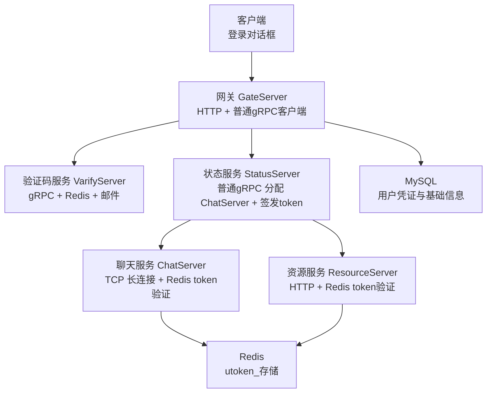
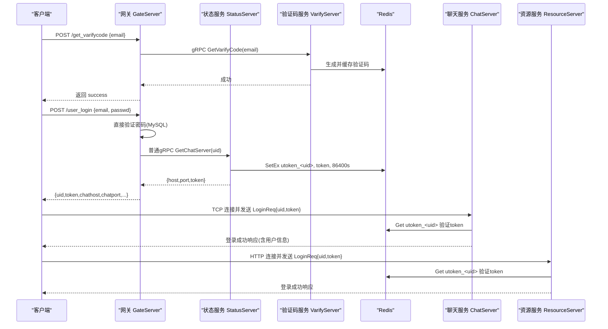
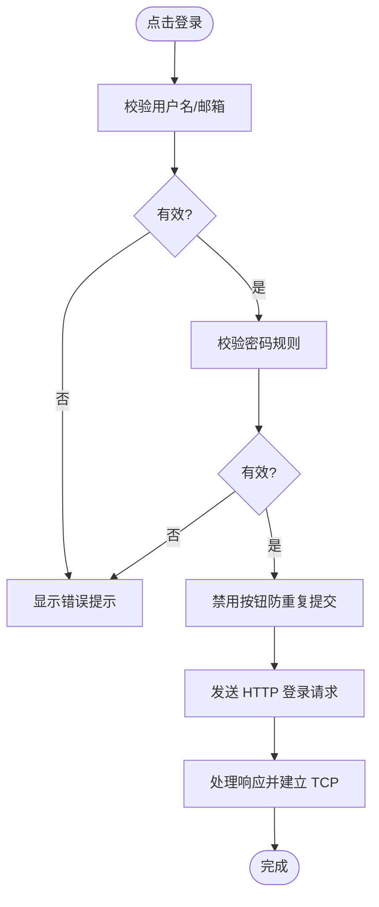
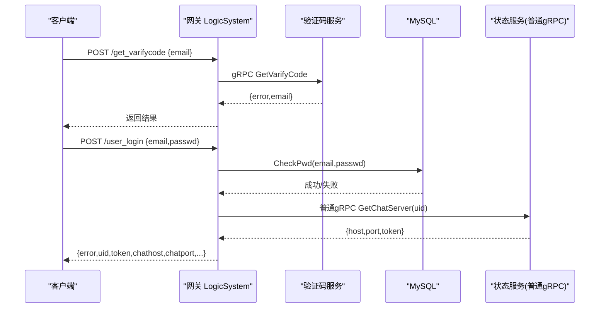
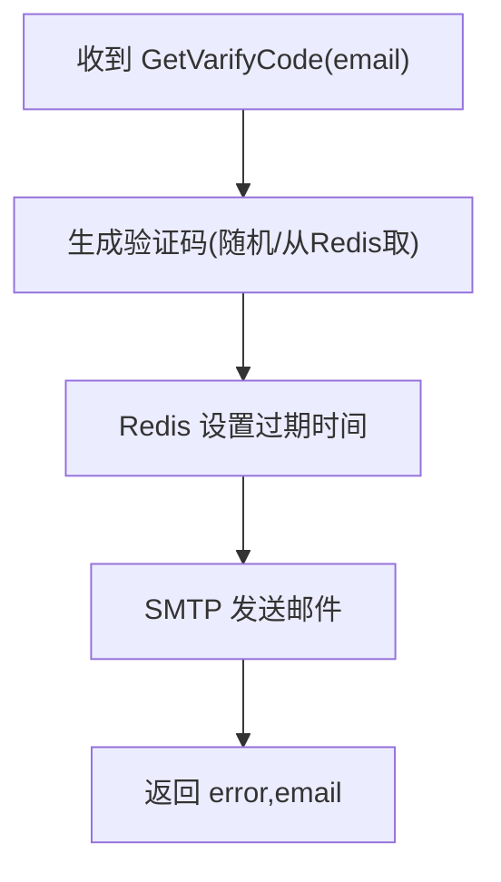
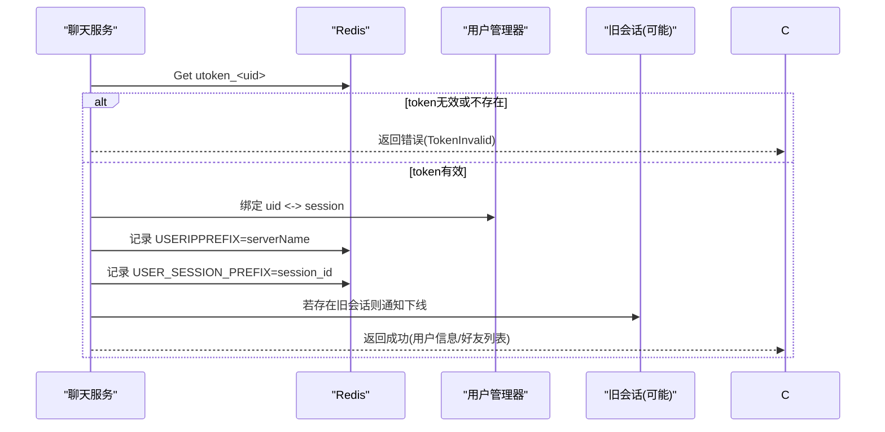
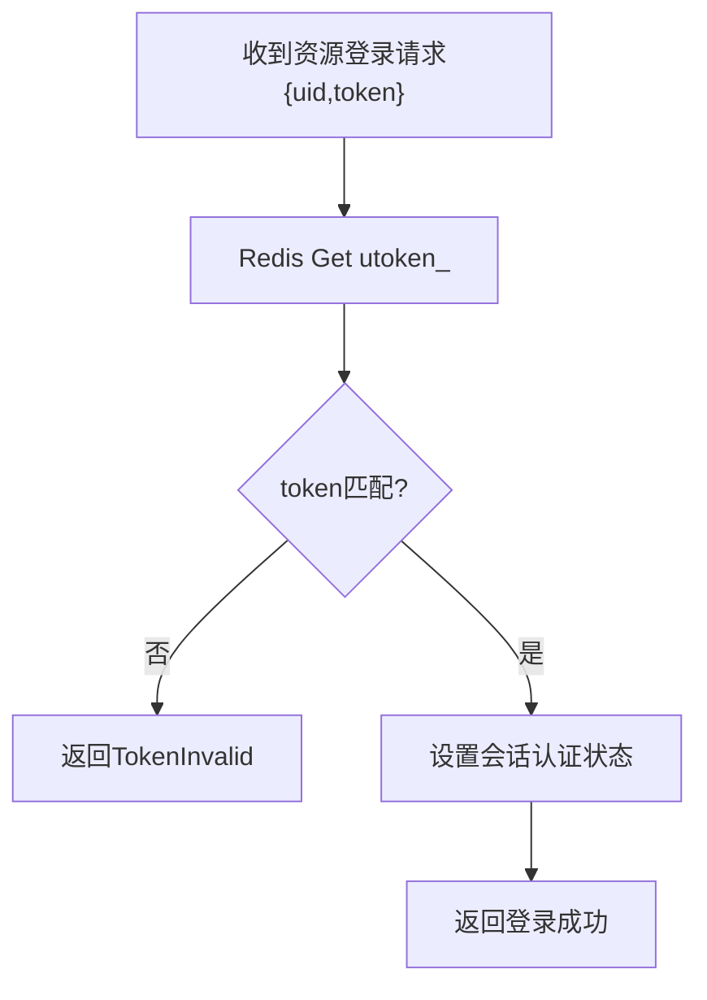
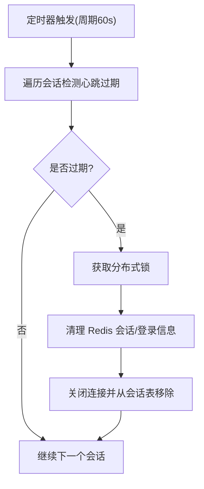
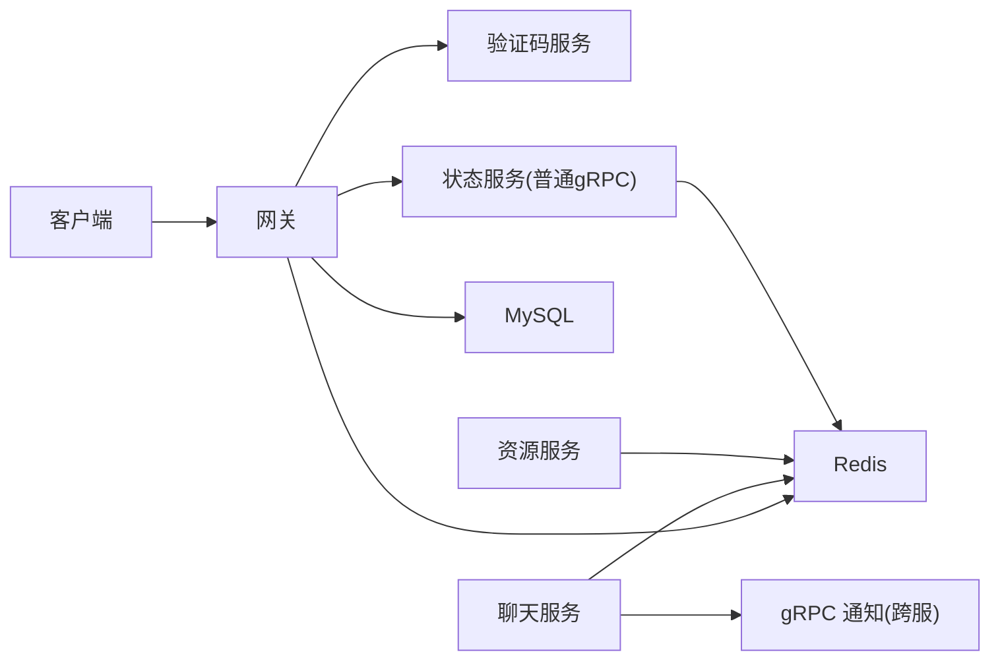

# 登录认证系统

<cite>
**本文引用的文件**   
- [logindialog.h](file://client/llfcchat/include/logindialog.h)
- [logindialog.cpp](file://client/llfcchat/src/logindialog.cpp)
- [HttpConnection.cpp](file://server/GateServer/src/HttpConnection.cpp)
- [LogicSystem.cpp（Gate）](file://server/GateServer/src/LogicSystem.cpp)
- [MysqlMgr.h](file://server/GateServer/include/MysqlMgr.h)
- [status.proto](file://proto/status_service/status.proto)
- [StatusServiceImpl.cpp](file://server/StatusServer/src/StatusServiceImpl.cpp)
- [StatusGrpcClient.cpp](file://server/GateServer/src/StatusGrpcClient.cpp)
- [LogicSystem.cpp（Chat）](file://server/ChatServer/src/LogicSystem.cpp)
- [CSession.cpp](file://server/ChatServer/src/CSession.cpp)
- [CServer.cpp](file://server/ChatServer/src/CServer.cpp)
- [const.h（Gate）](file://server/GateServer/include/const.h)
- [const.h（Chat）](file://server/ChatServer/include/const.h)
- [const.h（Resource）](file://server(ResourceServer/include/const.h)
- [LogicWorker.cpp（Resource）](file://server/ResourceServer/src/LogicWorker.cpp)
- [day17-登录服务验证和客户端数据管理.md](file://开发文档/day17-登录服务验证和客户端数据管理.md)
- [day35心跳逻辑.md](file://开发文档/day35心跳逻辑.md)
- [day27-分布式服务设计.md](file://开发文档/day27-分布式服务设计.md)
</cite>

## 更新摘要
**变更内容**   
- **重大架构简化**：认证系统已从复杂的mTLS双向认证和一次性票据机制重构为简化的Redis token系统
- **移除mTLS证书管理**：移除了SecurityUtil.h安全工具库、mTLS证书验证、TicketIntent枚举等复杂组件
- **简化Token机制**：StatusServer不再签发chat_ticket，而是直接返回简单token字符串存储在Redis中
- **统一Token验证**：ChatServer和ResourceServer都使用相同的`utoken_<uid>`键进行token验证
- **降低复杂度**：GateServer与StatusServer之间使用普通gRPC通信，无需双向证书认证

## 目录
1. [简介](#简介)
2. [项目结构](#项目结构)
3. [核心组件](#核心组件)
4. [架构总览](#架构总览)
5. [详细组件分析](#详细组件分析)
6. [依赖关系分析](#依赖关系分析)
7. [性能与安全考量](#性能与安全考量)
8. [故障排查指南](#故障排查指南)
9. [结论](#结论)

## 简介
本安全文档聚焦 LLFCChat 的登录认证子系统，覆盖用户名密码校验、多设备登录支持、会话令牌生成与校验、权限控制、登录失败锁定策略、暴力破解防护以及安全审计日志等关键方面。同时给出完整的登录时序图，说明客户端认证、网关路由、状态服务分配、聊天服务器连接与会话同步的全链路流程。

**重要更新**：系统已完成架构简化，采用统一的Redis token系统替代了之前的mTLS双向认证和一次性票据机制。新的架构显著降低了复杂性，同时保持了良好的安全性。

## 项目结构
登录认证相关代码分布在客户端、网关、状态服务、验证码服务与聊天服务中：
- 客户端：登录界面与 HTTP/TCP 管理
- 网关 GateServer：HTTP 路由、注册/登录接口、验证码分发、调用状态服务
- 状态服务 StatusServer：负载均衡分配 ChatServer 并签发Redis token
- 验证码服务 VarifyServer：生成验证码并通过邮件发送，缓存到 Redis
- 聊天服务 ChatServer：TCP 长连接、登录握手、在线状态与踢人、心跳与超时清理
- 资源服务 ResourceServer：文件上传下载，同样使用Redis token验证



图表来源
- [StatusServiceImpl.cpp:17-42](file://server/StatusServer/src/StatusServiceImpl.cpp#L17-L42)
- [StatusGrpcClient.cpp:21-29](file://server/GateServer/src/StatusGrpcClient.cpp#L21-L29)
- [LogicSystem.cpp（Chat）:222-242](file://server/ChatServer/src/LogicSystem.cpp#L222-L242)
- [LogicWorker.cpp（Resource）:718-725](file://server/ResourceServer/src/LogicWorker.cpp#L718-L725)

章节来源
- [status.proto:1-30](file://proto/status_service/status.proto#L1-L30)
- [verify.proto:1-19](file://proto/verify_service/verify.proto#L1-L19)

## 核心组件
- 客户端登录对话框：输入校验、发起 HTTP 登录请求、建立 TCP 连接
- 网关 LogicSystem：注册/登录/重置密码/验证码接口，调用后端 gRPC
- 验证码服务：生成验证码、发送邮件、Redis 缓存
- 状态服务：根据 uid 选择负载最低的 ChatServer 并签发Redis token
- 聊天服务：TCP 登录握手、Redis token校验、绑定 session、在线状态与踢人、心跳与超时清理
- 资源服务：HTTP登录接口、Redis token校验、会话管理

**简化后的组件特点**：
- 统一的Redis token存储：所有服务共享`utoken_<uid>`键
- 简化的gRPC通信：无需mTLS证书管理
- 24小时token有效期：平衡安全性和用户体验
- 跨服务统一验证：ChatServer和ResourceServer使用相同验证逻辑

章节来源
- [logindialog.h:1-47](file://client/llfcchat/include/logindialog.h#L1-L47)
- [logindialog.cpp:140-188](file://client/llfcchat/src/logindialog.cpp#L140-L188)
- [StatusServiceImpl.cpp:17-42](file://server/StatusServer/src/StatusServiceImpl.cpp#L17-L42)
- [StatusGrpcClient.cpp:21-29](file://server/GateServer/src/StatusGrpcClient.cpp#L21-L29)

## 架构总览
登录认证采用"HTTP 网关 + 普通gRPC微服务 + Redis缓存"的简化架构：
- 客户端通过 HTTP POST /user_login 提交邮箱与密码
- 网关直接校验密码后，通过普通gRPC调用状态服务获取 ChatServer 地址与token
- 客户端使用token与 ChatServer/ResourceServer 建立连接并完成握手
- 各服务将token与uid绑定至Redis的`utoken_<uid>`键，维护24小时有效期



图表来源
- [LogicSystem.cpp（Gate）:347-423](file://server/GateServer/src/LogicSystem.cpp#L347-L423)
- [StatusServiceImpl.cpp:17-42](file://server/StatusServer/src/StatusServiceImpl.cpp#L17-L42)
- [LogicSystem.cpp（Chat）:222-242](file://server/ChatServer/src/LogicSystem.cpp#L222-L242)
- [LogicWorker.cpp（Resource）:718-725](file://server/ResourceServer/src/LogicWorker.cpp#L718-L725)

## 详细组件分析

### 客户端登录对话框与输入校验
- 用户名/邮箱与密码格式校验（长度、字符集、正则匹配）
- 按钮防抖与错误提示
- 触发 HTTP 登录请求，成功后建立 TCP 连接

**简化更新**：客户端现在接收简单的token字符串而非复杂的chat_ticket，提高了易用性



图表来源
- [logindialog.cpp:236-254](file://client/llfcchat/src/logindialog.cpp#L236-L254)

章节来源
- [logindialog.h:1-47](file://client/llfcchat/include/logindialog.h#L1-L47)
- [logindialog.cpp:236-254](file://client/llfcchat/src/logindialog.cpp#L236-L254)

### 网关登录接口与验证码流程
- GET/POST 路由解析与统一响应封装
- /get_varifycode：调用验证码服务，验证码存入 Redis
- /user_register：校验验证码、检查唯一性、写入 MySQL
- /reset_pwd：验证码校验、邮箱一致性校验、更新密码
- /user_login：**直接验证密码**、调用状态服务分配 ChatServer 与token

**简化更新**：网关现在直接验证用户密码，通过普通gRPC调用状态服务，不再需要mTLS连接



图表来源
- [LogicSystem.cpp（Gate）:105-147](file://server/GateServer/src/LogicSystem.cpp#L105-L147)
- [LogicSystem.cpp（Gate）:347-423](file://server/GateServer/src/LogicSystem.cpp#L347-L423)
- [StatusGrpcClient.cpp:1-30](file://server/GateServer/src/StatusGrpcClient.cpp#L1-L30)

章节来源
- [HttpConnection.cpp:132-194](file://server/GateServer/src/HttpConnection.cpp#L132-L194)
- [LogicSystem.cpp（Gate）:105-147](file://server/GateServer/src/LogicSystem.cpp#L105-L147)
- [StatusGrpcClient.cpp:1-30](file://server/GateServer/src/StatusGrpcClient.cpp#L1-L30)

### 验证码服务（VarifyServer）
- 生成短验证码（UUID 截取），设置过期时间并缓存到 Redis
- 通过 SMTP 发送邮件
- 返回标准错误码与邮箱字段



图表来源
- [server.js（VarifyServer）:15-63](file://server/VarifyServer/server.js#L15-L63)
- [verify.proto:6-18](file://proto/verify_service/verify.proto#L6-L18)

章节来源
- [server.js（VarifyServer）:15-63](file://server/VarifyServer/server.js#L15-L63)
- [verify.proto:1-19](file://proto/verify_service/verify.proto#L1-L19)

### 状态服务Token签发与负载均衡
**简化功能**：StatusServer现在使用普通gRPC通信，直接生成Redis token

- 最小负载选择：根据Redis中的租约信息选择负载最低的ChatServer
- Token签发：生成UUID作为token，存储到Redis `utoken_<uid>`键，设置86400秒TTL
- 简化响应：返回server_name、host、port和token字段

```mermaid
classDiagram
class StatusService {
+GetChatServer(uid) : {error, server_name, host, port, token}
+getChatServer() : ChatServer
}
class Proto {
<<proto3>>
message GetChatServerReq { int32 uid }
message GetChatServerRsp { int32 error; string server_name; string host; string port; string token }
}
StatusService --> Proto : "使用"
```

图表来源
- [status.proto:10-30](file://proto/status_service/status.proto#L10-L30)
- [StatusServiceImpl.cpp:17-42](file://server/StatusServer/src/StatusServiceImpl.cpp#L17-L42)

章节来源
- [status.proto:1-30](file://proto/status_service/status.proto#L1-L30)
- [StatusServiceImpl.cpp:17-42](file://server/StatusServer/src/StatusServiceImpl.cpp#L17-L42)
- [StatusGrpcClient.cpp:1-30](file://server/GateServer/src/StatusGrpcClient.cpp#L1-L30)

### 聊天服务Token验证与会话管理
**简化更新**：聊天服务现在处理简单token而非复杂的chat_ticket

- 接收 TCP 登录消息，解析包含uid和token的请求
- 从Redis `utoken_<uid>`键获取并验证token
- 验证通过后绑定 uid 与 session，记录登录 IP 与 server 名
- 若同一 uid 已在其他服务器或同服登录，则执行踢人逻辑



图表来源
- [LogicSystem.cpp（Chat）:222-242](file://server/ChatServer/src/LogicSystem.cpp#L222-L242)

章节来源
- [LogicSystem.cpp（Chat）:222-242](file://server/ChatServer/src/LogicSystem.cpp#L222-L242)
- [day27-分布式服务设计.md:365-444](file://开发文档/day27-分布式服务设计.md#L365-L444)

### 资源服务Token验证
**新增功能**：资源服务现在也使用相同的Redis token验证机制

- 接收 HTTP 登录请求，解析包含uid和token的请求
- 从Redis `utoken_<uid>`键获取并验证token
- 验证通过后设置会话认证状态，允许后续业务操作



图表来源
- [LogicWorker.cpp（Resource）:718-725](file://server/ResourceServer/src/LogicWorker.cpp#L718-L725)

章节来源
- [LogicWorker.cpp（Resource）:718-725](file://server/ResourceServer/src/LogicWorker.cpp#L718-L725)

### 会话超时与心跳机制
- 服务端定时扫描，检测心跳过期（默认阈值约 20s）
- 对过期连接关闭 socket 并清理 Redis 中的会话与登录信息
- 使用分布式锁避免并发清理冲突



图表来源
- [CSession.cpp:285-333](file://server/ChatServer/src/CSession.cpp#L285-L333)
- [CServer.cpp:102-132](file://server/ChatServer/src/CServer.cpp#L102-L132)
- [day35心跳逻辑.md:41-93](file://开发文档/day35心跳逻辑.md#L41-L93)

章节来源
- [CSession.cpp:285-333](file://server/ChatServer/src/CSession.cpp#L285-L333)
- [CServer.cpp:102-132](file://server/ChatServer/src/CServer.cpp#L102-L132)
- [day35心跳逻辑.md:41-93](file://开发文档/day35心跳逻辑.md#L41-L93)

## 依赖关系分析
- 客户端依赖网关 HTTP 接口与 TCP 连接
- 网关依赖验证码服务、状态服务（普通gRPC）、MySQL、Redis
- 聊天服务依赖 Redis、用户管理器、gRPC 通知（跨服踢人）
- 资源服务依赖 Redis、用户管理器
- 状态服务负责资源分配与Redis token签发

**简化后的依赖**：
- 移除了mTLS证书链依赖
- 所有服务间通信使用普通gRPC
- 统一的Redis token存储机制



图表来源
- [LogicSystem.cpp（Gate）:347-423](file://server/GateServer/src/LogicSystem.cpp#L347-L423)
- [LogicSystem.cpp（Chat）:222-242](file://server/ChatServer/src/LogicSystem.cpp#L222-L242)
- [StatusServiceImpl.cpp:17-42](file://server/StatusServer/src/StatusServiceImpl.cpp#L17-L42)
- [LogicWorker.cpp（Resource）:718-725](file://server/ResourceServer/src/LogicWorker.cpp#L718-L725)

章节来源
- [LogicSystem.cpp（Gate）:347-423](file://server/GateServer/src/LogicSystem.cpp#L347-L423)
- [LogicSystem.cpp（Chat）:222-242](file://server/ChatServer/src/LogicSystem.cpp#L222-L242)

## 性能与安全考量
- 性能
  - Redis 缓存验证码与用户基础信息，降低数据库压力
  - 异步 I/O（Beast/Asio）提升高并发处理能力
  - 心跳与定时清理避免僵尸连接占用资源
  - 普通gRPC连接池优化减少握手开销
  - 统一的Redis token验证减少重复计算
- 安全
  - **简化**：移除了mTLS双向认证，降低了部署复杂度
  - **统一**：所有服务使用相同的Redis token验证机制
  - **24小时有效期**：平衡安全性和用户体验
  - 密码强度校验（长度与字符集限制）
  - 验证码有效期与一次性校验，防止重放攻击
  - 分布式锁保护关键清理操作，避免竞态条件
- 建议增强
  - 引入速率限制与账号锁定策略（如 N 次失败锁定）
  - 全链路审计日志（登录成功/失败、踢人、异常）
  - 传输层加密（TLS）与敏感字段脱敏
  - Token刷新机制，提高安全性

**简化后的安全措施**：
- 统一Redis token：所有服务共享验证逻辑，减少不一致风险
- 24小时TTL：防止长期token泄露带来的安全风险
- 密码验证在网关层：集中处理认证逻辑
- 分布式锁：确保多实例环境下的数据一致性

## 故障排查指南
- 登录失败
  - 检查密码是否正确、邮箱是否存在
  - 查看验证码是否过期或错误
  - 确认状态服务是否可正常分配 ChatServer 与token
  - **简化**：检查普通gRPC连接是否正常，无需证书配置
  - **重要**：确认Redis中`utoken_<uid>`键是否存在且值正确
- 连接断开
  - 检查心跳是否按时上报
  - 查看 Redis 会话与登录信息是否被清理
  - 关注分布式锁获取与释放是否正常
- 多端互踢
  - 确认 USERIPPREFIX 与 USER_SESSION_PREFIX 的一致性
  - 检查跨服通知是否成功
- **简化问题**：gRPC连接失败
  - 检查StatusServer配置的主机和端口
  - 确认网络连通性
  - 验证gRPC服务是否正常运行

章节来源
- [CSession.cpp:285-333](file://server/ChatServer/src/CSession.cpp#L285-L333)
- [CServer.cpp:102-132](file://server/ChatServer/src/CServer.cpp#L102-L132)
- [LogicSystem.cpp（Chat）:222-242](file://server/ChatServer/src/LogicSystem.cpp#L222-L242)
- [StatusGrpcClient.cpp:1-30](file://server/GateServer/src/StatusGrpcClient.cpp#L1-L30)

## 结论
LLFCChat 的登录认证系统通过网关统一入口、验证码服务与状态服务解耦、Redis 缓存与会话管理，实现了可扩展、高可用的认证与在线状态同步。结合心跳与分布式锁，系统在多设备登录与踢人场景下具备良好的一致性与健壮性。

**架构简化成果**：系统现已完成重大架构简化，采用统一的Redis token系统替代了复杂的mTLS双向认证和一次性票据机制。新的架构显著降低了部署和维护复杂度，同时保持了良好的安全性。简化后的系统具有以下优势：

- **部署简单**：无需管理mTLS证书，降低运维复杂度
- **性能提升**：减少了证书验证和复杂票据处理的开销
- **易于调试**：统一的token验证逻辑便于问题定位
- **扩展性好**：新服务只需实现标准的token验证即可接入

建议在生产环境中补充速率限制、账号锁定与审计日志等安全加固措施，进一步提升整体安全性与可观测性。同时，应监控Redis token的使用情况，确保系统持续安全稳定运行。