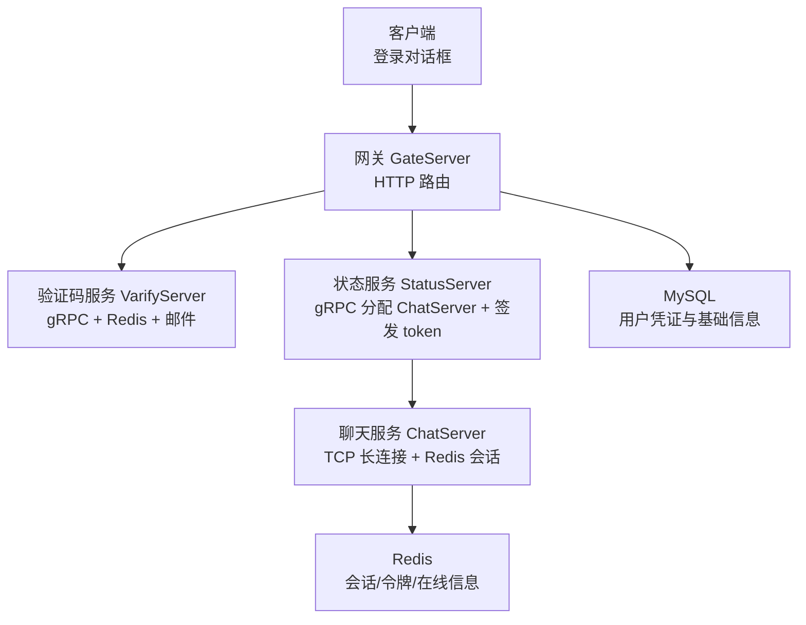
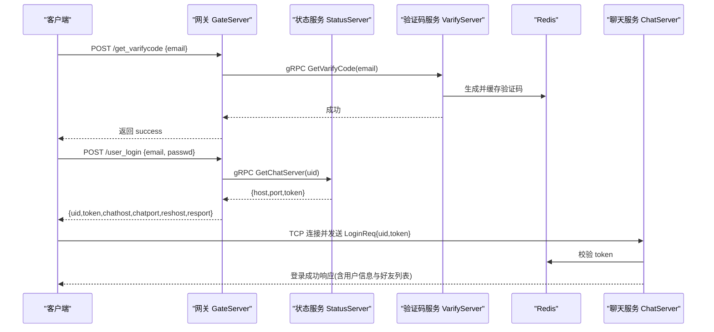
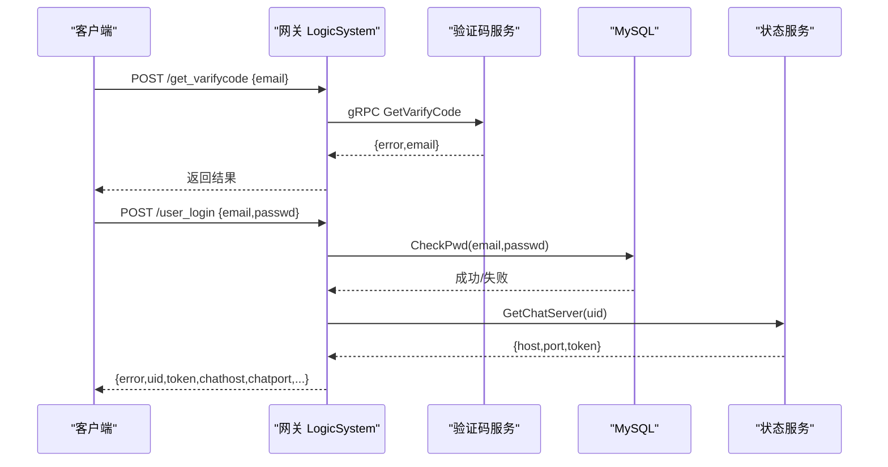
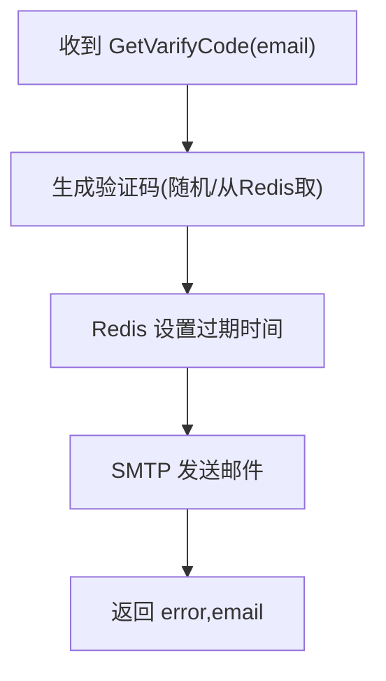
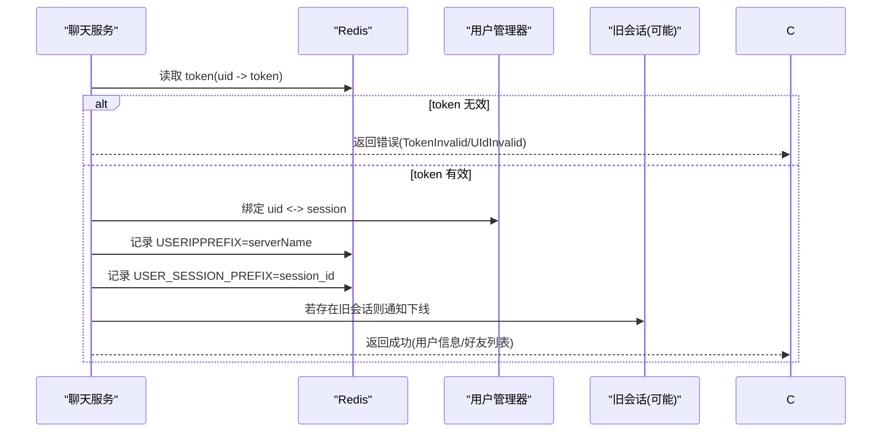
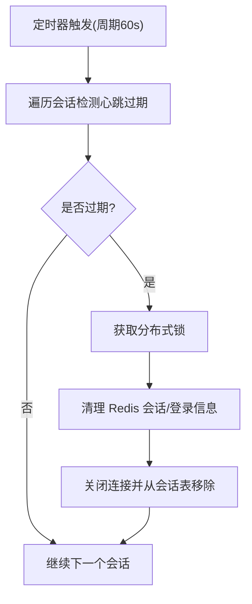
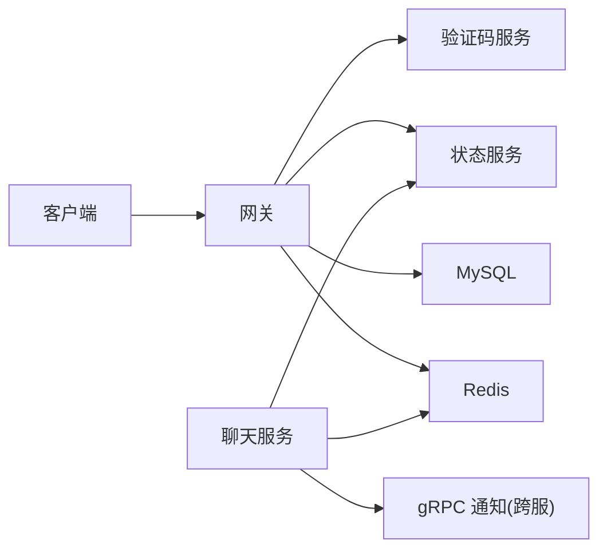

# 登录认证系统

<cite>
**本文引用的文件**   
- [logindialog.h](file://client/llfcchat/include/logindialog.h)
- [logindialog.cpp](file://client/llfcchat/src/logindialog.cpp)
- [HttpConnection.cpp](file://server/GateServer/src/HttpConnection.cpp)
- [LogicSystem.cpp（Gate）](file://server/GateServer/src/LogicSystem.cpp)
- [MysqlMgr.h](file://server/GateServer/include/MysqlMgr.h)
- [status.proto](file://proto/status_service/status.proto)
- [verify.proto](file://proto/verify_service/verify.proto)
- [server.js（VarifyServer）](file://server/VarifyServer/server.js)
- [LogicSystem.cpp（Chat）](file://server/ChatServer/src/LogicSystem.cpp)
- [CSession.cpp](file://server/ChatServer/src/CSession.cpp)
- [CServer.cpp](file://server/ChatServer/src/CServer.cpp)
- [const.h（Gate）](file://server/GateServer/include/const.h)
- [const.h（Status）](file://server/StatusServer/include/const.h)
- [day17-登录服务验证和客户端数据管理.md](file://开发文档/day17-登录服务验证和客户端数据管理.md)
- [day35心跳逻辑.md](file://开发文档/day35心跳逻辑.md)
- [day27-分布式服务设计.md](file://开发文档/day27-分布式服务设计.md)
</cite>

## 目录
1. [简介](#简介)
2. [项目结构](#项目结构)
3. [核心组件](#核心组件)
4. [架构总览](#架构总览)
5. [详细组件分析](#详细组件分析)
6. [依赖关系分析](#依赖关系分析)
7. [性能与安全考量](#性能与安全考量)
8. [故障排查指南](#故障排查指南)
9. [结论](#结论)

## 简介
本安全文档聚焦 LLFCChat 的登录认证子系统，覆盖用户名密码校验、多设备登录支持、会话令牌生成与校验、权限控制、登录失败锁定策略、暴力破解防护以及安全审计日志等关键方面。同时给出完整的登录时序图，说明客户端认证、网关路由、状态服务分配、聊天服务器连接与会话同步的全链路流程。

## 项目结构
登录认证相关代码分布在客户端、网关、状态服务、验证码服务与聊天服务中：
- 客户端：登录界面与 HTTP/TCP 管理
- 网关 GateServer：HTTP 路由、注册/登录接口、验证码分发、调用状态服务
- 状态服务 StatusServer：负载均衡分配 ChatServer 并签发 token
- 验证码服务 VarifyServer：生成验证码并通过邮件发送，缓存到 Redis
- 聊天服务 ChatServer：TCP 长连接、登录握手、在线状态与踢人、心跳与超时清理



图表来源
- [LogicSystem.cpp（Gate）:318-395](file://server/GateServer/src/LogicSystem.cpp#L318-L395)
- [server.js（VarifyServer）:15-63](file://server/VarifyServer/server.js#L15-L63)
- [status.proto:6-31](file://proto/status_service/status.proto#L6-L31)
- [LogicSystem.cpp（Chat）:116-252](file://server/ChatServer/src/LogicSystem.cpp#L116-L252)

章节来源
- [LogicSystem.cpp（Gate）:318-395](file://server/GateServer/src/LogicSystem.cpp#L318-L395)
- [status.proto:6-31](file://proto/status_service/status.proto#L6-L31)
- [verify.proto:1-19](file://proto/verify_service/verify.proto#L1-L19)
- [server.js（VarifyServer）:15-63](file://server/VarifyServer/server.js#L15-L63)

## 核心组件
- 客户端登录对话框：输入校验、发起 HTTP 登录请求、建立 TCP 连接
- 网关 LogicSystem：注册/登录/重置密码/验证码接口，调用后端 gRPC
- 验证码服务：生成验证码、发送邮件、Redis 缓存
- 状态服务：根据 uid 分配 ChatServer 并返回 host/port/token
- 聊天服务：TCP 登录握手、token 校验、绑定 session、在线状态与踢人、心跳与超时清理

章节来源
- [logindialog.h:1-47](file://client/llfcchat/include/logindialog.h#L1-L47)
- [logindialog.cpp:140-188](file://client/llfcchat/src/logindialog.cpp#L140-L188)
- [LogicSystem.cpp（Gate）:318-395](file://server/GateServer/src/LogicSystem.cpp#L318-L395)
- [server.js（VarifyServer）:15-63](file://server/VarifyServer/server.js#L15-L63)
- [status.proto:6-31](file://proto/status_service/status.proto#L6-L31)
- [LogicSystem.cpp（Chat）:116-252](file://server/ChatServer/src/LogicSystem.cpp#L116-L252)

## 架构总览
登录认证采用“HTTP 网关 + gRPC 微服务 + Redis 缓存”的分层架构：
- 客户端通过 HTTP POST /user_login 提交邮箱与密码
- 网关校验密码后，调用状态服务获取 ChatServer 地址与 token
- 客户端使用 token 与 ChatServer 建立 TCP 连接并完成握手
- 聊天服务将 token 与 uid 绑定至 Redis，维护在线状态与多端互踢



图表来源
- [LogicSystem.cpp（Gate）:105-147](file://server/GateServer/src/LogicSystem.cpp#L105-L147)
- [LogicSystem.cpp（Gate）:318-395](file://server/GateServer/src/LogicSystem.cpp#L318-L395)
- [status.proto:11-20](file://proto/status_service/status.proto#L11-L20)
- [server.js（VarifyServer）:15-63](file://server/VarifyServer/server.js#L15-L63)
- [LogicSystem.cpp（Chat）:116-164](file://server/ChatServer/src/LogicSystem.cpp#L116-L164)

## 详细组件分析

### 客户端登录对话框与输入校验
- 用户名/邮箱与密码格式校验（长度、字符集、正则匹配）
- 按钮防抖与错误提示
- 触发 HTTP 登录请求，成功后建立 TCP 连接


图表来源
- [logindialog.cpp:140-188](file://client/llfcchat/src/logindialog.cpp#L140-L188)

章节来源
- [logindialog.h:1-47](file://client/llfcchat/include/logindialog.h#L1-L47)
- [logindialog.cpp:140-188](file://client/llfcchat/src/logindialog.cpp#L140-L188)

### 网关登录接口与验证码流程
- GET/POST 路由解析与统一响应封装
- /get_varifycode：调用验证码服务，验证码存入 Redis
- /user_register：校验验证码、检查唯一性、写入 MySQL
- /reset_pwd：验证码校验、邮箱一致性校验、更新密码
- /user_login：校验密码、调用状态服务分配 ChatServer 与 token



图表来源
- [LogicSystem.cpp（Gate）:105-147](file://server/GateServer/src/LogicSystem.cpp#L105-L147)
- [LogicSystem.cpp（Gate）:148-233](file://server/GateServer/src/LogicSystem.cpp#L148-L233)
- [LogicSystem.cpp（Gate）:235-316](file://server/GateServer/src/LogicSystem.cpp#L235-L316)
- [LogicSystem.cpp（Gate）:318-395](file://server/GateServer/src/LogicSystem.cpp#L318-L395)
- [MysqlMgr.h:10-14](file://server/GateServer/include/MysqlMgr.h#L10-L14)

章节来源
- [HttpConnection.cpp:132-194](file://server/GateServer/src/HttpConnection.cpp#L132-L194)
- [LogicSystem.cpp（Gate）:105-147](file://server/GateServer/src/LogicSystem.cpp#L105-L147)
- [LogicSystem.cpp（Gate）:318-395](file://server/GateServer/src/LogicSystem.cpp#L318-L395)
- [MysqlMgr.h:10-14](file://server/GateServer/include/MysqlMgr.h#L10-L14)

### 验证码服务（VarifyServer）
- 生成短验证码（UUID 截取），设置过期时间并缓存到 Redis
- 通过 SMTP 发送邮件
- 返回标准错误码与邮箱字段



图表来源
- [server.js（VarifyServer）:15-63](file://server/VarifyServer/server.js#L15-L63)
- [verify.proto:6-18](file://proto/verify_service/verify.proto#L6-L18)

章节来源
- [server.js（VarifyServer）:15-63](file://server/VarifyServer/server.js#L15-L63)
- [verify.proto:1-19](file://proto/verify_service/verify.proto#L1-L19)

### 状态服务与 Token 签发
- 根据 uid 选择可用 ChatServer，返回 host/port/token
- 登录 proto 定义包含 uid 与 token 的请求/响应

```mermaid
classDiagram
class StatusService {
+GetChatServer(uid) : {host,port,token}
+Login(uid,token) : {error,uid,token}
}
class Proto {
<<proto3>>
message GetChatServerReq { int32 uid }
message GetChatServerRsp { int32 error; string host; string port; string token }
message LoginReq { int32 uid; string token }
message LoginRsp { int32 error; int32 uid; string token }
}
StatusService --> Proto : "使用"
```

图表来源
- [status.proto:6-31](file://proto/status_service/status.proto#L6-L31)

章节来源
- [status.proto:6-31](file://proto/status_service/status.proto#L6-L31)
- [day17-登录服务验证和客户端数据管理.md:1-20](file://开发文档/day17-登录服务验证和客户端数据管理.md#L1-L20)

### 聊天服务登录握手与多设备互踢
- 接收 TCP 登录消息，校验 Redis 中的 token
- 绑定 uid 与 session，记录登录 IP 与 server 名
- 若同一 uid 已在其他服务器或同服登录，则执行踢人逻辑（本地或跨服通知）



图表来源
- [LogicSystem.cpp（Chat）:116-252](file://server/ChatServer/src/LogicSystem.cpp#L116-L252)

章节来源
- [LogicSystem.cpp（Chat）:116-252](file://server/ChatServer/src/LogicSystem.cpp#L116-L252)
- [day27-分布式服务设计.md:365-444](file://开发文档/day27-分布式服务设计.md#L365-L444)

### 会话超时与心跳机制
- 服务端定时扫描，检测心跳过期（默认阈值约 20s）
- 对过期连接关闭 socket 并清理 Redis 中的会话与登录信息
- 使用分布式锁避免并发清理冲突



图表来源
- [CSession.cpp:285-333](file://server/ChatServer/src/CSession.cpp#L285-L333)
- [CServer.cpp:102-132](file://server/ChatServer/src/CServer.cpp#L102-L132)
- [day35心跳逻辑.md:41-93](file://开发文档/day35心跳逻辑.md#L41-L93)

章节来源
- [CSession.cpp:285-333](file://server/ChatServer/src/CSession.cpp#L285-L333)
- [CServer.cpp:102-132](file://server/ChatServer/src/CServer.cpp#L102-L132)
- [day35心跳逻辑.md:41-93](file://开发文档/day35心跳逻辑.md#L41-L93)

## 依赖关系分析
- 客户端依赖网关 HTTP 接口与 TCP 连接
- 网关依赖验证码服务、状态服务、MySQL、Redis
- 聊天服务依赖 Redis、用户管理器、gRPC 通知（跨服踢人）
- 状态服务负责资源分配与 token 签发



图表来源
- [LogicSystem.cpp（Gate）:318-395](file://server/GateServer/src/LogicSystem.cpp#L318-L395)
- [LogicSystem.cpp（Chat）:116-252](file://server/ChatServer/src/LogicSystem.cpp#L116-L252)

章节来源
- [LogicSystem.cpp（Gate）:318-395](file://server/GateServer/src/LogicSystem.cpp#L318-L395)
- [LogicSystem.cpp（Chat）:116-252](file://server/ChatServer/src/LogicSystem.cpp#L116-L252)

## 性能与安全考量
- 性能
  - Redis 缓存验证码与用户基础信息，降低数据库压力
  - 异步 I/O（Beast/Asio）提升高并发处理能力
  - 心跳与定时清理避免僵尸连接占用资源
- 安全
  - 密码强度校验（长度与字符集限制）
  - 验证码有效期与一次性校验，防止重放攻击
  - Token 校验与多端互踢，确保会话唯一性与安全性
  - 分布式锁保护关键清理操作，避免竞态条件
- 建议增强
  - 引入速率限制与账号锁定策略（如 N 次失败锁定）
  - 全链路审计日志（登录成功/失败、踢人、异常）
  - 传输层加密（TLS）与敏感字段脱敏

[本节为通用指导，不直接分析具体文件]

## 故障排查指南
- 登录失败
  - 检查密码是否正确、邮箱是否存在
  - 查看验证码是否过期或错误
  - 确认状态服务是否可正常分配 ChatServer 与 token
- 连接断开
  - 检查心跳是否按时上报
  - 查看 Redis 会话与登录信息是否被清理
  - 关注分布式锁获取与释放是否正常
- 多端互踢
  - 确认 USERIPPREFIX 与 USER_SESSION_PREFIX 的一致性
  - 检查跨服通知是否成功

章节来源
- [CSession.cpp:285-333](file://server/ChatServer/src/CSession.cpp#L285-L333)
- [CServer.cpp:102-132](file://server/ChatServer/src/CServer.cpp#L102-L132)
- [LogicSystem.cpp（Chat）:116-252](file://server/ChatServer/src/LogicSystem.cpp#L116-L252)

## 结论
LLFCChat 的登录认证系统通过网关统一入口、验证码服务与状态服务解耦、Redis 缓存与会话管理，实现了可扩展、高可用的认证与在线状态同步。结合心跳与分布式锁，系统在多设备登录与踢人场景下具备良好的一致性与健壮性。建议在生产环境中补充速率限制、账号锁定与审计日志等安全加固措施，进一步提升整体安全性与可观测性。