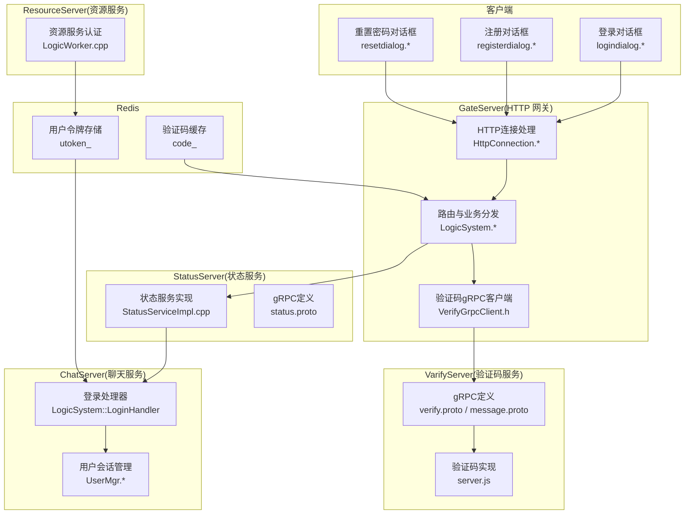
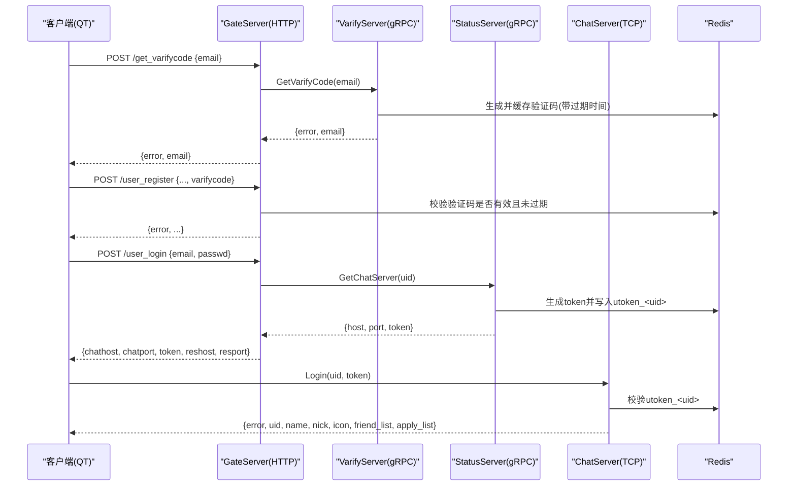
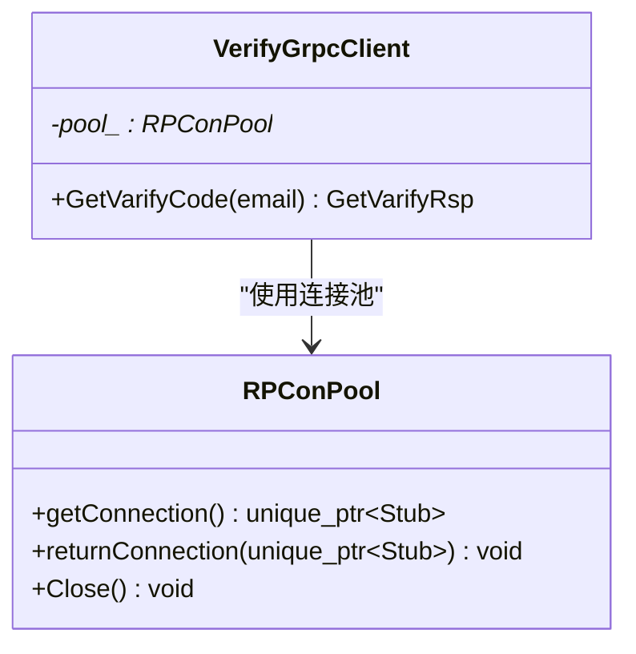
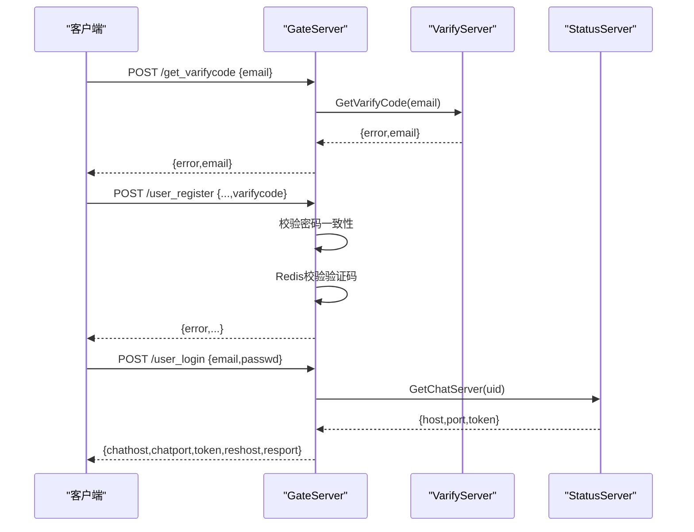
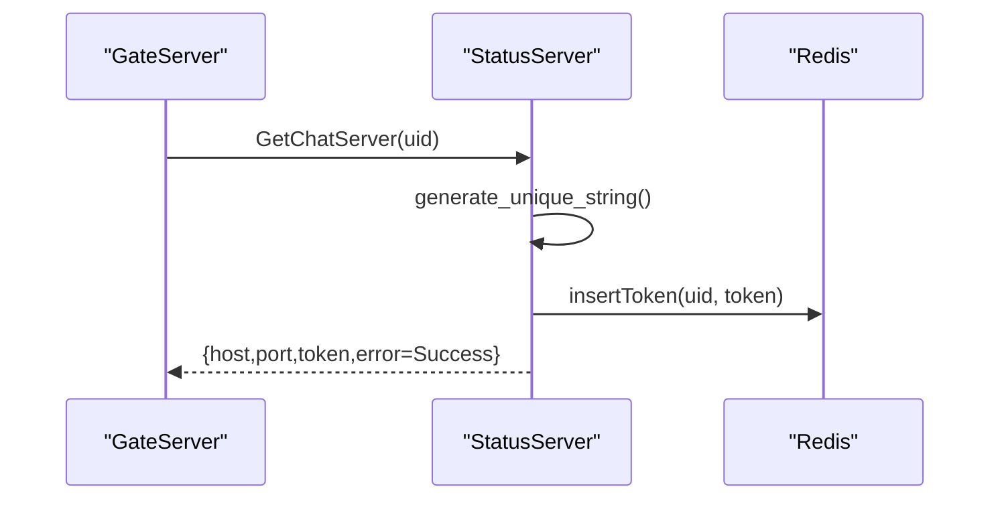
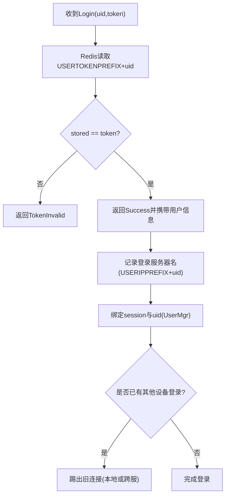
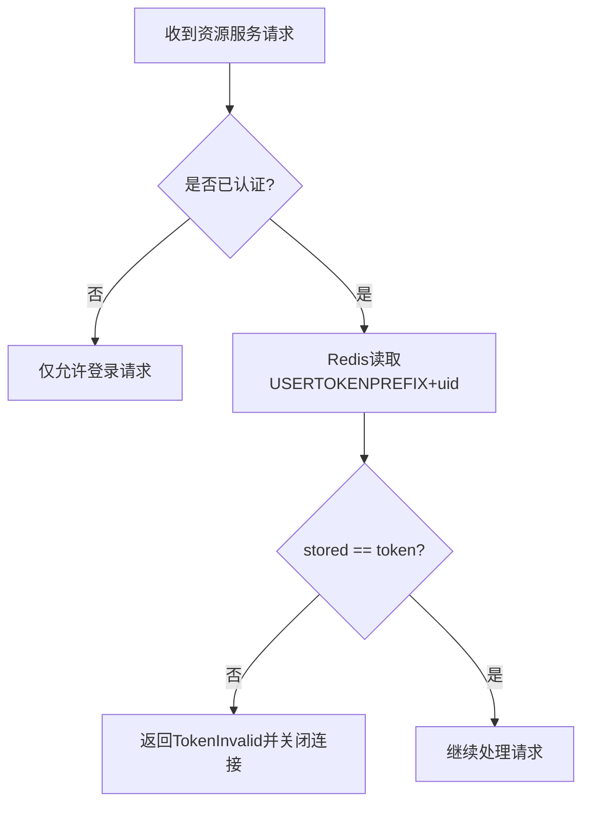
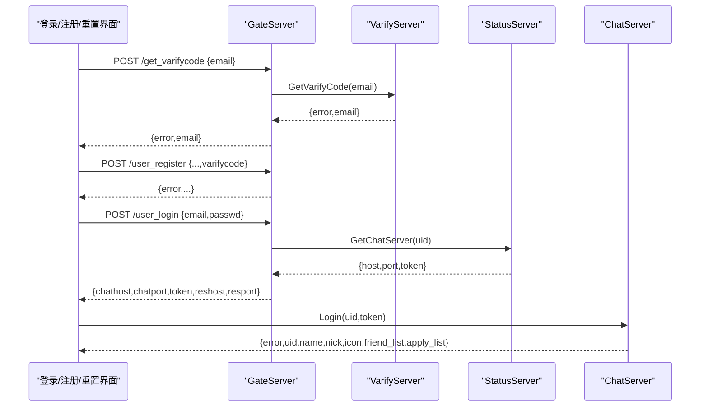
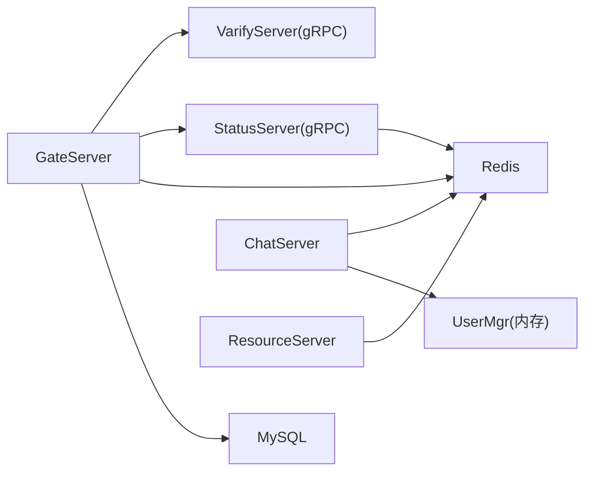

# 身份认证系统

<cite>
**本文引用的文件**
- [verify.proto](file://proto/verify_service/verify.proto)
- [server.js](file://server/VarifyServer/server.js)
- [VerifyGrpcClient.h](file://server/GateServer/include/VerifyGrpcClient.h)
- [HttpConnection.h](file://server/GateServer/include/HttpConnection.h)
- [HttpConnection.cpp](file://server/GateServer/src/HttpConnection.cpp)
- [LogicSystem.h](file://server/GateServer/include/LogicSystem.h)
- [LogicSystem.cpp](file://server/GateServer/src/LogicSystem.cpp)
- [StatusServiceImpl.cpp](file://server/StatusServer/src/StatusServiceImpl.cpp)
- [status.proto](file://proto/status_service/status.proto)
- [ChatServer LogicSystem.cpp](file://server/ChatServer/src/LogicSystem.cpp)
- [ResourceServer LogicWorker.cpp](file://server/ResourceServer/src/LogicWorker.cpp)
- [message.proto](file://server/VarifyServer/message.proto)
- [logindialog.h](file://client/llfcchat/include/logindialog.h)
- [registerdialog.h](file://client/llfcchat/include/registerdialog.h)
- [logindialog.cpp](file://client/llfcchat/src/logindialog.cpp)
- [registerdialog.cpp](file://client/llfcchat/src/registerdialog.cpp)
- [resetdialog.cpp](file://client/llfcchat/src/resetdialog.cpp)
- [day14-登录功能.md](file://开发文档/day14-登录功能.md)
- [day08-邮箱认证服务.md](file://开发文档/day08-邮箱认证服务.md)
- [day42-用户加载聊天资源.md](file://开发文档/day42-用户加载聊天资源.md)
- [day33单服程踢人逻辑.md](file://开发文档/day33单服程踢人逻辑.md)
- [day27-分布式服务设计.md](file://开发文档/day27-分布式服务设计.md)
</cite>

## 更新摘要
**变更内容**   
- **移除** SecurityUtil.h安全工具库（包含SHA-256哈希、常量时间比较、OpenSSL随机数生成等功能）
- **简化** 认证架构从mTLS保护的一次性票据机制改为基于Redis的简单token验证
- **移除** 复杂的会话恢复机制和INITIAL/RESUME意图处理
- **保留** 基于Redis的utoken_<uid>令牌存储和验证机制
- **简化** StatusServer的GetChatServer接口，不再需要mTLS证书配置

## 目录
1. [简介](#简介)
2. [项目结构](#项目结构)
3. [核心组件](#核心组件)
4. [架构总览](#架构总览)
5. [详细组件分析](#详细组件分析)
6. [依赖关系分析](#依赖关系分析)
7. [性能与安全考量](#性能与安全考量)
8. [故障排查指南](#故障排查指南)
9. [结论](#结论)
10. [附录：协议与数据模型](#附录协议与数据模型)

## 简介
本安全文档聚焦 LLFCChat 身份认证子系统，覆盖以下关键主题：
- 邮箱验证码生成、发送、缓存与过期策略
- 用户注册流程（含验证码校验）
- 登录认证过程（HTTP 网关 + gRPC 状态服务 + Redis 令牌校验）
- 会话管理与多设备登录支持（含踢人机制）
- gRPC 客户端与验证码服务的通信协议
- 密码加密存储方案与审计日志建议
- 认证失败处理与错误码约定
- 时序图与状态转换图，帮助理解客户端与服务端的交互

**更新** 当前认证系统已移除复杂的安全工具库和mTLS机制，采用简化的基于Redis的token验证方案。

## 项目结构
认证相关代码分布在 GateServer（HTTP 网关）、VarifyServer（验证码服务）、StatusServer（状态与令牌分配）、ChatServer（会话与业务）、以及 Qt 客户端。

**图表来源**
- [HttpConnection.h:1-36](file://server/GateServer/include/HttpConnection.h#L1-L36)
- [HttpConnection.cpp:133-194](file://server/GateServer/src/HttpConnection.cpp#L133-L194)
- [LogicSystem.h:1-24](file://server/GateServer/include/LogicSystem.h#L1-L24)
- [LogicSystem.cpp:105-147](file://server/GateServer/src/LogicSystem.cpp#L105-147)
- [VerifyGrpcClient.h:80-113](file://server/GateServer/include/VerifyGrpcClient.h#L80-L113)
- [verify.proto:1-19](file://proto/verify_service/verify.proto#L1-L19)
- [server.js:15-64](file://server/VarifyServer/server.js#L15-L64)
- [StatusServiceImpl.cpp:17-27](file://server/StatusServer/src/StatusServiceImpl.cpp#L17-27)
- [status.proto:1-22](file://proto/status_service/status.proto#L1-L22)

**章节来源**
- [HttpConnection.h:1-36](file://server/GateServer/include/HttpConnection.h#L1-L36)
- [HttpConnection.cpp:133-194](file://server/GateServer/src/HttpConnection.cpp#L133-L194)
- [LogicSystem.h:1-24](file://server/GateServer/include/LogicSystem.h#L1-L24)
- [LogicSystem.cpp:105-147](file://server/GateServer/src/LogicSystem.cpp#L105-147)
- [VerifyGrpcClient.h:80-113](file://server/GateServer/include/VerifyGrpcClient.h#L80-L113)
- [verify.proto:1-19](file://proto/verify_service/verify.proto#L1-L19)
- [server.js:15-64](file://server/VarifyServer/server.js#L15-L64)
- [StatusServiceImpl.cpp:17-27](file://server/StatusServer/src/StatusServiceImpl.cpp#L17-27)

## 核心组件
- HTTP 网关（GateServer）
  - HttpConnection：解析请求、设置超时、统一响应格式
  - LogicSystem：路由注册与分发，调用验证码与状态服务
- 验证码服务（VarifyServer）
  - gRPC 接口 GetVarifyCode，Redis 缓存验证码，SMTP 发送邮件
- 状态服务（StatusServer）
  - 分配 ChatServer 地址与登录令牌 token，写入 Redis
  - **简化**：移除了mTLS配置，使用普通gRPC通信
- 聊天服务（ChatServer）
  - 登录处理器校验 token，绑定 session，维护用户会话
  - **简化**：直接使用Redis中的token进行验证，无需复杂的安全原语
- 资源服务（ResourceServer）
  - **简化**：集成简单的token验证机制
- 客户端（Qt）
  - 登录/注册/重置界面，发起 HTTP/gRPC 请求，处理响应

**章节来源**
- [HttpConnection.cpp:133-194](file://server/GateServer/src/HttpConnection.cpp#L133-L194)
- [LogicSystem.cpp:105-147](file://server/GateServer/src/LogicSystem.cpp#L105-147)
- [server.js:15-64](file://server/VarifyServer/server.js#L15-L64)
- [StatusServiceImpl.cpp:17-27](file://server/StatusServer/src/StatusServiceImpl.cpp#L17-27)

## 架构总览
整体认证链路：
- 客户端通过 HTTP 向 GateServer 发起"获取验证码"、"注册"、"登录"等请求
- GateServer 通过 gRPC 调用 VarifyServer 发送验证码；调用 StatusServer 分配 ChatServer 与 token
- ChatServer 使用 Redis 中的 token 进行登录校验，建立会话并返回用户信息
- **简化**：移除了复杂的安全工具库和mTLS机制，采用直接的Redis token验证

**图表来源**
- [LogicSystem.cpp:105-147](file://server/GateServer/src/LogicSystem.cpp#L105-147)
- [server.js:15-64](file://server/VarifyServer/server.js#L15-L64)
- [StatusServiceImpl.cpp:17-27](file://server/StatusServer/src/StatusServiceImpl.cpp#L17-27)
- [ChatServer LogicSystem.cpp:234-369](file://server/ChatServer/src/LogicSystem.cpp#L234-369)

## 详细组件分析

### 验证码服务（VarifyServer）
- gRPC 接口：GetVarifyCode
- 行为：
  - 若 Redis 中无该邮箱的验证码，则生成随机验证码（截取前4位），设置过期时间（例如 600s）
  - 通过 SMTP 发送邮件
  - 返回 error 与 email
- 错误处理：
  - Redis 异常返回特定错误码
  - 邮件发送异常返回通用异常码

**图表来源**
- [server.js:15-64](file://server/VarifyServer/server.js#L15-L64)
- [verify.proto:1-19](file://proto/verify_service/verify.proto#L1-L19)

**章节来源**
- [server.js:15-64](file://server/VarifyServer/server.js#L15-L64)
- [verify.proto:1-19](file://proto/verify_service/verify.proto#L1-L19)
- [day08-邮箱认证服务.md:180-225](file://开发文档/day08-邮箱认证服务.md#L180-L225)

### GateServer 验证码客户端（VerifyGrpcClient）
- 连接池：RPConPool 管理多个 gRPC Stub，避免频繁创建连接
- 方法：GetVarifyCode(email)
- 错误处理：RPC 失败时返回统一错误码

**图表来源**
- [VerifyGrpcClient.h:18-78](file://server/GateServer/include/VerifyGrpcClient.h#L18-L78)
- [VerifyGrpcClient.h:80-113](file://server/GateServer/include/VerifyGrpcClient.h#L80-L113)

**章节来源**
- [VerifyGrpcClient.h:18-78](file://server/GateServer/include/VerifyGrpcClient.h#L18-L78)
- [VerifyGrpcClient.h:80-113](file://server/GateServer/include/VerifyGrpcClient.h#L80-L113)

### GateServer 路由与业务（LogicSystem）
- 注册路由：/get_varifycode、/user_register、/user_login 等
- 验证码流程：解析 JSON -> 提取 email -> 调用 VerifyGrpcClient -> 回写响应
- 注册流程：校验两次密码一致 -> 从 Redis 校验验证码 -> 调用 MySQL 注册用户
- 登录流程：解析 JSON -> 调用 StatusServer 获取 ChatServer 与 token -> 返回给客户端
- **简化**：移除了复杂的安全原语处理，直接使用简单的token传递

**图表来源**
- [LogicSystem.cpp:105-147](file://server/GateServer/src/LogicSystem.cpp#L105-147)
- [LogicSystem.cpp:450-490](file://server/GateServer/src/LogicSystem.cpp#L450-L490)

**章节来源**
- [LogicSystem.cpp:105-147](file://server/GateServer/src/LogicSystem.cpp#L105-147)
- [LogicSystem.cpp:450-490](file://server/GateServer/src/LogicSystem.cpp#L450-L490)
- [day42-用户加载聊天资源.md:107-167](file://开发文档/day42-用户加载聊天资源.md#L107-167)

### 状态服务（StatusServer）
- 职责：为登录分配 ChatServer 地址与唯一 token，并将 token 写入 Redis
- 关键方法：GetChatServer(uid) -> 生成 token，插入 Redis USERTOKENPREFIX+uid
- **简化**：移除了mTLS配置和一次性票据生成机制，使用简单的UUID生成token
- **简化**：不再需要SecurityUtil进行安全原语处理

**图表来源**
- [StatusServiceImpl.cpp:17-27](file://server/StatusServer/src/StatusServiceImpl.cpp#L17-27)
- [status.proto:1-22](file://proto/status_service/status.proto#L1-L22)

**章节来源**
- [StatusServiceImpl.cpp:17-27](file://server/StatusServer/src/StatusServiceImpl.cpp#L17-27)
- [status.proto:1-22](file://proto/status_service/status.proto#L1-L22)

### 聊天服务登录处理器（ChatServer）
- 职责：校验 token，返回用户信息与好友列表，绑定 session，记录登录服务器名
- 多设备登录与踢人：
  - 通过 Redis 记录用户当前登录服务器名（USERIPPREFIX+uid）
  - 若同账号在其他设备登录，旧连接将被踢出（本地或跨服通知）
- **简化**：直接使用Redis中的token进行验证，无需复杂的安全原语

**图表来源**
- [ChatServer LogicSystem.cpp:234-369](file://server/ChatServer/src/LogicSystem.cpp#L234-369)

**章节来源**
- [ChatServer LogicSystem.cpp:234-369](file://server/ChatServer/src/LogicSystem.cpp#L234-369)
- [ChatServer LogicSystem.cpp:170-185](file://server/ChatServer/src/LogicSystem.cpp#L170-185)
- [day27-分布式服务设计.md:277-344](file://开发文档/day27-分布式服务设计.md#L277-344)
- [day33单服程踢人逻辑.md:241-383](file://开发文档/day33单服程踢人逻辑.md#L241-383)

### 资源服务登录处理器（ResourceServer）
- **简化**：集成简单的token验证机制
- 每请求重验：从 Redis 读取 utoken_<uid> 并进行直接比较
- 失败即关闭连接（fail closed）

**图表来源**
- [ResourceServer LogicWorker.cpp:715-785](file://server/ResourceServer/src/LogicWorker.cpp#L715-785)

**章节来源**
- [ResourceServer LogicWorker.cpp:715-785](file://server/ResourceServer/src/LogicWorker.cpp#L715-785)

### 客户端认证交互（Qt）
- 登录对话框：输入邮箱与密码，触发登录流程
- 注册对话框：获取验证码、填写注册信息、提交注册
- 重置对话框：邮箱验证后重置密码

**图表来源**
- [logindialog.h:1-47](file://client/llfcchat/include/logindialog.h#L1-L47)
- [registerdialog.h:1-55](file://client/llfcchat/include/registerdialog.h#L1-L55)
- [logindialog.cpp:140-188](file://client/llfcchat/src/logindialog.cpp#L140-188)
- [registerdialog.cpp:181-262](file://client/llfcchat/src/registerdialog.cpp#L181-262)
- [day42-用户加载聊天资源.md:560-614](file://开发文档/day42-用户加载聊天资源.md#L560-614)

**章节来源**
- [logindialog.h:1-47](file://client/llfcchat/include/logindialog.h#L1-L47)
- [registerdialog.h:1-55](file://client/llfcchat/include/registerdialog.h#L1-L55)
- [logindialog.cpp:140-188](file://client/llfcchat/src/logindialog.cpp#L140-188)
- [registerdialog.cpp:181-262](file://client/llfcchat/src/registerdialog.cpp#L181-262)
- [day42-用户加载聊天资源.md:560-614](file://开发文档/day42-用户加载聊天资源.md#L560-614)

## 依赖关系分析
- GateServer 依赖：
  - VerifyGrpcClient -> VarifyServer (gRPC)
  - StatusGrpcClient -> StatusServer (gRPC)
  - RedisMgr -> Redis（验证码缓存、令牌存储）
  - MysqlMgr -> MySQL（用户注册）
- ChatServer 依赖：
  - RedisMgr -> Redis（令牌校验、会话绑定）
  - UserMgr -> 内存映射 uid->session（会话管理）
- ResourceServer 依赖：
  - RedisMgr -> Redis（令牌验证）
- StatusServer 依赖：
  - RedisMgr -> Redis（令牌存储）

**图表来源**
- [LogicSystem.cpp:105-147](file://server/GateServer/src/LogicSystem.cpp#L105-147)
- [StatusServiceImpl.cpp:17-27](file://server/StatusServer/src/StatusServiceImpl.cpp#L17-27)
- [ChatServer LogicSystem.cpp:170-185](file://server/ChatServer/src/LogicSystem.cpp#L170-185)
- [ResourceServer LogicWorker.cpp:715-785](file://server/ResourceServer/src/LogicWorker.cpp#L715-785)

**章节来源**
- [LogicSystem.cpp:105-147](file://server/GateServer/src/LogicSystem.cpp#L105-147)
- [StatusServiceImpl.cpp:17-27](file://server/StatusServer/src/StatusServiceImpl.cpp#L17-27)
- [day27-分布式服务设计.md:277-344](file://开发文档/day27-分布式服务设计.md#L277-344)

## 性能与安全考量
- 性能
  - gRPC 连接池（RPConPool）减少握手开销
  - Redis 缓存验证码，降低重复计算与邮件发送压力
  - 异步 HTTP 读写与超时控制（CheckDeadline）
- 安全
  - 验证码有效期限制（Redis TTL）
  - 登录令牌存储在 Redis，服务端校验，避免明文密码传输
  - **简化**：移除了复杂的安全原语，直接使用Redis进行token验证
  - **简化**：移除了mTLS保护，使用普通gRPC通信
  - 建议密码在数据库中以强哈希（如 bcrypt/argon2）存储，避免明文
  - 建议增加速率限制与账户锁定策略（多次失败后锁定）
  - 建议启用 TLS（HTTPS/gRPC over TLS）保护传输层
  - 建议完善审计日志（登录成功/失败、验证码发送、注册操作）

## 故障排查指南
- 验证码相关问题
  - 检查 VarifyServer 的 Redis 连接与 TTL 配置
  - 检查 SMTP 配置与邮件发送结果
  - 查看 GateServer 的 VerifyGrpcClient 错误码（RPCFailed）
- 登录失败
  - 确认 StatusServer 是否正确生成并写入 token
  - 检查 ChatServer 的 Redis 令牌校验逻辑（USERTOKENPREFIX+uid）
  - 关注错误码：UidInvalid、TokenInvalid、Error_Json
  - **简化**：无需检查mTLS证书配置
  - **简化**：无需验证安全工具库的初始化
- 多设备登录冲突
  - 检查 USERIPPREFIX+uid 的记录与踢人逻辑
  - 确认跨服踢人通知是否生效

**章节来源**
- [server.js:15-64](file://server/VarifyServer/server.js#L15-L64)
- [VerifyGrpcClient.h:80-113](file://server/GateServer/include/VerifyGrpcClient.h#L80-L113)
- [StatusServiceImpl.cpp:17-27](file://server/StatusServer/src/StatusServiceImpl.cpp#L17-27)
- [StatusServer.cpp:108-159](file://server/StatusServer/src/StatusServer.cpp#L108-L159)
- [day33单服程踢人逻辑.md:241-383](file://开发文档/day33单服程踢人逻辑.md#L241-383)

## 结论
LLFCChat 的身份认证系统采用分层微服务架构，GateServer 作为统一入口，结合 VarifyServer 与 StatusServer 提供验证码与令牌能力，ChatServer 负责会话与业务。**简化后的认证系统**移除了复杂的安全工具库和mTLS机制，采用基于Redis的简单token验证方案。通过Redis实现验证码与令牌的集中管理，配合连接池与异步 IO 提升性能。建议在现有基础上进一步增强密码加密、传输加密、速率限制与审计日志，以进一步提升安全性与可观测性。

## 附录：协议与数据模型
- gRPC 协议
  - VarifyService.GetVarifyCode(GetVarifyReq) -> GetVarifyRsp
  - StatusService.GetChatServer(GetChatServerReq) -> GetChatServerRsp
- 消息体字段（示例）
  - GetVarifyReq: email
  - GetVarifyRsp: error, email, code
  - GetChatServerReq: uid
  - GetChatServerRsp: error, server_name, host, port, token
  - LoginReq: uid, token
  - LoginRsp: error, uid, token
- **简化**：移除了mTLS一次性票据格式，直接使用简单的token验证

**章节来源**
- [verify.proto:1-19](file://proto/verify_service/verify.proto#L1-L19)
- [status.proto:1-22](file://proto/status_service/status.proto#L1-L22)
- [message.proto:1-44](file://server/VarifyServer/message.proto#L1-L44)
- [day14-登录功能.md:254-329](file://开发文档/day14-登录功能.md#L254-329)
- [ChatServer LogicSystem.cpp:275-294](file://server/ChatServer/src/LogicSystem.cpp#L275-294)