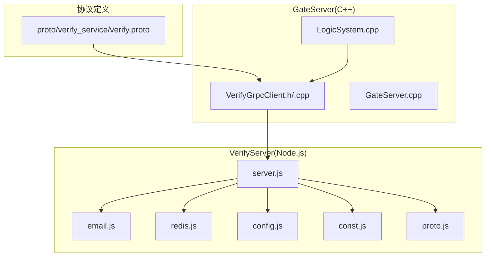
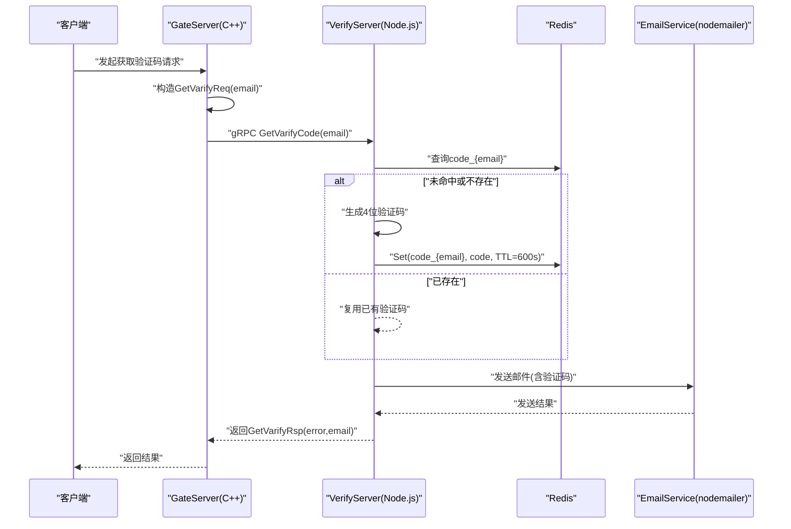
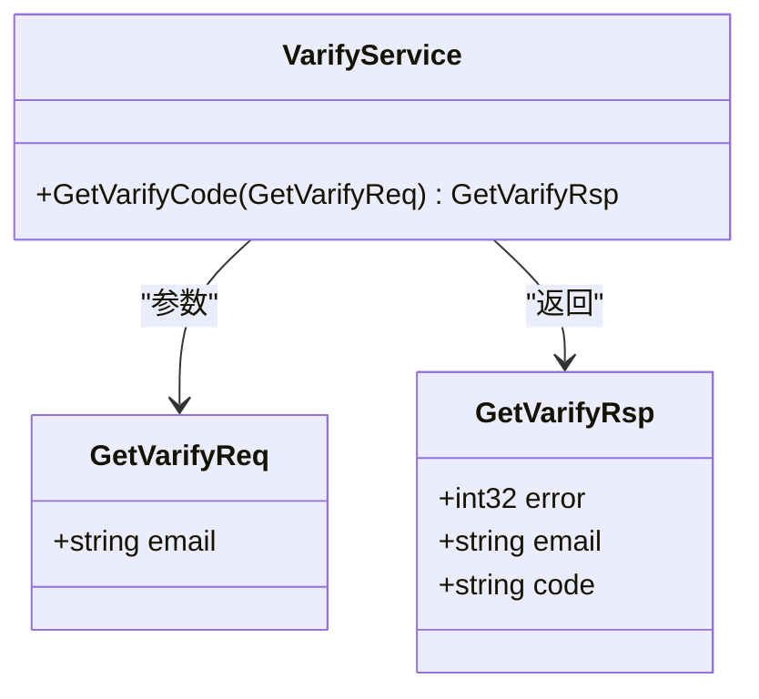
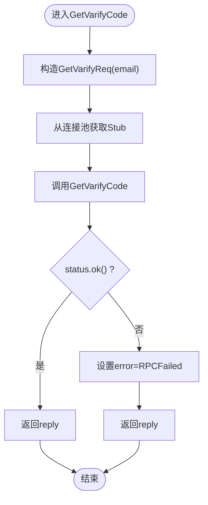
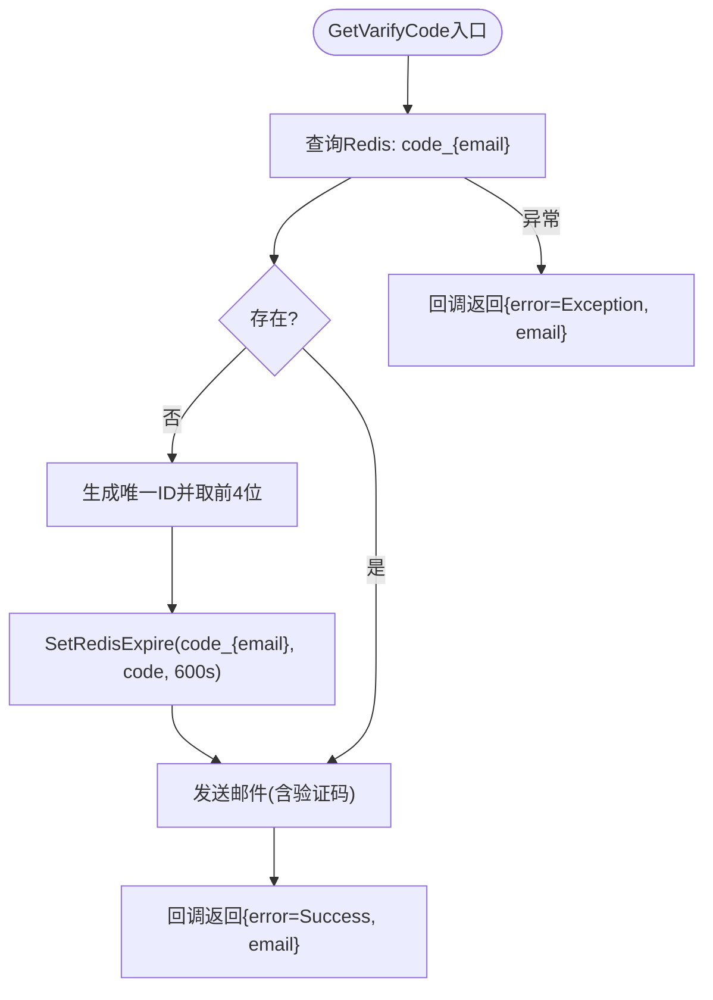
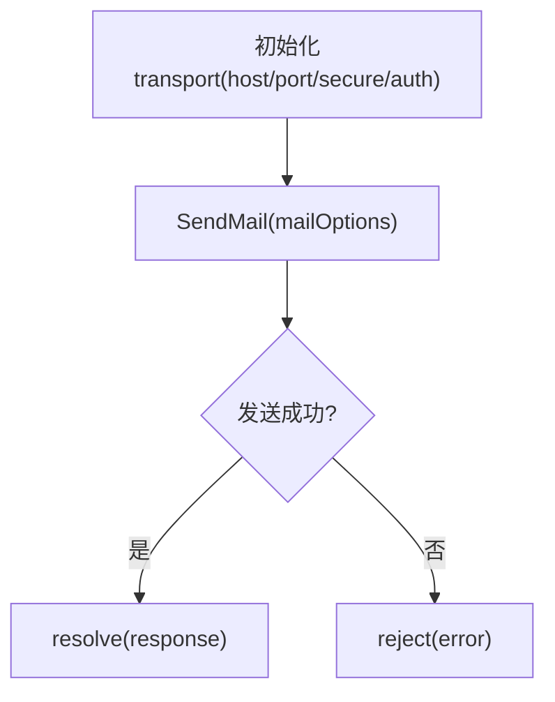
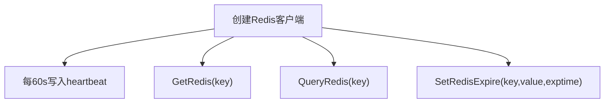
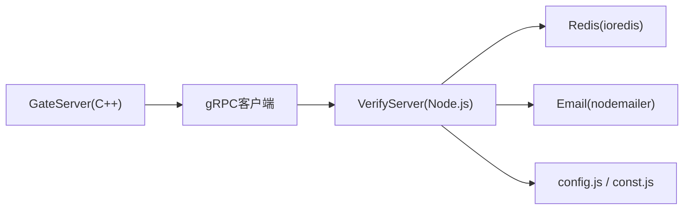
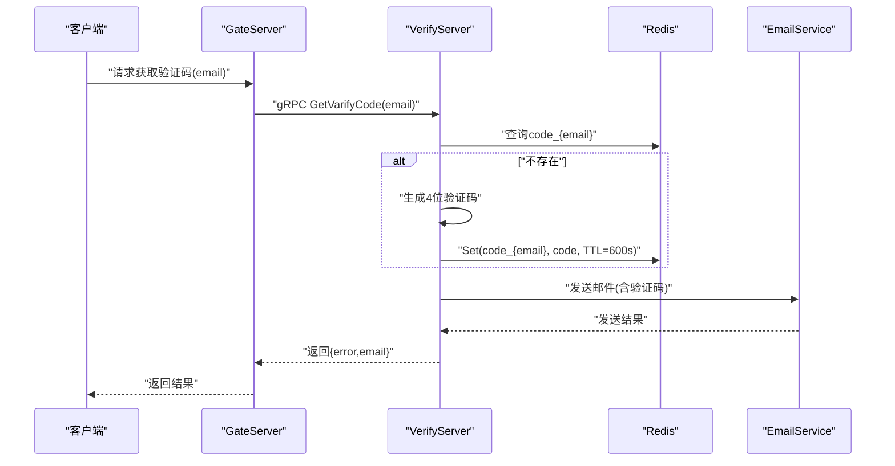

# 邮箱验证机制

<cite>
**本文引用的文件**   
- [verify.proto](file://proto/verify_service/verify.proto)
- [server.js](file://server/VarifyServer/server.js)
- [email.js](file://server/VarifyServer/email.js)
- [redis.js](file://server/VarifyServer/redis.js)
- [const.js](file://server/VarifyServer/const.js)
- [config.js](file://server/VarifyServer/config.js)
- [proto.js](file://server/VarifyServer/proto.js)
- [VerifyGrpcClient.h](file://server/GateServer/include/VerifyGrpcClient.h)
- [VerifyGrpcClient.cpp](file://server/GateServer/src/VerifyGrpcClient.cpp)
- [LogicSystem.cpp](file://server/GateServer/src/LogicSystem.cpp)
- [GateServer.cpp](file://server/GateServer/src/GateServer.cpp)
</cite>

## 目录
1. [简介](#简介)
2. [项目结构](#项目结构)
3. [核心组件](#核心组件)
4. [架构总览](#架构总览)
5. [详细组件分析](#详细组件分析)
6. [依赖关系分析](#依赖关系分析)
7. [性能考虑](#性能考虑)
8. [故障排查指南](#故障排查指南)
9. [结论](#结论)
10. [附录](#附录)

## 简介
本技术文档聚焦于 LLFCChat 的邮箱验证码与验证流程，覆盖以下关键点：
- gRPC 接口定义（请求、响应、错误码）
- 验证码生成算法与存储策略（Redis Key、TTL、过期处理）
- 邮件发送流程（SMTP 配置、模板、失败重试建议）
- GateServer 到 VerifyServer 的调用链路
- 完整的客户端→GateServer→VerifyServer→EmailService 时序图

该机制通过 GateServer 接收业务请求，转发至 VerifyServer（Node.js）完成验证码生成、Redis 存储与邮件发送，最终返回结果给上游。

## 项目结构
围绕邮箱验证的相关代码分布在如下位置：
- proto/verify_service/verify.proto：gRPC 服务定义
- server/GateServer：C++ 网关侧，包含 gRPC 客户端封装与连接池
- server/VarifyServer：Node.js 验证码服务，实现 gRPC 服务、Redis、邮件模块
- server/GateServer/src/LogicSystem.cpp：业务逻辑中调用验证码 gRPC 的入口

**图表来源** 
- [verify.proto:1-19](file://proto/verify_service/verify.proto#L1-L19)
- [VerifyGrpcClient.h:1-113](file://server/GateServer/include/VerifyGrpcClient.h#L1-L113)
- [VerifyGrpcClient.cpp:1-9](file://server/GateServer/src/VerifyGrpcClient.cpp#L1-L9)
- [server.js:1-76](file://server/VarifyServer/server.js#L1-L76)
- [email.js:1-37](file://server/VarifyServer/email.js#L1-L37)
- [redis.js:1-101](file://server/VarifyServer/redis.js#L1-L101)
- [config.js:1-15](file://server/VarifyServer/config.js#L1-L15)
- [const.js:1-10](file://server/VarifyServer/const.js#L1-L10)
- [proto.js:1-12](file://server/VarifyServer/proto.js#L1-L12)

**章节来源**
- [verify.proto:1-19](file://proto/verify_service/verify.proto#L1-L19)
- [server.js:1-76](file://server/VarifyServer/server.js#L1-L76)
- [email.js:1-37](file://server/VarifyServer/email.js#L1-L37)
- [redis.js:1-101](file://server/VarifyServer/redis.js#L1-L101)
- [const.js:1-10](file://server/VarifyServer/const.js#L1-L10)
- [config.js:1-15](file://server/VarifyServer/config.js#L1-L15)
- [proto.js:1-12](file://server/VarifyServer/proto.js#L1-L12)
- [VerifyGrpcClient.h:1-113](file://server/GateServer/include/VerifyGrpcClient.h#L1-L113)
- [VerifyGrpcClient.cpp:1-9](file://server/GateServer/src/VerifyGrpcClient.cpp#L1-L9)
- [GateServer.cpp:128-158](file://server/GateServer/src/GateServer.cpp#L128-L158)

## 核心组件
- gRPC 接口层（GateServer 客户端）
  - 负责构造请求、管理连接池、调用 VerifyServer 的 GetVarifyCode 方法
- 验证码服务（VerifyServer）
  - 生成验证码、写入 Redis（带 TTL）、发送邮件、返回统一错误码
- 邮件服务（EmailService）
  - 基于 nodemailer 的 SMTP 发送封装
- 缓存层（Redis）
  - 以 email 为维度存储验证码，设置过期时间，提供查询与设置接口
- 配置与常量
  - 读取 SMTP、Redis 配置；定义验证码前缀与错误码

**章节来源**
- [VerifyGrpcClient.h:18-113](file://server/GateServer/include/VerifyGrpcClient.h#L18-L113)
- [VerifyGrpcClient.cpp:1-9](file://server/GateServer/src/VerifyGrpcClient.cpp#L1-L9)
- [server.js:15-64](file://server/VarifyServer/server.js#L15-L64)
- [email.js:1-37](file://server/VarifyServer/email.js#L1-L37)
- [redis.js:1-101](file://server/VarifyServer/redis.js#L1-L101)
- [config.js:1-15](file://server/VarifyServer/config.js#L1-L15)
- [const.js:1-10](file://server/VarifyServer/const.js#L1-L10)

## 架构总览
下图展示了从客户端到各服务的完整交互路径，以及关键数据流向。

**图表来源** 
- [server.js:15-64](file://server/VarifyServer/server.js#L15-L64)
- [redis.js:41-98](file://server/VarifyServer/redis.js#L41-L98)
- [email.js:22-35](file://server/VarifyServer/email.js#L22-L35)
- [VerifyGrpcClient.h:87-104](file://server/GateServer/include/VerifyGrpcClient.h#L87-L104)

## 详细组件分析

### gRPC 接口定义（verify.proto）
- 服务名：VarifyService
- 方法：GetVarifyCode
- 请求体：GetVarifyReq（字段 email）
- 响应体：GetVarifyRsp（字段 error、email、code）
- 说明：当前实现中，响应包含 error 与 email，code 字段在响应中未使用（服务端内部生成并邮件发送）

**图表来源** 
- [verify.proto:1-19](file://proto/verify_service/verify.proto#L1-L19)

**章节来源**
- [verify.proto:1-19](file://proto/verify_service/verify.proto#L1-L19)

### GateServer 端 gRPC 客户端
- 连接池：RPConPool 维护多个 gRPC Stub，支持并发调用与资源回收
- 调用流程：构造请求、获取连接、发起 RPC、处理状态码、归还连接
- 错误处理：若 RPC 失败，将 reply.error 设置为 RPCFailed

**图表来源** 
- [VerifyGrpcClient.h:87-104](file://server/GateServer/include/VerifyGrpcClient.h#L87-L104)

**章节来源**
- [VerifyGrpcClient.h:18-113](file://server/GateServer/include/VerifyGrpcClient.h#L18-L113)
- [VerifyGrpcClient.cpp:1-9](file://server/GateServer/src/VerifyGrpcClient.cpp#L1-L9)

### VerifyServer 验证码服务（server.js）
- 输入：email
- 验证码生成：
  - 优先从 Redis 查询是否存在 code_{email}
  - 若不存在，生成唯一 ID 并截取前 4 位作为验证码
- 存储与过期：
  - 写入 Redis key=code_{email}，value=验证码，TTL=600 秒
- 邮件发送：
  - 构建文本内容（包含验证码与提示语），调用 email.js 发送
- 返回：
  - 成功时 error=Success，email=请求邮箱
  - 异常时 error=Exception

**图表来源** 
- [server.js:15-64](file://server/VarifyServer/server.js#L15-L64)

**章节来源**
- [server.js:1-76](file://server/VarifyServer/server.js#L1-L76)
- [const.js:1-10](file://server/VarifyServer/const.js#L1-L10)

### 邮件服务（email.js）
- 使用 nodemailer 创建 SMTP 传输通道
- 配置项：host、port、secure、auth.user、auth.pass
- 发送函数：SendMail(mailOptions_) 返回 Promise，成功 resolve，失败 reject

**图表来源** 
- [email.js:1-37](file://server/VarifyServer/email.js#L1-L37)

**章节来源**
- [email.js:1-37](file://server/VarifyServer/email.js#L1-L37)

### Redis 操作（redis.js）
- 连接与心跳：
  - 连接参数来自 config.js
  - 监听 error/end 事件并重连
  - 定时写入 heartbeat key 作为心跳
- 主要方法：
  - GetRedis(key)：获取值，不存在返回 null
  - QueryRedis(key)：判断 key 是否存在
  - SetRedisExpire(key,value,exptime)：设置键值并设置过期时间（秒）

**图表来源** 
- [redis.js:1-101](file://server/VarifyServer/redis.js#L1-L101)

**章节来源**
- [redis.js:1-101](file://server/VarifyServer/redis.js#L1-L101)

### 配置与常量（config.js、const.js）
- config.js：从 config.json 读取 email、mysql、redis 相关配置
- const.js：定义验证码前缀 code_prefix 与错误码 Errors（Success、RedisErr、Exception）

**章节来源**
- [config.js:1-15](file://server/VarifyServer/config.js#L1-L15)
- [const.js:1-10](file://server/VarifyServer/const.js#L1-L10)

### 业务调用入口（LogicSystem.cpp）
- GateServer 的业务逻辑中调用 VerifyGrpcClient::GetInstance()->GetVarifyCode(email)
- 该调用位于 LogicSystem.cpp 的第 138 行附近

**章节来源**
- [LogicSystem.cpp:138-138](file://server/GateServer/src/LogicSystem.cpp#L138-L138)

## 依赖关系分析
- GateServer 依赖：
  - gRPC 客户端库与生成的 stub（verify.grpc.pb.h）
  - 配置管理器 ConfigMgr（用于获取 VerifyServer 地址）
- VerifyServer 依赖：
  - @grpc/grpc-js、@grpc/proto-loader
  - ioredis（Redis 客户端）
  - nodemailer（邮件发送）
  - uuid（生成唯一 ID）
- 外部系统：
  - Redis 服务器
  - SMTP 服务器（如 smtp.163.com）

**图表来源** 
- [VerifyGrpcClient.h:1-113](file://server/GateServer/include/VerifyGrpcClient.h#L1-L113)
- [server.js:1-76](file://server/VarifyServer/server.js#L1-L76)
- [redis.js:1-101](file://server/VarifyServer/redis.js#L1-L101)
- [email.js:1-37](file://server/VarifyServer/email.js#L1-L37)

**章节来源**
- [VerifyGrpcClient.h:1-113](file://server/GateServer/include/VerifyGrpcClient.h#L1-L113)
- [server.js:1-76](file://server/VarifyServer/server.js#L1-L76)
- [redis.js:1-101](file://server/VarifyServer/redis.js#L1-L101)
- [email.js:1-37](file://server/VarifyServer/email.js#L1-L37)

## 性能考虑
- 连接池与并发：
  - GateServer 使用 RPConPool 管理多个 gRPC Stub，提升并发能力与资源复用
- Redis 操作：
  - 单次查询与设置，TTL 控制内存占用与过期清理
  - 心跳机制保障连接健康
- 邮件发送：
  - 异步 Promise 模式，避免阻塞主流程
  - 建议增加重试与退避策略（见故障排查）

[本节为通用指导，不直接分析具体文件]

## 故障排查指南
- Redis 连接问题：
  - 检查 redis.js 的连接参数与网络连通性
  - 关注 error/end 事件日志，确认重连是否生效
- 验证码未生成或过期：
  - 确认 Redis 中是否存在 code_{email}
  - 检查 TTL 是否为 600 秒
- 邮件发送失败：
  - 校验 SMTP 配置（host、port、secure、auth）
  - 查看 email.js 的 reject 日志
  - 建议增加重试机制与指数退避
- gRPC 调用失败：
  - 检查 GateServer 配置的 VerifyServer 地址与端口
  - 观察 VerifyGrpcClient 的错误码（RPCFailed）

**章节来源**
- [redis.js:16-28](file://server/VarifyServer/redis.js#L16-L28)
- [email.js:22-35](file://server/VarifyServer/email.js#L22-L35)
- [VerifyGrpcClient.h:95-104](file://server/GateServer/include/VerifyGrpcClient.h#L95-L104)

## 结论
LLFCChat 的邮箱验证机制通过 GateServer 与 VerifyServer 的解耦设计，实现了高内聚、低耦合的验证码生成与邮件发送流程。Redis 作为短期存储介质，结合 TTL 保证安全性与资源可控；gRPC 接口清晰明确，便于扩展与维护。建议在邮件发送层引入重试与监控，进一步提升可靠性。

[本节为总结，不直接分析具体文件]

## 附录

### 邮箱验证时序图（客户端→GateServer→VerifyServer→EmailService）

**图表来源** 
- [server.js:15-64](file://server/VarifyServer/server.js#L15-L64)
- [redis.js:41-98](file://server/VarifyServer/redis.js#L41-L98)
- [email.js:22-35](file://server/VarifyServer/email.js#L22-L35)
- [VerifyGrpcClient.h:87-104](file://server/GateServer/include/VerifyGrpcClient.h#L87-L104)

### gRPC 接口定义（请求/响应/错误码）
- 服务与方法：VarifyService.GetVarifyCode
- 请求：GetVarifyReq.email
- 响应：GetVarifyRsp.error、GetVarifyRsp.email、GetVarifyRsp.code（当前未使用）
- 错误码：Success、RedisErr、Exception（由 VerifyServer 定义）

**章节来源**
- [verify.proto:1-19](file://proto/verify_service/verify.proto#L1-L19)
- [const.js:1-10](file://server/VarifyServer/const.js#L1-L10)

### Redis 存储结构与清理策略
- Key：code_{email}
- Value：4 位验证码
- TTL：600 秒
- 清理策略：依赖 Redis 自动过期；可配合心跳与健康检查确保连接稳定

**章节来源**
- [server.js:24-36](file://server/VarifyServer/server.js#L24-L36)
- [redis.js:87-98](file://server/VarifyServer/redis.js#L87-L98)

### 邮件模板与 SMTP 配置
- 模板：纯文本，包含验证码与提示语
- SMTP：host=smtp.163.com，port=465，secure=true，auth.user/pass 来自 config.json
- 发送失败：Promise reject，建议增加重试与退避

**章节来源**
- [server.js:39-53](file://server/VarifyServer/server.js#L39-L53)
- [email.js:7-15](file://server/VarifyServer/email.js#L7-L15)
- [config.js:1-15](file://server/VarifyServer/config.js#L1-L15)