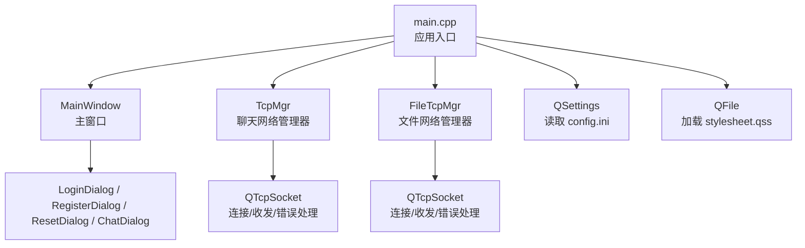
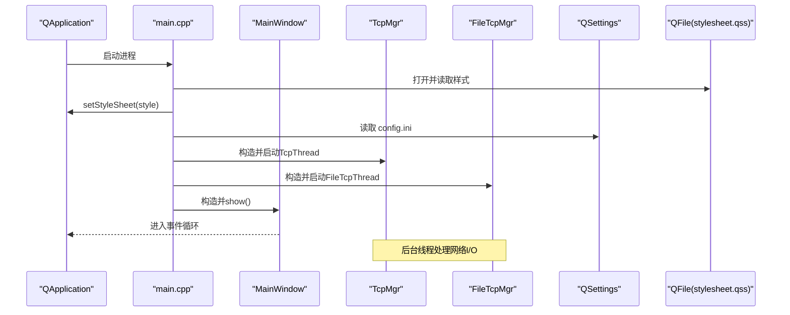
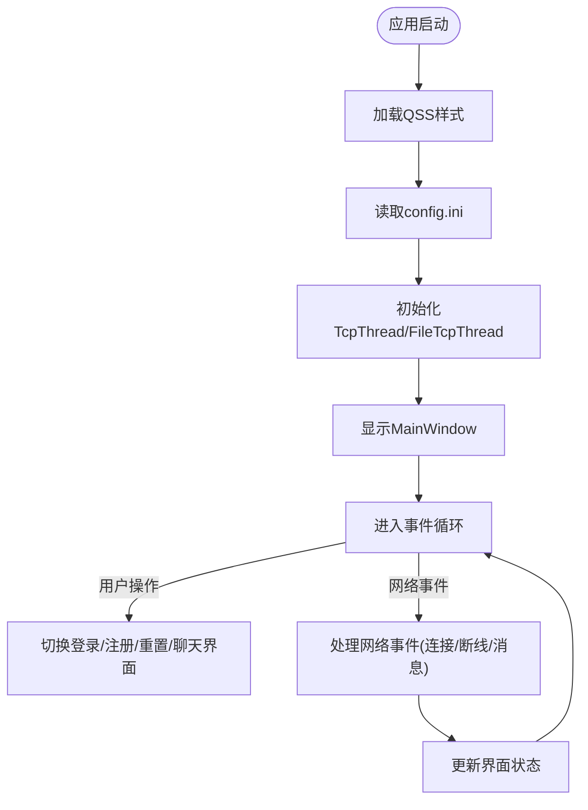
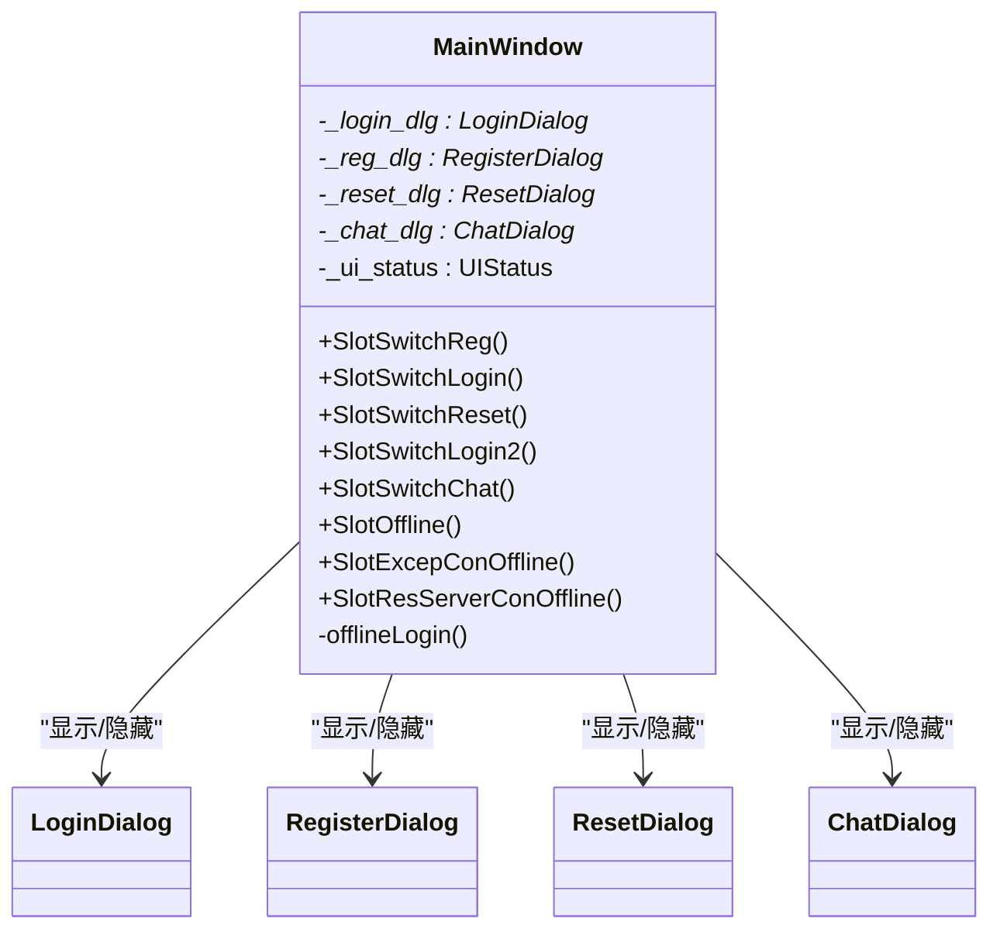
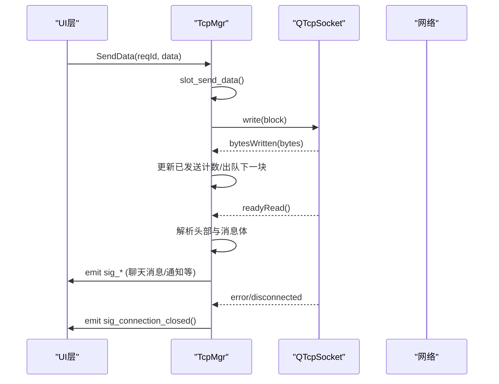
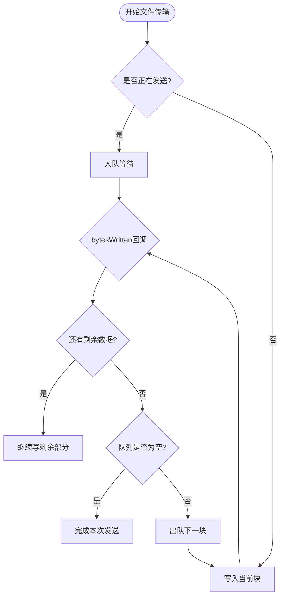
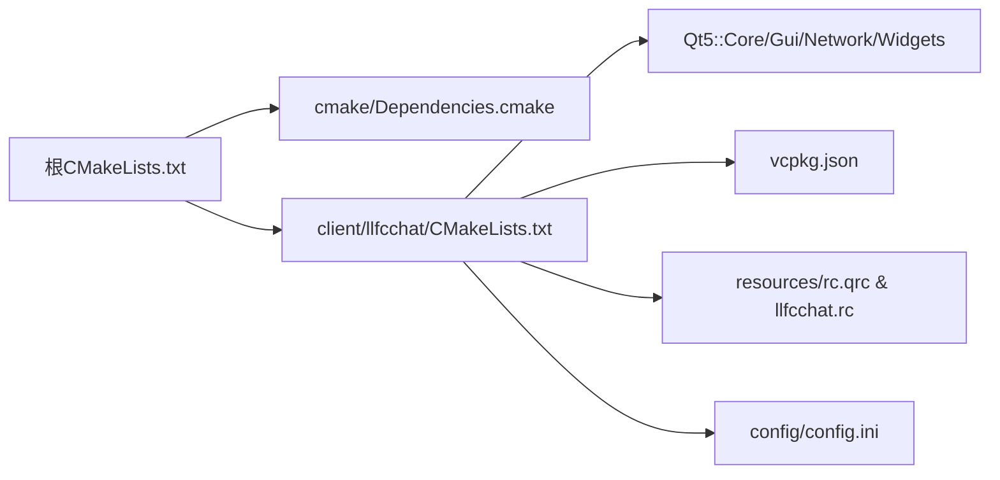

# Qt应用架构

<cite>
**本文引用的文件**   
- [main.cpp](file://client/llfcchat/src/main.cpp)
- [mainwindow.h](file://client/llfcchat/include/mainwindow.h)
- [mainwindow.cpp](file://client/llfcchat/src/mainwindow.cpp)
- [tcpmgr.h](file://client/llfcchat/include/tcpmgr.h)
- [tcpmgr.cpp](file://client/llfcchat/src/tcpmgr.cpp)
- [filetcpmgr.h](file://client/llfcchat/include/filetcpmgr.h)
- [filetcpmgr.cpp](file://client/llfcchat/src/filetcpmgr.cpp)
- [global.h](file://client/llfcchat/include/global.h)
- [singleton.h](file://client/llfcchat/include/singleton.h)
- [config.ini](file://client/llfcchat/config/config.ini)
- [CMakeLists.txt（客户端）](file://client/llfcchat/CMakeLists.txt)
- [CMakeLists.txt（根）](file://CMakeLists.txt)
- [Dependencies.cmake](file://cmake/Dependencies.cmake)
- [vcpkg.json](file://vcpkg.json)
</cite>

## 目录
1. [简介](#简介)
2. [项目结构](#项目结构)
3. [核心组件](#核心组件)
4. [架构总览](#架构总览)
5. [详细组件分析](#详细组件分析)
6. [依赖关系分析](#依赖关系分析)
7. [性能与并发特性](#性能与并发特性)
8. [故障排查指南](#故障排查指南)
9. [结论](#结论)
10. [附录：构建与配置](#附录构建与配置)

## 简介
本文件面向LLFCChat Qt客户端，系统化阐述应用启动流程、主窗口管理、QSS样式加载机制、配置文件读取、网络线程模型（TcpThread/FileTcpThread）、生命周期管理与资源清理，以及CMake构建与依赖管理。文档兼顾初学者理解与资深开发者对架构细节的需求，提供流程图与时序图辅助说明。

## 项目结构
- 客户端代码位于 client/llfcchat，包含UI界面、业务逻辑、网络模块与资源。
- 顶层 CMakeLists.txt 聚合 server 与 client 子项目；客户端子工程负责生成可执行文件并打包资源。
- 关键入口 main.cpp 负责初始化Qt应用、加载QSS、读取配置、启动网络线程、显示主窗口。
- MainWindow 作为主容器，通过切换中央部件实现登录、注册、重置密码、聊天等界面的状态管理。
- TcpMgr 与 FileTcpMgr 分别负责聊天消息与文件传输的TCP通信，均基于单例模式与信号槽机制。
- 全局常量、协议ID、数据结构定义在 global.h；通用单例模板在 singleton.h。

图表来源
- [main.cpp:1-44](file://client/llfcchat/src/main.cpp#L1-L44)
- [mainwindow.cpp:1-164](file://client/llfcchat/src/mainwindow.cpp#L1-L164)
- [tcpmgr.cpp:1-136](file://client/llfcchat/src/tcpmgr.cpp#L1-L136)
- [filetcpmgr.cpp:1-143](file://client/llfcchat/src/filetcpmgr.cpp#L1-L143)

章节来源
- [CMakeLists.txt（客户端）:167-222](file://client/llfcchat/CMakeLists.txt#L167-L222)
- [CMakeLists.txt（根）:1-34](file://CMakeLists.txt#L1-L34)

## 核心组件
- 应用入口与生命周期
  - QApplication 创建后，立即加载QSS样式表，随后读取配置文件，启动两个网络线程管理器，最后显示MainWindow并进入事件循环。
- 主窗口管理
  - MainWindow 使用 setCentralWidget 动态切换 LoginDialog、RegisterDialog、ResetDialog、ChatDialog，并通过信号槽响应网络层事件（如踢人、断线）。
- QSS样式加载
  - 从资源路径加载 stylesheet.qss，设置到 QApplication 上，使整个应用生效。
- 配置文件管理
  - 使用 QSettings 读取 applicationDirPath 下的 config.ini，获取 GateServer 的 host/port，拼接 HTTP 前缀供后续HTTP请求使用。
- 网络线程模型
  - TcpThread 与 FileTcpThread 是轻量包装类，持有 QThread* 用于隔离网络I/O任务；实际连接与收发由 TcpMgr 与 FileTcpMgr 完成。
  - 发送采用队列+bytesWritten回调的流式发送，避免阻塞UI线程。
  - 接收采用粘包处理，解析头部（ReqId + Length），再按长度切分消息体，交由 handler 分发。

章节来源
- [main.cpp:1-44](file://client/llfcchat/src/main.cpp#L1-L44)
- [mainwindow.h:1-57](file://client/llfcchat/include/mainwindow.h#L1-L57)
- [mainwindow.cpp:1-164](file://client/llfcchat/src/mainwindow.cpp#L1-L164)
- [tcpmgr.h:1-90](file://client/llfcchat/include/tcpmgr.h#L1-L90)
- [tcpmgr.cpp:1-136](file://client/llfcchat/src/tcpmgr.cpp#L1-L136)
- [filetcpmgr.h:1-85](file://client/llfcchat/include/filetcpmgr.h#L1-L85)
- [filetcpmgr.cpp:1-143](file://client/llfcchat/src/filetcpmgr.cpp#L1-L143)

## 架构总览
下图展示客户端整体交互：应用启动→样式与配置加载→网络管理器初始化→主窗口显示→各对话框切换→网络事件驱动界面更新。

图表来源
- [main.cpp:1-44](file://client/llfcchat/src/main.cpp#L1-L44)
- [tcpmgr.h:1-90](file://client/llfcchat/include/tcpmgr.h#L1-L90)
- [filetcpmgr.h:1-85](file://client/llfcchat/include/filetcpmgr.h#L1-L85)

## 详细组件分析

### 应用启动流程与生命周期
- 初始化顺序
  - 创建 QApplication
  - 从资源加载 QSS 并设置到应用
  - 读取 applicationDirPath 下的 config.ini，提取 GateServer host/port，拼接 gate_url_prefix
  - 实例化 TcpThread 与 FileTcpThread（内部持有 QThread*）
  - 创建 MainWindow 并 show，进入 a.exec() 事件循环
- 生命周期与资源清理
  - MainWindow 析构时释放 ui 指针；对话框对象由父窗口或Qt父子关系自动管理
  - 网络层断开时触发 sig_connection_closed，主窗口统一关闭连接并回退到登录界面
  - 退出应用时，Qt自动销毁QObject树，无需手动释放所有子对象

图表来源
- [main.cpp:1-44](file://client/llfcchat/src/main.cpp#L1-L44)
- [mainwindow.cpp:1-164](file://client/llfcchat/src/mainwindow.cpp#L1-L164)

章节来源
- [main.cpp:1-44](file://client/llfcchat/src/main.cpp#L1-L44)
- [mainwindow.cpp:1-164](file://client/llfcchat/src/mainwindow.cpp#L1-L164)

### MainWindow主窗口管理
- 界面状态机
  - _ui_status 控制当前界面状态：LOGIN_UI、REGISTER_UI、RESET_UI、CHAT_UI
  - 通过 setCentralWidget 动态替换中心部件，实现无模态切换
- 信号槽绑定
  - 登录界面切换到注册/重置
  - 网络层通知切换至聊天界面、离线提示、异常断线、资源服务器断开
- 断线恢复
  - 收到离线或异常断线信号后，关闭Tcp与File连接，调用 offlineLogin 回到登录界面并重置窗口尺寸

图表来源
- [mainwindow.h:1-57](file://client/llfcchat/include/mainwindow.h#L1-L57)
- [mainwindow.cpp:1-164](file://client/llfcchat/src/mainwindow.cpp#L1-L164)

章节来源
- [mainwindow.h:1-57](file://client/llfcchat/include/mainwindow.h#L1-L57)
- [mainwindow.cpp:1-164](file://client/llfcchat/src/mainwindow.cpp#L1-L164)

### QSS样式加载机制
- 从资源路径加载 stylesheet.qss，失败则输出日志
- 将样式字符串设置到 QApplication，影响全部控件外观
- 建议在资源文件中维护样式，便于跨平台部署

章节来源
- [main.cpp:1-44](file://client/llfcchat/src/main.cpp#L1-L44)

### 配置文件管理
- 使用 QSettings 读取 applicationDirPath 下的 config.ini
- 读取 GateServer/host 与 GateServer/port，拼接 gate_url_prefix 供HTTP模块使用
- 构建阶段将 config.ini 复制到目标目录，确保运行时可用

章节来源
- [main.cpp:1-44](file://client/llfcchat/src/main.cpp#L1-L44)
- [config.ini:1-4](file://client/llfcchat/config/config.ini#L1-L4)
- [CMakeLists.txt（客户端）:212-221](file://client/llfcchat/CMakeLists.txt#L212-L221)

### TcpThread与TcpMgr线程模型
- 设计要点
  - TcpThread 仅持有 QThread*，用于隔离网络I/O任务
  - TcpMgr 继承 QObject，使用信号槽与QTcpSocket交互，避免阻塞UI线程
  - 发送采用队列与 bytesWritten 回调，保证有序、非阻塞发送
  - 接收采用粘包处理，解析头部（ReqId + Length），再按长度切分消息体
- 消息处理
  - initHandlers 注册各类 ReqId 的处理函数，解析JSON并转换为业务对象
  - 通过信号将数据转发给UI层（如聊天消息、好友申请、认证结果等）
- 错误与断线
  - error 信号区分连接拒绝、远程关闭、主机未找到、超时等
  - disconnected 信号通知UI层进行重连或回退登录

图表来源
- [tcpmgr.cpp:1-136](file://client/llfcchat/src/tcpmgr.cpp#L1-L136)
- [tcpmgr.h:1-90](file://client/llfcchat/include/tcpmgr.h#L1-L90)

章节来源
- [tcpmgr.h:1-90](file://client/llfcchat/include/tcpmgr.h#L1-L90)
- [tcpmgr.cpp:1-136](file://client/llfcchat/src/tcpmgr.cpp#L1-L136)

### FileTcpMgr文件传输线程模型
- 设计要点
  - FileTcpThread 与 TcpThread 类似，持有 QThread* 隔离文件传输I/O
  - FileTcpMgr 同样基于信号槽与QTcpSocket，支持上传/下载、断点续传、进度更新
- 粘包与分片
  - 接收端按 FILE_UPLOAD_HEAD_LEN 解析头部，再按长度切分消息体
  - 发送端使用队列与 bytesWritten 回调，支持大文件分片与拥塞窗口控制
- 断点续传与进度
  - 上传：根据 last_seq 与 trans_size 继续发送，维护 seq 与确认集合
  - 下载：按 seq 覆盖/追加写入，计算 current_size/total_size 并上报进度
- 图片消息特殊处理
  - 本地不存在图片时生成占位图，同时组织数据发送；存在则直接加载并构建消息

图表来源
- [filetcpmgr.cpp:1-143](file://client/llfcchat/src/filetcpmgr.cpp#L1-L143)
- [filetcpmgr.h:1-85](file://client/llfcchat/include/filetcpmgr.h#L1-L85)

章节来源
- [filetcpmgr.h:1-85](file://client/llfcchat/include/filetcpmgr.h#L1-L85)
- [filetcpmgr.cpp:1-143](file://client/llfcchat/src/filetcpmgr.cpp#L1-L143)

### 单例与全局数据
- Singleton 模板类提供线程安全的单例访问，用于 TcpMgr、FileTcpMgr 等全局管理器
- global.h 定义协议ID、错误码、传输状态、消息类型、数据结构等，集中管理跨模块共享信息

章节来源
- [singleton.h:1-46](file://client/llfcchat/include/singleton.h#L1-L46)
- [global.h:1-296](file://client/llfcchat/include/global.h#L1-L296)

## 依赖关系分析
- 构建系统
  - 根 CMakeLists.txt 引入 cmake/Dependencies.cmake 与 GrpcCodegen.cmake，设置C++标准与子项目
  - 客户端 CMakeLists.txt 声明源文件、头文件、UI文件、资源文件，链接Qt5 Core/Gui/Network/Widgets
  - 使用 vcpkg 管理第三方库，qt5-base 与 qt5-imageformats 启用必要功能
- 运行时依赖
  - config.ini 与静态资源在构建后复制至目标目录，确保应用运行所需文件存在

图表来源
- [CMakeLists.txt（根）:1-34](file://CMakeLists.txt#L1-L34)
- [CMakeLists.txt（客户端）:1-222](file://client/llfcchat/CMakeLists.txt#L1-L222)
- [Dependencies.cmake:1-82](file://cmake/Dependencies.cmake#L1-L82)
- [vcpkg.json:1-32](file://vcpkg.json#L1-L32)

章节来源
- [CMakeLists.txt（根）:1-34](file://CMakeLists.txt#L1-L34)
- [CMakeLists.txt（客户端）:1-222](file://client/llfcchat/CMakeLists.txt#L1-L222)
- [Dependencies.cmake:1-82](file://cmake/Dependencies.cmake#L1-L82)
- [vcpkg.json:1-32](file://vcpkg.json#L1-L32)

## 性能与并发特性
- 非阻塞I/O
  - 使用 QTcpSocket 的信号槽机制，避免阻塞UI线程
  - 发送队列与 bytesWritten 回调保证有序、高效发送
- 粘包处理
  - 接收端按固定头部解析，防止粘包导致的解析错误
- 断点续传
  - 文件传输支持断点续传与进度更新，提升弱网环境稳定性
- 拥塞控制
  - 文件传输维护拥塞窗口大小，限制并发发送数量，避免网络拥塞

[本节为通用指导，不直接分析具体文件]

## 故障排查指南
- 连接失败
  - 检查 config.ini 中 GateServer 的 host/port 是否正确
  - 查看 error 信号中的错误类型（连接拒绝、主机未找到、超时等）
- 断线处理
  - 收到 disconnected 信号后，主窗口会弹出提示并回退到登录界面
  - 检查网络层是否主动关闭连接或心跳超时
- 文件传输问题
  - 确认本地存储路径是否存在，权限是否足够
  - 检查 seq、trans_size、last_seq 等字段是否正确，确保续传逻辑正常

章节来源
- [tcpmgr.cpp:1-136](file://client/llfcchat/src/tcpmgr.cpp#L1-L136)
- [filetcpmgr.cpp:1-143](file://client/llfcchat/src/filetcpmgr.cpp#L1-L143)
- [mainwindow.cpp:1-164](file://client/llfcchat/src/mainwindow.cpp#L1-L164)

## 结论
LLFCChat Qt客户端采用清晰的模块化架构：应用入口负责初始化与资源加载，主窗口管理界面状态与用户交互，网络层通过单例管理器与线程隔离实现高内聚、低耦合的通信能力。QSS样式与配置文件分离，便于定制与维护。CMake与vcpkg协同管理依赖，确保构建与部署的一致性。该设计既适合初学者学习，也为有经验开发者提供了可扩展的架构基础。

[本节为总结性内容，不直接分析具体文件]

## 附录：构建与配置
- 构建要求
  - 使用 Ninja Multi-Config 生成器
  - 启用 vcpkg 工具链，安装 qt5-base 与 qt5-imageformats
- 构建步骤
  - 在根目录执行 CMake 配置与构建
  - 客户端目标将自动复制 config.ini 与静态资源到输出目录
- 运行配置
  - 确保 config.ini 存在于可执行文件同目录
  - 检查网络连接与防火墙设置

章节来源
- [CMakeLists.txt（根）:1-34](file://CMakeLists.txt#L1-L34)
- [CMakeLists.txt（客户端）:1-222](file://client/llfcchat/CMakeLists.txt#L1-L222)
- [Dependencies.cmake:1-82](file://cmake/Dependencies.cmake#L1-L82)
- [vcpkg.json:1-32](file://vcpkg.json#L1-L32)