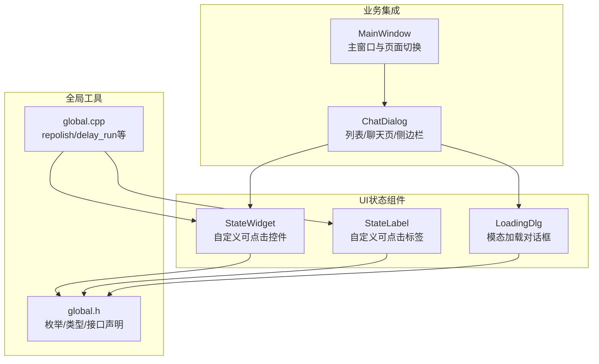
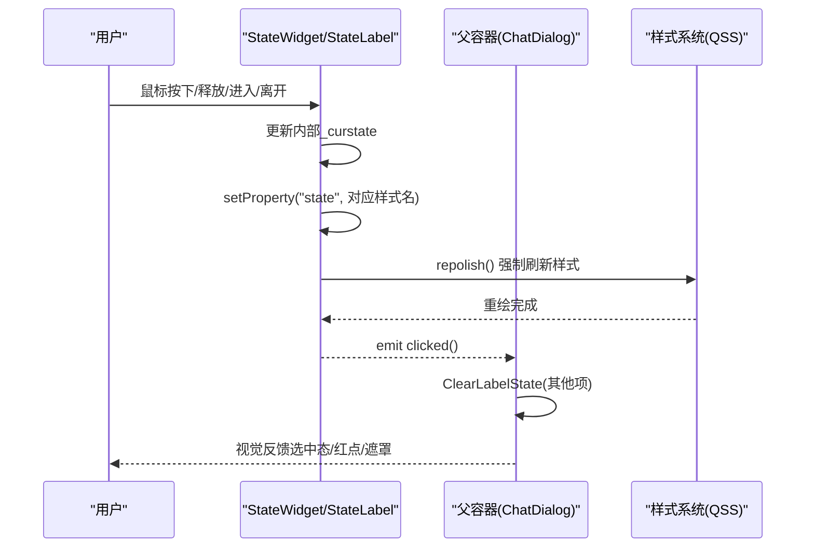
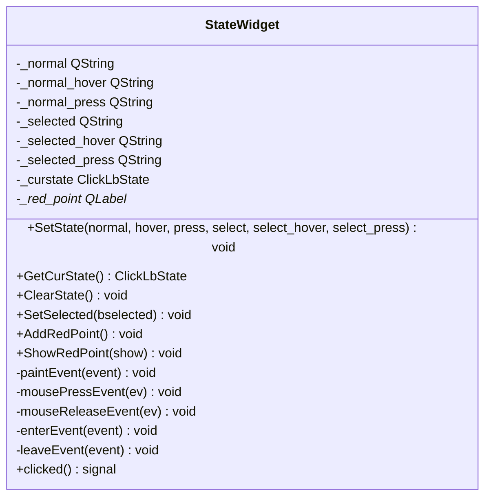
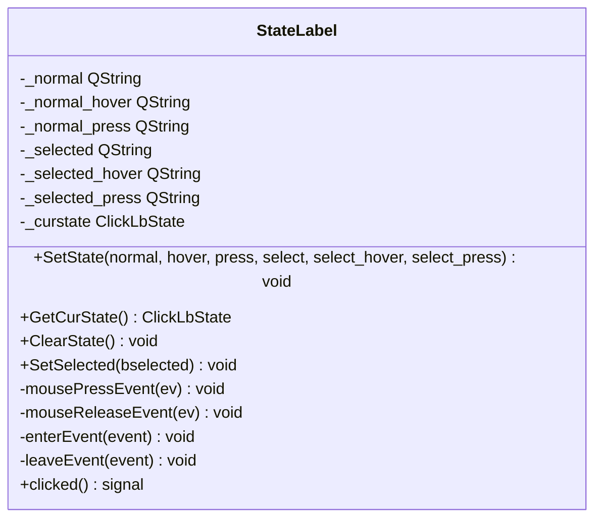
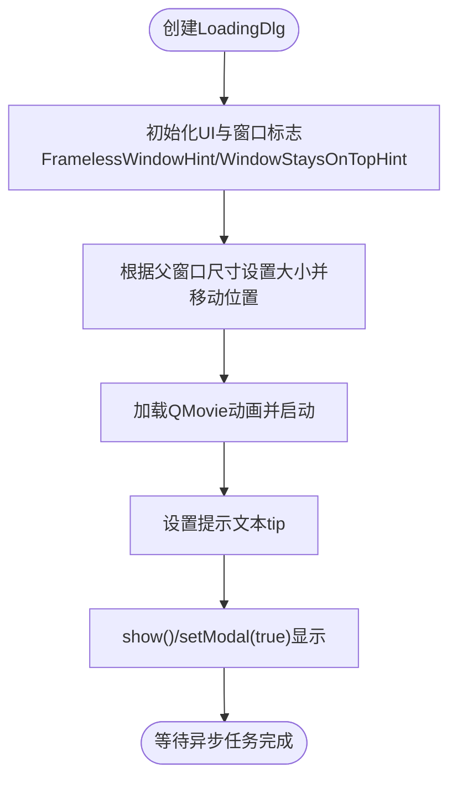
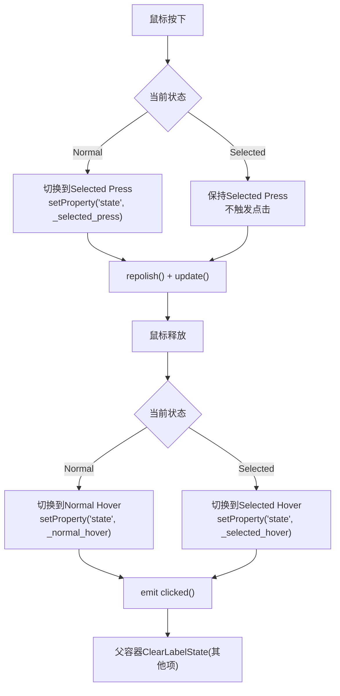
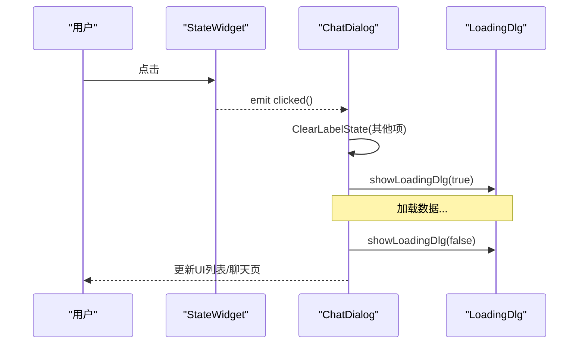
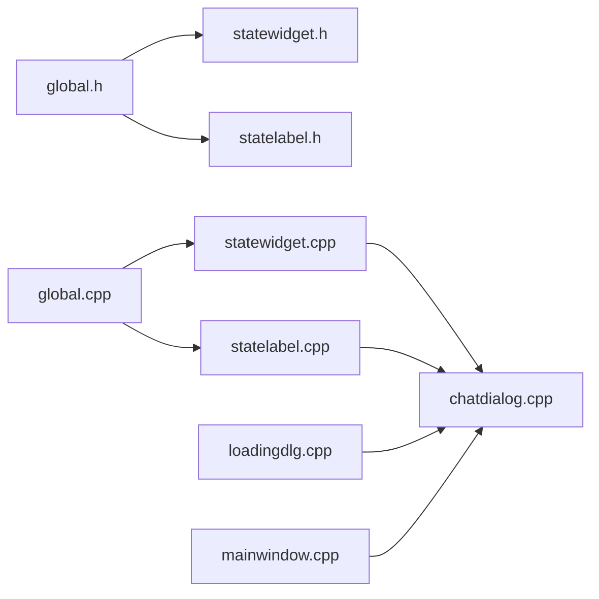

# UI状态管理

<cite>
**本文引用的文件**   
- [statewidget.h](file://client/llfcchat/include/statewidget.h)
- [statewidget.cpp](file://client/llfcchat/src/statewidget.cpp)
- [statelabel.h](file://client/llfcchat/include/statelabel.h)
- [statelabel.cpp](file://client/llfcchat/src/statelabel.cpp)
- [loadingdlg.h](file://client/llfcchat/include/loadingdlg.h)
- [loadingdlg.cpp](file://client/llfcchat/src/loadingdlg.cpp)
- [global.h](file://client/llfcchat/include/global.h)
- [global.cpp](file://client/llfcchat/src/global.cpp)
- [chatdialog.cpp](file://client/llfcchat/src/chatdialog.cpp)
- [mainwindow.cpp](file://client/llfcchat/src/mainwindow.cpp)
</cite>

## 目录
1. [简介](#简介)
2. [项目结构](#项目结构)
3. [核心组件](#核心组件)
4. [架构总览](#架构总览)
5. [详细组件分析](#详细组件分析)
6. [依赖关系分析](#依赖关系分析)
7. [性能考量](#性能考量)
8. [故障排查指南](#故障排查指南)
9. [结论](#结论)
10. [附录](#附录)

## 简介
本文件面向LLFCChat客户端的UI状态管理系统，重点围绕StateWidget、StateLabel的状态管理机制与LoadingDlg加载对话框的设计模式进行系统化说明。文档涵盖：
- 状态切换与动画过渡（基于QSS属性驱动的样式刷新）
- 用户反馈（红点提示、点击信号、模态遮罩）
- UI状态的层次结构与同步机制（父容器对多个子项的状态集中管理）
- 错误处理策略与异常恢复
- 状态持久化与恢复思路（结合全局配置与内存对象）
- 内存管理与资源释放
- Qt状态机模式、事件驱动编程与响应式UI设计原则的实践要点

## 项目结构
UI状态相关代码集中在客户端模块中，关键文件如下：
- 头文件定义：statewidget.h、statelabel.h、loadingdlg.h、global.h
- 实现文件：statewidget.cpp、statelabel.cpp、loadingdlg.cpp、global.cpp
- 使用示例：chatdialog.cpp（状态切换与加载对话框）、mainwindow.cpp（应用级界面切换）

图表来源 
- [statewidget.h](file://client/llfcchat/include/statewidget.h)
- [statelabel.h](file://client/llfcchat/include/statelabel.h)
- [loadingdlg.h](file://client/llfcchat/include/loadingdlg.h)
- [global.h](file://client/llfcchat/include/global.h)
- [global.cpp](file://client/llfcchat/src/global.cpp)
- [chatdialog.cpp](file://client/llfcchat/src/chatdialog.cpp)
- [mainwindow.cpp](file://client/llfcchat/src/mainwindow.cpp)

章节来源
- [statewidget.h](file://client/llfcchat/include/statewidget.h)
- [statelabel.h](file://client/llfcchat/include/statelabel.h)
- [loadingdlg.h](file://client/llfcchat/include/loadingdlg.h)
- [global.h](file://client/llfcchat/include/global.h)

## 核心组件
- StateWidget：继承QWidget，封装鼠标交互与QSS属性驱动的样式切换，支持Normal/Hover/Press/Selected及其Hover/Press变体，内置红点提示能力。
- StateLabel：继承QLabel，行为与StateWidget一致，适用于轻量文本标签场景。
- LoadingDlg：模态加载对话框，覆盖父窗口区域，显示GIF动画与提示文本，支持透明背景与置顶显示。
- global：提供repolish函数用于强制刷新QSS样式，以及延迟执行、哈希计算等通用工具。

章节来源
- [statewidget.cpp](file://client/llfcchat/src/statewidget.cpp)
- [statelabel.cpp](file://client/llfcchat/src/statelabel.cpp)
- [loadingdlg.cpp](file://client/llfcchat/src/loadingdlg.cpp)
- [global.cpp](file://client/llfcchat/src/global.cpp)

## 架构总览
UI状态管理的核心思想是“事件驱动 + QSS属性驱动 + 集中式状态同步”：
- 事件驱动：鼠标按下、释放、进入、离开事件触发状态变更。
- QSS属性驱动：通过setProperty("state", ...)设置样式属性，调用repolish刷新渲染。
- 集中式同步：父容器维护子项列表，在选中某一项时统一清除其他项状态，保证互斥选择。

图表来源 
- [statewidget.cpp](file://client/llfcchat/src/statewidget.cpp)
- [statelabel.cpp](file://client/llfcchat/src/statelabel.cpp)
- [chatdialog.cpp](file://client/llfcchat/src/chatdialog.cpp)
- [global.cpp](file://client/llfcchat/src/global.cpp)

## 详细组件分析

### StateWidget 组件分析
- 功能要点
  - 鼠标事件处理：按下、释放、进入、离开分别切换不同样式属性。
  - 状态存储：_curstate记录当前状态（Normal/Selected）。
  - 样式刷新：setProperty("state", ...)配合repolish实现即时样式切换。
  - 红点提示：内部包含一个QLabel作为红点指示器，支持显示/隐藏。
  - 信号：clicked用于通知上层点击行为。
- 复杂度与性能
  - 事件处理为O(1)，样式刷新由Qt样式系统负责；频繁update可能带来重绘开销，建议合理合并更新。
- 错误处理
  - 基类事件调用保留，确保默认行为不被破坏。
- 优化建议
  - 避免在高频事件中重复repaint；可使用QTimer节流或批量更新。
  - 红点布局与可见性控制应谨慎，防止布局抖动。

图表来源 
- [statewidget.h](file://client/llfcchat/include/statewidget.h)
- [statewidget.cpp](file://client/llfcchat/src/statewidget.cpp)

章节来源
- [statewidget.h](file://client/llfcchat/include/statewidget.h)
- [statewidget.cpp](file://client/llfcchat/src/statewidget.cpp)

### StateLabel 组件分析
- 功能要点
  - 与StateWidget一致的交互逻辑，但更轻量，适合纯文本标签。
  - 同样通过setProperty("state", ...)与repolish实现样式切换。
  - 信号clicked用于上层监听点击。
- 复杂度与性能
  - 事件处理O(1)，样式刷新开销同StateWidget。
- 错误处理
  - 基类事件调用保留，保证默认行为。

图表来源 
- [statelabel.h](file://client/llfcchat/include/statelabel.h)
- [statelabel.cpp](file://client/llfcchat/src/statelabel.cpp)

章节来源
- [statelabel.h](file://client/llfcchat/include/statelabel.h)
- [statelabel.cpp](file://client/llfcchat/src/statelabel.cpp)

### LoadingDlg 加载对话框分析
- 设计模式
  - 模态显示：setModal(true)阻塞父窗口交互，确保用户注意力集中于加载过程。
  - 覆盖显示：根据父窗口尺寸设置自身大小并移动到父窗口左上角，形成遮罩效果。
  - 进度指示：使用QMovie播放GIF动画，动态展示加载状态。
  - 提示文本：通过构造参数tip设置状态文本。
- 用户体验
  - 无边框、半透明背景、置顶显示，提升沉浸感与聚焦度。
- 错误处理
  - 资源路径需正确配置（":/res/loading.gif"），否则动画无法显示。
  - 父窗口为空时需做防御性判断，避免崩溃。

图表来源 
- [loadingdlg.cpp](file://client/llfcchat/src/loadingdlg.cpp)

章节来源
- [loadingdlg.h](file://client/llfcchat/include/loadingdlg.h)
- [loadingdlg.cpp](file://client/llfcchat/src/loadingdlg.cpp)

### 状态切换流程（以StateWidget为例）

图表来源 
- [statewidget.cpp](file://client/llfcchat/src/statewidget.cpp)
- [chatdialog.cpp](file://client/llfcchat/src/chatdialog.cpp)

章节来源
- [statewidget.cpp](file://client/llfcchat/src/statewidget.cpp)
- [chatdialog.cpp](file://client/llfcchat/src/chatdialog.cpp)

### 父容器状态同步（ChatDialog）
- 维护子项列表_lb_list，用于统一清理非选中项状态。
- ClearLabelState遍历列表，调用ClearState重置样式与内部状态。
- showLoadingDlg在数据加载前显示模态遮罩，完成后关闭并释放资源。

图表来源 
- [chatdialog.cpp](file://client/llfcchat/src/chatdialog.cpp)
- [loadingdlg.cpp](file://client/llfcchat/src/loadingdlg.cpp)

章节来源
- [chatdialog.cpp](file://client/llfcchat/src/chatdialog.cpp)

## 依赖关系分析
- StateWidget/StateLabel依赖global.h中的ClickLbState枚举与repolish函数。
- LoadingDlg依赖Qt资源系统与QMovie，需要正确的资源路径。
- ChatDialog依赖StateWidget与LoadingDlg，承担状态同步与加载遮罩职责。
- MainWindow负责应用级页面切换（登录/注册/聊天），与UI状态管理间接关联。

图表来源 
- [global.h](file://client/llfcchat/include/global.h)
- [global.cpp](file://client/llfcchat/src/global.cpp)
- [statewidget.h](file://client/llfcchat/include/statewidget.h)
- [statelabel.h](file://client/llfcchat/include/statelabel.h)
- [statewidget.cpp](file://client/llfcchat/src/statewidget.cpp)
- [statelabel.cpp](file://client/llfcchat/src/statelabel.cpp)
- [loadingdlg.cpp](file://client/llfcchat/src/loadingdlg.cpp)
- [chatdialog.cpp](file://client/llfcchat/src/chatdialog.cpp)
- [mainwindow.cpp](file://client/llfcchat/src/mainwindow.cpp)

章节来源
- [global.h](file://client/llfcchat/include/global.h)
- [global.cpp](file://client/llfcchat/src/global.cpp)
- [chatdialog.cpp](file://client/llfcchat/src/chatdialog.cpp)
- [mainwindow.cpp](file://client/llfcchat/src/mainwindow.cpp)

## 性能考量
- 样式刷新频率：repolish会触发样式系统重新解析，应避免在高频事件（如move/resize）中调用。建议在必要的状态变更后调用一次。
- 重绘优化：update()仅标记脏区，大量条目切换时可考虑批量更新或使用QGraphicsView优化。
- 动画资源：GIF动画解码占用CPU，必要时降低帧率或替换为轻量动画。
- 内存管理：LoadingDlg使用deleteLater确保安全销毁；StateWidget内部红点QLabel由父控件生命周期管理。

[本节为通用指导，无需具体文件引用]

## 故障排查指南
- 样式未生效
  - 检查setProperty("state", ...)是否正确设置，确认QSS中是否定义了相应属性选择器。
  - 确认repolish已调用且未被阻塞。
- 点击无响应
  - 检查鼠标事件是否被拦截或忽略；确认clicked信号已连接至槽函数。
- 加载对话框不显示
  - 确认资源路径":/res/loading.gif"存在且可用。
  - 父窗口指针是否为空；setModal(true)是否被后续逻辑覆盖。
- 状态不同步
  - 父容器是否调用ClearLabelState清理其他项；确保互斥选择逻辑正确。

章节来源
- [statewidget.cpp](file://client/llfcchat/src/statewidget.cpp)
- [statelabel.cpp](file://client/llfcchat/src/statelabel.cpp)
- [loadingdlg.cpp](file://client/llfcchat/src/loadingdlg.cpp)
- [chatdialog.cpp](file://client/llfcchat/src/chatdialog.cpp)

## 结论
LLFCChat的UI状态管理通过StateWidget/StateLabel实现了简洁而强大的状态切换机制，结合LoadingDlg提供了良好的用户反馈与交互体验。整体采用事件驱动与QSS属性驱动相结合的模式，既保证了性能又提升了可维护性。建议在复杂场景中引入更明确的状态机模型与统一的错误处理策略，进一步提升系统的健壮性与可扩展性。

[本节为总结性内容，无需具体文件引用]

## 附录

### 代码示例路径（用于参考实现细节）
- StateWidget状态切换与红点提示：[statewidget.cpp](file://client/llfcchat/src/statewidget.cpp)
- StateLabel状态切换与信号发射：[statelabel.cpp](file://client/llfcchat/src/statelabel.cpp)
- LoadingDlg模态显示与动画加载：[loadingdlg.cpp](file://client/llfcchat/src/loadingdlg.cpp)
- 父容器状态同步与加载遮罩：[chatdialog.cpp](file://client/llfcchat/src/chatdialog.cpp)
- 全局样式刷新与工具函数：[global.cpp](file://client/llfcchat/src/global.cpp)

章节来源
- [statewidget.cpp](file://client/llfcchat/src/statewidget.cpp)
- [statelabel.cpp](file://client/llfcchat/src/statelabel.cpp)
- [loadingdlg.cpp](file://client/llfcchat/src/loadingdlg.cpp)
- [chatdialog.cpp](file://client/llfcchat/src/chatdialog.cpp)
- [global.cpp](file://client/llfcchat/src/global.cpp)