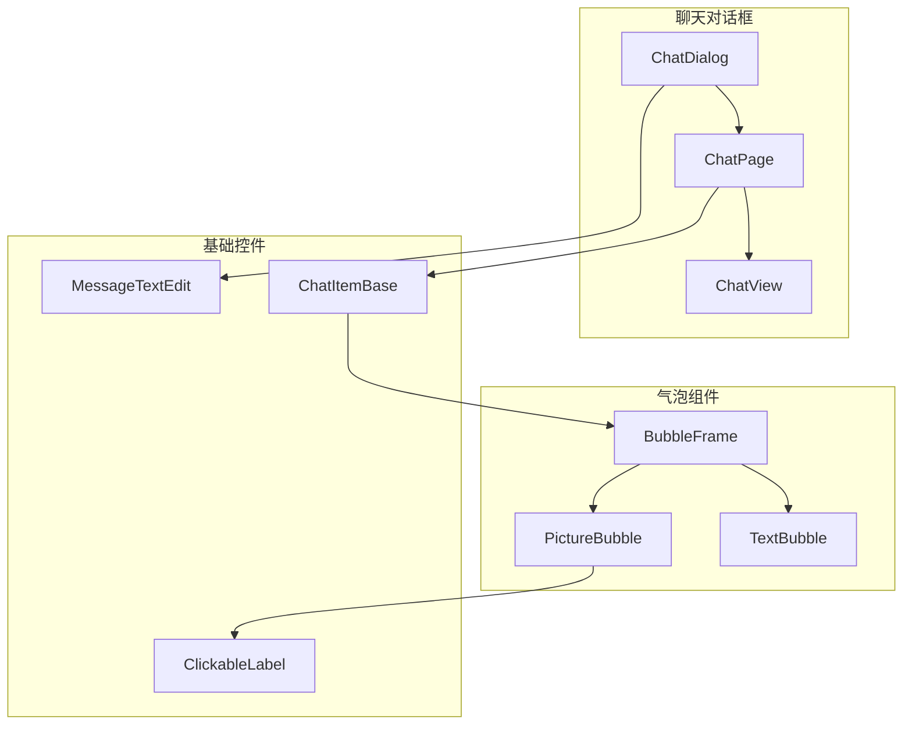
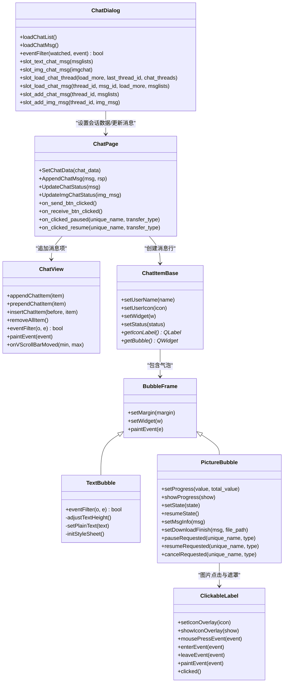
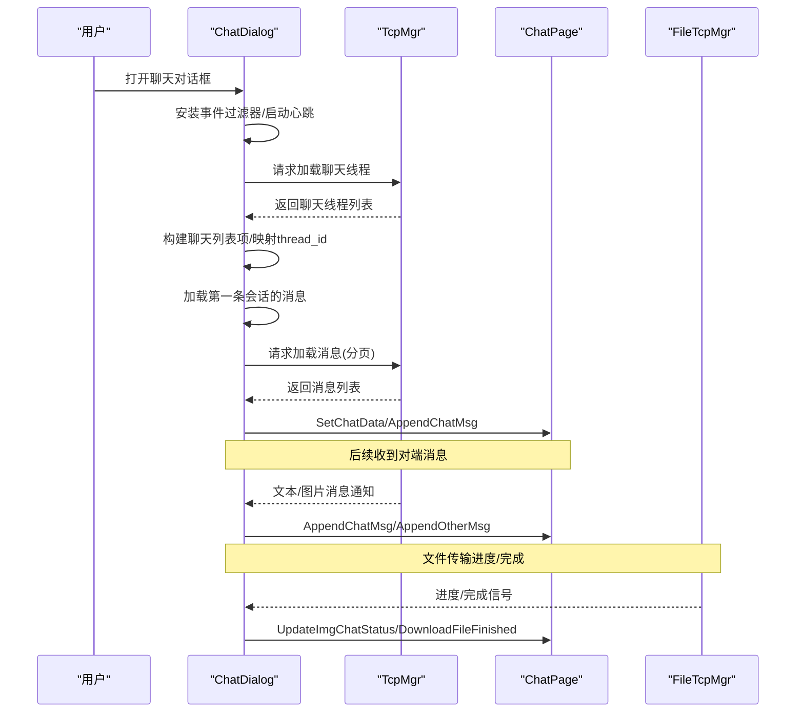
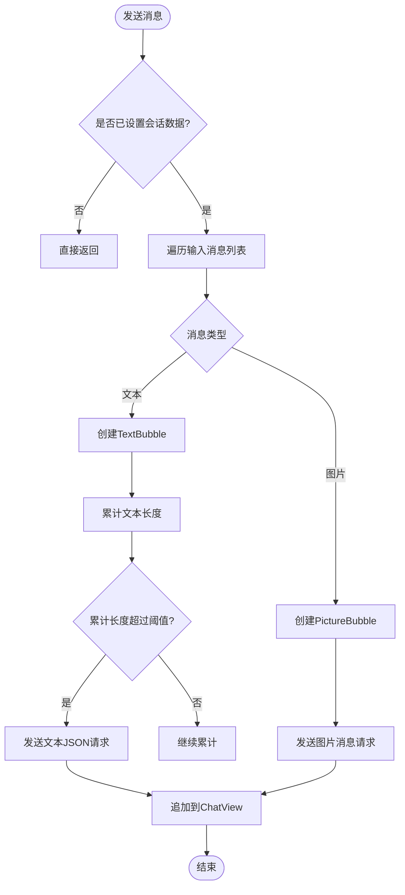
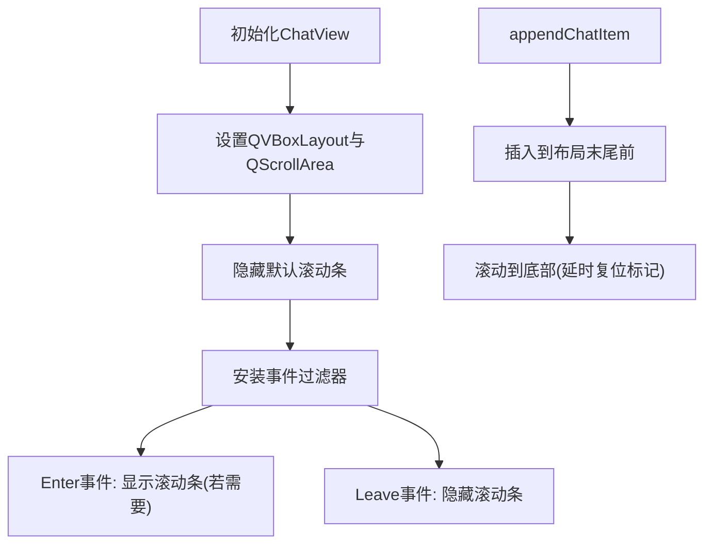
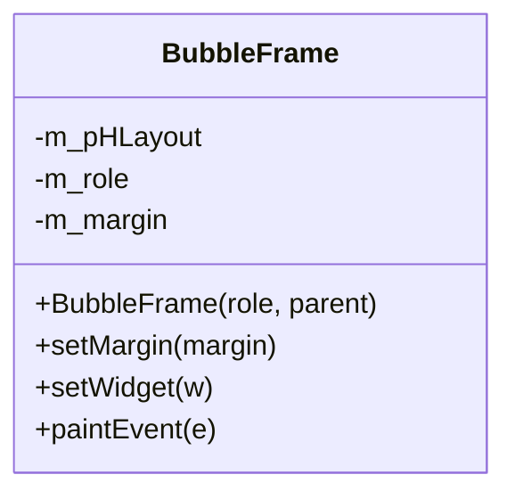
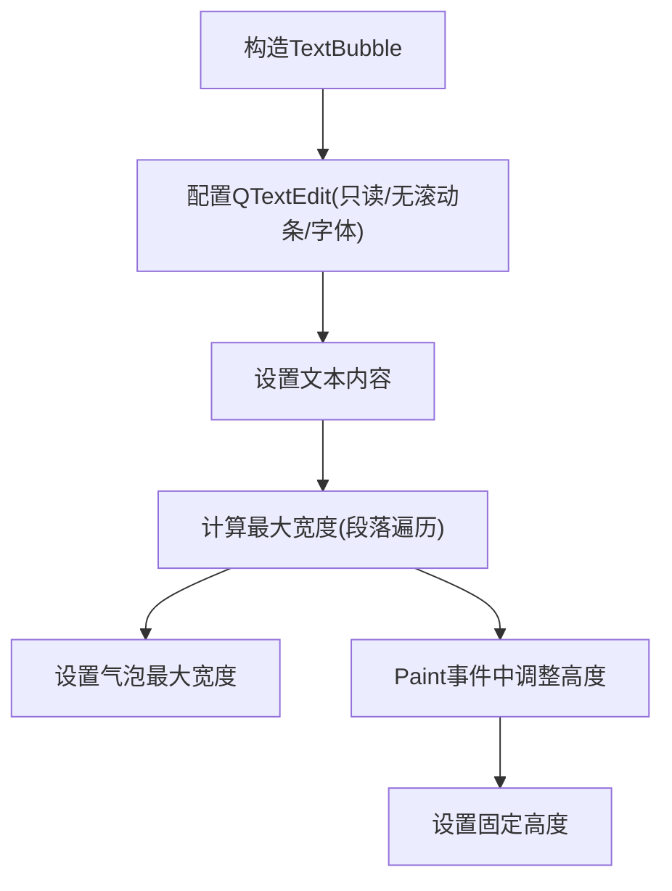
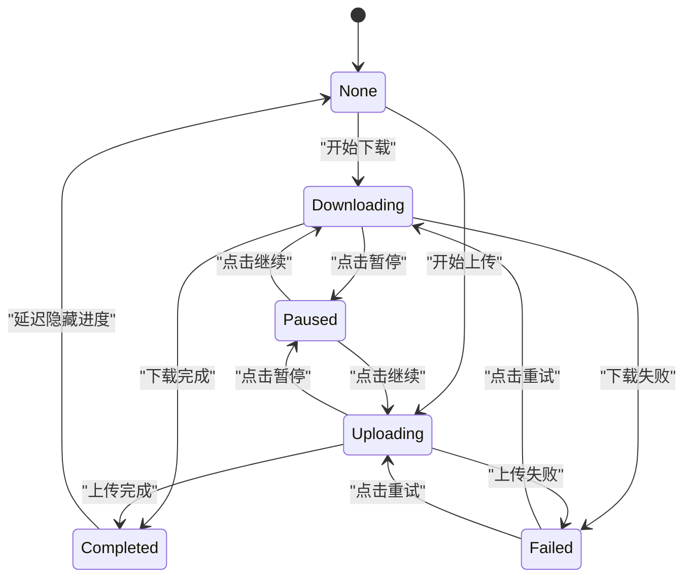
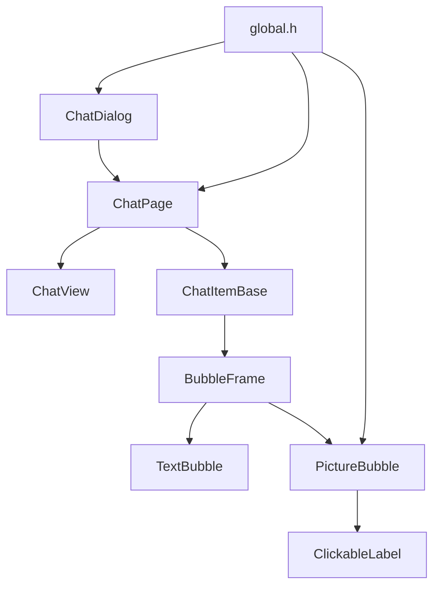

# UI组件设计

<cite>
**本文引用的文件**   
- [ChatDialog.h](file://client/llfcchat/include/chatdialog.h)
- [ChatDialog.cpp](file://client/llfcchat/src/chatdialog.cpp)
- [ChatPage.h](file://client/llfcchat/include/chatpage.h)
- [ChatPage.cpp](file://client/llfcchat/src/chatpage.cpp)
- [ChatView.h](file://client/llfcchat/include/chatview.h)
- [ChatView.cpp](file://client/llfcchat/src/chatview.cpp)
- [BubbleFrame.h](file://client/llfcchat/include/BubbleFrame.h)
- [BubbleFrame.cpp](file://client/llfcchat/src/BubbleFrame.cpp)
- [TextBubble.h](file://client/llfcchat/include/TextBubble.h)
- [TextBubble.cpp](file://client/llfcchat/src/TextBubble.cpp)
- [PictureBubble.h](file://client/llfcchat/include/PictureBubble.h)
- [PictureBubble.cpp](file://client/llfcchat/src/PictureBubble.cpp)
- [ChatItemBase.h](file://client/llfcchat/include/ChatItemBase.h)
- [ClickableLabel.h](file://client/llfcchat/include/ClickableLabel.h)
- [MessageTextEdit.h](file://client/llfcchat/include/MessageTextEdit.h)
- [global.h](file://client/llfcchat/include/global.h)
</cite>

## 目录
1. [简介](#简介)
2. [项目结构](#项目结构)
3. [核心组件](#核心组件)
4. [架构总览](#架构总览)
5. [详细组件分析](#详细组件分析)
6. [依赖关系分析](#依赖关系分析)
7. [性能考虑](#性能考虑)
8. [故障排查指南](#故障排查指南)
9. [结论](#结论)
10. [附录：扩展与最佳实践](#附录扩展与最佳实践)

## 简介
本文件为 LLFCChat 客户端聊天 UI 组件系统的全面文档，聚焦以下组件的设计与实现：
- 聊天对话框 ChatDialog
- 聊天页面 ChatPage
- 滚动视图 ChatView
- 气泡组件 BubbleFrame、TextBubble、PictureBubble
- 消息输入 MessageTextEdit
- 基础项 ChatItemBase 与可点击标签 ClickableLabel

文档涵盖继承体系、事件处理机制（信号槽、事件过滤器）、样式定制、响应式布局、动画与进度反馈、以及可重用性与扩展性设计。内容兼顾初学者理解与资深开发者实践指导。

## 项目结构
LLFCChat 的聊天 UI 位于 client/llfcchat 模块下，采用“头文件 + 源文件”的组织方式，UI 布局使用 Qt Designer 生成的 ui_*.h 文件。关键目录与职责：
- include: 组件接口定义（类声明、信号/槽、公共 API）
- src: 组件实现（业务逻辑、事件处理、绘制、布局）
- resources/style: QSS 样式表（全局样式）
- ui: Qt Designer 界面文件（生成对应 ui_*.h）

图表来源
- [ChatDialog.h:1-98](file://client/llfcchat/include/chatdialog.h#L1-L98)
- [ChatPage.h:1-53](file://client/llfcchat/include/chatpage.h#L1-L53)
- [ChatView.h:1-33](file://client/llfcchat/include/chatview.h#L1-L33)
- [BubbleFrame.h:1-24](file://client/llfcchat/include/BubbleFrame.h#L1-L24)
- [TextBubble.h:1-24](file://client/llfcchat/include/TextBubble.h#L1-L24)
- [PictureBubble.h:1-53](file://client/llfcchat/include/PictureBubble.h#L1-L53)
- [ChatItemBase.h:1-30](file://client/llfcchat/include/ChatItemBase.h#L1-L30)
- [ClickableLabel.h:1-29](file://client/llfcchat/include/ClickableLabel.h#L1-L29)
- [MessageTextEdit.h:1-62](file://client/llfcchat/include/MessageTextEdit.h#L1-L62)

章节来源
- [ChatDialog.h:1-98](file://client/llfcchat/include/chatdialog.h#L1-L98)
- [ChatPage.h:1-53](file://client/llfcchat/include/chatpage.h#L1-L53)
- [ChatView.h:1-33](file://client/llfcchat/include/chatview.h#L1-L33)
- [BubbleFrame.h:1-24](file://client/llfcchat/include/BubbleFrame.h#L1-L24)
- [TextBubble.h:1-24](file://client/llfcchat/include/TextBubble.h#L1-L24)
- [PictureBubble.h:1-53](file://client/llfcchat/include/PictureBubble.h#L1-L53)
- [ChatItemBase.h:1-30](file://client/llfcchat/include/ChatItemBase.h#L1-L30)
- [ClickableLabel.h:1-29](file://client/llfcchat/include/ClickableLabel.h#L1-L29)
- [MessageTextEdit.h:1-62](file://client/llfcchat/include/MessageTextEdit.h#L1-L62)

## 核心组件
- ChatDialog: 主对话窗口，负责侧边栏切换、搜索模式、加载聊天列表与消息、心跳定时、网络回调分发、头像重置等。
- ChatPage: 单聊/群聊会话页，负责消息追加、状态更新、图片下载完成刷新、发送按钮处理、暂停/继续控制。
- ChatView: 自定义滚动区域，隐藏默认滚动条，提供尾插/头插/中间插入、自动滚到底部、进入/离开显示滚动条等。
- BubbleFrame: 气泡基类，根据角色（自己/对方）绘制不同背景与三角箭头，管理内部水平布局与子控件。
- TextBubble: 文本气泡，自适应宽度与高度，只读编辑框，透明背景与无边框样式。
- PictureBubble: 图片气泡，支持上传/下载进度、暂停/继续/失败重试、遮罩图标切换、完成后延迟隐藏进度条。
- ChatItemBase: 消息行容器，包含用户头像、用户名、气泡、状态标签。
- ClickableLabel: 可点击标签，支持遮罩图标叠加、悬停/离开事件、鼠标点击事件。
- MessageTextEdit: 富文本输入框，支持拖拽图片/文件、键盘快捷键、消息聚合发送。

章节来源
- [ChatDialog.h:1-98](file://client/llfcchat/include/chatdialog.h#L1-L98)
- [ChatPage.h:1-53](file://client/llfcchat/include/chatpage.h#L1-L53)
- [ChatView.h:1-33](file://client/llfcchat/include/chatview.h#L1-L33)
- [BubbleFrame.h:1-24](file://client/llfcchat/include/BubbleFrame.h#L1-L24)
- [TextBubble.h:1-24](file://client/llfcchat/include/TextBubble.h#L1-L24)
- [PictureBubble.h:1-53](file://client/llfcchat/include/PictureBubble.h#L1-L53)
- [ChatItemBase.h:1-30](file://client/llfcchat/include/ChatItemBase.h#L1-L30)
- [ClickableLabel.h:1-29](file://client/llfcchat/include/ClickableLabel.h#L1-L29)
- [MessageTextEdit.h:1-62](file://client/llfcchat/include/MessageTextEdit.h#L1-L62)

## 架构总览
整体采用“容器-视图-气泡”的分层设计：
- ChatDialog 作为顶层容器，协调侧边栏、搜索、列表与聊天页。
- ChatPage 作为会话视图，组织 ChatItemBase 行，每行包含 ChatView 中的气泡。
- ChatView 提供滚动与布局能力，保证消息流式展示与自动滚动。
- BubbleFrame 及其派生类封装具体消息类型渲染与交互。
- 通过信号槽与事件过滤器解耦 UI 行为与数据流。

图表来源
- [ChatDialog.h:1-98](file://client/llfcchat/include/chatdialog.h#L1-L98)
- [ChatPage.h:1-53](file://client/llfcchat/include/chatpage.h#L1-L53)
- [ChatView.h:1-33](file://client/llfcchat/include/chatview.h#L1-L33)
- [BubbleFrame.h:1-24](file://client/llfcchat/include/BubbleFrame.h#L1-L24)
- [TextBubble.h:1-24](file://client/llfcchat/include/TextBubble.h#L1-L24)
- [PictureBubble.h:1-53](file://client/llfcchat/include/PictureBubble.h#L1-L53)
- [ChatItemBase.h:1-30](file://client/llfcchat/include/ChatItemBase.h#L1-L30)
- [ClickableLabel.h:1-29](file://client/llfcchat/include/ClickableLabel.h#L1-L29)

## 详细组件分析

### ChatDialog 组件分析
职责与流程：
- 初始化 UI、连接信号槽、启动心跳定时器、安装事件过滤器。
- 加载聊天线程列表与消息，分页加载，维护当前会话 thread_id。
- 处理对端消息通知（文本/图片），转发到 ChatPage 进行追加或状态更新。
- 处理文件传输进度与下载完成，刷新头像与气泡状态。
- 搜索模式与侧边栏切换，点击位置判断以关闭搜索框。

图表来源
- [ChatDialog.cpp:1-800](file://client/llfcchat/src/chatdialog.cpp#L1-L800)
- [ChatPage.cpp:1-626](file://client/llfcchat/src/chatpage.cpp#L1-L626)

章节来源
- [ChatDialog.h:1-98](file://client/llfcchat/include/chatdialog.h#L1-L98)
- [ChatDialog.cpp:1-800](file://client/llfcchat/src/chatdialog.cpp#L1-L800)

### ChatPage 组件分析
职责与流程：
- 设置会话数据，遍历历史消息并追加到 ChatView。
- 区分自己/对方消息，构造 ChatItemBase 与对应气泡（文本/图片）。
- 处理发送按钮：聚合文本消息、组织 JSON、发送 TCP；图片消息触发资源上传。
- 处理接收按钮：模拟对端消息追加。
- 处理图片暂停/继续信号，调用管理器进行断点续传控制。
- 头像加载：本地优先，缺失则发起下载并异步刷新。

图表来源
- [ChatPage.cpp:416-560](file://client/llfcchat/src/chatpage.cpp#L416-L560)

章节来源
- [ChatPage.h:1-53](file://client/llfcchat/include/chatpage.h#L1-L53)
- [ChatPage.cpp:1-626](file://client/llfcchat/src/chatpage.cpp#L1-L626)

### ChatView 组件分析
职责与特性：
- 自定义滚动区域，隐藏默认滚动条，在 Enter/Leave 时按需显示。
- 提供 append/prepend/insert/remove 接口，统一操作内部 QVBoxLayout。
- 监听垂直滚动条 rangeChanged，添加新项后自动滚动到底部。
- 重写 paintEvent 以应用样式。

图表来源
- [ChatView.cpp:1-133](file://client/llfcchat/src/chatview.cpp#L1-L133)

章节来源
- [ChatView.h:1-33](file://client/llfcchat/include/chatview.h#L1-L33)
- [ChatView.cpp:1-133](file://client/llfcchat/src/chatview.cpp#L1-L133)

### BubbleFrame 组件分析
职责与实现：
- 根据 ChatRole（Self/Other）设置左右边距与三角箭头方向。
- 使用 QHBoxLayout 容纳子控件，限制仅允许一个子控件。
- 重写 paintEvent 绘制圆角矩形与三角箭头，区分自己/对方颜色。

图表来源
- [BubbleFrame.h:1-24](file://client/llfcchat/include/BubbleFrame.h#L1-L24)
- [BubbleFrame.cpp:1-73](file://client/llfcchat/src/BubbleFrame.cpp#L1-L73)

章节来源
- [BubbleFrame.h:1-24](file://client/llfcchat/include/BubbleFrame.h#L1-L24)
- [BubbleFrame.cpp:1-73](file://client/llfcchat/src/BubbleFrame.cpp#L1-L73)

### TextBubble 组件分析
职责与实现：
- 使用只读 QTextEdit，禁用滚动条，设置字体与透明背景。
- 通过事件过滤器在 Paint 事件中计算文本最大宽度与高度，动态设置气泡尺寸。
- 遍历段落计算最宽文本与每段布局高度，确保气泡自适应。

图表来源
- [TextBubble.cpp:1-79](file://client/llfcchat/src/TextBubble.cpp#L1-L79)

章节来源
- [TextBubble.h:1-24](file://client/llfcchat/include/TextBubble.h#L1-L24)
- [TextBubble.cpp:1-79](file://client/llfcchat/src/TextBubble.cpp#L1-L79)

### PictureBubble 组件分析
职责与实现：
- 组合 ClickableLabel 与 QProgressBar，显示图片与进度。
- 支持状态机：None/Downloading/Uploading/Paused/Completed/Failed。
- 点击图标触发暂停/继续/重试，发射信号给上层处理。
- 下载完成后替换图片并隐藏进度条（延迟）。

图表来源
- [PictureBubble.cpp:1-243](file://client/llfcchat/src/PictureBubble.cpp#L1-L243)

章节来源
- [PictureBubble.h:1-53](file://client/llfcchat/include/PictureBubble.h#L1-L53)
- [PictureBubble.cpp:1-243](file://client/llfcchat/src/PictureBubble.cpp#L1-L243)

### ChatItemBase 与 ClickableLabel
- ChatItemBase 管理用户名、头像、气泡与状态标签，提供获取气泡与头像标签的接口。
- ClickableLabel 支持遮罩图标叠加、鼠标事件与悬停效果，用于图片气泡的控制图标。

章节来源
- [ChatItemBase.h:1-30](file://client/llfcchat/include/ChatItemBase.h#L1-L30)
- [ClickableLabel.h:1-29](file://client/llfcchat/include/ClickableLabel.h#L1-L29)

### MessageTextEdit 组件
- 支持拖拽图片/文件，解析 MIME 数据，插入预览图与文件信息。
- 维护消息列表，按类型聚合发送（文本批量、图片单独）。
- 键盘快捷键与文本变化监听，便于发送控制。

章节来源
- [MessageTextEdit.h:1-62](file://client/llfcchat/include/MessageTextEdit.h#L1-L62)

## 依赖关系分析
- ChatDialog 依赖 TcpMgr/FileTcpMgr/UserMgr 进行网络与数据管理。
- ChatPage 依赖 ChatView、ChatItemBase、TextBubble、PictureBubble 进行 UI 组装。
- PictureBubble 依赖 ClickableLabel 与 QProgressBar。
- global.h 定义通用枚举与数据结构（如 MsgInfo、TransferState、ChatRole 等），被多个组件共享。

图表来源
- [global.h:1-296](file://client/llfcchat/include/global.h#L1-L296)
- [ChatDialog.h:1-98](file://client/llfcchat/include/chatdialog.h#L1-L98)
- [ChatPage.h:1-53](file://client/llfcchat/include/chatpage.h#L1-L53)
- [ChatView.h:1-33](file://client/llfcchat/include/chatview.h#L1-L33)
- [BubbleFrame.h:1-24](file://client/llfcchat/include/BubbleFrame.h#L1-L24)
- [TextBubble.h:1-24](file://client/llfcchat/include/TextBubble.h#L1-L24)
- [PictureBubble.h:1-53](file://client/llfcchat/include/PictureBubble.h#L1-L53)
- [ChatItemBase.h:1-30](file://client/llfcchat/include/ChatItemBase.h#L1-L30)
- [ClickableLabel.h:1-29](file://client/llfcchat/include/ClickableLabel.h#L1-L29)

章节来源
- [global.h:1-296](file://client/llfcchat/include/global.h#L1-L296)

## 性能考虑
- 文本气泡自适应：通过遍历段落计算宽高，避免频繁重绘；仅在 Paint 事件中调整高度。
- 滚动优化：ChatView 使用一次性插入与延时复位标记，减少多次滚动导致的抖动。
- 图片缩放：使用 KeepAspectRatio 与平滑变换，避免大图导致卡顿。
- 进度更新：QProgressBar 百分比计算与状态切换尽量合并，避免过多 UI 刷新。
- 头像加载：本地优先，缺失再异步下载，避免阻塞 UI。

[本节为通用性能建议，不直接分析具体文件]

## 故障排查指南
常见问题与定位要点：
- 气泡尺寸异常：检查 TextBubble 的 setPlainText 与 adjustTextHeight 是否正确计算最大宽度与高度。
- 滚动条未显示：确认 ChatView 的 Enter/Leave 事件过滤器与 verticalScrollBar maximum 判断。
- 图片进度不更新：核对 PictureBubble 的 setState 与 setProgress 调用路径，确保 _msg_info 正确设置。
- 头像不显示：检查 LoadHeadIcon 的本地路径与下载流程，确认 UserMgr 的下载队列与回调。
- 发送消息未聚合：查看 on_send_btn_clicked 中文本累计阈值与 JSON 组装逻辑。

章节来源
- [TextBubble.cpp:1-79](file://client/llfcchat/src/TextBubble.cpp#L1-L79)
- [ChatView.cpp:1-133](file://client/llfcchat/src/chatview.cpp#L1-L133)
- [PictureBubble.cpp:1-243](file://client/llfcchat/src/PictureBubble.cpp#L1-L243)
- [ChatPage.cpp:276-303](file://client/llfcchat/src/chatpage.cpp#L276-L303)
- [ChatPage.cpp:416-560](file://client/llfcchat/src/chatpage.cpp#L416-L560)

## 结论
LLFCChat 的聊天 UI 组件系统通过清晰的层次结构与信号槽机制，实现了高内聚、低耦合的可复用 UI 组件。BubbleFrame 及其派生类提供了良好的扩展点，ChatView 与 ChatPage 协同完成消息流式展示与交互。事件过滤器与状态机保证了用户体验与性能平衡。遵循本文档的最佳实践，可快速扩展新的消息类型与交互行为。

[本节为总结，不直接分析具体文件]

## 附录：扩展与最佳实践
- 新增消息类型：
  - 定义新的 ChatMsgType 与对应的 ChatDataBase 派生类。
  - 在 ChatPage::AppendChatMsg 中增加分支，创建对应气泡。
  - 如需进度或状态，参考 PictureBubble 的状态机与信号设计。
- 自定义样式：
  - 通过 QSS 修改 BubbleFrame 背景色、边框与三角箭头样式。
  - 使用 repolish 函数刷新样式，避免手动重绘。
- 事件处理：
  - 使用事件过滤器拦截特定事件（如 Paint、Enter/Leave），减少子类化复杂度。
  - 信号槽解耦 UI 行为与数据流，保持组件独立。
- 响应式布局：
  - 基于布局管理器（QHBoxLayout/QVBoxLayout）与 sizeHint，确保自适应。
  - 避免硬编码尺寸，使用动态计算与约束。
- 动画与反馈：
  - 使用 QTimer 延迟隐藏进度条或执行过渡效果。
  - 通过状态切换与遮罩图标提供即时反馈。

[本节为概念性指导，不直接分析具体文件]