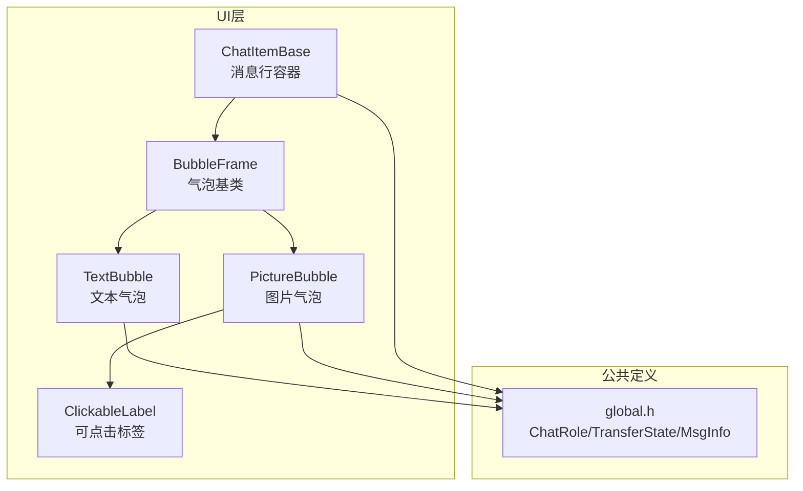
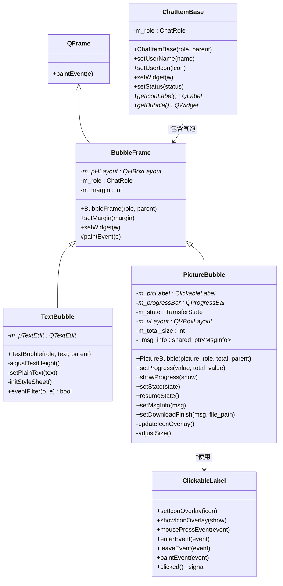
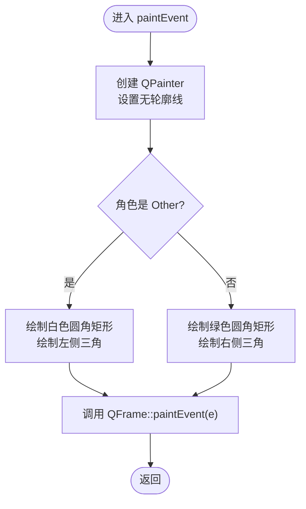
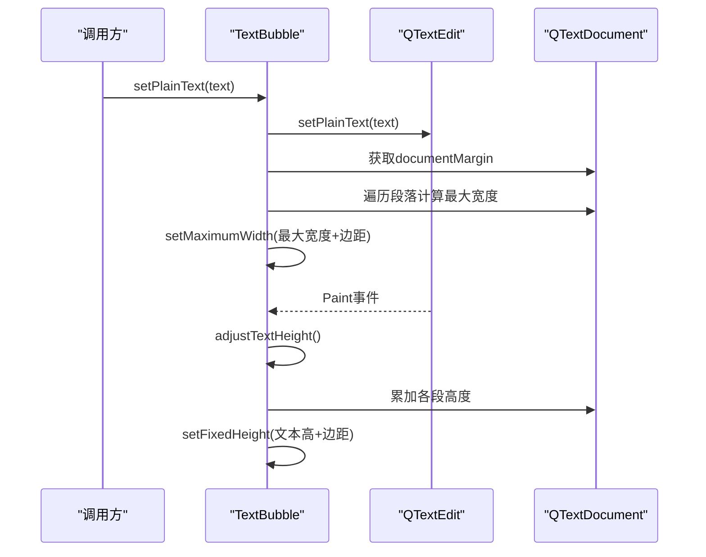
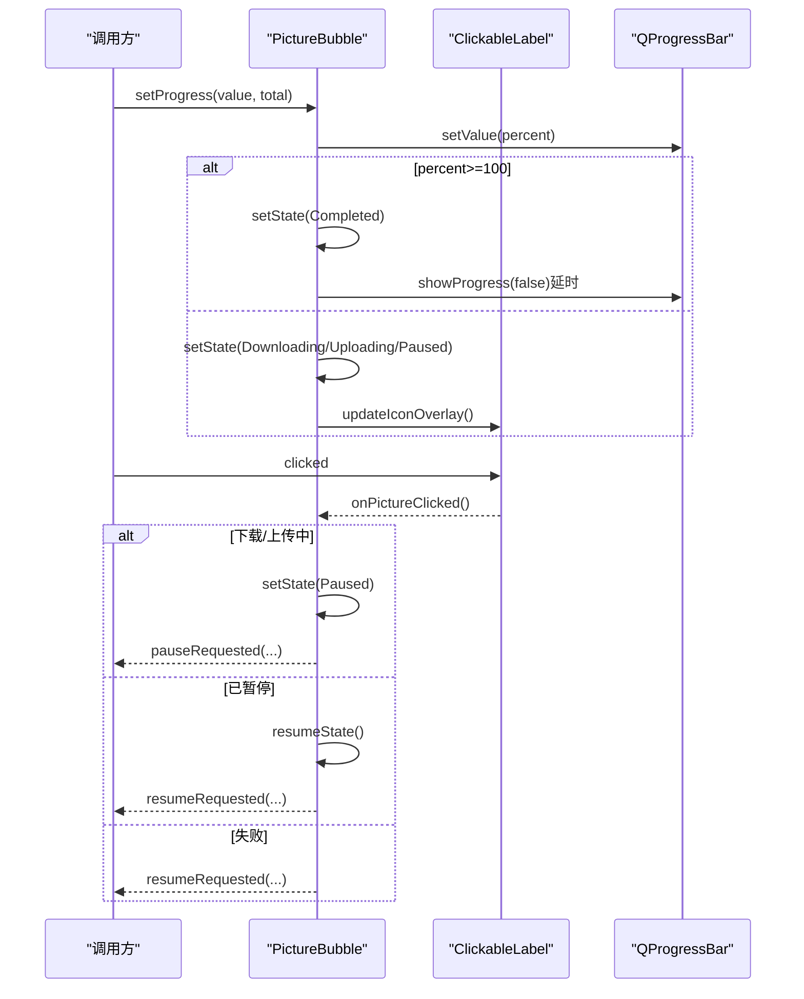
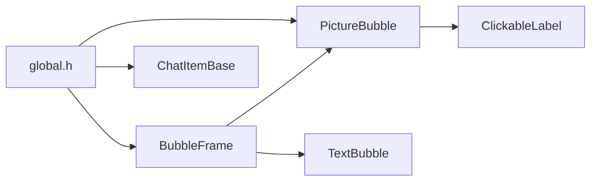

# BubbleFrame基类

<cite>
**本文引用的文件**   
- [BubbleFrame.h](file://client/llfcchat/include/BubbleFrame.h)
- [BubbleFrame.cpp](file://client/llfcchat/src/BubbleFrame.cpp)
- [TextBubble.h](file://client/llfcchat/include/TextBubble.h)
- [TextBubble.cpp](file://client/llfcchat/src/TextBubble.cpp)
- [PictureBubble.h](file://client/llfcchat/include/PictureBubble.h)
- [PictureBubble.cpp](file://client/llfcchat/src/PictureBubble.cpp)
- [global.h](file://client/llfcchat/include/global.h)
- [ChatItemBase.h](file://client/llfcchat/include/ChatItemBase.h)
- [ChatItemBase.cpp](file://client/llfcchat/src/ChatItemBase.cpp)
- [ClickableLabel.h](file://client/llfcchat/include/ClickableLabel.h)
- [day22.气泡聊天对话框.md](file://开发文档/day22.气泡聊天对话框.md)
</cite>

## 目录
1. [简介](#简介)
2. [项目结构](#项目结构)
3. [核心组件](#核心组件)
4. [架构总览](#架构总览)
5. [详细组件分析](#详细组件分析)
6. [依赖关系分析](#依赖关系分析)
7. [性能与优化](#性能与优化)
8. [故障排查指南](#故障排查指南)
9. [结论](#结论)
10. [附录：继承与扩展示例](#附录继承与扩展示例)

## 简介
本文件围绕 BubbleFrame 基类进行系统化、可落地的技术文档编写，面向希望理解并复用该基类的开发者。BubbleFrame 是所有聊天气泡的通用基类，封装了角色系统（ChatRole）、边距管理、布局管理器（QHBoxLayout）以及自定义绘制（paintEvent）。通过它，TextBubble 与 PictureBubble 等具体气泡类型可以专注于内容展示与交互逻辑，而无需重复处理气泡外观、三角箭头、左右对齐等共性细节。

## 项目结构
- 头文件位于 client/llfcchat/include，实现位于 client/llfcchat/src。
- global.h 定义了 ChatRole、TransferState、MsgInfo 等全局枚举与数据结构。
- ChatItemBase 负责将头像、用户名与气泡组合成一条消息项，内部使用网格布局根据 ChatRole 决定左右排列。
- ClickableLabel 为图片气泡提供点击与图标遮罩能力。

图表来源
- [ChatItemBase.h](file://client/llfcchat/include/ChatItemBase.h)
- [BubbleFrame.h](file://client/llfcchat/include/BubbleFrame.h)
- [TextBubble.h](file://client/llfcchat/include/TextBubble.h)
- [PictureBubble.h](file://client/llfcchat/include/PictureBubble.h)
- [ClickableLabel.h](file://client/llfcchat/include/ClickableLabel.h)
- [global.h](file://client/llfcchat/include/global.h)

章节来源
- [ChatItemBase.h:1-29](file://client/llfcchat/include/ChatItemBase.h#L1-L29)
- [BubbleFrame.h:1-24](file://client/llfcchat/include/BubbleFrame.h#L1-L24)
- [global.h:138-165](file://client/llfcchat/include/global.h#L138-L165)

## 核心组件
- BubbleFrame：所有气泡的基类，负责：
  - 基于 ChatRole 设置 QHBoxLayout 的边距，使气泡在左侧或右侧显示；
  - 提供 setWidget 方法动态嵌入子控件；
  - 重写 paintEvent 绘制圆角矩形与三角箭头，区分自己与他人消息的背景色。
- TextBubble：文本气泡，基于 QTextEdit，自动计算最大宽度与高度，适配多行文本。
- PictureBubble：图片气泡，支持进度条、状态切换、图标遮罩、点击暂停/继续/重试等操作。
- ChatItemBase：消息行容器，根据 ChatRole 调整头像、用户名、气泡的布局位置。
- ClickableLabel：增强 QLabel，支持图标遮罩与点击事件。

章节来源
- [BubbleFrame.cpp:1-73](file://client/llfcchat/src/BubbleFrame.cpp#L1-L73)
- [TextBubble.cpp:1-79](file://client/llfcchat/src/TextBubble.cpp#L1-L79)
- [PictureBubble.cpp:1-243](file://client/llfcchat/src/PictureBubble.cpp#L1-L243)
- [ChatItemBase.cpp:1-64](file://client/llfcchat/src/ChatItemBase.cpp#L1-L64)
- [ClickableLabel.h:1-29](file://client/llfcchat/include/ClickableLabel.h#L1-L29)

## 架构总览
BubbleFrame 采用“基类封装共性 + 子类专注内容”的设计模式。其关键职责包括：
- 角色驱动布局：根据 ChatRole::Self/Other 设置不同边距，使气泡指向正确方向；
- 统一绘制：paintEvent 中绘制圆角矩形与三角箭头，保证视觉一致性；
- 内容注入：setWidget 将任意 QWidget 作为气泡内容，便于扩展新类型。

图表来源
- [BubbleFrame.h:1-24](file://client/llfcchat/include/BubbleFrame.h#L1-L24)
- [BubbleFrame.cpp:1-73](file://client/llfcchat/src/BubbleFrame.cpp#L1-L73)
- [TextBubble.h:1-24](file://client/llfcchat/include/TextBubble.h#L1-L24)
- [TextBubble.cpp:1-79](file://client/llfcchat/src/TextBubble.cpp#L1-L79)
- [PictureBubble.h:1-53](file://client/llfcchat/include/PictureBubble.h#L1-L53)
- [PictureBubble.cpp:1-243](file://client/llfcchat/src/PictureBubble.cpp#L1-L243)
- [ChatItemBase.h:1-29](file://client/llfcchat/include/ChatItemBase.h#L1-L29)
- [ChatItemBase.cpp:1-64](file://client/llfcchat/src/ChatItemBase.cpp#L1-L64)
- [ClickableLabel.h:1-29](file://client/llfcchat/include/ClickableLabel.h#L1-L29)

## 详细组件分析

### BubbleFrame：基类设计与职责
- 构造函数
  - 初始化 QHBoxLayout，并根据 ChatRole 设置不同的边距，使三角箭头区域留白；
  - 默认 m_margin=3，三角宽 WIDTH_SANJIAO=8。
- setWidget
  - 仅当布局为空时添加子控件，避免重复插入；
  - 用于注入 TextEdit、图片 Label 等任意 QWidget。
- paintEvent
  - 使用 QPainter 绘制背景与三角箭头；
  - 他人消息：白色背景，三角在左侧；
  - 自己消息：绿色背景，三角在右侧；
  - 最后调用 QFrame::paintEvent(e) 以完成默认绘制流程。

图表来源
- [BubbleFrame.cpp:34-72](file://client/llfcchat/src/BubbleFrame.cpp#L34-L72)

章节来源
- [BubbleFrame.cpp:1-73](file://client/llfcchat/src/BubbleFrame.cpp#L1-L73)
- [BubbleFrame.h:1-24](file://client/llfcchat/include/BubbleFrame.h#L1-L24)

### ChatRole 角色系统
- ChatRole 为枚举类，包含 Self 与 Other 两个值；
- 用于控制气泡的左右对齐、三角箭头方向与背景色；
- 在 ChatItemBase 中同样用于决定头像、用户名与气泡的布局顺序。

章节来源
- [global.h:138-143](file://client/llfcchat/include/global.h#L138-L143)
- [ChatItemBase.cpp:30-52](file://client/llfcchat/src/ChatItemBase.cpp#L30-L52)

### 边距管理与布局管理器
- BubbleFrame 使用 QHBoxLayout 管理内容；
- 根据 ChatRole 设置不同边距，确保三角箭头区域不被内容覆盖；
- TextBubble 与 PictureBubble 在计算尺寸时会读取 layout()->contentsMargins() 的值，以保证最终尺寸准确。

章节来源
- [BubbleFrame.cpp:10-16](file://client/llfcchat/src/BubbleFrame.cpp#L10-L16)
- [TextBubble.cpp:42-55](file://client/llfcchat/src/TextBubble.cpp#L42-L55)
- [PictureBubble.cpp:66-80](file://client/llfcchat/src/PictureBubble.cpp#L66-L80)

### paintEvent 重绘事件与自定义绘制
- 绘制流程：
  - 创建 QPainter，设置无轮廓线；
  - 根据 ChatRole 选择背景色与三角位置；
  - 绘制圆角矩形与三角；
  - 调用父类 paintEvent 完成默认绘制。
- 样式渲染机制：
  - 通过画笔与画刷直接绘制，不依赖 QSS；
  - 可在子类中进一步叠加样式（如 TextBubble 的透明背景）。

章节来源
- [BubbleFrame.cpp:34-72](file://client/llfcchat/src/BubbleFrame.cpp#L34-L72)
- [TextBubble.cpp:75-78](file://client/llfcchat/src/TextBubble.cpp#L75-L78)

### setWidget 方法与动态嵌入策略
- 目的：将任意 QWidget 作为气泡内容注入；
- 策略：仅在布局为空时添加，防止重复插入；
- 适用场景：TextBubble 注入 QTextEdit，PictureBubble 注入包含图片与进度条的容器。

章节来源
- [BubbleFrame.cpp:25-32](file://client/llfcchat/src/BubbleFrame.cpp#L25-L32)
- [TextBubble.cpp:23-26](file://client/llfcchat/src/TextBubble.cpp#L23-L26)
- [PictureBubble.cpp:60-64](file://client/llfcchat/src/PictureBubble.cpp#L60-L64)

### TextBubble：文本气泡
- 构造：
  - 创建只读 QTextEdit，关闭滚动条，安装事件过滤器；
  - 设置字体与样式表（透明背景、无边框）；
  - 调用 setPlainText 计算最大宽度并设置到气泡；
  - 通过 setWidget 注入 QTextEdit。
- 尺寸计算：
  - setPlainText：遍历段落，计算最宽文本宽度，加上文档边距与布局边距，得到最大宽度；
  - adjustTextHeight：在 Paint 事件中累加每段高度，得到文本总高，再考虑文档边距与布局垂直边距，设置固定高度。
- 事件过滤：
  - 拦截 QTextEdit 的 Paint 事件，触发 adjustTextHeight，确保高度随内容变化。

图表来源
- [TextBubble.cpp:37-73](file://client/llfcchat/src/TextBubble.cpp#L37-L73)

章节来源
- [TextBubble.cpp:1-79](file://client/llfcchat/src/TextBubble.cpp#L1-L79)
- [TextBubble.h:1-24](file://client/llfcchat/include/TextBubble.h#L1-L24)

### PictureBubble：图片气泡
- 构造：
  - 创建容器与垂直布局，包含 ClickableLabel 与 QProgressBar；
  - 缩放图片至最大宽高，设置固定大小；
  - 初始化进度条样式与范围；
  - 通过 setWidget 注入容器。
- 状态管理：
  - setState：根据状态显示/隐藏进度条，并在完成后延迟隐藏；
  - setProgress：更新进度百分比，达到100%后标记完成；
  - resumeState：根据传输类型恢复下载/上传状态；
  - updateIconOverlay：根据状态显示暂停/播放/下载图标遮罩。
- 交互：
  - onPictureClicked：根据当前状态执行暂停/继续/重试，并通过信号通知上层。

图表来源
- [PictureBubble.cpp:82-149](file://client/llfcchat/src/PictureBubble.cpp#L82-L149)
- [PictureBubble.cpp:189-217](file://client/llfcchat/src/PictureBubble.cpp#L189-L217)
- [PictureBubble.cpp:219-242](file://client/llfcchat/src/PictureBubble.cpp#L219-L242)

章节来源
- [PictureBubble.cpp:1-243](file://client/llfcchat/src/PictureBubble.cpp#L1-L243)
- [PictureBubble.h:1-53](file://client/llfcchat/include/PictureBubble.h#L1-L53)
- [ClickableLabel.h:1-29](file://client/llfcchat/include/ClickableLabel.h#L1-L29)

### ChatItemBase：消息行容器
- 作用：将头像、用户名与气泡组合成一行，根据 ChatRole 决定左右布局；
- 布局策略：
  - 自己发送：用户名右对齐，头像在右侧，气泡在中间；
  - 他人发送：头像在左侧，用户名左对齐，气泡在中间；
- 提供 setWidget 替换气泡，便于动态更新。

章节来源
- [ChatItemBase.cpp:1-64](file://client/llfcchat/src/ChatItemBase.cpp#L1-L64)
- [ChatItemBase.h:1-29](file://client/llfcchat/include/ChatItemBase.h#L1-L29)

## 依赖关系分析
- BubbleFrame 依赖 global.h 中的 ChatRole；
- TextBubble 依赖 QTextEdit、QFontMetricsF、QTextDocument、QTextBlock、QTextLayout；
- PictureBubble 依赖 ClickableLabel、QProgressBar、全局枚举 TransferState/TransferType/MsgInfo；
- ChatItemBase 依赖 BubbleFrame 与全局 ChatRole。

图表来源
- [global.h:138-165](file://client/llfcchat/include/global.h#L138-L165)
- [BubbleFrame.h:1-24](file://client/llfcchat/include/BubbleFrame.h#L1-L24)
- [TextBubble.h:1-24](file://client/llfcchat/include/TextBubble.h#L1-L24)
- [PictureBubble.h:1-53](file://client/llfcchat/include/PictureBubble.h#L1-L53)
- [ClickableLabel.h:1-29](file://client/llfcchat/include/ClickableLabel.h#L1-L29)

章节来源
- [global.h:138-165](file://client/llfcchat/include/global.h#L138-L165)
- [BubbleFrame.h:1-24](file://client/llfcchat/include/BubbleFrame.h#L1-L24)
- [TextBubble.h:1-24](file://client/llfcchat/include/TextBubble.h#L1-L24)
- [PictureBubble.h:1-53](file://client/llfcchat/include/PictureBubble.h#L1-L53)
- [ClickableLabel.h:1-29](file://client/llfcchat/include/ClickableLabel.h#L1-L29)

## 性能与优化
- 绘制优化：
  - 使用 QPainter 直接绘制，避免复杂样式带来的开销；
  - 只在必要时重绘（如 TextBubble 在 Paint 事件中调整高度）。
- 布局优化：
  - setWidget 限制仅一次添加，避免重复布局；
  - 使用固定宽高（PictureBubble）减少频繁尺寸计算。
- 文本处理：
  - 遍历段落计算最大宽度与高度，复杂度 O(N)，N 为段落数；
  - 建议在文本变化较少时使用，避免频繁重算。
- Qt 框架技巧：
  - 使用 QFrame 作为基类，便于自定义绘制；
  - 通过 eventFilter 捕获子控件事件，解耦逻辑；
  - 使用 style()->standardIcon 获取系统图标，降低资源管理成本。

[本节为通用指导，不直接分析具体文件]

## 故障排查指南
- 气泡未显示或重叠：
  - 检查 setWidget 是否被多次调用；
  - 确认 layout()->contentsMargins() 是否正确设置。
- 文本高度不正确：
  - 确认 adjustTextHeight 是否在 Paint 事件中调用；
  - 检查 documentMargin 与布局垂直边距是否一致。
- 图片进度条不更新：
  - 检查 setState 与 setProgress 的调用顺序；
  - 确认进度条可见性 showProgress 的状态切换。
- 点击事件无效：
  - 确认 ClickableLabel 的 clicked 信号已连接；
  - 检查 onPictureClicked 的状态分支是否覆盖预期场景。

章节来源
- [BubbleFrame.cpp:25-32](file://client/llfcchat/src/BubbleFrame.cpp#L25-L32)
- [TextBubble.cpp:28-35](file://client/llfcchat/src/TextBubble.cpp#L28-L35)
- [PictureBubble.cpp:82-149](file://client/llfcchat/src/PictureBubble.cpp#L82-L149)
- [PictureBubble.cpp:189-217](file://client/llfcchat/src/PictureBubble.cpp#L189-L217)

## 结论
BubbleFrame 通过简洁的职责划分与清晰的绘制流程，为聊天气泡提供了稳定可扩展的基础。结合 ChatRole 的角色系统与布局边距管理，能够轻松实现左右对齐的气泡效果。TextBubble 与 PictureBubble 在此基础上分别实现了文本与图片的高效展示与交互。遵循本文档的实践建议，开发者可以快速继承 BubbleFrame 创建新的气泡类型，并保持统一的视觉风格与良好的性能表现。

[本节为总结，不直接分析具体文件]

## 附录：继承与扩展示例
- 如何继承 BubbleFrame 创建自定义气泡：
  - 新建类继承 BubbleFrame，构造函数中创建所需子控件；
  - 使用 setWidget 将子控件注入布局；
  - 如需自定义绘制，重写 paintEvent；
  - 如需动态尺寸，参考 TextBubble 的 adjustTextHeight 或 PictureBubble 的 adjustSize。
- 示例路径（不含代码内容）：
  - 文本气泡实现：[TextBubble.cpp:12-26](file://client/llfcchat/src/TextBubble.cpp#L12-L26)
  - 图片气泡实现：[PictureBubble.cpp:8-64](file://client/llfcchat/src/PictureBubble.cpp#L8-L64)
  - 气泡绘制逻辑：[BubbleFrame.cpp:34-72](file://client/llfcchat/src/BubbleFrame.cpp#L34-L72)
  - 设计思路参考：[day22.气泡聊天对话框.md:122-174](file://开发文档/day22.气泡聊天对话框.md#L122-L174)

章节来源
- [TextBubble.cpp:12-26](file://client/llfcchat/src/TextBubble.cpp#L12-L26)
- [PictureBubble.cpp:8-64](file://client/llfcchat/src/PictureBubble.cpp#L8-L64)
- [BubbleFrame.cpp:34-72](file://client/llfcchat/src/BubbleFrame.cpp#L34-L72)
- [day22.气泡聊天对话框.md:122-174](file://开发文档/day22.气泡聊天对话框.md#L122-L174)