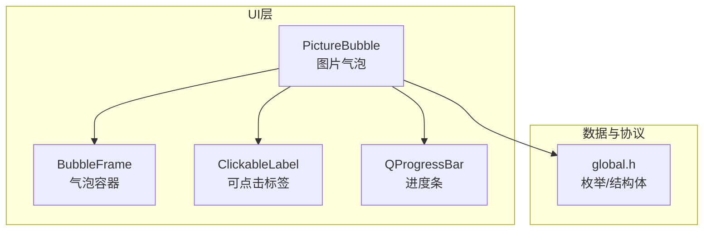
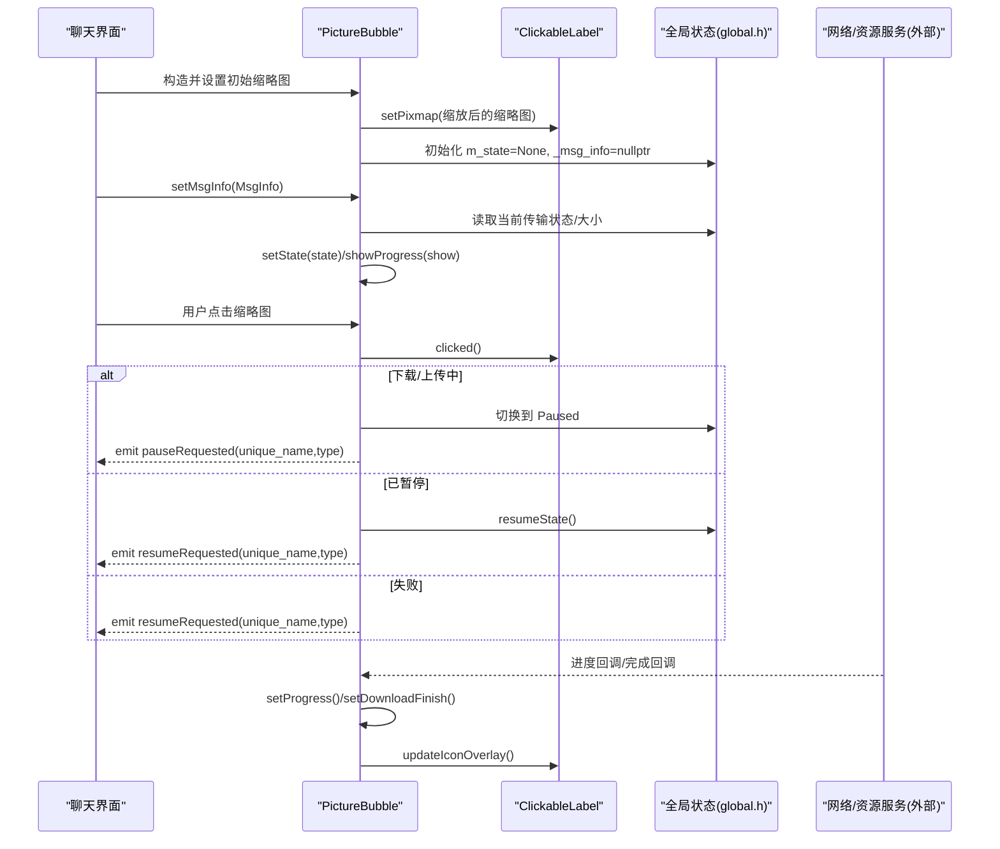
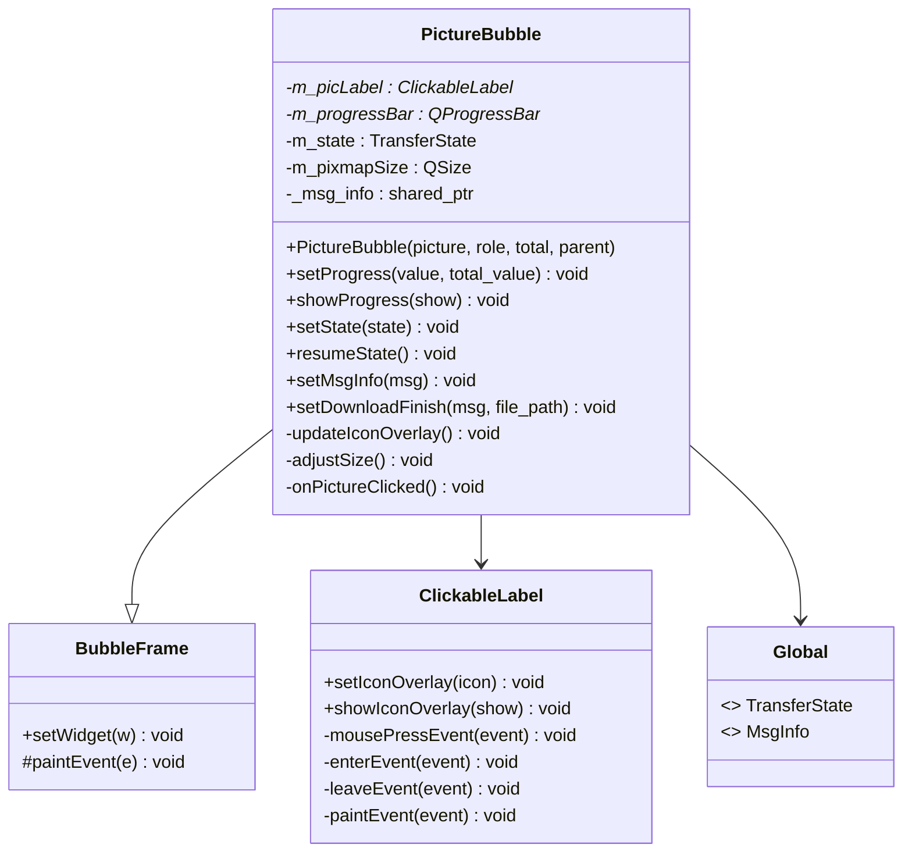
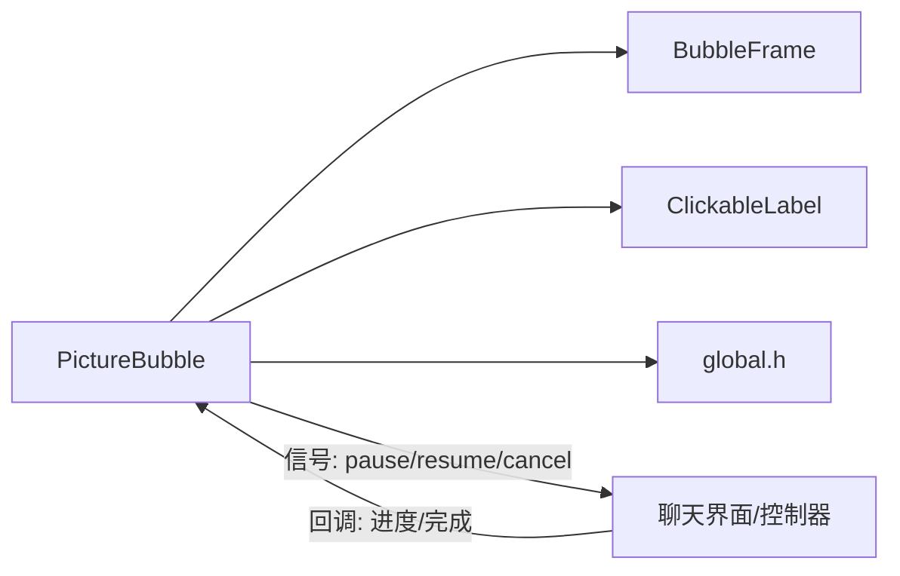

# PictureBubble图片气泡

<cite>
**本文引用的文件**   
- [PictureBubble.h](file://client/llfcchat/include/PictureBubble.h)
- [PictureBubble.cpp](file://client/llfcchat/src/PictureBubble.cpp)
- [BubbleFrame.h](file://client/llfcchat/include/BubbleFrame.h)
- [BubbleFrame.cpp](file://client/llfcchat/src/BubbleFrame.cpp)
- [ClickableLabel.h](file://client/llfcchat/include/ClickableLabel.h)
- [ClickableLabel.cpp](file://client/llfcchat/src/ClickableLabel.cpp)
- [global.h](file://client/llfcchat/include/global.h)
- [MessageTextEdit.cpp](file://client/llfcchat/src/MessageTextEdit.cpp)
- [userinfopage.cpp](file://client/llfcchat/src/userinfopage.cpp)
- [day41-通知客户端异步下载聊天图片.md](file://开发文档/day41-通知客户端异步下载聊天图片.md)
- [day38-断点续传.md](file://开发文档/day38-断点续传.md)
</cite>

## 目录
1. [简介](#简介)
2. [项目结构](#项目结构)
3. [核心组件](#核心组件)
4. [架构总览](#架构总览)
5. [详细组件分析](#详细组件分析)
6. [依赖关系分析](#依赖关系分析)
7. [性能考虑](#性能考虑)
8. [故障排查指南](#故障排查指南)
9. [结论](#结论)
10. [附录：使用示例与最佳实践](#附录使用示例与最佳实践)

## 简介
本文件为 PictureBubble 图片气泡组件的完整技术文档。该组件用于在聊天界面中展示图片消息，并支持图片资源的加载、进度显示、状态切换、点击交互（暂停/继续/重试）等能力。其设计围绕 Qt 的 QPixmap/QLabel 渲染管线，结合全局传输状态模型（TransferState/TransferType/MsgInfo），实现简洁高效的图片气泡展示与交互体验。

## 项目结构
PictureBubble 位于客户端 UI 层，继承自 BubbleFrame，内部组合 ClickableLabel 与 QProgressBar，并通过 global.h 中的枚举和数据结构与上层业务逻辑协作。

图表来源 
- [PictureBubble.cpp:1-243](file://client/llfcchat/src/PictureBubble.cpp#L1-L243)
- [BubbleFrame.cpp:1-73](file://client/llfcchat/src/BubbleFrame.cpp#L1-L73)
- [ClickableLabel.cpp:1-74](file://client/llfcchat/src/ClickableLabel.cpp#L1-L74)
- [global.h:1-296](file://client/llfcchat/include/global.h#L1-L296)

章节来源
- [PictureBubble.h:1-53](file://client/llfcchat/include/PictureBubble.h#L1-L53)
- [PictureBubble.cpp:1-243](file://client/llfcchat/src/PictureBubble.cpp#L1-L243)
- [BubbleFrame.h:1-24](file://client/llfcchat/include/BubbleFrame.h#L1-L24)
- [BubbleFrame.cpp:1-73](file://client/llfcchat/src/BubbleFrame.cpp#L1-L73)
- [ClickableLabel.h:1-29](file://client/llfcchat/include/ClickableLabel.h#L1-L29)
- [ClickableLabel.cpp:1-74](file://client/llfcchat/src/ClickableLabel.cpp#L1-L74)
- [global.h:1-296](file://client/llfcchat/include/global.h#L1-L296)

## 核心组件
- PictureBubble：图片气泡主体，负责缩略图显示、进度条、状态切换、图标遮罩更新、尺寸自适应以及点击交互。
- BubbleFrame：气泡容器，绘制左右箭头与圆角背景，区分“我”和“对方”的气泡样式。
- ClickableLabel：可点击标签，提供鼠标事件、悬停效果与图标遮罩绘制。
- global.h：定义消息类型、传输类型、传输状态、消息元信息 MsgInfo 等关键数据结构。

章节来源
- [PictureBubble.cpp:1-243](file://client/llfcchat/src/PictureBubble.cpp#L1-L243)
- [BubbleFrame.cpp:1-73](file://client/llfcchat/src/BubbleFrame.cpp#L1-L73)
- [ClickableLabel.cpp:1-74](file://client/llfcchat/src/ClickableLabel.cpp#L1-L74)
- [global.h:1-296](file://client/llfcchat/include/global.h#L1-L296)

## 架构总览
PictureBubble 通过 ClickableLabel 承载缩略图与遮罩图标，通过 QProgressBar 展示下载/上传进度；状态机由 TransferState 驱动，结合 MsgInfo 中的唯一标识与传输上下文，完成暂停/继续/重试等操作。整体流程如下：

图表来源 
- [PictureBubble.cpp:1-243](file://client/llfcchat/src/PictureBubble.cpp#L1-L243)
- [global.h:1-296](file://client/llfcchat/include/global.h#L1-L296)

## 详细组件分析

### PictureBubble 组件
- 功能要点
  - 缩略图生成：将传入的 QPixmap 按固定最大宽高进行等比缩放，平滑插值，避免失真。
  - 进度条：根据 total_size 与 current_size 计算百分比，自动隐藏/显示并在完成后延迟隐藏。
  - 状态机：支持 None/Downloading/Uploading/Paused/Completed/Failed 六种状态，驱动遮罩图标与进度条可见性。
  - 交互：点击缩略图触发暂停/继续/重试，通过信号向上传递操作请求。
  - 尺寸自适应：根据图片尺寸与进度条显隐动态调整气泡固定尺寸。
- 关键方法
  - setProgress(value,total_value)：更新进度百分比，达到100%时进入 Completed。
  - showProgress(show)：控制进度条显示并重新计算气泡尺寸。
  - setState(state)：统一设置状态，联动进度条与遮罩图标。
  - setMsgInfo(msg)：绑定消息元信息，恢复或同步传输状态。
  - setDownloadFinish(msg,file_path)：下载完成后加载本地文件，生成缩略图并刷新显示。
  - onPictureClicked()：处理点击事件，依据状态发出暂停/继续/重试信号。
  - updateIconOverlay()：根据状态设置遮罩图标（暂停/播放/下载）。
- 性能与内存
  - 使用固定最大尺寸缩放，避免大图直接渲染导致内存与CPU压力。
  - 完成态延迟隐藏进度条，减少频繁重绘。
  - 通过 shared_ptr<MsgInfo> 管理消息上下文，避免重复分配。

图表来源 
- [PictureBubble.cpp:1-243](file://client/llfcchat/src/PictureBubble.cpp#L1-L243)
- [BubbleFrame.cpp:1-73](file://client/llfcchat/src/BubbleFrame.cpp#L1-L73)
- [ClickableLabel.cpp:1-74](file://client/llfcchat/src/ClickableLabel.cpp#L1-L74)
- [global.h:1-296](file://client/llfcchat/include/global.h#L1-L296)

章节来源
- [PictureBubble.cpp:1-243](file://client/llfcchat/src/PictureBubble.cpp#L1-L243)
- [PictureBubble.h:1-53](file://client/llfcchat/include/PictureBubble.h#L1-L53)

### BubbleFrame 组件
- 功能要点
  - 气泡容器：根据 ChatRole（Self/Other）绘制不同颜色与三角箭头，形成聊天气泡外观。
  - 布局：水平布局容纳子控件，限制仅能添加一个 Widget。
- 关键点
  - paintEvent 中绘制圆角矩形与三角形，确保视觉一致性。
  - setWidget 防止重复添加子控件。

章节来源
- [BubbleFrame.cpp:1-73](file://client/llfcchat/src/BubbleFrame.cpp#L1-L73)
- [BubbleFrame.h:1-24](file://client/llfcchat/include/BubbleFrame.h#L1-L24)

### ClickableLabel 组件
- 功能要点
  - 可点击：捕获左键点击并触发 clicked 信号。
  - 悬停效果：enter/leave 事件改变透明度遮罩，提升交互反馈。
  - 遮罩图标：支持设置 QIcon 并在中心绘制，图标大小为控件尺寸的三分之一。
- 关键点
  - paintEvent 中先调用父类绘制，再叠加半透明遮罩与图标。
  - setMouseTracking(true) 启用鼠标跟踪以响应悬停。

章节来源
- [ClickableLabel.cpp:1-74](file://client/llfcchat/src/ClickableLabel.cpp#L1-L74)
- [ClickableLabel.h:1-29](file://client/llfcchat/include/ClickableLabel.h#L1-L29)

### 全局数据与状态（global.h）
- 传输状态与类型
  - TransferType：None/Download/Upload
  - TransferState：None/Downloading/Uploading/Paused/Completed/Failed
- 消息元信息
  - MsgInfo：包含消息类型、URL/文本、预览缩略图、唯一文件名、总大小、当前大小、序列号、MD5、传输状态/类型、发送者/接收者等字段。
- 其他
  - 常量 MAX_FILE_LEN、错误码、消息ID等。

章节来源
- [global.h:1-296](file://client/llfcchat/include/global.h#L1-L296)

## 依赖关系分析
PictureBubble 依赖 BubbleFrame 作为容器、ClickableLabel 作为图像载体与交互入口，同时依赖 global.h 的状态与数据结构。与上层（如聊天视图）通过信号槽通信，与网络/资源服务通过回调更新进度与完成状态。

图表来源 
- [PictureBubble.cpp:1-243](file://client/llfcchat/src/PictureBubble.cpp#L1-L243)
- [BubbleFrame.cpp:1-73](file://client/llfcchat/src/BubbleFrame.cpp#L1-L73)
- [ClickableLabel.cpp:1-74](file://client/llfcchat/src/ClickableLabel.cpp#L1-L74)
- [global.h:1-296](file://client/llfcchat/include/global.h#L1-L296)

章节来源
- [PictureBubble.cpp:1-243](file://client/llfcchat/src/PictureBubble.cpp#L1-L243)
- [global.h:1-296](file://client/llfcchat/include/global.h#L1-L296)

## 性能考虑
- 图片缩放策略
  - 使用固定最大宽高（例如 160x90）进行等比缩放，配合平滑插值（SmoothTransformation），保证缩略图质量与性能平衡。
  - 仅在需要时生成缩略图，避免对原始大图进行多次缩放。
- 渲染优化
  - 使用 QLabel 的 setScaledContents(true) 与预缩放 QPixmap，减少每帧缩放开销。
  - 遮罩图标按需绘制，仅在 hover 或状态变化时触发重绘。
- 内存管理
  - 通过 shared_ptr<MsgInfo> 共享消息上下文，避免重复创建与释放。
  - 完成态延迟隐藏进度条，降低频繁 UI 更新带来的内存抖动。
- GPU 加速
  - Qt 默认对 QPixmap 进行硬件加速渲染（取决于平台与驱动），建议保持合理的像素尺寸，避免超大位图。
- 格式支持与压缩
  - 当前实现基于 QPixmap 直接加载文件路径，未内置格式转换与质量压缩；如需压缩，应在上游生成缩略图或使用图像处理库预处理。

章节来源
- [PictureBubble.cpp:1-243](file://client/llfcchat/src/PictureBubble.cpp#L1-L243)
- [userinfopage.cpp:1-200](file://client/llfcchat/src/userinfopage.cpp#L1-L200)

## 故障排查指南
- 常见问题
  - 进度不更新：检查 setProgress 的 total_value 是否与 _total_size 一致；确认回调是否被正确调用。
  - 状态异常：setState 后需调用 updateIconOverlay；若 _msg_info 为空，onPictureClicked 会提前返回。
  - 图片不显示：确认 setDownloadFinish 的文件路径有效且可读；缩略图生成成功后再设置到 ClickableLabel。
  - 点击无响应：确保 ClickableLabel 启用了鼠标跟踪与左键点击事件；检查信号槽连接。
- 调试建议
  - 打印 _msg_info 的 unique_name、transfer_state、current_size、total_size 等关键字段。
  - 观察进度条百分比与状态切换顺序是否符合预期。
  - 在网络侧日志中核对分片序号 seq、is_last 标志与 Redis 中的断点续传信息。

章节来源
- [PictureBubble.cpp:1-243](file://client/llfcchat/src/PictureBubble.cpp#L1-L243)
- [day41-通知客户端异步下载聊天图片.md:496-709](file://开发文档/day41-通知客户端异步下载聊天图片.md#L496-L709)
- [day38-断点续传.md:2477-2652](file://开发文档/day38-断点续传.md#L2477-L2652)

## 结论
PictureBubble 以简洁的组件化设计实现了聊天场景下的图片气泡展示与基础交互。其核心在于：固定尺寸的缩略图渲染、基于 TransferState 的状态机、以及与全局 MsgInfo 的紧密耦合。对于更高级的图片处理（格式转换、质量压缩、水印、GPU 加速），可在上游预处理或在组件扩展中引入相应能力。

## 附录：使用示例与最佳实践
- 设置图片边框效果
  - 可通过 QSS 为 PictureBubble 或其子控件设置边框样式；建议在 BubbleFrame 的 paintEvent 中统一绘制边框，以保持气泡风格一致。
  - 参考：[BubbleFrame.cpp:34-72](file://client/llfcchat/src/BubbleFrame.cpp#L34-L72)
- 添加水印
  - 在生成缩略图前，使用 QPainter 在 QPixmap 上绘制水印文字或图标；确保水印位置与透明度不影响缩略图识别。
  - 参考：[ClickableLabel.cpp:36-62](file://client/llfcchat/src/ClickableLabel.cpp#L36-L62)（遮罩绘制思路可复用）
- 实现图片预览（点击放大）
  - 在 onPictureClicked 中判断非传输状态时，打开独立窗口或对话框显示原图；可使用 ImageCropperDialog 或自定义预览窗口。
  - 参考：[PictureBubble.cpp:189-217](file://client/llfcchat/src/PictureBubble.cpp#L189-L217)
- 异步加载与懒加载
  - 在聊天列表滚动时，仅对可视区域创建 PictureBubble；不可见区域延迟创建或销毁，减少内存占用。
  - 参考：[MessageTextEdit.cpp:135-152](file://client/llfcchat/src/MessageTextEdit.cpp#L135-L152)（缩略图生成与插入流程）
- 内存泄漏防护
  - 使用 shared_ptr<MsgInfo> 管理消息上下文；在组件销毁前断开信号槽连接，避免悬挂指针。
  - 避免在高频回调中创建临时大对象，优先复用 QPixmap。
- Qt QImage/QPixmap 使用技巧
  - 优先使用 QPixmap 进行 UI 渲染；必要时用 QImage 做像素级处理，再转回 QPixmap。
  - 使用 scaledToWidth/scaledToHeight 或 KeepAspectRatio+SmoothTransformation 保证缩放质量。
  - 参考：[userinfopage.cpp:151-179](file://client/llfcchat/src/userinfopage.cpp#L151-L179)

章节来源
- [BubbleFrame.cpp:34-72](file://client/llfcchat/src/BubbleFrame.cpp#L34-L72)
- [ClickableLabel.cpp:36-62](file://client/llfcchat/src/ClickableLabel.cpp#L36-L62)
- [PictureBubble.cpp:189-217](file://client/llfcchat/src/PictureBubble.cpp#L189-L217)
- [MessageTextEdit.cpp:135-152](file://client/llfcchat/src/MessageTextEdit.cpp#L135-L152)
- [userinfopage.cpp:151-179](file://client/llfcchat/src/userinfopage.cpp#L151-L179)