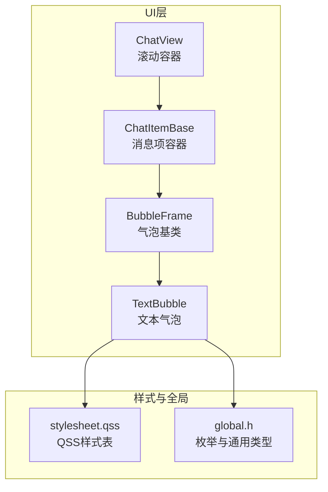
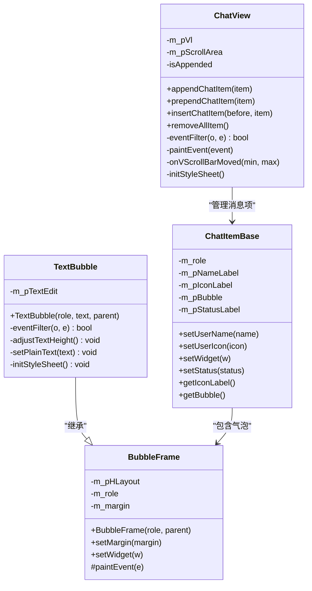
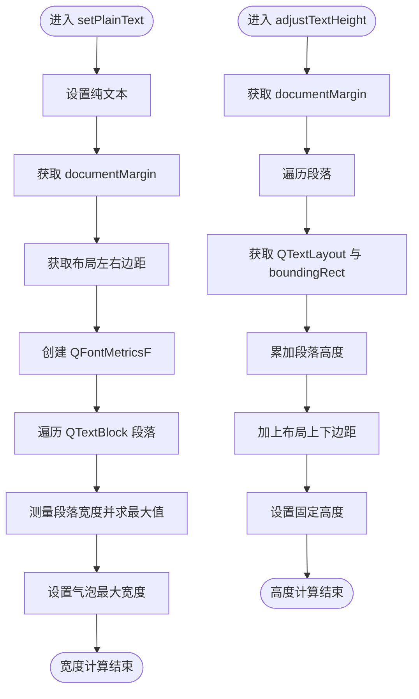
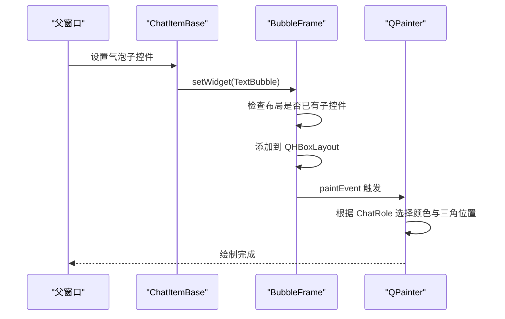
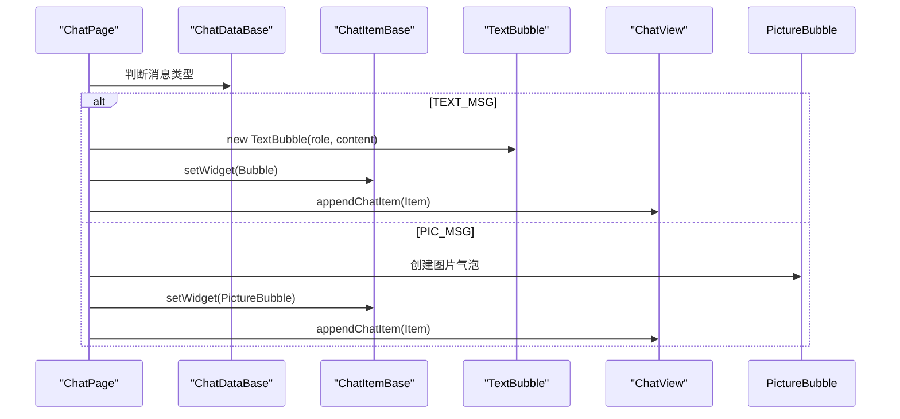
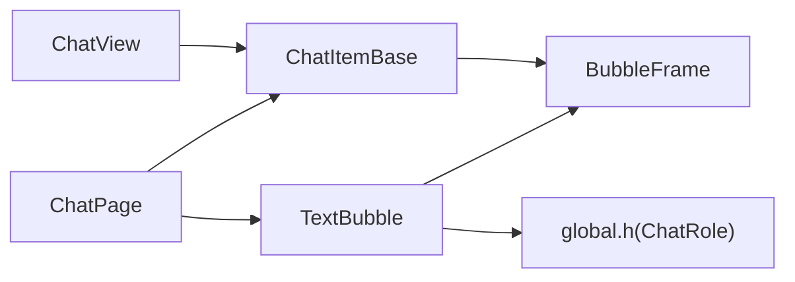

# TextBubble文本气泡

<cite>
**本文引用的文件**   
- [TextBubble.h](file://client/llfcchat/include/TextBubble.h)
- [TextBubble.cpp](file://client/llfcchat/src/TextBubble.cpp)
- [BubbleFrame.h](file://client/llfcchat/include/BubbleFrame.h)
- [BubbleFrame.cpp](file://client/llfcchat/src/BubbleFrame.cpp)
- [global.h](file://client/llfcchat/include/global.h)
- [ChatItemBase.h](file://client/llfcchat/include/ChatItemBase.h)
- [ChatView.h](file://client/llfcchat/include/ChatView.h)
- [chatpage.cpp](file://client/llfcchat/src/chatpage.cpp)
- [MessageTextEdit.h](file://client/llfcchat/include/MessageTextEdit.h)
- [MessageTextEdit.cpp](file://client/llfcchat/src/MessageTextEdit.cpp)
- [stylesheet.qss](file://client/llfcchat/resources/style/stylesheet.qss)
</cite>

## 目录
1. [简介](#简介)
2. [项目结构](#项目结构)
3. [核心组件](#核心组件)
4. [架构总览](#架构总览)
5. [详细组件分析](#详细组件分析)
6. [依赖关系分析](#依赖关系分析)
7. [性能考量](#性能考量)
8. [故障排查指南](#故障排查指南)
9. [结论](#结论)
10. [附录：使用示例与最佳实践](#附录使用示例与最佳实践)

## 简介
本文件为 TextBubble 文本气泡组件的全面技术文档。TextBubble 基于 Qt，继承自 BubbleFrame，用于在聊天界面中显示纯文本消息，具备自动换行、尺寸自适应、滚动隐藏、字体样式定制等能力。本文从渲染引擎、字符编码、富文本支持、尺寸自适应算法、内容溢出处理、滚动机制、与 BubbleFrame 的集成、消息格式解析、内容安全过滤、以及 Qt QTextEdit/QLabel 的使用技巧与性能优化等方面进行深入说明，并提供可操作的扩展建议（如高亮与搜索）和代码片段路径以便快速定位实现位置。

## 项目结构
TextBubble 位于客户端 UI 层，作为聊天消息的气泡容器之一，配合 ChatItemBase 与 ChatView 完成消息列表展示与滚动。其关键文件分布如下：
- 头文件：include/TextBubble.h、include/BubbleFrame.h、include/global.h、include/ChatItemBase.h、include/ChatView.h
- 实现文件：src/TextBubble.cpp、src/BubbleFrame.cpp、src/chatpage.cpp
- 样式资源：resources/style/stylesheet.qss

图表来源
- [ChatView.h:1-33](file://client/llfcchat/include/ChatView.h#L1-L33)
- [ChatItemBase.h:1-30](file://client/llfcchat/include/ChatItemBase.h#L1-L30)
- [BubbleFrame.h:1-24](file://client/llfcchat/include/BubbleFrame.h#L1-L24)
- [TextBubble.h:1-24](file://client/llfcchat/include/TextBubble.h#L1-L24)
- [stylesheet.qss:126-170](file://client/llfcchat/resources/style/stylesheet.qss#L126-L170)
- [global.h:138-150](file://client/llfcchat/include/global.h#L138-L150)

章节来源
- [TextBubble.h:1-24](file://client/llfcchat/include/TextBubble.h#L1-L24)
- [BubbleFrame.h:1-24](file://client/llfcchat/include/BubbleFrame.h#L1-L24)
- [global.h:138-150](file://client/llfcchat/include/global.h#L138-L150)

## 核心组件
- TextBubble：封装 QTextEdit，负责文本显示、自动换行、宽高自适应、事件过滤与样式初始化。
- BubbleFrame：气泡基类，提供左右三角绘制、布局边距控制、子控件嵌入。
- ChatItemBase：消息项容器，承载头像、用户名、状态与气泡。
- ChatView：滚动区域，管理消息项的插入与滚动行为。
- global.h：定义 ChatRole、MsgType、ChatMsgType 等枚举，驱动气泡角色与消息类型。

章节来源
- [TextBubble.cpp:12-26](file://client/llfcchat/src/TextBubble.cpp#L12-L26)
- [BubbleFrame.cpp:5-17](file://client/llfcchat/src/BubbleFrame.cpp#L5-L17)
- [ChatItemBase.h:10-27](file://client/llfcchat/include/ChatItemBase.h#L10-L27)
- [ChatView.h:7-30](file://client/llfcchat/include/ChatView.h#L7-L30)
- [global.h:138-150](file://client/llfcchat/include/global.h#L138-L150)

## 架构总览
TextBubble 通过继承 BubbleFrame 获得气泡外观与布局；内部使用只读的 QTextEdit 进行文本渲染，利用 documentMargin、FontMetricsF 与 QTextLayout 计算最大宽度与总高度，从而实现“按内容自适应”的气泡尺寸。滚动条被禁用，避免多余滚动；事件过滤器在 Paint 事件中调整高度，确保渲染后尺寸正确。

图表来源
- [BubbleFrame.h:7-21](file://client/llfcchat/include/BubbleFrame.h#L7-L21)
- [BubbleFrame.cpp:5-17](file://client/llfcchat/src/BubbleFrame.cpp#L5-L17)
- [TextBubble.h:8-21](file://client/llfcchat/include/TextBubble.h#L8-L21)
- [TextBubble.cpp:12-26](file://client/llfcchat/src/TextBubble.cpp#L12-L26)
- [ChatItemBase.h:10-27](file://client/llfcchat/include/ChatItemBase.h#L10-L27)
- [ChatView.h:7-30](file://client/llfcchat/include/ChatView.h#L7-L30)

## 详细组件分析

### TextBubble 文本渲染与自适应
- 文本渲染引擎：基于 QTextEdit 的纯文本模式（setPlainText），关闭滚动条，保证气泡内文本自然换行。
- 自动换行：Qt 文本布局引擎根据 FontMetricsF 测量段落宽度并自动折行。
- 尺寸自适应：
  - 宽度：遍历所有段落，取最大段落宽度，加上 documentMargin 与布局左右边距，设置 setMaximumWidth。
  - 高度：遍历段落，累加每段 layout 的 boundingRect 高度，加上 documentMargin 与布局上下边距，设置 setFixedHeight。
- 事件过滤：安装 eventFilter，在 Paint 事件中调用 adjustTextHeight，确保渲染后高度准确。
- 样式初始化：QSS 将 QTextEdit 背景透明、无边框，使气泡外观统一。

图表来源
- [TextBubble.cpp:37-56](file://client/llfcchat/src/TextBubble.cpp#L37-L56)
- [TextBubble.cpp:58-73](file://client/llfcchat/src/TextBubble.cpp#L58-L73)

章节来源
- [TextBubble.cpp:12-26](file://client/llfcchat/src/TextBubble.cpp#L12-L26)
- [TextBubble.cpp:28-35](file://client/llfcchat/src/TextBubble.cpp#L28-L35)
- [TextBubble.cpp:37-56](file://client/llfcchat/src/TextBubble.cpp#L37-L56)
- [TextBubble.cpp:58-73](file://client/llfcchat/src/TextBubble.cpp#L58-L73)
- [TextBubble.cpp:75-78](file://client/llfcchat/src/TextBubble.cpp#L75-L78)

### BubbleFrame 气泡绘制与布局
- 布局：使用 QHBoxLayout，根据 ChatRole（Self/Other）设置不同边距，以对齐三角箭头方向。
- 绘制：重写 paintEvent，分别绘制圆角矩形气泡与三角形箭头，颜色区分发送方与接收方。
- 子控件嵌入：setWidget 仅允许添加一次子控件，避免重复布局。

图表来源
- [BubbleFrame.cpp:5-17](file://client/llfcchat/src/BubbleFrame.cpp#L5-L17)
- [BubbleFrame.cpp:34-72](file://client/llfcchat/src/BubbleFrame.cpp#L34-L72)

章节来源
- [BubbleFrame.cpp:5-17](file://client/llfcchat/src/BubbleFrame.cpp#L5-L17)
- [BubbleFrame.cpp:25-32](file://client/llfcchat/src/BubbleFrame.cpp#L25-L32)
- [BubbleFrame.cpp:34-72](file://client/llfcchat/src/BubbleFrame.cpp#L34-L72)

### 与 ChatPage 的消息集成
- ChatPage 根据消息类型 ChatMsgType::TEXT 创建 TextBubble，并将 role（Self/Other）传入构造。
- 消息内容来自 msg->GetMsgContent()，直接作为纯文本显示。
- 气泡通过 ChatItemBase 的 setWidget 嵌入到消息项中，再由 ChatView 管理滚动与插入。

图表来源
- [chatpage.cpp:77-90](file://client/llfcchat/src/chatpage.cpp#L77-L90)
- [chatpage.cpp:149-163](file://client/llfcchat/src/chatpage.cpp#L149-L163)
- [chatpage.cpp:188-201](file://client/llfcchat/src/chatpage.cpp#L188-L201)
- [chatpage.cpp:254-269](file://client/llfcchat/src/chatpage.cpp#L254-L269)

章节来源
- [chatpage.cpp:77-90](file://client/llfcchat/src/chatpage.cpp#L77-L90)
- [chatpage.cpp:149-163](file://client/llfcchat/src/chatpage.cpp#L149-L163)
- [chatpage.cpp:188-201](file://client/llfcchat/src/chatpage.cpp#L188-L201)
- [chatpage.cpp:254-269](file://client/llfcchat/src/chatpage.cpp#L254-L269)

### 字符编码与富文本支持
- 字符编码：QString 默认使用 UTF-16，Qt 内部处理 Unicode，中文显示正常。
- 富文本：当前实现使用 setPlainText，未启用 HTML 富文本渲染；如需支持富文本，可切换至 setHtml 或混合使用 QTextDocument 的 API。
- 输入侧富文本：MessageTextEdit 支持拖拽文件、图片插入与 URL 提取，可作为输入端富文本能力的参考。

章节来源
- [TextBubble.cpp:37-40](file://client/llfcchat/src/TextBubble.cpp#L37-L40)
- [MessageTextEdit.h:18-59](file://client/llfcchat/include/MessageTextEdit.h#L18-L59)
- [MessageTextEdit.cpp:229-236](file://client/llfcchat/src/MessageTextEdit.cpp#L229-L236)

### 尺寸自适应与滚动机制
- 宽度自适应：依据最长段落宽度 + documentMargin + 布局左右边距，设置 setMaximumWidth。
- 高度自适应：依据段落布局高度总和 + documentMargin + 布局上下边距，设置 setFixedHeight。
- 滚动机制：垂直与水平滚动条均设置为 AlwaysOff，气泡不出现滚动条，内容通过外层 ChatView 滚动。

章节来源
- [TextBubble.cpp:37-56](file://client/llfcchat/src/TextBubble.cpp#L37-L56)
- [TextBubble.cpp:58-73](file://client/llfcchat/src/TextBubble.cpp#L58-L73)
- [TextBubble.cpp:15-19](file://client/llfcchat/src/TextBubble.cpp#L15-L19)

### 内容安全过滤
- 当前实现未对文本内容进行过滤或转义。建议在 setPlainText 之前增加白名单校验或敏感词替换逻辑，以避免 XSS 或恶意输入。
- 若未来启用 HTML 富文本，需引入安全的 HTML 过滤库或自定义标签白名单。

章节来源
- [TextBubble.cpp:37-40](file://client/llfcchat/src/TextBubble.cpp#L37-L40)

## 依赖关系分析
TextBubble 依赖 Qt 文本与布局子系统，并通过 global.h 中的 ChatRole 决定气泡外观。ChatPage 负责消息分发，ChatItemBase 与 ChatView 负责消息项管理与滚动。

图表来源
- [TextBubble.h:8-21](file://client/llfcchat/include/TextBubble.h#L8-L21)
- [BubbleFrame.h:7-21](file://client/llfcchat/include/BubbleFrame.h#L7-L21)
- [global.h:138-150](file://client/llfcchat/include/global.h#L138-L150)
- [chatpage.cpp:77-90](file://client/llfcchat/src/chatpage.cpp#L77-L90)
- [ChatItemBase.h:10-27](file://client/llfcchat/include/ChatItemBase.h#L10-L27)
- [ChatView.h:7-30](file://client/llfcchat/include/ChatView.h#L7-L30)

章节来源
- [TextBubble.h:8-21](file://client/llfcchat/include/TextBubble.h#L8-L21)
- [BubbleFrame.h:7-21](file://client/llfcchat/include/BubbleFrame.h#L7-L21)
- [global.h:138-150](file://client/llfcchat/include/global.h#L138-L150)
- [chatpage.cpp:77-90](file://client/llfcchat/src/chatpage.cpp#L77-L90)
- [ChatItemBase.h:10-27](file://client/llfcchat/include/ChatItemBase.h#L10-L27)
- [ChatView.h:7-30](file://client/llfcchat/include/ChatView.h#L7-L30)

## 性能考量
- 文本测量开销：每次 setPlainText 会遍历所有段落计算宽度，大量消息时建议缓存段落宽度或使用增量更新。
- 高度计算：adjustTextHeight 在 Paint 事件中执行，频繁重绘可能带来性能压力，可考虑延迟计算或仅在文本变化时更新。
- 内存管理：QTextEdit 持有 QTextDocument，大量长文本需注意释放与复用；避免重复创建气泡实例。
- 样式应用：QSS 应用于 QTextEdit 时尽量集中设置，减少重复样式刷新。

[本节为通用指导，无需具体文件引用]

## 故障排查指南
- 气泡高度不正确：确认 adjustTextHeight 是否在 Paint 事件中调用；检查 documentMargin 与布局边距是否正确获取。
- 文本截断或溢出：检查 setMaximumWidth 是否被覆盖；确认布局边距与 documentMargin 的计算。
- 滚动条异常：确认 QTextEdit 的滚动策略是否为 AlwaysOff；检查外层 ChatView 的滚动行为。
- 中文显示乱码：确认 QString 编码与系统字体支持；必要时设置字体为支持中文的字体族。

章节来源
- [TextBubble.cpp:28-35](file://client/llfcchat/src/TextBubble.cpp#L28-L35)
- [TextBubble.cpp:37-56](file://client/llfcchat/src/TextBubble.cpp#L37-L56)
- [TextBubble.cpp:58-73](file://client/llfcchat/src/TextBubble.cpp#L58-L73)
- [TextBubble.cpp:15-19](file://client/llfcchat/src/TextBubble.cpp#L15-L19)

## 结论
TextBubble 通过 Qt 文本布局与事件过滤实现了简洁高效的文本气泡渲染与尺寸自适应。其与 BubbleFrame 的集成清晰明确，适合在聊天场景中展示纯文本消息。未来可扩展富文本支持、内容安全过滤与搜索高亮功能，以提升用户体验与安全性。

[本节为总结性内容，无需具体文件引用]

## 附录：使用示例与最佳实践

### 设置不同字体样式
- 在 TextBubble 构造函数中设置字体族与字号，或通过 QSS 统一样式。
- 参考路径：
  - [TextBubble.cpp:20-22](file://client/llfcchat/src/TextBubble.cpp#L20-L22)
  - [stylesheet.qss:126-170](file://client/llfcchat/resources/style/stylesheet.qss#L126-L170)

### 添加文本高亮效果
- 当前为纯文本模式，如需高亮，可切换为 HTML 富文本或使用 QTextCharFormat 标记匹配片段。
- 参考路径：
  - [TextBubble.cpp:37-40](file://client/llfcchat/src/TextBubble.cpp#L37-L40)
  - [MessageTextEdit.cpp:229-236](file://client/llfcchat/src/MessageTextEdit.cpp#L229-L236)

### 实现文本搜索功能
- 可在外部维护搜索关键词集合，遍历 QTextDocument 的段落与块，使用 QString::indexOf 或正则表达式匹配，并在需要时通过 QTextCursor 移动光标或临时高亮。
- 参考路径：
  - [TextBubble.cpp:46-53](file://client/llfcchat/src/TextBubble.cpp#L46-L53)
  - [MessageTextEdit.cpp:240-254](file://client/llfcchat/src/MessageTextEdit.cpp#L240-L254)

### Qt QTextEdit 与 QLabel 使用技巧
- QTextEdit：适合多行文本、自动换行与复杂布局；可通过 setReadOnly(true) 提升性能。
- QLabel：适合单行或少量文本展示；结合 QFontMetricsF 进行宽度测量。
- 参考路径：
  - [TextBubble.cpp:15-19](file://client/llfcchat/src/TextBubble.cpp#L15-L19)
  - [ChatItemBase.h:10-27](file://client/llfcchat/include/ChatItemBase.h#L10-L27)

### 文本性能优化与内存管理策略
- 批量更新：合并多次 setPlainText 调用，减少重排与重绘。
- 缓存测量结果：对常用文本段落缓存宽度与高度。
- 及时释放：销毁不再使用的气泡实例，避免 QTextDocument 占用过多内存。
- 参考路径：
  - [TextBubble.cpp:37-56](file://client/llfcchat/src/TextBubble.cpp#L37-L56)
  - [TextBubble.cpp:58-73](file://client/llfcchat/src/TextBubble.cpp#L58-L73)