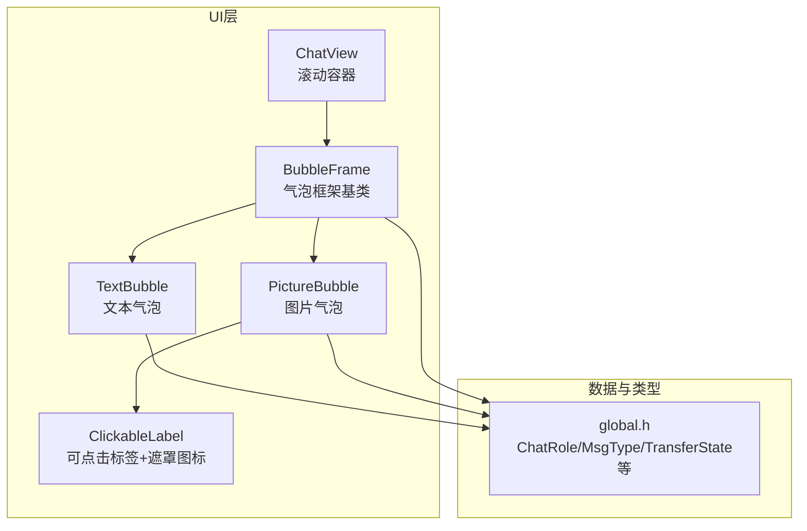
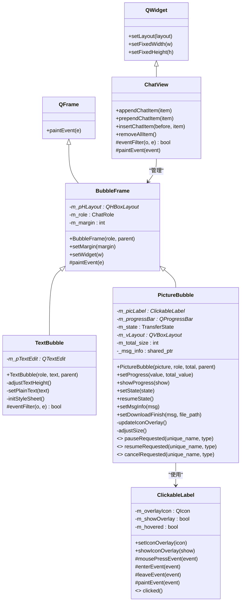
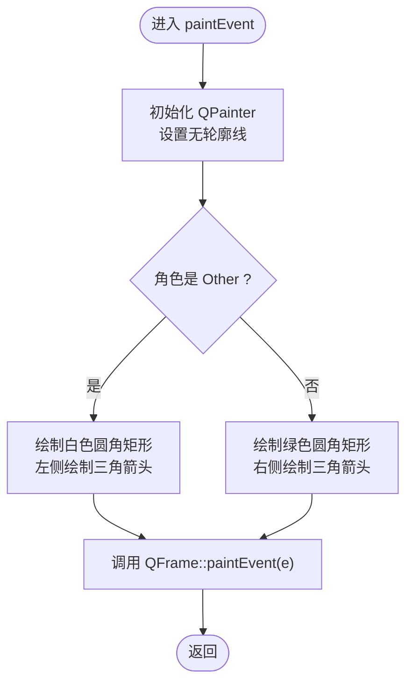
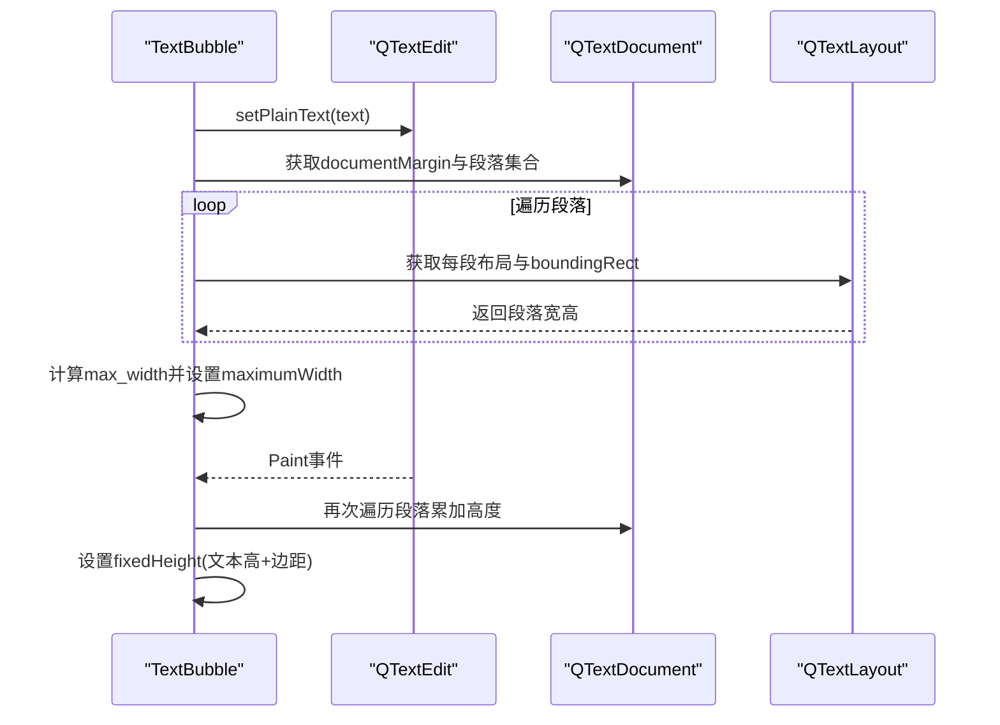
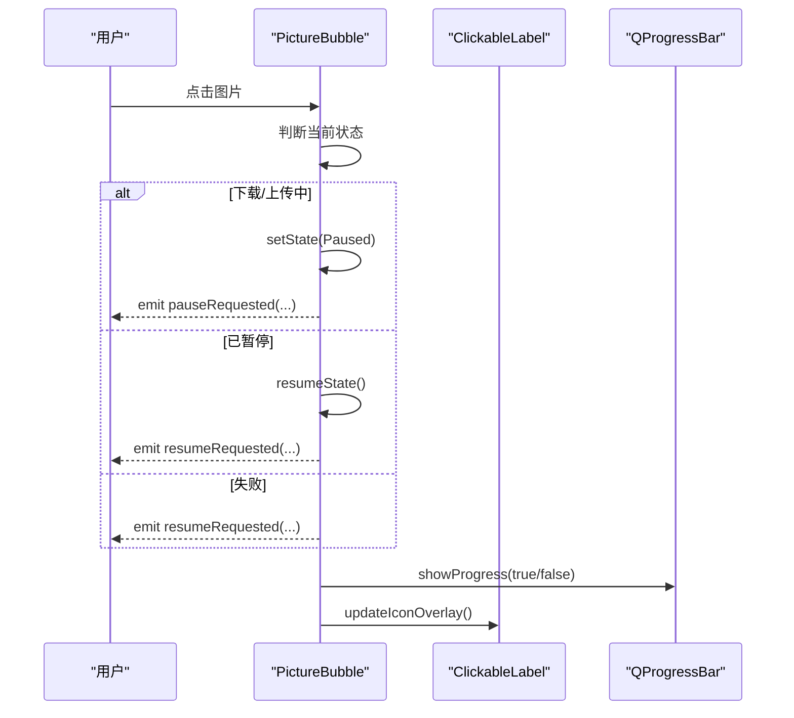
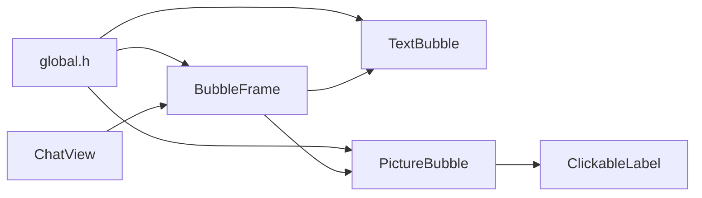

# 气泡组件系统

<cite>
**本文引用的文件**   
- [BubbleFrame.h](file://client/llfcchat/include/BubbleFrame.h)
- [BubbleFrame.cpp](file://client/llfcchat/src/BubbleFrame.cpp)
- [TextBubble.h](file://client/llfcchat/include/TextBubble.h)
- [TextBubble.cpp](file://client/llfcchat/src/TextBubble.cpp)
- [PictureBubble.h](file://client/llfcchat/include/PictureBubble.h)
- [PictureBubble.cpp](file://client/llfcchat/src/PictureBubble.cpp)
- [ClickableLabel.h](file://client/llfcchat/include/ClickableLabel.h)
- [ClickableLabel.cpp](file://client/llfcchat/src/ClickableLabel.cpp)
- [global.h](file://client/llfcchat/include/global.h)
- [ChatView.h](file://client/llfcchat/include/ChatView.h)
- [ChatView.cpp](file://client/llfcchat/src/ChatView.cpp)
- [day22.气泡聊天对话框.md](file://开发文档/day22.气泡聊天对话框.md)
</cite>

## 目录
1. [简介](#简介)
2. [项目结构](#项目结构)
3. [核心组件](#核心组件)
4. [架构总览](#架构总览)
5. [详细组件分析](#详细组件分析)
6. [依赖关系分析](#依赖关系分析)
7. [性能与渲染优化](#性能与渲染优化)
8. [故障排查指南](#故障排查指南)
9. [结论](#结论)
10. [附录：扩展与定制指南](#附录扩展与定制指南)

## 简介
本文件面向LLFCChat客户端的气泡组件系统，系统性梳理BubbleFrame基类的设计与实现、TextBubble文本气泡与PictureBubble图片气泡的具体实现细节，包括内容渲染、自适应布局、交互效果、样式系统与事件处理机制。同时给出继承体系、虚函数接口与扩展点说明，并提供主题切换、动画效果、自定义气泡类型创建与性能优化的实践建议。

## 项目结构
气泡组件位于client/llfcchat模块中，核心头文件在include目录，对应实现在src目录；全局枚举与数据结构定义在global.h；气泡容器视图在ChatView中管理。

图表来源 
- [ChatView.h:1-33](file://client/llfcchat/include/ChatView.h#L1-L33)
- [BubbleFrame.h:1-24](file://client/llfcchat/include/BubbleFrame.h#L1-L24)
- [TextBubble.h:1-24](file://client/llfcchat/include/TextBubble.h#L1-L24)
- [PictureBubble.h:1-53](file://client/llfcchat/include/PictureBubble.h#L1-L53)
- [ClickableLabel.h:1-29](file://client/llfcchat/include/ClickableLabel.h#L1-L29)
- [global.h:138-165](file://client/llfcchat/include/global.h#L138-L165)

章节来源
- [ChatView.h:1-33](file://client/llfcchat/include/ChatView.h#L1-L33)
- [ChatView.cpp:1-133](file://client/llfcchat/src/ChatView.cpp#L1-L133)
- [BubbleFrame.h:1-24](file://client/llfcchat/include/BubbleFrame.h#L1-L24)
- [BubbleFrame.cpp:1-73](file://client/llfcchat/src/BubbleFrame.cpp#L1-L73)
- [TextBubble.h:1-24](file://client/llfcchat/include/TextBubble.h#L1-L24)
- [TextBubble.cpp:1-79](file://client/llfcchat/src/TextBubble.cpp#L1-L79)
- [PictureBubble.h:1-53](file://client/llfcchat/include/PictureBubble.h#L1-L53)
- [PictureBubble.cpp:1-243](file://client/llfcchat/src/PictureBubble.cpp#L1-L243)
- [ClickableLabel.h:1-29](file://client/llfcchat/include/ClickableLabel.h#L1-L29)
- [ClickableLabel.cpp:1-74](file://client/llfcchat/src/ClickableLabel.cpp#L1-L74)
- [global.h:138-165](file://client/llfcchat/include/global.h#L138-L165)

## 核心组件
- BubbleFrame：气泡通用框架，负责左右三角箭头绘制、角色（自己/对方）差异化背景色、内部子控件的水平布局与边距控制。
- TextBubble：基于QTextEdit的文本气泡，支持只读、隐藏滚动条、自动计算最大宽度与高度，透明背景以融入气泡。
- PictureBubble：图片气泡，包含缩略图显示、进度条、状态切换（下载/上传/暂停/完成/失败）、点击交互（暂停/继续/重试）与遮罩图标。
- ClickableLabel：可点击标签，支持鼠标悬停与遮罩图标绘制，用于图片气泡的状态提示与交互。
- ChatView：聊天消息滚动容器，提供尾插/头插/中间插入、滚动条行为控制与样式初始化。

章节来源
- [BubbleFrame.cpp:1-73](file://client/llfcchat/src/BubbleFrame.cpp#L1-L73)
- [TextBubble.cpp:1-79](file://client/llfcchat/src/TextBubble.cpp#L1-L79)
- [PictureBubble.cpp:1-243](file://client/llfcchat/src/PictureBubble.cpp#L1-L243)
- [ClickableLabel.cpp:1-74](file://client/llfcchat/src/ClickableLabel.cpp#L1-L74)
- [ChatView.cpp:1-133](file://client/llfcchat/src/ChatView.cpp#L1-L133)

## 架构总览
气泡组件采用“基类+具体实现”的继承体系，BubbleFrame作为抽象化的视觉容器，TextBubble与PictureBubble分别承载文本与图片内容，并通过ChatView进行统一管理与展示。

图表来源 
- [BubbleFrame.h:1-24](file://client/llfcchat/include/BubbleFrame.h#L1-L24)
- [BubbleFrame.cpp:1-73](file://client/llfcchat/src/BubbleFrame.cpp#L1-L73)
- [TextBubble.h:1-24](file://client/llfcchat/include/TextBubble.h#L1-L24)
- [TextBubble.cpp:1-79](file://client/llfcchat/src/TextBubble.cpp#L1-L79)
- [PictureBubble.h:1-53](file://client/llfcchat/include/PictureBubble.h#L1-L53)
- [PictureBubble.cpp:1-243](file://client/llfcchat/src/PictureBubble.cpp#L1-L243)
- [ClickableLabel.h:1-29](file://client/llfcchat/include/ClickableLabel.h#L1-L29)
- [ClickableLabel.cpp:1-74](file://client/llfcchat/src/ClickableLabel.cpp#L1-L74)
- [ChatView.h:1-33](file://client/llfcchat/include/ChatView.h#L1-L33)
- [ChatView.cpp:1-133](file://client/llfcchat/src/ChatView.cpp#L1-L133)

## 详细组件分析

### BubbleFrame基类设计
- 职责：统一气泡外观（圆角矩形+小三角箭头），根据ChatRole决定背景色与三角位置；维护水平布局与边距；提供setWidget将内容控件嵌入。
- 关键实现要点：
  - 构造函数设置不同角色的边距差异，保证三角区域不被内容遮挡。
  - paintEvent中通过QPainter绘制圆角矩形与三角形，Self侧为绿色系，Other侧为白色系。
  - setWidget仅允许添加一次子控件，避免重复覆盖。
- 扩展点：
  - 可通过重写paintEvent实现自定义形状或渐变背景。
  - 可通过setMargin调整内边距（当前未生效，需完善）。

图表来源 
- [BubbleFrame.cpp:34-72](file://client/llfcchat/src/BubbleFrame.cpp#L34-L72)

章节来源
- [BubbleFrame.h:1-24](file://client/llfcchat/include/BubbleFrame.h#L1-L24)
- [BubbleFrame.cpp:1-73](file://client/llfcchat/src/BubbleFrame.cpp#L1-L73)

### TextBubble文本气泡
- 职责：显示只读文本，自动计算最大宽度与固定高度，确保气泡尺寸贴合文本内容。
- 关键实现要点：
  - 构造时禁用滚动条、安装事件过滤器监听Paint事件。
  - setPlainText遍历QTextDocument段落，计算最宽行并设置气泡最大宽度。
  - adjustTextHeight累加每段布局高度，结合文档边距与父布局垂直边距设置固定高度。
  - initStyleSheet设置透明背景与无边框，使文本融入气泡。
- 事件处理：
  - eventFilter拦截QTextEdit的Paint事件，触发高度调整，保证动态内容变化后尺寸正确。

图表来源 
- [TextBubble.cpp:37-73](file://client/llfcchat/src/TextBubble.cpp#L37-L73)

章节来源
- [TextBubble.h:1-24](file://client/llfcchat/include/TextBubble.h#L1-L24)
- [TextBubble.cpp:1-79](file://client/llfcchat/src/TextBubble.cpp#L1-L79)

### PictureBubble图片气泡
- 职责：显示图片缩略图、进度条与状态遮罩图标，支持暂停/继续/重试等交互。
- 关键实现要点：
  - 构造时缩放图片至限定尺寸，创建ClickableLabel与QProgressBar，设置样式。
  - setProgress更新进度百分比，并在完成时延迟隐藏进度条。
  - setState根据状态显示/隐藏进度条并更新遮罩图标（暂停/播放/下载）。
  - onPictureClicked根据当前状态发射信号请求暂停/继续/重试。
  - setDownloadFinish完成后替换真实图片并重新计算尺寸。
- 交互流程：

图表来源 
- [PictureBubble.cpp:189-242](file://client/llfcchat/src/PictureBubble.cpp#L189-L242)

章节来源
- [PictureBubble.h:1-53](file://client/llfcchat/include/PictureBubble.h#L1-L53)
- [PictureBubble.cpp:1-243](file://client/llfcchat/src/PictureBubble.cpp#L1-L243)
- [ClickableLabel.h:1-29](file://client/llfcchat/include/ClickableLabel.h#L1-L29)
- [ClickableLabel.cpp:1-74](file://client/llfcchat/src/ClickableLabel.cpp#L1-L74)

### ChatView滚动容器
- 职责：管理气泡项的插入与移除，控制滚动条行为与样式。
- 关键实现要点：
  - appendChatItem在布局末尾前插入气泡项，保持底部对齐。
  - onVScrollBarMoved在追加后自动滚动到底部，并使用定时器重置标志位。
  - paintEvent委托样式绘制背景。

章节来源
- [ChatView.h:1-33](file://client/llfcchat/include/ChatView.h#L1-L33)
- [ChatView.cpp:1-133](file://client/llfcchat/src/ChatView.cpp#L1-L133)

## 依赖关系分析
- 类型依赖：
  - ChatRole、MsgType、TransferState、TransferType、MsgInfo等定义于global.h，被各气泡组件使用。
- 组件耦合：
  - BubbleFrame为所有气泡的基类，TextBubble与PictureBubble直接继承。
  - PictureBubble依赖ClickableLabel实现遮罩图标与点击交互。
  - ChatView依赖BubbleFrame及其子类进行消息项管理。
- 外部库：
  - Qt框架（QFrame、QTextEdit、QLabel、QProgressBar、QPainter、QVBoxLayout/QHBoxLayout等）。

图表来源 
- [global.h:138-165](file://client/llfcchat/include/global.h#L138-L165)
- [BubbleFrame.h:1-24](file://client/llfcchat/include/BubbleFrame.h#L1-L24)
- [TextBubble.h:1-24](file://client/llfcchat/include/TextBubble.h#L1-L24)
- [PictureBubble.h:1-53](file://client/llfcchat/include/PictureBubble.h#L1-L53)
- [ClickableLabel.h:1-29](file://client/llfcchat/include/ClickableLabel.h#L1-L29)
- [ChatView.h:1-33](file://client/llfcchat/include/ChatView.h#L1-L33)

章节来源
- [global.h:138-165](file://client/llfcchat/include/global.h#L138-L165)
- [BubbleFrame.cpp:1-73](file://client/llfcchat/src/BubbleFrame.cpp#L1-L73)
- [TextBubble.cpp:1-79](file://client/llfcchat/src/TextBubble.cpp#L1-L79)
- [PictureBubble.cpp:1-243](file://client/llfcchat/src/PictureBubble.cpp#L1-L243)
- [ClickableLabel.cpp:1-74](file://client/llfcchat/src/ClickableLabel.cpp#L1-L74)
- [ChatView.cpp:1-133](file://client/llfcchat/src/ChatView.cpp#L1-L133)

## 性能与渲染优化
- 文本气泡：
  - 使用只读QTextEdit并隐藏滚动条，减少重绘开销。
  - 仅在Paint事件中计算高度，避免频繁布局计算。
  - 设置最大宽度一次性计算，避免多次测量。
- 图片气泡：
  - 图片缩放使用KeepAspectRatio与SmoothTransformation，平衡清晰度与性能。
  - 进度条仅在传输状态显示，完成后延迟隐藏，降低UI刷新频率。
  - 遮罩图标按需绘制，悬停状态改变透明度以提升交互反馈。
- 通用优化：
  - 使用QPainter绘制简单几何图形，避免复杂路径。
  - 合理设置固定尺寸（如PictureBubble的adjustSize），减少布局重排。
  - 避免在高频回调中进行耗时操作（如文件IO、网络请求）。

[本节为通用指导，不直接分析具体文件]

## 故障排查指南
- 气泡尺寸异常：
  - 检查TextBubble的setPlainText与adjustTextHeight是否正确计算边距与段落高度。
  - 确认BubbleFrame的setMargin是否生效（当前实现未修改m_margin）。
- 图片气泡状态不更新：
  - 检查setState与updateIconOverlay的调用时机。
  - 确认onPictureClicked的信号发射与上层槽函数连接。
- 滚动条行为异常：
  - 检查ChatView的onVScrollBarMoved逻辑与isAppended标志位重置。
- 遮罩图标不显示：
  - 确认ClickableLabel的showIconOverlay与setIconOverlay调用。
  - 检查hover状态对透明度影响。

章节来源
- [TextBubble.cpp:28-73](file://client/llfcchat/src/TextBubble.cpp#L28-L73)
- [BubbleFrame.cpp:19-23](file://client/llfcchat/src/BubbleFrame.cpp#L19-L23)
- [PictureBubble.cpp:122-149](file://client/llfcchat/src/PictureBubble.cpp#L122-L149)
- [ChatView.cpp:108-120](file://client/llfcchat/src/ChatView.cpp#L108-L120)
- [ClickableLabel.cpp:64-74](file://client/llfcchat/src/ClickableLabel.cpp#L64-L74)

## 结论
LLFCChat气泡组件系统通过清晰的继承结构与职责分离，实现了文本与图片消息的统一展示与交互。BubbleFrame提供通用外观与布局能力，TextBubble与PictureBubble分别专注内容与状态管理，ClickableLabel增强交互体验。整体设计易于扩展，支持主题切换与动画效果，具备良好性能与可维护性。

[本节为总结性内容，不直接分析具体文件]

## 附录：扩展与定制指南

### 自定义气泡类型
- 步骤：
  1. 继承BubbleFrame，实现构造函数与必要方法。
  2. 在构造函数中创建内容控件并调用setWidget嵌入。
  3. 如需自定义绘制，重写paintEvent。
  4. 如需交互，安装事件过滤器或连接信号槽。
- 示例参考路径：
  - [BubbleFrame.h:1-24](file://client/llfcchat/include/BubbleFrame.h#L1-L24)
  - [BubbleFrame.cpp:1-73](file://client/llfcchat/src/BubbleFrame.cpp#L1-L73)

### 主题切换机制
- 通过QSS样式表统一控制颜色、边框与字体。
- 可在BubbleFrame的paintEvent中读取样式属性动态绘制。
- 示例参考路径：
  - [TextBubble.cpp:75-78](file://client/llfcchat/src/TextBubble.cpp#L75-L78)

### 动画效果实现
- 使用QPropertyAnimation对透明度、位置或大小进行动画。
- 在PictureBubble的状态切换中可加入淡入淡出效果。
- 示例参考路径：
  - [PictureBubble.cpp:138-141](file://client/llfcchat/src/PictureBubble.cpp#L138-L141)

### Qt图形绘制与重绘机制
- 使用QPainter进行几何图形绘制，注意设置Pen与Brush。
- 重写paintEvent时调用父类实现以确保正确绘制。
- 示例参考路径：
  - [BubbleFrame.cpp:34-72](file://client/llfcchat/src/BubbleFrame.cpp#L34-L72)

### 性能优化技巧
- 避免在高频回调中进行复杂计算。
- 使用固定尺寸与最小化布局重排。
- 合理使用只读控件与隐藏滚动条。
- 示例参考路径：
  - [TextBubble.cpp:12-26](file://client/llfcchat/src/TextBubble.cpp#L12-L26)
  - [PictureBubble.cpp:66-80](file://client/llfcchat/src/PictureBubble.cpp#L66-L80)

章节来源
- [BubbleFrame.h:1-24](file://client/llfcchat/include/BubbleFrame.h#L1-L24)
- [BubbleFrame.cpp:1-73](file://client/llfcchat/src/BubbleFrame.cpp#L1-L73)
- [TextBubble.cpp:12-26](file://client/llfcchat/src/TextBubble.cpp#L12-L26)
- [PictureBubble.cpp:66-80](file://client/llfcchat/src/PictureBubble.cpp#L66-L80)
- [day22.气泡聊天对话框.md:85-174](file://开发文档/day22.气泡聊天对话框.md#L85-L174)