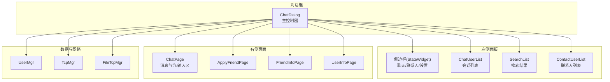
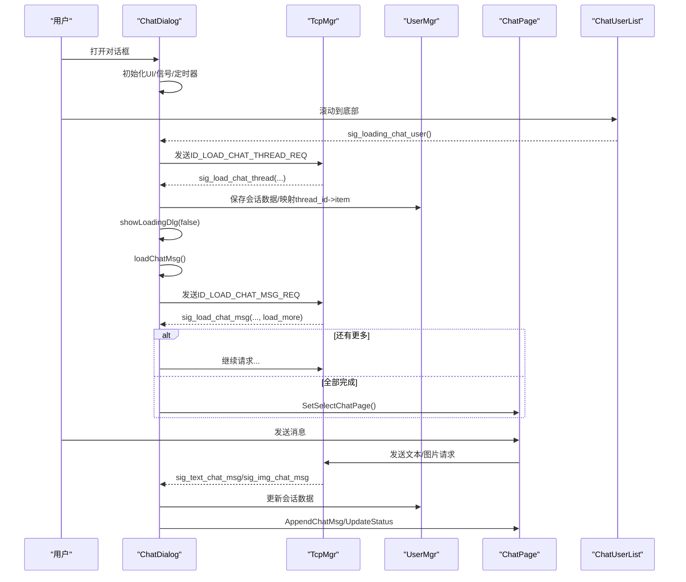
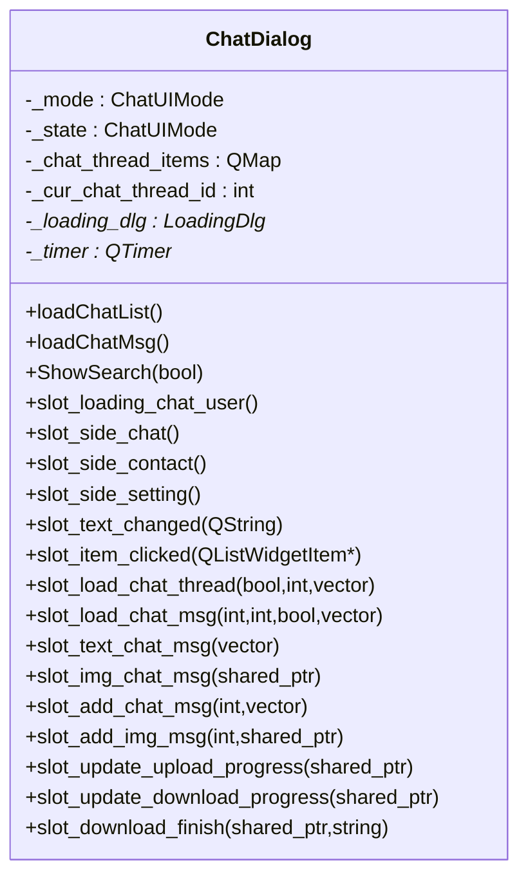
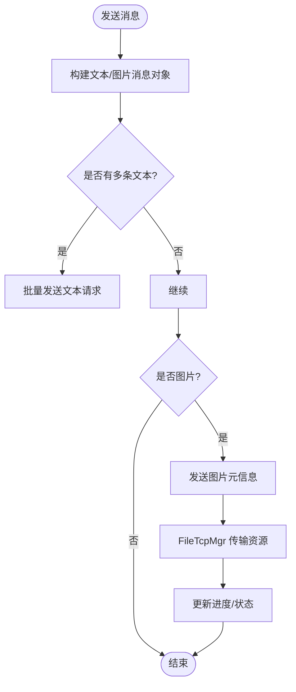
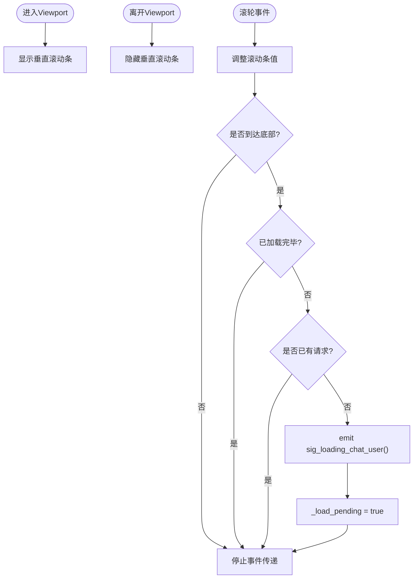
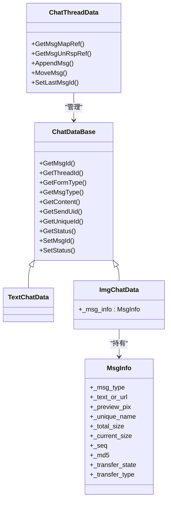
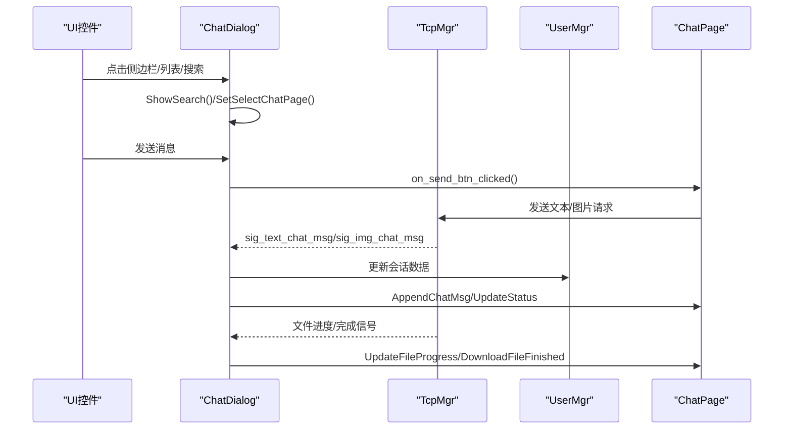
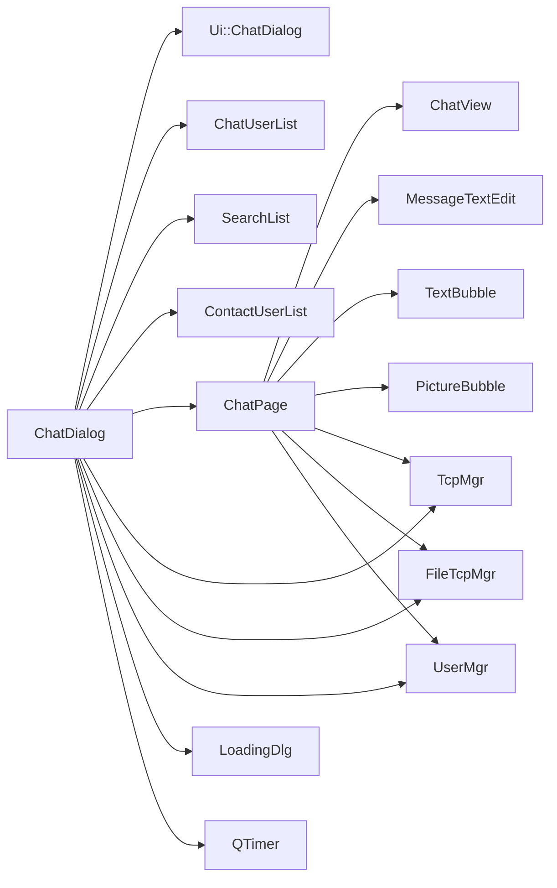

# 聊天对话框组件

<cite>
**本文引用的文件**   
- [chatdialog.h](file://client/llfcchat/include/chatdialog.h)
- [chatdialog.cpp](file://client/llfcchat/src/chatdialog.cpp)
- [chatpage.h](file://client/llfcchat/include/chatpage.h)
- [chatpage.cpp](file://client/llfcchat/src/chatpage.cpp)
- [chatuserlist.h](file://client/llfcchat/include/chatuserlist.h)
- [chatuserlist.cpp](file://client/llfcchat/src/chatuserlist.cpp)
- [searchlist.h](file://client/llfcchat/include/searchlist.h)
- [global.h](file://client/llfcchat/include/global.h)
- [userdata.h](file://client/llfcchat/include/userdata.h)
- [chatitembase.h](file://client/llfcchat/include/chatitembase.h)
- [textbubble.h](file://client/llfcchat/include/textbubble.h)
- [picturebubble.h](file://client/llfcchat/include/picturebubble.h)
- [chatdialog.ui](file://client/llfcchat/ui/chatdialog.ui)
- [chatpage.ui](file://client/llfcchat/ui/chatpage.ui)
</cite>

## 目录
1. [简介](#简介)
2. [项目结构](#项目结构)
3. [核心组件](#核心组件)
4. [架构总览](#架构总览)
5. [详细组件分析](#详细组件分析)
6. [依赖关系分析](#依赖关系分析)
7. [性能考量](#性能考量)
8. [故障排查指南](#故障排查指南)
9. [结论](#结论)
10. [附录](#附录)

## 简介
本文件为 LLFCChat 客户端的聊天对话框组件（ChatDialog）提供系统化、可落地的技术文档。内容覆盖主窗口布局与侧边栏管理、聊天列表与消息显示区域、UI 状态管理（_mode 与 _state）、聊天线程切换机制、搜索功能实现与加载状态处理；并详述信号槽连接关系、用户交互事件处理、数据更新回调与异步操作响应；同时给出聊天列表动态加载、分页加载与性能优化策略，以及扩展新消息类型和复杂交互场景的实践方法，最后总结 UI 组件生命周期管理与内存优化技巧。

## 项目结构
ChatDialog 作为独立对话框，采用 Qt Designer 生成的 UI 布局，配合自定义控件与业务逻辑分离：
- UI 层：chatdialog.ui、chatpage.ui 定义主界面、侧边栏、聊天页等布局与控件。
- 视图层：ChatPage 负责消息气泡渲染、发送/接收交互、头像与图片资源加载。
- 列表层：ChatUserList 负责聊天会话列表滚动与分页加载；SearchList 负责搜索结果展示与跳转。
- 数据层：ChatThreadData、TextChatData、ImgChatData、MsgInfo 等数据结构承载会话与消息。
- 网络层：TcpMgr、FileTcpMgr 通过信号暴露网络请求与进度回调。
- 全局常量与枚举：ReqId、MsgType、TransferState、ChatUIMode 等统一协议与状态。

**图示来源** 
- [chatdialog.ui:1-405](file://client/llfcchat/ui/chatdialog.ui#L1-L405)
- [chatpage.ui:1-384](file://client/llfcchat/ui/chatpage.ui#L1-L384)

**章节来源**
- [chatdialog.ui:1-405](file://client/llfcchat/ui/chatdialog.ui#L1-L405)
- [chatpage.ui:1-384](file://client/llfcchat/ui/chatpage.ui#L1-L384)

## 核心组件
- ChatDialog：对话框主控制器，负责侧边栏切换、搜索模式、聊天列表与消息加载、网络信号接入、加载遮罩控制。
- ChatPage：聊天页视图，负责消息气泡创建、头像/图片资源加载、发送/接收按钮逻辑、上传下载暂停/继续。
- ChatUserList：会话列表，封装滚轮事件与底部加载更多触发。
- SearchList：搜索结果列表，支持跳转到对应聊天会话。
- ChatItemBase / TextBubble / PictureBubble：消息项与气泡组件，封装角色、状态、进度与交互。
- 数据模型：ChatThreadData、TextChatData、ImgChatData、MsgInfo、UserInfo 等。
- 网络模块：TcpMgr、FileTcpMgr 提供统一的请求/进度信号。

**章节来源**
- [chatdialog.h:18-93](file://client/llfcchat/include/chatdialog.h#L18-L93)
- [chatpage.h:13-50](file://client/llfcchat/include/chatpage.h#L13-L50)
- [chatuserlist.h:9-21](file://client/llfcchat/include/chatuserlist.h#L9-L21)
- [searchlist.h:13-59](file://client/llfcchat/include/searchlist.h#L13-L59)
- [chatitembase.h:10-27](file://client/llfcchat/include/chatitembase.h#L10-L27)
- [textbubble.h:8-21](file://client/llfcchat/include/textbubble.h#L8-L21)
- [picturebubble.h:10-50](file://client/llfcchat/include/picturebubble.h#L10-L50)
- [userdata.h:144-284](file://client/llfcchat/include/userdata.h#L144-L284)

## 架构总览
ChatDialog 作为中央协调者，将 UI 事件、网络回调与数据模型解耦，通过信号槽驱动各子组件。整体流程如下：
- 初始化：构建 UI、注册侧边栏状态、安装事件过滤器、连接网络信号、启动心跳定时器。
- 会话加载：loadChatList() 发起 ID_LOAD_CHAT_THREAD_REQ，服务端返回后 slot_load_chat_thread() 填充会话列表并建立 thread_id 到 item 的映射。
- 消息加载：loadChatMsg() 发起 ID_LOAD_CHAT_MSG_REQ，slot_load_chat_msg() 分页追加消息，完成后切换到当前会话页面。
- 实时消息：收到 sig_text_chat_msg/sig_img_chat_msg 时，更新 UserMgr 中的会话数据，并在当前会话中即时 Append。
- 发送消息：ChatPage::on_send_btn_clicked() 组装文本或图片消息，必要时先发送累积文本，再发送图片元信息，随后由 FileTcpMgr 传输实际资源。
- 搜索模式：ShowSearch(true) 隐藏会话/联系人列表，显示 SearchList；点击结果触发 sig_jump_chat_item，回到 ChatMode 并定位到目标会话。

**图示来源** 
- [chatdialog.cpp:203-243](file://client/llfcchat/src/chatdialog.cpp#L203-L243)
- [chatdialog.cpp:358-410](file://client/llfcchat/src/chatdialog.cpp#L358-L410)
- [chatdialog.cpp:437-485](file://client/llfcchat/src/chatdialog.cpp#L437-L485)
- [chatdialog.cpp:282-311](file://client/llfcchat/src/chatdialog.cpp#L282-L311)
- [chatpage.cpp:416-560](file://client/llfcchat/src/chatpage.cpp#L416-L560)
- [chatuserlist.cpp:16-69](file://client/llfcchat/src/chatuserlist.cpp#L16-L69)

## 详细组件分析

### ChatDialog 类设计
- 主窗口布局：使用 QHBoxLayout 分割侧边栏、中间列表区、右侧 stackedWidget 页面。侧边栏包含头像与三个 StateWidget（聊天/联系人/设置）。
- 侧边栏管理：AddLBGroup 收集按钮，ClearLabelState 互斥选中；slot_side_chat/contact/settings 切换 _state 并通过 ShowSearch 控制可见性。
- 聊天列表与消息：_chat_thread_items 维护 thread_id 到 QListWidgetItem* 的映射；SetSelectChatItem/SetSelectChatPage 用于选择与刷新。
- UI 状态管理：_mode 表示当前交互模式（SearchMode/ChatMode/ContactMode/SettingsMode），_state 表示持久化页面状态；ShowSearch 根据两者决定显示哪个列表。
- 搜索功能：search_edit 添加前后动作图标，textChanged 联动清除图标；eventFilter 捕获全局鼠标按下，若处于 SearchMode 且点击不在 SearchList 范围内则关闭搜索。
- 加载状态：showLoadingDlg 使用 LoadingDlg 模态提示；在加载会话与消息前开启，完成后关闭。
- 信号槽连接：集中连接 TcpMgr/FileTcpMgr 的各类通知信号，包括好友申请、认证回复、聊天消息、文件传输进度等。

**图示来源** 
- [chatdialog.h:18-93](file://client/llfcchat/include/chatdialog.h#L18-L93)
- [chatdialog.cpp:25-195](file://client/llfcchat/src/chatdialog.cpp#L25-L195)

**章节来源**
- [chatdialog.h:18-93](file://client/llfcchat/include/chatdialog.h#L18-L93)
- [chatdialog.cpp:25-195](file://client/llfcchat/src/chatdialog.cpp#L25-L195)
- [chatdialog.cpp:314-339](file://client/llfcchat/src/chatdialog.cpp#L314-L339)
- [chatdialog.cpp:527-544](file://client/llfcchat/src/chatdialog.cpp#L527-L544)
- [chatdialog.cpp:758-793](file://client/llfcchat/src/chatdialog.cpp#L758-L793)

### ChatPage 消息渲染与交互
- 消息项创建：AppendChatMsg/AppendOtherMsg 根据发送者角色创建 ChatItemBase，并生成 TextBubble 或 PictureBubble。
- 头像加载：SetSelfIcon/LoadHeadIcon 判断默认头像与本地路径，若缺失则通过 UserMgr 加入待重置队列，并由 FileTcpMgr 下载。
- 发送逻辑：on_send_btn_clicked 聚合多条文本，超过阈值时批量发送；图片消息先发送元信息，再由 FileTcpMgr 传输实际资源。
- 进度与状态：PictureBubble 发出 pauseRequested/resumeRequested，ChatPage 转发至 UserMgr 与 FileTcpMgr 进行暂停/继续；DownloadFileFinished 更新气泡与 MsgInfo 状态。
- 未回复消息：_unrsp_item_map 记录本地唯一标识对应的 UI 项，收到服务器确认后 UpdateChatStatus/UpdateImgChatStatus 迁移到 _base_item_map。

**图示来源** 
- [chatpage.cpp:416-560](file://client/llfcchat/src/chatpage.cpp#L416-L560)
- [chatpage.cpp:563-618](file://client/llfcchat/src/chatpage.cpp#L563-L618)
- [chatpage.cpp:276-303](file://client/llfcchat/src/chatpage.cpp#L276-L303)

**章节来源**
- [chatpage.h:13-50](file://client/llfcchat/include/chatpage.h#L13-L50)
- [chatpage.cpp:38-64](file://client/llfcchat/src/chatpage.cpp#L38-L64)
- [chatpage.cpp:66-176](file://client/llfcchat/src/chatpage.cpp#L66-L176)
- [chatpage.cpp:178-274](file://client/llfcchat/src/chatpage.cpp#L178-L274)
- [chatpage.cpp:305-367](file://client/llfcchat/src/chatpage.cpp#L305-L367)

### ChatUserList 滚动与分页加载
- 滚轮事件：重写 eventFilter，拦截 viewport 的 Wheel 事件，计算滚动步数并调整滚动条位置。
- 底部检测：当滚动条到达最大位置且尚未加载完时，触发 sig_loading_chat_user，由 ChatDialog 发起加载更多会话。
- 防抖保护：_load_pending 避免重复触发；悬停显示滚动条，离开隐藏。

**图示来源** 
- [chatuserlist.cpp:16-69](file://client/llfcchat/src/chatuserlist.cpp#L16-L69)

**章节来源**
- [chatuserlist.h:9-21](file://client/llfcchat/include/chatuserlist.h#L9-L21)
- [chatuserlist.cpp:1-70](file://client/llfcchat/src/chatuserlist.cpp#L1-L70)

### SearchList 搜索与跳转
- 输入联动：SetSearchEdit 绑定 search_edit，内部维护 _send_pending 防止重复请求。
- 结果展示：slot_user_search 处理搜索结果，slot_item_clicked 处理条目点击。
- 跳转信号：sig_jump_chat_item 携带 SearchInfo，由 ChatDialog 切换到 ChatMode 并定位到对应会话。

**章节来源**
- [searchlist.h:13-59](file://client/llfcchat/include/searchlist.h#L13-L59)

### 数据模型与消息类型
- ChatDataBase 基类：抽象消息基础字段（msg_id、thread_id、form_type、msg_type、content、send_uid、status、chat_time）。
- TextChatData/ImgChatData：分别表示文本与图片消息，ImgChatData 关联 MsgInfo 以支持分片传输与进度。
- ChatThreadData：维护会话的消息映射、未回复消息映射、最后消息 id 与群聊信息。
- MsgInfo：描述文件/图片传输细节（大小、序列号、MD5、状态、进度等）。

**图示来源** 
- [userdata.h:144-284](file://client/llfcchat/include/userdata.h#L144-L284)

**章节来源**
- [userdata.h:144-284](file://client/llfcchat/include/userdata.h#L144-L284)

### 信号槽连接关系与事件流
- 侧边栏点击：StateWidget::clicked -> slot_side_* -> ShowSearch -> 切换 _mode/_state。
- 搜索框输入：QLineEdit::textChanged -> slot_text_changed -> 控制清除图标与搜索模式。
- 会话列表点击：QListWidget::itemClicked -> slot_item_clicked -> SetSelectChatPage。
- 网络消息：TcpMgr::sig_text_chat_msg/sig_img_chat_msg -> slot_text_chat_msg/slot_img_chat_msg -> UserMgr 更新 -> ChatPage 追加。
- 文件传输：FileTcpMgr::sig_update_upload/download_progress -> slot_update_* -> ChatPage 更新进度。
- 下载完成：FileTcpMgr::sig_download_finish -> slot_download_finish -> ChatPage 更新气泡与 MsgInfo。

**图示来源** 
- [chatdialog.cpp:71-195](file://client/llfcchat/src/chatdialog.cpp#L71-L195)
- [chatpage.cpp:416-560](file://client/llfcchat/src/chatpage.cpp#L416-L560)

**章节来源**
- [chatdialog.cpp:71-195](file://client/llfcchat/src/chatdialog.cpp#L71-L195)
- [chatpage.cpp:416-560](file://client/llfcchat/src/chatpage.cpp#L416-L560)

## 依赖关系分析
- ChatDialog 依赖：Ui::ChatDialog、ChatUserList、ContactUserList、SearchList、ChatPage、ApplyFriendPage、FriendInfoPage、UserInfoPage、TcpMgr、FileTcpMgr、UserMgr、LoadingDlg、QTimer。
- ChatPage 依赖：ChatView、MessageTextEdit、TextBubble、PictureBubble、UserMgr、TcpMgr、FileTcpMgr。
- 全局依赖：ReqId、MsgType、TransferState、ChatUIMode、ListItemType、MsgStatus、ChatMsgType、ChatFormType。

**图示来源** 
- [chatdialog.cpp:1-24](file://client/llfcchat/src/chatdialog.cpp#L1-L24)
- [chatpage.cpp:1-16](file://client/llfcchat/src/chatpage.cpp#L1-L16)
- [global.h:43-88](file://client/llfcchat/include/global.h#L43-L88)

**章节来源**
- [chatdialog.cpp:1-24](file://client/llfcchat/src/chatdialog.cpp#L1-L24)
- [chatpage.cpp:1-16](file://client/llfcchat/src/chatpage.cpp#L1-L16)
- [global.h:43-88](file://client/llfcchat/include/global.h#L43-L88)

## 性能考量
- 列表虚拟化：ChatUserList 仅对可见项渲染，结合 sizeHint 减少重绘；滚动到底部才加载更多，避免一次性加载大量数据。
- 分页加载：loadChatThread/loadChatMsg 均支持 load_more 标志，按页拉取，降低首屏延迟与内存占用。
- 资源懒加载：头像与图片仅在需要时加载，优先显示默认图，后台下载完成后通过信号回调更新。
- 去重与防抖：_load_pending/_send_pending 防止重复请求；_chat_thread_items 映射避免重复插入。
- 内存管理：LoadingDlg 使用 deleteLater 延迟释放；_unrsp_item_map 与 _base_item_map 及时迁移，避免悬挂指针。

[本节为通用指导，不直接分析具体文件]

## 故障排查指南
- 搜索框无法关闭：检查 eventFilter 是否处于 SearchMode，确认 handleGlobalMousePress 逻辑与 ShowSearch(false) 调用。
- 聊天列表不更新：确认 slot_load_chat_thread 是否正确插入 item 并映射 thread_id；检查 loadChatMsg 的分页循环是否终止。
- 消息未显示：核对 slot_text_chat_msg/slot_img_chat_msg 是否匹配 _cur_chat_thread_id；确保 ChatPage::AppendChatMsg 被调用。
- 图片进度不更新：检查 FileTcpMgr 信号是否连接到 slot_update_upload/download_progress；确认 PictureBubble 的 setProgress/setDownloadFinish 调用。
- 头像不显示：查看 LoadHeadIcon 是否成功加入下载队列；确认 FileTcpMgr 的 sig_reset_label_icon 是否触发 slot_reset_icon。

**章节来源**
- [chatdialog.cpp:314-339](file://client/llfcchat/src/chatdialog.cpp#L314-L339)
- [chatdialog.cpp:358-410](file://client/llfcchat/src/chatdialog.cpp#L358-L410)
- [chatdialog.cpp:282-311](file://client/llfcchat/src/chatdialog.cpp#L282-L311)
- [chatpage.cpp:276-303](file://client/llfcchat/src/chatpage.cpp#L276-L303)

## 结论
ChatDialog 组件通过清晰的职责划分与信号槽机制，实现了聊天会话管理、消息渲染、搜索与分页加载等功能。其设计兼顾了用户体验与性能优化，具备良好的可扩展性。未来可在以下方向持续改进：引入更细粒度的消息类型、增强离线缓存策略、优化大图渲染与缩略图缓存、完善错误重试与断网恢复。

[本节为总结性内容，不直接分析具体文件]

## 附录

### 如何扩展聊天功能
- 新增消息类型：在 global.h 的 ChatMsgType 中添加枚举值，在 ChatPage::AppendChatMsg/AppendOtherMsg 中增加分支渲染新气泡；在 userdata.h 中扩展对应数据类。
- 复杂交互场景：在 PictureBubble 中新增信号（如 cancelRequested），在 ChatPage 中连接并转发至 FileTcpMgr/UserMgr 处理；在 ChatDialog 中连接相关网络信号并更新 UI。
- 扩展侧边栏：新增 StateWidget 并注册到 AddLBGroup，实现 slot_side_xxx 与 ShowSearch 切换逻辑。

**章节来源**
- [global.h:203-208](file://client/llfcchat/include/global.h#L203-L208)
- [chatpage.cpp:66-176](file://client/llfcchat/src/chatpage.cpp#L66-L176)
- [chatdialog.cpp:71-195](file://client/llfcchat/src/chatdialog.cpp#L71-L195)

### UI 组件生命周期与内存优化
- 构造顺序：先 setupUi，再连接信号槽，最后启动定时器；析构时停止定时器并释放 ui。
- 资源释放：LoadingDlg 使用 deleteLater；列表项 widget 由 QListWidget 管理，避免手动 delete。
- 状态清理：切换页面时清空 _unrsp_item_map/_base_item_map；SearchList 关闭弹窗并清空输入。

**章节来源**
- [chatdialog.cpp:25-195](file://client/llfcchat/src/chatdialog.cpp#L25-L195)
- [chatpage.cpp:620-626](file://client/llfcchat/src/chatpage.cpp#L620-L626)