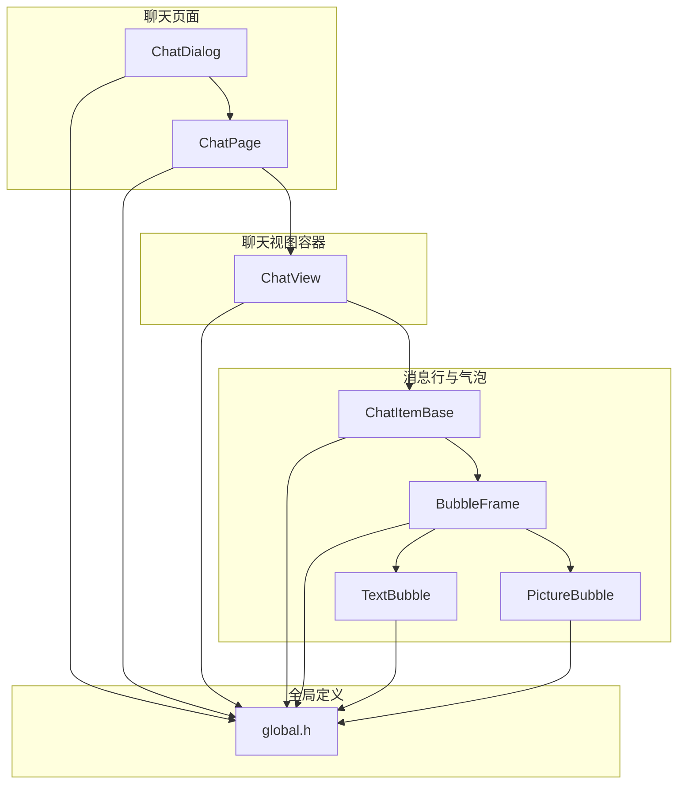
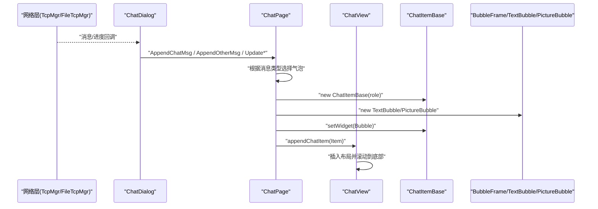
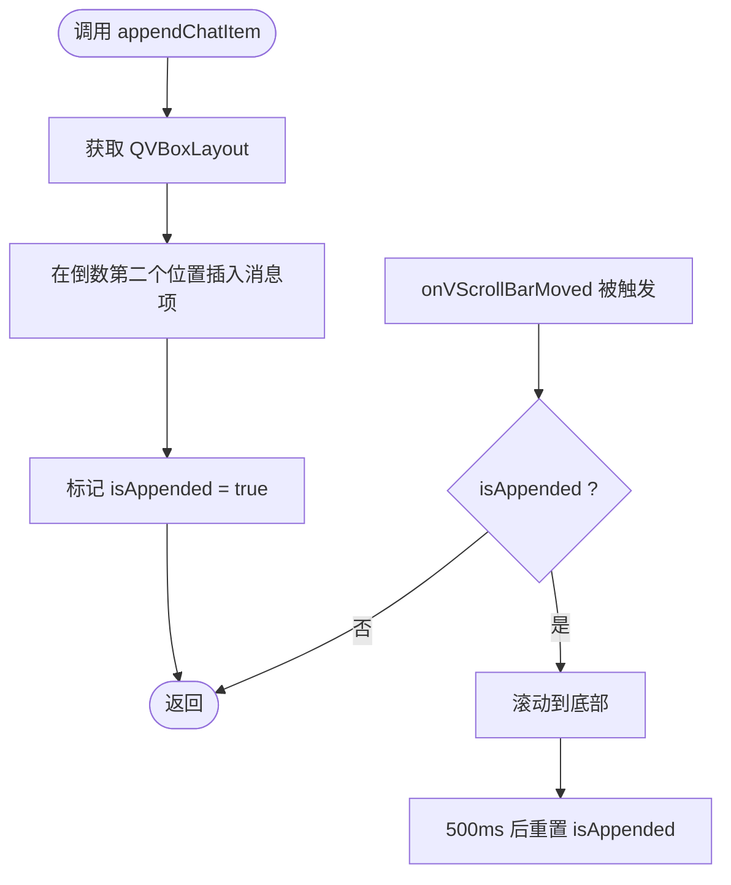
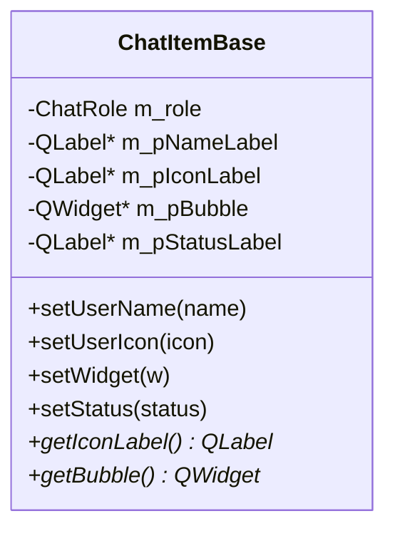
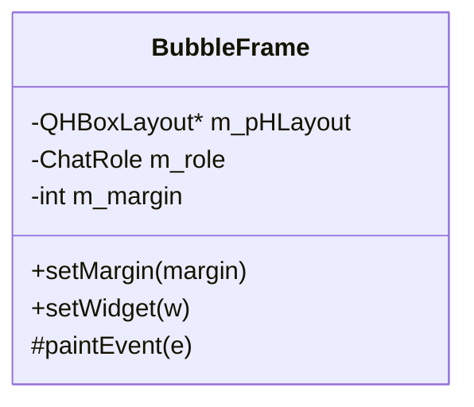
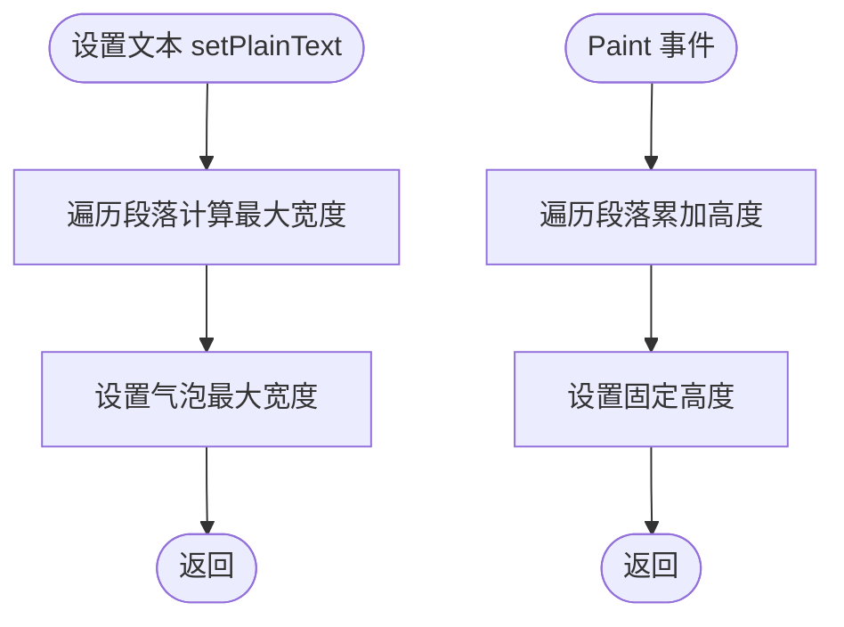
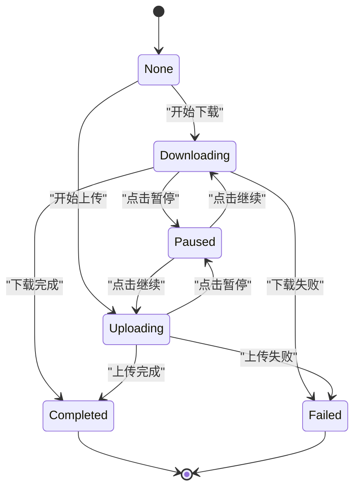
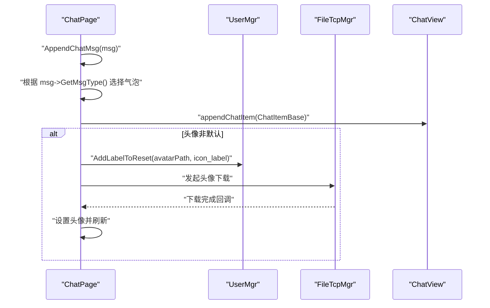
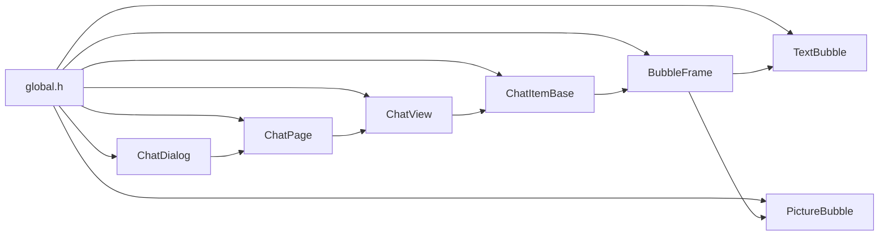

# 聊天视图组件

<cite>
**本文引用的文件**   
- [ChatView.h](file://client/llfcchat/include/ChatView.h)
- [ChatView.cpp](file://client/llfcchat/src/ChatView.cpp)
- [ChatItemBase.h](file://client/llfcchat/include/ChatItemBase.h)
- [ChatItemBase.cpp](file://client/llfcchat/src/ChatItemBase.cpp)
- [BubbleFrame.h](file://client/llfcchat/include/BubbleFrame.h)
- [BubbleFrame.cpp](file://client/llfcchat/src/BubbleFrame.cpp)
- [TextBubble.h](file://client/llfcchat/include/TextBubble.h)
- [TextBubble.cpp](file://client/llfcchat/src/TextBubble.cpp)
- [PictureBubble.h](file://client/llfcchat/include/PictureBubble.h)
- [PictureBubble.cpp](file://client/llfcchat/src/PictureBubble.cpp)
- [global.h](file://client/llfcchat/include/global.h)
- [chatpage.h](file://client/llfcchat/include/chatpage.h)
- [chatpage.cpp](file://client/llfcchat/src/chatpage.cpp)
- [chatdialog.h](file://client/llfcchat/include/chatdialog.h)
- [chatdialog.cpp](file://client/llfcchat/src/chatdialog.cpp)
</cite>

## 目录
1. [简介](#简介)
2. [项目结构](#项目结构)
3. [核心组件](#核心组件)
4. [架构总览](#架构总览)
5. [详细组件分析](#详细组件分析)
6. [依赖关系分析](#依赖关系分析)
7. [性能考量](#性能考量)
8. [故障排查指南](#故障排查指南)
9. [结论](#结论)
10. [附录：扩展与最佳实践](#附录扩展与最佳实践)

## 简介
本文件为 LLFCChat 聊天视图组件的技术文档，聚焦 ChatView 及其相关渲染组件（ChatItemBase、BubbleFrame、TextBubble、PictureBubble）与页面编排（ChatPage、ChatDialog）。文档从系统架构、数据流、渲染引擎、消息项创建与复用、内存管理、滚动与增量更新、大数据集处理等方面展开，并提供添加新消息类型、自定义样式与优化渲染的实践指引。

## 项目结构
聊天视图相关代码集中在 client/llfcchat 模块中，采用“视图容器 + 气泡基类 + 具体气泡实现”的分层组织方式：
- 视图容器：ChatView 负责滚动区域与消息项的增删布局
- 消息行：ChatItemBase 统一头像、用户名、状态与气泡容器
- 气泡基类：BubbleFrame 绘制左右侧气泡背景与三角箭头
- 具体气泡：TextBubble（文本）、PictureBubble（图片/文件传输）
- 页面编排：ChatPage 负责消息渲染与交互；ChatDialog 负责会话切换与网络回调聚合

图表来源
- [chatdialog.cpp:1-195](file://client/llfcchat/src/chatdialog.cpp#L1-L195)
- [chatpage.cpp:1-60](file://client/llfcchat/src/chatpage.cpp#L1-L60)
- [ChatView.cpp:1-44](file://client/llfcchat/src/ChatView.cpp#L1-L44)
- [ChatItemBase.cpp:1-54](file://client/llfcchat/src/ChatItemBase.cpp#L1-L54)
- [BubbleFrame.cpp:1-17](file://client/llfcchat/src/BubbleFrame.cpp#L1-L17)
- [TextBubble.cpp:1-26](file://client/llfcchat/src/TextBubble.cpp#L1-L26)
- [PictureBubble.cpp:1-64](file://client/llfcchat/src/PictureBubble.cpp#L1-L64)
- [global.h:138-200](file://client/llfcchat/include/global.h#L138-L200)

章节来源
- [chatdialog.cpp:1-195](file://client/llfcchat/src/chatdialog.cpp#L1-L195)
- [chatpage.cpp:1-60](file://client/llfcchat/src/chatpage.cpp#L1-L60)
- [ChatView.cpp:1-44](file://client/llfcchat/src/ChatView.cpp#L1-L44)
- [ChatItemBase.cpp:1-54](file://client/llfcchat/src/ChatItemBase.cpp#L1-L54)
- [BubbleFrame.cpp:1-17](file://client/llfcchat/src/BubbleFrame.cpp#L1-L17)
- [TextBubble.cpp:1-26](file://client/llfcchat/src/TextBubble.cpp#L1-L26)
- [PictureBubble.cpp:1-64](file://client/llfcchat/src/PictureBubble.cpp#L1-L64)
- [global.h:138-200](file://client/llfcchat/include/global.h#L138-L200)

## 核心组件
- ChatView：基于 QScrollArea 的聊天消息容器，提供尾插、头插、中间插入与清空能力，内置垂直滚动条隐藏与自动滚到底部逻辑。
- ChatItemBase：消息行容器，根据角色（自己/对方）调整布局，包含用户名、头像、状态图标与气泡占位。
- BubbleFrame：气泡框架，按角色绘制圆角矩形与三角箭头，承载具体气泡内容。
- TextBubble：文本气泡，自适应宽度与高度，使用 QTextEdit 只读显示并计算最大宽度与固定高度。
- PictureBubble：图片/文件气泡，支持进度条、暂停/继续/失败重试等状态，点击触发上传/下载控制信号。
- ChatPage：会话页，负责消息渲染、头像加载、发送/接收按钮、以及图片气泡的交互信号桥接。
- ChatDialog：主对话框，聚合网络回调、会话切换、消息追加与状态更新。

章节来源
- [ChatView.h:7-30](file://client/llfcchat/include/ChatView.h#L7-L30)
- [ChatView.cpp:11-44](file://client/llfcchat/src/ChatView.cpp#L11-L44)
- [ChatItemBase.h:10-27](file://client/llfcchat/include/ChatItemBase.h#L10-L27)
- [ChatItemBase.cpp:5-54](file://client/llfcchat/src/ChatItemBase.cpp#L5-L54)
- [BubbleFrame.h:7-21](file://client/llfcchat/include/BubbleFrame.h#L7-L21)
- [BubbleFrame.cpp:5-17](file://client/llfcchat/src/BubbleFrame.cpp#L5-L17)
- [TextBubble.h:8-21](file://client/llfcchat/include/TextBubble.h#L8-L21)
- [TextBubble.cpp:12-26](file://client/llfcchat/src/TextBubble.cpp#L12-L26)
- [PictureBubble.h:10-50](file://client/llfcchat/include/PictureBubble.h#L10-L50)
- [PictureBubble.cpp:8-64](file://client/llfcchat/src/PictureBubble.cpp#L8-L64)
- [chatpage.h:13-50](file://client/llfcchat/include/chatpage.h#L13-L50)
- [chatdialog.h:18-93](file://client/llfcchat/include/chatdialog.h#L18-L93)

## 架构总览
聊天视图采用“数据驱动 UI”的模式：网络层通过 TcpMgr/FileTcpMgr 推送消息与进度事件，ChatDialog 将事件分发到 ChatPage，ChatPage 根据消息类型构造 ChatItemBase 与对应气泡，再交由 ChatView 进行布局与滚动。

图表来源
- [chatdialog.cpp:149-195](file://client/llfcchat/src/chatdialog.cpp#L149-L195)
- [chatpage.cpp:66-176](file://client/llfcchat/src/chatpage.cpp#L66-L176)
- [ChatView.cpp:46-52](file://client/llfcchat/src/ChatView.cpp#L46-L52)

章节来源
- [chatdialog.cpp:149-195](file://client/llfcchat/src/chatdialog.cpp#L149-L195)
- [chatpage.cpp:66-176](file://client/llfcchat/src/chatpage.cpp#L66-L176)
- [ChatView.cpp:46-52](file://client/llfcchat/src/ChatView.cpp#L46-L52)

## 详细组件分析

### ChatView：滚动容器与消息插入
- 设计要点
  - 使用 QScrollArea 作为滚动容器，内部放置一个 QWidget 承载 QVBoxLayout，用于动态插入消息项。
  - 隐藏原生滚动条，将垂直滚动条置于右侧并通过事件过滤器在鼠标进入/离开时控制显隐。
  - appendChatItem 在布局末尾前插入消息项，保持底部留白控件不被覆盖。
  - onVScrollBarMoved 监听滚动范围变化，批量追加后延时滚动到底部，避免抖动。
- 性能策略
  - 延迟滚动：使用 QTimer::singleShot 合并多次追加后的滚动操作。
  - 最小化重绘：paintEvent 仅委托样式绘制，避免复杂自定义绘制。
- 内存管理
  - removeAllItem 遍历删除子项并释放 widget 与 layout item，防止内存泄漏。

图表来源
- [ChatView.cpp:46-52](file://client/llfcchat/src/ChatView.cpp#L46-L52)
- [ChatView.cpp:108-120](file://client/llfcchat/src/ChatView.cpp#L108-L120)

章节来源
- [ChatView.h:7-30](file://client/llfcchat/include/ChatView.h#L7-L30)
- [ChatView.cpp:11-44](file://client/llfcchat/src/ChatView.cpp#L11-L44)
- [ChatView.cpp:46-80](file://client/llfcchat/src/ChatView.cpp#L46-L80)
- [ChatView.cpp:82-97](file://client/llfcchat/src/ChatView.cpp#L82-L97)
- [ChatView.cpp:99-105](file://client/llfcchat/src/ChatView.cpp#L99-L105)
- [ChatView.cpp:108-120](file://client/llfcchat/src/ChatView.cpp#L108-L120)

### ChatItemBase：消息行布局与状态
- 设计要点
  - 根据 ChatRole 决定用户名对齐、头像与气泡位置，使用 QGridLayout 实现左右对称布局。
  - 提供 setUserName、setUserIcon、setWidget、setStatus 等方法，便于外部设置内容与状态。
  - 状态图标根据 MsgStatus 切换未读、发送失败、已读等图标。
- 性能与内存
  - setWidget 替换气泡占位控件，释放旧气泡，避免重复占用。

图表来源
- [ChatItemBase.h:10-27](file://client/llfcchat/include/ChatItemBase.h#L10-L27)
- [ChatItemBase.cpp:5-54](file://client/llfcchat/src/ChatItemBase.cpp#L5-L54)
- [ChatItemBase.cpp:56-99](file://client/llfcchat/src/ChatItemBase.cpp#L56-L99)

章节来源
- [ChatItemBase.h:10-27](file://client/llfcchat/include/ChatItemBase.h#L10-L27)
- [ChatItemBase.cpp:5-54](file://client/llfcchat/src/ChatItemBase.cpp#L5-L54)
- [ChatItemBase.cpp:56-99](file://client/llfcchat/src/ChatItemBase.cpp#L56-L99)

### BubbleFrame：气泡绘制与角色适配
- 设计要点
  - 根据 ChatRole 设置左右边距与三角箭头方向，绘制圆角矩形背景。
  - setWidget 仅允许一次添加子控件，避免重复布局。
- 性能与内存
  - paintEvent 直接绘制几何图形，开销低。

图表来源
- [BubbleFrame.h:7-21](file://client/llfcchat/include/BubbleFrame.h#L7-L21)
- [BubbleFrame.cpp:5-17](file://client/llfcchat/src/BubbleFrame.cpp#L5-L17)
- [BubbleFrame.cpp:34-72](file://client/llfcchat/src/BubbleFrame.cpp#L34-L72)

章节来源
- [BubbleFrame.h:7-21](file://client/llfcchat/include/BubbleFrame.h#L7-L21)
- [BubbleFrame.cpp:5-17](file://client/llfcchat/src/BubbleFrame.cpp#L5-L17)
- [BubbleFrame.cpp:34-72](file://client/llfcchat/src/BubbleFrame.cpp#L34-L72)

### TextBubble：文本自适应与高度计算
- 设计要点
  - 使用只读 QTextEdit，关闭滚动条，安装事件过滤器拦截 Paint 事件以计算高度。
  - setPlainText 遍历段落计算最大宽度，设置气泡最大宽度；adjustTextHeight 累加每段高度得到固定高度。
- 性能与内存
  - 仅在 Paint 事件中计算高度，避免频繁重排；固定高度减少布局抖动。

图表来源
- [TextBubble.cpp:37-56](file://client/llfcchat/src/TextBubble.cpp#L37-L56)
- [TextBubble.cpp:58-73](file://client/llfcchat/src/TextBubble.cpp#L58-L73)

章节来源
- [TextBubble.h:8-21](file://client/llfcchat/include/TextBubble.h#L8-L21)
- [TextBubble.cpp:12-26](file://client/llfcchat/src/TextBubble.cpp#L12-L26)
- [TextBubble.cpp:37-56](file://client/llfcchat/src/TextBubble.cpp#L37-L56)
- [TextBubble.cpp:58-73](file://client/llfcchat/src/TextBubble.cpp#L58-L73)

### PictureBubble：图片/文件传输与状态机
- 设计要点
  - 维护 TransferState（None/Downloading/Uploading/Paused/Completed/Failed），根据状态显示/隐藏进度条与叠加图标。
  - 点击图片触发暂停/继续/重试，发射 pauseRequested/resumeRequested/cancelRequested 信号。
  - setProgress 更新进度百分比，完成时延迟隐藏进度条。
- 性能与内存
  - 图片缩放至固定最大尺寸，避免大图重绘；状态变更集中处理，减少 UI 抖动。

图表来源
- [PictureBubble.cpp:122-149](file://client/llfcchat/src/PictureBubble.cpp#L122-L149)
- [PictureBubble.cpp:189-217](file://client/llfcchat/src/PictureBubble.cpp#L189-L217)

章节来源
- [PictureBubble.h:10-50](file://client/llfcchat/include/PictureBubble.h#L10-L50)
- [PictureBubble.cpp:8-64](file://client/llfcchat/src/PictureBubble.cpp#L8-L64)
- [PictureBubble.cpp:82-104](file://client/llfcchat/src/PictureBubble.cpp#L82-L104)
- [PictureBubble.cpp:122-149](file://client/llfcchat/src/PictureBubble.cpp#L122-L149)
- [PictureBubble.cpp:189-217](file://client/llfcchat/src/PictureBubble.cpp#L189-L217)

### ChatPage：消息渲染与头像加载
- 设计要点
  - AppendChatMsg/AppendOtherMsg 根据消息类型构造 ChatItemBase 与 TextBubble/PictureBubble，连接 PictureBubble 的暂停/继续信号。
  - 头像加载：默认头像或本地路径存在则直接设置，否则异步下载并缓存，期间显示默认图。
  - 维护 _base_item_map 与 _unrsp_item_map 区分已回复与未回复消息项，便于后续状态更新。
- 性能与内存
  - 头像按需加载与缓存，避免重复请求；图片气泡固定尺寸，减少重排。

图表来源
- [chatpage.cpp:66-176](file://client/llfcchat/src/chatpage.cpp#L66-L176)
- [chatpage.cpp:276-300](file://client/llfcchat/src/chatpage.cpp#L276-L300)

章节来源
- [chatpage.h:13-50](file://client/llfcchat/include/chatpage.h#L13-L50)
- [chatpage.cpp:66-176](file://client/llfcchat/src/chatpage.cpp#L66-L176)
- [chatpage.cpp:276-300](file://client/llfcchat/src/chatpage.cpp#L276-L300)

### ChatDialog：会话管理与网络回调聚合
- 设计要点
  - 连接 TcpMgr/FileTcpMgr 的信号到槽函数，处理聊天列表、消息加载、消息追加、图片消息、进度更新与下载完成。
  - 维护 _chat_thread_items 映射 thread_id 与 QListWidgetItem，便于切换会话与定位。
  - 心跳定时器周期性发送心跳包。
- 性能与内存
  - 分批次加载聊天线程与消息，避免一次性加载大量数据。

章节来源
- [chatdialog.h:18-93](file://client/llfcchat/include/chatdialog.h#L18-L93)
- [chatdialog.cpp:149-195](file://client/llfcchat/src/chatdialog.cpp#L149-L195)
- [chatdialog.cpp:358-410](file://client/llfcchat/src/chatdialog.cpp#L358-L410)
- [chatdialog.cpp:437-485](file://client/llfcchat/src/chatdialog.cpp#L437-L485)

## 依赖关系分析
- ChatPage 依赖 global.h 中的枚举与数据结构（ChatRole、MsgType、TransferState、MsgInfo 等）。
- ChatDialog 依赖 TcpMgr/FileTcpMgr 的网络回调，依赖 UserMgr 的用户与会话数据管理。
- ChatView 依赖 Qt 的 QScrollArea/QVBoxLayout/QTimer 等基础组件。
- 气泡组件依赖 BubbleFrame 与 global.h 的类型定义。

图表来源
- [global.h:138-200](file://client/llfcchat/include/global.h#L138-L200)
- [chatpage.cpp:1-60](file://client/llfcchat/src/chatpage.cpp#L1-L60)
- [chatdialog.cpp:1-195](file://client/llfcchat/src/chatdialog.cpp#L1-L195)
- [ChatView.cpp:1-44](file://client/llfcchat/src/ChatView.cpp#L1-L44)
- [ChatItemBase.cpp:1-54](file://client/llfcchat/src/ChatItemBase.cpp#L1-L54)
- [BubbleFrame.cpp:1-17](file://client/llfcchat/src/BubbleFrame.cpp#L1-L17)
- [TextBubble.cpp:1-26](file://client/llfcchat/src/TextBubble.cpp#L1-L26)
- [PictureBubble.cpp:1-64](file://client/llfcchat/src/PictureBubble.cpp#L1-L64)

章节来源
- [global.h:138-200](file://client/llfcchat/include/global.h#L138-L200)
- [chatpage.cpp:1-60](file://client/llfcchat/src/chatpage.cpp#L1-L60)
- [chatdialog.cpp:1-195](file://client/llfcchat/src/chatdialog.cpp#L1-L195)
- [ChatView.cpp:1-44](file://client/llfcchat/src/ChatView.cpp#L1-L44)
- [ChatItemBase.cpp:1-54](file://client/llfcchat/src/ChatItemBase.cpp#L1-L54)
- [BubbleFrame.cpp:1-17](file://client/llfcchat/src/BubbleFrame.cpp#L1-L17)
- [TextBubble.cpp:1-26](file://client/llfcchat/src/TextBubble.cpp#L1-L26)
- [PictureBubble.cpp:1-64](file://client/llfcchat/src/PictureBubble.cpp#L1-L64)

## 性能考量
- 滚动性能优化
  - 使用 QTimer::singleShot 合并滚动到底部的操作，避免高频重绘。
  - 隐藏原生滚动条，仅在需要时显示，降低界面复杂度。
- 增量更新机制
  - ChatPage 维护 _base_item_map 与 _unrsp_item_map，针对特定消息项进行状态更新，避免全量重绘。
  - ChatDialog 分批次加载聊天线程与消息，减少一次性内存压力。
- 大数据集处理
  - 当前 ChatView 使用 QVBoxLayout 动态插入，适合中小规模消息；若需支持海量消息，建议引入虚拟列表（如 QListView + QAbstractListModel + 自定义 delegate）以实现按需渲染与复用。
- 渲染性能
  - TextBubble 固定高度与最大宽度，减少布局计算；PictureBubble 限制图片最大尺寸，避免大图重绘。
  - 头像异步加载与缓存，避免阻塞 UI。

[本节为通用指导，不直接分析具体文件]

## 故障排查指南
- 滚动异常
  - 检查 appendChatItem 是否正确在倒数第二个位置插入，确保底部留白控件不被覆盖。
  - 确认 onVScrollBarMoved 的 isAppended 标志与 QTimer 重置逻辑是否生效。
- 气泡高度不正确
  - 检查 TextBubble 的 adjustTextHeight 是否在 Paint 事件中执行，确保段落高度累加正确。
- 头像未显示
  - 确认头像路径是否存在，异步下载流程是否触发，UserMgr 的下载队列是否包含该文件。
- 图片气泡状态异常
  - 检查 setState 的状态机转换逻辑，确认进度条显示/隐藏与叠加图标更新是否一致。

章节来源
- [ChatView.cpp:46-80](file://client/llfcchat/src/ChatView.cpp#L46-L80)
- [ChatView.cpp:108-120](file://client/llfcchat/src/ChatView.cpp#L108-L120)
- [TextBubble.cpp:58-73](file://client/llfcchat/src/TextBubble.cpp#L58-L73)
- [chatpage.cpp:276-300](file://client/llfcchat/src/chatpage.cpp#L276-L300)
- [PictureBubble.cpp:122-149](file://client/llfcchat/src/PictureBubble.cpp#L122-L149)

## 结论
LLFCChat 聊天视图组件通过清晰的层次结构与数据驱动 UI 模式，实现了消息渲染、滚动优化与图片/文件传输状态管理。当前实现适用于中小规模消息场景，若需支持大规模数据集，建议引入虚拟列表与更完善的项复用机制。整体设计具备良好的扩展性，便于新增消息类型与自定义样式。

[本节为总结，不直接分析具体文件]

## 附录：扩展与最佳实践
- 添加新消息类型
  - 在 global.h 中扩展 ChatMsgType 枚举。
  - 在 ChatPage::AppendChatMsg/AppendOtherMsg 中增加分支，构造新的气泡类。
  - 如需特殊交互，为新气泡类定义信号并在 ChatPage 中连接处理。
- 自定义消息样式
  - 继承 BubbleFrame 并重写 paintEvent，实现自定义背景与三角箭头。
  - 使用 QSS 对气泡内部控件进行样式定制（如 TextBubble 的 QTextEdit 透明背景）。
- 优化渲染性能
  - 对于大量消息，考虑使用 QListView + QAbstractListModel + 自定义 delegate，实现虚拟列表与项复用。
  - 避免在高频回调中进行复杂计算，使用定时器合并操作。
  - 图片资源统一缩放与缓存，减少重复解码与绘制。

章节来源
- [global.h:145-150](file://client/llfcchat/include/global.h#L145-L150)
- [chatpage.cpp:66-176](file://client/llfcchat/src/chatpage.cpp#L66-L176)
- [BubbleFrame.cpp:34-72](file://client/llfcchat/src/BubbleFrame.cpp#L34-L72)
- [TextBubble.cpp:75-79](file://client/llfcchat/src/TextBubble.cpp#L75-L79)