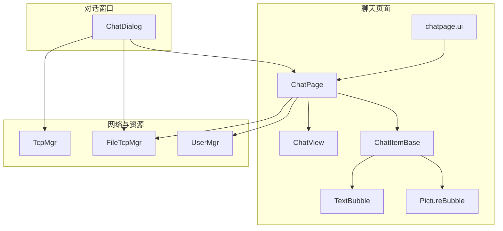
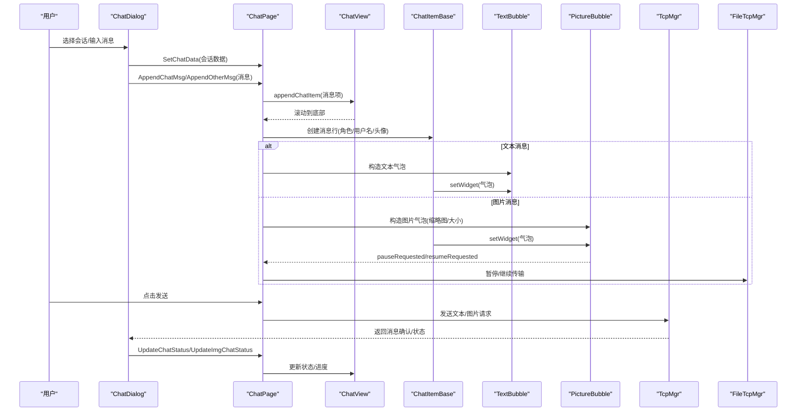
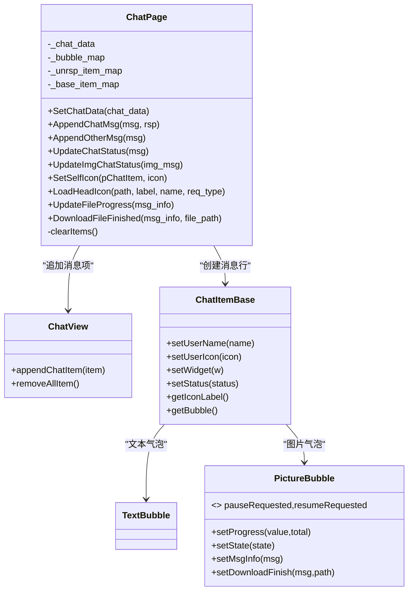
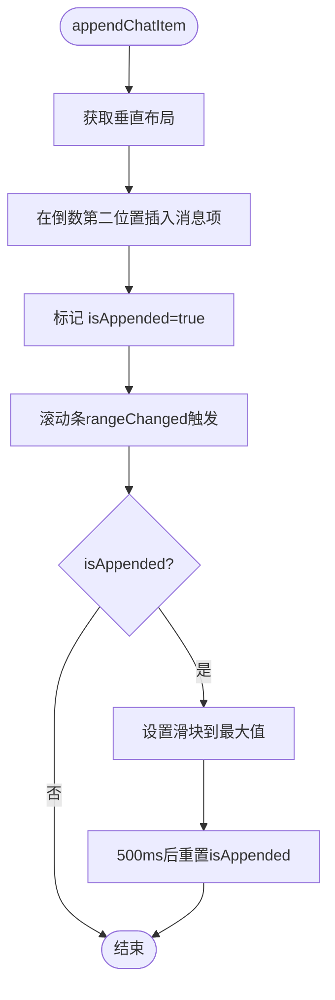
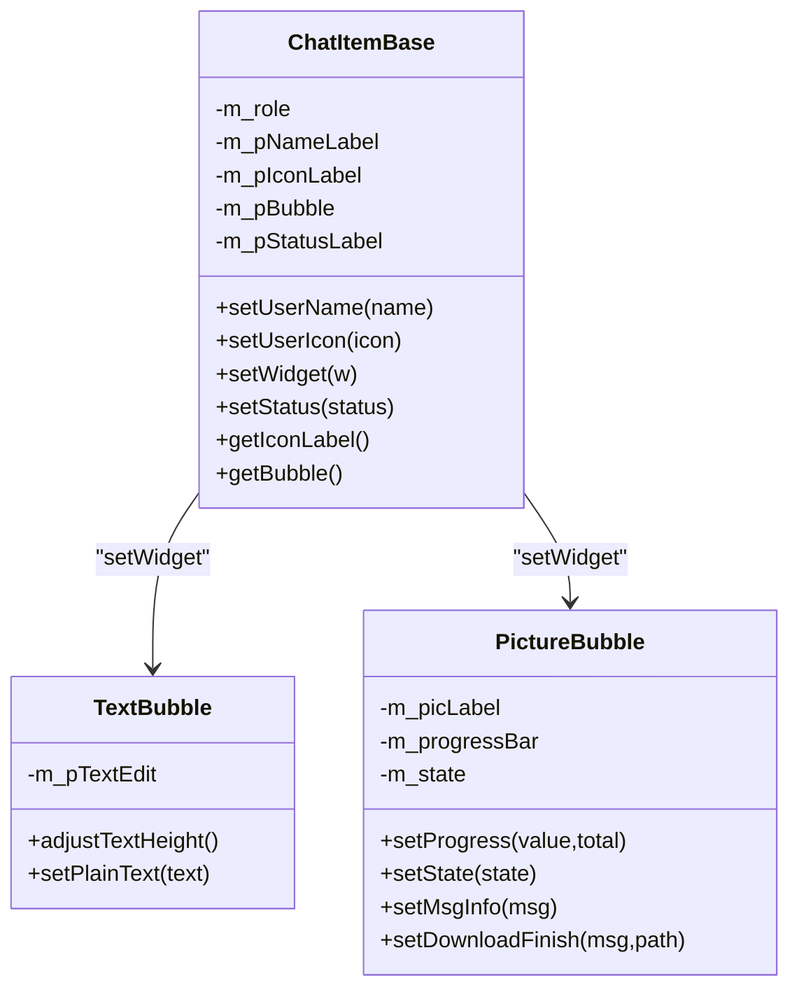
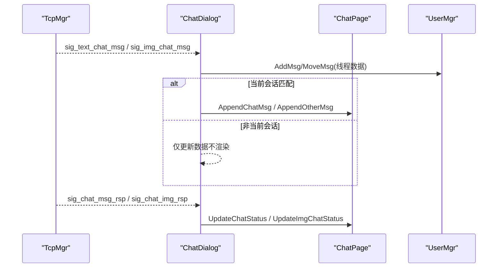
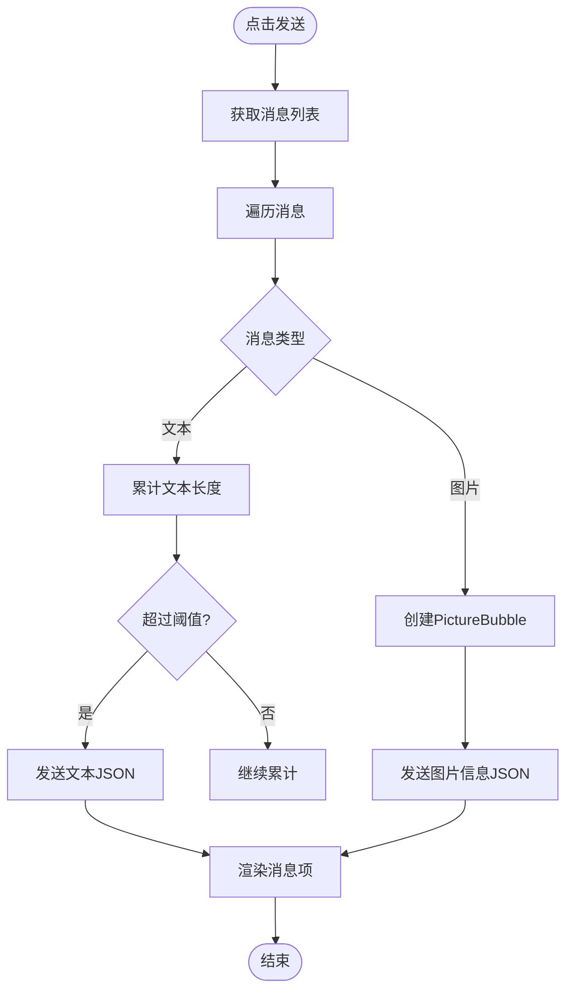
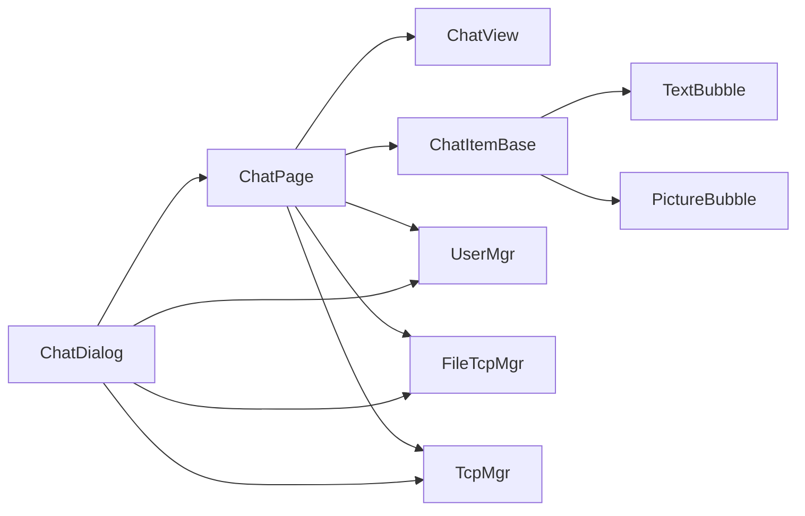

# 聊天页面组件

<cite>
**本文引用的文件**   
- [chatpage.h](file://client/llfcchat/include/chatpage.h)
- [chatpage.cpp](file://client/llfcchat/src/chatpage.cpp)
- [chatdialog.h](file://client/llfcchat/include/chatdialog.h)
- [chatdialog.cpp](file://client/llfcchat/src/chatdialog.cpp)
- [ChatView.h](file://client/llfcchat/include/ChatView.h)
- [ChatView.cpp](file://client/llfcchat/src/ChatView.cpp)
- [ChatItemBase.h](file://client/llfcchat/include/ChatItemBase.h)
- [ChatItemBase.cpp](file://client/llfcchat/src/ChatItemBase.cpp)
- [TextBubble.h](file://client/llfcchat/include/TextBubble.h)
- [TextBubble.cpp](file://client/llfcchat/src/TextBubble.cpp)
- [PictureBubble.h](file://client/llfcchat/include/PictureBubble.h)
- [PictureBubble.cpp](file://client/llfcchat/src/PictureBubble.cpp)
- [global.h](file://client/llfcchat/include/global.h)
- [global.cpp](file://client/llfcchat/src/global.cpp)
- [chatpage.ui](file://client/llfcchat/ui/chatpage.ui)
</cite>

## 目录
1. [简介](#简介)
2. [项目结构](#项目结构)
3. [核心组件](#核心组件)
4. [架构总览](#架构总览)
5. [详细组件分析](#详细组件分析)
6. [依赖关系分析](#依赖关系分析)
7. [性能考量](#性能考量)
8. [故障排查指南](#故障排查指南)
9. [结论](#结论)
10. [附录](#附录)

## 简介
本文件为 LLFCChat 客户端的聊天页面组件提供全面文档，重点围绕 ChatPage 类的实现原理与使用方式展开，涵盖：
- 聊天界面布局设计、消息显示区域管理与输入框处理
- 初始化流程、消息渲染机制与用户输入处理
- 与 ChatDialog 的通信方式、数据绑定模式与事件传递机制
- 状态管理、滚动行为控制与性能优化策略
- 自定义样式、新增消息类型与特殊交互的实现要点
- Qt 事件系统、键盘事件处理与焦点管理机制

## 项目结构
聊天页面由 UI 定义与多个组件协同构成：
- UI 定义：chatpage.ui 定义了标题区、消息列表区（ChatView）、工具栏（表情、文件图标）、输入框（MessageTextEdit）和发送/接收按钮。
- 视图容器：ChatView 封装了 QScrollArea，负责消息项的尾插、清理与滚动条行为控制。
- 消息项：ChatItemBase 作为每条消息的容器，包含头像、用户名、气泡与状态图标。
- 气泡组件：TextBubble 用于文本消息，PictureBubble 用于图片消息（支持进度、暂停/继续）。
- 页面控制器：ChatPage 负责消息追加、状态更新、头像加载、文件传输回调等。
- 对话窗口：ChatDialog 负责与服务器通信、消息路由、会话切换与页面联动。

图表来源
- [chatpage.ui:112-113](file://client/llfcchat/ui/chatpage.ui#L112-L113)
- [ChatView.h:7-30](file://client/llfcchat/include/ChatView.h#L7-L30)
- [ChatItemBase.h:10-27](file://client/llfcchat/include/ChatItemBase.h#L10-L27)
- [TextBubble.h:8-21](file://client/llfcchat/include/TextBubble.h#L8-L21)
- [PictureBubble.h:10-50](file://client/llfcchat/include/PictureBubble.h#L10-L50)
- [chatdialog.h:18-93](file://client/llfcchat/include/chatdialog.h#L18-L93)

章节来源
- [chatpage.ui:1-384](file://client/llfcchat/ui/chatpage.ui#L1-L384)
- [ChatView.h:1-33](file://client/llfcchat/include/ChatView.h#L1-L33)
- [ChatItemBase.h:1-30](file://client/llfcchat/include/ChatItemBase.h#L1-L30)
- [TextBubble.h:1-24](file://client/llfcchat/include/TextBubble.h#L1-L24)
- [PictureBubble.h:1-53](file://client/llfcchat/include/PictureBubble.h#L1-L53)
- [chatdialog.h:1-98](file://client/llfcchat/include/chatdialog.h#L1-L98)

## 核心组件
- ChatPage：聊天页面的控制器，负责设置会话数据、追加消息、更新状态、头像异步加载、文件传输回调、发送/接收消息逻辑。
- ChatView：消息列表容器，基于 QScrollArea 实现，提供 append/prepend/insert/remove 接口，并控制滚动条隐藏与自动滚到底部。
- ChatItemBase：消息行容器，根据角色（自己/对方）调整布局，承载用户名、头像、气泡与状态图标。
- TextBubble：文本气泡，自适应宽度与高度，只读显示。
- PictureBubble：图片气泡，支持缩略图展示、进度条、暂停/继续、完成状态与点击交互。
- ChatDialog：主对话框，负责会话列表、消息加载、网络信号分发、与 ChatPage 的数据同步。

章节来源
- [chatpage.h:13-50](file://client/llfcchat/include/chatpage.h#L13-L50)
- [chatpage.cpp:18-66](file://client/llfcchat/src/chatpage.cpp#L18-L66)
- [ChatView.h:7-30](file://client/llfcchat/include/ChatView.h#L7-L30)
- [ChatView.cpp:11-44](file://client/llfcchat/src/ChatView.cpp#L11-L44)
- [ChatItemBase.h:10-27](file://client/llfcchat/include/ChatItemBase.h#L10-L27)
- [ChatItemBase.cpp:5-54](file://client/llfcchat/src/ChatItemBase.cpp#L5-L54)
- [TextBubble.h:8-21](file://client/llfcchat/include/TextBubble.h#L8-L21)
- [TextBubble.cpp:12-26](file://client/llfcchat/src/TextBubble.cpp#L12-L26)
- [PictureBubble.h:10-50](file://client/llfcchat/include/PictureBubble.h#L10-L50)
- [PictureBubble.cpp:8-64](file://client/llfcchat/src/PictureBubble.cpp#L8-L64)
- [chatdialog.h:18-93](file://client/llfcchat/include/chatdialog.h#L18-L93)

## 架构总览
聊天页面采用“控制器 + 视图容器 + 气泡组件”的分层架构：
- ChatDialog 作为上层控制器，负责网络请求、会话切换与消息路由。
- ChatPage 作为页面控制器，负责具体会话的消息渲染、状态更新与用户输入处理。
- ChatView 作为消息列表容器，屏蔽滚动细节并提供统一的插入接口。
- ChatItemBase + Bubble（TextBubble/PictureBubble）组成消息单元，解耦显示与业务。

图表来源
- [chatdialog.cpp:245-311](file://client/llfcchat/src/chatdialog.cpp#L245-L311)
- [chatpage.cpp:66-176](file://client/llfcchat/src/chatpage.cpp#L66-L176)
- [ChatView.cpp:46-52](file://client/llfcchat/src/ChatView.cpp#L46-L52)
- [PictureBubble.cpp:189-217](file://client/llfcchat/src/PictureBubble.cpp#L189-L217)

## 详细组件分析

### ChatPage 类分析
职责与关键点：
- 初始化与设置会话数据：SetChatData 根据私聊/群聊设置标题，清空旧消息，遍历历史消息调用 AppendChatMsg 渲染。
- 消息追加：AppendChatMsg/AppendOtherMsg 根据消息类型创建 TextBubble 或 PictureBubble，设置用户名、头像、状态，并加入 ChatView；维护未回复映射 _unrsp_item_map 与已回复映射 _base_item_map。
- 状态更新：UpdateChatStatus/UpdateImgChatStatus 将未回复项迁移到已回复映射，并更新气泡状态或图片信息。
- 头像加载：LoadHeadIcon/SetSelfIcon 判断默认头像或本地路径，必要时通过 UserMgr/FileTcpMgr 异步下载并刷新 QLabel。
- 发送消息：on_send_btn_clicked 从 MessageTextEdit 获取消息列表，聚合文本（长度限制），组织 JSON 并通过 TcpMgr 发送；图片消息触发上传流程，连接暂停/继续信号。
- 接收消息：on_receive_btn_clicked 模拟对端消息渲染（测试用途）。
- 文件传输回调：UpdateFileProgress 更新进度；DownloadFileFinished 完成时替换缩略图并更新数据模型。

图表来源
- [chatpage.h:13-50](file://client/llfcchat/include/chatpage.h#L13-L50)
- [ChatView.h:7-30](file://client/llfcchat/include/ChatView.h#L7-L30)
- [ChatItemBase.h:10-27](file://client/llfcchat/include/ChatItemBase.h#L10-L27)
- [TextBubble.h:8-21](file://client/llfcchat/include/TextBubble.h#L8-L21)
- [PictureBubble.h:10-50](file://client/llfcchat/include/PictureBubble.h#L10-L50)

章节来源
- [chatpage.cpp:38-64](file://client/llfcchat/src/chatpage.cpp#L38-L64)
- [chatpage.cpp:66-176](file://client/llfcchat/src/chatpage.cpp#L66-L176)
- [chatpage.cpp:178-274](file://client/llfcchat/src/chatpage.cpp#L178-L274)
- [chatpage.cpp:276-303](file://client/llfcchat/src/chatpage.cpp#L276-L303)
- [chatpage.cpp:305-367](file://client/llfcchat/src/chatpage.cpp#L305-L367)
- [chatpage.cpp:416-560](file://client/llfcchat/src/chatpage.cpp#L416-L560)
- [chatpage.cpp:563-598](file://client/llfcchat/src/chatpage.cpp#L563-L598)

### ChatView 组件分析
职责与关键点：
- 内部使用 QScrollArea 包裹一个垂直布局，消息项插入在倒数第二个位置（保留底部占位控件），实现尾插效果。
- 监听垂直滚动条 rangeChanged，添加 item 后自动滚动到底部，并在 500ms 内去抖重置标记。
- 鼠标进入/离开区域控制滚动条显隐，提升视觉体验。
- removeAllItem 安全清理所有子控件与布局项。

图表来源
- [ChatView.cpp:46-52](file://client/llfcchat/src/ChatView.cpp#L46-L52)
- [ChatView.cpp:108-120](file://client/llfcchat/src/ChatView.cpp#L108-L120)

章节来源
- [ChatView.cpp:11-44](file://client/llfcchat/src/ChatView.cpp#L11-L44)
- [ChatView.cpp:64-80](file://client/llfcchat/src/ChatView.cpp#L64-L80)
- [ChatView.cpp:82-97](file://client/llfcchat/src/ChatView.cpp#L82-L97)
- [ChatView.cpp:108-120](file://client/llfcchat/src/ChatView.cpp#L108-L120)

### ChatItemBase 与气泡组件
- ChatItemBase 根据 ChatRole 决定左右布局，设置用户名对齐、头像固定尺寸、状态图标与气泡占位。
- TextBubble 使用 QTextEdit 只读显示文本，计算最大宽度与高度以自适应气泡尺寸。
- PictureBubble 管理缩略图、进度条、状态图标覆盖层，响应点击进行暂停/继续/重试等操作，并与 FileTcpMgr/TcpMgr 协作。

图表来源
- [ChatItemBase.cpp:5-54](file://client/llfcchat/src/ChatItemBase.cpp#L5-L54)
- [TextBubble.cpp:12-26](file://client/llfcchat/src/TextBubble.cpp#L12-L26)
- [PictureBubble.cpp:8-64](file://client/llfcchat/src/PictureBubble.cpp#L8-L64)

章节来源
- [ChatItemBase.cpp:56-99](file://client/llfcchat/src/ChatItemBase.cpp#L56-L99)
- [TextBubble.cpp:28-79](file://client/llfcchat/src/TextBubble.cpp#L28-L79)
- [PictureBubble.cpp:66-174](file://client/llfcchat/src/PictureBubble.cpp#L66-L174)

### 与 ChatDialog 的通信与数据流
- ChatDialog 负责加载会话列表与消息，收到服务器通知后将消息转发给当前会话的 ChatPage。
- 文本消息：slot_text_chat_msg 将消息添加到线程数据，若当前会话匹配则调用 AppendChatMsg。
- 图片消息：slot_img_chat_msg 更新线程数据，若当前会话匹配则调用 AppendOtherMsg。
- 发送确认：slot_add_chat_msg/slot_add_img_msg 将未回复消息迁移到已回复映射，并调用 ChatPage 的状态更新接口。

图表来源
- [chatdialog.cpp:282-311](file://client/llfcchat/src/chatdialog.cpp#L282-L311)
- [chatdialog.cpp:488-521](file://client/llfcchat/src/chatdialog.cpp#L488-L521)

章节来源
- [chatdialog.cpp:245-311](file://client/llfcchat/src/chatdialog.cpp#L245-L311)
- [chatdialog.cpp:488-521](file://client/llfcchat/src/chatdialog.cpp#L488-L521)

### 输入框处理与发送流程
- on_send_btn_clicked 从 MessageTextEdit 获取消息列表，按类型处理：
  - 文本消息：累计长度不超过阈值，分批组织 JSON 数组发送；生成唯一 ID 并记录未回复映射。
  - 图片消息：构造 PictureBubble，组织文件信息 JSON，通过 TcpMgr 发送；连接暂停/继续信号。
- on_receive_btn_clicked 用于测试，直接渲染对端消息。

图表来源
- [chatpage.cpp:416-560](file://client/llfcchat/src/chatpage.cpp#L416-L560)

章节来源
- [chatpage.cpp:416-560](file://client/llfcchat/src/chatpage.cpp#L416-L560)
- [chatpage.cpp:563-598](file://client/llfcchat/src/chatpage.cpp#L563-L598)

### 状态管理与滚动行为
- 状态映射：_unrsp_item_map 保存未回复消息项，_base_item_map 保存已回复消息项；状态更新时迁移并更新 UI。
- 滚动行为：ChatView 在 append 后自动滚动到底部，避免频繁重排；鼠标进入/离开控制滚动条显隐。
- 进度与完成：PictureBubble 根据 TransferState 显示/隐藏进度条，完成后延迟隐藏并更新缩略图。

章节来源
- [chatpage.cpp:305-367](file://client/llfcchat/src/chatpage.cpp#L305-L367)
- [ChatView.cpp:108-120](file://client/llfcchat/src/ChatView.cpp#L108-L120)
- [PictureBubble.cpp:122-174](file://client/llfcchat/src/PictureBubble.cpp#L122-L174)

### 头像加载与资源管理
- LoadHeadIcon/SetSelfIcon 判断是否为默认头像，否则构建本地路径并检查是否存在；不存在则创建目录并发起下载。
- 通过 UserMgr 注册待刷新 Label，FileTcpMgr 发送下载请求，完成后回调 slot_reset_icon 刷新 UI。

章节来源
- [chatpage.cpp:276-303](file://client/llfcchat/src/chatpage.cpp#L276-L303)
- [chatpage.cpp:369-405](file://client/llfcchat/src/chatpage.cpp#L369-L405)
- [chatdialog.cpp:523-525](file://client/llfcchat/src/chatdialog.cpp#L523-L525)

### 事件系统与焦点管理
- ChatDialog 安装事件过滤器处理全局鼠标按下，用于搜索模式下的点击外部区域关闭搜索框。
- 搜索框的 QAction 动态切换清除图标，触发时清空文本并失去焦点。
- ChatView 的事件过滤器控制滚动条显隐，提升交互体验。

章节来源
- [chatdialog.cpp:314-339](file://client/llfcchat/src/chatdialog.cpp#L314-L339)
- [chatdialog.cpp:49-66](file://client/llfcchat/src/chatdialog.cpp#L49-L66)
- [ChatView.cpp:82-97](file://client/llfcchat/src/ChatView.cpp#L82-L97)

## 依赖关系分析
- ChatPage 依赖 ChatView、ChatItemBase、TextBubble、PictureBubble、UserMgr、FileTcpMgr、TcpMgr。
- ChatDialog 依赖 TcpMgr、FileTcpMgr、UserMgr，并通过信号槽与 ChatPage 交互。
- 全局常量与枚举（ReqId、MsgType、TransferState 等）定义于 global.h，供各模块共享。

图表来源
- [chatpage.h:13-50](file://client/llfcchat/include/chatpage.h#L13-L50)
- [chatdialog.h:18-93](file://client/llfcchat/include/chatdialog.h#L18-L93)
- [global.h:138-276](file://client/llfcchat/include/global.h#L138-L276)

章节来源
- [global.h:138-276](file://client/llfcchat/include/global.h#L138-L276)
- [chatpage.h:13-50](file://client/llfcchat/include/chatpage.h#L13-L50)
- [chatdialog.h:18-93](file://client/llfcchat/include/chatdialog.h#L18-L93)

## 性能考量
- 消息渲染：ChatView 在尾部插入消息项，避免头部重排；使用 QTimer::singleShot 去抖滚动到底部操作。
- 文本气泡：TextBubble 在 PaintEvent 中计算高度，减少多次布局计算；设置只读与隐藏滚动条降低渲染开销。
- 图片气泡：缩略图固定最大宽高，进度条仅在传输状态显示，完成后延迟隐藏，避免频繁重绘。
- 头像加载：优先使用默认头像快速显示，再异步替换为本地路径图片，提升首屏速度。
- 数据映射：_unrsp_item_map/_base_item_map 使用哈希表 O(1) 查找，状态更新高效。

[本节为通用指导，无需引用具体文件]

## 故障排查指南
- 头像无法加载：检查本地路径是否存在，UserMgr 是否已注册待刷新 Label，FileTcpMgr 是否成功发送下载请求。
- 消息状态未更新：确认 _unrsp_item_map/_base_item_map 是否正确迁移，UpdateChatStatus/UpdateImgChatStatus 是否被调用。
- 滚动异常：检查 ChatView 的 append 顺序与 isAppended 标记，确保 rangeChanged 正确触发。
- 发送失败：检查文本长度限制与 JSON 组装逻辑，确认 TcpMgr 信号已发出且服务器返回正常。

章节来源
- [chatpage.cpp:276-303](file://client/llfcchat/src/chatpage.cpp#L276-L303)
- [chatpage.cpp:305-367](file://client/llfcchat/src/chatpage.cpp#L305-L367)
- [ChatView.cpp:108-120](file://client/llfcchat/src/ChatView.cpp#L108-L120)
- [chatpage.cpp:416-560](file://client/llfcchat/src/chatpage.cpp#L416-L560)

## 结论
ChatPage 作为聊天页面的核心控制器，结合 ChatView、ChatItemBase 与气泡组件，实现了高效的聊天界面渲染与交互。通过与 ChatDialog 的信号槽通信，完成了消息路由、状态同步与文件传输控制。整体架构清晰、职责分离明确，具备良好的扩展性与可维护性。

[本节为总结，无需引用具体文件]

## 附录
- 自定义聊天界面样式：通过 QSS 修改 ChatView、ChatItemBase、TextBubble、PictureBubble 的样式，例如滚动条、气泡背景、进度条颜色等。
- 新增消息类型：在 ChatPage::AppendChatMsg/AppendOtherMsg 中增加类型分支，创建对应气泡组件，并在发送逻辑中处理 JSON 组装与网络发送。
- 特殊交互效果：在 PictureBubble 中扩展点击行为（如查看大图），或通过 ChatItemBase 暴露更多接口实现复杂交互。
- Qt 事件系统与焦点管理：使用 installEventFilter 捕获全局事件，结合 QAction 与 QLineEdit 的信号槽实现搜索框交互；在 ChatView 中控制滚动条显隐。

[本节为概念性内容，无需引用具体文件]