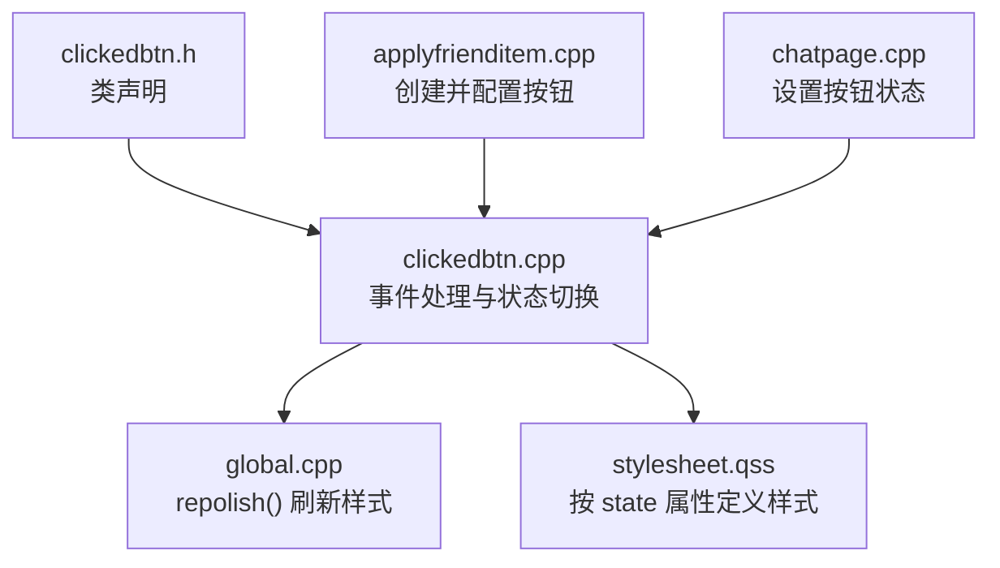
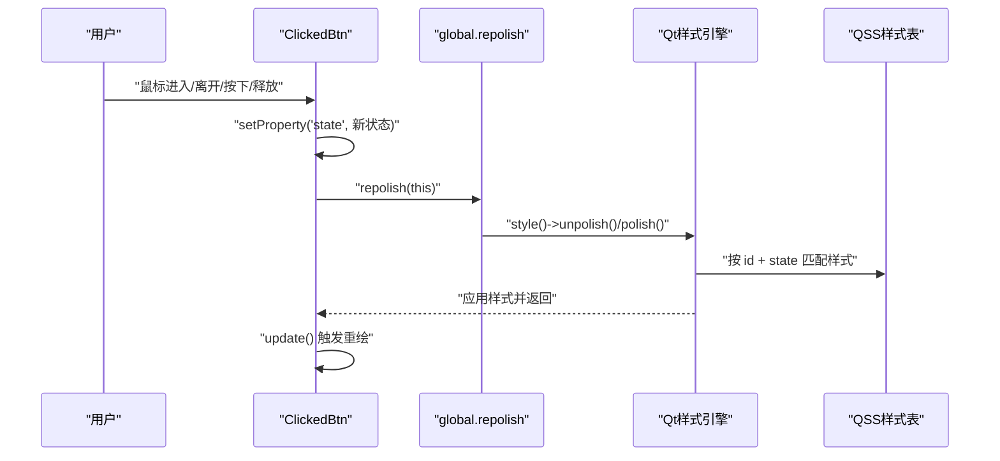
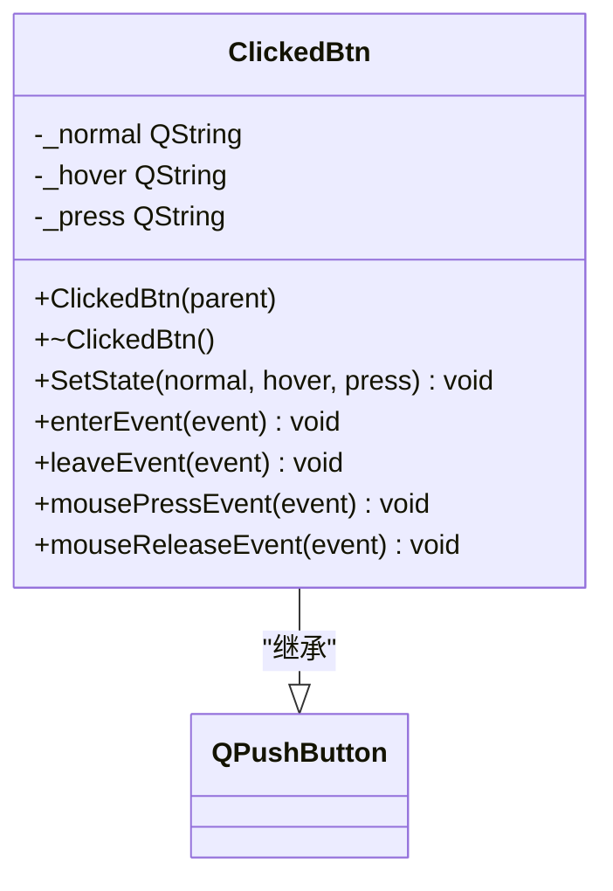
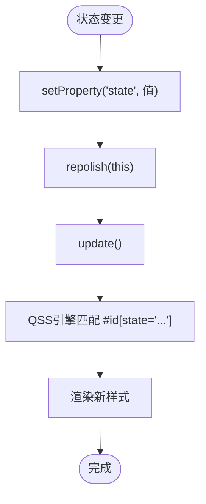
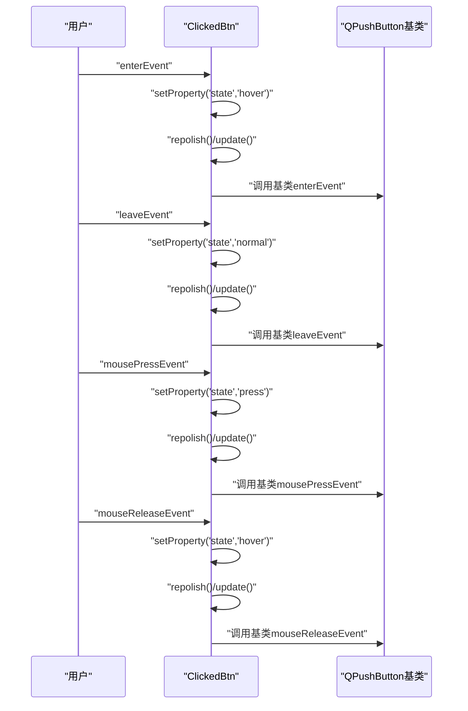
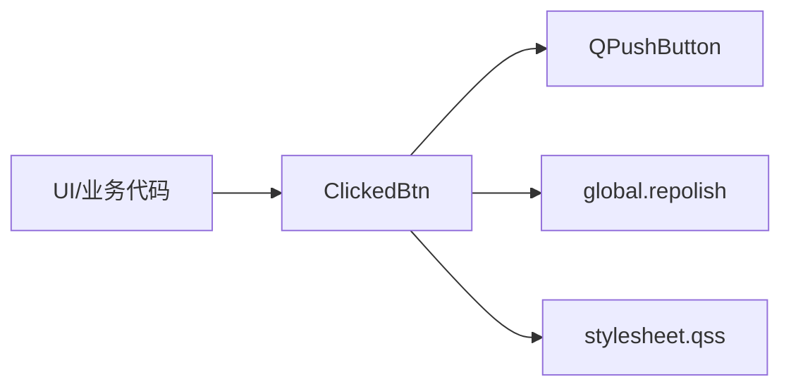

# ClickedBtn按钮控件

<cite>
**本文引用的文件**   
- [clickedbtn.h](file://client/llfcchat/include/clickedbtn.h)
- [clickedbtn.cpp](file://client/llfcchat/src/clickedbtn.cpp)
- [global.h](file://client/llfcchat/include/global.h)
- [global.cpp](file://client/llfcchat/src/global.cpp)
- [stylesheet.qss](file://client/llfcchat/resources/style/stylesheet.qss)
- [applyfrienditem.cpp](file://client/llfcchat/src/applyfrienditem.cpp)
- [chatpage.cpp](file://client/llfcchat/src/chatpage.cpp)
</cite>

## 目录
1. [简介](#简介)
2. [项目结构](#项目结构)
3. [核心组件](#核心组件)
4. [架构总览](#架构总览)
5. [详细组件分析](#详细组件分析)
6. [依赖关系分析](#依赖关系分析)
7. [性能考量](#性能考量)
8. [故障排查指南](#故障排查指南)
9. [结论](#结论)
10. [附录：使用示例与最佳实践](#附录使用示例与最佳实践)

## 简介
ClickedBtn 是 QPushButton 的扩展类，用于在聊天客户端中提供统一的点击交互与视觉反馈。其核心思路是通过 Qt 的属性系统（state）驱动样式表（QSS），在鼠标进入、离开、按下、释放等事件时切换状态，从而触发不同的外观表现。该实现简洁高效，便于统一主题与跨平台一致性。

## 项目结构
本控件位于客户端 UI 层，相关文件分布如下：
- 头文件：include/clickedbtn.h
- 实现文件：src/clickedbtn.cpp
- 样式刷新工具：include/global.h, src/global.cpp
- 样式资源：resources/style/stylesheet.qss
- 使用示例：src/applyfrienditem.cpp, src/chatpage.cpp

**图表来源** 
- [clickedbtn.h:1-24](file://client/llfcchat/include/clickedbtn.h#L1-L24)
- [clickedbtn.cpp:1-58](file://client/llfcchat/src/clickedbtn.cpp#L1-L58)
- [global.cpp:1-10](file://client/llfcchat/src/global.cpp#L1-L10)
- [stylesheet.qss:190-236](file://client/llfcchat/resources/style/stylesheet.qss#L190-L236)
- [applyfrienditem.cpp:1-15](file://client/llfcchat/src/applyfrienditem.cpp#L1-L15)
- [chatpage.cpp:20-31](file://client/llfcchat/src/chatpage.cpp#L20-L31)

**章节来源**
- [clickedbtn.h:1-24](file://client/llfcchat/include/clickedbtn.h#L1-L24)
- [clickedbtn.cpp:1-58](file://client/llfcchat/src/clickedbtn.cpp#L1-L58)
- [global.h:27-31](file://client/llfcchat/include/global.h#L27-L31)
- [global.cpp:7-10](file://client/llfcchat/src/global.cpp#L7-L10)
- [stylesheet.qss:190-236](file://client/llfcchat/resources/style/stylesheet.qss#L190-L236)
- [applyfrienditem.cpp:1-15](file://client/llfcchat/src/applyfrienditem.cpp#L1-L15)
- [chatpage.cpp:20-31](file://client/llfcchat/src/chatpage.cpp#L20-L31)

## 核心组件
- ClickedBtn：继承自 QPushButton，重写鼠标与焦点相关事件，维护 normal/hover/press 三种状态字符串，并通过 setProperty("state", ...) 驱动 QSS。
- repolish：全局函数指针，封装 style()->unpolish/polish 以即时刷新样式。
- stylesheet.qss：通过 #id[state='...'] 选择器为不同状态的按钮定义背景、颜色、圆角或边框图片。

关键特性：
- 点击事件：继承 QPushButton 的 clicked 信号，可直接 connect 业务逻辑。
- 状态管理：enterEvent/leaveEvent/mousePressEvent/mouseReleaseEvent 分别切换 state 值。
- 视觉效果：基于 QSS 的 state 属性匹配，支持背景色、字体、圆角、border-image 等多种样式。
- 可配置性：SetState(normal, hover, press) 允许外部传入三态字符串，配合对象名与 QSS 完成定制。

**章节来源**
- [clickedbtn.h:5-21](file://client/llfcchat/include/clickedbtn.h#L5-L21)
- [clickedbtn.cpp:6-25](file://client/llfcchat/src/clickedbtn.cpp#L6-L25)
- [global.h:27-31](file://client/llfcchat/include/global.h#L27-L31)
- [global.cpp:7-10](file://client/llfcchat/src/global.cpp#L7-L10)
- [stylesheet.qss:190-236](file://client/llfcchat/resources/style/stylesheet.qss#L190-L236)

## 架构总览
ClickedBtn 的工作流围绕“事件 -> 状态 -> 样式”展开：
- 用户交互触发事件（进入、离开、按下、释放）。
- 事件处理器更新内部状态字符串并调用 setProperty("state", value)。
- 调用 repolish(this) 强制样式重新计算，update() 触发重绘。
- QSS 引擎根据 id 和 state 属性匹配对应样式规则，渲染最终外观。

**图表来源** 
- [clickedbtn.cpp:27-57](file://client/llfcchat/src/clickedbtn.cpp#L27-L57)
- [global.cpp:7-10](file://client/llfcchat/src/global.cpp#L7-L10)
- [stylesheet.qss:190-236](file://client/llfcchat/resources/style/stylesheet.qss#L190-L236)

## 详细组件分析

### ClickedBtn 类设计与行为
- 构造函数：设置光标为手型、禁用焦点策略，提升交互体验。
- SetState：保存三态字符串，设置初始 state，并刷新样式。
- enterEvent/leaveEvent：切换 hover/normal 状态。
- mousePressEvent/mouseReleaseEvent：切换 press/hover 状态。
- 所有状态变更均调用 repolish 与 update，确保即时视觉反馈。

**图表来源** 
- [clickedbtn.h:5-21](file://client/llfcchat/include/clickedbtn.h#L5-L21)
- [clickedbtn.cpp:6-57](file://client/llfcchat/src/clickedbtn.cpp#L6-L57)

**章节来源**
- [clickedbtn.h:5-21](file://client/llfcchat/include/clickedbtn.h#L5-L21)
- [clickedbtn.cpp:6-57](file://client/llfcchat/src/clickedbtn.cpp#L6-L57)

### 样式系统与状态映射
- 通过 setProperty("state", ...) 将当前状态写入对象属性。
- QSS 使用 #id[state='...'] 精确匹配，例如 #send_btn[state='normal']。
- 支持多种样式属性：background、color、font-size、border-radius、border-image 等。
- 同一按钮可在不同界面使用不同 id，复用相同状态语义。

**图表来源** 
- [clickedbtn.cpp:17-25](file://client/llfcchat/src/clickedbtn.cpp#L17-L25)
- [stylesheet.qss:190-236](file://client/llfcchat/resources/style/stylesheet.qss#L190-L236)

**章节来源**
- [clickedbtn.cpp:17-25](file://client/llfcchat/src/clickedbtn.cpp#L17-L25)
- [stylesheet.qss:190-236](file://client/llfcchat/resources/style/stylesheet.qss#L190-L236)

### 事件处理流程
- 鼠标进入：切换到 hover 状态，刷新样式。
- 鼠标离开：恢复到 normal 状态，刷新样式。
- 鼠标按下：切换到 press 状态，刷新样式。
- 鼠标释放：回到 hover 状态，刷新样式。
- 以上流程保证一致的视觉反馈，且不影响 QPushButton 默认行为。

**图表来源** 
- [clickedbtn.cpp:27-57](file://client/llfcchat/src/clickedbtn.cpp#L27-L57)

**章节来源**
- [clickedbtn.cpp:27-57](file://client/llfcchat/src/clickedbtn.cpp#L27-L57)

### 使用示例与集成方式
- 在 UI 文件中声明 customwidget 指向 ClickedBtn。
- 在构造阶段调用 SetState("normal","hover","press") 初始化三态。
- 通过 objectName 指定 id，并在 stylesheet.qss 中编写对应样式。
- 连接 clicked 信号到业务逻辑。

参考路径：
- [applyfrienditem.cpp:1-15](file://client/llfcchat/src/applyfrienditem.cpp#L1-L15)
- [chatpage.cpp:20-31](file://client/llfcchat/src/chatpage.cpp#L20-L31)
- [stylesheet.qss:190-236](file://client/llfcchat/resources/style/stylesheet.qss#L190-L236)

**章节来源**
- [applyfrienditem.cpp:1-15](file://client/llfcchat/src/applyfrienditem.cpp#L1-L15)
- [chatpage.cpp:20-31](file://client/llfcchat/src/chatpage.cpp#L20-L31)
- [stylesheet.qss:190-236](file://client/llfcchat/resources/style/stylesheet.qss#L190-L236)

## 依赖关系分析
- ClickedBtn 依赖 QPushButton 的事件机制与信号槽。
- 样式刷新依赖 global.repolish，后者封装 Qt 样式系统的 unpolish/polish。
- 外观由 stylesheet.qss 控制，通过 id 与 state 属性匹配。
- 使用方通过 objectName 指定 id，并调用 SetState 初始化。

**图表来源** 
- [clickedbtn.cpp:1-10](file://client/llfcchat/src/clickedbtn.cpp#L1-L10)
- [global.cpp:7-10](file://client/llfcchat/src/global.cpp#L7-L10)
- [stylesheet.qss:190-236](file://client/llfcchat/resources/style/stylesheet.qss#L190-L236)

**章节来源**
- [clickedbtn.cpp:1-10](file://client/llfcchat/src/clickedbtn.cpp#L1-L10)
- [global.cpp:7-10](file://client/llfcchat/src/global.cpp#L7-L10)
- [stylesheet.qss:190-236](file://client/llfcchat/resources/style/stylesheet.qss#L190-L236)

## 性能考量
- 每次状态变更都会调用 repolish 与 update，频繁操作可能带来额外开销。建议在批量状态更新后统一刷新。
- QSS 匹配基于 id 与 state，避免过多复杂选择器以提升渲染效率。
- 使用 border-image 时注意图片尺寸与缓存，避免重复加载大图。
- 禁用焦点策略减少不必要的焦点绘制与键盘导航开销。

[本节为通用指导，不直接分析具体文件]

## 故障排查指南
- 样式未生效：检查 objectName 是否与 QSS 中的 #id 一致；确认 SetState 已调用；确保 stylesheet.qss 被正确加载。
- 状态切换异常：确认事件覆盖顺序是否正确；检查是否误覆盖了父类事件而未调用基类实现。
- 闪烁或卡顿：减少不必要的 repolish/update 调用；合并多次状态变更后再刷新。
- 跨平台差异：不同平台的样式引擎对某些属性支持略有差异，建议优先使用 background/color/font/border-radius 等通用属性。

**章节来源**
- [clickedbtn.cpp:27-57](file://client/llfcchat/src/clickedbtn.cpp#L27-L57)
- [global.cpp:7-10](file://client/llfcchat/src/global.cpp#L7-L10)
- [stylesheet.qss:190-236](file://client/llfcchat/resources/style/stylesheet.qss#L190-L236)

## 结论
ClickedBtn 通过轻量级的状态管理与 QSS 驱动，实现了统一的按钮交互与视觉反馈。其设计简洁、可扩展性强，适合在大型 UI 系统中作为标准按钮组件使用。结合合理的样式规范与性能优化策略，可获得稳定一致的跨平台用户体验。

[本节为总结，不直接分析具体文件]

## 附录：使用示例与最佳实践

### 创建自定义按钮
- 在 UI 文件中声明 customwidget 指向 ClickedBtn。
- 在构造阶段设置 objectName 与 SetState。
- 在 stylesheet.qss 中为对应 id 定义 normal/hover/press 样式。

参考路径：
- [applyfrienditem.cpp:1-15](file://client/llfcchat/src/applyfrienditem.cpp#L1-L15)
- [chatpage.cpp:20-31](file://client/llfcchat/src/chatpage.cpp#L20-L31)
- [stylesheet.qss:190-236](file://client/llfcchat/resources/style/stylesheet.qss#L190-L236)

### 处理点击事件
- 使用 connect 将 ClickedBtn::clicked 连接到业务槽函数。
- 在槽函数中执行网络请求、页面跳转或数据更新等操作。

参考路径：
- [applyfrienditem.cpp:12-14](file://client/llfcchat/src/applyfrienditem.cpp#L12-L14)

### 实现动画效果
- 方案一：在 stylesheet.qss 中使用 transition 属性（若目标平台支持）实现平滑过渡。
- 方案二：在事件处理器中插入 QPropertyAnimation 对 opacity、scale 等属性进行动画。
- 方案三：使用多帧图片作为 border-image，配合状态切换呈现简单动效。

[本节为概念性指导，不直接分析具体文件]

### 生命周期管理与内存优化
- ClickedBtn 继承自 QWidget，遵循 Qt 父子对象自动销毁机制。
- 避免在高频事件中动态创建/销毁大量临时对象。
- 合理设置 parent，确保 UI 层级清晰与资源释放可靠。

[本节为通用指导，不直接分析具体文件]

### 跨平台兼容性
- 优先使用通用 CSS 属性（background、color、font、border-radius）。
- 谨慎使用 border-image，确保在不同平台上的缩放与对齐一致。
- 测试各平台下的焦点与键盘导航行为，必要时调整 focusPolicy。

[本节为通用指导，不直接分析具体文件]

### 主题设计与用户体验优化
- 保持三态对比度足够，确保 hover/press 有明显反馈。
- 统一字体、字号、圆角与间距，形成一致的设计语言。
- 避免过度装饰，确保信息可读性与操作可达性。

[本节为通用指导，不直接分析具体文件]