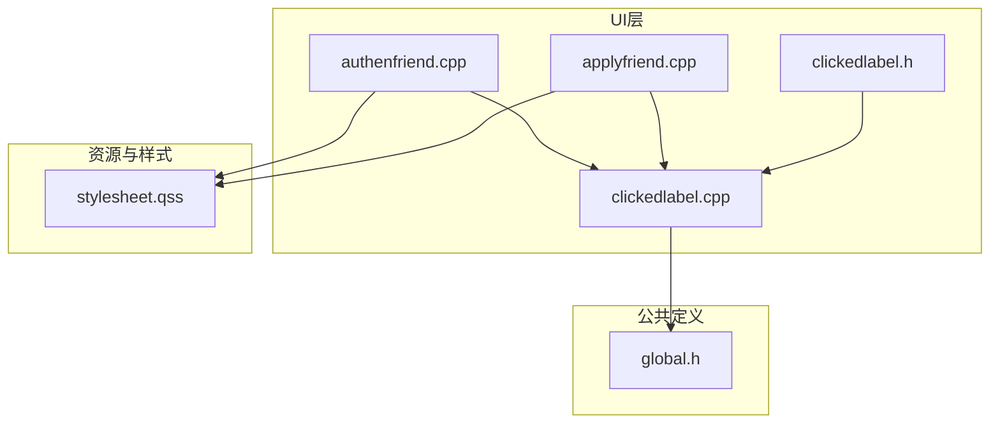
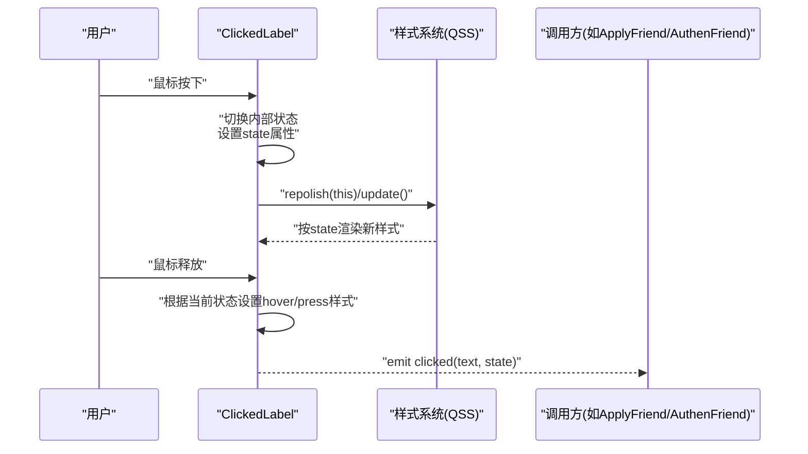
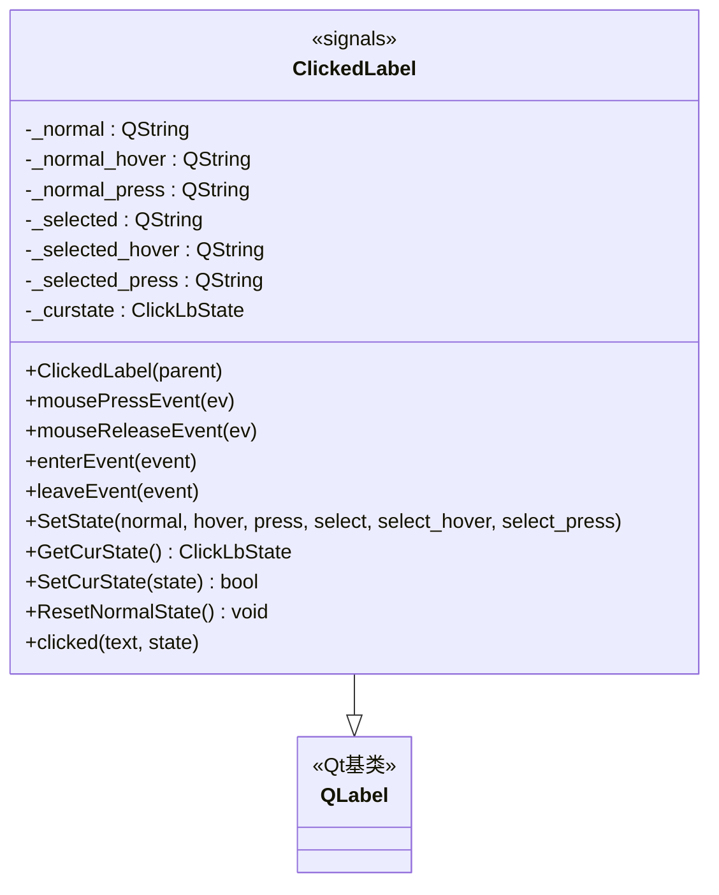
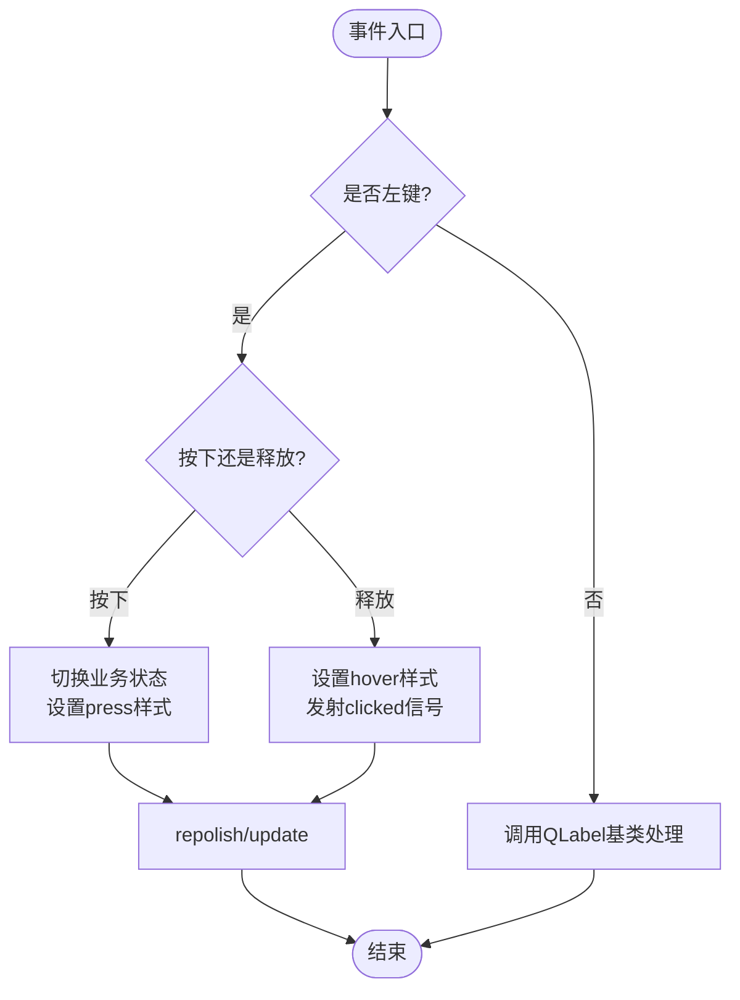
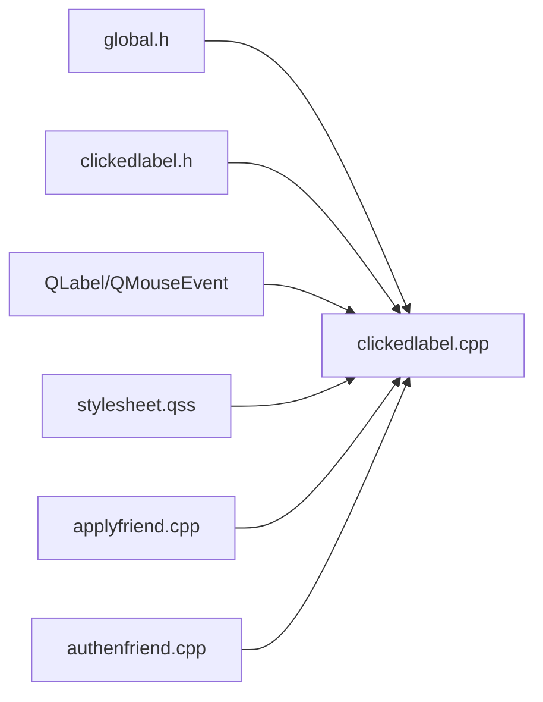

# ClickedLabel标签控件

<cite>
**本文引用的文件**   
- [clickedlabel.h](file://client/llfcchat/include/clickedlabel.h)
- [clickedlabel.cpp](file://client/llfcchat/src/clickedlabel.cpp)
- [global.h](file://client/llfcchat/include/global.h)
- [applyfriend.cpp](file://client/llfcchat/src/applyfriend.cpp)
- [authenfriend.cpp](file://client/llfcchat/src/authenfriend.cpp)
- [stylesheet.qss](file://client/llfcchat/resources/style/stylesheet.qss)
</cite>

## 目录
1. [简介](#简介)
2. [项目结构](#项目结构)
3. [核心组件](#核心组件)
4. [架构总览](#架构总览)
5. [详细组件分析](#详细组件分析)
6. [依赖关系分析](#依赖关系分析)
7. [性能考虑](#性能考虑)
8. [故障排查指南](#故障排查指南)
9. [结论](#结论)
10. [附录：使用示例与最佳实践](#附录使用示例与最佳实践)

## 简介
ClickedLabel 是 QLabel 的扩展类，用于实现“可点击、带状态切换”的标签控件。它通过重写鼠标事件（按下、释放、进入、离开）并结合 Qt 的属性机制（setProperty）与样式表（QSS），为标签提供丰富的视觉反馈和交互体验。该控件支持普通态与选中态两种业务状态，每种状态下又包含悬停与按下等视觉状态，从而形成六种外观组合。

## 项目结构
本控件位于客户端 UI 层，头文件在 include 目录，实现文件在 src 目录；样式定义在 resources/style/stylesheet.qss；全局枚举 ClickLbState 定义在 global.h；实际使用场景包括好友申请与认证界面中的标签选择。

图表来源
- [clickedlabel.h:1-39](file://client/llfcchat/include/clickedlabel.h#L1-L39)
- [clickedlabel.cpp:1-133](file://client/llfcchat/src/clickedlabel.cpp#L1-L133)
- [global.h:113-116](file://client/llfcchat/include/global.h#L113-L116)
- [applyfriend.cpp:60-90](file://client/llfcchat/src/applyfriend.cpp#L60-L90)
- [authenfriend.cpp:60-90](file://client/llfcchat/src/authenfriend.cpp#L60-L90)
- [stylesheet.qss:481-521](file://client/llfcchat/resources/style/stylesheet.qss#L481-L521)

章节来源
- [clickedlabel.h:1-39](file://client/llfcchat/include/clickedlabel.h#L1-L39)
- [clickedlabel.cpp:1-133](file://client/llfcchat/src/clickedlabel.cpp#L1-L133)
- [global.h:113-116](file://client/llfcchat/include/global.h#L113-L116)
- [applyfriend.cpp:60-90](file://client/llfcchat/src/applyfriend.cpp#L60-L90)
- [authenfriend.cpp:60-90](file://client/llfcchat/src/authenfriend.cpp#L60-L90)
- [stylesheet.qss:481-521](file://client/llfcchat/resources/style/stylesheet.qss#L481-L521)

## 核心组件
- ClickedLabel：继承自 QLabel，封装了点击、悬停、按下等交互逻辑，并通过信号向外部暴露用户操作。
- ClickLbState：全局枚举，表示标签的业务状态（普通/选中）。
- repolish：全局函数指针，用于根据属性刷新 QSS 样式。
- stylesheet.qss：样式表，基于 state 属性值控制不同状态的背景图或颜色。

章节来源
- [clickedlabel.h:1-39](file://client/llfcchat/include/clickedlabel.h#L1-L39)
- [clickedlabel.cpp:1-133](file://client/llfcchat/src/clickedlabel.cpp#L1-L133)
- [global.h:113-116](file://client/llfcchat/include/global.h#L113-L116)
- [global.h:27-31](file://client/llfcchat/include/global.h#L27-L31)
- [stylesheet.qss:481-521](file://client/llfcchat/resources/style/stylesheet.qss#L481-L521)

## 架构总览
ClickedLabel 的核心流程围绕“鼠标事件 → 状态切换 → 属性更新 → 样式重绘 → 信号发射”展开。其对外暴露 clicked 信号，携带文本与当前状态，供上层业务处理。

图表来源
- [clickedlabel.cpp:10-52](file://client/llfcchat/src/clickedlabel.cpp#L10-L52)
- [clickedlabel.cpp:54-89](file://client/llfcchat/src/clickedlabel.cpp#L54-L89)
- [clickedlabel.cpp:91-104](file://client/llfcchat/src/clickedlabel.cpp#L91-L104)
- [global.h:27-31](file://client/llfcchat/include/global.h#L27-L31)

## 详细组件分析

### 类结构与职责
- 构造函数：初始化默认状态为 Normal，并设置鼠标指针为手型，增强可点击提示。
- 鼠标事件：
  - mousePressEvent：左键按下时切换业务状态（Normal ↔ Selected），并设置对应 press 样式。
  - mouseReleaseEvent：左键释放时恢复 hover 样式，并触发 clicked 信号。
  - enterEvent/leaveEvent：鼠标进入/离开时分别设置 hover/normal 或 selected_hover/selected 样式。
- 状态管理：
  - SetState：配置六种子状态对应的样式名，并设置初始 state。
  - GetCurState/SetCurState：获取/设置业务状态，自动同步样式。
  - ResetNormalState：重置为 Normal 并恢复 normal 样式。
- 信号：
  - clicked(QString, ClickLbState)：携带标签文本与当前状态，便于上层区分来源与行为。

图表来源
- [clickedlabel.h:6-36](file://client/llfcchat/include/clickedlabel.h#L6-L36)
- [clickedlabel.cpp:3-6](file://client/llfcchat/src/clickedlabel.cpp#L3-L6)

章节来源
- [clickedlabel.h:1-39](file://client/llfcchat/include/clickedlabel.h#L1-L39)
- [clickedlabel.cpp:1-133](file://client/llfcchat/src/clickedlabel.cpp#L1-L133)

### 状态机与样式映射
ClickedLabel 将“业务状态 × 交互状态”映射到六个样式名：
- 普通态：normal / hover / press
- 选中态：selected / selected_hover / selected_press

当鼠标进入/离开/按下/释放时，控件会设置不同的 state 属性值，并由样式表匹配相应样式。

图表来源
- [clickedlabel.cpp:10-52](file://client/llfcchat/src/clickedlabel.cpp#L10-L52)
- [clickedlabel.cpp:54-89](file://client/llfcchat/src/clickedlabel.cpp#L54-L89)

章节来源
- [clickedlabel.cpp:10-52](file://client/llfcchat/src/clickedlabel.cpp#L10-L52)
- [clickedlabel.cpp:54-89](file://client/llfcchat/src/clickedlabel.cpp#L54-L89)

### 样式定制方法
- 通过 SetState 指定六个样式名，并在样式表中以 #objectName[state='...'] 的形式定义具体样式（背景图、颜色、圆角等）。
- 典型用法：
  - 创建 ClickedLabel 实例后调用 SetState("normal","hover","pressed","selected_normal","selected_hover","selected_pressed")。
  - 设置 objectName 为统一名称（如 tipslb），以便样式表集中管理。
  - 在 stylesheet.qss 中为不同 state 值定义样式。

章节来源
- [applyfriend.cpp:62-68](file://client/llfcchat/src/applyfriend.cpp#L62-L68)
- [authenfriend.cpp:62-67](file://client/llfcchat/src/authenfriend.cpp#L62-L67)
- [stylesheet.qss:481-521](file://client/llfcchat/resources/style/stylesheet.qss#L481-L521)

### 事件过滤机制与布局适配
- 事件过滤：ClickedLabel 自身重写鼠标事件完成交互；上层可使用 eventFilter 对滚动区域等容器进行滚动条显隐等辅助处理（非 ClickedLabel 内部逻辑，但常见于使用场景）。
- 布局适配：动态计算文本宽度与高度，自动换行与多行排列，保证标签在不同窗口尺寸下自适应。

章节来源
- [applyfriend.cpp:106-117](file://client/llfcchat/src/applyfriend.cpp#L106-L117)
- [applyfriend.cpp:129-198](file://client/llfcchat/src/applyfriend.cpp#L129-L198)
- [authenfriend.cpp:104-115](file://client/llfcchat/src/authenfriend.cpp#L104-L115)
- [authenfriend.cpp:123-192](file://client/llfcchat/src/authenfriend.cpp#L123-L192)

## 依赖关系分析
- ClickedLabel 依赖：
  - QLabel：基础显示与事件框架。
  - global.h：ClickLbState 枚举与 repolish 函数指针。
  - QMouseEvent/QEvent：鼠标与通用事件。
  - stylesheet.qss：样式表驱动的外观变化。
- 使用方依赖：
  - applyfriend.cpp、authenfriend.cpp：创建 ClickedLabel、设置样式名、连接 clicked 信号、动态布局。

图表来源
- [clickedlabel.cpp:1-6](file://client/llfcchat/src/clickedlabel.cpp#L1-L6)
- [global.h:113-116](file://client/llfcchat/include/global.h#L113-L116)
- [applyfriend.cpp:62-68](file://client/llfcchat/src/applyfriend.cpp#L62-L68)
- [authenfriend.cpp:62-67](file://client/llfcchat/src/authenfriend.cpp#L62-L67)
- [stylesheet.qss:481-521](file://client/llfcchat/resources/style/stylesheet.qss#L481-L521)

章节来源
- [clickedlabel.cpp:1-6](file://client/llfcchat/src/clickedlabel.cpp#L1-L6)
- [global.h:113-116](file://client/llfcchat/include/global.h#L113-L116)
- [applyfriend.cpp:62-68](file://client/llfcchat/src/applyfriend.cpp#L62-L68)
- [authenfriend.cpp:62-67](file://client/llfcchat/src/authenfriend.cpp#L62-L67)
- [stylesheet.qss:481-521](file://client/llfcchat/resources/style/stylesheet.qss#L481-L521)

## 性能考虑
- 样式刷新：每次状态变化都会调用 repolish 与 update，频繁触发可能导致重绘开销。建议在批量状态变更时合并更新，或在必要时延迟刷新。
- 事件处理：仅对左键进行处理，其他按键直接交由基类处理，减少分支判断成本。
- 文本测量：动态布局中使用 QFontMetrics 计算宽高，建议缓存字体度量结果，避免重复计算。
- 资源管理：动态创建的 ClickedLabel 需确保父对象正确设置，避免内存泄漏；在界面销毁时由 Qt 父子关系自动回收。

[本节为通用指导，不直接分析具体文件]

## 故障排查指南
- 样式不生效：
  - 检查是否设置了正确的 objectName，并确保样式表中有对应的 state 规则。
  - 确认 repolish 已正确指向样式刷新函数。
- 点击无响应：
  - 确认鼠标事件未被父控件拦截；必要时检查 eventFilter 逻辑。
  - 检查 clicked 信号是否正确连接到处理槽。
- 状态异常：
  - 检查 SetCurState/ResetNormalState 的调用时机，确保与用户交互一致。
  - 确认 SetState 传入的六个样式名与样式表一致。

章节来源
- [applyfriend.cpp:106-117](file://client/llfcchat/src/applyfriend.cpp#L106-L117)
- [authenfriend.cpp:104-115](file://client/llfcchat/src/authenfriend.cpp#L104-L115)
- [clickedlabel.cpp:110-130](file://client/llfcchat/src/clickedlabel.cpp#L110-L130)

## 结论
ClickedLabel 通过简洁的状态管理与 Qt 属性机制，实现了高内聚、低耦合的可点击标签控件。它在聊天应用中广泛用于标签选择与状态切换，具备良好的可扩展性与样式定制能力。配合合理的布局与性能优化策略，可在复杂界面中稳定运行。

[本节为总结性内容，不直接分析具体文件]

## 附录：使用示例与最佳实践

### 创建可点击标签
- 步骤：
  - 创建 ClickedLabel 实例，设置父对象。
  - 调用 SetState 配置六个样式名。
  - 设置 objectName 与文本。
  - 连接 clicked 信号到业务槽函数。
- 参考路径：
  - [应用示例1:62-68](file://client/llfcchat/src/applyfriend.cpp#L62-L68)
  - [应用示例2:62-67](file://client/llfcchat/src/authenfriend.cpp#L62-L67)

### 处理用户交互
- 在 clicked 槽中读取文本与状态，执行相应业务逻辑（如添加/移除标签、切换选中项）。
- 参考路径：
  - [信号连接与处理:68-68](file://client/llfcchat/src/applyfriend.cpp#L68-L68)
  - [信号连接与处理:67-67](file://client/llfcchat/src/authenfriend.cpp#L67-L67)

### 动态内容更新
- 根据窗口尺寸与文本长度动态计算位置，实现自动换行与多行排列。
- 参考路径：
  - [动态布局与重排:129-198](file://client/llfcchat/src/applyfriend.cpp#L129-L198)
  - [动态布局与重排:123-192](file://client/llfcchat/src/authenfriend.cpp#L123-L192)

### 样式定制方法
- 在 stylesheet.qss 中为 #tipslb[state='...'] 定义不同状态的样式（背景图、颜色、圆角等）。
- 参考路径：
  - [样式定义:481-521](file://client/llfcchat/resources/style/stylesheet.qss#L481-L521)

### 事件过滤机制
- 对滚动区域等容器使用 eventFilter 控制滚动条显隐，提升用户体验。
- 参考路径：
  - [事件过滤示例:106-117](file://client/llfcchat/src/applyfriend.cpp#L106-L117)
  - [事件过滤示例:104-115](file://client/llfcchat/src/authenfriend.cpp#L104-L115)

### 性能优化技巧
- 批量更新状态时合并 repolish/update 调用。
- 缓存 QFontMetrics 结果，避免重复测量。
- 合理设置父对象，利用 Qt 父子关系管理生命周期。

[本节为实践指导，不直接分析具体文件]