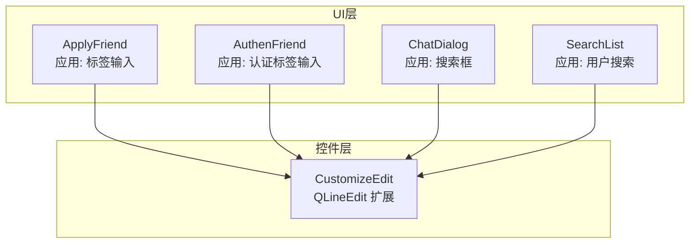
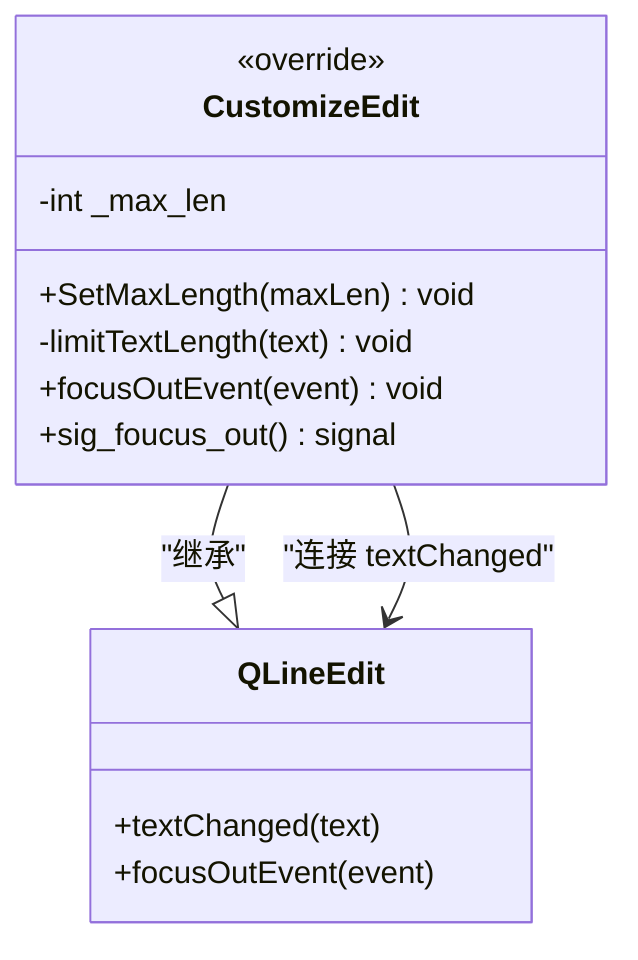
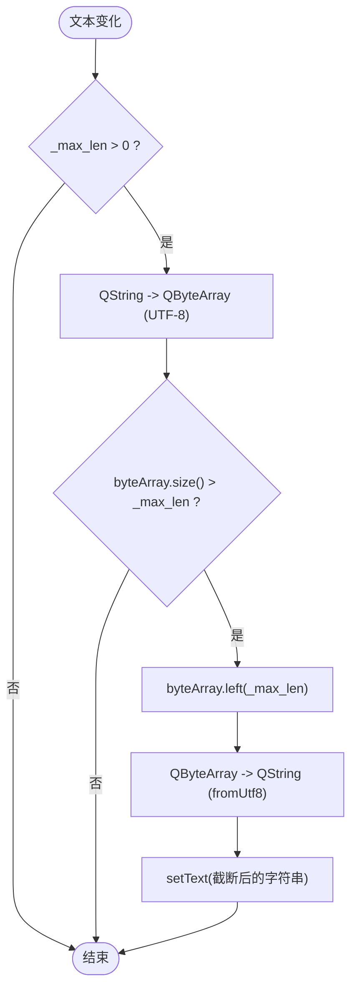
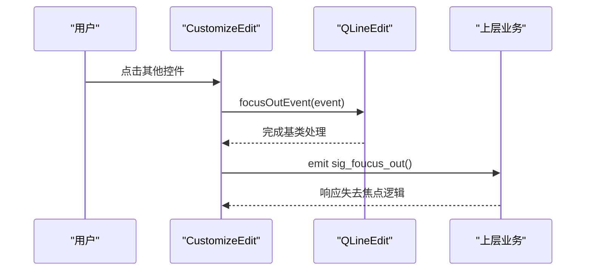
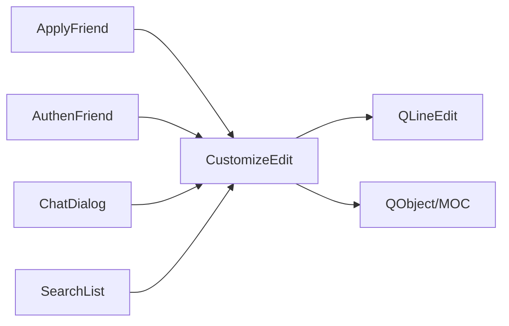

# CustomizeEdit控件

<cite>
**本文引用的文件**   
- [customizeedit.h](file://client/llfcchat/include/customizeedit.h)
- [customizeedit.cpp](file://client/llfcchat/src/customizeedit.cpp)
- [applyfriend.cpp](file://client/llfcchat/src/applyfriend.cpp)
- [authenfriend.cpp](file://client/llfcchat/src/authenfriend.cpp)
- [chatdialog.cpp](file://client/llfcchat/src/chatdialog.cpp)
- [searchlist.cpp](file://client/llfcchat/src/searchlist.cpp)
</cite>

## 目录
1. [简介](#简介)
2. [项目结构](#项目结构)
3. [核心组件](#核心组件)
4. [架构总览](#架构总览)
5. [详细组件分析](#详细组件分析)
6. [依赖关系分析](#依赖关系分析)
7. [性能与UTF-8处理](#性能与utf-8处理)
8. [故障排查指南](#故障排查指南)
9. [结论](#结论)
10. [附录：使用示例与最佳实践](#附录使用示例与最佳实践)

## 简介
CustomizeEdit 是 QLineEdit 的扩展类，用于在聊天客户端中提供统一的输入体验。其核心能力包括：
- 最大长度限制（按字节长度控制）
- 失去焦点事件处理并触发自定义信号
- UTF-8 字符编码的安全截断与还原

该控件被应用于好友申请、认证、搜索等界面中的编辑框，确保输入内容长度可控且跨平台行为一致。

## 项目结构
CustomizeEdit 的定义与实现分别位于 include 与 src 目录，UI 层通过 Qt Designer 生成的 UI 对象或动态创建后调用 SetMaxLength 设置长度限制，并通过信号槽机制接入业务逻辑。

图表来源
- [applyfriend.cpp:21-25](file://client/llfcchat/src/applyfriend.cpp#L21-L25)
- [authenfriend.cpp:21-24](file://client/llfcchat/src/authenfriend.cpp#L21-L24)
- [chatdialog.cpp:67-68](file://client/llfcchat/src/chatdialog.cpp#L67-L68)
- [searchlist.cpp:105-107](file://client/llfcchat/src/searchlist.cpp#L105-L107)

章节来源
- [customizeedit.h:1-42](file://client/llfcchat/include/customizeedit.h#L1-L42)
- [customizeedit.cpp:1-12](file://client/llfcchat/src/customizeedit.cpp#L1-L12)

## 核心组件
- 类名：CustomizeEdit
- 基类：QLineEdit
- 主要职责：
  - 维护最大字节长度 _max_len
  - 监听文本变化并在必要时进行 UTF-8 安全截断
  - 重写 focusOutEvent，触发 sig_foucus_out 信号

关键成员与方法：
- SetMaxLength(int maxLen)：设置最大字节长度
- limitTextLength(QString text)：私有方法，基于 UTF-8 字节长度限制文本
- focusOutEvent(QFocusEvent* event)：覆盖基类失去焦点事件，转发到基类并发送信号
- 信号：sig_foucus_out()：失去焦点时发出

章节来源
- [customizeedit.h:6-39](file://client/llfcchat/include/customizeedit.h#L6-L39)
- [customizeedit.cpp:3-11](file://client/llfcchat/src/customizeedit.cpp#L3-L11)

## 架构总览
CustomizeEdit 通过 Qt 的信号槽机制与 UI 层交互：
- 构造时连接 QLineEdit::textChanged 到内部 limitTextLength，实现实时长度限制
- 重写 focusOutEvent，先调用基类处理，再发射 sig_foucus_out 供上层订阅

图表来源
- [customizeedit.h:6-39](file://client/llfcchat/include/customizeedit.h#L6-L39)
- [customizeedit.cpp:3-6](file://client/llfcchat/src/customizeedit.cpp#L3-L6)

## 详细组件分析

### 最大长度限制与UTF-8处理机制
- 触发时机：每次文本变化（textChanged）都会进入 limitTextLength
- 判断条件：若 _max_len <= 0 则不限制
- 字节计算：将 QString 转为 QByteArray(toUtf8)，以字节长度为准进行 left(_max_len) 截断
- 结果回写：将截断后的 QByteArray 转回 QString(fromUtf8) 并 setText

图表来源
- [customizeedit.h:23-34](file://client/llfcchat/include/customizeedit.h#L23-L34)

章节来源
- [customizeedit.h:23-34](file://client/llfcchat/include/customizeedit.h#L23-L34)
- [customizeedit.cpp:3-6](file://client/llfcchat/src/customizeedit.cpp#L3-L6)

### 焦点事件处理与信号触发
- 覆盖 focusOutEvent：先调用 QLineEdit::focusOutEvent(event) 保证基类行为
- 随后 emit sig_foucus_out()，通知上层“失去焦点”
- 典型用途：收起键盘、关闭提示面板、执行校验等

图表来源
- [customizeedit.h:13-21](file://client/llfcchat/include/customizeedit.h#L13-L21)

章节来源
- [customizeedit.h:13-21](file://client/llfcchat/include/customizeedit.h#L13-L21)

### SetMaxLength工作原理
- 作用：设置 _max_len 为期望的最大字节长度
- 注意：该方法仅更新成员变量，实际限制由 limitTextLength 在文本变化时生效
- 建议：在控件初始化后立即调用，确保后续输入即受控

章节来源
- [customizeedit.cpp:8-11](file://client/llfcchat/src/customizeedit.cpp#L8-L11)

## 依赖关系分析
- 外部依赖：Qt 框架（QLineEdit、QDebug、QObject/MOC）
- 内部依赖：无其他自定义模块
- 耦合度：低，仅依赖 Qt 标准库；与 UI 层通过信号解耦

图表来源
- [customizeedit.h:1-6](file://client/llfcchat/include/customizeedit.h#L1-L6)
- [applyfriend.cpp:21-25](file://client/llfcchat/src/applyfriend.cpp#L21-L25)
- [authenfriend.cpp:21-24](file://client/llfcchat/src/authenfriend.cpp#L21-L24)
- [chatdialog.cpp:67-68](file://client/llfcchat/src/chatdialog.cpp#L67-L68)
- [searchlist.cpp:105-107](file://client/llfcchat/src/searchlist.cpp#L105-L107)

章节来源
- [customizeedit.h:1-6](file://client/llfcchat/include/customizeedit.h#L1-L6)

## 性能与UTF-8处理
- 时间复杂度：每次文本变化进行一次 toUtf8 转换与可能的 left 操作，近似 O(n)
- 空间开销：临时 QByteArray 占用与文本长度成正比
- 优化建议：
  - 仅在需要时启用限制（_max_len > 0）
  - 避免频繁 setText 导致的重绘，可在批量更新后统一刷新
- UTF-8必要性：
  - 保证多语言环境下字节长度与存储/传输一致
  - 防止因字符集不一致导致的乱码或截断错误

[本节为通用指导，不涉及具体文件分析]

## 故障排查指南
- 症状：输入中文被截断成乱码
  - 原因：直接按字符数限制而非字节数
  - 解决：使用本控件的 UTF-8 字节限制逻辑
- 症状：失去焦点未触发预期逻辑
  - 检查：是否连接了 sig_foucus_out 信号
  - 验证：focusOutEvent 是否正确调用基类并 emit 信号
- 症状：长度限制不生效
  - 检查：是否调用了 SetMaxLength 且值大于 0
  - 确认：textChanged 是否在构造时被连接到 limitTextLength

章节来源
- [customizeedit.h:13-21](file://client/llfcchat/include/customizeedit.h#L13-L21)
- [customizeedit.cpp:3-6](file://client/llfcchat/src/customizeedit.cpp#L3-L6)

## 结论
CustomizeEdit 以最小改动增强 QLineEdit 的输入控制能力，通过 UTF-8 字节级长度限制与焦点事件信号化，满足聊天客户端对输入体验的一致性与稳定性要求。其设计简洁、耦合度低，易于复用与维护。

[本节为总结性内容，不涉及具体文件分析]

## 附录：使用示例与最佳实践

### 基本用法
- 声明与创建：在 UI 文件中放置 QLineEdit，提升为 CustomizeEdit
- 设置最大长度：调用 SetMaxLength(期望字节长度)
- 处理失去焦点：连接 sig_foucus_out 到业务槽函数

章节来源
- [applyfriend.cpp:21-25](file://client/llfcchat/src/applyfriend.cpp#L21-L25)
- [authenfriend.cpp:21-24](file://client/llfcchat/src/authenfriend.cpp#L21-L24)
- [chatdialog.cpp:67-68](file://client/llfcchat/src/chatdialog.cpp#L67-L68)

### 集成到界面
- 在对话框构造函数中设置占位符、固定高度、位置等
- 连接 returnPressed、textChanged、editingFinished 等常用信号
- 在搜索场景中，获取文本并发送到服务器

章节来源
- [applyfriend.cpp:36-39](file://client/llfcchat/src/applyfriend.cpp#L36-L39)
- [authenfriend.cpp:35-38](file://client/llfcchat/src/authenfriend.cpp#L35-L38)
- [searchlist.cpp:105-117](file://client/llfcchat/src/searchlist.cpp#L105-L117)

### 常见场景
- 标签输入：限制标签名称字节长度，避免过长导致布局异常
- 认证信息：限制认证备注长度，保证消息体大小可控
- 搜索框：限制搜索关键词长度，减少无效请求

章节来源
- [applyfriend.cpp:21-25](file://client/llfcchat/src/applyfriend.cpp#L21-L25)
- [authenfriend.cpp:21-24](file://client/llfcchat/src/authenfriend.cpp#L21-L24)
- [chatdialog.cpp:67-68](file://client/llfcchat/src/chatdialog.cpp#L67-L68)

### 最佳实践
- 始终在初始化阶段调用 SetMaxLength，确保输入即刻受控
- 如需在失去焦点时执行校验或收起 UI，务必连接 sig_foucus_out
- 对于多语言输入，优先采用字节长度限制以保证一致性
- 避免在高频回调中进行复杂计算，保持 limitTextLength 轻量

[本节为通用指导，不涉及具体文件分析]