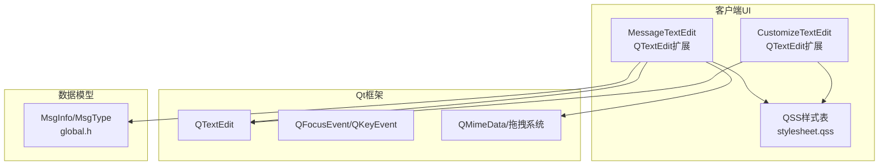
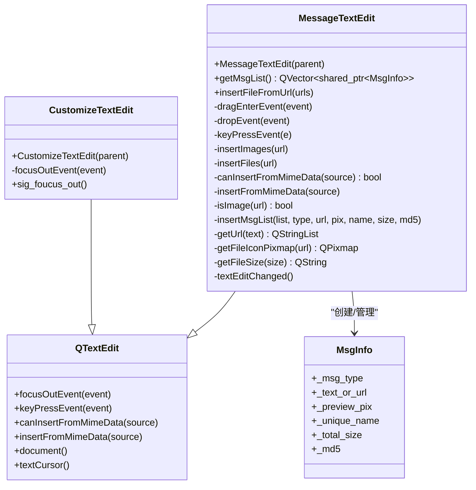
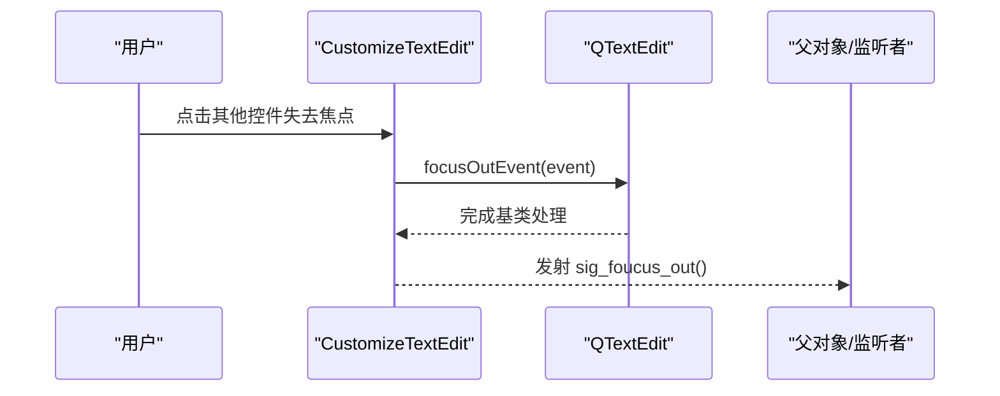
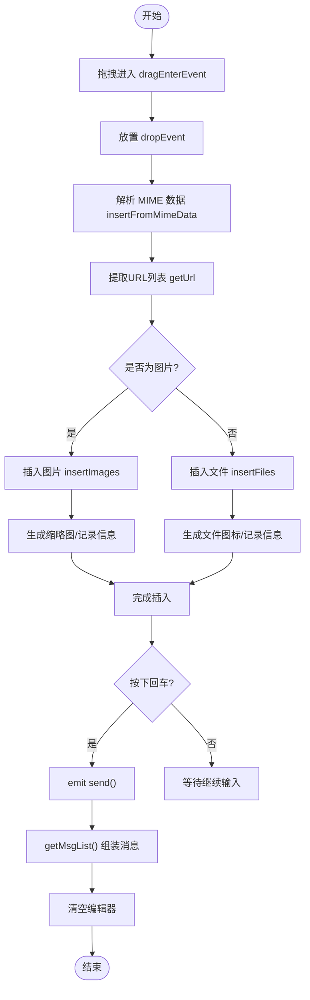
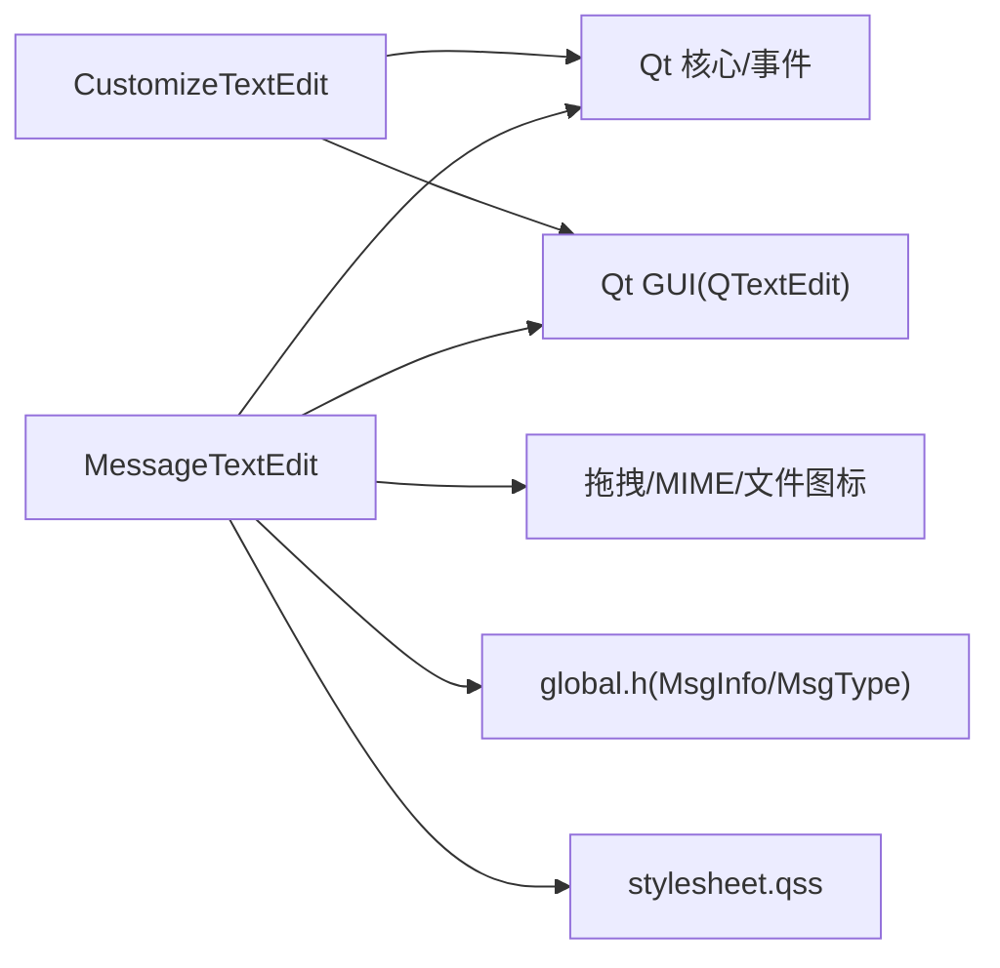

# CustomizeTextEdit控件

<cite>
**本文引用的文件**   
- [customizetextedit.h](file://client/llfcchat/include/customizetextedit.h)
- [customizetextedit.cpp](file://client/llfcchat/src/customizetextedit.cpp)
- [MessageTextEdit.h](file://client/llfcchat/include/MessageTextEdit.h)
- [MessageTextEdit.cpp](file://client/llfcchat/src/MessageTextEdit.cpp)
- [global.h](file://client/llfcchat/include/global.h)
- [stylesheet.qss](file://client/llfcchat/resources/style/stylesheet.qss)
</cite>

## 目录
1. [简介](#简介)
2. [项目结构](#项目结构)
3. [核心组件](#核心组件)
4. [架构总览](#架构总览)
5. [详细组件分析](#详细组件分析)
6. [依赖关系分析](#依赖关系分析)
7. [性能考虑](#性能考虑)
8. [故障排查指南](#故障排查指南)
9. [结论](#结论)
10. [附录：使用示例与样式定制](#附录使用示例与样式定制)

## 简介
CustomizeTextEdit 是基于 Qt QTextEdit 的轻量扩展，主要提供“失去焦点”时的信号通知能力。该控件在聊天输入场景中用于统一处理焦点变化事件，并通过 Qt 信号槽机制向外部暴露行为。与之配套的 MessageTextEdit 则实现了富文本编辑、拖拽插入图片/文件、发送键处理等更复杂的业务逻辑。两者共同构成聊天界面中“输入与格式化”的核心基础。

## 项目结构
- 自定义文本控件定义位于 include 目录，实现位于 src 目录。
- 样式通过 QSS 文件集中管理，便于主题切换与统一外观控制。
- 全局类型（消息类型、传输状态等）集中在 global.h，供各模块共享。

图表来源
- [customizetextedit.h:1-26](file://client/llfcchat/include/customizetaedit.h#L1-L26)
- [MessageTextEdit.h:1-62](file://client/llfcchat/include/MessageTextEdit.h#L1-L62)
- [global.h:135-208](file://client/llfcchat/include/global.h#L135-L208)
- [stylesheet.qss:164-170](file://client/llfcchat/resources/style/stylesheet.qss#L164-L170)

章节来源
- [customizetextedit.h:1-26](file://client/llfcchat/include/customizetextedit.h#L1-L26)
- [customizetextedit.cpp:1-7](file://client/llfcchat/src/customizetextedit.cpp#L1-L7)
- [MessageTextEdit.h:1-62](file://client/llfcchat/include/MessageTextEdit.h#L1-L62)
- [MessageTextEdit.cpp:1-319](file://client/llfcchat/src/MessageTextEdit.cpp#L1-L319)
- [global.h:135-208](file://client/llfcchat/include/global.h#L135-L208)
- [stylesheet.qss:164-170](file://client/llfcchat/resources/style/stylesheet.qss#L164-L170)

## 核心组件
- CustomizeTextEdit：继承自 QTextEdit，重写 focusOutEvent，在失去焦点时发射 sig_foucus_out 信号。
- MessageTextEdit：继承自 QTextEdit，实现拖拽插入图片/文件、发送键触发、富文本内容解析与清理等。
- MsgInfo/MsgType：消息数据结构与类型枚举，贯穿输入、预览、发送流程。

章节来源
- [customizetextedit.h:1-26](file://client/llfcchat/include/customizetextedit.h#L1-L26)
- [customizetextedit.cpp:1-7](file://client/llfcchat/src/customizetextedit.cpp#L1-L7)
- [MessageTextEdit.h:1-62](file://client/llfcchat/include/MessageTextEdit.h#L1-L62)
- [MessageTextEdit.cpp:1-319](file://client/llfcchat/src/MessageTextEdit.cpp#L1-L319)
- [global.h:135-208](file://client/llfcchat/include/global.h#L135-L208)

## 架构总览
CustomizeTextEdit 作为最基础的焦点事件封装，向上层提供统一的“失焦”信号；MessageTextEdit 在此基础上提供更丰富的输入与富文本处理能力。二者均基于 Qt 文本系统（QTextEdit/QTextDocument），通过事件与信号槽与 UI 交互。

图表来源
- [customizetextedit.h:1-26](file://client/llfcchat/include/customizetextedit.h#L1-L26)
- [MessageTextEdit.h:1-62](file://client/llfcchat/include/MessageTextEdit.h#L1-L62)
- [global.h:135-208](file://client/llfcchat/include/global.h#L135-L208)

## 详细组件分析

### CustomizeTextEdit 分析
- 功能要点
  - 继承 QTextEdit，保持原有文本编辑能力。
  - 重写 focusOutEvent，调用基类实现后发射 sig_foucus_out 信号。
- 适用场景
  - 需要监听输入框失去焦点以触发校验、收起工具栏或保存草稿等。
- 复杂度与性能
  - 事件处理为 O(1)，无额外内存分配，开销极小。
- 错误处理
  - 直接委托给基类处理焦点事件，避免破坏默认行为。

图表来源
- [customizetextedit.h:11-23](file://client/llfcchat/include/customizetextedit.h#L11-L23)

章节来源
- [customizetextedit.h:1-26](file://client/llfcchat/include/customizetextedit.h#L1-L26)
- [customizetextedit.cpp:1-7](file://client/llfcchat/src/customizetextedit.cpp#L1-L7)

### MessageTextEdit 分析
- 功能要点
  - 支持键盘 Enter/Return 触发发送信号。
  - 支持拖拽插入图片与文件，自动识别类型并生成缩略图/图标。
  - 维护 _img_or_file_list 与 _total_msg_list，最终 getMsgList() 将富文本中的占位符与附件信息合并为可发送的消息列表，并清空编辑器。
  - 对图片进行缩放限制，对文件大小进行上限检查，计算 MD5 用于去重/断点续传。
- 关键流程
  - 拖拽进入：dragEnterEvent 判断来源，accept 允许。
  - 放置处理：dropEvent -> insertFromMimeData -> getUrl -> 分类插入图片/文件。
  - 发送处理：keyPressEvent 捕获回车 -> emit send()。
  - 获取消息：getMsgList() 遍历文档文本，遇到替换字符时匹配附件列表，构建 MsgInfo 并返回。
- 复杂度与性能
  - getMsgList() 时间复杂度 O(n)（n 为文档字符数），附件匹配线性扫描，整体效率良好。
  - 图片缩放与图标绘制在插入时执行，避免重复计算。
- 错误处理
  - 文件夹拖拽拒绝、超大文件提示、MD5 计算失败警告。

图表来源
- [MessageTextEdit.cpp:69-91](file://client/llfcchat/src/MessageTextEdit.cpp#L69-L91)
- [MessageTextEdit.cpp:196-215](file://client/llfcchat/src/MessageTextEdit.cpp#L196-L215)
- [MessageTextEdit.cpp:106-155](file://client/llfcchat/src/MessageTextEdit.cpp#L106-L155)
- [MessageTextEdit.cpp:157-192](file://client/llfcchat/src/MessageTextEdit.cpp#L157-L192)
- [MessageTextEdit.cpp:229-236](file://client/llfcchat/src/MessageTextEdit.cpp#L229-L236)
- [MessageTextEdit.cpp:240-254](file://client/llfcchat/src/MessageTextEdit.cpp#L240-L254)
- [MessageTextEdit.cpp:256-290](file://client/llfcchat/src/MessageTextEdit.cpp#L256-L290)
- [MessageTextEdit.cpp:292-313](file://client/llfcchat/src/MessageTextEdit.cpp#L292-L313)
- [MessageTextEdit.cpp:22-67](file://client/llfcchat/src/MessageTextEdit.cpp#L22-L67)

章节来源
- [MessageTextEdit.h:1-62](file://client/llfcchat/include/MessageTextEdit.h#L1-L62)
- [MessageTextEdit.cpp:1-319](file://client/llfcchat/src/MessageTextEdit.cpp#L1-L319)
- [global.h:135-208](file://client/llfcchat/include/global.h#L135-L208)

### 与 Qt 文本系统的集成
- 使用 QTextDocument 的 toPlainText/toHtml 进行文本与富文本转换。
- 使用 QTextCursor 插入图片与资源。
- 使用 QChar::ObjectReplacementCharacter 作为占位符，关联附件信息。

章节来源
- [MessageTextEdit.cpp:22-67](file://client/llfcchat/src/MessageTextEdit.cpp#L22-L67)
- [MessageTextEdit.cpp:147-155](file://client/llfcchat/src/MessageTextEdit.cpp#L147-L155)
- [MessageTextEdit.cpp:184-192](file://client/llfcchat/src/MessageTextEdit.cpp#L184-L192)

## 依赖关系分析
- CustomizeTextEdit 仅依赖 Qt 文本系统与事件机制。
- MessageTextEdit 依赖 Qt 拖拽/MIME 系统、图像与文件系统接口，以及全局消息类型与数据结构。
- 样式通过 QSS 文件注入，不影响逻辑，但影响渲染表现。

图表来源
- [customizetextedit.h:1-26](file://client/llfcchat/include/customizetextedit.h#L1-L26)
- [MessageTextEdit.h:1-62](file://client/llfcchat/include/MessageTextEdit.h#L1-L62)
- [global.h:135-208](file://client/llfcchat/include/global.h#L135-L208)
- [stylesheet.qss:164-170](file://client/llfcchat/resources/style/stylesheet.qss#L164-L170)

章节来源
- [customizetextedit.h:1-26](file://client/llfcchat/include/customizetextedit.h#L1-L26)
- [MessageTextEdit.h:1-62](file://client/llfcchat/include/MessageTextEdit.h#L1-L62)
- [global.h:135-208](file://client/llfcchat/include/global.h#L135-L208)
- [stylesheet.qss:164-170](file://client/llfcchat/resources/style/stylesheet.qss#L164-L170)

## 性能考虑
- 大文本处理
  - getMsgList() 线性扫描文档文本，建议避免一次性插入超大量附件；必要时分页或延迟渲染。
- 图片处理
  - 插入前进行尺寸缩放，减少内存占用与渲染压力。
- 文件图标绘制
  - 仅在插入时绘制一次，避免重复计算。
- 内存管理
  - 发送后清空 _img_or_file_list 与编辑器内容，防止内存泄漏。
- 事件处理
  - 所有事件处理均为 O(1) 或 O(n) 且无深层递归，响应及时。

[本节为通用指导，不直接分析具体文件]

## 故障排查指南
- 无法接收失焦信号
  - 确认是否正确使用 QObject::connect 连接 sig_foucus_out 到相应槽函数。
- 拖拽无效
  - 检查 canInsertFromMimeData 与 insertFromMimeData 是否被正确调用；确保 MIME 数据包含 URL。
- 图片未显示
  - 检查 isImage 后缀判断与路径有效性；确认缩放阈值与资源加载成功。
- 发送键无效
  - 检查 keyPressEvent 中对 Enter/Return 的判断与修饰键条件。
- 样式不生效
  - 确认 QSS 文件已加载，目标控件 ID/class 匹配；必要时调用 repolish 刷新样式。

章节来源
- [customizetextedit.h:11-23](file://client/llfcchat/include/customizetextedit.h#L11-L23)
- [MessageTextEdit.cpp:83-91](file://client/llfcchat/src/MessageTextEdit.cpp#L83-L91)
- [MessageTextEdit.cpp:196-215](file://client/llfcchat/src/MessageTextEdit.cpp#L196-L215)
- [MessageTextEdit.cpp:217-227](file://client/llfcchat/src/MessageTextEdit.cpp#L217-L227)
- [stylesheet.qss:164-170](file://client/llfcchat/resources/style/stylesheet.qss#L164-L170)

## 结论
CustomizeTextEdit 提供了简洁可靠的焦点事件封装，适合在各类输入场景中复用；MessageTextEdit 则在富文本编辑、附件插入与发送流程上提供了完整实现。二者结合 Qt 文本系统与样式体系，能够高效支撑聊天界面的输入需求。对于更大规模的应用，建议在附件数量与图片尺寸上进行进一步的性能优化与缓存策略设计。

[本节为总结性内容，不直接分析具体文件]

## 附录：使用示例与样式定制
- 使用 CustomizeTextEdit
  - 构造实例并连接 sig_foucus_out 信号到所需槽函数，以实现失去焦点时的业务逻辑。
- 使用 MessageTextEdit
  - 设置最大高度与样式；连接 send 信号处理发送逻辑；调用 insertFileFromUrl 批量插入文件/图片；通过 getMsgList 获取待发送消息列表。
- 样式定制
  - 通过 stylesheet.qss 设置背景、边框、字体、滚动条等；可使用 #chatEdit 等选择器针对输入区域进行主题化。

章节来源
- [customizetextedit.h:1-26](file://client/llfcchat/include/customizetextedit.h#L1-L26)
- [MessageTextEdit.h:1-62](file://client/llfcchat/include/MessageTextEdit.h#L1-L62)
- [MessageTextEdit.cpp:6-15](file://client/llfcchat/src/MessageTextEdit.cpp#L6-L15)
- [MessageTextEdit.cpp:93-104](file://client/llfcchat/src/MessageTextEdit.cpp#L93-L104)
- [MessageTextEdit.cpp:22-67](file://client/llfcchat/src/MessageTextEdit.cpp#L22-L67)
- [stylesheet.qss:164-170](file://client/llfcchat/resources/style/stylesheet.qss#L164-L170)