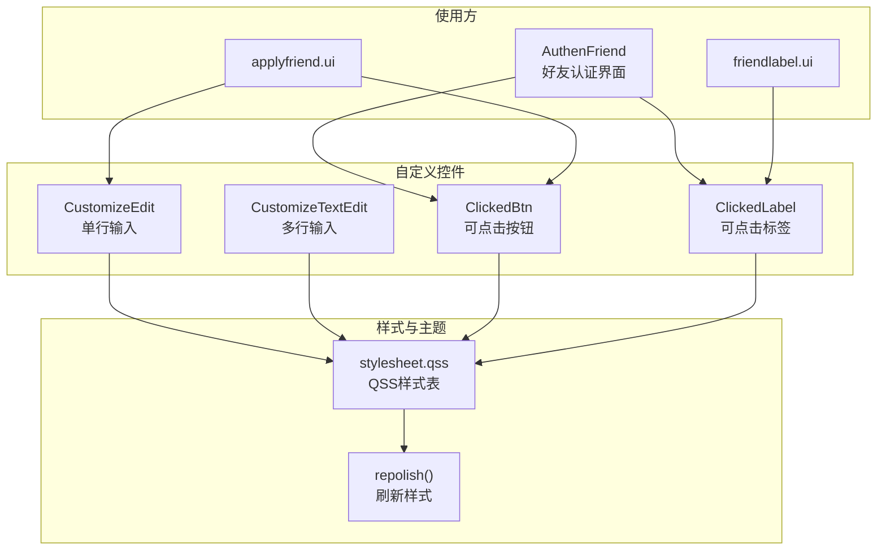
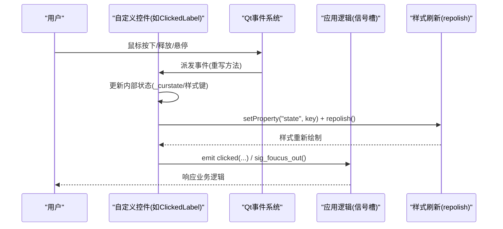
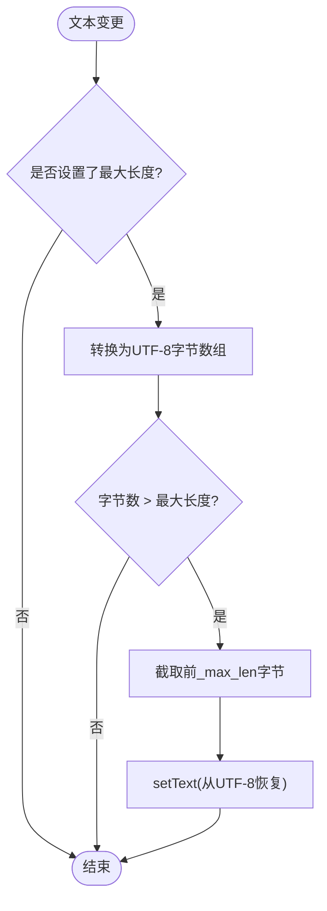
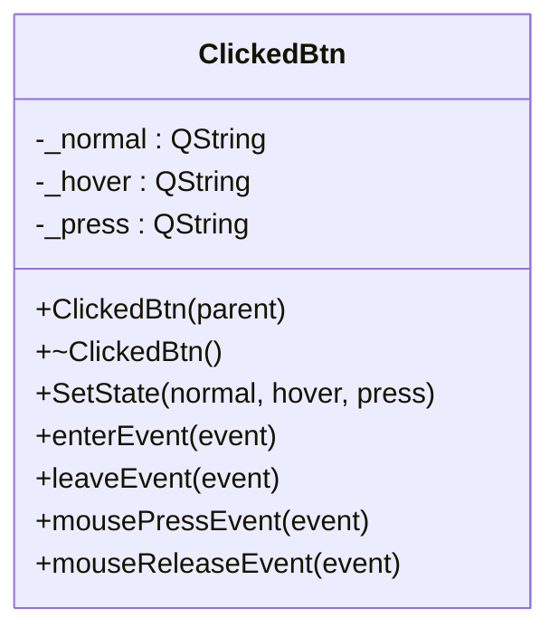
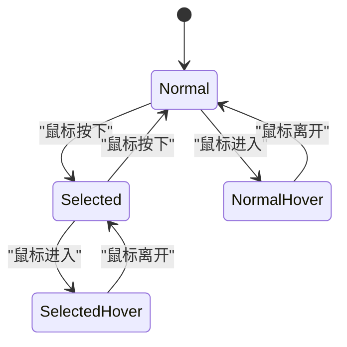
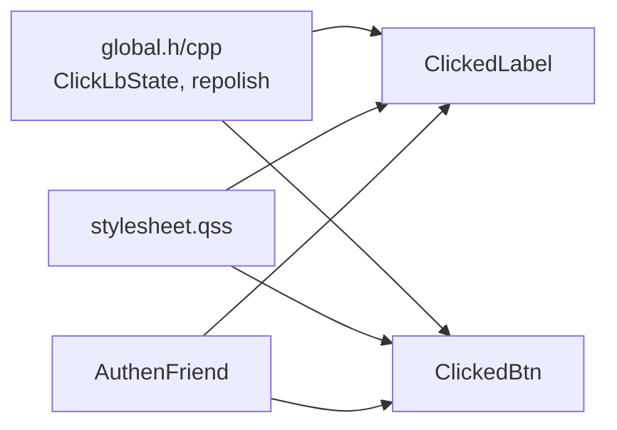

# 自定义控件

<cite>
**本文引用的文件**   
- [customizeedit.h](file://client/llfcchat/include/customizeedit.h)
- [customizetextedit.h](file://client/llfcchat/include/customizetextedit.h)
- [clickedbtn.h](file://client/llfcchat/include/clickedbtn.h)
- [clickedlabel.h](file://client/llfcchat/include/clickedlabel.h)
- [customizeedit.cpp](file://client/llfcchat/src/customizeedit.cpp)
- [customizetextedit.cpp](file://client/llfcchat/src/customizetextedit.cpp)
- [clickedbtn.cpp](file://client/llfcchat/src/clickedbtn.cpp)
- [clickedlabel.cpp](file://client/llfcchat/src/clickedlabel.cpp)
- [global.h](file://client/llfcchat/include/global.h)
- [global.cpp](file://client/llfcchat/src/global.cpp)
- [stylesheet.qss](file://client/llfcchat/resources/style/stylesheet.qss)
- [authenfriend.cpp](file://client/llfcchat/src/authenfriend.cpp)
- [applyfriend.ui](file://client/llfcchat/ui/applyfriend.ui)
- [friendlabel.ui](file://client/llfcchat/ui/friendlabel.ui)
</cite>

## 目录
1. [简介](#简介)
2. [项目结构](#项目结构)
3. [核心组件](#核心组件)
4. [架构总览](#架构总览)
5. [详细组件分析](#详细组件分析)
6. [依赖关系分析](#依赖关系分析)
7. [性能考虑](#性能考虑)
8. [故障排查指南](#故障排查指南)
9. [结论](#结论)
10. [附录：使用示例与最佳实践](#附录使用示例与最佳实践)

## 简介
本文件为 LLFCChat 客户端的自定义控件库提供系统化文档，重点覆盖以下控件的设计理念、实现原理与使用方法：
- CustomizeEdit：基于 QLineEdit 的单行输入框增强，支持最大长度限制与失去焦点信号。
- CustomizeTextEdit：基于 QTextEdit 的多行文本编辑增强，支持失去焦点信号。
- ClickedBtn：基于 QPushButton 的可点击按钮，通过属性驱动 QSS 样式切换（正常/悬停/按下）。
- ClickedLabel：基于 QLabel 的可点击标签，具备 Normal/Selected 两种状态及完整鼠标交互，并通过属性驱动 QSS 样式切换。

这些控件采用 Qt 的信号槽机制与事件重写模式，结合全局样式刷新工具 repolish 与统一的 state 属性约定，形成一致的外观配置与主题支持方式。

## 项目结构
自定义控件位于 client/llfcchat 模块中，头文件在 include 目录，实现文件在 src 目录；样式统一由 resources/style/stylesheet.qss 管理；UI 文件中通过 <customwidgets> 声明并直接使用这些控件。

图表来源 
- [customizeedit.h:1-42](file://client/llfcchat/include/customizeedit.h#L1-L42)
- [customizetextedit.h:1-27](file://client/llfcchat/include/customizetextedit.h#L1-L27)
- [clickedbtn.h:1-24](file://client/llfcchat/include/clickedbtn.h#L1-L24)
- [clickedlabel.h:1-39](file://client/llfcchat/include/clickedlabel.h#L1-L39)
- [global.cpp:7-10](file://client/llfcchat/src/global.cpp#L7-L10)
- [stylesheet.qss:1-800](file://client/llfcchat/resources/style/stylesheet.qss#L1-L800)
- [authenfriend.cpp:370-443](file://client/llfcchat/src/authenfriend.cpp#L370-L443)
- [applyfriend.ui:533-561](file://client/llfcchat/ui/applyfriend.ui#L533-L561)
- [friendlabel.ui:127-136](file://client/llfcchat/ui/friendlabel.ui#L127-L136)

章节来源
- [customizeedit.h:1-42](file://client/llfcchat/include/customizeedit.h#L1-L42)
- [customizetextedit.h:1-27](file://client/llfcchat/include/customizetextedit.h#L1-L27)
- [clickedbtn.h:1-24](file://client/llfcchat/include/clickedbtn.h#L1-L24)
- [clickedlabel.h:1-39](file://client/llfcchat/include/clickedlabel.h#L1-L39)
- [global.cpp:7-10](file://client/llfcchat/src/global.cpp#L7-L10)
- [stylesheet.qss:1-800](file://client/llfcchat/resources/style/stylesheet.qss#L1-L800)
- [applyfriend.ui:533-561](file://client/llfcchat/ui/applyfriend.ui#L533-L561)
- [friendlabel.ui:127-136](file://client/llfcchat/ui/friendlabel.ui#L127-L136)

## 核心组件
- CustomizeEdit
  - 继承自 QLineEdit，提供 SetMaxLength 限制输入字节长度，并在 textChanged 时进行裁剪。
  - 重写 focusOutEvent，在失去焦点时发出 sig_foucus_out 信号。
- CustomizeTextEdit
  - 继承自 QTextEdit，重写 focusOutEvent，在失去焦点时发出 sig_foucus_out 信号。
- ClickedBtn
  - 继承自 QPushButton，维护 normal/hover/press 三种状态的样式字符串，通过 setProperty("state", ...) 与 repolish() 触发 QSS 重绘。
  - 重写 enterEvent/leaveEvent/mousePressEvent/mouseReleaseEvent，完成状态切换与光标设置。
- ClickedLabel
  - 继承自 QLabel，维护 Normal/Selected 两种状态，以及对应的 normal/hover/press 和 selected_normal/selected_hover/selected_press 六类样式键。
  - 重写鼠标与进入/离开事件，动态切换 state 属性并刷新样式；发射 clicked(QString, ClickLbState) 信号。

章节来源
- [customizeedit.h:1-42](file://client/llfcchat/include/customizeedit.h#L1-L42)
- [customizetextedit.h:1-27](file://client/llfcchat/include/customizetextedit.h#L1-L27)
- [clickedbtn.h:1-24](file://client/llfcchat/include/clickedbtn.h#L1-L24)
- [clickedlabel.h:1-39](file://client/llfcchat/include/clickedlabel.h#L1-L39)
- [customizeedit.cpp:1-12](file://client/llfcchat/src/customizeedit.cpp#L1-L12)
- [customizetextedit.cpp:1-7](file://client/llfcchat/src/customizetextedit.cpp#L1-L7)
- [clickedbtn.cpp:1-58](file://client/llfcchat/src/clickedbtn.cpp#L1-L58)
- [clickedlabel.cpp:1-133](file://client/llfcchat/src/clickedlabel.cpp#L1-L133)

## 架构总览
自定义控件遵循“事件处理 + 属性驱动样式”的统一模式：
- 事件层：重写鼠标/焦点/进入离开等事件，更新内部状态或业务逻辑。
- 属性层：通过 setProperty("state", key) 将当前状态映射到样式键。
- 样式层：QSS 根据 #id[state='key'] 选择器匹配资源或颜色。
- 刷新层：调用 repolish() 对控件执行 unpolish/polish，使样式立即生效。

图表来源 
- [clickedlabel.cpp:10-52](file://client/llfcchat/src/clickedlabel.cpp#L10-L52)
- [clickedbtn.cpp:27-57](file://client/llfcchat/src/clickedbtn.cpp#L27-L57)
- [global.cpp:7-10](file://client/llfcchat/src/global.cpp#L7-L10)
- [stylesheet.qss:1-800](file://client/llfcchat/resources/style/stylesheet.qss#L1-L800)

## 详细组件分析

### CustomizeEdit 分析
- 设计目标
  - 限制输入长度（按 UTF-8 字节计数），避免超长导致布局或后端解析问题。
  - 暴露失去焦点信号，便于上层统一校验或提交。
- 关键实现
  - 构造函数连接 textChanged 到 limitTextLength，实时裁剪。
  - focusOutEvent 中调用基类后发射 sig_foucus_out。
- 复杂度与性能
  - 每次文本变更都会进行 UTF-8 转换与截取，时间复杂度 O(n)，n 为当前文本长度。对于短文本影响可忽略。
- 错误处理
  - 当 _max_len <= 0 时直接返回，避免无效操作。
- 扩展建议
  - 可增加正则表达式验证钩子，或在失去焦点时触发统一校验回调。

图表来源 
- [customizeedit.h:23-34](file://client/llfcchat/include/customizeedit.h#L23-L34)
- [customizeedit.cpp:1-12](file://client/llfcchat/src/customizeedit.cpp#L1-L12)

章节来源
- [customizeedit.h:1-42](file://client/llfcchat/include/customizeedit.h#L1-L42)
- [customizeedit.cpp:1-12](file://client/llfcchat/src/customizeedit.cpp#L1-L12)

### CustomizeTextEdit 分析
- 设计目标
  - 为多行文本编辑提供统一的失去焦点信号，简化上层监听。
- 关键实现
  - 重写 focusOutEvent，调用基类后发射 sig_foucus_out。
- 适用场景
  - 聊天消息输入、备注编辑等多行文本场景。

章节来源
- [customizetextedit.h:1-27](file://client/llfcchat/include/customizetextedit.h#L1-L27)
- [customizetextedit.cpp:1-7](file://client/llfcchat/src/customizetextedit.cpp#L1-L7)

### ClickedBtn 分析
- 设计目标
  - 提供一致的按钮外观切换能力，通过 state 属性驱动 QSS。
- 关键实现
  - SetState(normal, hover, press) 保存三态样式键，初始设置并刷新。
  - 重写 enterEvent/leaveEvent/mousePressEvent/mouseReleaseEvent，切换 state 并 repolish。
  - 设置手型光标与无焦点策略，提升交互体验。
- 样式约定
  - QSS 中使用 #id[state='normal'|'hover'|'press'] 选择器定义背景图或颜色。

图表来源 
- [clickedbtn.h:1-24](file://client/llfcchat/include/clickedbtn.h#L1-L24)
- [clickedbtn.cpp:1-58](file://client/llfcchat/src/clickedbtn.cpp#L1-L58)

章节来源
- [clickedbtn.h:1-24](file://client/llfcchat/include/clickedbtn.h#L1-L24)
- [clickedbtn.cpp:1-58](file://client/llfcchat/src/clickedbtn.cpp#L1-L58)

### ClickedLabel 分析
- 设计目标
  - 提供可点击标签，支持 Normal/Selected 双态与完整的鼠标交互反馈。
- 关键实现
  - SetState 接收六类样式键（normal/hover/press 与 selected_normal/selected_hover/selected_press）。
  - 重写 mousePressEvent/mouseReleaseEvent/enterEvent/leaveEvent，切换 _curstate 与 state 属性，调用 repolish。
  - 发射 clicked(QString, ClickLbState) 信号，携带文本与当前状态供上层处理。
- 状态机
  - 按下时切换为 Selected/Normal 并按下态样式；抬起时回到对应悬停态；离开时回到正常态。

图表来源 
- [clickedlabel.h:1-39](file://client/llfcchat/include/clickedlabel.h#L1-L39)
- [clickedlabel.cpp:10-89](file://client/llfcchat/src/clickedlabel.cpp#L10-L89)

章节来源
- [clickedlabel.h:1-39](file://client/llfcchat/include/clickedlabel.h#L1-L39)
- [clickedlabel.cpp:1-133](file://client/llfcchat/src/clickedlabel.cpp#L1-L133)

### 样式系统与主题支持
- 属性驱动样式
  - 所有可交互控件通过 setProperty("state", key) 将状态映射到样式键。
  - repolish() 调用 style()->unpolish/polish 强制刷新，确保即时生效。
- QSS 选择器
  - 使用 #id[state='key'] 精确匹配控件实例与状态，定义 border-image、background、color 等。
- 主题扩展
  - 新增主题只需维护一套新的 QSS 文件，运行时加载即可切换整体外观。

章节来源
- [global.cpp:7-10](file://client/llfcchat/src/global.cpp#L7-L10)
- [stylesheet.qss:1-800](file://client/llfcchat/resources/style/stylesheet.qss#L1-L800)

## 依赖关系分析
- 控件与全局工具
  - ClickedBtn/ClickedLabel 依赖 global.h 中的 ClickLbState 枚举与 repolish 函数。
- 控件与样式
  - 所有控件通过 state 属性与 stylesheet.qss 耦合，形成松耦合的主题化方案。
- 使用方与控件
  - AuthenFriend 等界面通过 new ClickedLabel/ClickedBtn，设置对象名与样式键，并连接信号槽。

图表来源 
- [global.h:113-116](file://client/llfcchat/include/global.h#L113-L116)
- [global.cpp:7-10](file://client/llfcchat/src/global.cpp#L7-L10)
- [clickedlabel.h:1-39](file://client/llfcchat/include/clickedlabel.h#L1-L39)
- [clickedbtn.h:1-24](file://client/llfcchat/include/clickedbtn.h#L1-L24)
- [authenfriend.cpp:370-443](file://client/llfcchat/src/authenfriend.cpp#L370-L443)

章节来源
- [global.h:113-116](file://client/llfcchat/include/global.h#L113-L116)
- [global.cpp:7-10](file://client/llfcchat/src/global.cpp#L7-L10)
- [clickedlabel.h:1-39](file://client/llfcchat/include/clickedlabel.h#L1-L39)
- [clickedbtn.h:1-24](file://client/llfcchat/include/clickedbtn.h#L1-L24)
- [authenfriend.cpp:370-443](file://client/llfcchat/src/authenfriend.cpp#L370-L443)

## 性能考虑
- 文本长度限制
  - CustomizeEdit 的 limitTextLength 在每次 textChanged 时进行 UTF-8 转换与截取，建议仅在必要时启用最大长度限制。
- 样式刷新频率
  - 频繁 repolish() 可能带来渲染开销，建议在状态稳定后再刷新，或批量更新。
- 事件处理
  - 重写事件时务必调用基类实现，避免破坏默认行为；同时避免在事件处理中进行耗时操作。

[本节为通用指导，不直接分析具体文件]

## 故障排查指南
- 样式未生效
  - 检查控件是否设置了 objectName 且 QSS 使用 #id[state='...'] 正确匹配。
  - 确认已调用 repolish() 以刷新样式。
- 点击无响应
  - 检查是否覆盖了基类事件但未调用基类实现，导致默认行为丢失。
  - 确认信号槽连接是否正确，参数类型匹配。
- 输入长度限制异常
  - 确认 SetMaxLength 已调用且大于 0；注意 UTF-8 字节计数与字符数的差异。

章节来源
- [clickedlabel.cpp:10-52](file://client/llfcchat/src/clickedlabel.cpp#L10-L52)
- [clickedbtn.cpp:27-57](file://client/llfcchat/src/clickedbtn.cpp#L27-L57)
- [customizeedit.cpp:1-12](file://client/llfcchat/src/customizeedit.cpp#L1-L12)
- [global.cpp:7-10](file://client/llfcchat/src/global.cpp#L7-L10)

## 结论
LLFCChat 的自定义控件通过“事件处理 + 属性驱动样式”的模式，实现了高内聚、低耦合的可复用 UI 组件。借助 repolish 与 QSS 的 state 属性约定，控件具备一致的外观定制与主题切换能力。实际使用中，推荐严格遵循状态键命名规范，合理控制样式刷新频率，并确保事件链路的完整性。

[本节为总结性内容，不直接分析具体文件]

## 附录：使用示例与最佳实践

### 在 UI 文件中声明并使用自定义控件
- 在 .ui 文件的 <customwidgets> 中声明控件类与头文件路径，即可在设计器中拖拽使用。
- 示例：
  - applyfriend.ui 中声明了 CustomizeEdit、ClickedBtn、ClickedOnceLabel。
  - friendlabel.ui 中声明了 ClickedLabel。

章节来源
- [applyfriend.ui:533-561](file://client/llfcchat/ui/applyfriend.ui#L533-L561)
- [friendlabel.ui:127-136](file://client/llfcchat/ui/friendlabel.ui#L127-L136)

### 代码中使用 ClickedLabel 的示例流程
- 创建控件并设置对象名与样式键。
- 连接 clicked 信号到业务槽函数。
- 根据需要设置初始状态（如 Selected）。

章节来源
- [authenfriend.cpp:378-410](file://client/llfcchat/src/authenfriend.cpp#L378-L410)

### 样式配置建议
- 为每个可交互控件定义 normal/hover/press 三态样式键；若支持选中态，则补充 selected_* 三态。
- 使用统一的 objectName 与 state 键命名，便于 QSS 管理与主题切换。

章节来源
- [stylesheet.qss:1-800](file://client/llfcchat/resources/style/stylesheet.qss#L1-L800)

### Qt 控件开发最佳实践
- 事件重写必须调用基类实现，保证默认行为不被破坏。
- 使用 setProperty + repolish 的方式驱动样式，避免硬编码样式逻辑。
- 信号槽参数类型需严格匹配，避免连接失败。
- 避免在事件处理中进行阻塞或耗时操作，必要时使用异步或定时器。

[本节为通用指导，不直接分析具体文件]