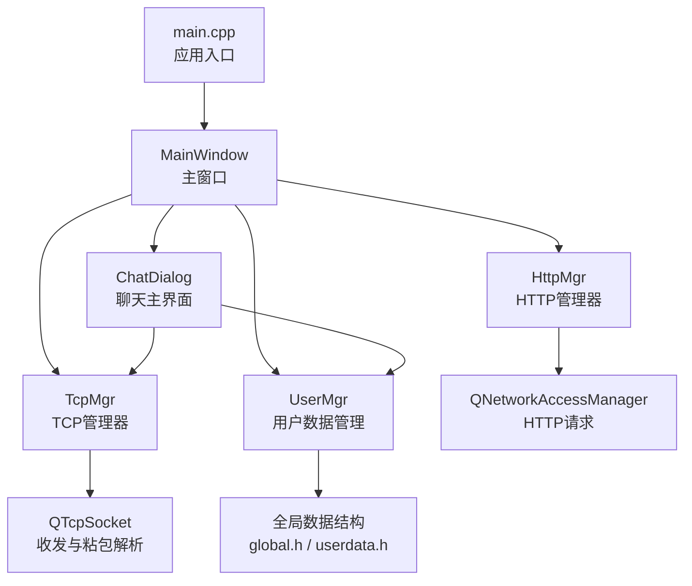
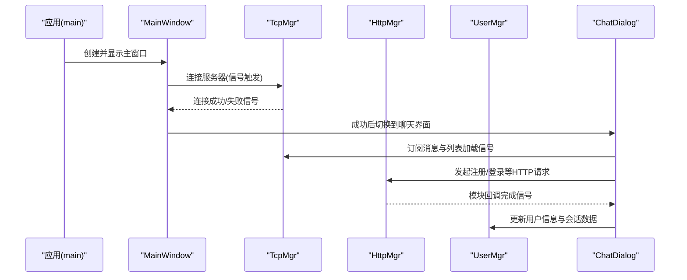
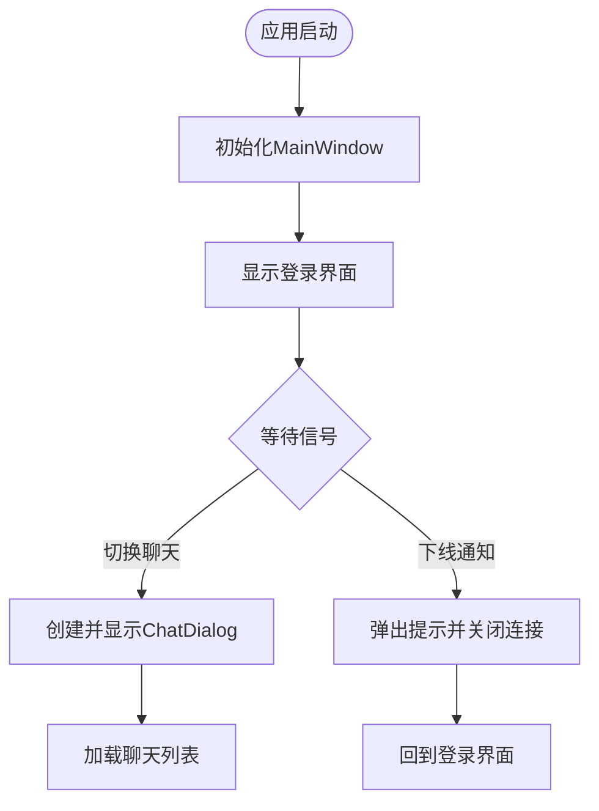
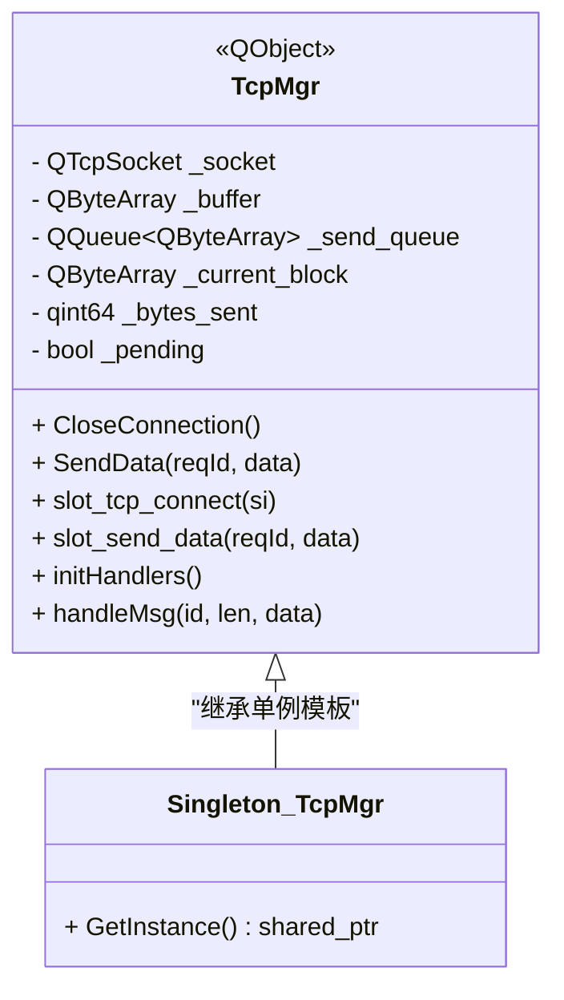
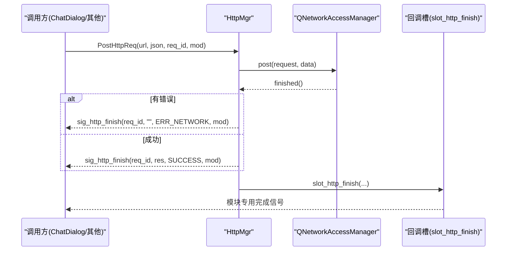
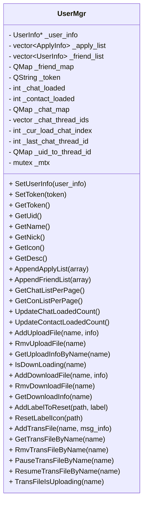
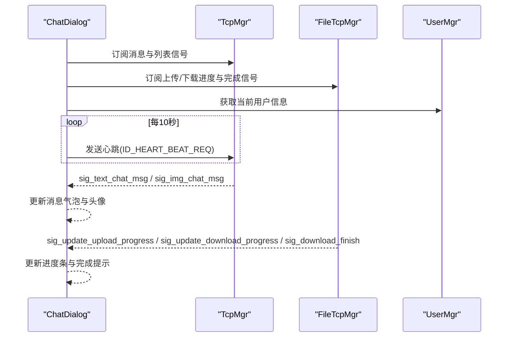
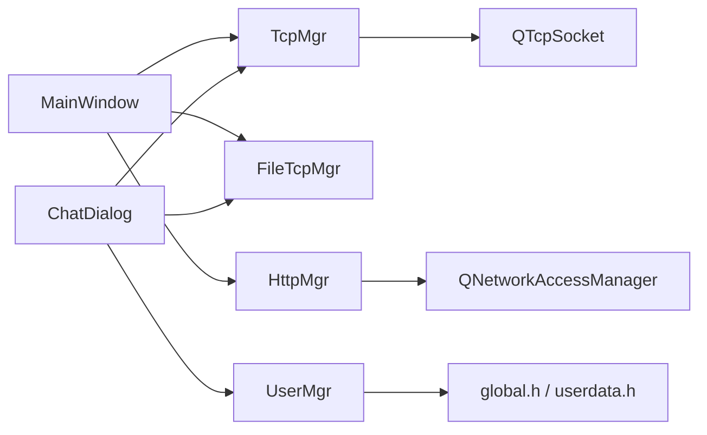

# 客户端开发

<cite>
**本文引用的文件**   
- [main.cpp](file://client/llfcchat/src/main.cpp)
- [mainwindow.h](file://client/llfcchat/include/mainwindow.h)
- [mainwindow.cpp](file://client/llfcchat/src/mainwindow.cpp)
- [tcpmgr.h](file://client/llfcchat/include/tcpmgr.h)
- [tcpmgr.cpp](file://client/llfcchat/src/tcpmgr.cpp)
- [httpmgr.h](file://client/llfcchat/include/httpmgr.h)
- [httpmgr.cpp](file://client/llfcchat/src/httpmgr.cpp)
- [usermgr.h](file://client/llfcchat/include/usermgr.h)
- [usermgr.cpp](file://client/llfcchat/src/usermgr.cpp)
- [global.h](file://client/llfcchat/include/global.h)
- [userdata.h](file://client/llfcchat/include/userdata.h)
- [chatdialog.h](file://client/llfcchat/include/chatdialog.h)
- [chatdialog.cpp](file://client/llfcchat/src/chatdialog.cpp)
- [singleton.h](file://client/llfcchat/include/singleton.h)
- [config.ini](file://client/llfcchat/config/config.ini)
</cite>

## 目录
1. [简介](#简介)
2. [项目结构](#项目结构)
3. [核心组件](#核心组件)
4. [架构总览](#架构总览)
5. [详细组件分析](#详细组件分析)
6. [依赖关系分析](#依赖关系分析)
7. [性能与并发特性](#性能与并发特性)
8. [故障排查指南](#故障排查指南)
9. [结论](#结论)
10. [附录：配置项与接口说明](#附录配置项与接口说明)

## 简介
本文件面向LLFCChat Qt客户端的开发与维护，系统性阐述应用架构、UI组件设计、网络通信实现与数据管理。重点覆盖以下方面：
- MainWindow主窗口生命周期与界面切换
- TcpManager的TCP连接、粘包处理、消息分发与异步发送队列
- HttpManager基于QNetworkAccessManager的HTTP请求封装与模块回调
- UserManager的用户信息、好友申请、聊天会话与文件传输状态管理
- 信号槽机制、事件过滤与定时器驱动的异步编程模式
- 配置加载、错误处理与常见问题定位

## 项目结构
客户端采用分层组织方式：
- UI层：MainWindow、ChatDialog及各类对话框与自定义控件
- 网络层：TcpMgr（长连接）、HttpMgr（HTTP）、FileTcpMgr（资源服务器）
- 数据层：UserMgr（用户与聊天会话缓存）、全局数据结构（global.h、userdata.h）
- 启动与配置：main.cpp负责样式加载、配置文件读取、线程与主窗口初始化

**图表来源** 
- [main.cpp:1-44](file://client/llfcchat/src/main.cpp#L1-L44)
- [mainwindow.h:1-57](file://client/llfcchat/include/mainwindow.h#L1-L57)
- [tcpmgr.h:1-90](file://client/llfcchat/include/tcpmgr.h#L1-L90)
- [httpmgr.h:1-34](file://client/llfcchat/include/httpmgr.h#L1-L34)
- [usermgr.h:1-116](file://client/llfcchat/include/usermgr.h#L1-L116)
- [global.h:1-296](file://client/llfcchat/include/global.h#L1-L296)
- [userdata.h:1-288](file://client/llfcchat/include/userdata.h#L1-L288)

**章节来源**
- [main.cpp:1-44](file://client/llfcchat/src/main.cpp#L1-L44)
- [config.ini:1-4](file://client/llfcchat/config/config.ini#L1-L4)

## 核心组件
- MainWindow：负责登录/注册/重置/聊天界面的切换与统一事件转发；监听TcpMgr与FileTcpMgr的连接状态并做离线回退。
- TcpMgr：单例对象，封装QTcpSocket连接、粘包解析、消息路由、发送队列与心跳定时；跨线程通过信号槽传递复杂类型。
- HttpMgr：单例对象，封装POST请求、JSON序列化、错误码与模块回调；内部使用QNetworkAccessManager异步完成。
- UserMgr：单例对象，维护当前用户信息、好友列表、申请列表、聊天会话映射、上传下载任务状态等，提供分页与查询接口。
- ChatDialog：聊天主界面，订阅TcpMgr与FileTcpMgr的信号，驱动UI更新、消息渲染、头像加载、文件传输进度展示。

**章节来源**
- [mainwindow.h:1-57](file://client/llfcchat/include/mainwindow.h#L1-L57)
- [mainwindow.cpp:1-164](file://client/llfcchat/src/mainwindow.cpp#L1-L164)
- [tcpmgr.h:1-90](file://client/llfcchat/include/tcpmgr.h#L1-L90)
- [tcpmgr.cpp:1-200](file://client/llfcchat/src/tcpmgr.cpp#L1-L200)
- [httpmgr.h:1-34](file://client/llfcchat/include/httpmgr.h#L1-L34)
- [httpmgr.cpp:1-62](file://client/llfcchat/src/httpmgr.cpp#L1-L62)
- [usermgr.h:1-116](file://client/llfcchat/include/usermgr.h#L1-L116)
- [usermgr.cpp:1-200](file://client/llfcchat/src/usermgr.cpp#L1-L200)
- [chatdialog.h:1-98](file://client/llfcchat/include/chatdialog.h#L1-L98)
- [chatdialog.cpp:1-200](file://client/llfcchat/src/chatdialog.cpp#L1-L200)

## 架构总览
整体采用“UI + 管理器”的分层架构，通过Qt信号槽解耦各模块，所有网络操作均异步化，避免阻塞UI线程。

**图表来源** 
- [main.cpp:1-44](file://client/llfcchat/src/main.cpp#L1-L44)
- [mainwindow.cpp:1-164](file://client/llfcchat/src/mainwindow.cpp#L1-L164)
- [tcpmgr.cpp:1-200](file://client/llfcchat/src/tcpmgr.cpp#L1-L200)
- [httpmgr.cpp:1-62](file://client/llfcchat/src/httpmgr.cpp#L1-L62)
- [chatdialog.cpp:1-200](file://client/llfcchat/src/chatdialog.cpp#L1-L200)

## 详细组件分析

### MainWindow 主窗口管理
- 职责：集中管理登录、注册、重置与聊天界面切换；统一处理下线与异常断开事件，回退到登录态。
- 关键流程：
  - 构造时设置初始UI状态为登录界面，并建立信号连接。
  - 收到TcpMgr的切换聊天信号后，创建ChatDialog并加载聊天列表。
  - 收到下线或断连信号时，关闭TCP与资源连接，回到登录界面。
- 信号槽要点：
  - 订阅TcpMgr::sig_swich_chatdlg、sig_notify_offline、sig_connection_closed
  - 订阅FileTcpMgr::sig_connection_closed
- 返回值与参数：无直接返回值，主要通过槽函数改变UI状态与子窗口可见性。

**图表来源** 
- [mainwindow.cpp:1-164](file://client/llfcchat/src/mainwindow.cpp#L1-L164)

**章节来源**
- [mainwindow.h:1-57](file://client/llfcchat/include/mainwindow.h#L1-L57)
- [mainwindow.cpp:1-164](file://client/llfcchat/src/mainwindow.cpp#L1-L164)

### TcpManager TCP连接管理
- 职责：封装QTcpSocket连接、粘包解析、消息分发、发送队列与心跳；跨线程安全地发送与接收数据。
- 关键实现：
  - readyRead中循环解析头部（ID+长度），再按长度读取消息体，调用handleMsg分发。
  - bytesWritten回调驱动发送队列，保证顺序与不丢包。
  - 通过qRegisterMetaType注册跨线程信号槽所需元类型。
  - 提供SendData接口，统一通过sig_send_data进入槽函数处理。
- 重要信号：
  - sig_con_success(bool)：连接结果
  - sig_login_failed(int)、sig_notify_offline()、sig_connection_closed()
  - sig_load_chat_thread(...)、sig_load_chat_msg(...)、sig_text_chat_msg(...)、sig_img_chat_msg(...)
  - sig_friend_apply(...)、sig_add_auth_friend(...)、sig_auth_rsp(...)
- 错误处理：
  - error信号分支处理拒绝、远程关闭、主机未找到、超时、网络错误等。
  - disconnected信号触发sig_connection_closed通知上层。

**图表来源** 
- [tcpmgr.h:1-90](file://client/llfcchat/include/tcpmgr.h#L1-L90)
- [tcpmgr.cpp:1-200](file://client/llfcchat/src/tcpmgr.cpp#L1-L200)
- [singleton.h:1-46](file://client/llfcchat/include/singleton.h#L1-L46)

**章节来源**
- [tcpmgr.h:1-90](file://client/llfcchat/include/tcpmgr.h#L1-L90)
- [tcpmgr.cpp:1-200](file://client/llfcchat/src/tcpmgr.cpp#L1-L200)
- [global.h:1-296](file://client/llfcchat/include/global.h#L1-L296)

### HttpManager HTTP请求处理
- 职责：封装POST请求、JSON序列化、错误码与模块回调；将通用完成信号分发给具体模块。
- 关键实现：
  - PostHttpReq(url, json, req_id, mod)构建请求头与请求体，发起异步post。
  - finished回调中判断error，若无错则读取响应字符串，发出sig_http_finish。
  - slot_http_finish根据Modules分发到sig_reg_mod_finish、sig_reset_mod_finish、sig_login_mod_finish。
- 返回值与参数：
  - 输入：QUrl、QJsonObject、ReqId、Modules
  - 输出：通过信号返回QString响应体与ErrorCodes

**图表来源** 
- [httpmgr.cpp:1-62](file://client/llfcchat/src/httpmgr.cpp#L1-L62)
- [httpmgr.h:1-34](file://client/llfcchat/include/httpmgr.h#L1-L34)

**章节来源**
- [httpmgr.h:1-34](file://client/llfcchat/include/httpmgr.h#L1-L34)
- [httpmgr.cpp:1-62](file://client/llfcchat/src/httpmgr.cpp#L1-L62)

### UserManager 用户数据管理
- 职责：维护当前用户信息、Token、好友列表、申请列表、聊天会话映射、上传下载任务状态；提供分页与查询接口。
- 关键能力：
  - SetUserInfo/SetToken/GetUid/GetName/GetNick/GetIcon/GetDesc
  - AppendApplyList/AppendFriendList/AddFriend
  - GetChatListPerPage/GetConListPerPage/UpdateLoadedCount
  - AddUploadFile/RmvUploadFile/GetUploadInfoByName
  - AddDownloadFile/RmvDownloadFile/GetDownloadInfo
  - AddLabelToReset/ResetLabelIcon
  - AddTransFile/GetTransFileByName/PauseTransFileByName/ResumeTransFileByName
- 并发安全：关键方法使用std::mutex保护共享数据。
- 与UI交互：为ChatDialog提供头像重置、上传下载进度更新、下载完成回调。

**图表来源** 
- [usermgr.h:1-116](file://client/llfcchat/include/usermgr.h#L1-L116)
- [usermgr.cpp:1-200](file://client/llfcchat/src/usermgr.cpp#L1-L200)

**章节来源**
- [usermgr.h:1-116](file://client/llfcchat/include/usermgr.h#L1-L116)
- [usermgr.cpp:1-200](file://client/llfcchat/src/usermgr.cpp#L1-L200)

### ChatDialog 聊天界面
- 职责：订阅TcpMgr与FileTcpMgr信号，驱动聊天列表、消息气泡、头像加载、文件传输进度与下载完成。
- 关键流程：
  - 初始化搜索框动作、侧边栏状态、事件过滤器安装。
  - 定时器每10秒发送心跳请求（ID_HEART_BEAT_REQ）。
  - 订阅sig_load_chat_thread、sig_create_private_chat、sig_load_chat_msg、sig_text_chat_msg、sig_img_chat_msg等。
  - 订阅FileTcpMgr的上传/下载进度与完成信号，更新UI。
- 事件处理：
  - eventFilter用于点击位置判断，控制搜索框显示/隐藏。
  - slot_item_clicked处理聊天条目选择。
  - slot_text_changed联动搜索行为。

**图表来源** 
- [chatdialog.cpp:1-200](file://client/llfcchat/src/chatdialog.cpp#L1-L200)
- [chatdialog.h:1-98](file://client/llfcchat/include/chatdialog.h#L1-L98)

**章节来源**
- [chatdialog.h:1-98](file://client/llfcchat/include/chatdialog.h#L1-L98)
- [chatdialog.cpp:1-200](file://client/llfcchat/src/chatdialog.cpp#L1-L200)

## 依赖关系分析
- 单例模式：TcpMgr、HttpMgr、UserMgr均继承自Singleton模板，确保全局唯一实例。
- 信号槽耦合：
  - MainWindow订阅TcpMgr与FileTcpMgr的连接状态信号。
  - ChatDialog订阅TcpMgr的消息与列表信号，以及FileTcpMgr的文件传输信号。
- 数据模型：
  - global.h定义ReqId、ErrorCodes、Modules、MsgInfo、TransferState等基础枚举与结构。
  - userdata.h定义SearchInfo、AddFriendApply、ApplyInfo、AuthInfo、AuthRsp、UserInfo、ChatDataBase及其派生类TextChatData、ImgChatData，以及ChatThreadData。

**图表来源** 
- [mainwindow.cpp:1-164](file://client/llfcchat/src/mainwindow.cpp#L1-L164)
- [tcpmgr.h:1-90](file://client/llfcchat/include/tcpmgr.h#L1-L90)
- [httpmgr.h:1-34](file://client/llfcchat/include/httpmgr.h#L1-L34)
- [usermgr.h:1-116](file://client/llfcchat/include/usermgr.h#L1-L116)
- [global.h:1-296](file://client/llfcchat/include/global.h#L1-L296)
- [userdata.h:1-288](file://client/llfcchat/include/userdata.h#L1-L288)

**章节来源**
- [singleton.h:1-46](file://client/llfcchat/include/singleton.h#L1-L46)
- [global.h:1-296](file://client/llfcchat/include/global.h#L1-L296)
- [userdata.h:1-288](file://client/llfcchat/include/userdata.h#L1-L288)

## 性能与并发特性
- 粘包处理：TcpMgr在readyRead中循环解析，避免阻塞；发送端通过bytesWritten回调与队列保证顺序与完整性。
- 异步IO：HttpMgr使用QNetworkAccessManager异步post，finished回调处理结果，不阻塞UI。
- 线程安全：UserMgr对共享数据加锁；TcpMgr通过信号槽跨线程传递元类型，需qRegisterMetaType注册。
- 心跳机制：ChatDialog定时器每10秒发送心跳，维持连接活跃。
- 资源释放：QNetworkReply在finished后deleteLater，避免内存泄漏。

[本节为通用指导，无需特定文件引用]

## 故障排查指南
- 连接失败：
  - 检查config.ini中的GateServer host/port是否正确。
  - 查看TcpMgr的error分支日志（拒绝、主机未找到、超时、网络错误）。
- 粘包问题：
  - 确认readyRead中头部解析与缓冲区移除逻辑正确。
  - 检查发送端是否按ID+长度格式写入，且字节序一致。
- 跨线程信号槽崩溃：
  - 确保所有自定义类型已在registerMetaType中注册。
  - 检查connect是否在正确的线程上下文执行。
- HTTP请求失败：
  - 检查QNetworkReply::error是否为NoError。
  - 确认Content-Type与Content-Length设置正确。
- 用户数据不一致：
  - 检查UserMgr的互斥锁是否正确使用。
  - 确认分页加载计数更新逻辑无误。

**章节来源**
- [tcpmgr.cpp:1-200](file://client/llfcchat/src/tcpmgr.cpp#L1-L200)
- [httpmgr.cpp:1-62](file://client/llfcchat/src/httpmgr.cpp#L1-L62)
- [usermgr.cpp:1-200](file://client/llfcchat/src/usermgr.cpp#L1-L200)
- [config.ini:1-4](file://client/llfcchat/config/config.ini#L1-L4)

## 结论
LLFCChat客户端采用清晰的“UI + 管理器”分层架构，借助Qt信号槽与异步IO实现高内聚低耦合。TcpMgr、HttpMgr、UserMgr各司其职，配合ChatDialog完成完整的聊天体验。通过合理的粘包处理、发送队列、心跳机制与线程安全设计，系统具备良好的稳定性与可扩展性。

[本节为总结，无需特定文件引用]

## 附录：配置项与接口说明
- 配置文件（config.ini）
  - GateServer/host：网关主机地址
  - GateServer/port：网关端口号
- 主要接口与返回值
  - TcpMgr::SendData(ReqId, QByteArray)：发送数据，无返回值，通过信号回调结果
  - HttpMgr::PostHttpReq(QUrl, QJsonObject, ReqId, Modules)：发起HTTP POST，无返回值，通过sig_http_finish回调
  - UserMgr::SetUserInfo(std::shared_ptr<UserInfo>)：设置用户信息，无返回值
  - UserMgr::GetToken()：返回当前Token字符串
  - UserMgr::GetChatListPerPage()：返回分页的好友列表片段
  - UserMgr::AddUploadFile(QString, std::shared_ptr<QFileInfo>)：添加上传文件信息，无返回值

**章节来源**
- [config.ini:1-4](file://client/llfcchat/config/config.ini#L1-L4)
- [tcpmgr.h:1-90](file://client/llfcchat/include/tcpmgr.h#L1-L90)
- [httpmgr.h:1-34](file://client/llfcchat/include/httpmgr.h#L1-L34)
- [usermgr.h:1-116](file://client/llfcchat/include/usermgr.h#L1-L116)