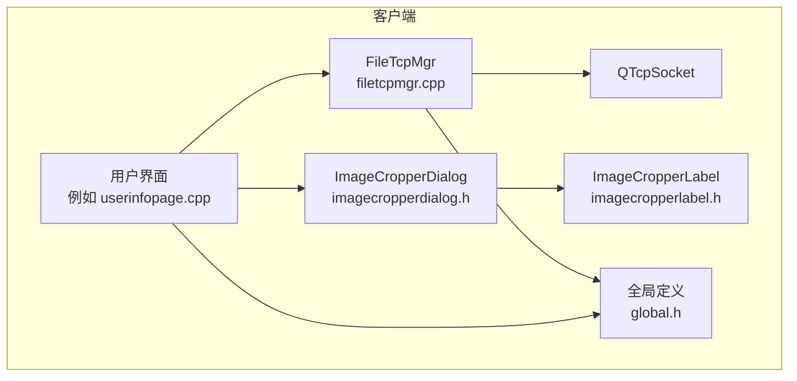
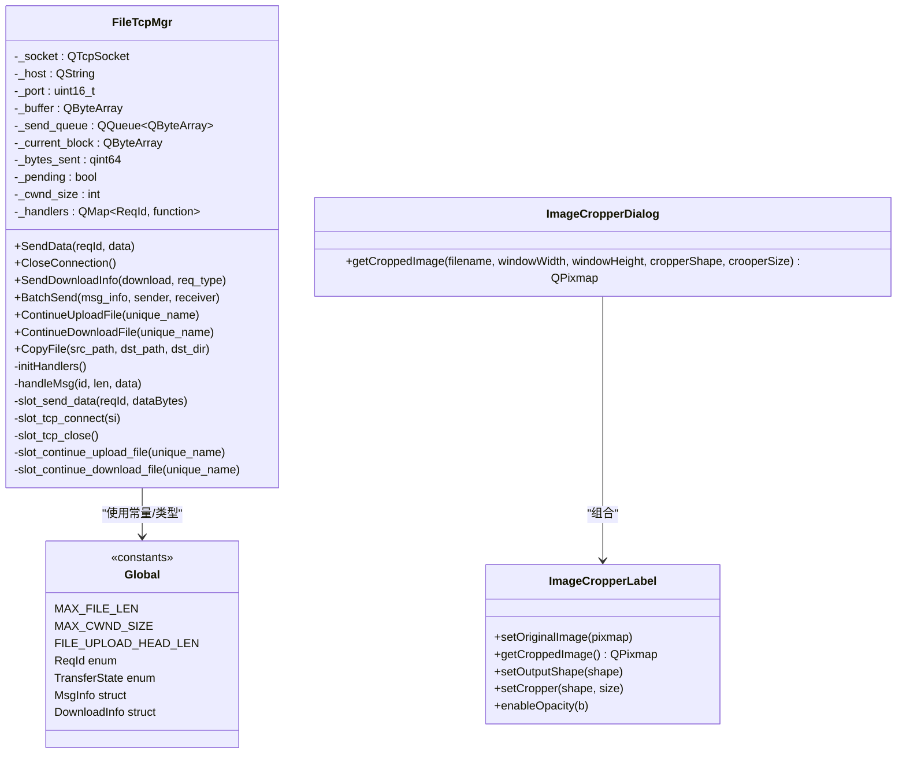
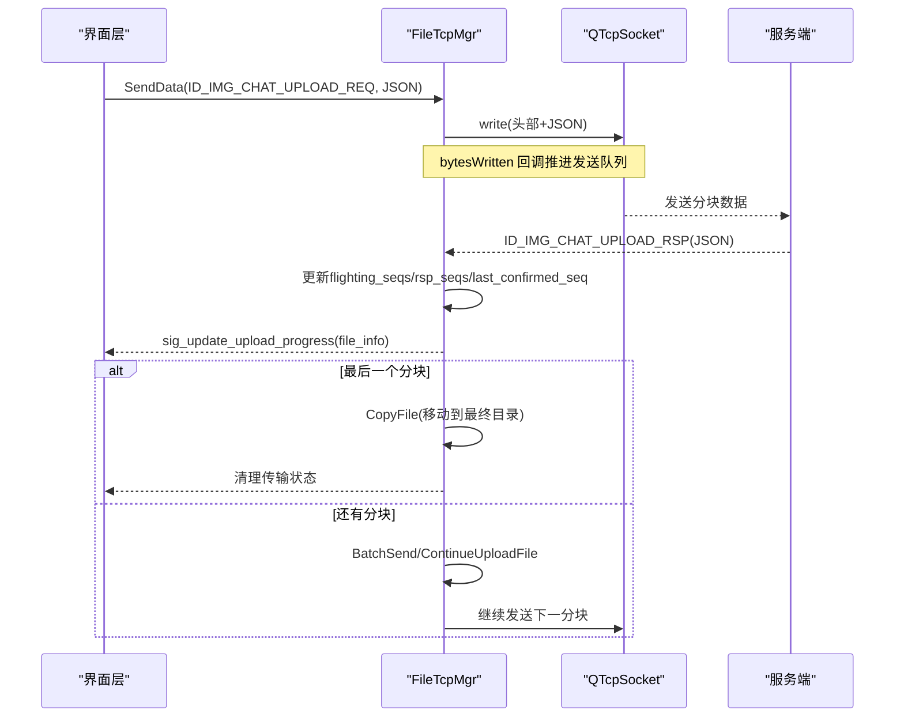
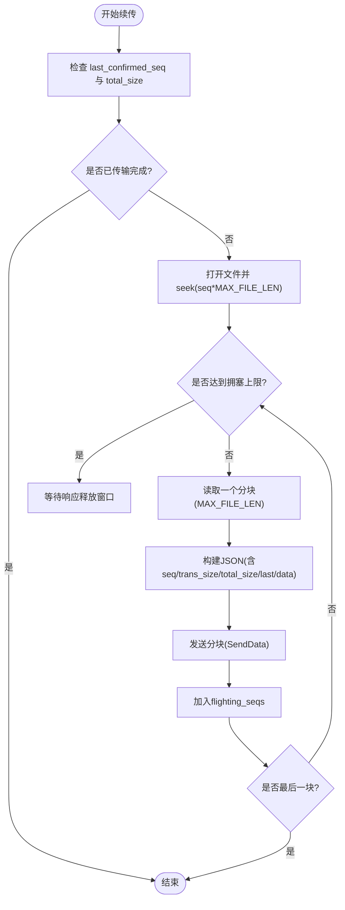
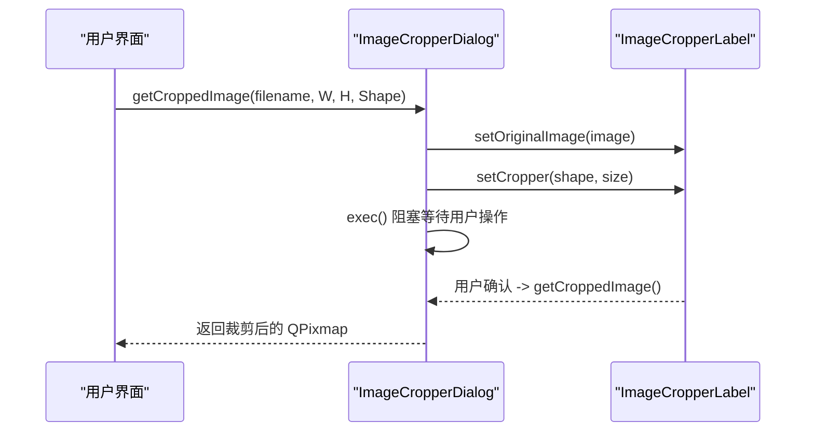
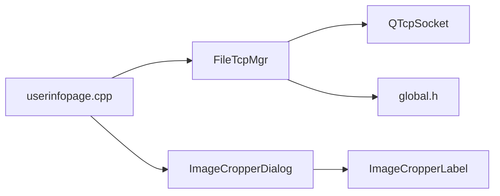

# 文件传输系统

<cite>
**本文引用的文件**   
- [filetcpmgr.h](file://client/llfcchat/include/filetcpmgr.h)
- [filetcpmgr.cpp](file://client/llfcchat/src/filetcpmgr.cpp)
- [imagecropperdialog.h](file://client/llfcchat/include/imagecropperdialog.h)
- [imagecropperlabel.h](file://client/llfcchat/include/imagecropperlabel.h)
- [global.h](file://client/llfcchat/include/global.h)
- [userinfopage.cpp](file://client/llfcchat/src/userinfopage.cpp)
- [tcpmgr.cpp](file://client/llfcchat/src/tcpmgr.cpp)
</cite>

## 目录
1. [简介](#简介)
2. [项目结构](#项目结构)
3. [核心组件](#核心组件)
4. [架构总览](#架构总览)
5. [详细组件分析](#详细组件分析)
6. [依赖关系分析](#依赖关系分析)
7. [性能与内存优化](#性能与内存优化)
8. [故障排查指南](#故障排查指南)
9. [结论](#结论)
10. [附录：协议与字段说明](#附录协议与字段说明)

## 简介
本文件为 LLFCChat 客户端的文件传输子系统文档，重点覆盖以下能力：
- FileTcpManager（文件传输管理器）：基于 TCP 的可靠分块上传/下载、拥塞窗口控制、断点续传、进度更新与错误恢复。
- 图片裁剪对话框 ImageCropperDialog：支持圆形/方形等形状裁剪，用于头像编辑与上传前处理。
- 文件协议格式、消息类型、JSON 载荷字段定义。
- 并发控制与资源管理策略，包括发送队列、未确认序列集合、最后确认序列号、最大拥塞窗口等。
- 大文件处理、内存优化与传输性能调优建议。

## 项目结构
LLFCChat 客户端将文件传输相关逻辑集中在 filetcpmgr.* 中，UI 层通过信号槽与管理器交互；图片裁剪功能由 imagecropperdialog.h/.cpp 和 imagecropperlabel.h/.cpp 提供。全局常量、枚举与数据结构在 global.h 中统一声明。

图表来源
- [filetcpmgr.cpp:1-1140](file://client/llfcchat/src/filetcpmgr.cpp#L1-L1140)
- [filetcpmgr.h:1-85](file://client/llfcchat/include/filetcpmgr.h#L1-L85)
- [imagecropperdialog.h:1-100](file://client/llfcchat/include/imagecropperdialog.h#L1-L100)
- [imagecropperlabel.h:1-167](file://client/llfcchat/include/imagecropperlabel.h#L1-L167)
- [global.h:1-296](file://client/llfcchat/include/global.h#L1-L296)

章节来源
- [filetcpmgr.h:1-85](file://client/llfcchat/include/filetcpmgr.h#L1-L85)
- [filetcpmgr.cpp:1-1140](file://client/llfcchat/src/filetcpmgr.cpp#L1-L1140)
- [imagecropperdialog.h:1-100](file://client/llfcchat/include/imagecropperdialog.h#L1-L100)
- [imagecropperlabel.h:1-167](file://client/llfcchat/include/imagecropperlabel.h#L1-L167)
- [global.h:1-296](file://client/llfcchat/include/global.h#L1-L296)

## 核心组件
- FileTcpMgr：封装 TCP Socket 收发、粘包/拆包解析、消息分发、上传/下载流程、拥塞窗口控制、断点续传、进度信号。
- ImageCropperDialog：模态对话框，封装裁剪交互，返回裁剪后的 QPixmap。
- ImageCropperLabel：底层绘制与交互控件，支持多种裁剪形状、拖拽缩放、透明度遮罩等。
- global.h：定义 ReqId 消息类型、TransferState/Type、MsgInfo、DownloadInfo、MAX_FILE_LEN、MAX_CWND_SIZE 等关键常量与结构体。

章节来源
- [filetcpmgr.h:1-85](file://client/llfcchat/include/filetcpmgr.h#L1-L85)
- [filetcpmgr.cpp:1-1140](file://client/llfcchat/src/filetcpmgr.cpp#L1-L1140)
- [imagecropperdialog.h:1-100](file://client/llfcchat/include/imagecropperdialog.h#L1-L100)
- [imagecropperlabel.h:1-167](file://client/llfcchat/include/imagecropperlabel.h#L1-L167)
- [global.h:1-296](file://client/llfcchat/include/global.h#L1-L296)

## 架构总览
FileTcpMgr 作为单例，负责所有文件传输相关的网络 I/O 与业务编排。其内部维护：
- 接收缓冲与粘包解析状态（_buffer, _b_recv_pending, _message_type, _message_len）。
- 发送队列与当前发送块（_send_queue, _current_block, _bytes_sent, _pending）。
- 拥塞窗口计数（_cwnd_size），限制同时未确认的分块数量。
- 消息处理器映射（_handlers），按 ReqId 分发到具体回调。

图表来源
- [filetcpmgr.h:1-85](file://client/llfcchat/include/filetcpmgr.h#L1-L85)
- [filetcpmgr.cpp:1-1140](file://client/llfcchat/src/filetcpmgr.cpp#L1-L1140)
- [imagecropperdialog.h:1-100](file://client/llfcchat/include/imagecropperdialog.h#L1-L100)
- [imagecropperlabel.h:1-167](file://client/llfcchat/include/imagecropperlabel.h#L1-L167)
- [global.h:1-296](file://client/llfcchat/include/global.h#L1-L296)

## 详细组件分析

### FileTcpMgr：TCP 文件传输管理器
职责与要点：
- 连接与事件：连接成功/失败、断开、错误处理，统一通过信号通知上层。
- 粘包/拆包：读取所有可用数据到缓冲区，循环解析“头部+体”的消息，确保完整后再处理。
- 发送队列：当 socket 正在写时，新数据入队；bytesWritten 回调驱动继续发送。
- 拥塞控制：_cwnd_size 记录未确认分块数，达到 MAX_CWND_SIZE 后暂停发送，收到响应后递减。
- 上传流程：
  - 普通上传：按 seq 递增读取固定大小分块，Base64 编码后发送，携带 md5、name、seq、trans_size、total_size、last、data、last_seq、uid 等字段。
  - 续传上传：从 last_confirmed_seq 位置继续发送，避免重复传输已确认分块。
- 下载流程：
  - 首次下载：根据服务器下发的信息初始化本地路径与元数据，按 seq 追加写入文件。
  - 续传下载：根据 current_size 或 last_confirmed_seq 决定起始位置，支持暂停/继续。
- 进度与完成：
  - 上传：sig_update_upload_progress 推送进度；全部确认后拷贝至最终目录并清理临时状态。
  - 下载：sig_update_download_progress 推送进度；is_last 为真时触发 sig_download_finish。

图表来源
- [filetcpmgr.cpp:925-996](file://client/llfcchat/src/filetcpmgr.cpp#L925-L996)
- [filetcpmgr.cpp:1002-1076](file://client/llfcchat/src/filetcpmgr.cpp#L1002-L1076)
- [filetcpmgr.cpp:521-608](file://client/llfcchat/src/filetcpmgr.cpp#L521-L608)
- [filetcpmgr.cpp:610-693](file://client/llfcchat/src/filetcpmgr.cpp#L610-L693)

章节来源
- [filetcpmgr.cpp:1-1140](file://client/llfcchat/src/filetcpmgr.cpp#L1-L1140)
- [filetcpmgr.h:1-85](file://client/llfcchat/include/filetcpmgr.h#L1-L85)
- [global.h:1-296](file://client/llfcchat/include/global.h#L1-L296)

### 断点续传机制
关键点：
- 分块序号 seq：每块唯一编号，用于定位与去重。
- 未确认集合 flighting_seqs：记录已发送但未收到响应的分块，便于超时重传。
- 已确认集合 rsp_seqs：记录服务器确认收到的分块。
- 最后确认序列 last_confirmed_seq：用于快速定位续传起点。
- 最大序列 max_seq：根据 total_size 与 MAX_FILE_LEN 计算。
- 拥塞窗口 cwnd：限制并发未确认分块数量，避免拥塞。

图表来源
- [filetcpmgr.cpp:925-996](file://client/llfcchat/src/filetcpmgr.cpp#L925-L996)
- [filetcpmgr.cpp:1002-1076](file://client/llfcchat/src/filetcpmgr.cpp#L1002-L1076)
- [global.h:1-296](file://client/llfcchat/include/global.h#L1-L296)

章节来源
- [filetcpmgr.cpp:925-996](file://client/llfcchat/src/filetcpmgr.cpp#L925-L996)
- [filetcpmgr.cpp:1002-1076](file://client/llfcchat/src/filetcpmgr.cpp#L1002-L1076)
- [global.h:1-296](file://client/llfcchat/include/global.h#L1-L296)

### 图片裁剪对话框 ImageCropperDialog
功能：
- 以模态方式显示裁剪界面，支持矩形、正方形、椭圆、圆形等多种裁剪形状。
- 用户拖动/缩放裁剪框，实时预览，点击确定后返回裁剪后的 QPixmap。
- 典型用法：头像编辑，选择圆形裁剪，保存为 PNG 后进入上传流程。

图表来源
- [imagecropperdialog.h:1-100](file://client/llfcchat/include/imagecropperdialog.h#L1-L100)
- [imagecropperlabel.h:1-167](file://client/llfcchat/include/imagecropperlabel.h#L1-L167)
- [userinfopage.cpp:140-277](file://client/llfcchat/src/userinfopage.cpp#L140-L277)

章节来源
- [imagecropperdialog.h:1-100](file://client/llfcchat/include/imagecropperdialog.h#L1-L100)
- [imagecropperlabel.h:1-167](file://client/llfcchat/include/imagecropperlabel.h#L1-L167)
- [userinfopage.cpp:140-277](file://client/llfcchat/src/userinfopage.cpp#L140-L277)

### 文件上传/下载与进度监控示例
- 头像上传：
  - 选择图片 -> 调用 ImageCropperDialog 裁剪 -> 保存为 PNG -> 计算 MD5 -> 分块 Base64 编码 -> 通过 FileTcpMgr::SendData 发送 ID_UPLOAD_HEAD_ICON_REQ -> 收到响应后继续下一块 -> 完成后刷新头像。
- 聊天图片下载：
  - 收到 ID_IMG_CHAT_DOWN_INFO_SYNC_RSP -> 初始化本地路径与元数据 -> 发送 ID_IMG_CHAT_DOWN_REQ -> 收到 ID_IMG_CHAT_DOWN_RSP -> 按 seq 追加写入 -> is_last 为真时完成并通知界面。

章节来源
- [userinfopage.cpp:140-277](file://client/llfcchat/src/userinfopage.cpp#L140-L277)
- [tcpmgr.cpp:948-987](file://client/llfcchat/src/tcpmgr.cpp#L948-L987)
- [filetcpmgr.cpp:334-433](file://client/llfcchat/src/filetcpmgr.cpp#L334-L433)
- [filetcpmgr.cpp:695-811](file://client/llfcchat/src/filetcpmgr.cpp#L695-L811)

## 依赖关系分析
- FileTcpMgr 依赖 QTcpSocket 进行网络 I/O，依赖 global.h 中的常量与结构体。
- 消息处理通过 _handlers 映射 ReqId 到回调函数，实现松耦合。
- 界面层通过信号槽与 FileTcpMgr 通信，避免直接耦合。
- ImageCropperDialog 依赖 ImageCropperLabel 实现裁剪交互。

图表来源
- [filetcpmgr.cpp:1-1140](file://client/llfcchat/src/filetcpmgr.cpp#L1-L1140)
- [global.h:1-296](file://client/llfcchat/include/global.h#L1-L296)
- [imagecropperdialog.h:1-100](file://client/llfcchat/include/imagecropperdialog.h#L1-L100)
- [imagecropperlabel.h:1-167](file://client/llfcchat/include/imagecropperlabel.h#L1-L167)
- [userinfopage.cpp:140-277](file://client/llfcchat/src/userinfopage.cpp#L140-L277)

章节来源
- [filetcpmgr.cpp:1-1140](file://client/llfcchat/src/filetcpmgr.cpp#L1-L1140)
- [global.h:1-296](file://client/llfcchat/include/global.h#L1-L296)

## 性能与内存优化
- 分块大小 MAX_FILE_LEN：当前为 32KB，平衡了网络吞吐与内存占用。可根据带宽与延迟调整。
- 拥塞窗口 MAX_CWND_SIZE：当前为 5，限制并发未确认分块，避免拥塞丢包。可依据网络质量动态调整。
- Base64 编码：增加约 33% 体积，但简化跨平台传输与 JSON 序列化。若追求极致性能，可考虑二进制帧协议。
- 文件 I/O：使用顺序读取与 seek 定位，减少随机 IO；分块写入避免一次性加载大文件到内存。
- 粘包处理：循环解析缓冲区，避免频繁分配/拷贝；仅在必要时创建 QDataStream。
- 进度更新：通过信号异步推送，避免阻塞主线程。

[本节为通用指导，不直接分析具体文件]

## 故障排查指南
- 连接失败/超时：
  - 检查 host/port 配置与防火墙设置。
  - 观察 error 信号中的错误码（如 ConnectionRefusedError、HostNotFoundError、SocketTimeoutError）。
- 粘包/半包问题：
  - 确认接收缓冲区长度判断与移除逻辑正确，确保先解析头部再读体。
- 上传卡住：
  - 检查 _cwnd_size 是否达到上限，确认服务器响应是否及时到达。
  - 查看 flighting_seqs 是否长时间未清空，必要时实现超时重传。
- 下载不完整：
  - 校验 is_last 标志与 seq 连续性，确保追加写入模式正确。
  - 核对 client_path 目录权限与磁盘空间。
- 图片裁剪无效：
  - 确认输入图片格式支持（如 WebP 插件），裁剪形状与尺寸设置合理。

章节来源
- [filetcpmgr.cpp:65-93](file://client/llfcchat/src/filetcpmgr.cpp#L65-L93)
- [filetcpmgr.cpp:16-55](file://client/llfcchat/src/filetcpmgr.cpp#L16-L55)
- [filetcpmgr.cpp:925-996](file://client/llfcchat/src/filetcpmgr.cpp#L925-L996)
- [filetcpmgr.cpp:695-811](file://client/llfcchat/src/filetcpmgr.cpp#L695-L811)
- [userinfopage.cpp:140-160](file://client/llfcchat/src/userinfopage.cpp#L140-L160)

## 结论
LLFCChat 的文件传输子系统通过 FileTcpMgr 实现了稳定可靠的 TCP 分块传输，结合拥塞窗口与断点续传机制，有效应对网络波动与大文件场景。ImageCropperDialog 提供了灵活的图片裁剪能力，满足头像编辑需求。整体设计清晰、扩展性强，适合初学者理解文件传输基础，也为有经验的开发者提供了实践参考。

[本节为总结性内容，不直接分析具体文件]

## 附录：协议与字段说明
- 消息类型（ReqId）：
  - 上传头像：ID_UPLOAD_HEAD_ICON_REQ / ID_UPLOAD_HEAD_ICON_RSP
  - 下载文件：ID_DOWN_LOAD_FILE_REQ / ID_DOWN_LOAD_FILE_RSP
  - 聊天图片上传：ID_IMG_CHAT_UPLOAD_REQ / ID_IMG_CHAT_UPLOAD_RSP
  - 聊天图片续传：ID_IMG_CHAT_CONTINUE_UPLOAD_REQ / ID_IMG_CHAT_CONTINUE_UPLOAD_RSP
  - 聊天图片下载：ID_IMG_CHAT_DOWN_REQ / ID_IMG_CHAT_DOWN_RSP
  - 文件信息同步：ID_FILE_INFO_SYNC_REQ / ID_FILE_INFO_SYNC_RSP
  - 下载信息同步：ID_IMG_CHAT_DOWN_INFO_SYNC_REQ / ID_IMG_CHAT_DOWN_INFO_SYNC_RSP

- 上传分块 JSON 字段（示例）：
  - md5：文件哈希
  - name：文件名
  - seq：分块序号
  - trans_size：当前累计传输大小
  - total_size：文件总大小
  - last：是否最后一块
  - data：Base64 编码的数据
  - last_seq：最后一个分块序号
  - uid：用户标识

- 下载分块 JSON 字段（示例）：
  - name：文件名
  - seq：分块序号
  - trans_size：当前累计传输大小
  - total_size：文件总大小
  - is_last：是否最后一块
  - data：Base64 编码的数据
  - client_path：客户端存储路径
  - token：鉴权令牌
  - sender_id/receiver_id/message_id/uid：会话与身份信息

章节来源
- [global.h:43-88](file://client/llfcchat/include/global.h#L43-L88)
- [filetcpmgr.cpp:925-996](file://client/llfcchat/src/filetcpmgr.cpp#L925-L996)
- [filetcpmgr.cpp:695-811](file://client/llfcchat/src/filetcpmgr.cpp#L695-L811)
- [filetcpmgr.cpp:334-433](file://client/llfcchat/src/filetcpmgr.cpp#L334-L433)