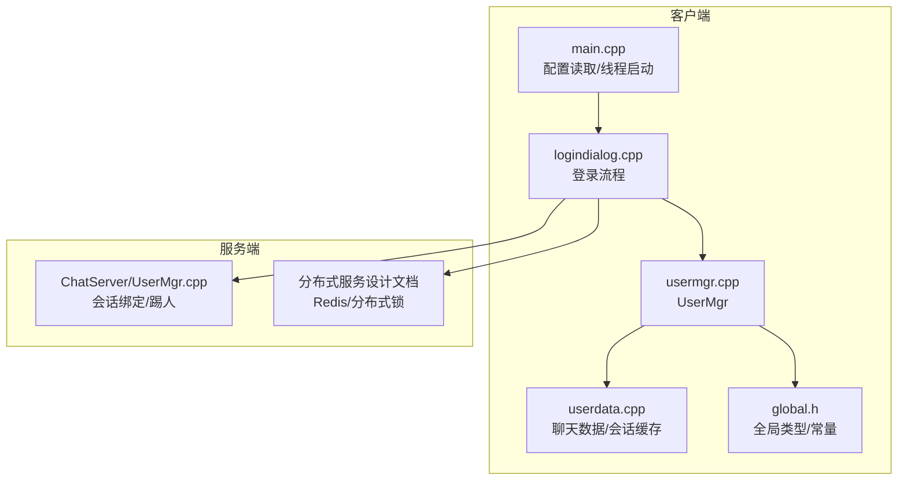
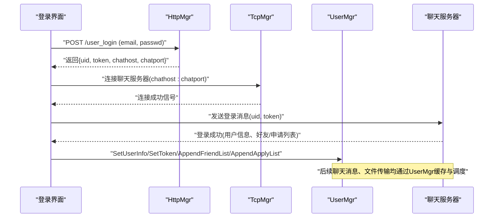
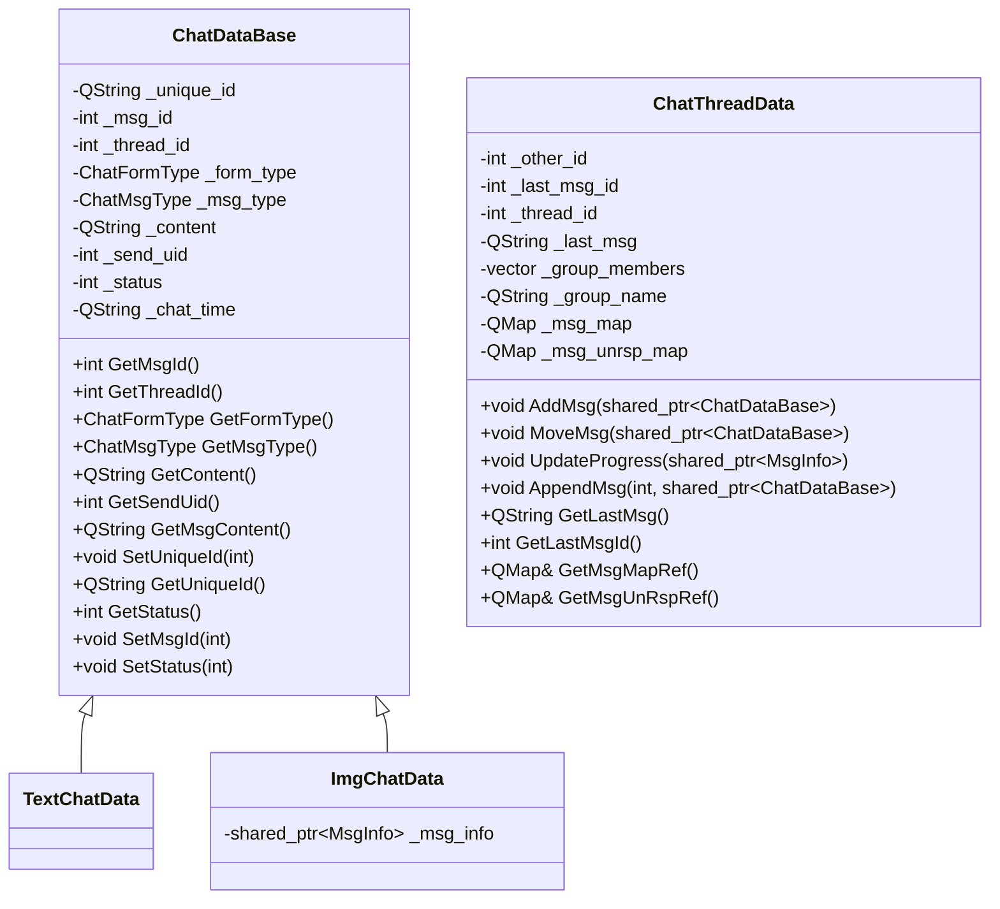
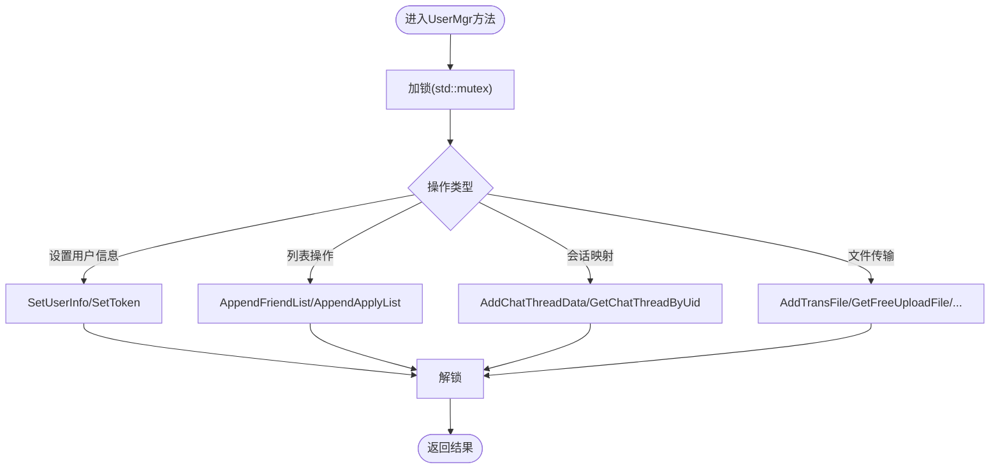
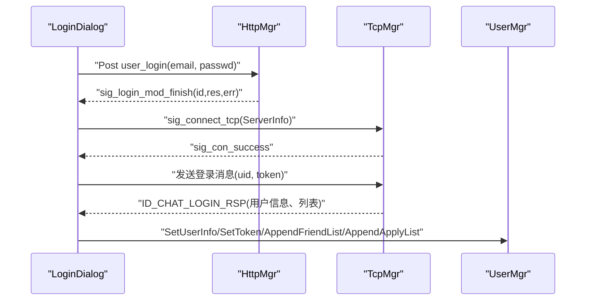
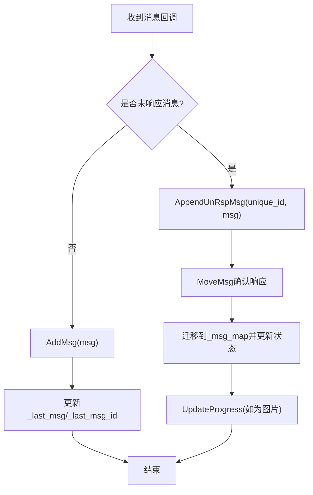
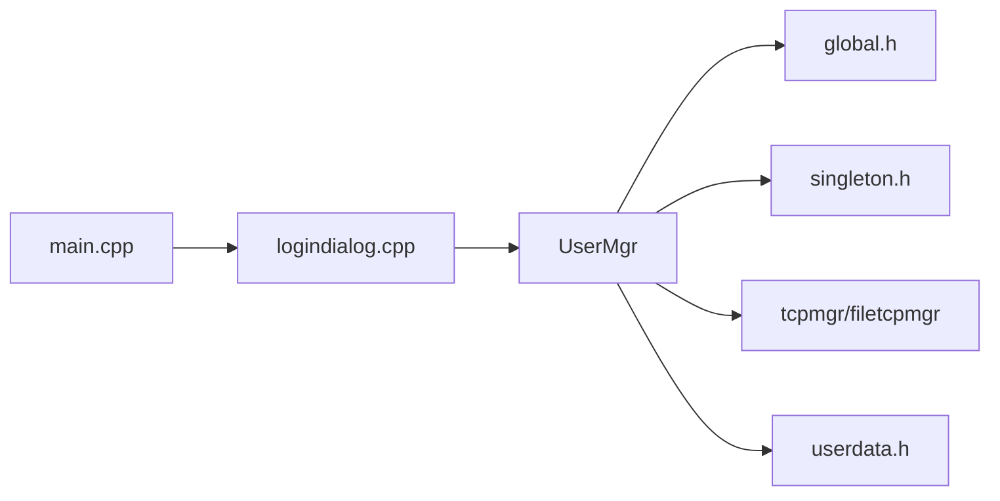

# 用户管理

<cite>
**本文引用的文件**   
- [userdata.h](file://client/llfcchat/include/userdata.h)
- [usermgr.h](file://client/llfcchat/include/usermgr.h)
- [userdata.cpp](file://client/llfcchat/src/userdata.cpp)
- [usermgr.cpp](file://client/llfcchat/src/usermgr.cpp)
- [global.h](file://client/llfcchat/include/global.h)
- [singleton.h](file://client/llfcchat/include/singleton.h)
- [logindialog.cpp](file://client/llfcchat/src/logindialog.cpp)
- [main.cpp](file://client/llfcchat/src/main.cpp)
- [ChatServer/UserMgr.h](file://server/ChatServer/include/UserMgr.h)
- [ChatServer/UserMgr.cpp](file://server/ChatServer/src/UserMgr.cpp)
- [开发文档/day37-聊天信息存储方案.md](file://开发文档/day37-聊天信息存储方案.md)
- [开发文档/day27-分布式服务设计.md](file://开发文档/day27-分布式服务设计.md)
- [开发文档/day33单服程踢人逻辑.md](file://开发文档/day33单服程踢人逻辑.md)
- [开发文档/day41-分布式死锁解决方案.md](file://开发文档/day41-分布式死锁解决方案.md)
</cite>

## 目录
1. [简介](#简介)
2. [项目结构](#项目结构)
3. [核心组件](#核心组件)
4. [架构总览](#架构总览)
5. [详细组件分析](#详细组件分析)
6. [依赖关系分析](#依赖关系分析)
7. [性能与并发特性](#性能与并发特性)
8. [故障排查指南](#故障排查指南)
9. [结论](#结论)
10. [附录：最佳实践与扩展建议](#附录最佳实践与扩展建议)

## 简介
本文件面向LLFCChat客户端的用户管理系统，围绕UserManager（用户数据与会话管理）和UserData（用户信息实体）进行系统化说明。内容涵盖：
- 用户信息实体设计与数据结构
- 用户登录状态、好友列表、申请列表的内存管理与分页加载
- 聊天会话（线程）与消息缓存机制
- 多设备登录支持及冲突处理思路（基于服务端实现）
- 本地配置读取、Token使用与网络请求中的鉴权
- 数据安全与持久化现状、可扩展方向（加密、缓存、持久化）

## 项目结构
客户端用户管理相关代码主要位于 client/llfcchat 模块：
- include/userdata.h：定义用户信息、认证信息、聊天数据模型等
- include/usermgr.h：UserMgr单例，负责用户信息、好友/申请列表、聊天会话、文件传输状态等
- src/userdata.cpp：聊天数据基类与派生类的实现，聊天线程数据操作
- src/usermgr.cpp：UserMgr具体实现，包含线程安全访问、分页加载、会话映射、上传下载状态管理等
- include/global.h：全局枚举、常量、消息类型、传输状态等
- include/singleton.h：通用单例模板
- src/logindialog.cpp：登录流程、HTTP/TCP连接、Token获取与转发
- src/main.cpp：应用启动、配置文件读取、初始化网络线程

图表来源 
- [logindialog.cpp:174-195](file://client/llfcchat/src/logindialog.cpp#L174-L195)
- [usermgr.cpp:10-65](file://client/llfcchat/src/usermgr.cpp#L10-L65)
- [userdata.cpp:49-82](file://client/llfcchat/src/userdata.cpp#L49-L82)
- [global.h:145-196](file://client/llfcchat/include/global.h#L145-L196)
- [ChatServer/UserMgr.cpp:10-49](file://server/ChatServer/src/UserMgr.cpp#L10-L49)

章节来源
- [logindialog.cpp:174-195](file://client/llfcchat/src/logindialog.cpp#L174-L195)
- [usermgr.cpp:10-65](file://client/llfcchat/src/usermgr.cpp#L10-L65)
- [userdata.cpp:49-82](file://client/llfcchat/src/userdata.cpp#L49-L82)
- [global.h:145-196](file://client/llfcchat/include/global.h#L145-L196)
- [ChatServer/UserMgr.cpp:10-49](file://server/ChatServer/src/UserMgr.cpp#L10-L49)

## 核心组件
- UserData 数据模型
  - UserInfo/AuthInfo/AuthRsp：用户基本信息与认证上下文
  - ChatDataBase/TextChatData/ImgChatData：聊天消息基类与派生类
  - ChatThreadData：会话级消息缓存、未响应消息队列、进度更新
- UserMgr 用户管理器
  - 用户信息与Token存取
  - 好友列表、申请列表的增删查与分页
  - 聊天会话映射（thread_id、uid->thread_id）
  - 文件上传/下载状态管理
  - 线程安全的互斥保护

章节来源
- [userdata.h:67-142](file://client/llfcchat/include/userdata.h#L67-L142)
- [userdata.h:144-284](file://client/llfcchat/include/userdata.h#L144-L284)
- [usermgr.h:12-113](file://client/llfcchat/include/usermgr.h#L12-L113)
- [usermgr.cpp:10-65](file://client/llfcchat/src/usermgr.cpp#L10-L65)

## 架构总览
用户管理的端到端流程包括：
- 登录阶段：登录界面发起HTTP请求，成功后获得服务器地址、端口、Token；随后建立TCP长连接到聊天服务器
- 会话阶段：将用户信息、Token、好友/申请列表、聊天会话映射保存在UserMgr中，供UI和业务层调用
- 聊天阶段：通过ChatThreadData维护每个会话的消息缓存、未响应消息集合、图片/文件传输进度
- 多设备登录：服务端通过Redis记录用户当前登录位置，并在重复登录时踢掉旧连接

图表来源 
- [logindialog.cpp:174-195](file://client/llfcchat/src/logindialog.cpp#L174-L195)
- [logindialog.cpp:22-38](file://client/llfcchat/src/logindialog.cpp#L22-L38)
- [usermgr.cpp:10-65](file://client/llfcchat/src/usermgr.cpp#L10-L65)

## 详细组件分析

### 用户信息实体（UserData）
- UserInfo/AuthInfo/AuthRsp
  - 字段：uid、name、nick、icon、sex、desc、thread_id（认证上下文携带）
  - 用途：承载用户基础信息与认证结果，用于UI展示与业务判断
- ChatDataBase/TextChatData/ImgChatData
  - 字段：unique_id、msg_id、thread_id、form_type、msg_type、content、send_uid、status、chat_time
  - 用途：统一抽象聊天消息，支持文本与图片两类消息
- ChatThreadData
  - 字段：other_id、last_msg_id、thread_id、group_members、group_name、_msg_map、_msg_unrsp_map
  - 方法：AddMsg/MoveMsg/UpdateProgress/AppendMsg/GetLastMsg/AppendUnRspMsg等
  - 用途：会话级消息缓存、未响应消息去重与状态同步、进度更新

图表来源 
- [userdata.h:144-284](file://client/llfcchat/include/userdata.h#L144-L284)
- [userdata.cpp:49-82](file://client/llfcchat/src/userdata.cpp#L49-L82)

章节来源
- [userdata.h:67-142](file://client/llfcchat/include/userdata.h#L67-L142)
- [userdata.h:144-284](file://client/llfcchat/include/userdata.h#L144-L284)
- [userdata.cpp:49-82](file://client/llfcchat/src/userdata.cpp#L49-L82)

### 用户管理器（UserMgr）
- 用户信息与Token
  - SetUserInfo/GetUserInfo/SetToken/GetToken
  - 线程安全：所有读写均加std::mutex保护
- 好友与申请列表
  - AppendFriendList/AppendApplyList/AddFriend/CheckFriendById/AlreadyApply
  - 分页：GetChatListPerPage/GetConListPerPage/UpdateChatLoadedCount/IsLoadChatFin
- 聊天会话映射
  - AddChatThreadData/GetChatThreadByThreadId/GetChatThreadByUid/GetThreadIdByUid
  - 维护_chat_map、_chat_thread_ids、_uid_to_thread_id
- 文件传输状态
  - 上传：AddUploadFile/RmvUploadFile/GetUploadInfoByName
  - 下载：AddDownloadFile/RmvDownloadFile/GetDownloadInfo/IsDownLoading
  - 传输控制：AddTransFile/GetTransFileByName/PauseTransFileByName/ResumeTransFileByName/TransFileIsUploading
  - 资源路径重置：AddLabelToReset/ResetLabelIcon

图表来源 
- [usermgr.cpp:10-65](file://client/llfcchat/src/usermgr.cpp#L10-L65)
- [usermgr.cpp:175-261](file://client/llfcchat/src/usermgr.cpp#L175-L261)
- [usermgr.cpp:288-335](file://client/llfcchat/src/usermgr.cpp#L288-L335)
- [usermgr.cpp:369-528](file://client/llfcchat/src/usermgr.cpp#L369-L528)

章节来源
- [usermgr.h:12-113](file://client/llfcchat/include/usermgr.h#L12-L113)
- [usermgr.cpp:10-65](file://client/llfcchat/src/usermgr.cpp#L10-L65)
- [usermgr.cpp:175-261](file://client/llfcchat/src/usermgr.cpp#L175-L261)
- [usermgr.cpp:288-335](file://client/llfcchat/src/usermgr.cpp#L288-L335)
- [usermgr.cpp:369-528](file://client/llfcchat/src/usermgr.cpp#L369-L528)

### 登录流程与状态管理
- 登录界面发起HTTP请求，解析返回的uid、token、chathost、chatport
- 建立TCP连接至聊天服务器，发送登录消息（含uid、token）
- 收到登录成功响应后，填充UserMgr的用户信息、Token、好友/申请列表
- 切换至聊天主界面，开始加载聊天列表与消息

图表来源 
- [logindialog.cpp:174-195](file://client/llfcchat/src/logindialog.cpp#L174-L195)
- [logindialog.cpp:22-38](file://client/llfcchat/src/logindialog.cpp#L22-L38)
- [usermgr.cpp:10-65](file://client/llfcchat/src/usermgr.cpp#L10-L65)

章节来源
- [logindialog.cpp:174-195](file://client/llfcchat/src/logindialog.cpp#L174-L195)
- [logindialog.cpp:22-38](file://client/llfcchat/src/logindialog.cpp#L22-L38)
- [usermgr.cpp:10-65](file://client/llfcchat/src/usermgr.cpp#L10-L65)

### 聊天会话与消息缓存
- ChatThreadData维护每个会话的消息映射与未响应消息集合
- MoveMsg用于将未响应消息迁移到已响应映射，并更新状态
- UpdateProgress根据MsgInfo更新图片/文件的传输进度
- UserMgr提供按uid或thread_id查询会话数据的能力

图表来源 
- [userdata.cpp:49-82](file://client/llfcchat/src/userdata.cpp#L49-L82)
- [usermgr.cpp:288-335](file://client/llfcchat/src/usermgr.cpp#L288-L335)

章节来源
- [userdata.cpp:49-82](file://client/llfcchat/src/userdata.cpp#L49-L82)
- [usermgr.cpp:288-335](file://client/llfcchat/src/usermgr.cpp#L288-L335)

### 多设备登录支持与冲突解决
- 服务端通过Redis记录用户当前登录位置（IP/服务器名），并在重复登录时踢掉旧连接
- 客户端在收到“异地登录”通知后，断开当前连接并回到登录界面
- 该能力由服务端UserMgr与LogicSystem共同实现，客户端仅需处理通知与状态切换

章节来源
- [开发文档/day27-分布式服务设计.md:277-444](file://开发文档/day27-分布式服务设计.md#L277-L444)
- [开发文档/day33单服程踢人逻辑.md:241-383](file://开发文档/day33单服程踢人逻辑.md#L241-L383)
- [ChatServer/UserMgr.cpp:10-49](file://server/ChatServer/src/UserMgr.cpp#L10-L49)

## 依赖关系分析
- UserMgr依赖：
  - global.h：枚举、常量、MsgInfo/DownloadInfo等
  - singleton.h：单例模式
  - tcpmgr/filetcpmgr：网络通信（登录、聊天、文件传输）
- 数据模型依赖：
  - userdata.h：ChatDataBase/TextChatData/ImgChatData/ChatThreadData
- 登录流程依赖：
  - logindialog.cpp：HTTP/TCP信号槽与状态机
  - main.cpp：配置文件读取与线程启动

图表来源 
- [usermgr.h:1-11](file://client/llfcchat/include/usermgr.h#L1-L11)
- [global.h:145-196](file://client/llfcchat/include/global.h#L145-L196)
- [singleton.h:18-44](file://client/llfcchat/include/singleton.h#L18-L44)
- [logindialog.cpp:22-38](file://client/llfcchat/src/logindialog.cpp#L22-L38)
- [main.cpp:30-35](file://client/llfcchat/src/main.cpp#L30-L35)

章节来源
- [usermgr.h:1-11](file://client/llfcchat/include/usermgr.h#L1-L11)
- [global.h:145-196](file://client/llfcchat/include/global.h#L145-L196)
- [singleton.h:18-44](file://client/llfcchat/include/singleton.h#L18-L44)
- [logindialog.cpp:22-38](file://client/llfcchat/src/logindialog.cpp#L22-L38)
- [main.cpp:30-35](file://client/llfcchat/src/main.cpp#L30-L35)

## 性能与并发特性
- 线程安全：UserMgr所有公共方法均使用std::mutex保护共享状态，避免竞态条件
- 分页加载：好友/联系人列表采用CHATS_COUNT_PER_PAGE分页，减少一次性加载开销
- 消息缓存：ChatThreadData以QMap维护消息映射，O(1)查找与插入；未响应消息集合保证去重与状态同步
- 文件传输：独立互斥锁保护上传/下载状态，支持暂停/恢复与进度更新

章节来源
- [usermgr.cpp:10-65](file://client/llfcchat/src/usermgr.cpp#L10-L65)
- [usermgr.cpp:128-167](file://client/llfcchat/src/usermgr.cpp#L128-L167)
- [userdata.cpp:49-82](file://client/llfcchat/src/userdata.cpp#L49-L82)
- [global.h:255](file://client/llfcchat/include/global.h#L255-L255)

## 故障排查指南
- 登录失败
  - 检查HTTP请求参数与错误码
  - 确认Token是否正确传递到聊天服务器
- 聊天消息不同步
  - 检查ChatThreadData的未响应消息集合与迁移逻辑
  - 确认MoveMsg与UpdateProgress调用时机
- 文件传输异常
  - 检查AddTransFile/GetFreeUploadFile/GetFreeDownloadFile的状态判断
  - 确认Pause/Resume对TransferState的影响

章节来源
- [logindialog.cpp:196-200](file://client/llfcchat/src/logindialog.cpp#L196-L200)
- [userdata.cpp:49-82](file://client/llfcchat/src/userdata.cpp#L49-L82)
- [usermgr.cpp:487-528](file://client/llfcchat/src/usermgr.cpp#L487-L528)

## 结论
LLFCChat客户端的用户管理系统以UserMgr为核心，结合UserData数据模型，实现了用户信息、好友/申请列表、聊天会话与文件传输的统一管理。系统采用线程安全设计、分页加载与消息缓存策略，具备良好的可扩展性与可维护性。多设备登录与冲突解决由服务端保障，客户端只需处理通知与状态切换。

## 附录：最佳实践与扩展建议
- 数据安全
  - 当前Token在网络请求中使用，建议在本地存储时进行加密（如使用平台提供的安全存储API）
  - 敏感字段（如密码）不应落盘，仅保留必要的最小权限信息
- 本地持久化
  - 当前聊天记录仅内存缓存，未来可引入SQLite或LevelDB进行持久化，支持离线查看与增量同步
  - 使用QSettings保存非敏感配置（如服务器地址、主题设置）
- 缓存策略
  - 对头像、图片等资源启用磁盘缓存与内存LRU，提升加载速度
  - 针对频繁访问的好友列表，可增加内存缓存与失效策略
- 多设备同步
  - 客户端可记录本地最后同步的message_id，登录后向服务器请求差异数据
  - 冲突解决策略：以服务器为准，客户端合并差异并提示用户

章节来源
- [开发文档/day37-聊天信息存储方案.md:1-27](file://开发文档/day37-聊天信息存储方案.md#L1-L27)
- [main.cpp:30-35](file://client/llfcchat/src/main.cpp#L30-L35)
- [开发文档/day41-分布式死锁解决方案.md:133-690](file://开发文档/day41-分布式死锁解决方案.md#L133-L690)