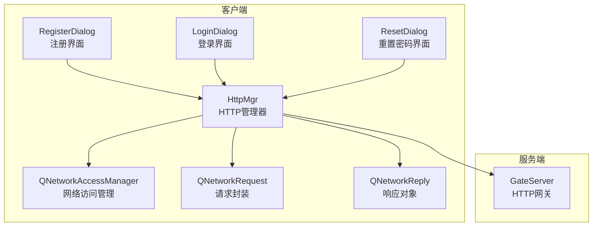
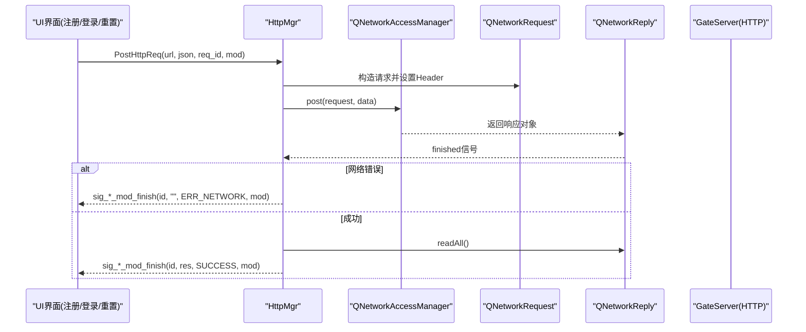
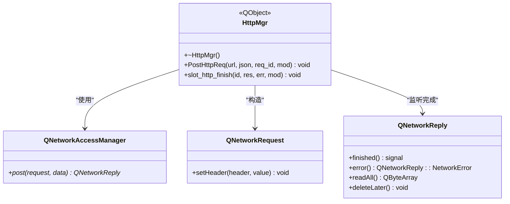
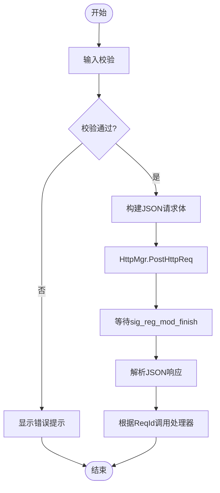
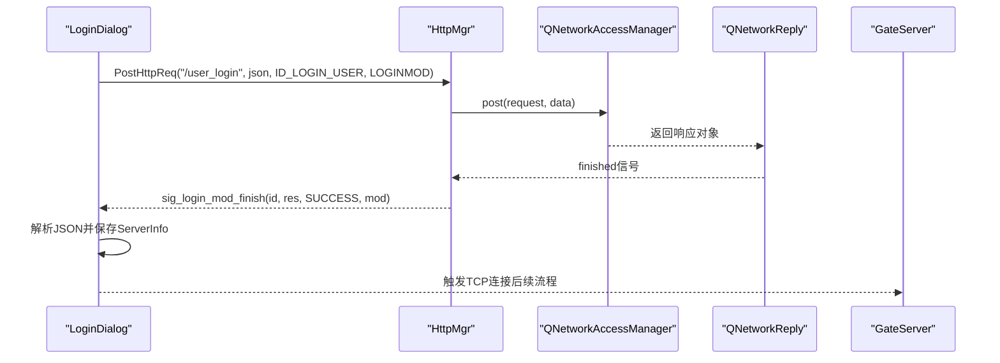
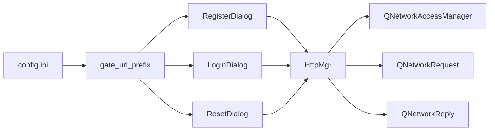

# HTTP通信

<cite>
**本文引用的文件**   
- [httpmgr.h](file://client/llfcchat/include/httpmgr.h)
- [httpmgr.cpp](file://client/llfcchat/src/httpmgr.cpp)
- [global.h](file://client/llfcchat/include/global.h)
- [singleton.h](file://client/llfcchat/include/singleton.h)
- [registerdialog.cpp](file://client/llfcchat/src/registerdialog.cpp)
- [logindialog.cpp](file://client/llfcchat/src/logindialog.cpp)
- [resetdialog.cpp](file://client/llfcchat/src/resetdialog.cpp)
- [config.ini](file://client/llfcchat/config/config.ini)
- [day02-客户端Http管理类设计.md](file://开发文档/day02-客户端Http管理类设计.md)
</cite>

## 目录
1. [简介](#简介)
2. [项目结构](#项目结构)
3. [核心组件](#核心组件)
4. [架构总览](#架构总览)
5. [详细组件分析](#详细组件分析)
6. [依赖关系分析](#依赖关系分析)
7. [性能与可靠性](#性能与可靠性)
8. [故障排查指南](#故障排查指南)
9. [结论](#结论)
10. [附录：接口与使用示例](#附录接口与使用示例)

## 简介
本章节面向LLFCChat客户端的HTTP通信模块，重点说明基于Qt Network的HttpManager（在代码中为HttpMgr）的实现方式、RESTful API调用模式、JSON数据序列化与错误处理机制。文档覆盖用户注册、登录、验证码获取等HTTP接口的调用流程，并给出GET/POST请求发起、异步响应处理、请求生命周期管理的实践要点。同时补充HTTPS支持、SSL证书验证和网络状态监控的建议方案，帮助初学者快速上手，也为有经验的开发者提供最佳实践参考。

## 项目结构
HTTP通信相关代码集中在客户端模块：
- 头文件定义位于 include/ 目录，包含 HttpMgr 类声明、全局枚举与类型定义、单例模板等。
- 实现位于 src/ 目录，包括 HttpMgr 的具体实现以及各业务对话框对 HttpMgr 的使用。
- 配置信息位于 config/ 目录，用于设置网关服务器地址与端口。

图表来源
- [httpmgr.h:11-31](file://client/llfcchat/include/httpmgr.h#L11-L31)
- [httpmgr.cpp:8-38](file://client/llfcchat/src/httpmgr.cpp#L8-L38)
- [registerdialog.cpp:106-111](file://client/llfcchat/src/registerdialog.cpp#L106-L111)
- [logindialog.cpp:189-195](file://client/llfcchat/src/logindialog.cpp#L189-L195)
- [resetdialog.cpp:59-64](file://client/llfcchat/src/resetdialog.cpp#L59-L64)

章节来源
- [httpmgr.h:11-31](file://client/llfcchat/include/httpmgr.h#L11-L31)
- [httpmgr.cpp:8-38](file://client/llfcchat/src/httpmgr.cpp#L8-L38)
- [config.ini:1-3](file://client/llfcchat/config/config.ini#L1-L3)

## 核心组件
- HttpMgr：基于Qt Network封装的HTTP请求管理器，采用单例模式，负责构造请求、发送POST、处理响应并通过信号槽分发到对应模块。
- 全局类型与枚举：ReqId、ErrorCodes、Modules 等，用于标识请求类型、错误码和模块归属。
- 单例模板 Singleton：保证HttpMgr全局唯一实例，线程安全初始化。
- 业务对话框：RegisterDialog、LoginDialog、ResetDialog 通过HttpMgr发起HTTP请求并处理响应。

章节来源
- [httpmgr.h:11-31](file://client/llfcchat/include/httpmgr.h#L11-L31)
- [global.h:43-101](file://client/llfcchat/include/global.h#L43-L101)
- [singleton.h:18-44](file://client/llfcchat/include/singleton.h#L18-L44)

## 架构总览
整体架构遵循“UI层 -> HttpMgr -> Qt Network -> 服务端”的分层设计：
- UI层（Register/Login/Reset）组装JSON请求体，调用HttpMgr::PostHttpReq发起请求。
- HttpMgr内部使用QNetworkAccessManager创建QNetworkRequest，设置Content-Type为application/json，发送POST请求。
- 通过QNetworkReply::finished信号回调处理响应，统一解析错误码与结果，再按模块分发信号给具体UI。

图表来源
- [httpmgr.cpp:8-38](file://client/llfcchat/src/httpmgr.cpp#L8-L38)
- [registerdialog.cpp:106-111](file://client/llfcchat/src/registerdialog.cpp#L106-L111)
- [logindialog.cpp:189-195](file://client/llfcchat/src/logindialog.cpp#L189-L195)
- [resetdialog.cpp:59-64](file://client/llfcchat/src/resetdialog.cpp#L59-L64)

## 详细组件分析

### HttpMgr类设计与实现
- 职责：封装HTTP POST请求、设置请求头、处理响应、错误分类、按模块分发完成信号。
- 关键成员：
  - QNetworkAccessManager _manager：底层网络访问管理器。
  - 信号：sig_http_finish（内部转发）、sig_reg_mod_finish、sig_reset_mod_finish、sig_login_mod_finish（按模块分发）。
  - 方法：PostHttpReq(QUrl, QJsonObject, ReqId, Modules)。
- 实现要点：
  - JSON序列化：使用QJsonDocument将QJsonObject序列化为字节数组作为请求体。
  - 请求头：设置ContentType为application/json，并设置ContentLength。
  - 异步处理：连接reply->finished信号，检查error，读取响应体，发出完成信号。
  - 资源释放：reply->deleteLater()确保响应对象在事件循环中安全销毁。
  - 模块路由：根据Modules枚举值决定发出哪个模块完成信号。

图表来源
- [httpmgr.h:11-31](file://client/llfcchat/include/httpmgr.h#L11-L31)
- [httpmgr.cpp:8-38](file://client/llfcchat/src/httpmgr.cpp#L8-L38)

章节来源
- [httpmgr.h:11-31](file://client/llfcchat/include/httpmgr.h#L11-L31)
- [httpmgr.cpp:8-38](file://client/llfcchat/src/httpmgr.cpp#L8-L38)

### 全局类型与错误码
- ReqId：标识不同请求类型，如ID_GET_VARIFY_CODE、ID_REG_USER、ID_LOGIN_USER等。
- ErrorCodes：SUCCESS、ERR_JSON、ERR_NETWORK。
- Modules：REGISTERMOD、RESETMOD、LOGINMOD，用于区分模块。
- 这些类型在业务对话框中用于构建请求体、选择处理器、判断错误分支。

章节来源
- [global.h:43-101](file://client/llfcchat/include/global.h#L43-L101)

### 单例模式
- Singleton<T>模板类提供线程安全的GetInstance()，确保HttpMgr全局唯一。
- 使用std::once_flag与std::call_once保证初始化只执行一次。

章节来源
- [singleton.h:18-44](file://client/llfcchat/include/singleton.h#L18-L44)

### 注册流程（RegisterDialog）
- 用户输入校验后，构造JSON请求体，调用HttpMgr::PostHttpReq发送验证码或注册用户请求。
- 接收sig_reg_mod_finish信号，解析JSON，根据ReqId调用对应处理器。
- 典型接口：
  - GET验证码：/get_varifycode（实际为POST JSON，字段email）
  - 注册用户：/user_register（POST JSON，字段user、email、passwd、sex、icon、nick、confirm、varifycode）

图表来源
- [registerdialog.cpp:106-111](file://client/llfcchat/src/registerdialog.cpp#L106-L111)
- [registerdialog.cpp:346-362](file://client/llfcchat/src/registerdialog.cpp#L346-L362)
- [registerdialog.cpp:113-139](file://client/llfcchat/src/registerdialog.cpp#L113-L139)

章节来源
- [registerdialog.cpp:106-111](file://client/llfcchat/src/registerdialog.cpp#L106-L111)
- [registerdialog.cpp:346-362](file://client/llfcchat/src/registerdialog.cpp#L346-L362)
- [registerdialog.cpp:113-139](file://client/llfcchat/src/registerdialog.cpp#L113-L139)

### 登录流程（LoginDialog）
- 用户输入邮箱与密码，校验通过后构造JSON请求体，调用HttpMgr::PostHttpReq发送登录请求。
- 接收sig_login_mod_finish信号，解析JSON，提取uid、token、聊天服务器与资源服务器信息。
- 成功后触发TCP连接逻辑，进入后续聊天与服务交互阶段。

图表来源
- [logindialog.cpp:189-195](file://client/llfcchat/src/logindialog.cpp#L189-L195)
- [logindialog.cpp:197-223](file://client/llfcchat/src/logindialog.cpp#L197-L223)

章节来源
- [logindialog.cpp:189-195](file://client/llfcchat/src/logindialog.cpp#L189-L195)
- [logindialog.cpp:197-223](file://client/llfcchat/src/logindialog.cpp#L197-L223)

### 重置密码流程（ResetDialog）
- 与注册类似，先获取验证码，然后提交重置密码请求。
- 使用相同的HttpMgr接口与错误处理模式。

章节来源
- [resetdialog.cpp:59-64](file://client/llfcchat/src/resetdialog.cpp#L59-L64)
- [resetdialog.cpp:66-92](file://client/llfcchat/src/resetdialog.cpp#L66-L92)

## 依赖关系分析
- HttpMgr依赖Qt Network库（QNetworkAccessManager、QNetworkRequest、QNetworkReply）。
- 业务对话框依赖HttpMgr单例进行HTTP通信。
- 全局类型（ReqId、ErrorCodes、Modules）被HttpMgr与业务对话框共同使用。
- 配置文件config.ini提供GateServer的地址与端口，供上层构造URL前缀。

图表来源
- [httpmgr.h:11-31](file://client/llfcchat/include/httpmgr.h#L11-L31)
- [registerdialog.cpp:106-111](file://client/llfcchat/src/registerdialog.cpp#L106-L111)
- [logindialog.cpp:189-195](file://client/llfcchat/src/logindialog.cpp#L189-L195)
- [resetdialog.cpp:59-64](file://client/llfcchat/src/resetdialog.cpp#L59-L64)
- [config.ini:1-3](file://client/llfcchat/config/config.ini#L1-L3)

章节来源
- [global.h:43-101](file://client/llfcchat/include/global.h#L43-L101)
- [config.ini:1-3](file://client/llfcchat/config/config.ini#L1-L3)

## 性能与可靠性
- 异步模型：基于Qt信号槽与QNetworkReply::finished，避免阻塞UI线程。
- 资源管理：reply->deleteLater()确保响应对象在事件循环中安全释放。
- 错误分类：ERR_NETWORK与ERR_JSON明确区分网络与解析错误，便于上层处理。
- 可扩展性：通过Modules与ReqId解耦模块与请求类型，新增接口只需扩展处理器映射。
- 建议优化：
  - 增加超时控制（QNetworkRequest::setTransferTimeout），避免长时间挂起。
  - 重试机制：对网络错误进行有限次重试，提升鲁棒性。
  - 日志与监控：记录请求耗时、错误码分布，辅助定位问题。

[本节为通用指导，不直接分析具体文件]

## 故障排查指南
- 网络错误：检查reply->error()是否为NoError；查看errorString输出；确认网络连通性与代理设置。
- JSON解析失败：确认响应体是否为合法JSON；检查字段名称与类型；必要时打印原始响应。
- 模块路由异常：确认Modules与ReqId匹配；检查信号槽连接是否正确建立。
- HTTPS与证书：若启用HTTPS，需确保系统信任根证书；可自定义QSslConfiguration进行调试。

章节来源
- [httpmgr.cpp:20-37](file://client/llfcchat/src/httpmgr.cpp#L20-L37)
- [registerdialog.cpp:113-139](file://client/llfcchat/src/registerdialog.cpp#L113-L139)
- [logindialog.cpp:197-223](file://client/llfcchat/src/logindialog.cpp#L197-L223)

## 结论
HttpMgr以简洁清晰的架构封装了Qt Network的HTTP能力，结合单例模式与信号槽机制，实现了高内聚、低耦合的HTTP通信模块。通过统一的错误码与模块路由，业务层可以专注于数据处理与UI交互。建议在现有基础上增强超时、重试与监控能力，并完善HTTPS与证书验证策略，以提升系统的健壮性与安全性。

[本节为总结，不直接分析具体文件]

## 附录：接口与使用示例

### RESTful API设计模式
- 使用HTTP动词表达操作语义，本项目主要使用POST传输JSON数据。
- 路径命名清晰，如/user_register、/user_login、/get_varifycode。
- 响应体统一包含error字段表示状态码，便于上层统一处理。

章节来源
- [registerdialog.cpp:106-111](file://client/llfcchat/src/registerdialog.cpp#L106-L111)
- [logindialog.cpp:189-195](file://client/llfcchat/src/logindialog.cpp#L189-L195)
- [resetdialog.cpp:59-64](file://client/llfcchat/src/resetdialog.cpp#L59-L64)

### JSON数据序列化
- 请求体：QJsonObject -> QJsonDocument::toJson() -> QByteArray。
- 响应体：QString -> toUtf8() -> QJsonDocument::fromJson() -> QJsonObject。
- 错误处理：检查jsonDoc.isNull()与isObject()，确保解析成功。

章节来源
- [httpmgr.cpp:10-15](file://client/llfcchat/src/httpmgr.cpp#L10-L15)
- [registerdialog.cpp:120-132](file://client/llfcchat/src/registerdialog.cpp#L120-L132)
- [logindialog.cpp:204-216](file://client/llfcchat/src/logindialog.cpp#L204-L216)

### 错误处理机制
- 网络错误：reply->error() != NoError时，返回ERR_NETWORK。
- JSON错误：解析失败时返回ERR_JSON。
- 业务错误：响应体中的error字段非SUCCESS时，上层提示参数错误。

章节来源
- [httpmgr.cpp:20-37](file://client/llfcchat/src/httpmgr.cpp#L20-L37)
- [registerdialog.cpp:113-139](file://client/llfcchat/src/registerdialog.cpp#L113-L139)
- [logindialog.cpp:197-223](file://client/llfcchat/src/logindialog.cpp#L197-L223)

### 发起GET/POST请求与异步响应
- POST请求：PostHttpReq(url, json, req_id, mod)，内部使用_manager.post()。
- 异步响应：连接reply->finished信号，处理完成后发出sig_*_mod_finish。
- 生命周期：构造请求 -> 发送 -> 监听完成 -> 读取响应 -> 清理资源。

章节来源
- [httpmgr.cpp:8-38](file://client/llfcchat/src/httpmgr.cpp#L8-L38)
- [day02-客户端Http管理类设计.md:176-208](file://开发文档/day02-客户端Http管理类设计.md#L176-L208)

### HTTPS支持与SSL证书验证
- 当前实现未显式配置QSslConfiguration，默认使用系统信任链。
- 如需自定义证书或禁用验证（仅调试），可在QNetworkRequest上设置QSslConfiguration。
- 生产环境建议启用HTTPS并严格验证证书，避免中间人攻击。

[本节为通用指导，不直接分析具体文件]

### 网络状态监控
- 可通过QNetworkAccessManager::networkAccessible()查询网络可达性。
- 监听QNetworkAccessManager::sslErrors信号处理SSL错误。
- 记录请求耗时与错误码，形成监控指标。

[本节为通用指导，不直接分析具体文件]

### 文件上传接口
- 当前HTTP模块主要用于JSON数据传输，文件上传通过TCP模块实现（见FileTcpMgr）。
- 若需HTTP文件上传，可使用multipart/form-data格式，但本项目未在该模块中实现。

[本节为通用指导，不直接分析具体文件]