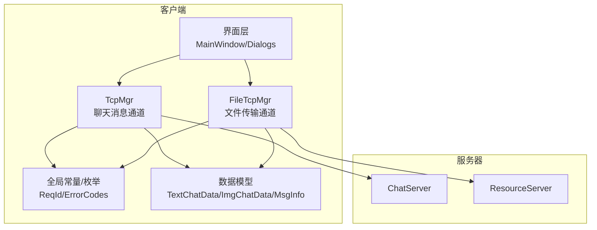
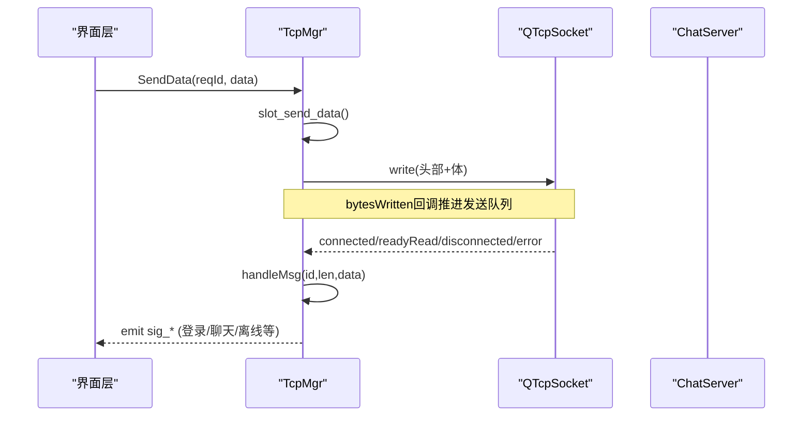
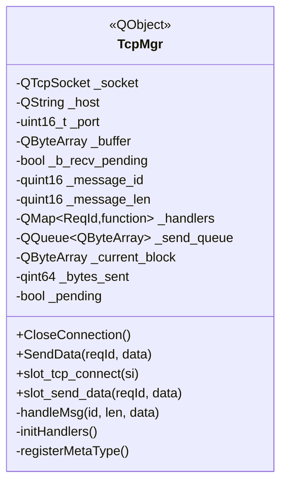
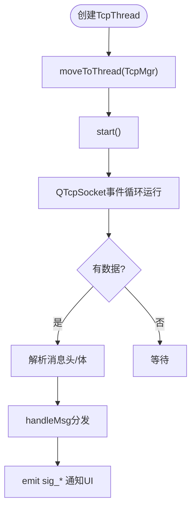
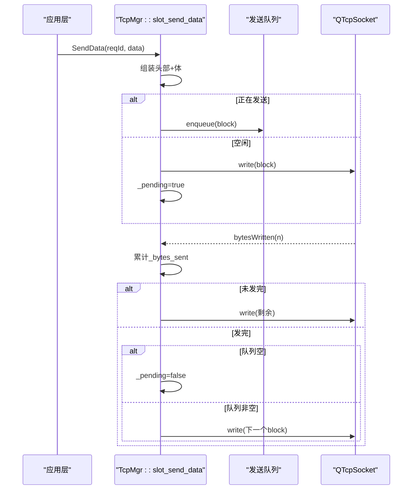
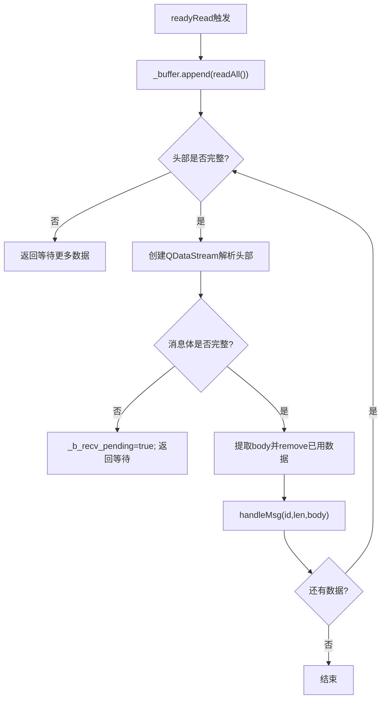
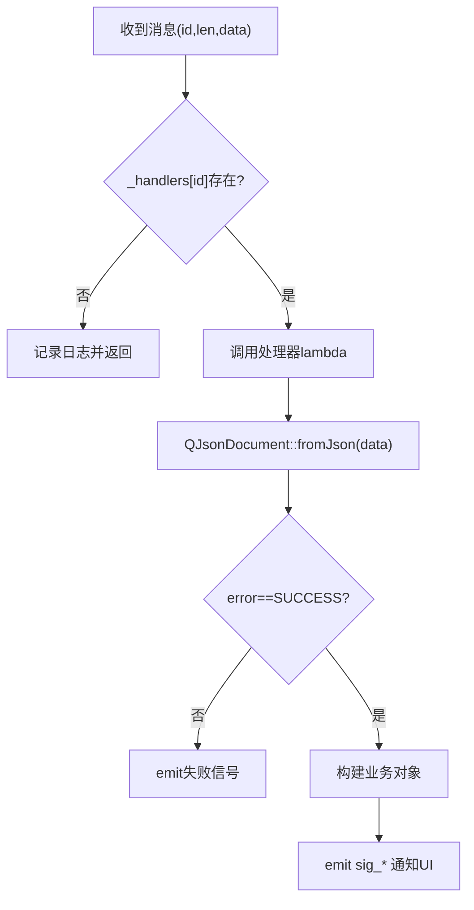
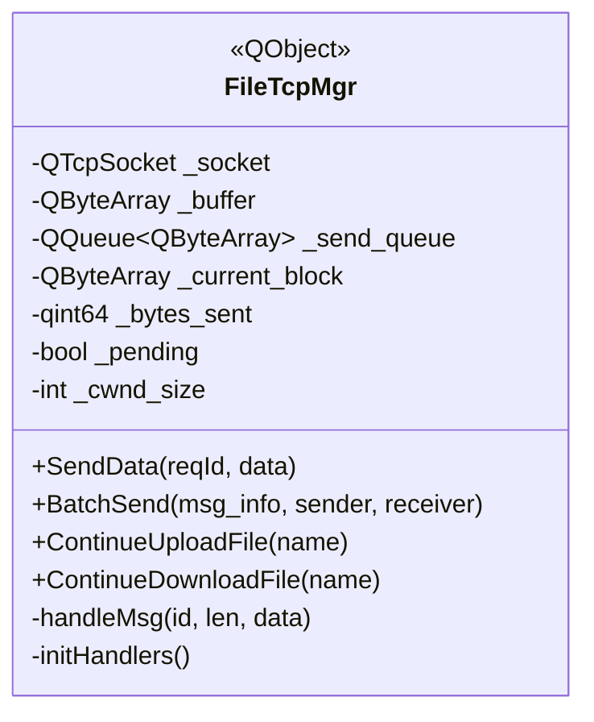
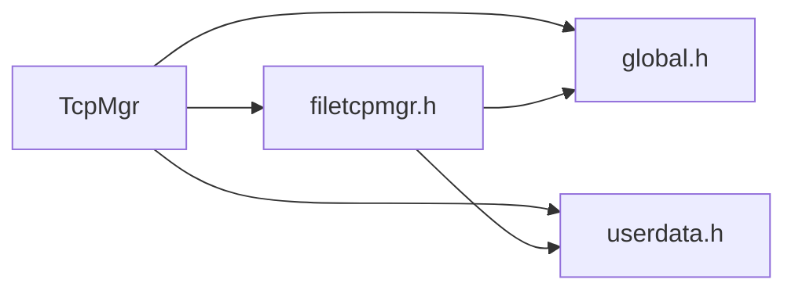

# TCP通信

<cite>
**本文引用的文件**   
- [tcpmgr.h](file://client/llfcchat/include/tcpmgr.h)
- [tcpmgr.cpp](file://client/llfcchat/src/tcpmgr.cpp)
- [global.h](file://client/llfcchat/include/global.h)
- [userdata.h](file://client/llfcchat/include/userdata.h)
- [filetcpmgr.h](file://client/llfcchat/include/filetcpmgr.h)
- [filetcpmgr.cpp](file://client/llfcchat/src/filetcpmgr.cpp)
- [day15-客户端Tcp管理类设计.md](file://开发文档/day15-客户端Tcp管理类设计.md)
- [day42-Qt粘包引发的血案.md](file://开发文档/day42-Qt粘包引发的血案.md)
</cite>

## 目录
1. [简介](#简介)
2. [项目结构](#项目结构)
3. [核心组件](#核心组件)
4. [架构总览](#架构总览)
5. [详细组件分析](#详细组件分析)
6. [依赖关系分析](#依赖关系分析)
7. [性能考量](#性能考量)
8. [故障排查指南](#故障排查指南)
9. [结论](#结论)
10. [附录](#附录)

## 简介
本文件面向LLFCChat客户端的TCP通信模块，围绕TcpMgr类展开，系统阐述基于QTcpSocket的异步网络编程模型、连接管理、消息处理机制与线程管理。文档同时覆盖：
- QTcpSocket的使用方式与事件驱动（connected/readyRead/disconnected/error）
- 信号槽机制与跨线程通信
- 自定义TCP协议格式、消息序列化与反序列化
- 粘包/半包处理策略与最佳实践
- 发送队列与背压控制
- 重连机制、错误处理与性能优化建议

内容兼顾初学者友好与资深开发者参考，提供代码级图示与路径引用，便于快速定位实现细节。

## 项目结构
与TCP通信相关的核心文件位于客户端工程内：
- 头文件定义：tcpmgr.h、global.h、userdata.h、filetcpmgr.h
- 实现文件：tcpmgr.cpp、filetcpmgr.cpp
- 设计文档：day15、day42等开发文档用于理解设计思路与踩坑经验

图表来源
- [tcpmgr.h:1-90](file://client/llfcchat/include/tcpmgr.h#L1-L90)
- [filetcpmgr.h:1-50](file://client/llfcchat/include/filetcpmgr.h#L1-L50)
- [global.h:43-88](file://client/llfcchat/include/global.h#L43-L88)
- [userdata.h:144-234](file://client/llfcchat/include/userdata.h#L144-L234)

章节来源
- [tcpmgr.h:1-90](file://client/llfcchat/include/tcpmgr.h#L1-L90)
- [filetcpmgr.h:1-50](file://client/llfcchat/include/filetcpmgr.h#L1-L50)
- [global.h:43-88](file://client/llfcchat/include/global.h#L43-L88)
- [userdata.h:144-234](file://client/llfcchat/include/userdata.h#L144-L234)

## 核心组件
- TcpMgr：负责聊天消息的长连接管理、收发、粘包处理、消息分发与UI信号通知
- FileTcpMgr：负责图片/文件传输的独立TCP通道，支持断点续传、分片上传下载
- 全局协议与类型：ReqId枚举、ErrorCodes、消息数据结构（TextChatData/ImgChatData/MsgInfo等）
- 线程封装：TcpThread/FileTcpThread将TcpMgr/FileTcpMgr迁移到独立线程，避免阻塞UI

章节来源
- [tcpmgr.h:14-87](file://client/llfcchat/include/tcpmgr.h#L14-L87)
- [filetcpmgr.h:17-50](file://client/llfcchat/include/filetcpmgr.h#L17-L50)
- [global.h:43-88](file://client/llfcchat/include/global.h#L43-L88)
- [userdata.h:144-234](file://client/llfcchat/include/userdata.h#L144-L234)

## 架构总览
TcpMgr采用“单例 + 事件驱动 + 信号槽”的架构：
- 使用QTcpSocket进行非阻塞I/O
- readyRead中累积数据并解析，按消息ID路由到对应处理器
- 通过QQueue实现发送队列，bytesWritten回调推进发送进度
- 所有网络IO在独立线程执行，避免阻塞主线程

图表来源
- [tcpmgr.cpp:1034-1079](file://client/llfcchat/src/tcpmgr.cpp#L1034-L1079)
- [tcpmgr.cpp:18-55](file://client/llfcchat/src/tcpmgr.cpp#L18-L55)
- [tcpmgr.cpp:1019-1028](file://client/llfcchat/src/tcpmgr.cpp#L1019-L1028)

章节来源
- [tcpmgr.cpp:18-136](file://client/llfcchat/src/tcpmgr.cpp#L18-L136)
- [tcpmgr.cpp:1034-1079](file://client/llfcchat/src/tcpmgr.cpp#L1034-L1079)

## 详细组件分析

### TcpMgr类设计与实现
- 职责
  - 维护一个QTcpSocket实例，建立/关闭连接
  - 接收数据时维护缓冲区，处理粘包/半包
  - 根据消息ID分发到不同处理器（登录、搜索、好友申请、聊天消息、心跳、加载会话/消息等）
  - 通过信号向UI层推送结果
- 关键成员
  - _socket: QTcpSocket
  - _buffer: 接收缓冲
  - _send_queue/_current_block/_bytes_sent/_pending: 发送队列与进度跟踪
  - _handlers: ReqId到处理函数的映射表
- 重要方法
  - slot_tcp_connect: 发起连接
  - slot_send_data: 组装消息头（ID+长度），写入队列或立即发送
  - handleMsg: 查找处理器并调用
  - CloseConnection: 关闭连接

图表来源
- [tcpmgr.h:22-87](file://client/llfcchat/include/tcpmgr.h#L22-L87)
- [tcpmgr.cpp:182-987](file://client/llfcchat/src/tcpmgr.cpp#L182-L987)

章节来源
- [tcpmgr.h:22-87](file://client/llfcchat/include/tcpmgr.h#L22-L87)
- [tcpmgr.cpp:182-987](file://client/llfcchat/src/tcpmgr.cpp#L182-L987)

### 线程管理与事件驱动
- TcpThread将TcpMgr对象移动到独立线程，确保网络IO不阻塞UI
- 信号槽跨线程安全传递数据，需提前注册元类型（registerMetaType）

图表来源
- [tcpmgr.cpp:1081-1094](file://client/llfcchat/src/tcpmgr.cpp#L1081-L1094)
- [tcpmgr.cpp:139-165](file://client/llfcchat/src/tcpmgr.cpp#L139-L165)

章节来源
- [tcpmgr.cpp:1081-1094](file://client/llfcchat/src/tcpmgr.cpp#L1081-L1094)
- [tcpmgr.cpp:139-165](file://client/llfcchat/src/tcpmgr.cpp#L139-L165)

### 发送流程与粘包处理
- 发送流程
  - 组装头部：消息ID（2字节）+ 长度（2字节），大端序
  - 追加消息体
  - 若正在发送则入队；否则直接write并标记_pending
  - bytesWritten回调更新已发送字节数，继续发送剩余部分或下一包
- 接收流程
  - readyRead中readAll追加到_buffer
  - 循环解析：先读头部（校验是否足够），再读消息体（校验是否完整）
  - 使用每次新建QDataStream避免读取位置错乱
  - 解析完成后调用handleMsg分发

图表来源
- [tcpmgr.cpp:1044-1079](file://client/llfcchat/src/tcpmgr.cpp#L1044-L1079)
- [tcpmgr.cpp:103-129](file://client/llfcchat/src/tcpmgr.cpp#L103-L129)

章节来源
- [tcpmgr.cpp:1044-1079](file://client/llfcchat/src/tcpmgr.cpp#L1044-L1079)
- [tcpmgr.cpp:103-129](file://client/llfcchat/src/tcpmgr.cpp#L103-L129)

### 接收流程与粘包/半包处理
- 关键点
  - 每次readyRead都readAll追加到缓冲区
  - 解析头部前检查缓冲区长度是否满足头部大小
  - 使用局部QDataStream对象，避免stream内部位置与buffer变化不一致
  - 解析消息体前检查是否完整，不足则等待下一次readyRead
  - 解析完成后从缓冲区移除已处理数据，继续处理后续消息（粘包）

图表来源
- [tcpmgr.cpp:18-55](file://client/llfcchat/src/tcpmgr.cpp#L18-L55)
- [day42-Qt粘包引发的血案.md:258-319](file://开发文档/day42-Qt粘包引发的血案.md#L258-L319)

章节来源
- [tcpmgr.cpp:18-55](file://client/llfcchat/src/tcpmgr.cpp#L18-L55)
- [day42-Qt粘包引发的血案.md:258-319](file://开发文档/day42-Qt粘包引发的血案.md#L258-L319)

### 消息处理器与JSON反序列化
- initHandlers中为每个ReqId注册lambda处理器
- 处理器统一模式：fromJson -> 检查error字段 -> 构造业务对象 -> emit信号给UI
- 典型处理器包括：登录响应、用户搜索、好友申请/认证、文本聊天消息、离线通知、心跳、加载会话/消息、图片聊天消息等

图表来源
- [tcpmgr.cpp:182-987](file://client/llfcchat/src/tcpmgr.cpp#L182-L987)

章节来源
- [tcpmgr.cpp:182-987](file://client/llfcchat/src/tcpmgr.cpp#L182-L987)

### 文件传输通道 FileTcpMgr
- 独立TCP通道，用于图片/文件上传下载
- 支持分片、断点续传、并发窗口控制（MAX_CWND_SIZE）
- 与TcpMgr类似的消息解析与发送队列机制

图表来源
- [filetcpmgr.h:26-50](file://client/llfcchat/include/filetcpmgr.h#L26-L50)
- [filetcpmgr.cpp:151-189](file://client/llfcchat/src/filetcpmgr.cpp#L151-L189)

章节来源
- [filetcpmgr.h:26-50](file://client/llfcchat/include/filetcpmgr.h#L26-L50)
- [filetcpmgr.cpp:151-189](file://client/llfcchat/src/filetcpmgr.cpp#L151-L189)

### 协议格式与序列化/反序列化
- 协议头部：消息ID（2字节，BigEndian）+ 消息长度（2字节，BigEndian）
- 消息体：JSON字符串（UTF-8）
- 发送：QDataStream设置BigEndian，写入ID和长度，再append数据体
- 接收：QDataStream解析头部，校验长度后截取消息体，再fromJson反序列化

章节来源
- [tcpmgr.cpp:1044-1079](file://client/llfcchat/src/tcpmgr.cpp#L1044-L1079)
- [tcpmgr.cpp:18-55](file://client/llfcchat/src/tcpmgr.cpp#L18-L55)
- [global.h:43-88](file://client/llfcchat/include/global.h#L43-L88)

## 依赖关系分析
- TcpMgr依赖：
  - global.h中的ReqId、ErrorCodes、MsgInfo等
  - userdata.h中的TextChatData/ImgChatData/ChatDataBase等
  - filetcpmgr.h用于图片/文件传输相关请求
- 信号槽依赖：
  - 跨线程信号槽需要qRegisterMetaType注册复杂类型
- 外部依赖：
  - Qt网络模块（QTcpSocket/QAbstractSocket）
  - JSON库（QJsonDocument/QJsonObject）

图表来源
- [tcpmgr.h:1-11](file://client/llfcchat/include/tcpmgr.h#L1-L11)
- [filetcpmgr.h:1-15](file://client/llfcchat/include/filetcpmgr.h#L1-L15)
- [global.h:43-88](file://client/llfcchat/include/global.h#L43-L88)
- [userdata.h:144-234](file://client/llfcchat/include/userdata.h#L144-L234)

章节来源
- [tcpmgr.h:1-11](file://client/llfcchat/include/tcpmgr.h#L1-L11)
- [filetcpmgr.h:1-15](file://client/llfcchat/include/filetcpmgr.h#L1-L15)
- [global.h:43-88](file://client/llfcchat/include/global.h#L43-L88)
- [userdata.h:144-234](file://client/llfcchat/include/userdata.h#L144-L234)

## 性能考量
- 发送队列与背压
  - 使用QQueue缓存待发包，避免阻塞write
  - bytesWritten回调推进发送，减少内存占用
- 粘包处理优化
  - 每次循环重新创建QDataStream，避免读取位置错乱
  - 使用_buffer.remove替代mid赋值，降低拷贝开销
- 并发与窗口控制
  - FileTcpMgr中引入_cwnd_size限制并发分片数量，防止拥塞
- 元类型注册
  - 集中registerMetaType，避免重复注册与运行时开销

章节来源
- [tcpmgr.cpp:103-129](file://client/llfcchat/src/tcpmgr.cpp#L103-L129)
- [tcpmgr.cpp:18-55](file://client/llfcchat/src/tcpmgr.cpp#L18-L55)
- [filetcpmgr.cpp:925-949](file://client/llfcchat/src/filetcpmgr.cpp#L925-L949)
- [tcpmgr.cpp:139-165](file://client/llfcchat/src/tcpmgr.cpp#L139-L165)

## 故障排查指南
- 常见问题
  - 粘包/半包导致解析错误：检查QDataStream是否在循环内重建、是否正确使用_buffer.remove
  - 连接失败：检查sig_con_success(false)分支，确认Host/Port配置
  - 断开连接：监听disconnected信号，必要时触发重连逻辑
  - JSON解析失败：检查error字段与fromJson返回值
- 调试建议
  - 打印_buffer.size()与_message_len，确认数据完整性
  - 在handleMsg入口打印id与len，确认路由正确
  - 使用断点观察bytesWritten回调推进情况

章节来源
- [tcpmgr.cpp:18-55](file://client/llfcchat/src/tcpmgr.cpp#L18-L55)
- [tcpmgr.cpp:1034-1079](file://client/llfcchat/src/tcpmgr.cpp#L1034-L1079)
- [day42-Qt粘包引发的血案.md:258-319](file://开发文档/day42-Qt粘包引发的血案.md#L258-L319)

## 结论
TcpMgr以QTcpSocket为核心，结合信号槽与事件驱动，实现了稳定可靠的聊天消息通道。通过发送队列、粘包处理与线程隔离，保证了高并发下的性能与稳定性。配合FileTcpMgr的文件传输通道，形成完整的客户端网络能力。遵循本文档的最佳实践，可有效避免常见陷阱并提升系统健壮性。

## 附录
- 示例：建立TCP连接、发送与接收数据、处理粘包
  - 建立连接：参见[连接流程:1034-1042](file://client/llfcchat/src/tcpmgr.cpp#L1034-L1042)
  - 发送数据：参见[发送流程:1044-1079](file://client/llfcchat/src/tcpmgr.cpp#L1044-L1079)
  - 接收与解析：参见[接收流程:18-55](file://client/llfcchat/src/tcpmgr.cpp#L18-L55)
  - 粘包处理要点：参见[粘包处理:258-319](file://开发文档/day42-Qt粘包引发的血案.md#L258-L319)
- 协议定义：参见[ReqId与错误码:43-88](file://client/llfcchat/include/global.h#L43-L88)
- 数据模型：参见[聊天数据模型:144-234](file://client/llfcchat/include/userdata.h#L144-L234)