# TCP通信

<cite>
**本文引用的文件**   
- [tcpmgr.h](file://client/llfcchat/include/tcpmgr.h)
- [tcpmgr.cpp](file://client/llfcchat/src/tcpmgr.cpp)
- [global.h](file://client/llfcchat/include/global.h)
- [userdata.h](file://client/llfcchat/include/userdata.h)
- [filetcpmgr.h](file://client/llfcchat/include/filetcpmgr.h)
- [filetcpmgr.cpp](file://client/llfcchat/src/filetcpmgr.cpp)
- [config.ini](file://client/llfcchat/config/config.ini)
- [day15-客户端Tcp管理类设计.md](file://开发文档/day15-客户端Tcp管理类设计.md)
- [day42-Qt粘包引发的血案.md](file://开发文档/day42-Qt粘包引发的血案.md)
</cite>

## 更新摘要
**所做更改**   
- 新增可靠消息投递系统章节，详细说明指数退避重试机制
- 更新消息处理器部分，增加冲突解决处理逻辑
- 添加持久化待处理请求管理机制说明
- 增强连接状态管理和重连机制描述
- 更新架构图和流程图以反映新的可靠投递功能

## 目录
1. [简介](#简介)
2. [项目结构](#项目结构)
3. [核心组件](#核心组件)
4. [架构总览](#架构总览)
5. [详细组件分析](#详细组件分析)
6. [可靠消息投递系统](#可靠消息投递系统)
7. [依赖关系分析](#依赖关系分析)
8. [性能考量](#性能考量)
9. [故障排查指南](#故障排查指南)
10. [结论](#结论)
11. [附录](#附录)

## 简介
本文件面向LLFCChat客户端的TCP通信模块，围绕TcpMgr类展开，系统阐述基于QTcpSocket的异步网络编程模型、连接管理、消息处理机制与线程管理。文档同时覆盖：
- QTcpSocket的使用方式与事件驱动（connected/readyRead/disconnected/error）
- 信号槽机制与跨线程通信
- 自定义TCP协议格式、消息序列化与反序列化
- 粘包/半包处理策略与最佳实践
- 发送队列与背压控制
- **新增：完整可靠消息投递系统，包括指数退避重试、持久化待处理请求、冲突解决处理**
- 重连机制、错误处理与性能优化建议

内容兼顾初学者友好与资深开发者参考，提供代码级图示与路径引用，便于快速定位实现细节。

## 项目结构
与TCP通信相关的核心文件位于客户端工程内：
- 头文件定义：tcpmgr.h、global.h、userdata.h、filetcpmgr.h
- 实现文件：tcpmgr.cpp、filetcpmgr.cpp
- 配置文件：config.ini（包含Delivery配置）
- 设计文档：day15、day42等开发文档用于理解设计思路与踩坑经验

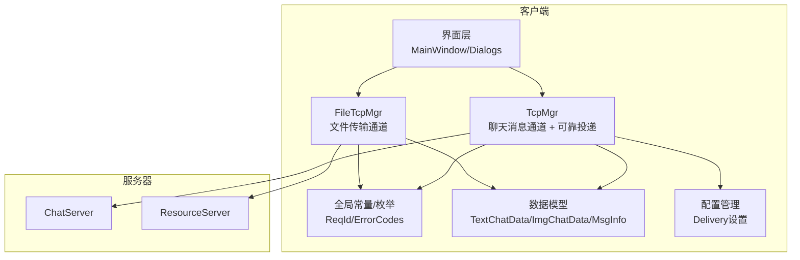

**图表来源**
- [tcpmgr.h:1-123](file://client/llfcchat/include/tcpmgr.h#L1-L123)
- [filetcpmgr.h:1-50](file://client/llfcchat/include/filetcpmgr.h#L1-L50)
- [global.h:43-104](file://client/llfcchat/include/global.h#L43-L104)
- [config.ini:5-11](file://client/llfcchat/config/config.ini#L5-L11)

**章节来源**
- [tcpmgr.h:1-123](file://client/llfcchat/include/tcpmgr.h#L1-L123)
- [filetcpmgr.h:1-50](file://client/llfcchat/include/filetcpmgr.h#L1-L50)
- [global.h:43-104](file://client/llfcchat/include/global.h#L43-L104)
- [config.ini:5-11](file://client/llfcchat/config/config.ini#L5-L11)

## 核心组件
- **TcpMgr**：负责聊天消息的长连接管理、收发、粘包处理、消息分发与UI信号通知，**新增可靠消息投递功能**
- **FileTcpMgr**：负责图片/文件传输的独立TCP通道，支持断点续传、分片上传下载
- **全局协议与类型**：ReqId枚举、ErrorCodes、消息数据结构（TextChatData/ImgChatData/MsgInfo等）
- **线程封装**：TcpThread/FileTcpThread将TcpMgr/FileTcpMgr迁移到独立线程，避免阻塞UI
- **配置管理**：Delivery相关配置参数，控制重试行为和离线消息拉取策略

**章节来源**
- [tcpmgr.h:24-120](file://client/llfcchat/include/tcpmgr.h#L24-L120)
- [filetcpmgr.h:17-50](file://client/llfcchat/include/filetcpmgr.h#L17-L50)
- [global.h:43-104](file://client/llfcchat/include/global.h#L43-L104)
- [config.ini:5-11](file://client/llfcchat/config/config.ini#L5-L11)

## 架构总览
TcpMgr采用"单例 + 事件驱动 + 信号槽 + 可靠投递"的架构：
- 使用QTcpSocket进行非阻塞I/O
- readyRead中累积数据并解析，按消息ID路由到对应处理器
- 通过QQueue实现发送队列，bytesWritten回调推进发送进度
- **新增：指数退避重试机制，确保消息最终送达**
- **新增：持久化待处理请求，应用重启后恢复**
- **新增：冲突解决处理，区分临时错误和永久冲突**
- 所有网络IO在独立线程执行，避免阻塞主线程

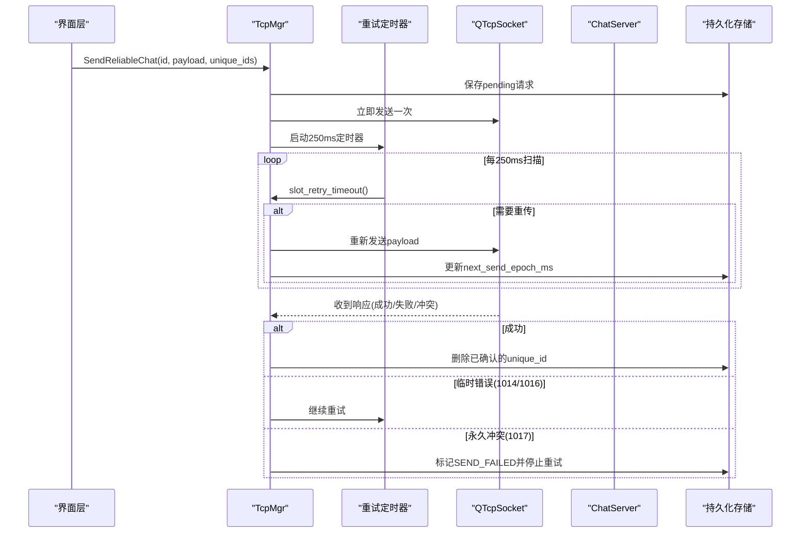

**图表来源**
- [tcpmgr.cpp:1170-1184](file://client/llfcchat/src/tcpmgr.cpp#L1170-L1184)
- [tcpmgr.cpp:1206-1231](file://client/llfcchat/src/tcpmgr.cpp#L1206-L1231)
- [tcpmgr.cpp:1233-1260](file://client/llfcchat/src/tcpmgr.cpp#L1233-L1260)

**章节来源**
- [tcpmgr.cpp:1170-1231](file://client/llfcchat/src/tcpmgr.cpp#L1170-L1231)
- [tcpmgr.cpp:1233-1260](file://client/llfcchat/src/tcpmgr.cpp#L1233-L1260)

## 详细组件分析

### TcpMgr类设计与实现
- **职责**
  - 维护一个QTcpSocket实例，建立/关闭连接
  - 接收数据时维护缓冲区，处理粘包/半包
  - 根据消息ID分发到不同处理器（登录、搜索、好友申请、聊天消息、心跳、加载会话/消息等）
  - 通过信号向UI层推送结果
  - **新增：可靠消息投递，确保消息最终送达**
  - **新增：持久化待处理请求，支持应用重启恢复**
- **关键成员**
  - _socket: QTcpSocket
  - _buffer: 接收缓冲
  - _send_queue/_current_block/_bytes_sent/_pending: 发送队列与进度跟踪
  - _handlers: ReqId到处理函数的映射表
  - **_retry_timer: 250ms重试扫描定时器**
  - **_pending_requests: 待重传请求列表**
  - **_delivery_uid: 当前用户ID，用于隔离不同账号的pending请求**
  - **_retry_initial_ms/_retry_max_ms: 重试退避配置**
- **重要方法**
  - slot_tcp_connect: 发起连接
  - slot_send_data: 组装消息头（ID+长度），写入队列或立即发送
  - handleMsg: 查找处理器并调用
  - CloseConnection: 关闭连接
  - **SendReliableChat: 可靠发送接口**
  - **slot_send_reliable_chat: 可靠发送槽函数**
  - **slot_retry_timeout: 重试超时处理**
  - **addPendingRequest: 添加待处理请求**
  - **persistPendingRequests: 持久化待处理请求**
  - **restorePendingRequests: 恢复待处理请求**

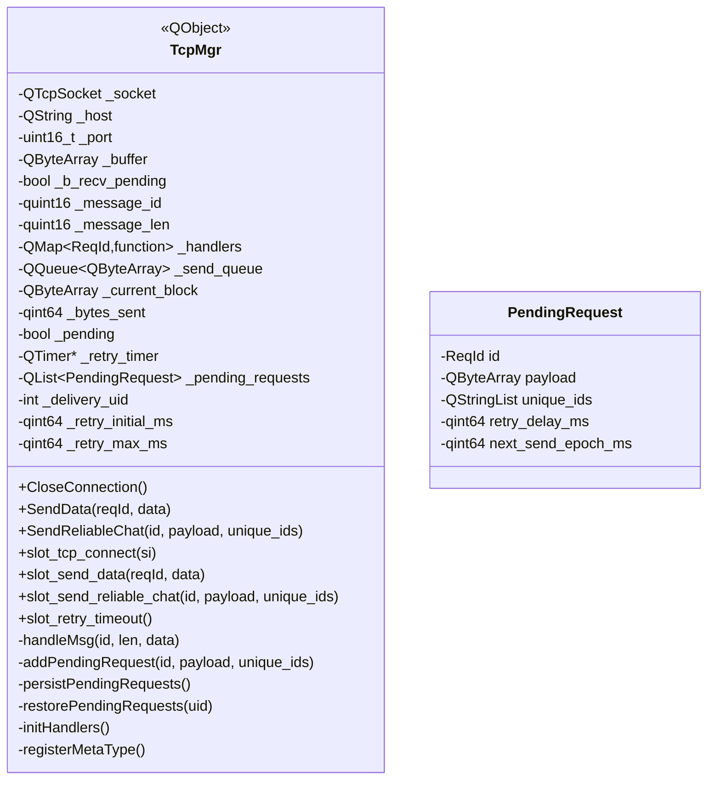

**图表来源**
- [tcpmgr.h:24-120](file://client/llfcchat/include/tcpmgr.h#L24-L120)
- [tcpmgr.cpp:1148-1554](file://client/llfcchat/src/tcpmgr.cpp#L1148-L1554)

**章节来源**
- [tcpmgr.h:24-120](file://client/llfcchat/include/tcpmgr.h#L24-L120)
- [tcpmgr.cpp:1148-1554](file://client/llfcchat/src/tcpmgr.cpp#L1148-L1554)

### 线程管理与事件驱动
- TcpThread将TcpMgr对象移动到独立线程，确保网络IO不阻塞UI
- 信号槽跨线程安全传递数据，需提前注册元类型（registerMetaType）
- **重试定时器在TCP线程中运行，确保线程安全**

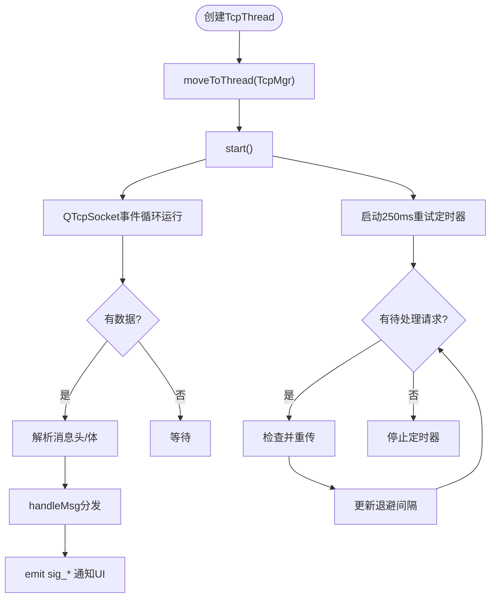

**图表来源**
- [tcpmgr.cpp:1081-1094](file://client/llfcchat/src/tcpmgr.cpp#L1081-L1094)
- [tcpmgr.cpp:146-148](file://client/llfcchat/src/tcpmgr.cpp#L146-L148)
- [tcpmgr.cpp:1206-1231](file://client/llfcchat/src/tcpmgr.cpp#L1206-L1231)

**章节来源**
- [tcpmgr.cpp:1081-1094](file://client/llfcchat/src/tcpmgr.cpp#L1081-L1094)
- [tcpmgr.cpp:146-148](file://client/llfcchat/src/tcpmgr.cpp#L146-L148)
- [tcpmgr.cpp:1206-1231](file://client/llfcchat/src/tcpmgr.cpp#L1206-L1231)

### 发送流程与粘包处理
- **发送流程**
  - 组装头部：消息ID（2字节）+ 长度（2字节），大端序
  - 追加消息体
  - 若正在发送则入队；否则直接write并标记_pending
  - bytesWritten回调更新已发送字节数，继续发送剩余部分或下一包
- **接收流程**
  - readyRead中readAll追加到_buffer
  - 循环解析：先读头部（校验是否足够），再读消息体（校验是否完整）
  - 使用每次新建QDataStream避免读取位置错乱
  - 解析完成后调用handleMsg分发

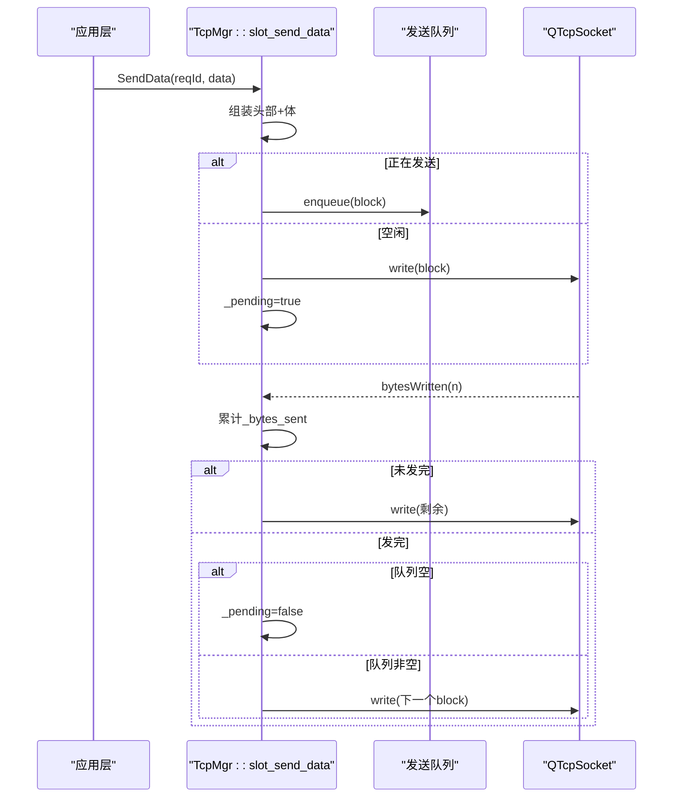

**图表来源**
- [tcpmgr.cpp:1111-1146](file://client/llfcchat/src/tcpmgr.cpp#L1111-L1146)
- [tcpmgr.cpp:112-138](file://client/llfcchat/src/tcpmgr.cpp#L112-L138)

**章节来源**
- [tcpmgr.cpp:1111-1146](file://client/llfcchat/src/tcpmgr.cpp#L1111-L1146)
- [tcpmgr.cpp:112-138](file://client/llfcchat/src/tcpmgr.cpp#L112-L138)

### 接收流程与粘包/半包处理
- **关键点**
  - 每次readyRead都readAll追加到缓冲区
  - 解析头部前检查缓冲区长度是否满足头部大小
  - 使用局部QDataStream对象，避免stream内部位置与buffer变化不一致
  - 解析消息体前检查是否完整，不足则等待下一次readyRead
  - 解析完成后从缓冲区移除已处理数据，继续处理后续消息（粘包）

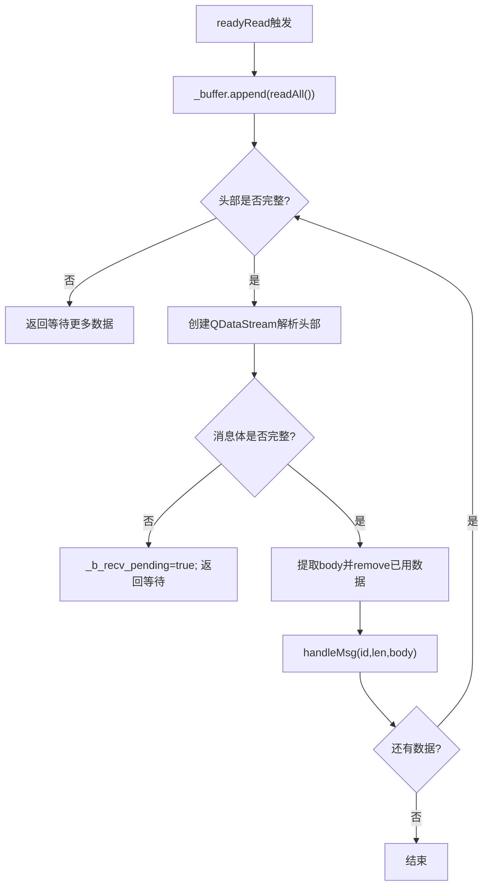

**图表来源**
- [tcpmgr.cpp:23-59](file://client/llfcchat/src/tcpmgr.cpp#L23-L59)
- [day42-Qt粘包引发的血案.md:258-319](file://开发文档/day42-Qt粘包引发的血案.md#L258-L319)

**章节来源**
- [tcpmgr.cpp:23-59](file://client/llfcchat/src/tcpmgr.cpp#L23-L59)
- [day42-Qt粘包引发的血案.md:258-319](file://开发文档/day42-Qt粘包引发的血案.md#L258-L319)

### 消息处理器与JSON反序列化
- initHandlers中为每个ReqId注册lambda处理器
- 处理器统一模式：fromJson -> 检查error字段 -> 构造业务对象 -> emit信号给UI
- **新增：冲突处理逻辑，区分临时错误和永久冲突**
- 典型处理器包括：登录响应、用户搜索、好友申请/认证、文本聊天消息、离线通知、心跳、加载会话/消息、图片聊天消息等

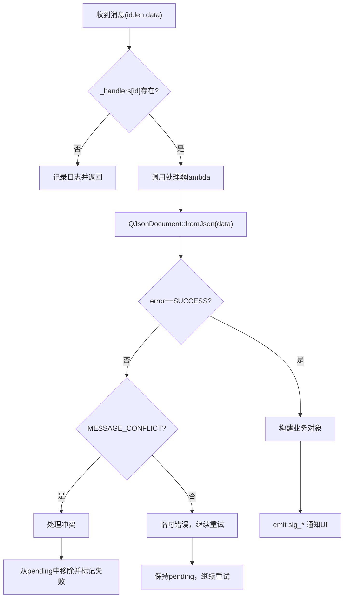

**图表来源**
- [tcpmgr.cpp:206-1054](file://client/llfcchat/src/tcpmgr.cpp#L206-L1054)
- [tcpmgr.cpp:1363-1480](file://client/llfcchat/src/tcpmgr.cpp#L1363-L1480)

**章节来源**
- [tcpmgr.cpp:206-1054](file://client/llfcchat/src/tcpmgr.cpp#L206-L1054)
- [tcpmgr.cpp:1363-1480](file://client/llfcchat/src/tcpmgr.cpp#L1363-L1480)

### 文件传输通道 FileTcpMgr
- 独立TCP通道，用于图片/文件上传下载
- 支持分片、断点续传、并发窗口控制（MAX_CWND_SIZE）
- 与TcpMgr类似的消息解析与发送队列机制

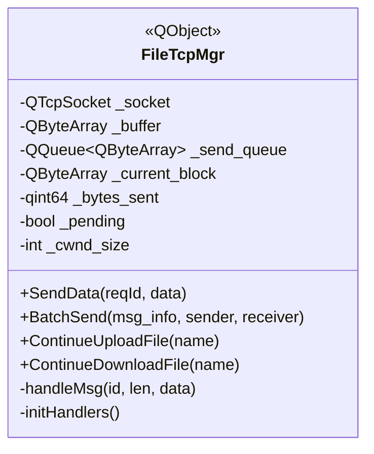

**图表来源**
- [filetcpmgr.h:26-50](file://client/llfcchat/include/filetcpmgr.h#L26-L50)
- [filetcpmgr.cpp:151-189](file://client/llfcchat/src/filetcpmgr.cpp#L151-L189)

**章节来源**
- [filetcpmgr.h:26-50](file://client/llfcchat/include/filetcpmgr.h#L26-L50)
- [filetcpmgr.cpp:151-189](file://client/llfcchat/src/filetcpmgr.cpp#L151-L189)

### 协议格式与序列化/反序列化
- 协议头部：消息ID（2字节，BigEndian）+ 消息长度（2字节，BigEndian）
- 消息体：JSON字符串（UTF-8）
- 发送：QDataStream设置BigEndian，写入ID和长度，再append数据体
- 接收：QDataStream解析头部，校验长度后截取消息体，再fromJson反序列化

**章节来源**
- [tcpmgr.cpp:1111-1146](file://client/llfcchat/src/tcpmgr.cpp#L1111-L1146)
- [tcpmgr.cpp:23-59](file://client/llfcchat/src/tcpmgr.cpp#L23-L59)
- [global.h:43-104](file://client/llfcchat/include/global.h#L43-L104)

## 可靠消息投递系统

### 指数退避重试机制
- **核心原理**：当消息发送失败时，按照指数增长的重试间隔重新发送，直到达到最大重试次数或收到成功响应
- **配置参数**：
  - RequestRetryInitialMs：初始重试间隔（默认2000ms）
  - RequestRetryMaxMs：最大重试间隔（默认30000ms）
- **实现机制**：
  - 250ms定时器扫描待重传请求
  - 对每个请求计算下次发送时间
  - 重试间隔按2倍增长，但不超过最大值
  - 连接断开时暂停定时器，重连后恢复

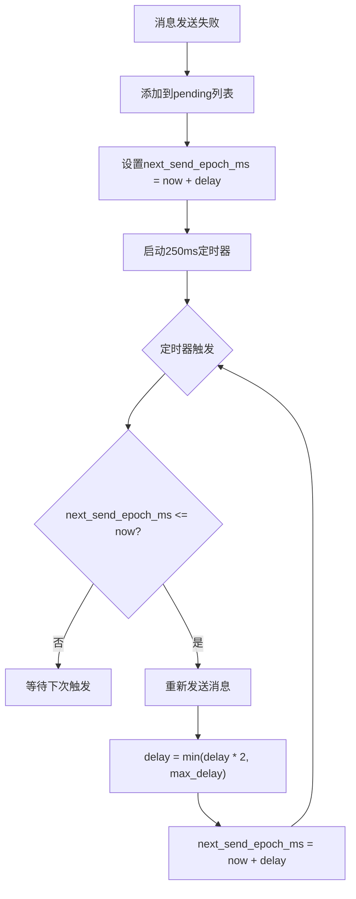

**图表来源**
- [tcpmgr.cpp:1206-1231](file://client/llfcchat/src/tcpmgr.cpp#L1206-L1231)
- [config.ini:5-7](file://client/llfcchat/config/config.ini#L5-L7)

**章节来源**
- [tcpmgr.cpp:1206-1231](file://client/llfcchat/src/tcpmgr.cpp#L1206-L1231)
- [config.ini:5-7](file://client/llfcchat/config/config.ini#L5-L7)

### 持久化待处理请求管理
- **存储机制**：使用QSettings将pending请求序列化为JSON存储到用户配置目录
- **用户隔离**：按uid_key（如uid_123/requests）隔离不同用户的pending请求
- **恢复机制**：
  - 登录成功后自动恢复同uid的pending请求
  - 切换用户时清空内存并加载新用户的pending请求
  - 不同账号绝不互载pending请求
- **数据结构**：
  - id：消息类型（ReqId）
  - payload：原始JSON负载
  - unique_ids：客户端唯一标识列表
  - retry_delay_ms：当前退避间隔
  - next_send_epoch_ms：下次发送时刻

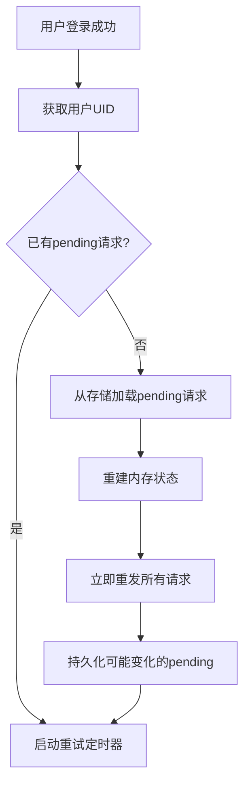

**图表来源**
- [tcpmgr.cpp:1262-1345](file://client/llfcchat/src/tcpmgr.cpp#L1262-L1345)
- [tcpmgr.cpp:1233-1260](file://client/llfcchat/src/tcpmgr.cpp#L1233-L1260)

**章节来源**
- [tcpmgr.cpp:1262-1345](file://client/llfcchat/src/tcpmgr.cpp#L1262-L1345)
- [tcpmgr.cpp:1233-1260](file://client/llfcchat/src/tcpmgr.cpp#L1233-L1260)

### 冲突解决处理
- **冲突类型**：
  - 临时错误（1014/1016）：消息存储失败、服务器繁忙，继续重试
  - 永久冲突（1017）：消息内容冲突，停止重试并标记发送失败
- **文本消息冲突处理**：
  - 支持批量回滚（conflict_ids为空时整批停止）
  - 支持精确匹配（按conflict_unique_ids停止特定item）
  - 构造失败TextChatData并通过sig_chat_msg_rsp信号通知UI
- **图片消息冲突处理**：
  - 通过unique_id精确定位冲突消息
  - 构造失败ImgChatData并通过sig_chat_img_rsp信号通知UI
  - 支持从UserMgr获取文件信息进行状态更新

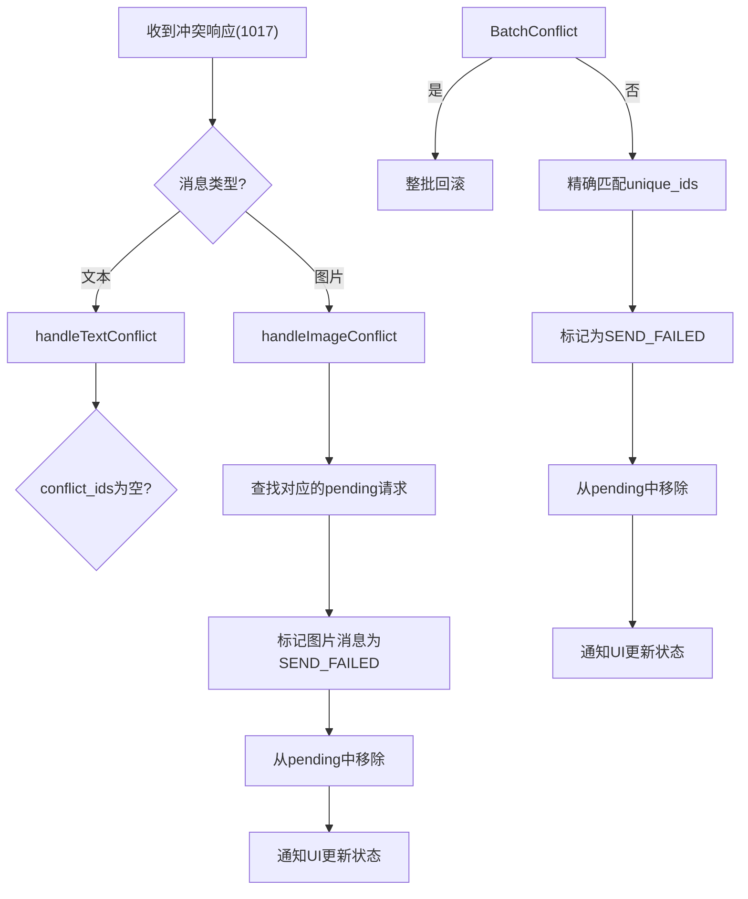

**图表来源**
- [tcpmgr.cpp:1363-1480](file://client/llfcchat/src/tcpmgr.cpp#L1363-L1480)

**章节来源**
- [tcpmgr.cpp:1363-1480](file://client/llfcchat/src/tcpmgr.cpp#L1363-L1480)

### 连接状态管理
- **连接生命周期**：
  - 连接建立：启动重试定时器（如果有pending请求）
  - 连接断开：暂停重试定时器，保留内存中的pending请求
  - 连接恢复：重新启动定时器，继续重试pending请求
- **状态同步**：
  - 连接状态变化时检查pending请求
  - 无pending请求时停止定时器节省资源
  - 连接不可用时避免无效重试

**章节来源**
- [tcpmgr.cpp:99-107](file://client/llfcchat/src/tcpmgr.cpp#L99-L107)
- [tcpmgr.cpp:1206-1231](file://client/llfcchat/src/tcpmgr.cpp#L1206-L1231)

## 依赖关系分析
- TcpMgr依赖：
  - global.h中的ReqId、ErrorCodes、MsgInfo等
  - userdata.h中的TextChatData/ImgChatData/ChatDataBase等
  - filetcpmgr.h用于图片/文件传输相关请求
  - **config.ini中的Delivery配置**
- 信号槽依赖：
  - 跨线程信号槽需要qRegisterMetaType注册复杂类型
- 外部依赖：
  - Qt网络模块（QTcpSocket/QAbstractSocket）
  - JSON库（QJsonDocument/QJsonObject）
  - **QSettings用于持久化存储**

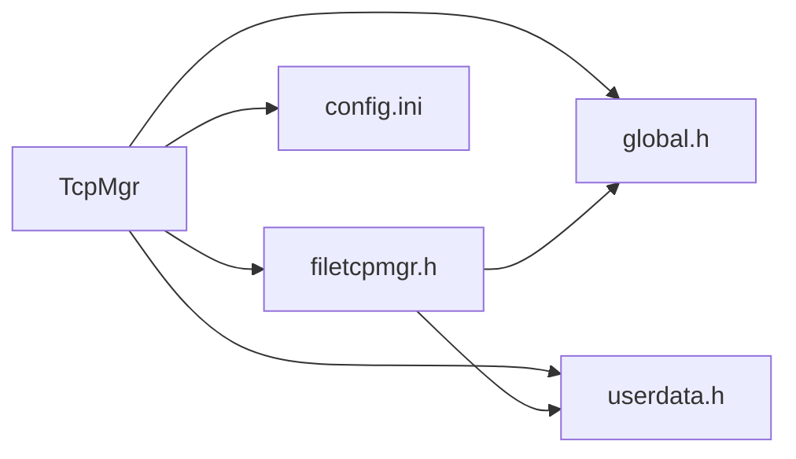

**图表来源**
- [tcpmgr.h:1-11](file://client/llfcchat/include/tcpmgr.h#L1-L11)
- [filetcpmgr.h:1-15](file://client/llfcchat/include/filetcpmgr.h#L1-L15)
- [global.h:43-104](file://client/llfcchat/include/global.h#L43-L104)
- [config.ini:5-11](file://client/llfcchat/config/config.ini#L5-L11)

**章节来源**
- [tcpmgr.h:1-11](file://client/llfcchat/include/tcpmgr.h#L1-L11)
- [filetcpmgr.h:1-15](file://client/llfcchat/include/filetcpmgr.h#L1-L15)
- [global.h:43-104](file://client/llfcchat/include/global.h#L43-L104)
- [config.ini:5-11](file://client/llfcchat/config/config.ini#L5-L11)

## 性能考量
- **发送队列与背压**
  - 使用QQueue缓存待发包，避免阻塞write
  - bytesWritten回调推进发送，减少内存占用
- **粘包处理优化**
  - 每次循环重新创建QDataStream，避免读取位置错乱
  - 使用_buffer.remove替代mid赋值，降低拷贝开销
- **并发与窗口控制**
  - FileTcpMgr中引入_cwnd_size限制并发分片数量，防止拥塞
- **元类型注册**
  - 集中registerMetaType，避免重复注册与运行时开销
- **可靠投递优化**
  - 指数退避避免网络拥塞
  - 250ms定时器批量处理，减少CPU占用
  - 持久化存储避免内存泄漏
  - 用户隔离确保多账号场景下的数据安全

**章节来源**
- [tcpmgr.cpp:112-138](file://client/llfcchat/src/tcpmgr.cpp#L112-L138)
- [tcpmgr.cpp:23-59](file://client/llfcchat/src/tcpmgr.cpp#L23-L59)
- [tcpmgr.cpp:1206-1231](file://client/llfcchat/src/tcpmgr.cpp#L1206-L1231)
- [tcpmgr.cpp:146-148](file://client/llfcchat/src/tcpmgr.cpp#L146-L148)

## 故障排查指南
- **常见问题**
  - 粘包/半包导致解析错误：检查QDataStream是否在循环内重建、是否正确使用_buffer.remove
  - 连接失败：检查sig_con_success(false)分支，确认Host/Port配置
  - 断开连接：监听disconnected信号，必要时触发重连逻辑
  - JSON解析失败：检查error字段与fromJson返回值
  - **可靠投递问题**：检查pending请求是否正确持久化、重试定时器是否正常运行
  - **冲突处理异常**：检查conflict_unique_ids是否正确解析、pending请求是否正确清理
- **调试建议**
  - 打印_buffer.size()与_message_len，确认数据完整性
  - 在handleMsg入口打印id与len，确认路由正确
  - 使用断点观察bytesWritten回调推进情况
  - **监控pending请求数量和重试间隔变化**
  - **检查QSettings存储的pending请求数据**
  - **验证冲突处理逻辑是否正确标记消息状态**

**章节来源**
- [tcpmgr.cpp:23-59](file://client/llfcchat/src/tcpmgr.cpp#L23-L59)
- [tcpmgr.cpp:112-138](file://client/llfcchat/src/tcpmgr.cpp#L112-L138)
- [tcpmgr.cpp:1206-1231](file://client/llfcchat/src/tcpmgr.cpp#L1206-L1231)
- [tcpmgr.cpp:1233-1260](file://client/llfcchat/src/tcpmgr.cpp#L1233-L1260)
- [tcpmgr.cpp:1363-1480](file://client/llfcchat/src/tcpmgr.cpp#L1363-L1480)

## 结论
TcpMgr以QTcpSocket为核心，结合信号槽与事件驱动，实现了稳定可靠的聊天消息通道。**新增的可靠消息投递系统显著增强了消息传输的可靠性**，通过指数退避重试、持久化待处理请求和冲突解决处理，确保消息最终送达。配合FileTcpMgr的文件传输通道，形成完整的客户端网络能力。遵循本文档的最佳实践，可有效避免常见陷阱并提升系统健壮性。

## 附录
- **示例：建立TCP连接、发送与接收数据、处理粘包**
  - 建立连接：参见[连接流程:1101-1109](file://client/llfcchat/src/tcpmgr.cpp#L1101-L1109)
  - 发送数据：参见[发送流程:1111-1146](file://client/llfcchat/src/tcpmgr.cpp#L1111-L1146)
  - 接收与解析：参见[接收流程:23-59](file://client/llfcchat/src/tcpmgr.cpp#L23-L59)
  - 粘包处理要点：参见[粘包处理:258-319](file://开发文档/day42-Qt粘包引发的血案.md#L258-L319)
- **可靠消息投递示例**
  - 可靠发送：参见[SendReliableChat:193-198](file://client/llfcchat/src/tcpmgr.cpp#L193-L198)
  - 重试机制：参见[重试处理:1206-1231](file://client/llfcchat/src/tcpmgr.cpp#L1206-L1231)
  - 持久化存储：参见[持久化:1233-1260](file://client/llfcchat/src/tcpmgr.cpp#L1233-L1260)
  - 冲突处理：参见[冲突处理:1363-1480](file://client/llfcchat/src/tcpmgr.cpp#L1363-L1480)
- **协议定义**：参见[ReqId与错误码:43-104](file://client/llfcchat/include/global.h#L43-L104)
- **数据模型**：参见[聊天数据模型:144-234](file://client/llfcchat/include/userdata.h#L144-L234)
- **配置参数**：参见[Delivery配置:5-11](file://client/llfcchat/config/config.ini#L5-L11)