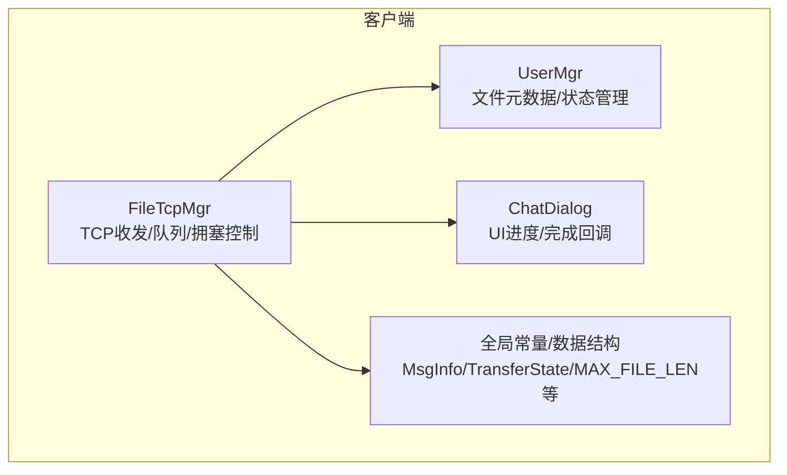
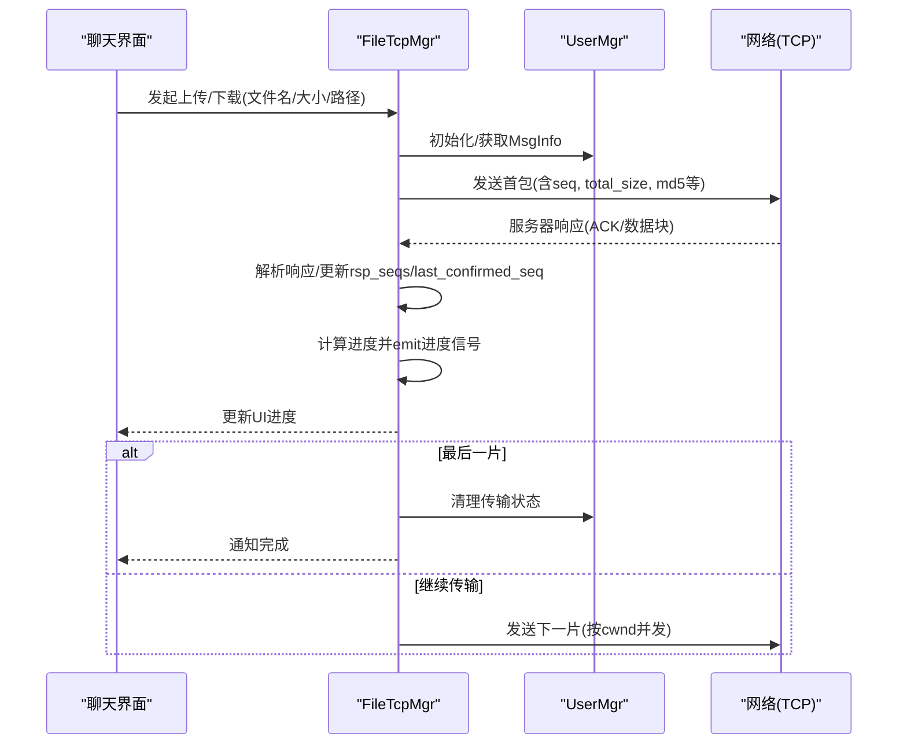
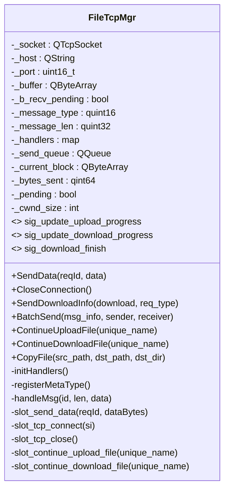
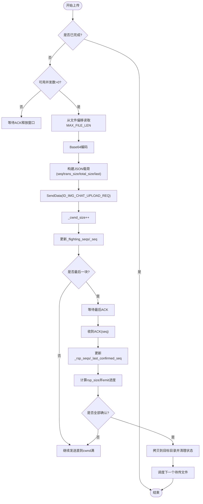
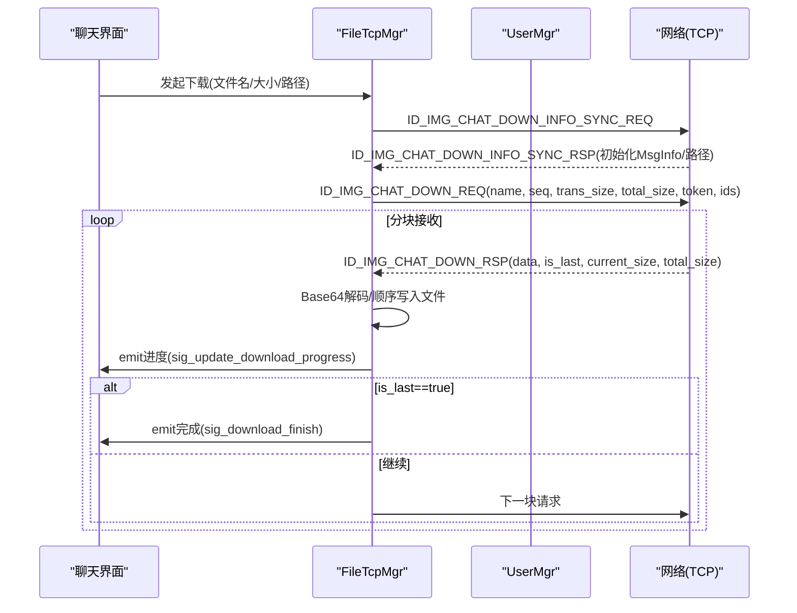
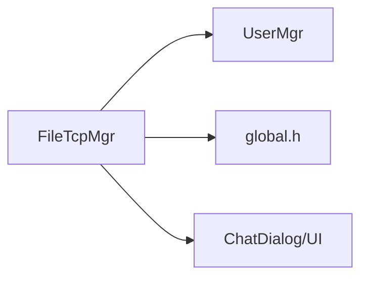

# 文件传输

<cite>
**本文引用的文件**   
- [filetcpmgr.h](file://client/llfcchat/include/filetcpmgr.h)
- [filetcpmgr.cpp](file://client/llfcchat/src/filetcpmgr.cpp)
- [global.h](file://client/llfcchat/include/global.h)
- [usermgr.h](file://client/llfcchat/include/usermgr.h)
- [chatdialog.h](file://client/llfcchat/include/chatdialog.h)
</cite>

## 目录
1. [简介](#简介)
2. [项目结构](#项目结构)
3. [核心组件](#核心组件)
4. [架构总览](#架构总览)
5. [详细组件分析](#详细组件分析)
6. [依赖关系分析](#依赖关系分析)
7. [性能考虑](#性能考虑)
8. [故障排查指南](#故障排查指南)
9. [结论](#结论)
10. [附录：关键流程与示例路径](#附录关键流程与示例路径)

## 简介
本文件为LLFCChat客户端文件传输模块的详细文档，重点围绕FileTcpManager类的实现，涵盖大文件分块传输、断点续传、进度显示机制、文件分片策略、MD5校验、并发传输控制、上传下载流程、存储路径管理、磁盘空间检查（建议）、中断恢复、错误重试机制与性能优化。文档既适合初学者理解整体设计，也为有经验的开发者提供高性能文件传输系统的设计思路与可落地的工程实践。

## 项目结构
文件传输相关代码集中在客户端Qt工程中：
- 头文件定义：filetcpmgr.h、global.h、usermgr.h、chatdialog.h
- 实现文件：filetcpmgr.cpp
- UI交互：通过信号槽将传输状态更新到聊天界面



图表来源
- [filetcpmgr.h:26-82](file://client/llfcchat/include/filetcpmgr.h#L26-L82)
- [filetcpmgr.cpp:175-896](file://client/llfcchat/src/filetcpmgr.cpp#L175-L896)
- [global.h:150-296](file://client/llfcchat/include/global.h#L150-L296)
- [usermgr.h:68-108](file://client/llfcchat/include/usermgr.h#L68-L108)
- [chatdialog.h:87-90](file://client/llfcchat/include/chatdialog.h#L87-L90)

章节来源
- [filetcpmgr.h:26-82](file://client/llfcchat/include/filetcpmgr.h#L26-L82)
- [filetcpmgr.cpp:175-896](file://client/llfcchat/src/filetcpmgr.cpp#L175-L896)
- [global.h:150-296](file://client/llfcchat/include/global.h#L150-L296)
- [usermgr.h:68-108](file://client/llfcchat/include/usermgr.h#L68-L108)
- [chatdialog.h:87-90](file://client/llfcchat/include/chatdialog.h#L87-L90)

## 核心组件
- FileTcpMgr：负责TCP连接、粘包处理、消息分发、发送队列、拥塞窗口控制、上传/下载分块读写、断点续传、进度回调。
- UserMgr：维护上传/下载/传输中的文件元数据（MsgInfo），提供增删查、暂停/恢复、并发控制辅助。
- global.h：定义传输状态枚举、消息体结构MsgInfo、分片大小MAX_FILE_LEN、头部长度FILE_UPLOAD_HEAD_LEN、拥塞窗口大小MAX_CWND_SIZE等。
- ChatDialog：接收FileTcpMgr的进度/完成信号，更新UI展示。

章节来源
- [filetcpmgr.h:26-82](file://client/llfcchat/include/filetcpmgr.h#L26-L82)
- [filetcpmgr.cpp:175-896](file://client/llfcchat/src/filetcpmgr.cpp#L175-L896)
- [global.h:150-296](file://client/llfcchat/include/global.h#L150-L296)
- [usermgr.h:68-108](file://client/llfcchat/include/usermgr.h#L68-L108)
- [chatdialog.h:87-90](file://client/llfcchat/include/chatdialog.h#L87-L90)

## 架构总览
FileTcpMgr基于Qt事件循环与QTcpSocket实现异步I/O，采用“消息类型+长度”的自定义协议进行粘包/半包处理；使用QQueue作为发送队列，bytesWritten回调驱动分段写入；通过_cwnd_size实现滑动窗口式并发控制；以MsgInfo记录每个文件的序列号、已确认序列、飞行中序列集合等，支撑断点续传与重传。



图表来源
- [filetcpmgr.cpp:925-996](file://client/llfcchat/src/filetcpmgr.cpp#L925-L996)
- [filetcpmgr.cpp:1002-1076](file://client/llfcchat/src/filetcpmgr.cpp#L1002-L1076)
- [filetcpmgr.cpp:1078-1105](file://client/llfcchat/src/filetcpmgr.cpp#L1078-L1105)
- [filetcpmgr.cpp:1111-1125](file://client/llfcchat/src/filetcpmgr.cpp#L1111-L1125)

## 详细组件分析

### FileTcpMgr类设计与职责
- 连接与事件：connected/disconnected/error等信号处理，readyRead粘包解析。
- 发送管线：SendData封装消息头+负载，_send_queue串行化发送，bytesWritten增量写。
- 接收管线：handleMsg根据ReqId路由到具体处理器（上传/下载/同步等）。
- 并发控制：_cwnd_size限制未确认包数量，避免拥塞。
- 断点续传：依据MsgInfo._seq/_last_confirmed_seq/_flighting_seqs/_rsp_seqs定位断点与缺失片段。
- 进度回调：sig_update_upload_progress/sig_update_download_progress/sig_download_finish。



图表来源
- [filetcpmgr.h:26-82](file://client/llfcchat/include/filetcpmgr.h#L26-L82)
- [filetcpmgr.cpp:175-896](file://client/llfcchat/src/filetcpmgr.cpp#L175-L896)

章节来源
- [filetcpmgr.h:26-82](file://client/llfcchat/include/filetcpmgr.h#L26-L82)
- [filetcpmgr.cpp:175-896](file://client/llfcchat/src/filetcpmgr.cpp#L175-L896)

### 数据模型与分片策略
- MsgInfo：包含唯一名、总大小、当前大小、序列号、MD5、已确认序列、飞行中序列集合、最大序列号、会话/发送者/接收者等信息。
- 分片大小：MAX_FILE_LEN（固定分片大小）
- 最大并发：MAX_CWND_SIZE（未确认包上限）
- 头部长度：FILE_UPLOAD_HEAD_LEN（用于粘包解析）

```mermaid
erDiagram
MSGINFO {
string _unique_name
longlong _total_size
longlong _current_size
longlong _seq
string _md5
set<longlong> _rsp_seqs
set<longlong> _flighting_seqs
longlong _last_confirmed_seq
longlong _max_seq
longlong _msg_id
longlong _rsp_size
longlong _thread_id
enum TransferState _transfer_state
enum TransferType _transfer_type
int _sender
int _receiver
}
```

图表来源
- [global.h:167-197](file://client/llfcchat/include/global.h#L167-L197)

章节来源
- [global.h:150-296](file://client/llfcchat/include/global.h#L150-L296)

### 上传流程（分块+断点续传+并发）
- 初始发送：BatchSend从文件偏移处读取MAX_FILE_LEN字节，Base64编码后组织JSON载荷，携带seq、trans_size、total_size、last标志等。
- 并发控制：每次发送前检查MAX_CWND_SIZE - _cwnd_size > 0，发送成功后_cwnd_size++。
- 确认机制：服务器返回ACK（包含seq），将seq从未接收集合移至已接收集合，推进_last_confirmed_seq，计算rsp_size并emit进度。
- 完成判断：当_last_confirmed_seq == _max_seq时，拷贝最终文件至目标目录，清理状态，触发下一个待传任务。
- 断点续传：slot_continue_upload_file根据_last_confirmed_seq重置_seq，从断点继续发送。



图表来源
- [filetcpmgr.cpp:925-996](file://client/llfcchat/src/filetcpmgr.cpp#L925-L996)
- [filetcpmgr.cpp:1002-1076](file://client/llfcchat/src/filetcpmgr.cpp#L1002-L1076)

章节来源
- [filetcpmgr.cpp:925-996](file://client/llfcchat/src/filetcpmgr.cpp#L925-L996)
- [filetcpmgr.cpp:1002-1076](file://client/llfcchat/src/filetcpmgr.cpp#L1002-L1076)

### 下载流程（分块+断点续传+进度）
- 信息同步：ID_IMG_CHAT_DOWN_INFO_SYNC_RSP初始化MsgInfo，创建本地目录，设置下载路径。
- 请求数据：ID_IMG_CHAT_DOWN_REQ携带name、seq、trans_size、total_size、token、sender/receiver/message_id/uid。
- 接收数据：ID_IMG_CHAT_DOWN_RSP返回data(Base64)、is_last、current_size/total_size、name等；首个包覆盖写，后续追加写。
- 进度更新：每收到一块即更新current_size并emit进度信号；is_last=true时完成下载并emit完成信号。
- 断点续传：slot_continue_download_file根据_current_size/seq继续请求。



图表来源
- [filetcpmgr.cpp:813-894](file://client/llfcchat/src/filetcpmgr.cpp#L813-L894)
- [filetcpmgr.cpp:695-811](file://client/llfcchat/src/filetcpmgr.cpp#L695-L811)
- [filetcpmgr.cpp:1078-1105](file://client/llfcchat/src/filetcpmgr.cpp#L1078-L1105)

章节来源
- [filetcpmgr.cpp:813-894](file://client/llfcchat/src/filetcpmgr.cpp#L813-L894)
- [filetcpmgr.cpp:695-811](file://client/llfcchat/src/filetcpmgr.cpp#L695-L811)
- [filetcpmgr.cpp:1078-1105](file://client/llfcchat/src/filetcpmgr.cpp#L1078-L1105)

### 存储路径管理与磁盘空间检查
- 存储路径：使用QStandardPaths::AppDataLocation拼接用户目录，按“/user/{uid}/chatimg/{sender}”组织图片/文件。
- 目录创建：在写入前确保目录存在（mkpath）。
- 磁盘空间检查：建议在写入前调用QDir::drives或系统API检查剩余空间，避免写入失败；当前实现未内置该检查，可在CopyFile/写入前增加检查逻辑。

章节来源
- [filetcpmgr.cpp:898-915](file://client/llfcchat/src/filetcpmgr.cpp#L898-L915)
- [filetcpmgr.cpp:852-889](file://client/llfcchat/src/filetcpmgr.cpp#L852-L889)

### MD5校验与完整性保障
- 上传：MsgInfo中包含_md5字段，随分片载荷一起发送给服务器，服务器端可用于校验完整性（客户端侧仅传递）。
- 下载：服务端返回的数据块应配合MD5校验（当前实现侧重顺序写入与is_last标记），建议在接收完成后对完整文件计算MD5并与预期值比对，提升可靠性。

章节来源
- [global.h:167-197](file://client/llfcchat/include/global.h#L167-L197)
- [filetcpmgr.cpp:925-996](file://client/llfcchat/src/filetcpmgr.cpp#L925-L996)

### 并发传输控制与拥塞窗口
- 并发上限：MAX_CWND_SIZE限制未确认包数量，防止网络拥塞。
- 计数方式：发送前检查MAX_CWND_SIZE - _cwnd_size > 0，发送后_cwnd_size++；收到ACK后_cwnd_size--。
- 适用场景：适用于高延迟/高带宽环境下的吞吐优化，避免过多未确认包导致丢包重传风暴。

章节来源
- [global.h:150-296](file://client/llfcchat/include/global.h#L150-L296)
- [filetcpmgr.cpp:925-996](file://client/llfcchat/src/filetcpmgr.cpp#L925-L996)

### 进度显示与UI回调
- 上传进度：sig_update_upload_progress携带MsgInfo，UI据此更新进度条/百分比。
- 下载进度：sig_update_download_progress携带MsgInfo，UI更新下载进度。
- 下载完成：sig_download_finish携带MsgInfo与文件路径，UI刷新显示。

章节来源
- [filetcpmgr.h:66-75](file://client/llfcchat/include/filetcpmgr.h#L66-L75)
- [chatdialog.h:87-90](file://client/llfcchat/include/chatdialog.h#L87-L90)

## 依赖关系分析
- FileTcpMgr依赖UserMgr进行文件元数据与状态管理。
- FileTcpMgr依赖global.h中的常量与数据结构。
- FileTcpMgr通过信号与UI层（如ChatDialog）解耦，便于扩展其他UI。



图表来源
- [filetcpmgr.cpp:175-896](file://client/llfcchat/src/filetcpmgr.cpp#L175-L896)
- [usermgr.h:68-108](file://client/llfcchat/include/usermgr.h#L68-L108)
- [global.h:150-296](file://client/llfcchat/include/global.h#L150-L296)
- [chatdialog.h:87-90](file://client/llfcchat/include/chatdialog.h#L87-L90)

章节来源
- [filetcpmgr.cpp:175-896](file://client/llfcchat/src/filetcpmgr.cpp#L175-L896)
- [usermgr.h:68-108](file://client/llfcchat/include/usermgr.h#L68-L108)
- [global.h:150-296](file://client/llfcchat/include/global.h#L150-L296)
- [chatdialog.h:87-90](file://client/llfcchat/include/chatdialog.h#L87-L90)

## 性能考虑
- 分片大小：MAX_FILE_LEN=32KB，平衡内存占用与网络效率；可根据网络状况动态调整。
- 并发窗口：MAX_CWND_SIZE=5，避免拥塞；在高延迟链路可适当增大，但需监控丢包率。
- I/O模式：顺序读/写，减少随机IO开销；Base64编解码带来CPU开销，必要时可考虑二进制帧。
- 粘包处理：每次解析都重建QDataStream，保证正确性；在高吞吐下可复用缓冲区以减少分配。
- 线程模型：FileTcpThread将FileTcpMgr迁移到独立线程，避免阻塞UI；注意跨线程信号槽的性能。

章节来源
- [global.h:150-296](file://client/llfcchat/include/global.h#L150-L296)
- [filetcpmgr.cpp:1128-1140](file://client/llfcchat/src/filetcpmgr.cpp#L1128-L1140)

## 故障排查指南
- 连接问题：检查error信号分支（连接拒绝、远程关闭、主机未找到、超时等），确认sig_con_success回调。
- 粘包/半包：确保_buffer足够解析头部与负载，_b_recv_pending标志正确使用。
- 进度不更新：检查_handlers是否正确注册对应ReqId，确认emit信号被UI订阅。
- 断点续传异常：核对_msg_info._seq/_last_confirmed_seq/_flighting_seqs/_rsp_seqs一致性，确保文件seek位置正确。
- 磁盘写入失败：检查目录是否存在、权限是否足够；建议增加磁盘空间检查。

章节来源
- [filetcpmgr.cpp:65-93](file://client/llfcchat/src/filetcpmgr.cpp#L65-L93)
- [filetcpmgr.cpp:16-55](file://client/llfcchat/src/filetcpmgr.cpp#L16-L55)
- [filetcpmgr.cpp:898-915](file://client/llfcchat/src/filetcpmgr.cpp#L898-L915)

## 结论
FileTcpMgr实现了稳定高效的文件传输子系统，具备分块传输、断点续传、并发控制、进度反馈等关键能力。通过清晰的职责划分与信号解耦，易于扩展与维护。建议在现有基础上增强磁盘空间检查、MD5完整性校验与自适应分片/并发策略，进一步提升鲁棒性与性能。

## 附录：关键流程与示例路径
- 上传分块读取与发送：[filetcpmgr.cpp:925-996](file://client/llfcchat/src/filetcpmgr.cpp#L925-L996)
- 断点续传上传：[filetcpmgr.cpp:1002-1076](file://client/llfcchat/src/filetcpmgr.cpp#L1002-L1076)
- 下载请求与接收：[filetcpmgr.cpp:695-811](file://client/llfcchat/src/filetcpmgr.cpp#L695-L811)
- 下载信息同步与路径初始化：[filetcpmgr.cpp:813-894](file://client/llfcchat/src/filetcpmgr.cpp#L813-L894)
- 下载断点续传：[filetcpmgr.cpp:1078-1105](file://client/llfcchat/src/filetcpmgr.cpp#L1078-L1105)
- 存储路径与拷贝：[filetcpmgr.cpp:898-915](file://client/llfcchat/src/filetcpmgr.cpp#L898-L915)
- 数据结构与常量：[global.h:150-296](file://client/llfcchat/include/global.h#L150-L296)
- 文件元数据管理接口：[usermgr.h:68-108](file://client/llfcchat/include/usermgr.h#L68-L108)
- UI进度回调接口：[chatdialog.h:87-90](file://client/llfcchat/include/chatdialog.h#L87-L90)