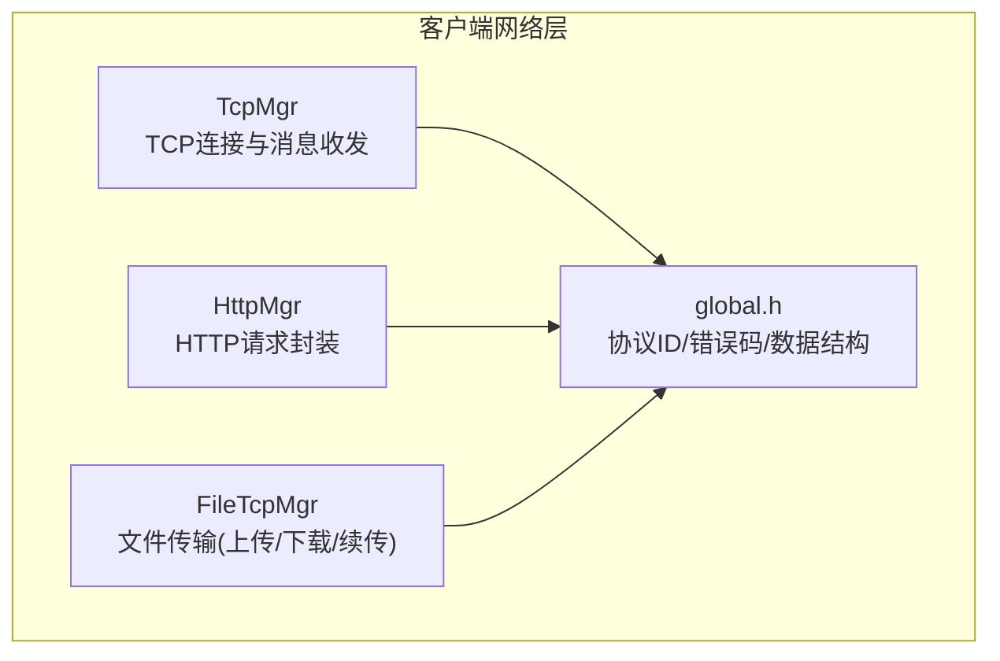
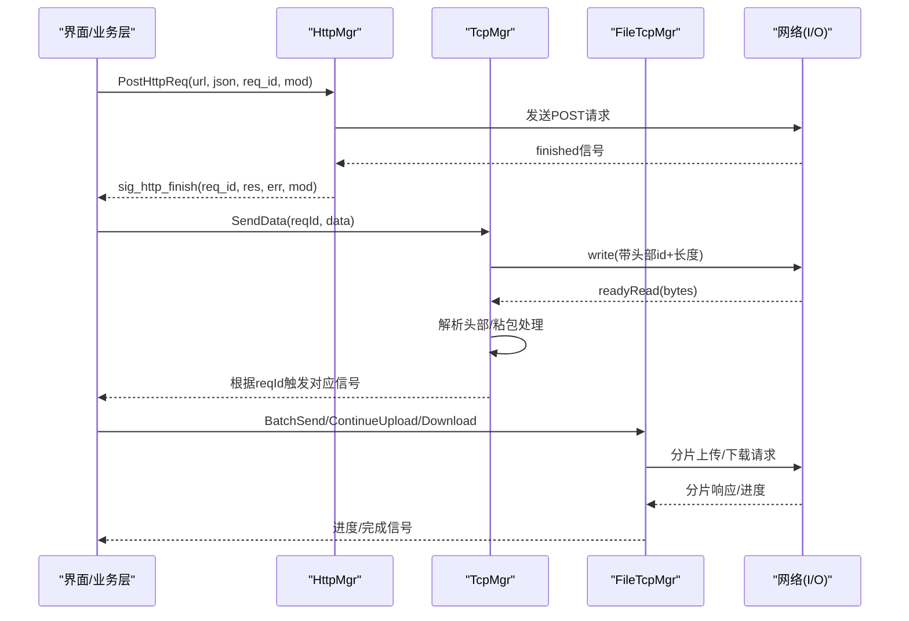
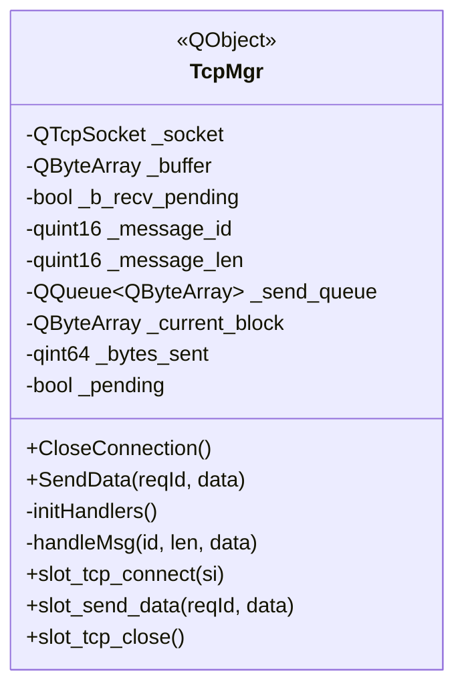
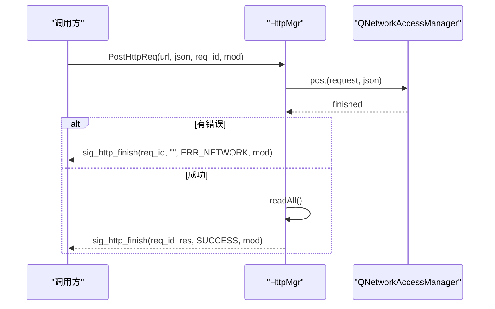
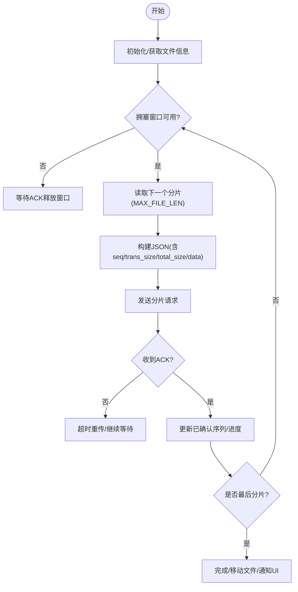
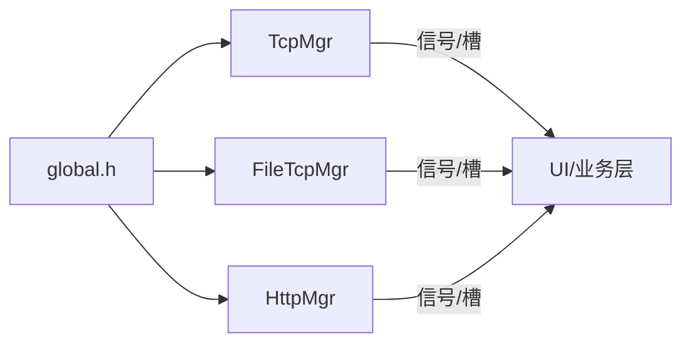

# 网络通信

<cite>
**本文引用的文件**   
- [tcpmgr.h](file://client/llfcchat/include/tcpmgr.h)
- [tcpmgr.cpp](file://client/llfcchat/src/tcpmgr.cpp)
- [httpmgr.h](file://client/llfcchat/include/httpmgr.h)
- [httpmgr.cpp](file://client/llfcchat/src/httpmgr.cpp)
- [filetcpmgr.h](file://client/llfcchat/include/filetcpmgr.h)
- [filetcpmgr.cpp](file://client/llfcchat/src/filetcpmgr.cpp)
- [global.h](file://client/llfcchat/include/global.h)
</cite>

## 目录
1. [简介](#简介)
2. [项目结构](#项目结构)
3. [核心组件](#核心组件)
4. [架构总览](#架构总览)
5. [详细组件分析](#详细组件分析)
6. [依赖关系分析](#依赖关系分析)
7. [性能考量](#性能考量)
8. [故障排查指南](#故障排查指南)
9. [结论](#结论)
10. [附录：协议与数据模型](#附录协议与数据模型)

## 简介
本文件为 LLFCChat 客户端网络通信模块的权威文档，聚焦以下三个子系统：
- TcpManager：TCP 长连接管理、粘包处理、消息分发与异步发送队列
- HttpManager：基于 Qt 的 HTTP POST 请求封装与响应回调分发
- FileTcpManager：面向大文件的分片上传/下载、断点续传、拥塞窗口控制与进度上报

文档同时覆盖：
- 异步网络编程模型（Qt 信号槽 + 独立线程）
- 连接池与发送队列机制
- 错误处理与重连策略
- 消息协议格式、序列化/反序列化流程
- 网络状态监控、心跳与性能优化建议

## 项目结构
网络相关代码集中在 client/llfcchat 目录下：
- include：头文件定义（TcpMgr、HttpMgr、FileTcpMgr、全局协议与数据结构）
- src：实现文件（TcpMgr、HttpMgr、FileTcpMgr 的具体逻辑）
- global.h：ReqId 枚举、错误码、传输类型/状态、MsgInfo 等关键数据结构

图表来源
- [tcpmgr.h:1-90](file://client/llfcchat/include/tcpmgr.h#L1-L90)
- [httpmgr.h:1-34](file://client/llfcchat/include/httpmgr.h#L1-L34)
- [filetcpmgr.h:1-85](file://client/llfcchat/include/filetcpmgr.h#L1-L85)
- [global.h:1-296](file://client/llfcchat/include/global.h#L1-L296)

章节来源
- [tcpmgr.h:1-90](file://client/llfcchat/include/tcpmgr.h#L1-L90)
- [httpmgr.h:1-34](file://client/llfcchat/include/httpmgr.h#L1-L34)
- [filetcpmgr.h:1-85](file://client/llfcchat/include/filetcpmgr.h#L1-L85)
- [global.h:1-296](file://client/llfcchat/include/global.h#L1-L296)

## 核心组件
- TcpMgr：维护一个 QTcpSocket，负责建立连接、接收解析、按 ReqId 分发到处理器、并发安全的发送队列与 bytesWritten 驱动的分片发送。
- HttpMgr：封装 QNetworkAccessManager，统一发起 POST JSON 请求，通过信号将结果回传给调用方。
- FileTcpMgr：独立的文件传输管理器，支持分片上传/下载、断点续传、拥塞窗口控制、进度更新与完成回调。

章节来源
- [tcpmgr.cpp:1-137](file://client/llfcchat/src/tcpmgr.cpp#L1-L137)
- [httpmgr.cpp:1-62](file://client/llfcchat/src/httpmgr.cpp#L1-L62)
- [filetcpmgr.cpp:1-143](file://client/llfcchat/src/filetcpmgr.cpp#L1-L143)

## 架构总览
整体采用“UI 层 -> 业务层 -> 网络层”的分层设计。网络层以单例形式提供，内部使用 Qt 事件循环与信号槽进行异步解耦；TCP/文件传输在独立线程中运行，避免阻塞 UI。

图表来源
- [httpmgr.cpp:8-38](file://client/llfcchat/src/httpmgr.cpp#L8-L38)
- [tcpmgr.cpp:18-136](file://client/llfcchat/src/tcpmgr.cpp#L18-L136)
- [filetcpmgr.cpp:186-221](file://client/llfcchat/src/filetcpmgr.cpp#L186-L221)

## 详细组件分析

### TcpMgr：TCP 连接管理与消息分发
- 连接生命周期
  - connected/disconnected/error 信号统一接入，区分拒绝、超时、主机未找到等错误并向上抛出连接结果。
  - disconnected 时发出连接关闭信号，供上层做重连或提示。
- 接收与粘包处理
  - 使用 _buffer 累积数据，先解析固定长度的头部（消息ID + 长度），再按长度切分消息体，循环处理直到缓冲区不足。
  - 使用 _b_recv_pending 标记是否处于等待完整消息体的状态。
- 发送与并发安全
  - 所有发送走 sig_send_data -> slot_send_data，保证跨线程安全。
  - 非阻塞 socket.write() 配合 bytesWritten 回调，实现分片发送与队列出队。
  - 维护 _send_queue、_current_block、_bytes_sent、_pending 确保有序发送。
- 消息分发
  - initHandlers 注册各 ReqId 对应的处理器，收到消息后由 handleMsg 查找并调用。
  - 处理器内对 JSON 进行解析，构造业务对象并通过信号通知 UI。

图表来源
- [tcpmgr.h:22-87](file://client/llfcchat/include/tcpmgr.h#L22-L87)
- [tcpmgr.cpp:18-136](file://client/llfcchat/src/tcpmgr.cpp#L18-L136)

章节来源
- [tcpmgr.cpp:18-136](file://client/llfcchat/src/tcpmgr.cpp#L18-L136)
- [tcpmgr.cpp:182-800](file://client/llfcchat/src/tcpmgr.cpp#L182-L800)

### HttpMgr：HTTP 请求封装
- 统一接口 PostHttpReq(url, json, req_id, mod)
  - 设置 Content-Type 为 application/json，发送 POST 请求。
  - 通过 QNetworkReply::finished 回调读取响应，统一封装为 sig_http_finish 信号。
- 模块路由
  - slot_http_finish 根据 Modules 分发到具体模块的信号（注册/重置/登录）。

图表来源
- [httpmgr.cpp:8-38](file://client/llfcchat/src/httpmgr.cpp#L8-L38)
- [httpmgr.cpp:46-61](file://client/llfcchat/src/httpmgr.cpp#L46-L61)

章节来源
- [httpmgr.cpp:1-62](file://client/llfcchat/src/httpmgr.cpp#L1-L62)

### FileTcpMgr：文件传输管理
- 能力概览
  - 分片上传/下载：按 MAX_FILE_LEN 分片，Base64 编码传输，seq 序列号控制顺序。
  - 断点续传：记录 last_confirmed_seq、flighting_seqs、rsp_seqs，支持暂停/继续。
  - 拥塞窗口：MAX_CWND_SIZE 限制并发分片数，避免拥塞。
  - 进度上报：sig_update_upload_progress / sig_update_download_progress。
  - 完成回调：sig_download_finish / 头像刷新等。
- 发送路径
  - slot_send_data 组装头部（ReqId + 长度）+ JSON 体，进入发送队列，bytesWritten 驱动后续发送。
- 接收路径
  - readyRead 累积缓冲，解析头部后按长度取体，handleMsg 分发到具体处理器。
- 典型流程
  - 上传：BatchSend 读取文件分片 -> 组织 JSON -> 发送 -> 服务器确认 -> 更新进度 -> 下一分片。
  - 下载：ID_IMG_CHAT_DOWN_INFO_SYNC_RSP 初始化下载信息 -> ID_IMG_CHAT_DOWN_REQ 拉取分片 -> 写入本地 -> 进度更新 -> 完成。

图表来源
- [filetcpmgr.cpp:925-996](file://client/llfcchat/src/filetcpmgr.cpp#L925-L996)
- [filetcpmgr.cpp:1078-1105](file://client/llfcchat/src/filetcpmgr.cpp#L1078-L1105)
- [filetcpmgr.cpp:186-221](file://client/llfcchat/src/filetcpmgr.cpp#L186-L221)

章节来源
- [filetcpmgr.cpp:186-221](file://client/llfcchat/src/filetcpmgr.cpp#L186-L221)
- [filetcpmgr.cpp:925-996](file://client/llfcchat/src/filetcpmgr.cpp#L925-L996)
- [filetcpmgr.cpp:1078-1105](file://client/llfcchat/src/filetcpmgr.cpp#L1078-L1105)

## 依赖关系分析
- 模块耦合
  - TcpMgr/FileTcpMgr 均依赖 global.h 中的 ReqId、ErrorCodes、MsgInfo 等。
  - FileTcpMgr 依赖 UserMgr 进行上传/下载任务的状态管理（未在本文展开）。
- 外部依赖
  - Qt 网络库：QTcpSocket、QNetworkAccessManager、QThread、QQueue、QDataStream。
  - JSON：QJsonDocument/QJsonObject。
- 潜在循环依赖
  - 当前未见循环包含，但需注意跨模块信号传递的类型注册（已在 registerMetaType 中集中处理）。

图表来源
- [global.h:43-101](file://client/llfcchat/include/global.h#L43-L101)
- [tcpmgr.cpp:139-165](file://client/llfcchat/src/tcpmgr.cpp#L139-L165)
- [filetcpmgr.cpp:145-173](file://client/llfcchat/src/filetcpmgr.cpp#L145-L173)

章节来源
- [global.h:43-101](file://client/llfcchat/include/global.h#L43-L101)
- [tcpmgr.cpp:139-165](file://client/llfcchat/src/tcpmgr.cpp#L139-L165)
- [filetcpmgr.cpp:145-173](file://client/llfcchat/src/filetcpmgr.cpp#L145-L173)

## 性能考量
- 发送队列与背压
  - 使用 QQueue 缓存待发包，bytesWritten 回调驱动出队，避免写满导致 EAGAIN。
- 粘包与零拷贝
  - 使用 QByteArray 切片与 mid/remove 操作，注意频繁复制开销；可考虑复用 buffer 与预分配。
- 拥塞控制
  - FileTcpMgr 使用 _cwnd_size 限制并发分片，防止突发流量。
- I/O 线程隔离
  - TcpMgr/FileTcpMgr 可迁移至独立线程，避免阻塞 UI 主循环。
- JSON 序列化
  - 合理控制 JSON 大小，必要时使用二进制协议替代 JSON 提升吞吐。

[本节为通用指导，不直接引用具体文件]

## 故障排查指南
- 连接失败/断开
  - 检查 error 信号分支：ConnectionRefusedError、HostNotFoundError、SocketTimeoutError、NetworkError。
  - disconnected 信号触发后，应提示用户并重连。
- 粘包/半包
  - 确认头部长度与 body 长度一致；检查 _b_recv_pending 标志位切换逻辑。
- 发送卡住
  - 检查 bytesWritten 回调是否被正确连接；确认 _pending 与 _send_queue 状态。
- JSON 解析失败
  - 校验服务端返回字段是否包含 error 键；打印原始报文定位问题。
- 文件传输异常
  - 核对 seq、trans_size、total_size 一致性；检查 last 标志与分片边界。
  - 确认本地路径权限与目录创建逻辑。

章节来源
- [tcpmgr.cpp:64-98](file://client/llfcchat/src/tcpmgr.cpp#L64-L98)
- [tcpmgr.cpp:18-55](file://client/llfcchat/src/tcpmgr.cpp#L18-L55)
- [filetcpmgr.cpp:65-99](file://client/llfcchat/src/filetcpmgr.cpp#L65-L99)
- [filetcpmgr.cpp:106-132](file://client/llfcchat/src/filetcpmgr.cpp#L106-L132)

## 结论
LLFCChat 的网络通信模块以 Qt 信号槽为核心，结合独立线程与发送队列，实现了稳定可靠的 TCP/HTTP/文件传输能力。通过统一的 ReqId 协议与 JSON 载荷，系统具备良好的可扩展性与可维护性。建议在后续迭代中引入二进制协议、完善心跳与自动重连策略，并进一步优化内存与 I/O 路径以提升吞吐。

[本节为总结，不直接引用具体文件]

## 附录：协议与数据模型

### 消息协议格式
- TCP 头部：ReqId(2字节) + Length(2/4字节) + Body(JSON)
  - TcpMgr 使用 quint16 作为长度字段；FileTcpMgr 使用 quint32。
  - 大端序输出，便于跨平台解析。
- HTTP：Content-Type: application/json，Body 为 JSON 字符串。

章节来源
- [tcpmgr.cpp:186-221](file://client/llfcchat/src/tcpmgr.cpp#L186-L221)
- [filetcpmgr.cpp:186-221](file://client/llfcchat/src/filetcpmgr.cpp#L186-L221)
- [httpmgr.cpp:8-38](file://client/llfcchat/src/httpmgr.cpp#L8-L38)

### 关键数据结构
- ReqId：所有请求/响应标识符（登录、搜索、聊天、文件传输等）
- ErrorCodes：SUCCESS/ERR_JSON/ERR_NETWORK
- MsgInfo：文件传输元数据（大小、MD5、序列号、状态、发送者/接收者等）
- TransferType/TransferState：传输类型与状态机

章节来源
- [global.h:43-101](file://client/llfcchat/include/global.h#L43-L101)
- [global.h:145-200](file://client/llfcchat/include/global.h#L145-L200)

### 示例用法（路径指引）
- 建立 TCP 连接并发送消息
  - 参考：[tcpmgr.cpp:18-136](file://client/llfcchat/src/tcpmgr.cpp#L18-L136)、[tcpmgr.cpp:186-221](file://client/llfcchat/src/tcpmgr.cpp#L186-L221)
- 发送 HTTP 请求
  - 参考：[httpmgr.cpp:8-38](file://client/llfcchat/src/httpmgr.cpp#L8-L38)
- 文件上传/下载与续传
  - 参考：[filetcpmgr.cpp:925-996](file://client/llfcchat/src/filetcpmgr.cpp#L925-L996)、[filetcpmgr.cpp:1078-1105](file://client/llfcchat/src/filetcpmgr.cpp#L1078-L1105)

[本节为示例索引，不直接展示代码内容]