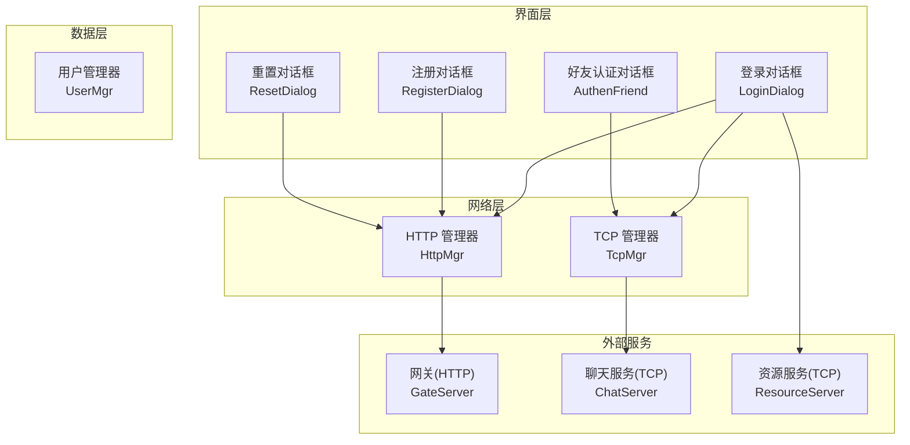
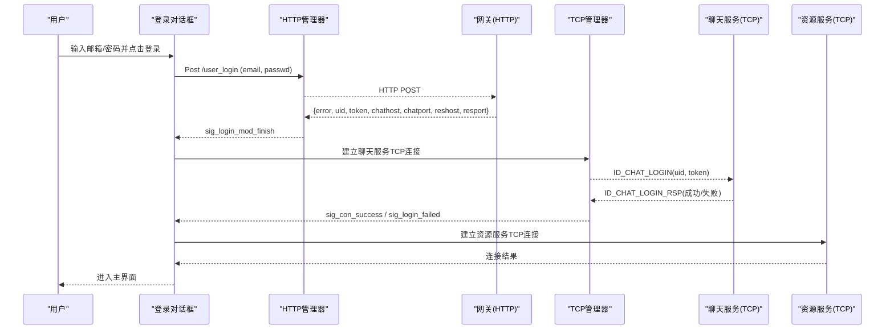
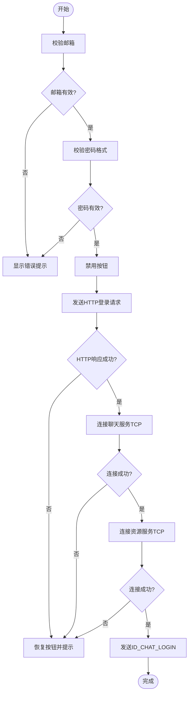
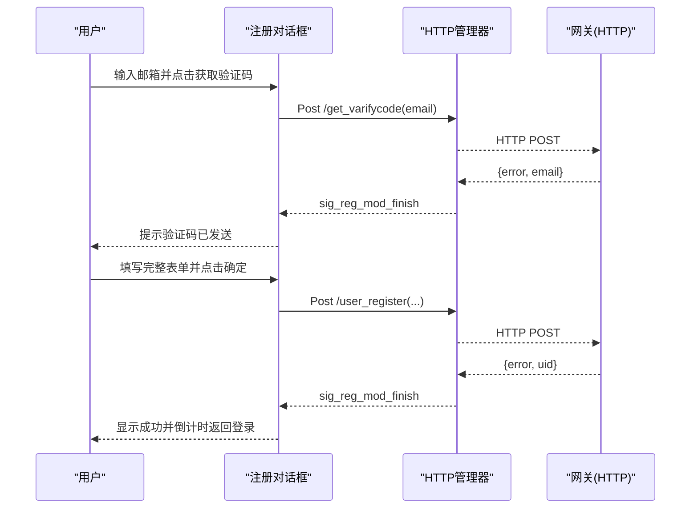
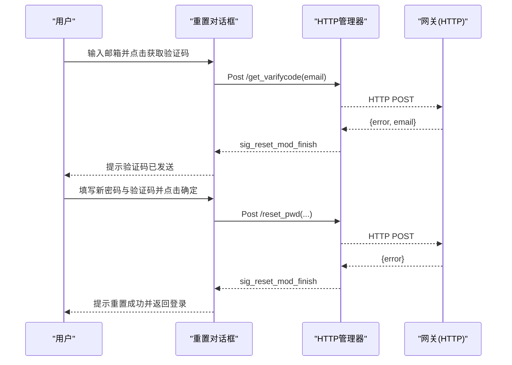
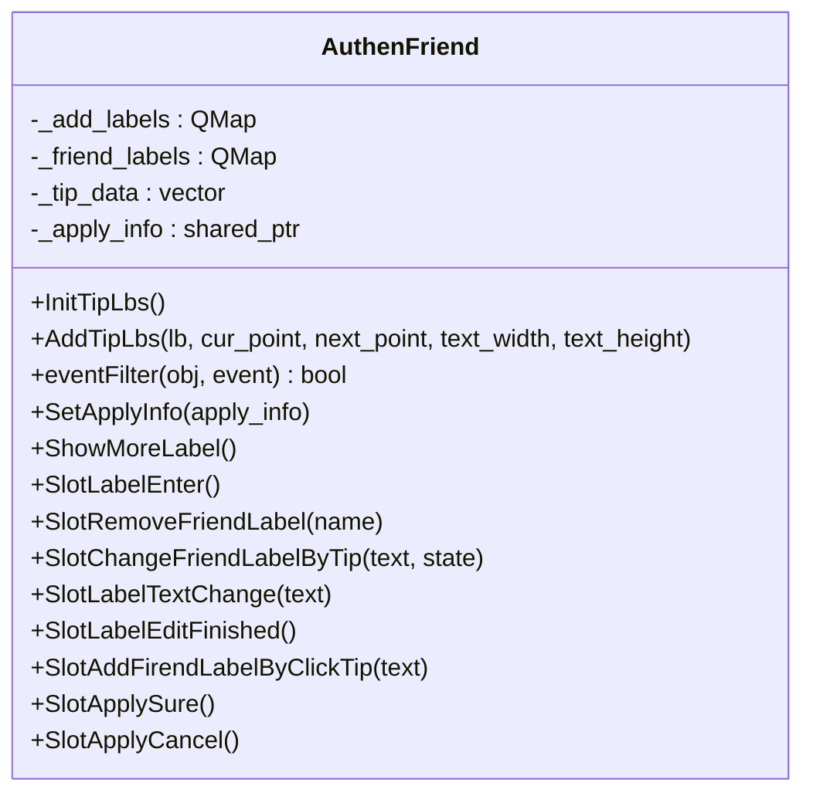
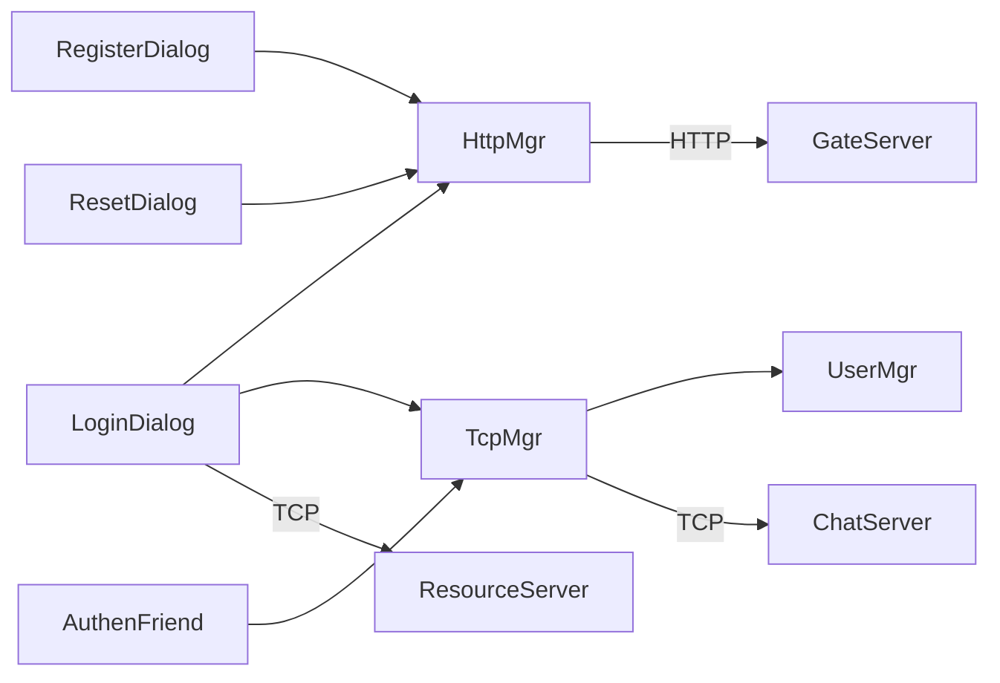

# 认证系统

<cite>
**本文引用的文件**   
- [logindialog.h](file://client/llfcchat/include/logindialog.h)
- [logindialog.cpp](file://client/llfcchat/src/logindialog.cpp)
- [registerdialog.h](file://client/llfcchat/include/registerdialog.h)
- [registerdialog.cpp](file://client/llfcchat/src/registerdialog.cpp)
- [resetdialog.h](file://client/llfcchat/include/resetdialog.h)
- [resetdialog.cpp](file://client/llfcchat/src/resetdialog.cpp)
- [authenfriend.h](file://client/llfcchat/include/authenfriend.h)
- [authenfriend.cpp](file://client/llfcchat/src/authenfriend.cpp)
- [httpmgr.h](file://client/llfcchat/include/httpmgr.h)
- [httpmgr.cpp](file://client/llfcchat/src/httpmgr.cpp)
- [tcpmgr.h](file://client/llfcchat/include/tcpmgr.h)
- [tcpmgr.cpp](file://client/llfcchat/src/tcpmgr.cpp)
- [usermgr.h](file://client/llfcchat/include/usermgr.h)
- [usermgr.cpp](file://client/llfcchat/src/usermgr.cpp)
- [global.h](file://client/llfcchat/include/global.h)
</cite>

## 目录
1. [简介](#简介)
2. [项目结构](#项目结构)
3. [核心组件](#核心组件)
4. [架构总览](#架构总览)
5. [详细组件分析](#详细组件分析)
6. [依赖关系分析](#依赖关系分析)
7. [性能与安全性考虑](#性能与安全性考虑)
8. [故障排查指南](#故障排查指南)
9. [结论](#结论)
10. [附录：API与数据模型](#附录api与数据模型)

## 简介
本文件为 LLFCChat 客户端认证系统的技术文档，聚焦以下界面与流程：
- 登录对话框（LoginDialog）
- 注册对话框（RegisterDialog）
- 重置密码对话框（ResetDialog）
- 好友认证对话框（AuthenFriend）

内容涵盖用户身份验证流程、密码加密存储策略、HTTP API 调用、错误处理与用户体验优化、会话保持与自动登录、安全退出机制等。文档既适合初学者理解整体流程，也为有经验的开发者提供可落地的最佳实践建议。

## 项目结构
认证相关代码主要位于客户端模块的 include/src 目录下，采用“界面层 + 管理器层”的分层组织方式：
- 界面层：登录、注册、重置、好友认证四个对话框
- 网络层：HttpMgr（HTTP 请求封装）、TcpMgr（TCP 长连接与消息分发）
- 数据层：UserMgr（用户信息、Token、好友/申请列表、聊天会话缓存）
- 公共定义：global.h（枚举、常量、数据结构）

图表来源
- [logindialog.cpp:12-39](file://client/llfcchat/src/logindialog.cpp#L12-L39)
- [registerdialog.cpp:9-90](file://client/llfcchat/src/registerdialog.cpp#L9-L90)
- [resetdialog.cpp:8-36](file://client/llfcchat/src/resetdialog.cpp#L8-L36)
- [authenfriend.cpp:9-49](file://client/llfcchat/src/authenfriend.cpp#L9-L49)
- [httpmgr.cpp:8-38](file://client/llfcchat/src/httpmgr.cpp#L8-L38)
- [tcpmgr.cpp:9-137](file://client/llfcchat/src/tcpmgr.cpp#L9-L137)

章节来源
- [logindialog.h:1-47](file://client/llfcchat/include/logindialog.h#L1-L47)
- [registerdialog.h:1-55](file://client/llfcchat/include/registerdialog.h#L1-L55)
- [resetdialog.h:1-44](file://client/llfcchat/include/resetdialog.h#L1-L44)
- [authenfriend.h:1-64](file://client/llfcchat/include/authenfriend.h#L1-L64)
- [httpmgr.h:1-34](file://client/llfcchat/include/httpmgr.h#L1-L34)
- [tcpmgr.h:1-90](file://client/llfcchat/include/tcpmgr.h#L1-L90)
- [usermgr.h:1-116](file://client/llfcchat/include/usermgr.h#L1-L116)
- [global.h:1-296](file://client/llfcchat/include/global.h#L1-L296)

## 核心组件
- LoginDialog：负责邮箱/密码校验、发起 HTTP 登录请求、解析回包并建立 TCP 长连接到聊天服务器与资源服务器，完成二次登录。
- RegisterDialog：负责用户名、邮箱、密码、验证码等输入校验，发送获取验证码与注册用户请求，成功后倒计时返回登录页。
- ResetDialog：负责邮箱与验证码校验，发送获取验证码与重置密码请求，成功后提示返回登录。
- AuthenFriend：好友申请标签选择与确认，组装 JSON 并通过 TCP 发送认证请求。
- HttpMgr：统一封装 HTTP POST 请求，按模块分发响应信号。
- TcpMgr：维护 TCP 连接、粘包/半包处理、消息分发、登录成功后的用户状态更新与页面切换。
- UserMgr：集中管理用户信息、Token、好友/申请列表、聊天会话映射与文件传输状态。

章节来源
- [logindialog.cpp:175-223](file://client/llfcchat/src/logindialog.cpp#L175-L223)
- [registerdialog.cpp:319-362](file://client/llfcchat/src/registerdialog.cpp#L319-L362)
- [resetdialog.cpp:221-251](file://client/llfcchat/src/resetdialog.cpp#L221-L251)
- [authenfriend.cpp:412-436](file://client/llfcchat/src/authenfriend.cpp#L412-L436)
- [httpmgr.cpp:8-62](file://client/llfcchat/src/httpmgr.cpp#L8-L62)
- [tcpmgr.cpp:182-234](file://client/llfcchat/src/tcpmgr.cpp#L182-L234)
- [usermgr.cpp:10-65](file://client/llfcchat/src/usermgr.cpp#L10-L65)

## 架构总览
认证系统采用“HTTP 短连接 + TCP 长连接”的组合模式：
- HTTP 用于注册、验证码、登录、重置密码等一次性操作；
- TCP 用于聊天、好友认证、消息推送等需要持久连接的场景；
- 登录后通过 Token 进行后续鉴权，UserMgr 持有当前会话上下文。

图表来源
- [logindialog.cpp:175-223](file://client/llfcchat/src/logindialog.cpp#L175-L223)
- [logindialog.cpp:225-262](file://client/llfcchat/src/logindialog.cpp#L225-L262)
- [tcpmgr.cpp:182-234](file://client/llfcchat/src/tcpmgr.cpp#L182-L234)

章节来源
- [global.h:43-101](file://client/llfcchat/include/global.h#L43-L101)

## 详细组件分析

### 登录对话框（LoginDialog）
- 输入校验：邮箱非空、密码长度与字符集限制。
- HTTP 登录：POST /user_login，携带 email 与 xorString(passwd)。
- 回包处理：解析 error、uid、token、聊天/资源服务器地址，触发 TCP 连接。
- TCP 登录：ID_CHAT_LOGIN 携带 uid 与 token，成功后保存用户信息与 Token，切换到主界面。
- 资源服务器：连接成功后再向聊天服务器发送登录消息。

图表来源
- [logindialog.cpp:175-223](file://client/llfcchat/src/logindialog.cpp#L175-L223)
- [logindialog.cpp:225-262](file://client/llfcchat/src/logindialog.cpp#L225-L262)

章节来源
- [logindialog.h:11-44](file://client/llfcchat/include/logindialog.h#L11-L44)
- [logindialog.cpp:131-166](file://client/llfcchat/src/logindialog.cpp#L131-L166)
- [logindialog.cpp:175-223](file://client/llfcchat/src/logindialog.cpp#L175-L223)
- [logindialog.cpp:225-262](file://client/llfcchat/src/logindialog.cpp#L225-L262)

### 注册对话框（RegisterDialog）
- 输入校验：用户名、邮箱正则、密码长度与字符集、确认密码一致性、验证码非空。
- 验证码：POST /get_varifycode，成功后提示已发送。
- 注册：POST /user_register，包含 user、email、passwd、sex、icon、confirm、varifycode。
- 成功后进入倒计时页面，自动返回登录。

图表来源
- [registerdialog.cpp:98-111](file://client/llfcchat/src/registerdialog.cpp#L98-L111)
- [registerdialog.cpp:319-362](file://client/llfcchat/src/registerdialog.cpp#L319-L362)

章节来源
- [registerdialog.h:16-52](file://client/llfcchat/include/registerdialog.h#L16-L52)
- [registerdialog.cpp:142-248](file://client/llfcchat/src/registerdialog.cpp#L142-L248)
- [registerdialog.cpp:319-362](file://client/llfcchat/src/registerdialog.cpp#L319-L362)

### 重置密码对话框（ResetDialog）
- 输入校验：用户名、邮箱正则、新密码长度与字符集、验证码非空。
- 验证码：POST /get_varifycode。
- 重置：POST /reset_pwd，包含 user、email、passwd、varifycode。
- 成功后提示返回登录。

图表来源
- [resetdialog.cpp:50-64](file://client/llfcchat/src/resetdialog.cpp#L50-L64)
- [resetdialog.cpp:221-251](file://client/llfcchat/src/resetdialog.cpp#L221-L251)

章节来源
- [resetdialog.h:11-41](file://client/llfcchat/include/resetdialog.h#L11-L41)
- [resetdialog.cpp:94-161](file://client/llfcchat/src/resetdialog.cpp#L94-L161)
- [resetdialog.cpp:221-251](file://client/llfcchat/src/resetdialog.cpp#L221-L251)

### 好友认证对话框（AuthenFriend）
- 功能：选择或新增标签，支持回车添加、点击提示添加、删除标签。
- 提交：组装 fromuid、touid、back（备注），通过 TCP 发送 ID_AUTH_FRIEND_REQ。
- UI：无标题栏模态窗口，滚动区域事件过滤控制滚动条显隐。

图表来源
- [authenfriend.h:13-61](file://client/llfcchat/include/authenfriend.h#L13-L61)
- [authenfriend.cpp:57-121](file://client/llfcchat/src/authenfriend.cpp#L57-L121)
- [authenfriend.cpp:412-436](file://client/llfcchat/src/authenfriend.cpp#L412-L436)

章节来源
- [authenfriend.h:13-61](file://client/llfcchat/include/authenfriend.h#L13-L61)
- [authenfriend.cpp:9-49](file://client/llfcchat/src/authenfriend.cpp#L9-L49)
- [authenfriend.cpp:412-436](file://client/llfcchat/src/authenfriend.cpp#L412-L436)

### HTTP 管理器（HttpMgr）
- 职责：统一 POST 请求封装，设置 Content-Type，处理错误与成功回调，按模块分发信号。
- 关键方法：PostHttpReq(url, json, req_id, mod)，slot_http_finish(mod) 分发到对应模块信号。

章节来源
- [httpmgr.h:11-31](file://client/llfcchat/include/httpmgr.h#L11-L31)
- [httpmgr.cpp:8-62](file://client/llfcchat/src/httpmgr.cpp#L8-L62)

### TCP 管理器（TcpMgr）
- 职责：维护 QTcpSocket，处理粘包/半包，解析消息头（ID+Length），分发到各 ReqId 处理器。
- 登录处理：ID_CHAT_LOGIN_RSP 解析 error、uid、name、nick、icon、sex、desc、token，更新 UserMgr 并切换界面。
- 其他：心跳、离线通知、好友申请、聊天消息等。

章节来源
- [tcpmgr.h:22-87](file://client/llfcchat/include/tcpmgr.h#L22-L87)
- [tcpmgr.cpp:9-137](file://client/llfcchat/src/tcpmgr.cpp#L9-L137)
- [tcpmgr.cpp:182-234](file://client/llfcchat/src/tcpmgr.cpp#L182-L234)

### 用户管理器（UserMgr）
- 职责：线程安全的用户信息、Token、好友/申请列表、聊天会话映射、文件传输状态管理。
- 关键接口：SetUserInfo、SetToken、GetUid、AppendFriendList、AddChatThreadData 等。

章节来源
- [usermgr.h:12-113](file://client/llfcchat/include/usermgr.h#L12-L113)
- [usermgr.cpp:10-65](file://client/llfcchat/src/usermgr.cpp#L10-L65)
- [usermgr.cpp:249-272](file://client/llfcchat/src/usermgr.cpp#L249-L272)

## 依赖关系分析
- 界面层依赖 HttpMgr/TcpMgr 进行网络通信。
- TcpMgr 依赖 UserMgr 更新会话状态。
- global.h 提供全局枚举、常量与数据结构，被多模块共享。

图表来源
- [logindialog.cpp:12-39](file://client/llfcchat/src/logindialog.cpp#L12-L39)
- [tcpmgr.cpp:182-234](file://client/llfcchat/src/tcpmgr.cpp#L182-L234)
- [httpmgr.cpp:8-62](file://client/llfcchat/src/httpmgr.cpp#L8-L62)

章节来源
- [global.h:43-101](file://client/llfcchat/include/global.h#L43-L101)

## 性能与安全性考虑
- 性能
  - TCP 粘包/半包处理避免阻塞，使用队列顺序发送，减少拥塞。
  - HTTP 请求异步回调，避免 UI 卡顿。
  - 图片/文件下载按需加载与占位图提升首屏体验。
- 安全性
  - 密码在客户端使用 xorString 简单混淆后传输，建议升级为 HTTPS + 服务端加盐哈希（如 bcrypt/argon2）。
  - 登录成功后通过 Token 鉴权，建议增加 Token 过期与刷新机制。
  - 验证码需绑定 IP/邮箱限流，防止暴力攻击。
  - 敏感字段（如 passwd）不应明文日志输出。
- 用户体验
  - 输入实时校验与友好提示，禁用按钮防重复提交。
  - 注册成功后倒计时自动返回登录，降低操作步骤。
  - 无标题框模态窗口与滚动条智能显隐提升交互流畅度。

[本节为通用指导，不直接分析具体文件]

## 故障排查指南
- 网络错误
  - HTTP 请求失败时检查 ErrorCodes::ERR_NETWORK，查看 QNetworkReply 的错误字符串。
  - TCP 连接失败时检查 HostNotFoundError、ConnectionRefusedError、SocketTimeoutError。
- JSON 解析错误
  - 确保响应体为合法 JSON，检查 error 字段是否存在。
- 登录失败
  - 检查 ID_CHAT_LOGIN_RSP 的 error 字段，确认 uid/token 是否正确。
- 验证码问题
  - 确认邮箱格式正确，检查后端限流与发送频率。
- 资源服务器连接
  - 若聊天服务连接成功但资源服务器失败，检查 reshost/resport 配置。

章节来源
- [httpmgr.cpp:20-38](file://client/llfcchat/src/httpmgr.cpp#L20-L38)
- [tcpmgr.cpp:64-98](file://client/llfcchat/src/tcpmgr.cpp#L64-L98)
- [tcpmgr.cpp:182-234](file://client/llfcchat/src/tcpmgr.cpp#L182-L234)

## 结论
LLFCChat 认证系统通过 HTTP 与 TCP 协同工作，实现了完整的注册、登录、密码重置与好友认证流程。界面层注重输入校验与反馈，网络层保证稳定可靠的数据传输，数据层统一管理会话状态。建议在现有基础上引入 HTTPS、服务端强哈希与 Token 刷新机制，进一步提升安全性与用户体验。

[本节为总结性内容，不直接分析具体文件]

## 附录：API与数据模型
- HTTP API
  - POST /get_varifycode：参数 email，返回 error、email
  - POST /user_register：参数 user、email、passwd、sex、icon、confirm、varifycode，返回 error、uid
  - POST /user_login：参数 email、passwd，返回 error、uid、token、chathost、chatport、reshost、resport
  - POST /reset_pwd：参数 user、email、passwd、varifycode，返回 error
- TCP 消息
  - ID_CHAT_LOGIN：uid、token
  - ID_CHAT_LOGIN_RSP：error、uid、name、nick、icon、sex、desc、token、apply_list、friend_list
  - ID_AUTH_FRIEND_REQ：fromuid、touid、back
  - ID_AUTH_FRIEND_RSP：error、uid、name、nick、icon、sex、chat_datas[]
- 数据模型
  - ServerInfo：聊天/资源服务器地址、token、uid
  - UserInfo/AuthInfo/AuthRsp：用户基本信息与聊天数据
  - ApplyInfo/AddFriendApply：好友申请信息
  - TextChatData/ImgChatData：聊天消息载体

章节来源
- [global.h:122-136](file://client/llfcchat/include/global.h#L122-L136)
- [userdata.h:41-104](file://client/llfcchat/include/userdata.h#L41-L104)
- [tcpmgr.cpp:182-234](file://client/llfcchat/src/tcpmgr.cpp#L182-L234)
- [tcpmgr.cpp:399-449](file://client/llfcchat/src/tcpmgr.cpp#L399-L449)