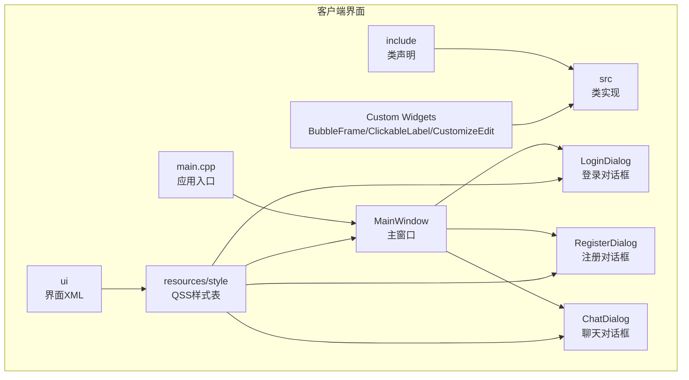
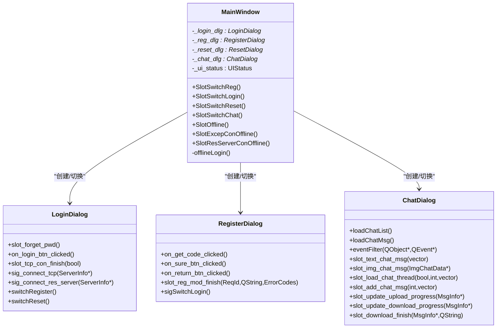
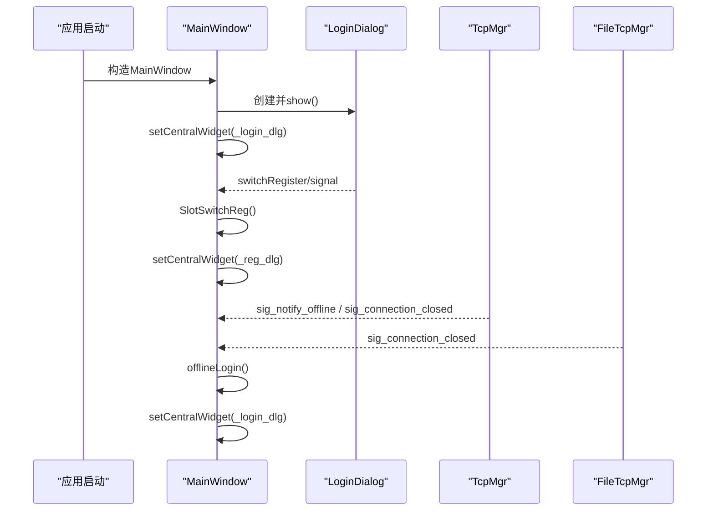
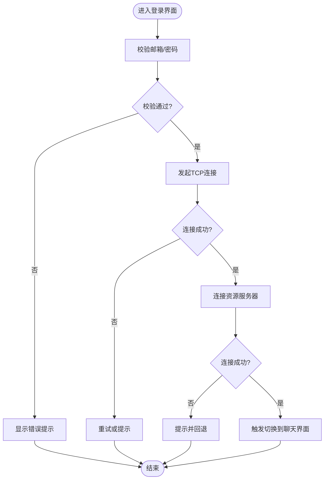
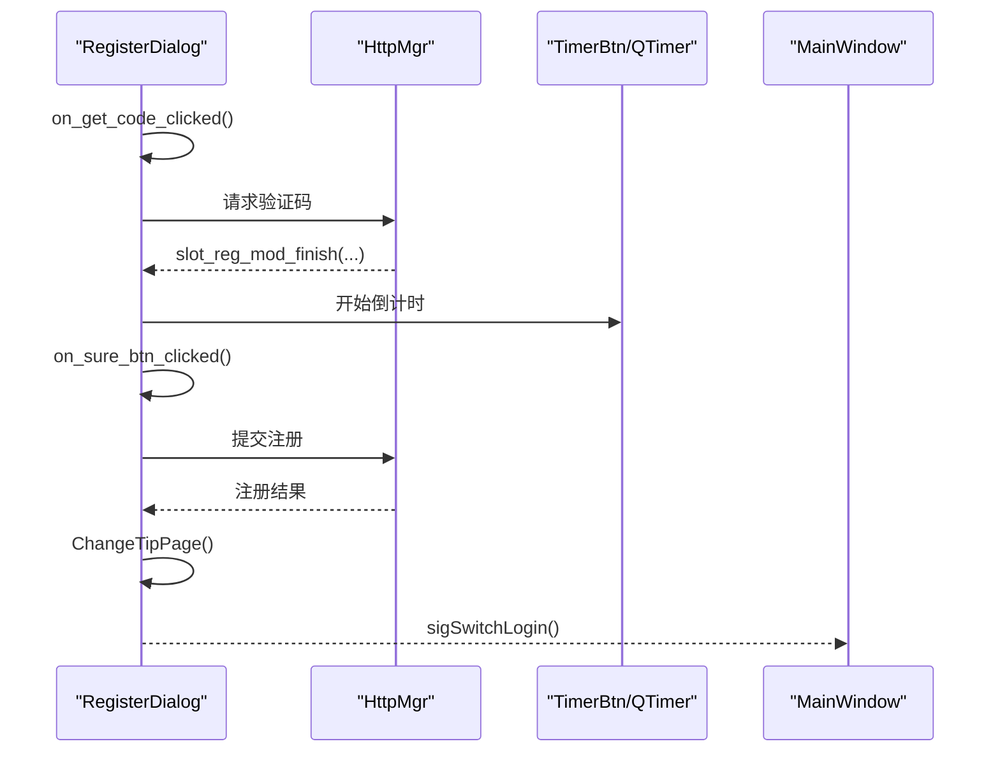
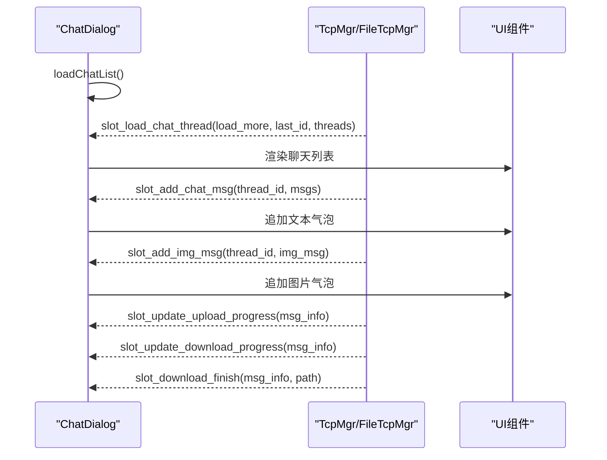
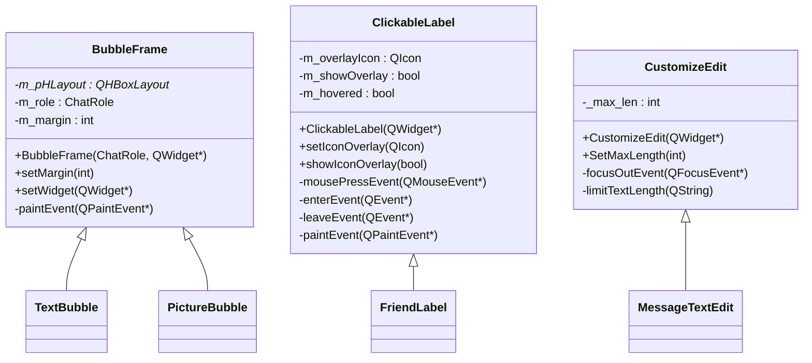
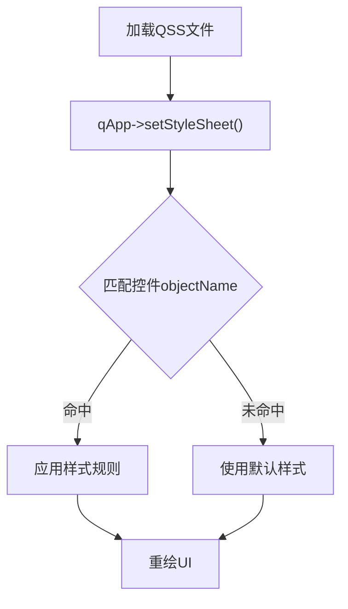
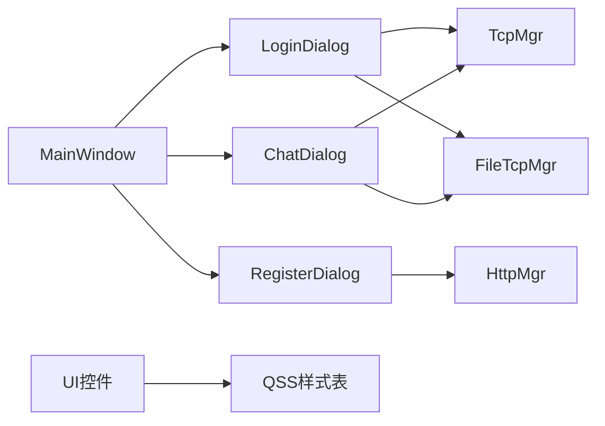

# Qt界面设计

<cite>
**本文引用的文件**   
- [mainwindow.h](file://client/llfcchat/include/mainwindow.h)
- [mainwindow.cpp](file://client/llfcchat/src/mainwindow.cpp)
- [logindialog.h](file://client/llfcchat/include/logindialog.h)
- [registerdialog.h](file://client/llfcchat/include/registerdialog.h)
- [chatdialog.h](file://client/llfcchat/include/chatdialog.h)
- [BubbleFrame.h](file://client/llfcchat/include/BubbleFrame.h)
- [ClickableLabel.h](file://client/llfcchat/include/ClickableLabel.h)
- [customizeedit.h](file://client/llfcchat/include/customizeedit.h)
- [BubbleFrame.cpp](file://client/llfcchat/src/BubbleFrame.cpp)
- [ClickableLabel.cpp](file://client/llfcchat/src/ClickableLabel.cpp)
- [customizeedit.cpp](file://client/llfcchat/src/customizeedit.cpp)
- [mainwindow.ui](file://client/llfcchat/ui/mainwindow.ui)
- [logindialog.ui](file://client/llfcchat/ui/logindialog.ui)
- [registerdialog.ui](file://client/llfcchat/ui/registerdialog.ui)
- [stylesheet.qss](file://client/llfcchat/resources/style/stylesheet.qss)
</cite>

## 目录
1. [简介](#简介)
2. [项目结构](#项目结构)
3. [核心组件](#核心组件)
4. [架构总览](#架构总览)
5. [详细组件分析](#详细组件分析)
6. [依赖关系分析](#依赖关系分析)
7. [性能考虑](#性能考虑)
8. [故障排查指南](#故障排查指南)
9. [结论](#结论)
10. [附录](#附录)

## 简介
本文件面向LLFCChat的Qt界面设计与实现，聚焦主窗口MainWindow的架构与布局、登录/注册/聊天对话框的设计模式、UI文件的组织与QDesigner使用方式、自定义控件（气泡、可点击标签、自定义编辑框）的开发规范，以及基于QSS的样式定制与主题切换机制。文档以代码级为依据，提供可视化图示与最佳实践建议，帮助读者快速理解并扩展界面模块。

## 项目结构
客户端界面相关源码集中在 client/llfcchat 目录下：
- include：C++头文件，定义类接口与信号槽
- src：C++实现文件
- ui：QDesigner生成的界面XML文件
- resources：资源与样式表（QSS）
- CMakeLists.txt：构建配置

图表来源
- [mainwindow.h:1-57](file://client/llfcchat/include/mainwindow.h#L1-L57)
- [mainwindow.cpp:1-164](file://client/llfcchat/src/mainwindow.cpp#L1-L164)
- [logindialog.h:1-47](file://client/llfcchat/include/logindialog.h#L1-L47)
- [registerdialog.h:1-55](file://client/llfcchat/include/registerdialog.h#L1-L55)
- [chatdialog.h:1-98](file://client/llfcchat/include/chatdialog.h#L1-L98)
- [BubbleFrame.h:1-24](file://client/llfcchat/include/BubbleFrame.h#L1-L24)
- [ClickableLabel.h:1-29](file://client/llfcchat/include/ClickableLabel.h#L1-L29)
- [customizeedit.h:1-42](file://client/llfcchat/include/customizeedit.h#L1-L42)
- [mainwindow.ui:1-34](file://client/llfcchat/ui/mainwindow.ui#L1-L34)
- [logindialog.ui:1-369](file://client/llfcchat/ui/logindialog.ui#L1-L369)
- [registerdialog.ui:1-530](file://client/llfcchat/ui/registerdialog.ui#L1-L530)
- [stylesheet.qss:1-815](file://client/llfcchat/resources/style/stylesheet.qss#L1-L815)

章节来源
- [mainwindow.h:1-57](file://client/llfcchat/include/mainwindow.h#L1-L57)
- [mainwindow.cpp:1-164](file://client/llfcchat/src/mainwindow.cpp#L1-L164)
- [mainwindow.ui:1-34](file://client/llfcchat/ui/mainwindow.ui#L1-L34)

## 核心组件
- MainWindow：作为应用外壳，负责在登录、注册、重置密码与聊天界面之间切换；通过设置中央部件（Central Widget）动态替换当前页面；处理网络断开与踢人事件，回退到登录态。
- LoginDialog：登录界面，包含邮箱/密码输入、忘记密码跳转、连接服务器信号发射等。
- RegisterDialog：注册界面，包含用户/邮箱/密码/验证码输入、倒计时获取验证码、成功提示与返回登录。
- ChatDialog：聊天主界面，管理聊天列表、消息加载、搜索、好友申请、头像更新、文件上传下载进度等。

章节来源
- [mainwindow.h:22-54](file://client/llfcchat/include/mainwindow.h#L22-L54)
- [mainwindow.cpp:9-115](file://client/llfcchat/src/mainwindow.cpp#L9-L115)
- [logindialog.h:11-44](file://client/llfcchat/include/logindialog.h#L11-L44)
- [registerdialog.h:16-52](file://client/llfcchat/include/registerdialog.h#L16-L52)
- [chatdialog.h:18-93](file://client/llfcchat/include/chatdialog.h#L18-L93)

## 架构总览
MainWindow采用“中央部件切换”模式，将不同功能对话框作为中央部件动态显示与隐藏，配合状态枚举控制当前UI阶段。网络层通过TcpMgr/FileTcpMgr的事件驱动，统一回调至MainWindow进行状态回退与提示。

图表来源
- [mainwindow.h:29-54](file://client/llfcchat/include/mainwindow.h#L29-L54)
- [mainwindow.cpp:9-115](file://client/llfcchat/src/mainwindow.cpp#L9-L115)
- [logindialog.h:11-44](file://client/llfcchat/include/logindialog.h#L11-L44)
- [registerdialog.h:16-52](file://client/llfcchat/include/registerdialog.h#L16-L52)
- [chatdialog.h:18-93](file://client/llfcchat/include/chatdialog.h#L18-L93)

## 详细组件分析

### 主窗口MainWindow：界面布局与状态机
- 布局策略：使用QMainWindow的centralWidget承载不同对话框，避免多窗口叠加；通过setMinimumSize/setMaximumSize控制窗口尺寸变化。
- 状态机：UIStatus枚举区分LOGIN_UI/REGISTER_UI/RESET_UI/CHAT_UI，用于防止重复切换与离线回退逻辑。
- 事件处理：集中处理TcpMgr与FileTcpMgr的连接关闭、心跳超时、异地登录踢人等事件，弹出提示后调用offlineLogin回到登录态。

图表来源
- [mainwindow.cpp:9-164](file://client/llfcchat/src/mainwindow.cpp#L9-L164)
- [logindialog.h:31-44](file://client/llfcchat/include/logindialog.h#L31-L44)

章节来源
- [mainwindow.cpp:9-164](file://client/llfcchat/src/mainwindow.cpp#L9-L164)
- [mainwindow.ui:1-34](file://client/llfcchat/ui/mainwindow.ui#L1-L34)

### 登录对话框LoginDialog：交互与网络集成
- 界面元素：邮箱/密码输入、错误提示、忘记密码链接、登录按钮。
- 交互流程：校验输入→发起HTTP/注册模块完成回调→建立TCP/资源服务器连接→成功后触发切换到聊天界面。
- 信号设计：对外暴露switchRegister、switchReset、sig_connect_tcp、sig_connect_res_server等信号，便于上层统一管理。

图表来源
- [logindialog.h:11-44](file://client/llfcchat/include/logindialog.h#L11-L44)
- [logindialog.ui:1-369](file://client/llfcchat/ui/logindialog.ui#L1-L369)

章节来源
- [logindialog.h:11-44](file://client/llfcchat/include/logindialog.h#L11-L44)
- [logindialog.ui:1-369](file://client/llfcchat/ui/logindialog.ui#L1-L369)

### 注册对话框RegisterDialog：表单与倒计时
- 界面元素：用户/邮箱/密码/确认/验证码输入，获取验证码按钮（TimerBtn），成功提示页。
- 交互流程：校验输入→发送验证码→倒计时→提交注册→成功后切换到提示页并自动返回登录。
- 状态管理：使用QStackedWidget切换表单页与成功提示页；内部维护错误提示映射与定时器。

图表来源
- [registerdialog.h:16-52](file://client/llfcchat/include/registerdialog.h#L16-L52)
- [registerdialog.ui:1-530](file://client/llfcchat/ui/registerdialog.ui#L1-L530)

章节来源
- [registerdialog.h:16-52](file://client/llfcchat/include/registerdialog.h#L16-L52)
- [registerdialog.ui:1-530](file://client/llfcchat/ui/registerdialog.ui#L1-L530)

### 聊天对话框ChatDialog：消息与列表管理
- 职责：加载聊天线程列表、分页加载历史消息、实时新增消息、图片消息处理、搜索联动、好友申请与认证、头像更新、文件上传下载进度展示。
- 事件过滤：重写eventFilter处理全局鼠标事件，支持拖拽、点击位置判断等。
- 数据流：通过信号槽接收来自网络层的消息增量与线程信息，更新UI列表与气泡内容。

图表来源
- [chatdialog.h:18-93](file://client/llfcchat/include/chatdialog.h#L18-L93)

章节来源
- [chatdialog.h:18-93](file://client/llfcchat/include/chatdialog.h#L18-L93)

### 自定义控件：BubbleFrame、ClickableLabel、CustomizeEdit
- BubbleFrame：根据角色（自己/对方）绘制圆角气泡与小三角，使用QPainter在paintEvent中绘制背景与指示箭头，内部使用QHBoxLayout容纳子控件。
- ClickableLabel：继承QLabel，增强点击、悬停与遮罩图标绘制能力，支持鼠标跟踪与自定义光标，适合做头像点击、开关按钮等。
- CustomizeEdit：继承QLineEdit，限制最大字节长度，监听textChanged进行截断，并在失去焦点时发出信号，便于上层统一处理。

图表来源
- [BubbleFrame.h:7-21](file://client/llfcchat/include/BubbleFrame.h#L7-L21)
- [BubbleFrame.cpp:1-73](file://client/llfcchat/src/BubbleFrame.cpp#L1-L73)
- [ClickableLabel.h:6-27](file://client/llfcchat/include/ClickableLabel.h#L6-L27)
- [ClickableLabel.cpp:1-74](file://client/llfcchat/src/ClickableLabel.cpp#L1-L74)
- [customizeedit.h:6-39](file://client/llfcchat/include/customizeedit.h#L6-L39)
- [customizeedit.cpp:1-12](file://client/llfcchat/src/customizeedit.cpp#L1-L12)

章节来源
- [BubbleFrame.h:7-21](file://client/llfcchat/include/BubbleFrame.h#L7-L21)
- [BubbleFrame.cpp:1-73](file://client/llfcchat/src/BubbleFrame.cpp#L1-L73)
- [ClickableLabel.h:6-27](file://client/llfcchat/include/ClickableLabel.h#L6-L27)
- [ClickableLabel.cpp:1-74](file://client/llfcchat/src/ClickableLabel.cpp#L1-L74)
- [customizeedit.h:6-39](file://client/llfcchat/include/customizeedit.h#L6-L39)
- [customizeedit.cpp:1-12](file://client/llfcchat/src/customizeedit.cpp#L1-L12)

### UI文件组织与QDesigner使用
- 每个对话框对应一个.ui文件，描述布局、控件名称、初始属性与自定义控件声明。
- 常用技巧：
  - 使用QStackedWidget实现多页切换（如注册成功页）。
  - 使用customwidgets声明自定义控件（ClickedLabel、TimerBtn等）。
  - 为关键控件设置objectName，便于QSS选择器定位。
  - 合理设置minimumSize/maximumSize，保证在不同分辨率下的适配。

章节来源
- [logindialog.ui:1-369](file://client/llfcchat/ui/logindialog.ui#L1-L369)
- [registerdialog.ui:1-530](file://client/llfcchat/ui/registerdialog.ui#L1-L530)
- [mainwindow.ui:1-34](file://client/llfcchat/ui/mainwindow.ui#L1-L34)

### 样式定制与主题切换（QSS）
- stylesheet.qss覆盖全局样式：按钮状态（normal/hover/press）、滚动条、列表项选中/悬停、颜色与字体、边框与圆角等。
- 主题切换机制：
  - 运行时加载不同QSS文件，通过qApp->setStyleSheet()生效。
  - 利用state伪类与objectName精准匹配控件，避免全局污染。
  - 对复杂控件（如气泡、头像）可通过border-image与自定义绘制结合实现。

图表来源
- [stylesheet.qss:1-815](file://client/llfcchat/resources/style/stylesheet.qss#L1-L815)

章节来源
- [stylesheet.qss:1-815](file://client/llfcchat/resources/style/stylesheet.qss#L1-L815)

## 依赖关系分析
- MainWindow依赖LoginDialog/RegisterDialog/ChatDialog，并通过TcpMgr/FileTcpMgr的网络事件驱动状态切换。
- 自定义控件被多个UI复用，降低耦合度，提升一致性。
- QSS样式表与UI控件通过objectName关联，形成松耦合的样式体系。

图表来源
- [mainwindow.cpp:9-164](file://client/llfcchat/src/mainwindow.cpp#L9-L164)
- [logindialog.h:31-44](file://client/llfcchat/include/logindialog.h#L31-L44)
- [registerdialog.h:32-52](file://client/llfcchat/include/registerdialog.h#L32-L52)
- [chatdialog.h:58-93](file://client/llfcchat/include/chatdialog.h#L58-L93)
- [stylesheet.qss:1-815](file://client/llfcchat/resources/style/stylesheet.qss#L1-L815)

章节来源
- [mainwindow.cpp:9-164](file://client/llfcchat/src/mainwindow.cpp#L9-L164)
- [logindialog.h:31-44](file://client/llfcchat/include/logindialog.h#L31-L44)
- [registerdialog.h:32-52](file://client/llfcchat/include/registerdialog.h#L32-L52)
- [chatdialog.h:58-93](file://client/llfcchat/include/chatdialog.h#L58-L93)
- [stylesheet.qss:1-815](file://client/llfcchat/resources/style/stylesheet.qss#L1-L815)

## 性能考虑
- 列表与消息渲染：ChatDialog应使用懒加载与分页，避免一次性加载大量消息导致卡顿。
- 图片与资源：异步下载与缓存，减少UI阻塞；图片缩放与缩略图生成应在后台线程完成。
- 事件过滤：eventFilter需谨慎使用，避免在高频事件中执行重计算。
- QSS应用：样式变更尽量批量应用，避免频繁setStyleSheet导致重绘开销。

[本节为通用指导，不直接分析具体文件]

## 故障排查指南
- 网络连接异常：检查TcpMgr/FileTcpMgr的信号是否连接到MainWindow的离线处理槽函数；确认connect调用顺序与生命周期。
- 界面切换异常：确认_setCentralWidget_调用前旧控件已hide，避免内存泄漏与显示重叠。
- 样式不生效：核对控件objectName与QSS选择器一致；检查样式文件路径与资源引用是否正确。
- 输入限制失效：CustomizeEdit的textChanged连接需确保在构造函数中正确建立；注意UTF-8字节长度限制。

章节来源
- [mainwindow.cpp:117-164](file://client/llfcchat/src/mainwindow.cpp#L117-L164)
- [customizeedit.cpp:1-12](file://client/llfcchat/src/customizeedit.cpp#L1-L12)
- [stylesheet.qss:1-815](file://client/llfcchat/resources/style/stylesheet.qss#L1-L815)

## 结论
LLFCChat的Qt界面采用清晰的中央部件切换架构与信号槽驱动，结合QDesigner与QSS实现了高内聚、低耦合的UI体系。自定义控件提升了复用性与一致性，网络事件集中处理保证了状态一致性。建议在后续迭代中继续优化消息渲染与资源加载策略，完善主题切换与国际化支持。

[本节为总结性内容，不直接分析具体文件]

## 附录
- QDesigner使用要点：
  - 为关键控件设置objectName，便于QSS与代码访问。
  - 合理使用布局管理器（QVBoxLayout/QHBoxLayout/QGridLayout）保证自适应。
  - 自定义控件需在.ui的customwidgets中声明并指定头文件路径。
- 样式定制建议：
  - 将通用样式抽取到独立QSS文件，按模块拆分便于维护。
  - 使用state伪类表达交互状态，保持视觉反馈一致。
  - 对复杂图形（气泡、头像遮罩）结合QPainter与QSS共同实现。

[本节为补充说明，不直接分析具体文件]