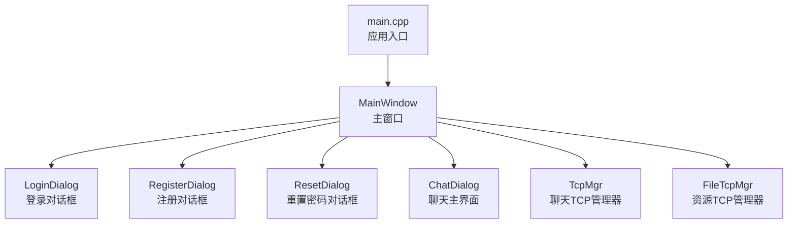
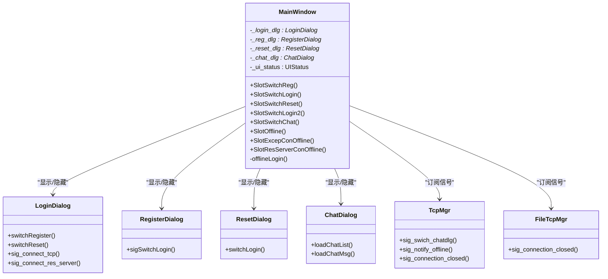
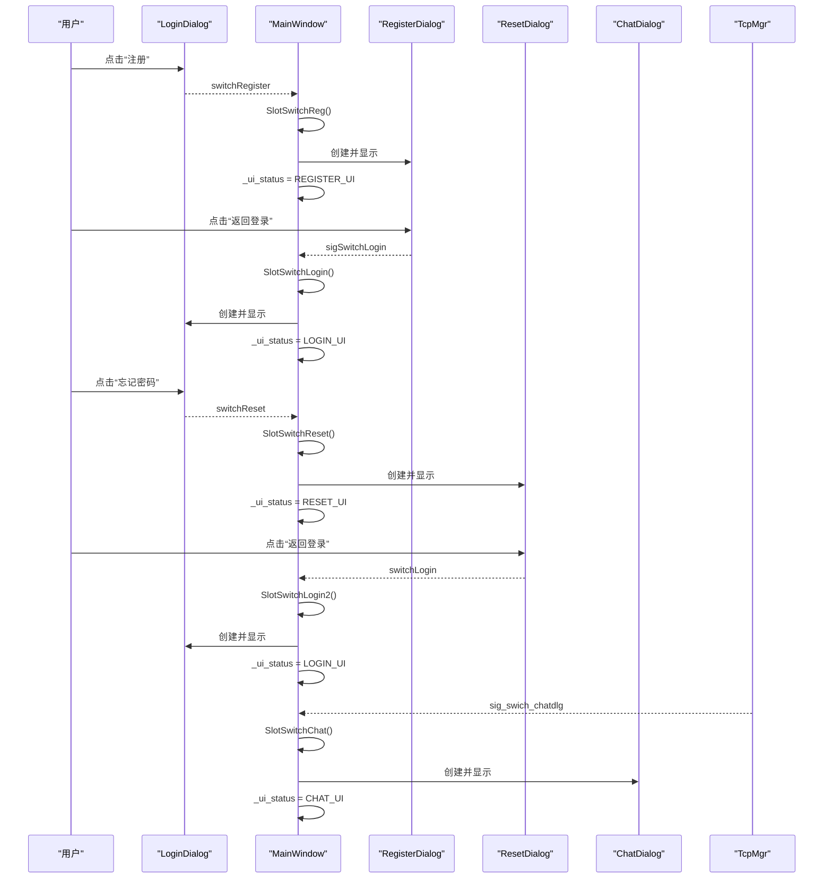
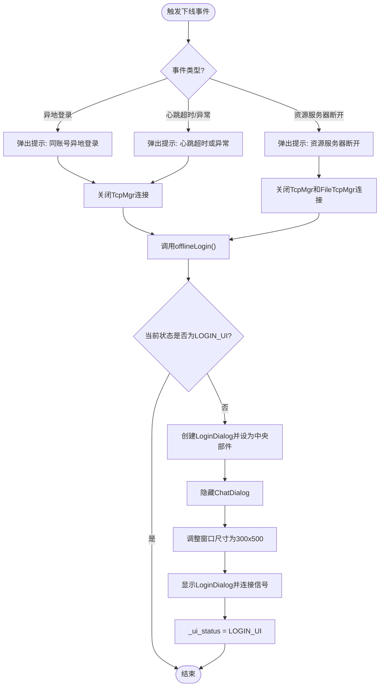
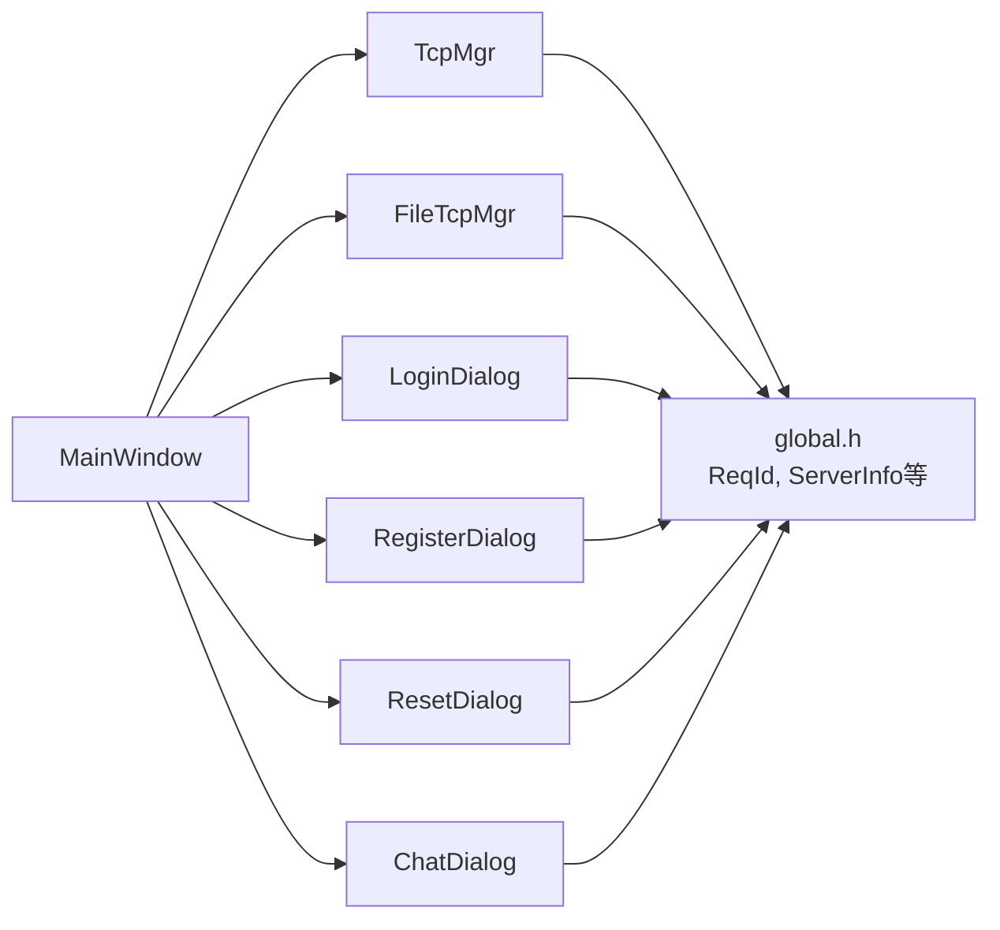

# 主窗口架构设计

<cite>
**本文引用的文件**   
- [mainwindow.h](file://client/llfcchat/include/mainwindow.h)
- [mainwindow.cpp](file://client/llfcchat/src/mainwindow.cpp)
- [mainwindow.ui](file://client/llfcchat/ui/mainwindow.ui)
- [logindialog.h](file://client/llfcchat/include/logindialog.h)
- [registerdialog.h](file://client/llfcchat/include/registerdialog.h)
- [resetdialog.h](file://client/llfcchat/include/resetdialog.h)
- [chatdialog.h](file://client/llfcchat/include/chatdialog.h)
- [tcpmgr.h](file://client/llfcchat/include/tcpmgr.h)
- [filetcpmgr.h](file://client/llfcchat/include/filetcpmgr.h)
- [global.h](file://client/llfcchat/include/global.h)
- [main.cpp](file://client/llfcchat/src/main.cpp)
</cite>

## 目录
1. [简介](#简介)
2. [项目结构](#项目结构)
3. [核心组件](#核心组件)
4. [架构总览](#架构总览)
5. [详细组件分析](#详细组件分析)
6. [依赖关系分析](#依赖关系分析)
7. [性能考量](#性能考量)
8. [故障排查指南](#故障排查指南)
9. [结论](#结论)
10. [附录](#附录)

## 简介
本文件面向LLFCChat客户端的主窗口MainWindow，系统性阐述其架构设计与实现细节。重点覆盖：
- UIStatus枚举状态管理与界面切换机制
- 主窗口生命周期管理（构造、析构、中央部件替换）
- 各对话框的实例化与显示逻辑
- 关键槽函数SlotSwitchReg、SlotSwitchLogin、SlotSwitchReset、SlotSwitchLogin2、SlotSwitchChat的实现原理与调用关系
- 离线处理机制offlineLogin的流程与触发条件
- 主窗口与子模块（TcpMgr、FileTcpMgr、各Dialog）的集成模式与事件处理机制
- 结合代码路径的最佳实践建议

## 项目结构
主窗口位于client/llfcchat目录下，UI由Qt Designer生成，业务逻辑集中在src/mainwindow.cpp中，相关对话框与网络管理器在include目录中声明。

图表来源
- [main.cpp:1-44](file://client/llfcchat/src/main.cpp#L1-L44)
- [mainwindow.h:1-57](file://client/llfcchat/include/mainwindow.h#L1-L57)
- [tcpmgr.h:1-90](file://client/llfcchat/include/tcpmgr.h#L1-L90)
- [filetcpmgr.h:1-85](file://client/llfcchat/include/filetcpmgr.h#L1-L85)

章节来源
- [mainwindow.h:1-57](file://client/llfcchat/include/mainwindow.h#L1-L57)
- [mainwindow.cpp:1-164](file://client/llfcchat/src/mainwindow.cpp#L1-L164)
- [mainwindow.ui:1-34](file://client/llfcchat/ui/mainwindow.ui#L1-L34)
- [main.cpp:1-44](file://client/llfcchat/src/main.cpp#L1-L44)

## 核心组件
- MainWindow：主窗口类，负责UI状态管理、中央部件切换、网络事件接入与离线恢复。
- UIStatus：定义四种界面状态（登录、注册、重置、聊天），用于控制窗口尺寸与当前可见对话框。
- 对话框类：LoginDialog、RegisterDialog、ResetDialog、ChatDialog，分别承载对应功能页面。
- 网络管理器：TcpMgr（聊天服务）、FileTcpMgr（资源服务），通过单例模式提供连接、发送数据与信号通知。

章节来源
- [mainwindow.h:22-54](file://client/llfcchat/include/mainwindow.h#L22-L54)
- [logindialog.h:1-47](file://client/llfcchat/include/logindialog.h#L1-L47)
- [registerdialog.h:1-55](file://client/llfcchat/include/registerdialog.h#L1-L55)
- [resetdialog.h:1-44](file://client/llfcchat/include/resetdialog.h#L1-L44)
- [chatdialog.h:1-98](file://client/llfcchat/include/chatdialog.h#L1-L98)
- [tcpmgr.h:22-90](file://client/llfcchat/include/tcpmgr.h#L22-L90)
- [filetcpmgr.h:26-85](file://client/llfcchat/include/filetcpmgr.h#L26-L85)

## 架构总览
MainWindow作为UI编排中心，使用setCentralWidget动态替换当前显示的对话框；通过Qt信号槽机制与TcpMgr、FileTcpMgr进行解耦通信；UI状态由UIStatus统一管理，确保在不同场景下窗口尺寸与行为一致。

图表来源
- [mainwindow.h:29-54](file://client/llfcchat/include/mainwindow.h#L29-L54)
- [logindialog.h:11-44](file://client/llfcchat/include/logindialog.h#L11-L44)
- [registerdialog.h:16-52](file://client/llfcchat/include/registerdialog.h#L16-L52)
- [resetdialog.h:11-41](file://client/llfcchat/include/resetdialog.h#L11-L41)
- [chatdialog.h:18-93](file://client/llfcchat/include/chatdialog.h#L18-L93)
- [tcpmgr.h:22-87](file://client/llfcchat/include/tcpmgr.h#L22-L87)
- [filetcpmgr.h:26-82](file://client/llfcchat/include/filetcpmgr.h#L26-L82)

## 详细组件分析

### UI状态管理与界面切换机制
- UIStatus定义了LOGIN_UI、REGISTER_UI、RESET_UI、CHAT_UI四种状态，用于标识当前主窗口显示的对话框类型。
- 每次切换时，MainWindow会：
  - 创建或复用目标对话框实例
  - 设置窗口标志为无边框样式
  - 将目标对话框设置为中央部件
  - 隐藏旧对话框并显示新对话框
  - 更新_ui_status以反映当前状态
- 不同状态下对主窗口尺寸有差异化控制：
  - 登录/注册/重置：固定尺寸（300x500）
  - 聊天：最小尺寸1050x900，最大尺寸无限制

章节来源
- [mainwindow.h:22-27](file://client/llfcchat/include/mainwindow.h#L22-L27)
- [mainwindow.cpp:41-115](file://client/llfcchat/src/mainwindow.cpp#L41-L115)
- [mainwindow.ui:13-24](file://client/llfcchat/ui/mainwindow.ui#L13-L24)

### 主窗口初始化过程
- 构造函数中：
  - 初始化_ui_status为LOGIN_UI
  - setupUi加载UI布局
  - 创建LoginDialog实例，设置无边框样式，设为中央部件并显示
  - 连接LoginDialog的信号到MainWindow的槽函数（切换到注册、重置）
  - 连接TcpMgr的信号到MainWindow的槽函数（切换聊天、下线通知、连接关闭）
  - 连接FileTcpMgr的连接关闭信号到MainWindow的槽函数

章节来源
- [mainwindow.cpp:9-34](file://client/llfcchat/src/mainwindow.cpp#L9-L34)
- [tcpmgr.h:64-87](file://client/llfcchat/include/tcpmgr.h#L64-L87)
- [filetcpmgr.h:65-82](file://client/llfcchat/include/filetcpmgr.h#L65-L82)

### 各对话框实例化与显示逻辑
- SlotSwitchReg：创建RegisterDialog，连接返回登录信号，替换中央部件，隐藏登录对话框，显示注册对话框，更新状态为REGISTER_UI。
- SlotSwitchLogin：创建新的LoginDialog，替换中央部件，隐藏注册对话框，显示登录对话框，重新连接信号，更新状态为LOGIN_UI。
- SlotSwitchReset：创建ResetDialog，替换中央部件，隐藏登录对话框，显示重置对话框，连接返回登录信号，更新状态为RESET_UI。
- SlotSwitchLogin2：从重置界面返回登录，创建新的LoginDialog，替换中央部件，隐藏重置对话框，显示登录对话框，重新连接信号，更新状态为LOGIN_UI。
- SlotSwitchChat：创建ChatDialog，替换中央部件，隐藏登录对话框，显示聊天对话框，调整窗口尺寸，更新状态为CHAT_UI，并调用loadChatList加载聊天列表。

章节来源
- [mainwindow.cpp:41-115](file://client/llfcchat/src/mainwindow.cpp#L41-L115)

### 槽函数实现原理与调用关系
- SlotSwitchReg：响应LoginDialog::switchRegister信号，切换到注册界面。
- SlotSwitchLogin：响应RegisterDialog::sigSwitchLogin信号，返回登录界面。
- SlotSwitchReset：响应LoginDialog::switchReset信号，切换到重置界面。
- SlotSwitchLogin2：响应ResetDialog::switchLogin信号，返回登录界面。
- SlotSwitchChat：响应TcpMgr::sig_swich_chatdlg信号，切换到聊天界面。

图表来源
- [mainwindow.cpp:41-115](file://client/llfcchat/src/mainwindow.cpp#L41-L115)
- [logindialog.h:38-43](file://client/llfcchat/include/logindialog.h#L38-L43)
- [registerdialog.h:50-52](file://client/llfcchat/include/registerdialog.h#L50-L52)
- [resetdialog.h:39-41](file://client/llfcchat/include/resetdialog.h#L39-L41)
- [tcpmgr.h:68-68](file://client/llfcchat/include/tcpmgr.h#L68-L68)

### 离线处理机制offlineLogin
- 触发条件：
  - 同账号异地登录：TcpMgr::sig_notify_offline
  - 心跳超时或异常连接：TcpMgr::sig_connection_closed
  - 资源服务器断开：FileTcpMgr::sig_connection_closed
- 处理流程：
  - 弹出提示消息框告知用户下线原因
  - 关闭TcpMgr和FileTcpMgr的连接
  - 调用offlineLogin()恢复到登录界面
- offlineLogin内部逻辑：
  - 如果当前已在登录界面则直接返回
  - 创建新的LoginDialog，设置为中央部件
  - 隐藏ChatDialog，调整窗口尺寸为登录界面尺寸
  - 显示LoginDialog并重新连接信号
  - 更新_ui_status为LOGIN_UI

图表来源
- [mainwindow.cpp:117-161](file://client/llfcchat/src/mainwindow.cpp#L117-L161)
- [tcpmgr.h:76-77](file://client/llfcchat/include/tcpmgr.h#L76-L77)
- [filetcpmgr.h:69-69](file://client/llfcchat/include/filetcpmgr.h#L69-L69)

### 主窗口与子模块的集成模式
- 信号槽解耦：MainWindow通过connect订阅TcpMgr和FileTcpMgr的信号，避免直接耦合。
- 单例模式：TcpMgr和FileTcpMgr使用Singleton模板，全局唯一实例，便于跨模块访问。
- 中央部件替换：通过setCentralWidget动态切换不同对话框，实现多界面管理。
- 生命周期管理：每个对话框由MainWindow创建和管理，确保正确的显示/隐藏顺序。

章节来源
- [tcpmgr.h:22-33](file://client/llfcchat/include/tcpmgr.h#L22-L33)
- [filetcpmgr.h:26-42](file://client/llfcchat/include/filetcpmgr.h#L26-L42)
- [mainwindow.cpp:21-33](file://client/llfcchat/src/mainwindow.cpp#L21-L33)

## 依赖关系分析
MainWindow依赖于多个子模块，形成清晰的层次结构：

图表来源
- [mainwindow.h:4-8](file://client/llfcchat/include/mainwindow.h#L4-L8)
- [tcpmgr.h:4-8](file://client/llfcchat/include/tcpmgr.h#L4-L8)
- [filetcpmgr.h:4-9](file://client/llfcchat/include/filetcpmgr.h#L4-L9)
- [global.h:43-88](file://client/llfcchat/include/global.h#L43-L88)

章节来源
- [mainwindow.h:1-57](file://client/llfcchat/include/mainwindow.h#L1-L57)
- [tcpmgr.h:1-90](file://client/llfcchat/include/tcpmgr.h#L1-L90)
- [filetcpmgr.h:1-85](file://client/llfcchat/include/filetcpmgr.h#L1-L85)
- [global.h:1-296](file://client/llfcchat/include/global.h#L1-L296)

## 性能考量
- 内存管理：MainWindow负责创建和销毁对话框实例，避免内存泄漏。
- 网络优化：TcpMgr和FileTcpMgr使用队列管理发送数据，避免阻塞UI线程。
- 界面切换：使用setCentralWidget而非show/hide，减少不必要的重绘。
- 信号连接：仅在必要时连接信号，避免重复连接导致的性能问题。

[本节为通用性能指导，不直接分析具体文件]

## 故障排查指南
- 界面无法切换：检查信号是否正确连接，确认_ui_status状态是否更新。
- 网络连接失败：查看TcpMgr和FileTcpMgr的信号是否正常发出，检查网络连接状态。
- 内存泄漏：确保对话框实例正确释放，避免循环引用。
- 窗口尺寸异常：检查不同状态下的尺寸设置逻辑。

章节来源
- [mainwindow.cpp:21-34](file://client/llfcchat/src/mainwindow.cpp#L21-L34)
- [tcpmgr.h:64-87](file://client/llfcchat/include/tcpmgr.h#L64-L87)
- [filetcpmgr.h:65-82](file://client/llfcchat/include/filetcpmgr.h#L65-L82)

## 结论
MainWindow作为LLFCChat的核心UI控制器，通过清晰的状态管理和信号槽机制，实现了多界面的无缝切换和网络事件的统一处理。其架构设计遵循了高内聚低耦合的原则，便于维护和扩展。通过合理的内存管理和性能优化，确保了应用的稳定性和用户体验。

[本节为总结性内容，不直接分析具体文件]

## 附录
- 最佳实践建议：
  - 使用智能指针管理动态分配的对话框实例
  - 避免在UI线程执行耗时操作
  - 合理使用Qt的信号槽机制进行模块间通信
  - 保持UI状态的一致性，避免状态混乱

[本节为补充说明，不直接分析具体文件]