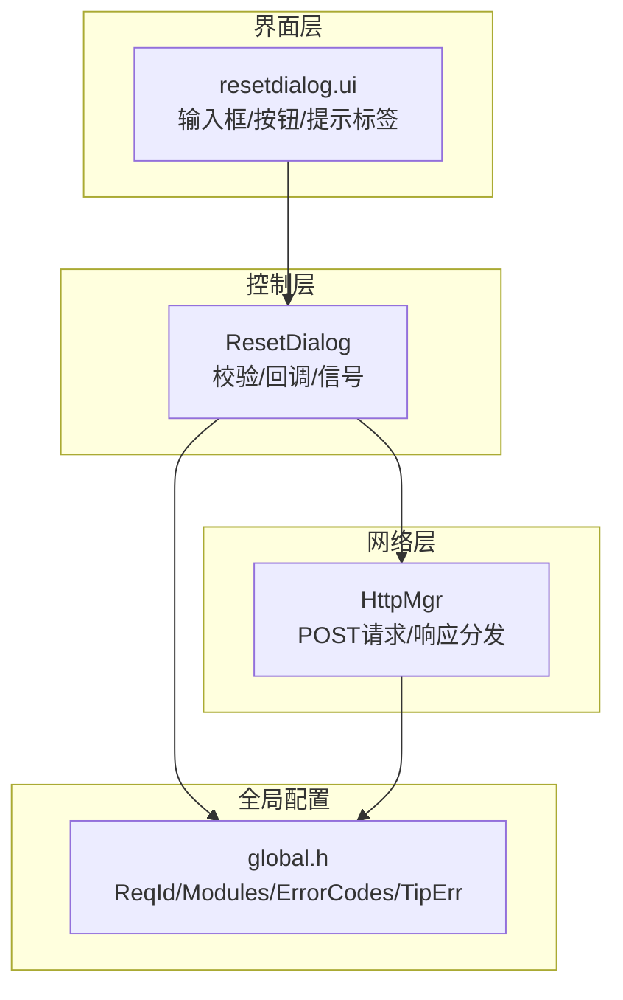
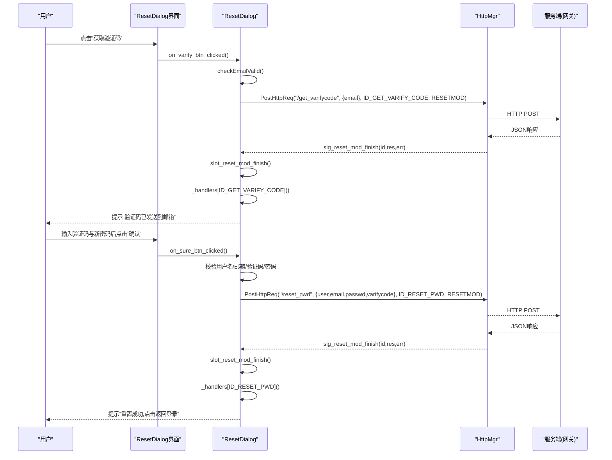
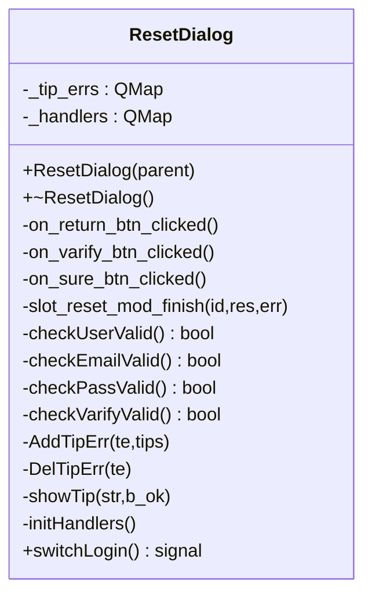
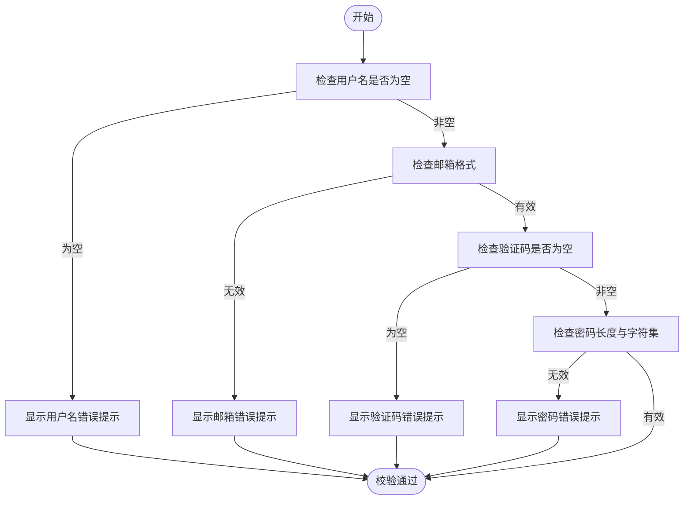
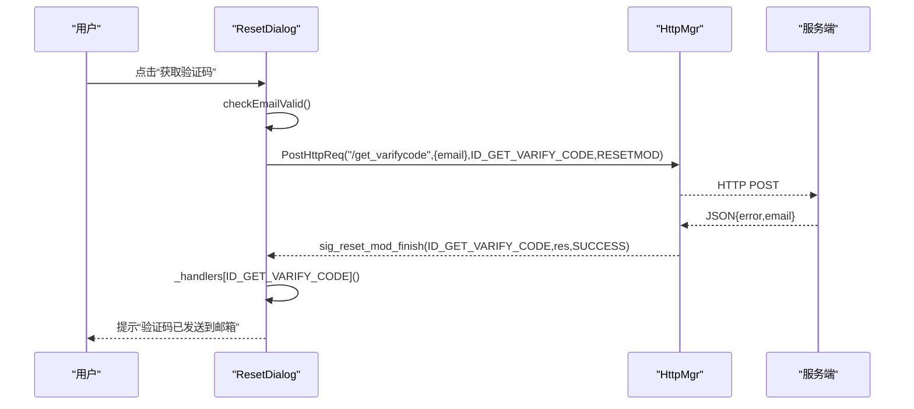
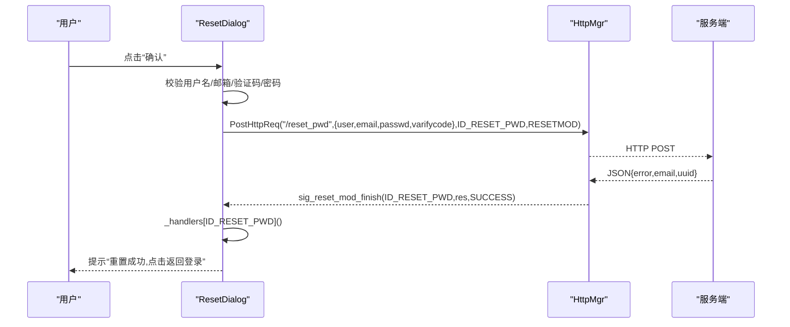
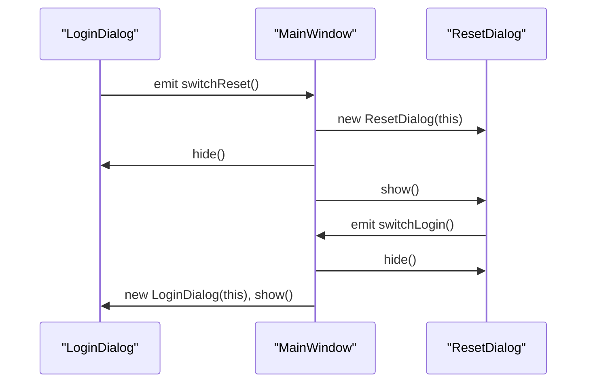
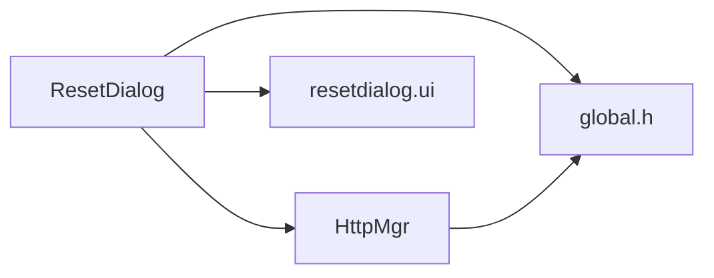

# 密码重置对话框实现

<cite>
**本文引用的文件**
- [resetdialog.h](file://client/llfcchat/include/resetdialog.h)
- [resetdialog.cpp](file://client/llfcchat/src/resetdialog.cpp)
- [resetdialog.ui](file://client/llfcchat/ui/resetdialog.ui)
- [logindialog.h](file://client/llfcchat/include/logindialog.h)
- [logindialog.cpp](file://client/llfcchat/src/logindialog.cpp)
- [mainwindow.cpp](file://client/llfcchat/src/mainwindow.cpp)
- [global.h](file://client/llfcchat/include/global.h)
- [httpmgr.h](file://client/llfcchat/include/httpmgr.h)
- [httpmgr.cpp](file://client/llfcchat/src/httpmgr.cpp)
- [timerbtn.h](file://client/llfcchat/include/timerbtn.h)
</cite>

## 目录
1. [简介](#简介)
2. [项目结构](#项目结构)
3. [核心组件](#核心组件)
4. [架构总览](#架构总览)
5. [详细组件分析](#详细组件分析)
6. [依赖关系分析](#依赖关系分析)
7. [性能考虑](#性能考虑)
8. [故障排查指南](#故障排查指南)
9. [结论](#结论)
10. [附录](#附录)

## 简介
本文件面向LLFCChat客户端的“密码重置”功能，围绕ResetDialog类进行深度解析。内容涵盖：
- 邮箱、验证码、用户名、新密码等表单字段的验证规则与错误提示
- 验证码获取流程（HTTP请求）与响应处理
- 密码重置提交流程（含密码异或加密）与成功反馈
- 与登录对话框的集成方式及重置完成后的自动跳转逻辑
- 错误处理策略与用户操作引导
- 完整的代码级流程图与交互时序图

## 项目结构
密码重置对话框位于客户端UI层，由Qt UI文件生成界面，C++类负责事件绑定、校验与网络调用。整体结构如下：
- UI层：resetdialog.ui定义输入控件与布局
- 控制层：ResetDialog类处理用户交互、校验、网络请求与回调
- 网络层：HttpMgr统一封装HTTP POST请求与响应分发
- 全局常量：ReqId、Modules、ErrorCodes、TipErr等枚举与工具函数

**图表来源**
- [resetdialog.ui:1-317](file://client/llfcchat/ui/resetdialog.ui#L1-L317)
- [resetdialog.h:1-44](file://client/llfcchat/include/resetdialog.h#L1-L44)
- [httpmgr.h:1-34](file://client/llfcchat/include/httpmgr.h#L1-L34)
- [global.h:43-111](file://client/llfcchat/include/global.h#L43-L111)

**章节来源**
- [resetdialog.ui:1-317](file://client/llfcchat/ui/resetdialog.ui#L1-L317)
- [resetdialog.h:1-44](file://client/llfcchat/include/resetdialog.h#L1-L44)
- [httpmgr.h:1-34](file://client/llfcchat/include/httpmgr.h#L1-L34)
- [global.h:43-111](file://client/llfcchat/include/global.h#L43-L111)

## 核心组件
- ResetDialog：密码重置对话框的核心控制器，负责：
  - 输入字段实时校验（用户名、邮箱、验证码、新密码）
  - 发送验证码请求与重置密码请求
  - 统一处理HTTP响应并展示提示
  - 通过信号触发返回登录界面
- HttpMgr：统一的HTTP管理器，负责：
  - 构造POST请求与JSON序列化
  - 根据模块名分发响应信号到对应业务模块
- 全局枚举与工具：
  - ReqId：区分不同请求类型（如获取验证码、重置密码）
  - Modules：区分模块（注册、重置、登录）
  - ErrorCodes：错误码（成功、网络错误、JSON解析错误）
  - TipErr：提示错误类型映射
  - xorString：对密码进行简单异或编码传输

**章节来源**
- [resetdialog.cpp:1-252](file://client/llfcchat/src/resetdialog.cpp#L1-L252)
- [httpmgr.cpp:1-62](file://client/llfcchat/src/httpmgr.cpp#L1-L62)
- [global.h:43-111](file://client/llfcchat/include/global.h#L43-L111)

## 架构总览
下图展示了从用户点击“获取验证码”到收到服务器响应，再到提交重置密码的完整交互流程。

**图表来源**
- [resetdialog.cpp:50-92](file://client/llfcchat/src/resetdialog.cpp#L50-L92)
- [resetdialog.cpp:221-252](file://client/llfcchat/src/resetdialog.cpp#L221-L252)
- [httpmgr.cpp:8-38](file://client/llfcchat/src/httpmgr.cpp#L8-L38)

## 详细组件分析

### ResetDialog类设计
ResetDialog继承自QDialog，包含以下关键能力：
- 输入校验：checkUserValid、checkEmailValid、checkPassValid、checkVarifyValid
- 提示管理：AddTipErr/DelTipErr/showTip
- 回调处理：initHandlers注册ID_GET_VARIFY_CODE与ID_RESET_PWD的处理逻辑
- 网络交互：通过HttpMgr发送请求，监听sig_reset_mod_finish信号
- 界面导航：on_return_btn_clicked触发switchLogin信号返回登录界面

**图表来源**
- [resetdialog.h:11-41](file://client/llfcchat/include/resetdialog.h#L11-L41)
- [resetdialog.cpp:8-36](file://client/llfcchat/src/resetdialog.cpp#L8-L36)

**章节来源**
- [resetdialog.h:11-41](file://client/llfcchat/include/resetdialog.h#L11-L41)
- [resetdialog.cpp:8-36](file://client/llfcchat/src/resetdialog.cpp#L8-L36)

### 表单验证规则与错误提示
- 用户名：非空校验
- 邮箱：正则匹配基本邮箱格式
- 验证码：非空校验
- 新密码：长度6~15，仅允许字母、数字与部分特殊字符（!@#$%^&*.）
- 错误提示：使用TipErr枚举映射错误类型，统一在err_tip标签显示，支持状态切换（正常/错误）

**图表来源**
- [resetdialog.cpp:94-161](file://client/llfcchat/src/resetdialog.cpp#L94-L161)

**章节来源**
- [resetdialog.cpp:94-161](file://client/llfcchat/src/resetdialog.cpp#L94-L161)

### 验证码获取与处理流程
- 用户在邮箱输入完成后点击“获取验证码”
- 校验邮箱格式通过后，构造JSON对象包含email字段
- 通过HttpMgr发送POST请求至/gate_url_prefix+"/get_varifycode"
- 接收响应后解析JSON，若error为SUCCESS则提示“验证码已发送到邮箱”

**图表来源**
- [resetdialog.cpp:50-64](file://client/llfcchat/src/resetdialog.cpp#L50-L64)
- [resetdialog.cpp:183-192](file://client/llfcchat/src/resetdialog.cpp#L183-L192)
- [httpmgr.cpp:8-38](file://client/llfcchat/src/httpmgr.cpp#L8-L38)

**章节来源**
- [resetdialog.cpp:50-64](file://client/llfcchat/src/resetdialog.cpp#L50-L64)
- [resetdialog.cpp:183-192](file://client/llfcchat/src/resetdialog.cpp#L183-L192)
- [httpmgr.cpp:8-38](file://client/llfcchat/src/httpmgr.cpp#L8-L38)

### 密码重置提交与成功反馈
- 用户填写用户名、邮箱、验证码、新密码后点击“确认”
- 依次校验所有字段，全部通过后构造JSON对象包含user、email、passwd（异或编码）、varifycode
- 通过HttpMgr发送POST请求至/gate_url_prefix+"/reset_pwd"
- 接收响应后解析JSON，若error为SUCCESS则提示“重置成功,点击返回登录”，并打印email与uuid用于调试

**图表来源**
- [resetdialog.cpp:221-252](file://client/llfcchat/src/resetdialog.cpp#L221-L252)
- [resetdialog.cpp:195-206](file://client/llfcchat/src/resetdialog.cpp#L195-L206)
- [httpmgr.cpp:8-38](file://client/llfcchat/src/httpmgr.cpp#L8-L38)

**章节来源**
- [resetdialog.cpp:221-252](file://client/llfcchat/src/resetdialog.cpp#L221-L252)
- [resetdialog.cpp:195-206](file://client/llfcchat/src/resetdialog.cpp#L195-L206)
- [httpmgr.cpp:8-38](file://client/llfcchat/src/httpmgr.cpp#L8-L38)

### 与登录对话框的集成与自动跳转
- 登录界面提供“忘记密码”入口，触发switchReset信号
- MainWindow监听该信号，创建并显示ResetDialog，同时隐藏LoginDialog
- ResetDialog提供switchLogin信号，MainWindow监听后销毁当前重置界面并重新创建LoginDialog，实现自动跳转

**图表来源**
- [logindialog.cpp:125-129](file://client/llfcchat/src/logindialog.cpp#L125-L129)
- [mainwindow.cpp:73-85](file://client/llfcchat/src/mainwindow.cpp#L73-L85)
- [mainwindow.cpp:88-102](file://client/llfcchat/src/mainwindow.cpp#L88-L102)

**章节来源**
- [logindialog.cpp:125-129](file://client/llfcchat/src/logindialog.cpp#L125-L129)
- [mainwindow.cpp:73-85](file://client/llfcchat/src/mainwindow.cpp#L73-L85)
- [mainwindow.cpp:88-102](file://client/llfcchat/src/mainwindow.cpp#L88-L102)

### TimerBtn验证码倒计时按钮
- TimerBtn继承QPushButton，内部维护定时器与计数器
- 重写mouseReleaseEvent以实现点击后进入倒计时状态，防止重复获取验证码

**章节来源**
- [timerbtn.h:1-20](file://client/llfcchat/include/timerbtn.h#L1-L20)

## 依赖关系分析
ResetDialog依赖以下组件：
- Qt框架：QDialog、QLineEdit、QJsonObject、QRegularExpression等
- HttpMgr：统一HTTP请求封装
- global.h：ReqId、Modules、ErrorCodes、TipErr等枚举与xorString工具函数
- resetdialog.ui：界面布局与控件定义

**图表来源**
- [resetdialog.h:1-44](file://client/llfcchat/include/resetdialog.h#L1-L44)
- [httpmgr.h:1-34](file://client/llfcchat/include/httpmgr.h#L1-L34)
- [global.h:43-111](file://client/llfcchat/include/global.h#L43-L111)
- [resetdialog.ui:1-317](file://client/llfcchat/ui/resetdialog.ui#L1-L317)

**章节来源**
- [resetdialog.h:1-44](file://client/llfcchat/include/resetdialog.h#L1-L44)
- [httpmgr.h:1-34](file://client/llfcchat/include/httpmgr.h#L1-L34)
- [global.h:43-111](file://client/llfcchat/include/global.h#L43-L111)
- [resetdialog.ui:1-317](file://client/llfcchat/ui/resetdialog.ui#L1-L317)

## 性能考虑
- 表单校验在editingFinished事件中触发，避免频繁输入过程中的重复计算
- HTTP请求采用异步模型，通过信号槽机制解耦UI与网络层
- 错误提示集中管理，减少UI刷新开销
- 密码异或编码轻量快速，适合小字符串传输

[本节为通用指导，不直接分析具体文件]

## 故障排查指南
- 网络请求错误：检查HttpMgr::PostHttpReq是否成功发送，确认gate_url_prefix配置正确
- JSON解析错误：确认服务端返回JSON格式是否符合预期，检查error字段值
- 邮箱格式错误：检查正则表达式是否匹配目标邮箱格式
- 密码格式错误：确认密码长度与字符集是否符合要求
- 验证码未收到：检查邮箱服务是否正常，确认/varifycode字段是否正确传递

**章节来源**
- [httpmgr.cpp:20-37](file://client/llfcchat/src/httpmgr.cpp#L20-L37)
- [resetdialog.cpp:66-92](file://client/llfcchat/src/resetdialog.cpp#L66-L92)
- [resetdialog.cpp:134-149](file://client/llfcchat/src/resetdialog.cpp#L134-L149)
- [resetdialog.cpp:106-130](file://client/llfcchat/src/resetdialog.cpp#L106-L130)

## 结论
ResetDialog实现了完整的密码重置流程，包括严格的表单校验、安全的密码传输（异或编码）、清晰的错误提示与友好的用户引导。通过与HttpMgr和MainWindow的协作，实现了与登录界面的无缝集成与自动跳转。整体设计清晰、职责分离良好，便于后续扩展与维护。

[本节为总结性内容，不直接分析具体文件]

## 附录
- 相关枚举定义位置：
  - ReqId：[global.h:43-88](file://client/llfcchat/include/global.h#L43-L88)
  - Modules：[global.h:97-101](file://client/llfcchat/include/global.h#L97-L101)
  - ErrorCodes：[global.h:91-95](file://client/llfcchat/include/global.h#L91-L95)
  - TipErr：[global.h:103-111](file://client/llfcchat/include/global.h#L103-L111)
- 密码异或编码实现：[global.cpp:12-22](file://client/llfcchat/src/global.cpp#L12-L22)
- HTTP请求封装：[httpmgr.cpp:8-38](file://client/llfcchat/src/httpmgr.cpp#L8-L38)