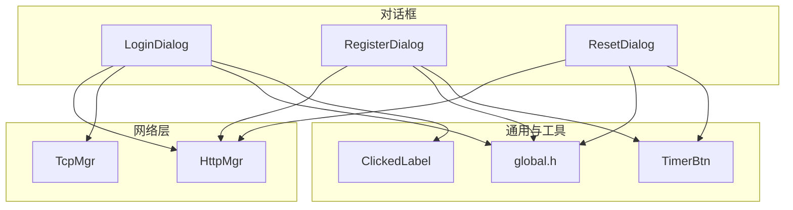
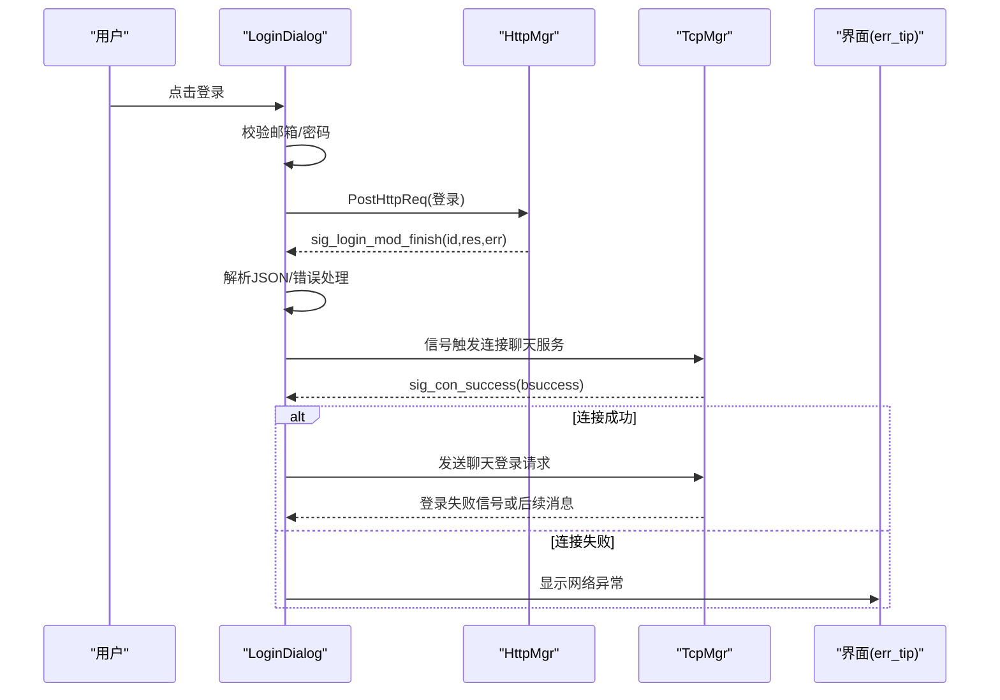
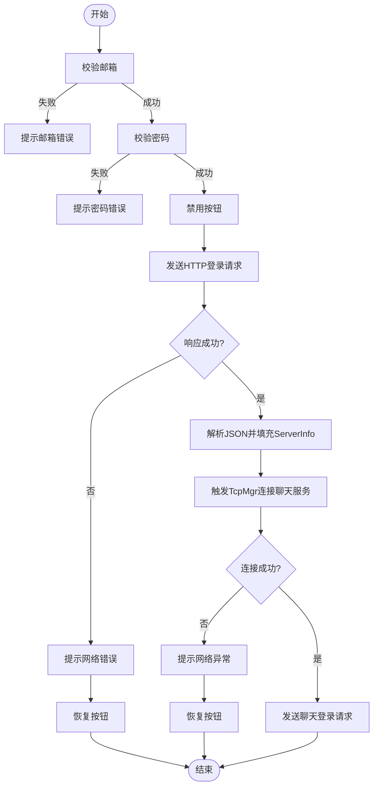
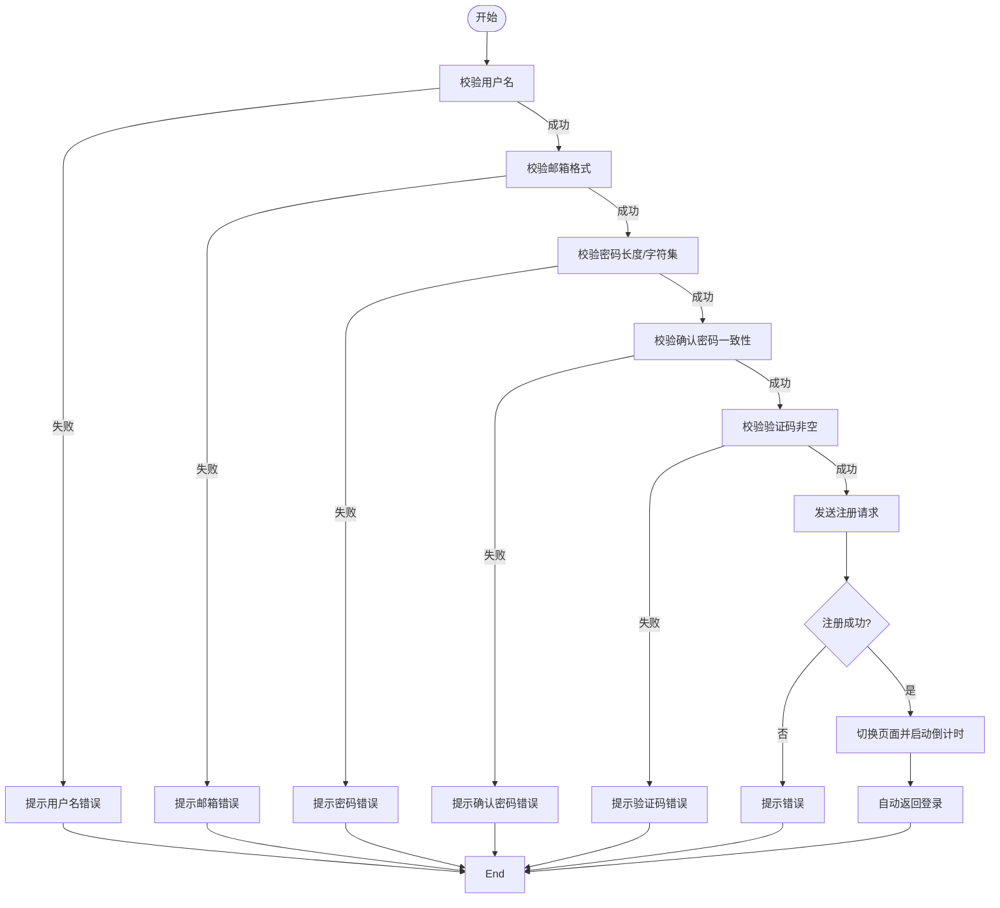
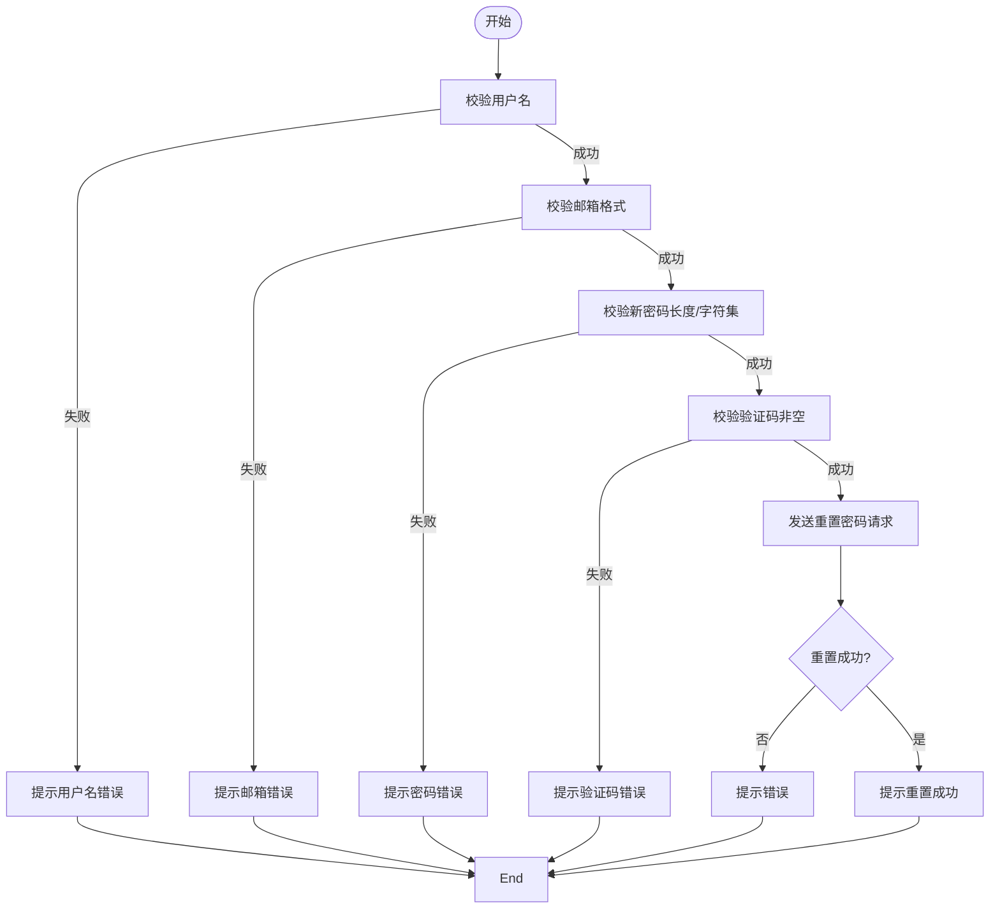
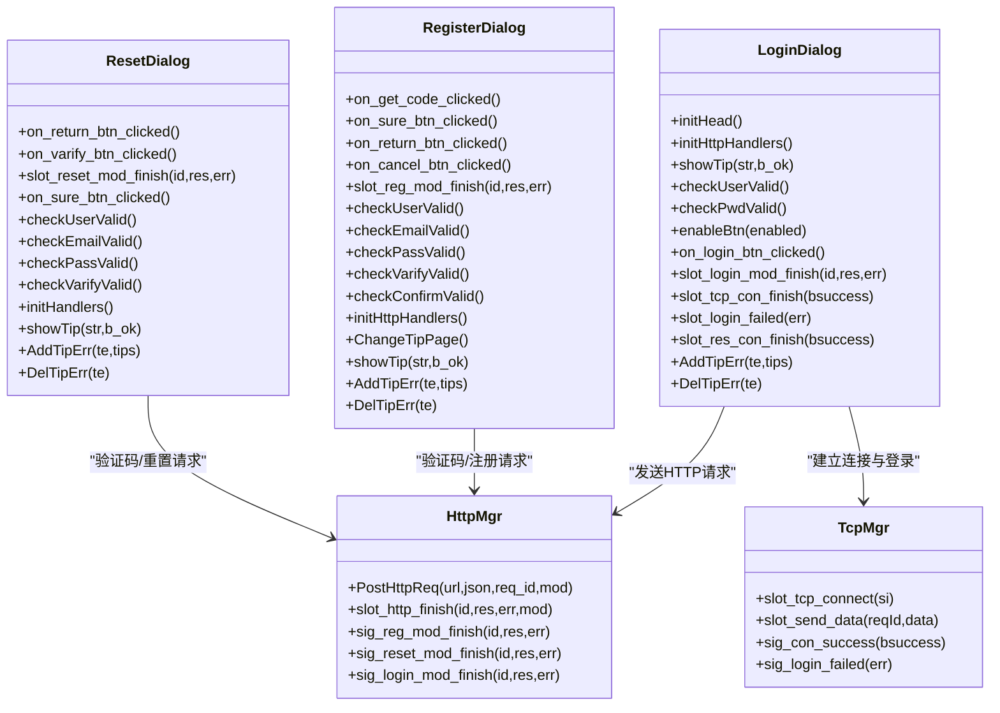

# 对话框设计模式

<cite>
**本文引用的文件**   
- [logindialog.h](file://client/llfcchat/include/logindialog.h)
- [logindialog.cpp](file://client/llfcchat/src/logindialog.cpp)
- [registerdialog.h](file://client/llfcchat/include/registerdialog.h)
- [registerdialog.cpp](file://client/llfcchat/src/registerdialog.cpp)
- [resetdialog.h](file://client/llfcchat/include/resetdialog.h)
- [resetdialog.cpp](file://client/llfcchat/src/resetdialog.cpp)
- [logindialog.ui](file://client/llfcchat/ui/logindialog.ui)
- [registerdialog.ui](file://client/llfcchat/ui/registerdialog.ui)
- [resetdialog.ui](file://client/llfcchat/ui/resetdialog.ui)
- [global.h](file://client/llfcchat/include/global.h)
- [httpmgr.h](file://client/llfcchat/include/httpmgr.h)
- [tcpmgr.h](file://client/llfcchat/include/tcpmgr.h)
- [timerbtn.h](file://client/llfcchat/include/timerbtn.h)
- [clickedlabel.h](file://client/llfcchat/include/clickedlabel.h)
</cite>

## 目录
1. [简介](#简介)
2. [项目结构](#项目结构)
3. [核心组件](#核心组件)
4. [架构总览](#架构总览)
5. [详细组件分析](#详细组件分析)
6. [依赖关系分析](#依赖关系分析)
7. [性能与可用性考虑](#性能与可用性考虑)
8. [故障排查指南](#故障排查指南)
9. [结论](#结论)
10. [附录：界面布局说明](#附录界面布局说明)

## 简介
本文件面向 LLFCChat 客户端的三类对话框：登录、注册、密码重置。文档从设计模式出发，系统阐述表单验证、网络请求处理、错误提示机制、信号槽连接、数据绑定、模态显示与结果返回机制，并给出对话框间通信与数据传递的最佳实践。同时提供完整的代码级流程图与时序图，帮助读者快速理解实现细节与扩展方式。

## 项目结构
- 对话框类位于 include 与 src 目录，UI 定义在 ui 目录中，通过 Qt Designer 生成。
- 通用类型、枚举与全局常量集中在 global.h；HTTP 与 TCP 管理模块分别由 httpmgr.h 与 tcpmgr.h 提供。
- 自定义控件 TimerBtn（验证码倒计时按钮）与 ClickedLabel（可点击标签）用于增强交互体验。

图表来源 
- [logindialog.h:11-44](file://client/llfcchat/include/logindialog.h#L11-L44)
- [registerdialog.h:16-52](file://client/llfcchat/include/registerdialog.h#L16-L52)
- [resetdialog.h:11-41](file://client/llfcchat/include/resetdialog.h#L11-L41)
- [httpmgr.h:11-31](file://client/llfcchat/include/httpmgr.h#L11-L31)
- [tcpmgr.h:22-87](file://client/llfcchat/include/tcpmgr.h#L22-L87)
- [global.h:43-111](file://client/llfcchat/include/global.h#L43-L111)
- [timerbtn.h:6-17](file://client/llfcchat/include/timerbtn.h#L6-L17)
- [clickedlabel.h:6-35](file://client/llfcchat/include/clickedlabel.h#L6-L35)

章节来源
- [logindialog.h:11-44](file://client/llfcchat/include/logindialog.h#L11-L44)
- [registerdialog.h:16-52](file://client/llfcchat/include/registerdialog.h#L16-L52)
- [resetdialog.h:11-41](file://client/llfcchat/include/resetdialog.h#L11-L41)
- [httpmgr.h:11-31](file://client/llfcchat/include/httpmgr.h#L11-L31)
- [tcpmgr.h:22-87](file://client/llfcchat/include/tcpmgr.h#L22-L87)
- [global.h:43-111](file://client/llfcchat/include/global.h#L43-L111)
- [timerbtn.h:6-17](file://client/llfcchat/include/timerbtn.h#L6-L17)
- [clickedlabel.h:6-35](file://client/llfcchat/include/clickedlabel.h#L6-L35)

## 核心组件
- LoginDialog：负责邮箱与密码输入校验、HTTP 登录请求、TCP 长连接建立、资源服务器连接与聊天服务登录流程。
- RegisterDialog：负责用户名、邮箱、密码强度与一致性校验、验证码获取与提交、注册成功后的倒计时跳转。
- ResetDialog：负责用户名、邮箱、验证码与新密码校验、重置密码请求与结果反馈。
- HttpMgr：统一封装 HTTP POST 请求，按 ReqId 分发回调，向调用方广播对应模块完成信号。
- TcpMgr：封装 TCP 连接、发送队列、消息处理与事件信号，供登录成功后发起聊天服务登录。
- 通用类型与枚举：ReqId、ErrorCodes、Modules、TipErr、ServerInfo 等，贯穿各对话框的网络与提示体系。

章节来源
- [logindialog.cpp:175-262](file://client/llfcchat/src/logindialog.cpp#L175-L262)
- [registerdialog.cpp:319-375](file://client/llfcchat/src/registerdialog.cpp#L319-L375)
- [resetdialog.cpp:221-252](file://client/llfcchat/src/resetdialog.cpp#L221-L252)
- [httpmgr.h:11-31](file://client/llfcchat/include/httpmgr.h#L11-L31)
- [tcpmgr.h:22-87](file://client/llfcchat/include/tcpmgr.h#L22-L87)
- [global.h:43-111](file://client/llfcchat/include/global.h#L43-L111)

## 架构总览
登录、注册、重置均遵循“输入校验 → 构造 JSON → 通过 HttpMgr 发送 → 解析响应 → 提示用户 → 触发后续动作”的统一流程。登录成功后，LoginDialog 通过信号驱动 TcpMgr 建立聊天服务连接，再发送聊天登录请求。

图表来源 
- [logindialog.cpp:175-262](file://client/llfcchat/src/logindialog.cpp#L175-L262)
- [httpmgr.h:11-31](file://client/llfcchat/include/httpmgr.h#L11-L31)
- [tcpmgr.h:22-87](file://client/llfcchat/include/tcpmgr.h#L22-L87)

章节来源
- [logindialog.cpp:175-262](file://client/llfcchat/src/logindialog.cpp#L175-L262)
- [httpmgr.h:11-31](file://client/llfcchat/include/httpmgr.h#L11-L31)
- [tcpmgr.h:22-87](file://client/llfcchat/include/tcpmgr.h#L22-L87)

## 详细组件分析

### LoginDialog 登录对话框
- 表单验证
  - 邮箱非空校验。
  - 密码长度与字符集正则校验（6~15位，允许字母数字及指定特殊字符）。
  - 使用 AddTipErr/DelTipErr 统一管理错误提示，避免重复提示。
- 网络请求处理
  - 点击登录后禁用按钮，防止重复提交。
  - 通过 HttpMgr::PostHttpReq 发送登录请求，携带 email 与加密后的 passwd。
  - 收到回包后解析 JSON，提取 uid、token、聊天/资源服务器地址端口，构建 ServerInfo。
  - 发出信号触发 TcpMgr 建立聊天服务连接。
- 错误提示机制
  - showTip 根据状态设置样式属性并刷新 QSS。
  - 网络错误、JSON 解析错误、登录失败均有明确提示。
- 后续流程
  - 聊天服务连接成功后，构造聊天登录 JSON 并通过 TcpMgr 发送。
  - 资源服务器连接成功后，进入下一步业务逻辑。

图表来源 
- [logindialog.cpp:131-195](file://client/llfcchat/src/logindialog.cpp#L131-L195)
- [logindialog.cpp:197-262](file://client/llfcchat/src/logindialog.cpp#L197-L262)

章节来源
- [logindialog.cpp:131-195](file://client/llfcchat/src/logindialog.cpp#L131-L195)
- [logindialog.cpp:197-262](file://client/llfcchat/src/logindialog.cpp#L197-L262)
- [logindialog.h:11-44](file://client/llfcchat/include/logindialog.h#L11-L44)

### RegisterDialog 注册对话框
- 表单验证
  - 用户名非空校验。
  - 邮箱格式正则校验。
  - 密码长度与字符集正则校验，且与确认密码一致。
  - 验证码非空校验。
  - 每个字段在 editingFinished 时即时校验并更新提示。
- 验证码流程
  - 点击“获取”按钮先校验邮箱，通过后发送验证码请求。
  - 使用 TimerBtn 控制倒计时，防止频繁请求。
- 注册提交
  - 全部校验通过后，构造包含 user、email、passwd、icon、nick、confirm、varifycode 的 JSON 并发送。
  - 成功后切换到第二页，启动倒计时自动返回登录。
- 错误提示机制
  - 统一的 AddTipErr/DelTipErr 与 showTip 管理提示文本与样式。

图表来源 
- [registerdialog.cpp:142-248](file://client/llfcchat/src/registerdialog.cpp#L142-L248)
- [registerdialog.cpp:319-375](file://client/llfcchat/src/registerdialog.cpp#L319-L375)

章节来源
- [registerdialog.cpp:142-248](file://client/llfcchat/src/registerdialog.cpp#L142-L248)
- [registerdialog.cpp:319-375](file://client/llfcchat/src/registerdialog.cpp#L319-L375)
- [registerdialog.h:16-52](file://client/llfcchat/include/registerdialog.h#L16-L52)

### ResetDialog 密码重置对话框
- 表单验证
  - 用户名非空校验。
  - 邮箱格式正则校验。
  - 新密码长度与字符集正则校验。
  - 验证码非空校验。
- 验证码流程
  - 点击“获取”按钮先校验邮箱，通过后发送验证码请求。
  - 使用 TimerBtn 控制倒计时。
- 重置提交
  - 全部校验通过后，构造包含 user、email、passwd、varifycode 的 JSON 并发送。
  - 成功后提示重置成功并可返回登录。
- 错误提示机制
  - 统一的 AddTipErr/DelTipErr 与 showTip 管理提示文本与样式。

图表来源 
- [resetdialog.cpp:94-161](file://client/llfcchat/src/resetdialog.cpp#L94-L161)
- [resetdialog.cpp:221-252](file://client/llfcchat/src/resetdialog.cpp#L221-L252)

章节来源
- [resetdialog.cpp:94-161](file://client/llfcchat/src/resetdialog.cpp#L94-L161)
- [resetdialog.cpp:221-252](file://client/llfcchat/src/resetdialog.cpp#L221-L252)
- [resetdialog.h:11-41](file://client/llfcchat/include/resetdialog.h#L11-L41)

### 通用设计模式与最佳实践
- 信号槽连接
  - 对话框内部将 UI 控件信号连接到私有槽函数，如 on_login_btn_clicked、on_sure_btn_clicked。
  - 跨模块通信通过信号：switchRegister、switchReset、sig_connect_tcp、sig_connect_res_server 等。
- 数据绑定
  - 输入框的 editingFinished 信号触发实时校验，减少提交时的集中错误。
  - 使用 repolish 动态刷新 QSS，结合 property("state") 实现样式切换。
- 模态显示与结果返回
  - 对话框以 QDialog 形式呈现，通过信号通知上层切换界面或关闭当前对话框。
  - 注册成功后使用 QStackedWidget 切换页面，配合 QTimer 倒计时自动返回登录。
- 对话框间通信与数据传递
  - 登录成功后通过 _si（ServerInfo）共享聊天与资源服务器信息，经信号传递给 TcpMgr/FileTcpMgr。
  - 验证码与注册/重置流程通过 ReqId 区分不同业务，HttpMgr 按模块广播完成信号。
- 错误提示机制
  - 统一的 TipErr 枚举与 AddTipErr/DelTipErr 方法，确保同一时刻仅展示一条错误提示。
  - showTip 根据 b_ok 设置正常/错误样式，提升用户体验。

章节来源
- [logindialog.cpp:17-38](file://client/llfcchat/src/logindialog.cpp#L17-L38)
- [registerdialog.cpp:26-44](file://client/llfcchat/src/registerdialog.cpp#L26-L44)
- [resetdialog.cpp:14-34](file://client/llfcchat/src/resetdialog.cpp#L14-L34)
- [global.h:103-111](file://client/llfcchat/include/global.h#L103-L111)

## 依赖关系分析
- LoginDialog 依赖 HttpMgr 进行 HTTP 登录请求，依赖 TcpMgr 建立聊天服务连接与发送聊天登录请求。
- RegisterDialog 与 ResetDialog 依赖 HttpMgr 发送验证码与业务请求。
- 所有对话框依赖 global.h 中的 ReqId、ErrorCodes、Modules、TipErr、ServerInfo 等类型。
- TimerBtn 与 ClickedLabel 为自定义控件，增强交互体验。

图表来源 
- [logindialog.h:11-44](file://client/llfcchat/include/logindialog.h#L11-L44)
- [registerdialog.h:16-52](file://client/llfcchat/include/registerdialog.h#L16-L52)
- [resetdialog.h:11-41](file://client/llfcchat/include/resetdialog.h#L11-L41)
- [httpmgr.h:11-31](file://client/llfcchat/include/httpmgr.h#L11-L31)
- [tcpmgr.h:22-87](file://client/llfcchat/include/tcpmgr.h#L22-L87)

章节来源
- [logindialog.h:11-44](file://client/llfcchat/include/logindialog.h#L11-L44)
- [registerdialog.h:16-52](file://client/llfcchat/include/registerdialog.h#L16-L52)
- [resetdialog.h:11-41](file://client/llfcchat/include/resetdialog.h#L11-L41)
- [httpmgr.h:11-31](file://client/llfcchat/include/httpmgr.h#L11-L31)
- [tcpmgr.h:22-87](file://client/llfcchat/include/tcpmgr.h#L22-L87)

## 性能与可用性考虑
- 表单校验即时化：在 editingFinished 时触发校验，降低提交失败率，提升用户体验。
- 防重复提交：登录与验证码按钮在请求期间禁用或倒计时，避免重复请求造成资源浪费。
- 提示聚合：通过 TipErr 映射与 DelTipErr 清理，确保错误提示唯一且清晰。
- 异步网络：HttpMgr/TcpMgr 基于信号槽异步处理，避免阻塞 UI 线程。
- 样式刷新：repolish 按需刷新 QSS，减少不必要的重绘开销。

[本节为通用指导，不直接分析具体文件]

## 故障排查指南
- 网络请求错误
  - 检查 HttpMgr 是否成功发出请求，确认 URL 前缀与模块标识是否正确。
  - 查看 slot_http_finish 的错误码 ErrorCodes::ERR_NETWORK。
- JSON 解析错误
  - 确认服务端返回的 JSON 结构与字段名是否与客户端解析一致。
  - 检查 slot_login_mod_finish/slot_reg_mod_finish/slot_reset_mod_finish 的解析分支。
- 登录失败
  - 检查 TcpMgr 的 sig_login_failed 信号与错误码，定位服务端拒绝原因。
- 验证码未收到
  - 确认邮箱格式校验通过，检查 TimerBtn 倒计时是否正常。
  - 核对 get_varifycode 接口与 ReqId::ID_GET_VARIFY_CODE 的使用。

章节来源
- [logindialog.cpp:197-241](file://client/llfcchat/src/logindialog.cpp#L197-L241)
- [registerdialog.cpp:113-139](file://client/llfcchat/src/registerdialog.cpp#L113-L139)
- [resetdialog.cpp:66-92](file://client/llfcchat/src/resetdialog.cpp#L66-L92)
- [httpmgr.h:11-31](file://client/llfcchat/include/httpmgr.h#L11-L31)
- [tcpmgr.h:22-87](file://client/llfcchat/include/tcpmgr.h#L22-L87)

## 结论
LLFCChat 的登录、注册、重置对话框采用一致的“校验→请求→解析→提示→后续动作”设计模式，借助 HttpMgr/TcpMgr 的信号槽机制实现解耦与可扩展性。统一的错误提示与样式刷新策略提升了用户体验，定时器与栈式页面切换增强了交互流畅度。建议在后续迭代中继续强化输入校验的可配置性与错误信息的本地化支持。

[本节为总结性内容，不直接分析具体文件]

## 附录：界面布局说明
- 登录界面（logindialog.ui）
  - 顶部错误提示区 err_tip。
  - 头部图片区域 head_label（圆角头像）。
  - 邮箱与密码输入行，含“忘记密码”可点击标签。
  - 登录与注册按钮。
- 注册界面（registerdialog.ui）
  - 使用 QStackedWidget 管理两个页面：注册表单与成功提示页。
  - 用户名、邮箱、密码、确认密码、验证码输入行，密码可见切换图标。
  - “获取”验证码按钮（TimerBtn），确认与取消按钮。
  - 成功页显示倒计时提示与返回登录按钮。
- 重置界面（resetdialog.ui）
  - 用户名、邮箱、验证码、新密码输入行。
  - “获取”验证码按钮（TimerBtn），确认与返回按钮。
  - 顶部错误提示区 err_tip。

章节来源
- [logindialog.ui:44-341](file://client/llfcchat/ui/logindialog.ui#L44-L341)
- [registerdialog.ui:32-509](file://client/llfcchat/ui/registerdialog.ui#L32-L509)
- [resetdialog.ui:31-305](file://client/llfcchat/ui/resetdialog.ui#L31-L305)